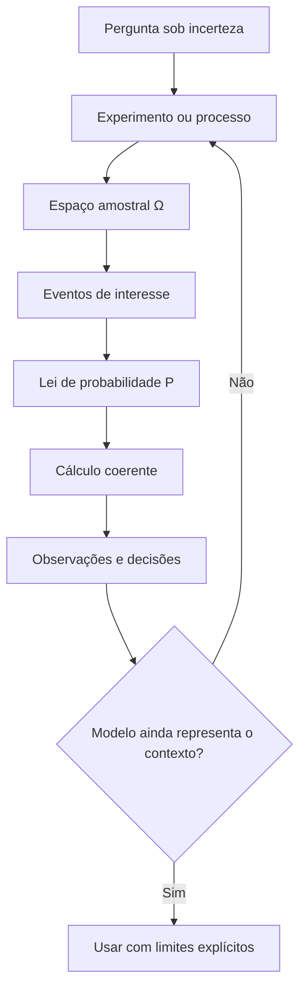
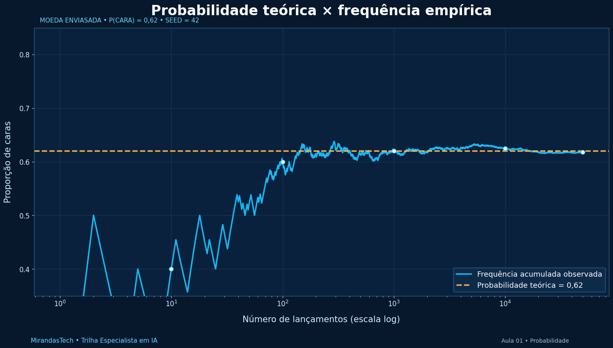

# Aula 01 — Incerteza, espaço amostral, eventos e axiomas

<!-- mirandastech-aula-v2 -->

**Trilha:** Especialista em IA  
**Módulo:** 02 · Probabilidade, Estatística e Teoria da Informação (M3)  
**Aula:** 01 de 24  
**Pré-requisitos:** aritmética básica, conjuntos e leitura de gráficos  
**Tempo sugerido:** 3 a 4 horas, incluindo atividade interativa, laboratório e exercícios  
**Objetivo central:** construir um modelo probabilístico coerente para representar incerteza e usar eventos e axiomas sem depender de fórmulas decoradas.

> **Ideia-chave:** probabilidade não é um palpite solto. É uma medida atribuída a eventos dentro de um universo de resultados explicitamente definido.

## O que você será capaz de fazer ao final

Ao concluir esta aula, você deverá conseguir:

- diferenciar experimento aleatório, resultado, espaço amostral e evento;
- traduzir frases como “A ou B”, “A e B” e “não A” para operações com conjuntos;
- definir um modelo probabilístico introdutório como $(\Omega,\mathcal F,P)$;
- explicar os três axiomas de Kolmogorov em linguagem comum;
- deduzir as regras do complemento, da monotonicidade e da união;
- reconhecer quando a regra “casos favoráveis sobre casos possíveis” pode ou não ser usada;
- comparar uma probabilidade teórica com uma frequência observada sem confundi-las;
- executar e interpretar uma simulação reproduzível em Python;
- explicar por que esses fundamentos aparecem em classificação, modelos generativos e decisões sob risco.

## Mapa da aula



---

## 1. Por que começar pela incerteza?

Imagine um sistema que analisa uma transação e produz três valores:

```text
normal       0,72
suspeita     0,21
fraude       0,07
```

Os números parecem fáceis de ler, mas surgem perguntas importantes:

- o que exatamente pode acontecer com a transação?
- as três categorias cobrem todos os resultados possíveis?
- elas são mutuamente exclusivas?
- os valores somam 1?
- `0,07` representa uma probabilidade válida ou apenas um score do modelo?
- qual evento interessa à decisão: “fraude” ou “suspeita **ou** fraude”?

Antes de discutir algoritmos, precisamos de uma linguagem para descrever resultados possíveis, agrupar resultados relevantes e atribuir medidas coerentes a esses grupos. Essa linguagem é a **teoria da probabilidade**.

Probabilidade não elimina a incerteza. Ela permite:

- declarar o que está sendo considerado possível;
- quantificar incerteza sob um modelo explícito;
- combinar eventos sem produzir contradições;
- comparar previsões com observações;
- escolher ações considerando custos e riscos.

> Um número entre 0 e 1 não vira probabilidade apenas por estar nessa escala. A interpretação depende do modelo, dos dados e de como o número foi produzido e validado.

## 2. O vocabulário que sustenta todo o módulo

Considere o lançamento de um dado comum de seis faces.

| Conceito | Símbolo | Significado | Exemplo |
|---|---:|---|---|
| **Experimento aleatório** | — | Processo cujo resultado específico não é conhecido antes da execução | Lançar o dado uma vez |
| **Resultado elementar** | $\omega$ | Um resultado individual possível | Obter a face 4 |
| **Espaço amostral** | $\Omega$ | Conjunto de todos os resultados considerados possíveis | $\{1,2,3,4,5,6\}$ |
| **Evento** | $A$ | Conjunto de resultados com uma propriedade de interesse | “resultado par” $=\{2,4,6\}$ |
| **Lei de probabilidade** | $P$ | Regra que atribui uma probabilidade a cada evento permitido | $P(A)=3/6$ para um dado justo |

O ponto mais importante é este:

$$
\text{resultado }\omega\in\Omega,
\qquad
\text{evento }A\subseteq\Omega.
$$

Um resultado é um elemento; um evento é um conjunto de elementos.

### Evento simples e evento composto

- **Evento simples:** contém um único resultado, como $\{4\}$.
- **Evento composto:** reúne vários resultados, como “obter número par”, $\{2,4,6\}$.
- **Evento certo:** é o próprio espaço amostral, $\Omega$.
- **Evento impossível:** é o conjunto vazio, $\varnothing$.

### O espaço amostral depende da pergunta

Ao lançar duas moedas, podemos registrar a ordem:

$$
\Omega_1=\{CC,CK,KC,KK\},
$$

onde $C$ significa cara e $K$, coroa.

Se a pergunta registrar apenas o **número de caras**, outro espaço pode ser útil:

$$
\Omega_2=\{0,1,2\}.
$$

Os dois modelos descrevem o mesmo procedimento em granularidades diferentes. Porém, em $\Omega_2$, os três resultados **não são equiprováveis**: uma cara pode ocorrer como $CK$ ou $KC$.

> Definir $\Omega$ não é burocracia. Uma representação inadequada pode apagar informação ou induzir a suposição errada de que todos os resultados têm a mesma chance.

## 3. Eventos são conjuntos: aprenda a traduzir frases

Ainda no dado de seis faces, defina:

$$
A=\{2,4,6\}\quad\text{(resultado par)}
$$

e

$$
B=\{4,5,6\}\quad\text{(resultado pelo menos 4)}.
$$

| Linguagem comum | Operação | Resultado no exemplo |
|---|---:|---|
| “A ou B”, incluindo a possibilidade de ambos | $A\cup B$ | $\{2,4,5,6\}$ |
| “A e B” | $A\cap B$ | $\{4,6\}$ |
| “não A” | $A^c$ | $\{1,3,5\}$ |
| “A, mas não B” | $A\setminus B$ | $\{2\}$ |
| A e B não podem ocorrer juntos | $A\cap B=\varnothing$ | eventos disjuntos |

Na probabilidade, o “ou” normalmente é **inclusivo**: $A\cup B$ contém os resultados que estão em $A$, em $B$ ou em ambos.

### Leis de De Morgan

Duas identidades evitam muitos erros:

$$
(A\cup B)^c=A^c\cap B^c
$$

e

$$
(A\cap B)^c=A^c\cup B^c.
$$

Em palavras:

- “não ocorreu A nem B” significa “não A **e** não B”;
- “não ocorreram A e B simultaneamente” significa “não A **ou** não B”.

### Fluxo para resolver um problema de eventos


## 4. O modelo probabilístico: $(\Omega,\mathcal F,P)$

Um modelo probabilístico é representado pela tríade

$$
(\Omega,\mathcal F,P),
$$

em que:

- $\Omega$ é o espaço amostral;
- $\mathcal F$ é a coleção de eventos aos quais podemos atribuir probabilidade;
- $P$ é a lei, ou medida, de probabilidade.

Em espaços finitos desta aula, podemos usar $\mathcal F=2^\Omega$, o conjunto de todos os subconjuntos de $\Omega$. Se $\Omega=\{C,K\}$, então

$$
\mathcal F=\{\varnothing,\{C\},\{K\},\{C,K\}\}.
$$

<details>
<summary><strong>Aprofundamento opcional — por que existe a família 𝓕?</strong></summary>

Em espaços contínuos ou muito complexos, tratar qualquer subconjunto imaginável como evento pode gerar objetos aos quais não é possível atribuir uma medida consistente. Por isso, usa-se uma **sigma-álgebra** $\mathcal F$: uma coleção que contém $\Omega$ e permanece fechada por complemento e uniões enumeráveis. Para os exemplos finitos introdutórios, todos os subconjuntos podem ser eventos e essa sutileza fica invisível.

</details>

### Modelo não é o fenômeno

O modelo registra escolhas:

- quais resultados serão distinguidos;
- quais hipóteses serão assumidas;
- que probabilidades serão atribuídas;
- em que população, período e condição operacional a interpretação vale.

Uma moeda física, por exemplo, não é “justa” por definição. Usar $P(C)=P(K)=1/2$ é uma hipótese sobre o mecanismo e as condições do lançamento.

## 5. Os três axiomas de Kolmogorov

Para qualquer evento $A\in\mathcal F$, uma lei de probabilidade deve satisfazer:

### Axioma 1 — não negatividade

$$
P(A)\geq 0.
$$

Probabilidade negativa não pertence ao modelo probabilístico clássico.

### Axioma 2 — normalização

$$
P(\Omega)=1.
$$

Algum resultado previsto pelo espaço amostral deve ocorrer.

### Axioma 3 — aditividade enumerável

Se $A_1,A_2,\ldots$ são eventos dois a dois disjuntos, então

$$
P\!\left(\bigcup_{i=1}^{\infty}A_i\right)
=\sum_{i=1}^{\infty}P(A_i).
$$

Em um caso finito, se $A\cap B=\varnothing$:

$$
P(A\cup B)=P(A)+P(B).
$$

Os axiomas são poucos, mas impõem toda a coerência básica do cálculo. Eles não dizem qual probabilidade atribuir a cada fenômeno; dizem quais propriedades uma atribuição deve respeitar.

## 6. Consequências que você não precisa decorar

As regras conhecidas podem ser deduzidas dos axiomas.

### 6.1 O evento impossível tem probabilidade zero

Como $\Omega$ e $\varnothing$ são disjuntos e $\Omega\cup\varnothing=\Omega$:

$$
P(\Omega)=P(\Omega)+P(\varnothing).
$$

Logo,

$$
P(\varnothing)=0.
$$

### 6.2 Regra do complemento

$A$ e $A^c$ são disjuntos e juntos formam $\Omega$:

$$
P(A)+P(A^c)=P(\Omega)=1.
$$

Portanto,

$$
P(A^c)=1-P(A).
$$

### 6.3 Toda probabilidade está entre 0 e 1

O primeiro axioma garante $P(A)\geq0$. Como $P(A^c)\geq0$ e $P(A)=1-P(A^c)$:

$$
0\leq P(A)\leq1.
$$

### 6.4 Monotonicidade

Se $A\subseteq B$, então $B=A\cup(B\setminus A)$, uma união disjunta. Assim:

$$
P(B)=P(A)+P(B\setminus A)\geq P(A).
$$

Um evento contido em outro não pode ter probabilidade maior que o evento mais abrangente.

### 6.5 Regra geral da união

Quando $A$ e $B$ podem se sobrepor, somar $P(A)+P(B)$ conta a interseção duas vezes. Corrigimos subtraindo-a uma vez:

$$
P(A\cup B)=P(A)+P(B)-P(A\cap B).
$$

Essa identidade vale para quaisquer dois eventos. A soma simples é apenas o caso especial em que $A\cap B=\varnothing$.

## 7. Exemplo resolvido: eventos que se sobrepõem

Retome o dado justo:

$$
\Omega=\{1,2,3,4,5,6\},\quad
A=\{2,4,6\},\quad
B=\{4,5,6\}.
$$

Como as seis faces são assumidas equiprováveis:

$$
P(A)=\frac{3}{6},\qquad
P(B)=\frac{3}{6},\qquad
P(A\cap B)=\frac{2}{6}.
$$

Logo:

$$
P(A\cup B)=\frac{3}{6}+\frac{3}{6}-\frac{2}{6}
=\frac{4}{6}=\frac{2}{3}.
$$

Conferindo diretamente, $A\cup B=\{2,4,5,6\}$ realmente possui quatro das seis faces.

O erro típico seria escrever $3/6+3/6=1$. Essa soma contou as faces 4 e 6 duas vezes.

## 8. “Casos favoráveis sobre casos possíveis” tem condição

Para um espaço **finito e equiprovável**:

$$
P(A)=\frac{|A|}{|\Omega|}.
$$

Essa fórmula não é a definição universal de probabilidade. Ela funciona quando cada resultado elementar possui a mesma probabilidade.

Considere uma moeda enviesada com

$$
P(C)=0{,}7,\qquad P(K)=0{,}3.
$$

O evento $\{C\}$ contém um de dois resultados, mas sua probabilidade é $0{,}7$, não $1/2$.

### Como detectar a suposição escondida

Sempre que aparecer contagem, pergunte:

1. Os resultados elementares foram definidos na mesma granularidade?
2. Existe justificativa para tratá-los como equiprováveis?
3. O mecanismo pode favorecer alguns resultados?
4. Os dados empíricos são compatíveis com a hipótese adotada?

A Aula 02 aprofundará técnicas de contagem; aqui, o objetivo é saber **quando** a contagem pode ser convertida em probabilidade.

## 9. Probabilidade teórica e frequência empírica

Se um evento $A$ ocorre $N_A(n)$ vezes em $n$ repetições, sua frequência relativa é

$$
\widehat p_n=\frac{N_A(n)}{n}.
$$

$P(A)$ pertence ao modelo; $\widehat p_n$ é calculada a partir dos dados observados. Elas não são a mesma coisa.

| Objeto | Origem | Muda ao repetir o experimento? |
|---|---|---|
| $P(A)$ | Lei probabilística assumida ou estimada | Não, enquanto o modelo for mantido |
| $\widehat p_n$ | Amostra observada | Sim |

Com poucas repetições, a frequência pode ficar longe da probabilidade teórica. Com muitas repetições sob condições adequadas, ela tende a se estabilizar perto do valor esperado. A formulação rigorosa desse comportamento aparecerá na Aula 10, com a Lei dos Grandes Números.



> A trajetória não precisa se aproximar de forma monotônica. Ela oscila, e outra seed produzirá outro caminho.

## 10. Atividade interativa: veja a frequência se estabilizar

O projeto **Seeing Theory**, desenvolvido na Brown University, oferece uma visualização interativa de moeda. Abra o capítulo e use a seção *Chance Events*:

**[Explorar Basic Probability no Seeing Theory](https://seeing-theory.brown.edu/basic-probability/)**

Faça três rodadas:

1. mantenha a moeda justa e execute primeiro poucos lançamentos;
2. use “Flip 100 times” repetidamente e observe a frequência acumulada;
3. altere os pesos da moeda e repita o experimento.

Registre:

- a probabilidade configurada;
- a frequência após 10, 100 e 1.000 lançamentos;
- se a aproximação foi monotônica;
- por que uma sequência curta não demonstra que a moeda é justa ou injusta.

O recurso é exploratório. O laboratório seguinte preserva seed, código e verificações, permitindo reprodução.

## 11. Laboratório guiado em Python

O laboratório tem duas partes:

1. validar regras de eventos em um dado justo;
2. simular uma moeda enviesada e comparar $P(C)$ com $\widehat p_n$.

### 11.1 Abra no Google Colab

[](https://colab.research.google.com/github/joaopaulomirandamatias/ai-lab/blob/main/02-statistics/notebooks/01-incerteza-eventos-axiomas-laboratorio.ipynb)

Para executar localmente:

```bash
python -m pip install numpy matplotlib jupyter
```

### 11.2 Operações exatas com eventos

```python
omega = set(range(1, 7))
A = {2, 4, 6}       # resultado par
B = {4, 5, 6}       # resultado >= 4

def prob_uniforme(evento, espaco):
    if not evento <= espaco:
        raise ValueError("O evento deve estar contido no espaço amostral.")
    return len(evento) / len(espaco)

p_a = prob_uniforme(A, omega)
p_b = prob_uniforme(B, omega)
p_intersecao = prob_uniforme(A & B, omega)
p_uniao = prob_uniforme(A | B, omega)

print(f"P(A)       = {p_a:.3f}")
print(f"P(B)       = {p_b:.3f}")
print(f"P(A ∩ B)   = {p_intersecao:.3f}")
print(f"P(A ∪ B)   = {p_uniao:.3f}")

assert p_uniao == p_a + p_b - p_intersecao
assert prob_uniforme(omega - A, omega) == 1 - p_a
```

Saída esperada:

```text
P(A)       = 0.500
P(B)       = 0.500
P(A ∩ B)   = 0.333
P(A ∪ B)   = 0.667
```

### 11.3 Simulação reproduzível

```python
import numpy as np
import matplotlib.pyplot as plt

SEED = 42
N = 50_000
P_CARA = 0.62

rng = np.random.default_rng(SEED)
caras = rng.random(N) < P_CARA
frequencia_acumulada = np.cumsum(caras) / np.arange(1, N + 1)

for n in [10, 100, 1_000, 10_000, 50_000]:
    print(f"n={n:>6}: frequência={frequencia_acumulada[n - 1]:.4f}")

fig, ax = plt.subplots(figsize=(10, 4.8))
ax.plot(np.arange(1, N + 1), frequencia_acumulada,
        color="#16b8f3", linewidth=1.3, label="frequência acumulada")
ax.axhline(P_CARA, color="#ffb347", linestyle="--",
           label="probabilidade teórica = 0,62")
ax.set(xscale="log", xlabel="número de lançamentos (escala log)",
       ylabel="proporção de caras", title="Probabilidade teórica × frequência empírica")
ax.set_ylim(0.35, 0.85)
ax.grid(alpha=0.2)
ax.legend()
plt.show()
```

Com NumPy e a seed indicadas, o resultado termina próximo de $0{,}62$. A seed torna a execução reproduzível naquele ambiente; ela não transforma resultados pseudoaleatórios em uma propriedade teórica nem garante o mesmo fluxo de bits entre todas as versões futuras do gerador.

### 11.4 Experimentos adicionais

Altere uma variável por vez:

1. use `P_CARA = 0.50`, depois `0.20`;
2. compare `N = 20`, `200`, `2_000` e `50_000`;
3. execute seeds de 0 a 9 e compare as trajetórias;
4. simule um dado não uniforme com `rng.choice` e probabilidades que somem 1;
5. crie dois eventos que se sobreponham e verifique a regra geral da união empiricamente.

> **Limite da simulação:** observar um milhão de repetições compatíveis com uma regra não substitui uma demonstração matemática. A simulação investiga comportamento e testa implementação; os axiomas e deduções estabelecem a coerência do modelo.

## 12. O que isso tem a ver com Inteligência Artificial?

### Classificação probabilística

Um classificador pode associar massa a classes mutuamente exclusivas:

$$
P(Y=\text{normal}\mid x)+P(Y=\text{suspeita}\mid x)+P(Y=\text{fraude}\mid x)=1.
$$

Se o evento operacional for “revisar a transação” e a política revisar casos suspeitos ou fraudulentos:

$$
P(\text{revisar}\mid x)
=P(\text{suspeita}\mid x)+P(\text{fraude}\mid x),
$$

pois as classes são tratadas como disjuntas. A interpretação condicional será formalizada na Aula 03.

### Modelos generativos

Modelos de linguagem atribuem probabilidades a possíveis próximos tokens. O vocabulário funciona como um espaço de resultados discretos naquele passo, e a distribuição deve ser normalizada. Amostrar dessa distribuição escolhe um resultado segundo as massas atribuídas.

### Decisão sob risco

A probabilidade descreve incerteza; a decisão também depende das consequências. Duas ações podem reagir de modo diferente ao mesmo $P(A)$ quando os custos de falso positivo e falso negativo são diferentes.

### Um cuidado essencial com scores

Softmax produz números não negativos que somam 1, mas isso não garante que a confiança declarada corresponda à frequência observada em uso. Essa correspondência envolve qualidade dos dados, mudança de distribuição e **calibração**, tema retomado no módulo de Machine Learning.

## 13. Dois tipos úteis de incerteza

Sem entrar ainda em métodos de estimação, vale distinguir:

| Tipo | Ideia | Exemplo |
|---|---|---|
| **Aleatória ou aleatória intrínseca (aleatoric)** | Variação que permanece mesmo com o modelo bem especificado | Ruído de medição ou resultados diferentes sob condições semelhantes |
| **Epistêmica** | Incerteza por conhecimento, dados ou modelo insuficientes | Poucos exemplos de uma nova região operacional |

A distinção não é sempre observável de forma perfeita, mas ajuda a pensar em respostas diferentes:

- mais dados ou um modelo melhor podem reduzir parte da incerteza epistêmica;
- coletar a feature relevante pode reduzir incerteza causada por informação ausente;
- a variação intrínseca não desaparece apenas aumentando a complexidade do algoritmo.

## 14. Erros comuns e como corrigi-los

1. **Confundir resultado e evento.** `4` é resultado; “par” é o evento $\{2,4,6\}$.
2. **Omitir o espaço amostral.** Sem $\Omega$, “não A” fica indefinido.
3. **Assumir equiprobabilidade por conveniência.** Conte resultados apenas depois de justificar pesos iguais.
4. **Somar eventos sobrepostos.** Use a interseção para corrigir a dupla contagem.
5. **Confundir disjunção e independência.** Disjuntos não ocorrem juntos; independência trata de informação. O segundo conceito será estudado na Aula 03.
6. **Achar que probabilidade zero sempre significa impossibilidade.** Em modelos contínuos, um ponto isolado pode ter probabilidade zero embora algum valor pontual seja observado. Intervalos carregam probabilidade.
7. **Tratar frequência curta como verdade do mecanismo.** Amostras pequenas oscilam.
8. **Usar simulação como prova.** Código pode apoiar a intuição, não substituir axiomas e demonstrações.
9. **Interpretar qualquer score como probabilidade calibrada.** Normalização algébrica e validade empírica são questões diferentes.
10. **Alterar o modelo depois de ver o resultado sem registrar a mudança.** Isso dificulta auditoria e pode transformar análise em justificativa retrospectiva.

## 15. Checklist para construir um modelo probabilístico

Antes de calcular, responda:

- [ ] Qual é o experimento ou processo?
- [ ] O que conta como uma repetição?
- [ ] Qual é o espaço amostral e sua granularidade?
- [ ] Os eventos de interesse estão definidos como subconjuntos?
- [ ] O “ou” é inclusivo? Existe sobreposição?
- [ ] Os resultados elementares são realmente equiprováveis?
- [ ] As probabilidades são não negativas e normalizadas?
- [ ] A população, o período e as condições do modelo foram declarados?
- [ ] Estou usando probabilidade teórica, estimativa ou frequência observada?
- [ ] O que mudaria a validade desse modelo no mundo real?

## 16. Teste sua compreensão

### Questões

1. No lançamento de duas moedas com ordem registrada, escreva $\Omega$ e o evento $A=$ “exatamente uma cara”.
2. Para um dado justo, sejam $A=$ “resultado ímpar” e $B=$ “resultado maior que 3”. Calcule $A\cap B$, $A\cup B$ e suas probabilidades.
3. Uma roleta possui três setores de tamanhos diferentes. É válido calcular a probabilidade de cada setor como $1/3$? Explique.
4. Alguém afirma: “$P(A\cup B)=P(A)+P(B)$ para quaisquer eventos”. Construa um contraexemplo.
5. Verifique se a atribuição $P(\{a\})=0{,}5$, $P(\{b\})=0{,}4$ e $P(\{c\})=0{,}3$ define uma lei válida em $\Omega=\{a,b,c\}$.
6. Se $A\subseteq B$, pode ocorrer $P(A)>P(B)$? Justifique pelos axiomas.
7. Em 20 lançamentos de uma moeda modelada com $P(C)=0{,}5$, ocorreram 15 caras. Isso prova que o modelo está errado?
8. Um classificador retorna `[0.8, 0.2]`. Que perguntas devem ser respondidas antes de chamar esses valores de probabilidades confiáveis?

<details>
<summary><strong>Respostas comentadas</strong></summary>

1. $\Omega=\{CC,CK,KC,KK\}$ e $A=\{CK,KC\}$.
2. $A=\{1,3,5\}$, $B=\{4,5,6\}$, $A\cap B=\{5\}$ e $A\cup B=\{1,3,4,5,6\}$. Logo, $P(A\cap B)=1/6$ e $P(A\cup B)=5/6$.
3. Não apenas pelo número de setores. A regra de contagem exige resultados equiprováveis; áreas ou mecanismos diferentes podem produzir pesos diferentes.
4. Use $A=\{2,4,6\}$ e $B=\{4,5,6\}$ no dado. A soma simples conta $\{4,6\}$ duas vezes.
5. Não. Como os eventos elementares são disjuntos e formam $\Omega$, as massas deveriam somar 1, mas somam 1,2.
6. Não. Escreva $B=A\cup(B\setminus A)$. Pela não negatividade e aditividade, $P(B)=P(A)+P(B\setminus A)\geq P(A)$.
7. Não. É uma observação possível sob o modelo. Para avaliar incompatibilidade, seria necessário um procedimento inferencial definido; uma única frequência não é prova automática.
8. Entre outras: como o score foi produzido, se as classes são exaustivas e disjuntas, em qual população foi avaliado, se existe calibração empírica e se ocorreu mudança de distribuição.

</details>

### Desafio de transferência

Escolha um processo do seu contexto — alerta de sensor, inspeção, triagem, atendimento ou falha de serviço — e preencha:

| Campo | Sua definição |
|---|---|
| Experimento/processo | |
| Resultado elementar | |
| Espaço amostral | |
| Evento operacional principal | |
| Evento complementar | |
| Hipótese de equiprobabilidade? | |
| Origem das probabilidades | |
| Condições de validade | |
| Decisão apoiada | |
| Consequência de um erro | |

Se você não consegue definir o espaço amostral e o evento de interesse, ainda não está pronto para calcular a probabilidade.

## 17. Critério de domínio

Você domina esta aula quando consegue, sem consultar o texto:

- transformar uma situação real em experimento, $\Omega$ e eventos;
- explicar por que um evento é um conjunto;
- enunciar os três axiomas e deduzir a regra do complemento;
- corrigir a soma de eventos sobrepostos;
- explicar a condição de equiprobabilidade;
- distinguir $P(A)$ de $\widehat p_n$;
- executar o notebook, alterar uma hipótese e interpretar o gráfico;
- apontar ao menos duas limitações do modelo construído.

### Rubrica

| Nível | Evidência de aprendizagem |
|---:|---|
| 0 — Reconhecimento | Identifica termos, mas mistura resultado e evento |
| 1 — Representação | Define $\Omega$ e eventos em exemplos diretos |
| 2 — Cálculo | Aplica complemento e regra da união corretamente |
| 3 — Justificativa | Deriva regras dos axiomas e explicita hipóteses |
| 4 — Transferência | Constrói, simula e critica um modelo novo |

Avance quando alcançar pelo menos o nível 3.

## 18. Vídeo complementar

**MIT OpenCourseWare — Probability Models and Axioms**, com o professor John Tsitsiklis (aproximadamente 51 minutos, em inglês).

[](https://www.youtube.com/watch?v=j9WZyLZCBzs)

Assista depois das seções 1 a 8. Durante o vídeo, anote:

1. quais são os elementos de um modelo probabilístico;
2. onde aparece uma hipótese de modelagem, e não uma consequência dos axiomas;
3. como o professor diferencia espaço amostral e lei de probabilidade.

## 19. Leituras e fontes verificadas

### Essenciais

- Dimitri P. Bertsekas e John N. Tsitsiklis. [*Introduction to Probability* — Lecture 1: Probability Models and Axioms](https://ocw.mit.edu/courses/6-041sc-probabilistic-systems-analysis-and-applied-probability-fall-2013/pages/unit-i/lecture-1/). Vídeo, notas, exercícios e soluções no MIT OpenCourseWare.
- Joseph K. Blitzstein e Jessica Hwang. [*Introduction to Probability* e curso Harvard Stat 110](https://stat110.hsites.harvard.edu/). Livro aberto e materiais oficiais do curso.
- OpenIntro. [*OpenIntro Statistics*](https://www.openintro.org/book/os/), capítulo de probabilidade. Livro aberto indicado para estudo autônomo.

### Prática e visualização

- Brown University. [Seeing Theory — Basic Probability](https://seeing-theory.brown.edu/basic-probability/). Visualização interativa de eventos aleatórios e frequência acumulada.
- NumPy. [Random Generator](https://numpy.org/doc/stable/reference/random/generator.html). Documentação oficial de `default_rng`, `choice` e distribuições usadas nas simulações.

### Aprofundamento

- Andrey N. Kolmogorov. *Foundations of the Theory of Probability*. Base axiomática histórica; nesta aula usamos a apresentação moderna dos três axiomas.
- Geoffrey C. Shafer e Vladimir Vovk. [*The origins and legacy of Kolmogorov's Grundbegriffe*](https://arxiv.org/abs/1802.06071). Contexto histórico e conceitual da axiomatização.

## 20. Continue a formação

**Próxima aula:** [Aula 02 — Contagem e combinatória para probabilidade](./02-contagem-combinatoria.md)

Na próxima etapa, você aprenderá a contar configurações sem enumerá-las uma a uma e usará princípio multiplicativo, permutações e combinações em espaços finitos equiprováveis.

---

**Repositório da formação:** [AI Systems Laboratory](https://github.com/joaopaulomirandamatias/ai-lab)  
**Série:** Probabilidade, Estatística e Teoria da Informação · 24 aulas
