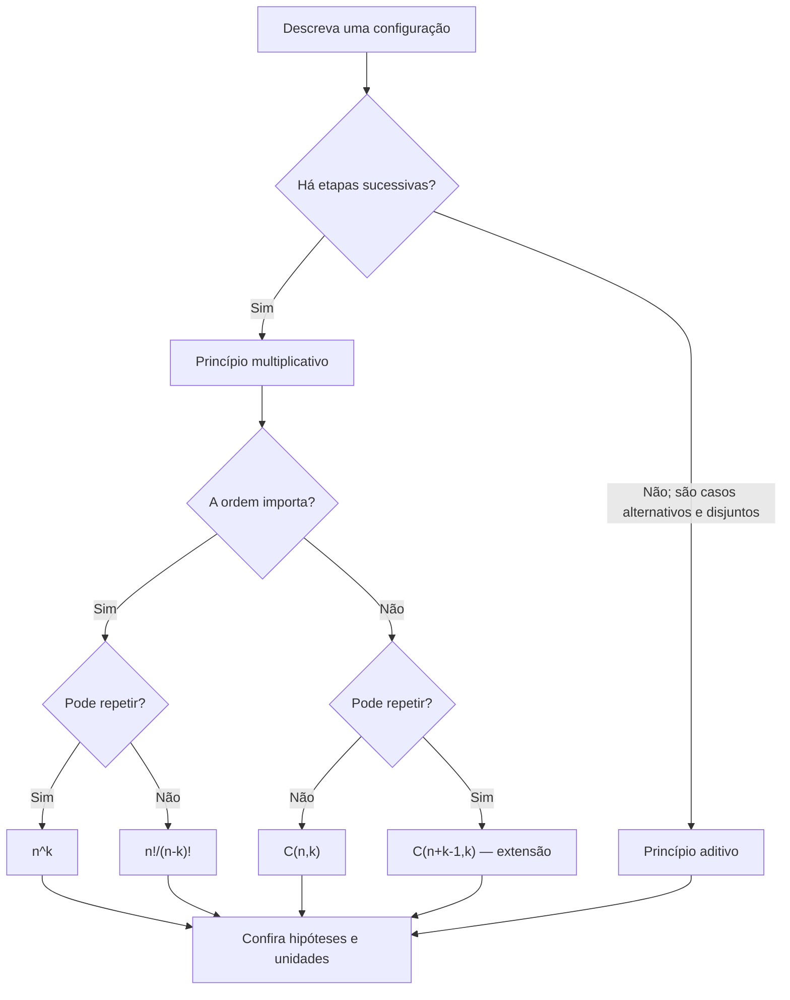

# Aula 02 — Contagem e combinatória para probabilidade

<!-- mirandastech-aula-v2 -->

**Trilha:** Especialista em IA  
**Módulo:** 02 · Probabilidade, Estatística e Teoria da Informação (M3)  
**Aula:** 02 de 24  
**Pré-requisitos:** [Aula 01 — Incerteza, eventos e axiomas](https://github.com/joaopaulomirandamatias/ai-lab/blob/main/02-statistics/aulas/01-incerteza-eventos-axiomas.md), aritmética básica e conjuntos  
**Tempo sugerido:** 3 a 4 horas, incluindo laboratório e exercícios  
**Objetivo central:** contar configurações sem enumerá-las uma a uma e transformar contagens em probabilidades apenas quando os resultados elementares forem equiprováveis.

> **Ideia-chave:** antes de aplicar uma fórmula, responda a duas perguntas: **a ordem muda o resultado?** e **é permitido repetir elementos?**

## O que você será capaz de fazer ao final

Ao concluir esta aula, você deverá conseguir:

- aplicar os princípios aditivo e multiplicativo;
- explicar por que $0!=1$;
- distinguir arranjo/permutação de combinação;
- contar sequências com e sem repetição;
- contar ordenações com elementos repetidos;
- usar coeficientes binomiais e reconhecer a identidade $\binom nk=\binom n{n-k}$;
- calcular probabilidades em espaços finitos equiprováveis;
- validar fórmulas por enumeração exata em problemas pequenos;
- reconhecer explosão combinatória em seleção de atributos, tokens e hiperparâmetros;
- evitar os erros de contar ordem ou reposição de maneira incompatível com o problema.

## Mapa da aula



---

## 1. O problema motivador: quantas possibilidades existem?

Imagine um sistema de inspeção que recebeu 20 itens, dos quais 5 são sabidamente defeituosos em um cenário de teste. Quatro itens serão escolhidos, sem reposição, para validar um detector. Qual é a probabilidade de a amostra conter exatamente dois defeituosos?

Listar todas as amostras seria trabalhoso. Há

$$
\binom{20}{4}=4\,845
$$

grupos possíveis. A combinatória permite contar:

- todas as amostras de quatro itens;
- as amostras favoráveis, com dois dos cinco defeituosos e dois dos quinze adequados;
- a razão entre essas quantidades, se todas as amostras forem equiprováveis.

O cálculo completo será resolvido adiante. Antes, precisamos saber **o que** estamos contando.

## 2. Conte objetos, não descrições ambíguas

Uma contagem correta começa pela definição da unidade.

| Situação | Objeto contado | A ordem importa? | Repetição? |
|---|---|---:|---:|
| PIN de 4 dígitos | sequência de quatro posições | sim | sim |
| pódio com 3 pessoas entre 10 | sequência de ocupantes de ouro, prata e bronze | sim | não |
| comissão de 3 pessoas entre 10 | subconjunto de três pessoas | não | não |
| subconjunto de atributos | subconjunto de um conjunto de atributos | não | não |
| sequência de 8 tokens de vocabulário com $V$ tokens | sequência de posições | sim | sim |

Trocar “sequência” por “grupo” muda a resposta. Por exemplo, Ana–Bruno–Caio e Caio–Bruno–Ana são:

- duas sequências diferentes em um pódio;
- o mesmo grupo em uma comissão.

### Vocabulário essencial

| Termo | Significado nesta aula |
|---|---|
| **Configuração** | Um resultado completo do processo de escolha |
| **Etapa** | Uma posição ou decisão parcial da configuração |
| **Repetição/reposição** | Um item pode voltar a ser escolhido |
| **Permutação** | Ordenação; em muitos textos, também se usa “arranjo” quando apenas $k$ de $n$ itens ocupam posições |
| **Combinação** | Escolha não ordenada de um subconjunto |
| **Equiprovável** | Todos os resultados elementares considerados têm a mesma probabilidade |

> A terminologia “arranjo” varia entre livros. Nesta aula, usaremos $P(n,k)$ para uma seleção **ordenada** de $k$ elementos distintos entre $n$.

## 3. Princípio aditivo: alternativas que não se sobrepõem

Se uma configuração pode ser obtida por uma de várias categorias **mutuamente exclusivas**, somamos as quantidades.

Se há $m$ resultados do tipo A e $n$ resultados do tipo B, e nenhum resultado pertence aos dois tipos:

$$
N(A\text{ ou }B)=m+n.
$$

### Exemplo resolvido: escolher um arquivo

Uma pasta possui 7 arquivos `.csv` e 4 arquivos `.json`, sem arquivos contados nas duas categorias. Há

$$
7+4=11
$$

formas de escolher um arquivo de um desses formatos.

Se as categorias se sobrepõem, a soma direta conta a interseção duas vezes. A correção é a mesma ideia da regra da união da Aula 01:

$$
|A\cup B|=|A|+|B|-|A\cap B|.
$$

## 4. Princípio multiplicativo: escolhas em etapas

Se uma configuração completa exige uma sequência de etapas, e cada escolha da primeira etapa admite o mesmo número de continuações, multiplicamos as opções.

Para $k$ etapas com $n_1,n_2,\ldots,n_k$ opções:

$$
N=n_1n_2\cdots n_k=\prod_{i=1}^{k}n_i.
$$

### Exemplo resolvido: identificador de experimento

Um identificador contém duas letras maiúsculas seguidas de três dígitos. Repetições são permitidas.

| Posição | 1 | 2 | 3 | 4 | 5 |
|---:|---:|---:|---:|---:|---:|
| Opções | 26 | 26 | 10 | 10 | 10 |

Logo,

$$
26^2\cdot10^3=676\,000.
$$

Se a primeira letra não pudesse repetir na segunda posição, a contagem seria

$$
26\cdot25\cdot10^3=650\,000.
$$

A fórmula mudou porque a segunda escolha passou de 26 para 25 possibilidades.

## 5. Fatorial: ordenar todos os elementos distintos

Para ordenar $n$ elementos distintos, há $n$ opções para a primeira posição, $n-1$ para a segunda e assim por diante:

$$
n!=n(n-1)(n-2)\cdots2\cdot1.
$$

Exemplos:

$$
4!=4\cdot3\cdot2\cdot1=24,
\qquad
1!=1.
$$

Define-se também

$$
0!=1.
$$

Isso não é um capricho. Há exatamente **uma** forma de ordenar nenhum elemento: a sequência vazia. Além disso, a definição mantém identidades como

$$
\binom n0=\frac{n!}{0!n!}=1.
$$

### Crescimento rápido

O fatorial cresce muito depressa:

| $n$ | $n!$ |
|---:|---:|
| 5 | 120 |
| 10 | 3.628.800 |
| 20 | 2.432.902.008.176.640.000 |

Por isso, enumerar todas as ordens raramente é uma estratégia viável em problemas maiores.

## 6. Ordem importa, sem repetição: permutações de $k$ entre $n$

Para preencher $k$ posições distintas usando elementos diferentes de um conjunto com $n$ elementos:

$$
P(n,k)=n(n-1)\cdots(n-k+1)=\frac{n!}{(n-k)!}.
$$

### Exemplo resolvido: pódio

Entre 10 modelos candidatos, serão registrados o primeiro, o segundo e o terceiro lugar. Como as posições têm papéis diferentes:

$$
P(10,3)=10\cdot9\cdot8=720.
$$

Escolher os mesmos três modelos em outra ordem produz outro pódio.

Quando $k=n$:

$$
P(n,n)=n!,
$$

pois todos os elementos são ordenados.

## 7. Ordem importa, com repetição: $n^k$

Se cada uma das $k$ posições pode receber qualquer um dos $n$ símbolos, independentemente das posições anteriores:

$$
n^k.
$$

Um PIN de quatro dígitos, incluindo zeros iniciais, possui

$$
10^4=10\,000
$$

sequências possíveis, de `0000` a `9999`.

Em IA generativa, um vocabulário com $V$ tokens admite

$$
V^L
$$

sequências de comprimento exatamente $L$ antes de impor restrições. Isso ajuda a enxergar por que busca exaustiva sobre textos é impraticável. Não significa, porém, que todas as sequências tenham a mesma probabilidade em um modelo de linguagem.

## 8. Ordem não importa, sem repetição: combinações

Suponha que primeiro contamos seleções ordenadas de $k$ elementos:

$$
P(n,k)=\frac{n!}{(n-k)!}.
$$

Cada grupo não ordenado de $k$ elementos aparece $k!$ vezes nessa contagem, uma vez para cada ordem interna. Dividimos por $k!$:

$$
\binom nk=C(n,k)=\frac{n!}{k!(n-k)!},
\qquad 0\leq k\leq n.
$$

Lê-se “$n$ escolhe $k$”.

### Exemplo resolvido: equipe de avaliação

Escolher três pessoas entre dez para uma equipe, sem cargos:

$$
\binom{10}{3}
=\frac{10!}{3!7!}
=\frac{10\cdot9\cdot8}{3\cdot2\cdot1}
=120.
$$

Compare com os 720 pódios: cada equipe de três pessoas corresponde a $3!=6$ ordens, então $720/6=120$.

### Simetria

Escolher $k$ elementos para entrar equivale a escolher $n-k$ para ficar de fora:

$$
\binom nk=\binom n{n-k}.
$$

Assim, $\binom{10}{3}=\binom{10}{7}$.

## 9. Quantos subconjuntos existem?

Para cada um dos $n$ elementos, há duas decisões: incluir ou não incluir. Pelo princípio multiplicativo:

$$
2^n
$$

subconjuntos, contando o conjunto vazio e o conjunto completo.

A mesma conclusão surge ao somar os subconjuntos por tamanho:

$$
\sum_{k=0}^{n}\binom nk=2^n.
$$

Com 30 atributos candidatos, já existem

$$
2^{30}=1\,073\,741\,824
$$

subconjuntos possíveis. Se o conjunto vazio não for uma solução válida, restam $2^{30}-1$. Essa explosão explica por que seleção exaustiva de atributos costuma ser inviável.

## 10. Elementos repetidos em uma ordenação

Se $n$ posições contêm grupos de objetos indistinguíveis com quantidades $n_1,n_2,\ldots,n_r$, onde $n_1+\cdots+n_r=n$, o número de sequências distintas é

$$
\frac{n!}{n_1!n_2!\cdots n_r!}.
$$

### Exemplo resolvido: a palavra DADO

Há quatro letras, mas `D` aparece duas vezes. As $4!$ permutações tratariam os dois `D` como diferentes e duplicariam cada palavra. Portanto:

$$
\frac{4!}{2!}=12.
$$

Esse raciocínio reaparece na distribuição multinomial da Aula 07.

## 11. Tabela de decisão: qual fórmula usar?

| Ordem | Repetição | Objeto | Quantidade |
|---:|---:|---|---:|
| importa | permitida | sequência de $k$ posições, $n$ opções em cada | $n^k$ |
| importa | proibida | $k$ posições com elementos distintos | $P(n,k)=\dfrac{n!}{(n-k)!}$ |
| não importa | proibida | subconjunto de tamanho $k$ | $\binom nk=\dfrac{n!}{k!(n-k)!}$ |
| não importa | permitida | multiconjunto de tamanho $k$ entre $n$ tipos | $\binom{n+k-1}{k}$ |
| todos são ordenados, com repetições $n_i$ | — | sequência com objetos indistinguíveis | $\dfrac{n!}{\prod_i n_i!}$ |

O caso de combinações com repetição é apresentado como extensão. Para usá-lo, os tipos são distinguíveis, a ordem das escolhas não importa e cada tipo pode aparecer várias vezes.

### Algoritmo mental antes da fórmula

1. **Defina um resultado completo.** É uma sequência, grupo, grade ou distribuição?
2. **Separe casos disjuntos.** Se há alternativas, some.
3. **Separe etapas.** Se uma configuração exige escolhas sucessivas, multiplique.
4. **Pergunte se trocar posições gera outro resultado.** Se sim, a ordem importa.
5. **Pergunte se um elemento pode reaparecer.** Isso decide a reposição.
6. **Teste um caso pequeno.** Enumere manualmente para checar a lógica.
7. **Só então converta em probabilidade.** Confirme equiprobabilidade.

## 12. De contagem para probabilidade

Se $\Omega$ é finito e seus resultados elementares são equiprováveis, então

$$
P(A)=\frac{|A|}{|\Omega|}.
$$

Contar corretamente não basta: a hipótese de equiprobabilidade é indispensável.

### Exemplo resolvido passo a passo: amostra com dois defeituosos

Retome o lote com 20 itens:

- 5 defeituosos;
- 15 adequados;
- amostra uniforme de 4 itens, sem reposição;
- evento $A$: exatamente 2 defeituosos.

**Passo 1 — total de amostras**

A ordem de retirada não faz parte do resultado final:

$$
|\Omega|=\binom{20}{4}=4\,845.
$$

**Passo 2 — amostras favoráveis**

Escolhemos 2 dos 5 defeituosos **e** 2 dos 15 adequados:

$$
|A|=\binom52\binom{15}{2}=10\cdot105=1\,050.
$$

**Passo 3 — probabilidade**

Como a amostra de quatro itens é uniforme entre todos os subconjuntos de tamanho quatro:

$$
P(A)=\frac{1\,050}{4\,845}=\frac{70}{323}\approx0{,}2167.
$$

Portanto, a chance é de aproximadamente **21,67%**.

> Não multiplicamos diretamente $(5/20)(4/19)$ porque isso descreve apenas duas posições e ignora onde os itens adequados apareceriam. A abordagem sequencial exigiria somar todas as ordens compatíveis. A combinatória agrupa essas ordens de modo mais limpo.

## 13. Exemplo resolvido: ao menos um sucesso pelo complemento

Um classificador independente por execução acerta um caso com probabilidade $0{,}8$. Em três execuções sob a mesma hipótese, qual a probabilidade de pelo menos um acerto?

O evento complementar é “nenhum acerto”. Cada falha tem probabilidade $0{,}2$; há apenas uma configuração `FFF`, mas sua probabilidade resulta do produto:

$$
P(\text{ao menos um acerto})
=1-P(\text{nenhum acerto})
=1-(0{,}2)^3
=0{,}992.
$$

Este exemplo mostra que **contagem e probabilidade não são a mesma operação**. As oito sequências de acerto/falha são possíveis, mas não são equiprováveis quando $P(\text{acerto})=0{,}8$. A formalização de independência ficará para a Aula 03 e a distribuição binomial, para a Aula 07.

## 14. Conexões com IA e Machine Learning

### 14.1 Espaço de sequências

Um vocabulário de 50 mil tokens possui $(50\,000)^{20}$ sequências brutas de comprimento 20. Modelos de linguagem não enumeram esse espaço: atribuem probabilidades condicionais e usam estratégias de decodificação.

### 14.2 Seleção de atributos

Com $d$ atributos, há $2^d-1$ subconjuntos não vazios. Testar todos pode ser caro e, se a escolha for feita usando o conjunto de teste, também pode introduzir viés. A separação e o *data leakage* serão tratados na Aula 12.

### 14.3 Divisões de dados

Para $n$ observações distintas, escolher $n_{treino}$ para treino e depois $n_{val}$ entre as restantes gera

$$
\binom{n}{n_{treino}}
\binom{n-n_{treino}}{n_{val}}
$$

divisões rotuladas treino/validação/teste. Essa contagem não garante uma boa divisão: grupos, tempo, estratificação e dependência entre observações podem impor restrições.

### 14.4 Busca de hiperparâmetros

Uma grade com 4 taxas de aprendizado, 3 tamanhos de lote e 5 valores de regularização contém

$$
4\cdot3\cdot5=60
$$

configurações. Acrescentar dimensões multiplica o custo da busca.

## 15. Laboratório reproduzível em Python

O laboratório valida fórmulas por enumeração, calcula o exemplo do lote, compara a probabilidade exata com simulação e visualiza a explosão combinatória.

### 15.1 Abrir no Google Colab

[](https://colab.research.google.com/github/joaopaulomirandamatias/ai-lab/blob/main/02-statistics/notebooks/02-contagem-combinatoria-laboratorio.ipynb)

Para executar localmente:

```bash
python -m pip install numpy matplotlib jupyter
```

Versões mínimas recomendadas:

- Python 3.10;
- NumPy 1.24;
- Matplotlib 3.7.

### 15.2 Funções exatas

```python
from math import comb, factorial, perm

print(factorial(5))  # 120
print(perm(10, 3))   # 720
print(comb(10, 3))   # 120

assert factorial(0) == 1
assert perm(10, 3) == 720
assert comb(10, 3) == comb(10, 7) == 120
assert sum(comb(10, k) for k in range(11)) == 2**10
```

`math.comb` e `math.perm` calculam inteiros exatos; não é necessário construir fatoriais enormes manualmente.

### 15.3 Enumeração como teste, não como solução de escala

```python
from itertools import combinations, permutations, product

itens = tuple("ABCD")

assert len(list(product(itens, repeat=2))) == 4**2
assert len(list(permutations(itens, 2))) == perm(4, 2)
assert len(list(combinations(itens, 2))) == comb(4, 2)
```

Gerar listas completas é útil para validar casos pequenos. Para espaços grandes, calcule a quantidade sem materializar as configurações.

## 16. Armadilhas e erros comuns

### 16.1 Contar a ordem quando ela não importa

Usar $P(10,3)=720$ para formar uma equipe de três pessoas conta cada equipe $3!=6$ vezes. A resposta correta é $\binom{10}{3}=120$.

### 16.2 Ignorar reposição

Uma senha pode repetir símbolos; uma amostra sem reposição, não. Escrever $n^k$ no segundo caso mantém opções que já deveriam ter desaparecido.

### 16.3 Somar casos sobrepostos

Somar $|A|+|B|$ só funciona diretamente para categorias disjuntas. Se há sobreposição, subtraia $|A\cap B|$.

### 16.4 Dividir contagens sem equiprobabilidade

Em uma roleta com setores de áreas diferentes, três setores não implicam probabilidade $1/3$ para cada setor.

### 16.5 Materializar um espaço enorme

`list(product(vocabulario, repeat=20))` pode esgotar memória. Prefira fórmulas e iteradores, e interrompa enumeração quando ela serve apenas como teste.

### 16.6 Usar fatorial em ponto flutuante

Fatoriais crescem rapidamente. Para contagens, use inteiros exatos (`math.comb`, `math.perm`). Em modelos probabilísticos de grande escala, cálculos de probabilidades costumam ser feitos no domínio logarítmico; isso será retomado em teoria da informação.

### 16.7 Misturar “possível” com “provável”

Contagem informa quantos resultados satisfazem uma descrição. Probabilidade exige ainda uma lei de probabilidade. Um resultado pode ser possível e ter peso muito diferente de outro.

## 17. Checklist prático

Antes de aceitar uma contagem, confirme:

- [ ] defini o que constitui um resultado completo;
- [ ] identifiquei casos alternativos disjuntos;
- [ ] identifiquei escolhas em etapas;
- [ ] decidi explicitamente se a ordem importa;
- [ ] decidi explicitamente se há repetição/reposição;
- [ ] corrigi objetos indistinguíveis, se existirem;
- [ ] validei um caso pequeno por enumeração;
- [ ] não materializei desnecessariamente um espaço enorme;
- [ ] antes de dividir contagens, justifiquei equiprobabilidade;
- [ ] mantive no cálculo as mesmas restrições descritas no problema.

## 18. Resumo de bolso

| Pergunta | Ferramenta |
|---|---|
| casos alternativos e disjuntos? | somar |
| etapas sucessivas? | multiplicar |
| ordenar $n$ distintos? | $n!$ |
| escolher e ordenar $k$ entre $n$, sem repetição? | $n!/(n-k)!$ |
| escolher $k$ entre $n$, sem ordem e sem repetição? | $\binom nk$ |
| preencher $k$ posições com $n$ opções e repetição? | $n^k$ |
| ordenar objetos repetidos? | $n!/\prod_i n_i!$ |
| contar todos os subconjuntos? | $2^n$ |
| converter contagem em probabilidade? | $|A|/|\Omega|$, somente sob equiprobabilidade |

## 19. Exercícios

1. Um menu oferece 3 entradas, 5 pratos principais e 2 sobremesas. Quantas refeições com um item de cada categoria existem?
2. Quantos códigos de três letras podem ser formados com o alfabeto de 26 letras: (a) com repetição; (b) sem repetição?
3. De oito modelos candidatos, quantos pódios de três posições existem? Quantos grupos de três, sem posição?
4. Quantas ordenações distintas existem para a palavra `BANANA`?
5. Um dataset tem 12 atributos. Quantos subconjuntos não vazios de atributos podem ser testados?
6. Cinco itens são escolhidos uniformemente, sem reposição, de um lote com 30 itens, dos quais 6 são defeituosos. Qual a probabilidade de obter exatamente um defeituoso?
7. Uma moeda com $P(C)=0{,}7$ é lançada duas vezes. É correto dizer que as quatro sequências `CC`, `CK`, `KC`, `KK` têm probabilidade $1/4$ porque existem quatro? Explique e calcule suas probabilidades, assumindo lançamentos independentes.
8. Uma equipe de três pessoas deve conter exatamente uma pessoa de segurança entre 4 especialistas de segurança e 8 especialistas de dados. Quantas equipes são possíveis?
9. Explique por que $\binom n0=1$ e por que isso é coerente com $0!=1$.
10. Uma grade de hiperparâmetros tem 5 arquiteturas, 4 taxas de aprendizado, 3 seeds e 2 estratégias de regularização. Quantas execuções são necessárias para testar o produto cartesiano inteiro? Cite uma razão metodológica para não escolher o melhor resultado olhando apenas o teste.

<details>
<summary><strong>Respostas comentadas</strong></summary>

1. Pelo princípio multiplicativo, $3\cdot5\cdot2=30$ refeições.
2. (a) $26^3=17\,576$. (b) $P(26,3)=26\cdot25\cdot24=15\,600$.
3. Pódios: $P(8,3)=8\cdot7\cdot6=336$. Grupos: $\binom83=56$. Cada grupo corresponde a $3!=6$ pódios.
4. São 6 letras, com `A` repetido 3 vezes e `N` repetido 2 vezes: $6!/(3!2!)=60$.
5. $2^{12}-1=4\,095$. Subtrai-se o conjunto vazio.
6. Casos favoráveis: $\binom61\binom{24}{4}$. Total: $\binom{30}{5}$. Logo, $P=\binom61\binom{24}{4}/\binom{30}{5}\approx0{,}4474$.
7. Não. Possibilidade não implica equiprobabilidade. Sob independência: $P(CC)=0{,}49$, $P(CK)=P(KC)=0{,}21$ e $P(KK)=0{,}09$.
8. Escolha uma das 4 pessoas de segurança e duas das 8 de dados: $\binom41\binom82=4\cdot28=112$.
9. Existe uma única escolha de zero elementos: o conjunto vazio. Pela fórmula, $\binom n0=n!/(0!n!)$ deve ser 1; isso é coerente com $0!=1$.
10. $5\cdot4\cdot3\cdot2=120$ execuções. Usar repetidamente o teste para escolher configurações vaza informação do teste para o processo de seleção e produz uma estimativa otimista; a Aula 12 aprofundará esse tema.

</details>

### Desafio de transferência

Escolha um problema do seu contexto — seleção de sensores, escalas de equipe, configurações de pipeline ou amostragem para auditoria — e preencha:

| Campo | Sua definição |
|---|---|
| Resultado completo | |
| Etapas de escolha | |
| A ordem importa? Por quê? | |
| Há repetição/reposição? | |
| Restrições | |
| Fórmula candidata | |
| Caso pequeno para validação | |
| Os resultados são equiprováveis? | |
| O que a contagem não informa? | |

## 20. Critério de domínio

Você domina esta aula quando consegue, sem consultar a tabela:

- decidir entre soma e produto;
- explicar ordem e repetição antes de escolher uma fórmula;
- derivar $\binom nk$ a partir de seleções ordenadas;
- resolver o exemplo de amostragem por casos favoráveis e possíveis;
- validar uma fórmula com `itertools` em um caso pequeno;
- explicar uma explosão combinatória de IA sem afirmar equiprobabilidade indevida.

### Rubrica

| Nível | Evidência de aprendizagem |
|---:|---|
| 0 — Reconhecimento | Identifica fatorial e combinação, mas escolhe fórmulas por palavras-chave |
| 1 — Representação | Define o objeto contado, ordem e repetição |
| 2 — Cálculo | Aplica princípios e fórmulas em casos diretos |
| 3 — Justificativa | Deriva a fórmula, valida por enumeração e explicita equiprobabilidade |
| 4 — Transferência | Modela um problema novo, reconhece restrições e critica escalabilidade |

Avance quando alcançar pelo menos o nível 3.

## 21. Leituras e fontes verificadas

### Essenciais

- Joseph K. Blitzstein e Jessica Hwang. [*Introduction to Probability* e Harvard Stat 110](https://stat110.hsites.harvard.edu/). Livro aberto, aulas e exercícios; o primeiro capítulo desenvolve estratégias de contagem.
- MIT OpenCourseWare. [18.05 — Class 1: Introduction, Counting, and Sets](https://ocw.mit.edu/courses/18-05-introduction-to-probability-and-statistics-spring-2022/pages/classes-reading-and-in-class-materials/). Leituras, slides, problemas e soluções.

### Referências técnicas do laboratório

- Python Software Foundation. [`math.comb`, `math.perm` e `math.factorial`](https://docs.python.org/3/library/math.html#number-theoretic-functions). Funções de contagem inteira exata.
- Python Software Foundation. [`itertools`](https://docs.python.org/3/library/itertools.html). Iteradores para produto cartesiano, permutações e combinações.
- NumPy. [`Generator.choice`](https://numpy.org/doc/stable/reference/random/generated/numpy.random.Generator.choice.html). Amostragem reproduzível usada no laboratório.

### Aprofundamento

- Richard P. Stanley. [*Enumerative Combinatorics, Volume 1*](https://math.mit.edu/~rstan/ec/). Referência avançada disponibilizada pelo autor; vá além desta aula somente se precisar de combinatória formal.

## 22. Continue a formação

**Próxima aula:** [Aula 03 — Probabilidade condicional e independência](./03-condicional-independencia.md)

Na próxima etapa, o universo de referência será restringido pela informação observada. Você aprenderá $P(A\mid B)$, regra do produto, probabilidade total e a diferença entre independência e exclusão mútua.

---

**Repositório da formação:** [AI Systems Laboratory](https://github.com/joaopaulomirandamatias/ai-lab)  
**Série:** Probabilidade, Estatística e Teoria da Informação · 24 aulas
