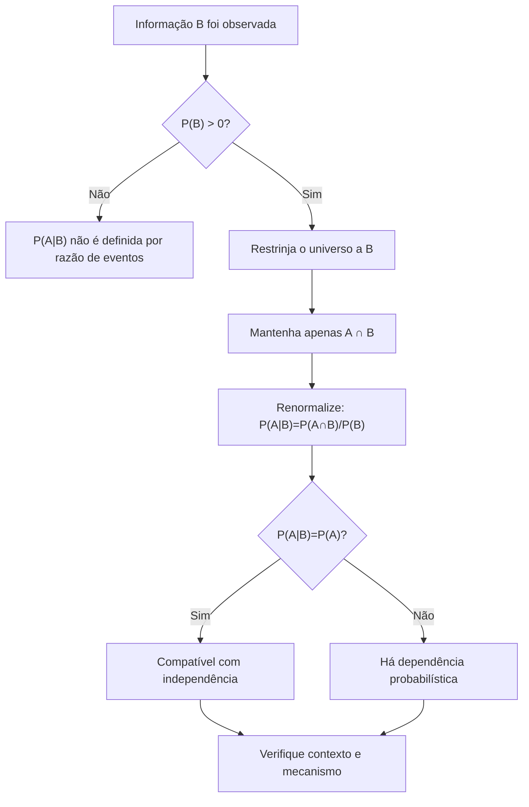
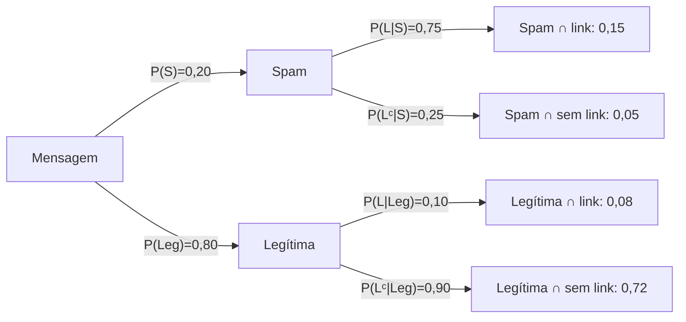
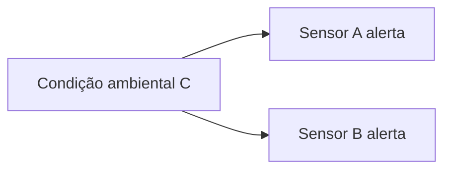

# Aula 03 — Probabilidade condicional e independência

<!-- mirandastech-aula-v2 -->

**Trilha:** Especialista em IA  
**Módulo:** 02 · Probabilidade, Estatística e Teoria da Informação (M3)  
**Aula:** 03 de 24  
**Pré-requisitos:** [Aula 01 — eventos e axiomas](./01-incerteza-eventos-axiomas.md) e [Aula 02 — contagem e combinatória](./02-contagem-combinatoria.md)  
**Tempo sugerido:** 3 a 4 horas, incluindo laboratório e exercícios  
**Objetivo central:** atualizar o universo de referência diante de informação observada e modelar corretamente quando eventos são dependentes, independentes ou independentes apenas sob uma condição.

> **Ideia-chave:** $P(A\mid B)$ não pergunta apenas “qual é a chance de $A$?”. Pergunta “qual é a chance de $A$ **entre os casos em que $B$ ocorreu**?”.

## O que você será capaz de fazer ao final

Ao concluir esta aula, você deverá conseguir:

- interpretar condicionamento como restrição e renormalização do universo;
- calcular $P(A\mid B)$ em tabelas, conjuntos e árvores;
- distinguir $P(A\mid B)$ de $P(B\mid A)$;
- aplicar a regra do produto e a regra da cadeia;
- aplicar a lei da probabilidade total usando uma partição;
- testar independência pela fatoração $P(A\cap B)=P(A)P(B)$;
- diferenciar independência de exclusão mútua;
- explicar independência condicional e por que ela sustenta modelos probabilísticos;
- reconhecer quando uma hipótese de independência é metodologicamente frágil;
- estimar probabilidades condicionais por simulação reproduzível.

## Mapa da aula



---

## 1. Problema motivador: o denominador mudou

Um filtro analisou 1.000 mensagens. A tabela cruza a classe real com a presença de um padrão de link suspeito:

| Classe real | Link suspeito | Sem link suspeito | Total |
|---|---:|---:|---:|
| Spam | 150 | 50 | 200 |
| Legítima | 80 | 720 | 800 |
| **Total** | **230** | **770** | **1.000** |

Antes de observar o link, a proporção de spam é

$$
P(S)=\frac{200}{1\,000}=0{,}20.
$$

Depois de saber que uma mensagem contém o padrão, o universo relevante deixa de ter 1.000 mensagens. Passamos a olhar apenas as 230 com link suspeito. Dessas, 150 são spam:

$$
P(S\mid L)=\frac{150}{230}\approx0{,}6522.
$$

A informação $L$ elevou a probabilidade de spam de 20% para aproximadamente 65,22%. Ela não alterou os registros; alterou o **conjunto de casos compatíveis com o que sabemos**.

Agora inverta a pergunta:

$$
P(L\mid S)=\frac{150}{200}=0{,}75.
$$

Embora usem a mesma interseção, $P(S\mid L)$ e $P(L\mid S)$ têm denominadores diferentes. Confundi-las é um dos erros mais comuns em diagnóstico e classificação.

## 2. Vocabulário essencial

| Termo | Significado |
|---|---|
| **Probabilidade marginal** | Probabilidade de um evento sem fixar outro, como $P(S)$ |
| **Probabilidade conjunta** | Probabilidade de eventos ocorrerem juntos, como $P(S\cap L)$ |
| **Probabilidade condicional** | Probabilidade de $A$ no universo restrito por $B$, $P(A\mid B)$ |
| **Evento condicionante** | Informação assumida ou observada à direita da barra, $B$ |
| **Partição** | Eventos disjuntos cuja união cobre $\Omega$ |
| **Independência** | Conhecer um evento não altera a probabilidade do outro |
| **Independência condicional** | Dois eventos tornam-se independentes depois de fixar uma condição $C$ |

A barra vertical em $P(A\mid B)$ lê-se “dado que” ou “condicionado a”. Ela não significa divisão por si só; a divisão aparece na definição.

## 3. Definição de probabilidade condicional

Para eventos $A$ e $B$ com $P(B)>0$:

$$
P(A\mid B)=\frac{P(A\cap B)}{P(B)}.
$$

A fórmula contém três movimentos conceituais:

1. $B$ restringe os resultados ainda possíveis;
2. $A\cap B$ seleciona os resultados que também satisfazem $A$;
3. a divisão por $P(B)$ renormaliza o novo universo para que sua massa total seja 1.

### No caso finito equiprovável

Se os resultados elementares são equiprováveis:

$$
P(A\mid B)=\frac{|A\cap B|}{|B|}.
$$

Observe que o denominador é $|B|$, não $|\Omega|$.

### E quando $P(B)=0$?

A razão acima não é definida, pois exigiria divisão por zero. Em modelos contínuos, condicionamentos associados a valores pontuais são tratados com densidades ou construções mais gerais; isso não autoriza simplesmente substituir o denominador por um número arbitrário. Nesta aula, trabalharemos com eventos condicionantes de probabilidade positiva.

## 4. Exemplo resolvido com um dado

Considere um dado justo:

$$
\Omega=\{1,2,3,4,5,6\}.
$$

Defina:

$$
A=\{2,4,6\}\quad\text{(resultado par)}
$$

e

$$
B=\{4,5,6\}\quad\text{(resultado maior que 3)}.
$$

Sabendo que $B$ ocorreu, o novo universo é $\{4,5,6\}$. Nele, os resultados pares são $\{4,6\}$:

$$
P(A\mid B)=\frac{|A\cap B|}{|B|}=\frac23.
$$

Sem a informação, $P(A)=3/6=1/2$. Logo, observar $B$ aumentou a chance de $A$.

> Condicionamento não implica causalidade. Saber que o resultado é maior que 3 informa sobre a paridade, mas não “causa” o número a ser par.

## 5. Tabelas de contingência: leia o denominador

Retome as mensagens. A probabilidade conjunta de spam e link suspeito é

$$
P(S\cap L)=\frac{150}{1\,000}=0{,}15.
$$

As duas condicionais possíveis são:

$$
P(S\mid L)=\frac{0{,}15}{0{,}23}\approx0{,}6522
$$

e

$$
P(L\mid S)=\frac{0{,}15}{0{,}20}=0{,}75.
$$

### Procedimento seguro

1. circule a condição, à direita da barra;
2. use o total dessa linha ou coluna como denominador;
3. use a célula de interseção como numerador;
4. verifique se o resultado está entre 0 e 1;
5. escreva a interpretação com palavras.

Para $P(S\mid L)$: “entre as mensagens com link suspeito, aproximadamente 65,22% são spam”.

## 6. Regra do produto

Reorganizando a definição:

$$
P(A\cap B)=P(B)P(A\mid B).
$$

Também podemos trocar a ordem:

$$
P(A\cap B)=P(A)P(B\mid A).
$$

O raciocínio é “probabilidade de chegar à condição” vezes “probabilidade de continuar até o evento desejado”.

### Exemplo resolvido: dois ases sem reposição

Em um baralho comum de 52 cartas, qual é a probabilidade de as duas primeiras cartas serem ases?

Na primeira retirada:

$$
P(A_1)=\frac4{52}.
$$

Depois de retirar um ás, restam 3 ases entre 51 cartas:

$$
P(A_2\mid A_1)=\frac3{51}.
$$

Portanto:

$$
P(A_1\cap A_2)=\frac4{52}\frac3{51}
=\frac1{221}\approx0{,}004525.
$$

Pela combinatória da Aula 02, o mesmo resultado é

$$
\frac{\binom42}{\binom{52}{2}}=\frac6{1\,326}=\frac1{221}.
$$

As retiradas não são independentes: a primeira modifica a composição do baralho.

## 7. Regra da cadeia

Para três eventos:

$$
P(A\cap B\cap C)
=P(A)P(B\mid A)P(C\mid A\cap B).
$$

Para uma sequência $X_1,\ldots,X_T$:

$$
P(X_1,\ldots,X_T)
=\prod_{t=1}^{T}P(X_t\mid X_1,\ldots,X_{t-1}).
$$

Essa fatoração não assume independência. Ela decompõe uma distribuição conjunta em condicionais.

### Conexão direta com modelos de linguagem

Um modelo autorregressivo atribui probabilidade a uma sequência de tokens pela regra da cadeia:

$$
P(w_1,\ldots,w_T)
=\prod_{t=1}^{T}P(w_t\mid w_1,\ldots,w_{t-1}).
$$

Na prática, o contexto pode ser limitado pelo modelo, e as probabilidades dependem da tokenização. A equação explica por que a próxima palavra é condicionada ao prefixo, sem afirmar que tokens distantes sejam causalmente relacionados.

## 8. Árvores de probabilidade

Árvores tornam explícitos caminhos condicionais. Para as mensagens:



Multiplique ao longo de um caminho:

$$
P(S\cap L)=0{,}20\cdot0{,}75=0{,}15.
$$

Some caminhos disjuntos quando o evento pode ser alcançado por mais de uma rota.

## 9. Lei da probabilidade total

Se $B_1,\ldots,B_k$ formam uma partição de $\Omega$, então, para qualquer evento $A$:

$$
P(A)=\sum_{i=1}^{k}P(A\mid B_i)P(B_i).
$$

Uma partição exige:

- $B_i\cap B_j=\varnothing$ para $i\neq j$;
- $\bigcup_i B_i=\Omega$;
- os termos usados no condicionamento têm probabilidade positiva.

### Exemplo resolvido: probabilidade marginal do link

As classes spam e legítima particionam as mensagens:

$$
P(L)=P(L\mid S)P(S)+P(L\mid S^c)P(S^c).
$$

Substituindo:

$$
P(L)=0{,}75\cdot0{,}20+0{,}10\cdot0{,}80
=0{,}15+0{,}08=0{,}23.
$$

A lei total constrói uma probabilidade marginal ponderando cenários. Na Aula 04, esse denominador será usado para inverter condicionais de forma sistemática com o Teorema de Bayes.

## 10. Independência

Os eventos $A$ e $B$ são independentes quando

$$
P(A\cap B)=P(A)P(B).
$$

Escrevemos

$$
A\perp B.
$$

Quando $P(B)>0$, isso equivale a

$$
P(A\mid B)=P(A).
$$

Quando $P(A)>0$, equivale também a

$$
P(B\mid A)=P(B).
$$

Portanto, independência é simétrica: se $A$ é independente de $B$, $B$ é independente de $A$.

### Exemplo exato com um dado

Considere:

$$
A=\{2,4,6\}\quad\text{(par)},
$$

$$
B=\{3,6\}\quad\text{(múltiplo de 3)}.
$$

Temos

$$
P(A)=\frac12,
\qquad
P(B)=\frac13,
\qquad
P(A\cap B)=P(\{6\})=\frac16.
$$

Como

$$
\frac16=\frac12\cdot\frac13,
$$

os eventos são independentes nesse modelo.

> Independência é uma propriedade da distribuição, não apenas da aparência dos nomes ou da ausência de uma seta causal óbvia.

## 11. Independência não é exclusão mútua

Eventos **disjuntos** não ocorrem juntos:

$$
A\cap B=\varnothing.
$$

Eventos **independentes** podem ocorrer juntos, mas a ocorrência de um não altera a probabilidade do outro.

| Relação | Condição matemática | Intuição |
|---|---|---|
| Disjunção | $P(A\cap B)=0$ | não podem coexistir |
| Independência | $P(A\cap B)=P(A)P(B)$ | conhecer um não informa sobre o outro |

Se $A$ e $B$ são disjuntos e ambos têm probabilidade positiva, então

$$
P(A\mid B)=0\neq P(A).
$$

Logo, são dependentes. Saber que $B$ ocorreu elimina $A$.

No dado, “par” e “ímpar” são disjuntos e dependentes. Já “par” e “múltiplo de 3” podem ocorrer juntos no resultado 6 e são independentes.

## 12. Hipótese de independência: útil, mas deve ser defendida

Imagine dois sensores redundantes, cada um com probabilidade de falha $0{,}05$. Sob independência:

$$
P(F_1\cap F_2)=0{,}05^2=0{,}0025.
$$

Isso corresponde a 0,25%. Porém, se ambos compartilham energia, rede, firmware ou ambiente, uma causa comum pode aumentar muito a falha conjunta.

Antes de multiplicar probabilidades, pergunte:

- há causa comum?
- há recurso compartilhado?
- uma observação altera fisicamente as próximas?
- houve amostragem por grupos, tempo ou local?
- a independência vale no domínio de produção ou apenas no conjunto de teste?

Uma fórmula correta aplicada a uma hipótese falsa produz uma resposta enganosa.

## 13. Independência condicional

Dois eventos podem ser dependentes no conjunto total e independentes depois de fixar uma condição $C$. Escrevemos

$$
A\perp B\mid C
$$

quando

$$
P(A\cap B\mid C)=P(A\mid C)P(B\mid C),
$$

nos valores de $C$ em que as condicionais são definidas.

### Intuição: uma causa comum



Sem observar o ambiente, alertas de A e B podem aparecer associados porque ambos respondem à mesma condição. Dentro de cada estado ambiental, a associação pode desaparecer.

Independência marginal e independência condicional são afirmações diferentes:

| Afirmação | Fatoração |
|---|---|
| $A\perp B$ | $P(A,B)=P(A)P(B)$ |
| $A\perp B\mid C$ | $P(A,B\mid C)=P(A\mid C)P(B\mid C)$ |

### Conexão com Naive Bayes

O classificador Naive Bayes assume que os atributos $X_1,\ldots,X_d$ são condicionalmente independentes dada a classe $Y$:

$$
P(X_1,\ldots,X_d\mid Y)
=\prod_{j=1}^{d}P(X_j\mid Y).
$$

“Naive” refere-se à força dessa hipótese, não a uma garantia de que os atributos sejam realmente independentes. A Aula 04 introduzirá a inversão necessária para obter probabilidades de classe dadas as evidências.

## 14. Independência aos pares não garante independência conjunta

Considere dois bits justos e independentes $X$ e $Y$, e defina $Z=X\oplus Y$ (XOR). Cada par entre $X$, $Y$ e $Z$ é independente. Porém, conhecer dois determina completamente o terceiro:

$$
Z=X\oplus Y.
$$

Assim, independência dois a dois não basta para afirmar independência mútua. Para eventos $A_1,\ldots,A_n$, a independência mútua exige a fatoração de todas as interseções finitas relevantes, não apenas dos pares.

Esse detalhe importa em sistemas com múltiplos atributos: testes par a par podem não revelar uma restrição conjunta.

## 15. Conexões com IA e Machine Learning

### 15.1 Modelos autorregressivos

A regra da cadeia sustenta a fatoração token a token. Tratar tokens como independentes apagaria contexto e ordem.

### 15.2 Modelos gráficos probabilísticos

Grafos codificam fatorações e independências condicionais. A ausência ou presença de dependências determina quais cálculos e inferências são possíveis.

### 15.3 Classificação e diagnóstico

Confundir $P(\text{evidência}\mid\text{classe})$ com $P(\text{classe}\mid\text{evidência})$ ignora a prevalência da classe. A Aula 04 mostrará como corrigir a direção.

### 15.4 Dados agrupados e temporais

Registros da mesma pessoa, equipamento ou intervalo temporal podem ser dependentes. Separá-los aleatoriamente entre treino e teste pode aproximar observações relacionadas e inflar a avaliação. A Aula 12 aprofundará amostragem e *data leakage*.

### 15.5 Fusão de sensores e agentes

Combinar alertas como se fossem independentes pode produzir excesso de confiança quando há fonte de dados, infraestrutura ou prompt compartilhado. Dependências devem ser modeladas ou tratadas como limitação explícita.

## 16. Laboratório reproduzível em Python

O laboratório reconstrói a tabela de mensagens, verifica condicionais e probabilidade total, testa independência em um dado, simula a população e visualiza distribuições conjuntas independentes e dependentes.

### 16.1 Abrir no Google Colab

[](https://colab.research.google.com/github/joaopaulomirandamatias/ai-lab/blob/main/02-statistics/notebooks/03-condicional-independencia-laboratorio.ipynb)

Para executar localmente:

```bash
python -m pip install "numpy>=1.24" "matplotlib>=3.7" jupyter
```

### 16.2 Função segura para condicionais

```python
def prob_condicional(p_intersecao, p_condicao):
    if not 0 <= p_intersecao <= p_condicao <= 1:
        raise ValueError("As probabilidades devem satisfazer 0 ≤ P(A∩B) ≤ P(B) ≤ 1.")
    if p_condicao == 0:
        raise ZeroDivisionError("P(A|B) exige P(B) > 0 nesta definição.")
    return p_intersecao / p_condicao

p_spam_dado_link = prob_condicional(0.15, 0.23)
assert abs(p_spam_dado_link - 150 / 230) < 1e-12
```

### 16.3 O que observar

- a direção da barra muda o denominador;
- estimativas simuladas oscilam em torno dos valores do modelo;
- marginais semelhantes não garantem independência;
- a distribuição conjunta revela dependência invisível nas marginais.

## 17. Armadilhas e erros comuns

### 17.1 Inverter a condicional

Em geral,

$$
P(A\mid B)\neq P(B\mid A).
$$

Escreva a pergunta em palavras e identifique o grupo condicionado antes de calcular.

### 17.2 Usar o denominador original

Depois de condicionar em $B$, o universo tem massa $P(B)$, ou $|B|$ no caso equiprovável. Manter $|\Omega|$ calcula uma conjunta, não a condicional.

### 17.3 Multiplicar marginais sem justificar independência

$P(A\cap B)=P(A)P(B)$ não é a regra geral. A regra geral contém a condicional:

$$
P(A\cap B)=P(A)P(B\mid A).
$$

### 17.4 Confundir disjunção e independência

Eventos disjuntos de probabilidade positiva são dependentes: observar um torna o outro impossível.

### 17.5 Inferir causalidade de uma condicional alta

$P(A\mid B)>P(A)$ mostra associação probabilística no modelo, não prova que $B$ causa $A$.

### 17.6 Ignorar mudança de distribuição

Uma condicional estimada em um período ou população pode não permanecer válida em produção. Registre recorte, fonte, tempo e processo de coleta.

### 17.7 Tratar estimativa como igualdade exata

Frequências amostrais têm variabilidade. No laboratório, tolerâncias verificam compatibilidade aproximada; não convertem a amostra na lei verdadeira.

## 18. Checklist prático

Antes de concluir um cálculo condicional, confirme:

- [ ] escrevi em palavras o evento procurado e a condição;
- [ ] verifiquei $P(B)>0$;
- [ ] usei $A\cap B$ no numerador;
- [ ] usei $B$ como novo universo;
- [ ] distingui conjunta, marginal e condicional;
- [ ] não inverti $P(A\mid B)$ com $P(B\mid A)$;
- [ ] usei a regra geral do produto antes de assumir independência;
- [ ] se usei probabilidade total, verifiquei que os casos formam uma partição;
- [ ] se assumi independência, declarei mecanismo e limites;
- [ ] se usei dados, registrei população, período e processo de amostragem.

## 19. Resumo de bolso

| Conceito | Fórmula | Pergunta respondida |
|---|---|---|
| Condicional | $P(A\mid B)=P(A\cap B)/P(B)$ | chance de $A$ entre os casos $B$ |
| Produto | $P(A\cap B)=P(B)P(A\mid B)$ | chance de percorrer duas etapas |
| Cadeia | $P(A,B,C)=P(A)P(B\mid A)P(C\mid A,B)$ | chance de uma sequência conjunta |
| Probabilidade total | $P(A)=\sum_iP(A\mid B_i)P(B_i)$ | marginal ponderada por uma partição |
| Independência | $P(A\cap B)=P(A)P(B)$ | a informação de um não altera o outro |
| Independência condicional | $P(A,B\mid C)=P(A\mid C)P(B\mid C)$ | fatoração dentro de cada condição $C$ |

## 20. Exercícios

1. No dado justo, calcule $P(\text{par}\mid\text{resultado}>2)$.
2. Na tabela das mensagens, calcule $P(L^c\mid S)$ e interprete em uma frase.
3. Use a regra do produto para calcular a probabilidade de retirar três reis consecutivos de um baralho, sem reposição.
4. Uma fábrica A produz 60% das peças e tem taxa de defeito de 1%; a fábrica B produz 40% e tem taxa de 3%. Qual é a probabilidade marginal de uma peça ser defeituosa?
5. Em um dado justo, os eventos “resultado menor que 3” e “resultado maior que 4” são independentes? Justifique.
6. Dois lançamentos de uma moeda justa são realizados. O evento $A=$ “primeiro lançamento é cara” e $B=$ “segundo lançamento é cara” são independentes? Mostre pela fatoração.
7. Se $A$ e $B$ são disjuntos, $P(A)=0{,}4$ e $P(B)=0{,}3$, calcule $P(A\mid B)$. Eles são independentes?
8. Um sistema possui dois serviços com taxa de indisponibilidade de 2% cada. Qual é a indisponibilidade conjunta sob independência? Cite uma situação que invalida essa hipótese.
9. Explique, sem usar o Teorema de Bayes, por que $P(S\mid L)$ e $P(L\mid S)$ diferem na tabela das mensagens.
10. Dê um exemplo de dependência produzida por uma causa comum e indique qual variável poderia tornar os eventos condicionalmente independentes.

<details>
<summary><strong>Respostas comentadas</strong></summary>

1. Condicionado a $\{3,4,5,6\}$, os pares são $\{4,6\}$; portanto, $2/4=1/2$.
2. $P(L^c\mid S)=50/200=0{,}25$. Entre as mensagens spam, 25% não têm o padrão de link.
3. $P=\frac4{52}\frac3{51}\frac2{50}=\frac1{5\,525}\approx0{,}000181$.
4. Pela probabilidade total, $0{,}60\cdot0{,}01+0{,}40\cdot0{,}03=0{,}018$, ou 1,8%.
5. Não. A interseção é vazia, então sua probabilidade é 0, mas o produto das marginais é $(2/6)(2/6)=1/9$.
6. Sim. $P(A\cap B)=1/4$ e $P(A)P(B)=(1/2)(1/2)=1/4$.
7. $P(A\mid B)=0$ porque a interseção é vazia e $P(B)>0$. Não são independentes, pois $0\neq0{,}4$.
8. Sob independência, $0{,}02^2=0{,}0004$, ou 0,04%. Fonte de energia, rede, região ou implantação compartilhada pode criar falha comum.
9. As duas razões usam a mesma interseção de 150 mensagens, mas denominadores diferentes: 230 mensagens com link e 200 mensagens spam.
10. Chuva pode elevar simultaneamente alertas de dois sensores. O estado meteorológico é uma candidata a condição comum; a independência condicional ainda precisa ser avaliada, não presumida.

</details>

### Desafio de transferência

Escolha dois alertas do seu contexto — sensores, agentes, classificadores ou serviços — e preencha:

| Campo | Sua análise |
|---|---|
| Evento $A$ | |
| Evento $B$ | |
| $P(A)$ e $P(B)$ | |
| $P(A\cap B)$ | |
| $P(A\mid B)$ | |
| São independentes? Evidência | |
| Possível causa comum $C$ | |
| A independência poderia valer dado $C$? | |
| Limitação dos dados | |
| Decisão afetada | |

## 21. Critério de domínio

Você domina esta aula quando consegue, sem consultar o texto:

- explicar por que condicionamento troca o denominador;
- calcular as duas direções de uma condicional em uma tabela;
- derivar e usar a regra do produto;
- construir uma marginal com a probabilidade total;
- demonstrar independência pela fatoração;
- explicar por que disjunção e independência não são sinônimos;
- identificar uma hipótese de independência condicional em IA;
- executar o notebook e interpretar a distribuição conjunta.

### Rubrica

| Nível | Evidência de aprendizagem |
|---:|---|
| 0 — Reconhecimento | Lê a notação, mas troca condição e evento |
| 1 — Representação | Identifica numerador, denominador e universo restrito |
| 2 — Cálculo | Aplica produto, total e teste de independência |
| 3 — Justificativa | Explicita hipóteses, partições e causas comuns |
| 4 — Transferência | Modela dependências de um sistema real e avalia limites |

Avance quando alcançar pelo menos o nível 3.

## 22. Leituras e fontes verificadas

### Essenciais

- Joseph K. Blitzstein e Jessica Hwang. [*Introduction to Probability* e Harvard Stat 110](https://stat110.hsites.harvard.edu/). Livro aberto, aulas, exercícios e soluções sobre condicionamento e independência.
- MIT OpenCourseWare. [18.05 — Class 3: Conditional Probability, Independence, Bayes’ Theorem](https://ocw.mit.edu/courses/18-05-introduction-to-probability-and-statistics-spring-2022/pages/classes-reading-and-in-class-materials/). Leitura, slides e problemas com soluções.
- Ian Goodfellow, Yoshua Bengio e Aaron Courville. [*Deep Learning*, capítulo 3 — Probability and Information Theory](https://www.deeplearningbook.org/contents/prob.html). Fonte técnica aberta para regra da cadeia e independência condicional em aprendizado de máquina.

### Referências técnicas do laboratório

- NumPy. [`Generator`](https://numpy.org/doc/stable/reference/random/generator.html). API oficial do gerador pseudoaleatório usado com seed fixa.
- Matplotlib. [`imshow`](https://matplotlib.org/stable/api/_as_gen/matplotlib.pyplot.imshow.html). Referência do gráfico de distribuições conjuntas.

### Aplicação em IA

- scikit-learn. [Naive Bayes](https://scikit-learn.org/stable/modules/naive_bayes.html). Documentação oficial sobre as variantes e a hipótese de independência condicional dos atributos.

## 23. Continue a formação

**Próxima aula:** [Aula 04 — Teorema de Bayes e atualização de crenças](./04-bayes.md)

Na próxima etapa, você combinará condicionais, probabilidade total e prevalência para inverter a direção da pergunta: de $P(D\mid H)$ para $P(H\mid D)$.

---

**Repositório da formação:** [AI Systems Laboratory](https://github.com/joaopaulomirandamatias/ai-lab)  
**Série:** Probabilidade, Estatística e Teoria da Informação · 24 aulas
