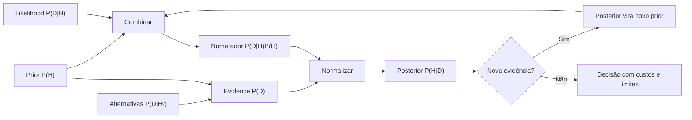

# Aula 04 — Teorema de Bayes e atualização de crenças

<!-- mirandastech-aula-v2 -->

**Trilha:** Especialista em IA  
**Módulo:** 02 · Probabilidade, Estatística e Teoria da Informação (M3)  
**Aula:** 04 de 24  
**Pré-requisitos:** [Aula 03 — probabilidade condicional e independência](./03-condicional-independencia.md), operações com frações e leitura de tabelas  
**Tempo sugerido:** 3 a 4 horas, incluindo laboratório e exercícios  
**Objetivo central:** atualizar probabilidades de hipóteses diante de evidências, combinando prevalência, qualidade da evidência e normalização sem inverter condicionais indevidamente.

> **Ideia-chave:** evidência forte a favor de uma hipótese rara pode ainda produzir uma probabilidade posterior moderada. Bayes combina o que sabíamos **antes** com a compatibilidade da nova evidência.

## O que você será capaz de fazer ao final

Ao concluir esta aula, você deverá conseguir:

- derivar o Teorema de Bayes a partir da regra do produto;
- distinguir prior, likelihood, evidence e posterior;
- calcular uma atualização binária por fórmula, tabela e frequências naturais;
- explicar a negligência da taxa-base;
- usar odds e razão de verossimilhança para atualizações sequenciais;
- aplicar Bayes a múltiplas hipóteses discretas;
- interpretar MAP sem confundi-lo com decisão ótima para qualquer custo;
- explicar a hipótese central do Naive Bayes;
- realizar análise de sensibilidade ao prior e à taxa de falso positivo;
- reconhecer dupla contagem de evidências dependentes e mudança de distribuição.

## Mapa da aula



---

## 1. Problema motivador: 95% não significa 95%

Considere um sistema **didático e sintético** de triagem de falhas raras:

- 1% dos itens realmente possui a falha: $P(H)=0{,}01$;
- quando há falha, o sistema alerta em 95% dos casos: $P(+\mid H)=0{,}95$;
- quando não há falha, o sistema alerta em 5% dos casos: $P(+\mid H^c)=0{,}05$.

Um item recebeu alerta positivo. Qual é a probabilidade de ele realmente possuir a falha?

Uma resposta apressada seria 95%, confundindo

$$
P(+\mid H)
$$

com

$$
P(H\mid +).
$$

São perguntas diferentes:

- $P(+\mid H)$: entre os itens com falha, quantos alertam?
- $P(H\mid +)$: entre os itens que alertaram, quantos têm falha?

O Teorema de Bayes conecta essas direções sem ignorar que a falha é rara.

## 2. Resolva primeiro com frequências naturais

Imagine 10.000 itens sob exatamente essas proporções.

### Itens com falha

$$
10\,000\cdot0{,}01=100.
$$

O sistema alerta em 95% deles:

$$
100\cdot0{,}95=95.
$$

### Itens sem falha

$$
10\,000-100=9\,900.
$$

O sistema também alerta falsamente em 5% deles:

$$
9\,900\cdot0{,}05=495.
$$

### Tabela resultante

| Estado real | Alerta positivo | Alerta negativo | Total |
|---|---:|---:|---:|
| Falha $H$ | 95 | 5 | 100 |
| Sem falha $H^c$ | 495 | 9.405 | 9.900 |
| **Total** | **590** | **9.410** | **10.000** |

Entre os 590 alertas, apenas 95 correspondem à falha:

$$
P(H\mid +)=\frac{95}{590}\approx0{,}1610.
$$

O posterior é aproximadamente **16,10%**, não 95%. O alerta aumentou a probabilidade de 1% para 16,10%, o que é informativo, mas a grande população sem falha ainda produz muitos falsos alertas.

> Frequências naturais tornam o denominador visível e são uma excelente verificação contra erros de direção.

## 3. Vocabulário de Bayes

Considere uma hipótese $H$ e dados ou evidência $D$.

| Termo | Símbolo | Pergunta |
|---|---:|---|
| **Prior** | $P(H)$ | quão plausível era $H$ antes de observar $D$? |
| **Likelihood** | $P(D\mid H)$ | quão compatível é $D$ com $H$? |
| **Evidence** ou probabilidade marginal | $P(D)$ | quão provável é observar $D$ considerando todas as hipóteses? |
| **Posterior** | $P(H\mid D)$ | quão plausível fica $H$ depois de observar $D$? |

Em português, *likelihood* costuma ser traduzida como **verossimilhança**. Um cuidado conceitual:

- $P(D\mid H)$ é uma probabilidade sobre possíveis dados quando $H$ está fixada;
- vista como função de $H$ para um dado observado, a likelihood não precisa somar 1 sobre as hipóteses.

Nesta aula discreta, as hipóteses e probabilidades são declaradas explicitamente. A linguagem formal de variáveis aleatórias e distribuições será introduzida na Aula 05.

## 4. Derivação do Teorema de Bayes

Pela regra do produto da Aula 03:

$$
P(H\cap D)=P(D\mid H)P(H).
$$

Invertendo a ordem:

$$
P(H\cap D)=P(H\mid D)P(D).
$$

Como os lados esquerdos representam a mesma interseção:

$$
P(D\mid H)P(H)=P(H\mid D)P(D).
$$

Se $P(D)>0$:

$$
\boxed{P(H\mid D)=\frac{P(D\mid H)P(H)}{P(D)}}.
$$

Bayes não cria informação. Ele reorganiza probabilidades condicionais e normaliza o resultado.

## 5. O denominador vem da probabilidade total

No caso binário, $H$ e $H^c$ formam uma partição. Logo:

$$
P(D)=P(D\mid H)P(H)+P(D\mid H^c)P(H^c).
$$

Substituindo no Teorema de Bayes:

$$
P(H\mid D)=
\frac{P(D\mid H)P(H)}
{P(D\mid H)P(H)+P(D\mid H^c)P(H^c)}.
$$

Para o alerta:

$$
P(H\mid +)=
\frac{0{,}95\cdot0{,}01}
{0{,}95\cdot0{,}01+0{,}05\cdot0{,}99}
=\frac{0{,}0095}{0{,}059}
\approx0{,}1610.
$$

O denominador $0{,}059$ é a probabilidade marginal de um alerta: 0,95% da população é verdadeiro positivo e 4,95%, falso positivo.

## 6. Sensibilidade, especificidade e taxa de falso positivo

No exemplo binário:

| Medida | Definição | Valor |
|---|---:|---:|
| Sensibilidade | $P(+\mid H)$ | 0,95 |
| Taxa de falso negativo | $P(-\mid H)$ | 0,05 |
| Especificidade | $P(-\mid H^c)$ | 0,95 |
| Taxa de falso positivo | $P(+\mid H^c)$ | 0,05 |
| Valor posterior positivo no cenário | $P(H\mid +)$ | 0,1610 |

Sensibilidade e especificidade condicionam no estado real. O posterior condiciona no resultado observado e também depende da prevalência $P(H)$.

Este é um exemplo matemático, não orientação clínica ou operacional. Em aplicações reais, as taxas precisam ser estimadas na população relevante, com incerteza, desenho de estudo e custos de erro apropriados.

## 7. Negligência da taxa-base

**Taxa-base** é a frequência ou probabilidade anterior da hipótese no contexto relevante. Negligenciá-la significa avaliar a evidência sem ponderar quão comum era cada hipótese.

No exemplo:

- o alerta é 19 vezes mais provável com falha do que sem falha, pois $0{,}95/0{,}05=19$;
- mas itens sem falha são 99 vezes mais comuns que itens com falha;
- por isso, ainda há mais falsos positivos (495) do que verdadeiros positivos (95).

Uma taxa de falso positivo aparentemente pequena pode dominar quando a classe positiva é muito rara.

### Três perguntas antes de interpretar um alerta

1. Qual é a prevalência no grupo em que o sistema está operando?
2. Como sensibilidade e falso positivo foram medidos nesse grupo?
3. O fluxo de produção mudou desde a validação?

## 8. Odds e razões de verossimilhança

A probabilidade $p$ pode ser escrita como odds:

$$
O(H)=\frac{P(H)}{1-P(H)}.
$$

Para voltar a probabilidade:

$$
P(H)=\frac{O(H)}{1+O(H)}.
$$

A razão de verossimilhança positiva compara a chance de observar $+$ sob as duas hipóteses:

$$
LR^+=\frac{P(+\mid H)}{P(+\mid H^c)}.
$$

Bayes em odds assume a forma:

$$
\boxed{O(H\mid +)=O(H)\cdot LR^+}.
$$

No exemplo:

$$
O(H)=\frac{0{,}01}{0{,}99}\approx0{,}010101,
$$

$$
LR^+=\frac{0{,}95}{0{,}05}=19,
$$

$$
O(H\mid +)\approx0{,}191919.
$$

Convertendo:

$$
P(H\mid +)=\frac{0{,}191919}{1+0{,}191919}\approx0{,}1610.
$$

## 9. Atualização sequencial

Depois da primeira evidência, o posterior pode se tornar o prior da próxima atualização:


Em odds, para evidências $D_1,\ldots,D_n$ **condicionalmente independentes dada cada hipótese**:

$$
O(H\mid D_1,\ldots,D_n)
=O(H)\prod_{i=1}^{n}
\frac{P(D_i\mid H)}{P(D_i\mid H^c)}.
$$

Se dois alertas positivos têm $LR^+=19$ e satisfazem essa hipótese:

$$
O_{posterior}=\frac{0{,}01}{0{,}99}\cdot19^2
\approx3{,}6465,
$$

$$
P_{posterior}=\frac{3{,}6465}{1+3{,}6465}
\approx0{,}7848.
$$

### O risco da dupla contagem

Se os dois alertas usam o mesmo sensor, os mesmos dados ou falham pelo mesmo motivo, multiplicar dois LRs como se fossem independentes superestima a evidência. “Duas mensagens” não significam necessariamente “duas evidências independentes”.

## 10. Bayes com múltiplas hipóteses

Se $H_1,\ldots,H_k$ formam uma partição:

$$
P(H_i\mid D)=
\frac{P(D\mid H_i)P(H_i)}
{\sum_{j=1}^{k}P(D\mid H_j)P(H_j)}.
$$

O cálculo pode ser visto em três etapas:

1. **pontuação não normalizada:** $s_i=P(D\mid H_i)P(H_i)$;
2. **evidence:** $Z=\sum_j s_j$;
3. **posterior:** $P(H_i\mid D)=s_i/Z$.

Os posteriors resultantes são não negativos e somam 1.

### Exemplo resolvido: origem de um alerta

Três componentes podem originar um evento, com priors e likelihoods:

| Hipótese | Prior | $P(D\mid H_i)$ | Produto |
|---|---:|---:|---:|
| Sensor | 0,50 | 0,10 | 0,050 |
| Rede | 0,30 | 0,40 | 0,120 |
| Aplicação | 0,20 | 0,70 | 0,140 |

A evidence é

$$
Z=0{,}050+0{,}120+0{,}140=0{,}310.
$$

Logo:

$$
P(\text{Sensor}\mid D)=0{,}050/0{,}310\approx0{,}1613,
$$

$$
P(\text{Rede}\mid D)=0{,}120/0{,}310\approx0{,}3871,
$$

$$
P(\text{Aplicação}\mid D)=0{,}140/0{,}310\approx0{,}4516.
$$

## 11. MAP: hipótese mais provável após os dados

A estimativa de máximo a posteriori escolhe

$$
\hat h_{MAP}=\arg\max_h P(h\mid D).
$$

Como $P(D)$ é igual para todas as hipóteses comparadas:

$$
\hat h_{MAP}
=\arg\max_h P(D\mid h)P(h).
$$

No exemplo anterior, “Aplicação” é a hipótese MAP, com posterior aproximado de 45,16%.

### MAP não é decisão universal

Escolher a hipótese mais provável minimiza erro de classificação sob condições específicas, como custos simétricos. Se deixar de investigar uma falha de rede custa muito mais que investigar um falso alarme, a ação ótima pode não coincidir com o MAP. Probabilidade e utilidade são componentes diferentes da decisão.

## 12. Naive Bayes: Bayes com uma fatoração forte

Para classe $Y$ e atributos $X_1,\ldots,X_d$:

$$
P(Y\mid X_1,\ldots,X_d)
\propto P(Y)P(X_1,\ldots,X_d\mid Y).
$$

O Naive Bayes assume independência condicional dos atributos dada a classe:

$$
P(X_1,\ldots,X_d\mid Y)
=\prod_{j=1}^{d}P(X_j\mid Y).
$$

Assim:

$$
P(Y\mid X_1,\ldots,X_d)
\propto P(Y)\prod_{j=1}^{d}P(X_j\mid Y).
$$

### Exemplo numérico simplificado

Considere uma mensagem que contém as evidências `promoção` e `link`:

| Quantidade | Spam | Legítima |
|---|---:|---:|
| Prior da classe | 0,20 | 0,80 |
| $P(\text{promoção}\mid classe)$ | 0,70 | 0,05 |
| $P(\text{link}\mid classe)$ | 0,75 | 0,10 |

Scores não normalizados:

$$
s_{spam}=0{,}20\cdot0{,}70\cdot0{,}75=0{,}105,
$$

$$
s_{leg}=0{,}80\cdot0{,}05\cdot0{,}10=0{,}004.
$$

Normalizando:

$$
P(spam\mid evidências)=\frac{0{,}105}{0{,}105+0{,}004}
\approx0{,}9633.
$$

Esse número só é válido dentro do modelo e das probabilidades fornecidas. Evidências correlacionadas violam a fatoração e podem gerar excesso de confiança.

## 13. Produtos pequenos e domínio logarítmico

Multiplicar muitas probabilidades menores que 1 pode causar *underflow* numérico. Em vez de multiplicar, somamos logaritmos:

$$
\log s_y=\log P(y)+\sum_{j=1}^{d}\log P(x_j\mid y).
$$

O maior score logarítmico identifica o mesmo MAP porque o logaritmo é estritamente crescente. Para obter probabilidades normalizadas de forma estável, usa-se uma normalização do tipo *log-sum-exp*. O laboratório mostra uma implementação pequena; teoria da informação e log-loss voltarão nas Aulas 21 e 22.

## 14. Prior não é palpite descartável

O prior pode vir de:

- frequência histórica em uma população comparável;
- conhecimento de domínio formalizado;
- estudo anterior;
- distribuição deliberadamente ampla para análise de sensibilidade.

Um prior precisa registrar:

- população e período de referência;
- processo de coleta;
- justificativa;
- versão;
- incerteza ou alternativas plausíveis.

### Priors zero e um exigem cuidado

Se $P(H)=0$, então $P(H\mid D)=0$ para qualquer evidência com a fórmula usual. Se $P(H)=1$, o posterior permanece 1. Valores dogmáticos impedem aprendizagem pelo modelo. Reserve-os a impossibilidades ou certezas realmente estruturais, não a confiança subjetiva.

## 15. Análise de sensibilidade

Uma conclusão robusta não deveria depender silenciosamente de uma única escolha frágil. Recalcule o posterior sob diferentes:

- prevalências plausíveis;
- taxas de falso positivo;
- estimativas de sensibilidade;
- hipóteses de dependência entre evidências.

Mantendo sensibilidade 0,95 e falso positivo 0,05:

| Prior $P(H)$ | Posterior após $+$ |
|---:|---:|
| 0,1% | 1,87% |
| 1% | 16,10% |
| 5% | 50,00% |
| 10% | 67,86% |
| 50% | 95,00% |

O mesmo alerta produz posteriors diferentes em populações com prevalências diferentes.

## 16. Bayes não corrige um modelo mal especificado

O resultado pode falhar se:

- o prior não representa a população atual;
- a likelihood veio de uma amostra enviesada;
- sensibilidade e falso positivo mudaram em produção;
- evidências correlacionadas foram tratadas como independentes;
- classes relevantes foram omitidas;
- o dado foi selecionado depois de observar o resultado;
- o score do sistema não está calibrado.

Bayes garante coerência **dadas** as entradas e hipóteses. Não garante que elas correspondam ao mundo.

## 17. Laboratório reproduzível em Python

O laboratório implementa Bayes binário com validações, reconstrói a tabela de 10.000 itens, simula o mecanismo, atualiza odds sequencialmente, normaliza múltiplas hipóteses e visualiza a sensibilidade ao prior e ao falso positivo.

### 17.1 Abrir no Google Colab

[](https://colab.research.google.com/github/joaopaulomirandamatias/ai-lab/blob/main/02-statistics/notebooks/04-bayes-atualizacao-laboratorio.ipynb)

Para executar localmente:

```bash
python -m pip install "numpy>=1.24" "matplotlib>=3.7" jupyter
```

### 17.2 Implementação mínima e segura

```python
def bayes_binario(prior, sensibilidade, taxa_falso_positivo):
    valores = (prior, sensibilidade, taxa_falso_positivo)
    if not all(0 <= x <= 1 for x in valores):
        raise ValueError("Todas as probabilidades devem estar em [0, 1].")

    evidencia = sensibilidade * prior + taxa_falso_positivo * (1 - prior)
    if evidencia == 0:
        raise ZeroDivisionError("A evidência observada tem probabilidade zero.")
    return sensibilidade * prior / evidencia

posterior = bayes_binario(0.01, 0.95, 0.05)
assert abs(posterior - 95 / 590) < 1e-12
```

## 18. Armadilhas e erros comuns

### 18.1 Falácia da probabilidade inversa

Confundir $P(D\mid H)$ com $P(H\mid D)$. Sempre escreva ambas em palavras e identifique o denominador.

### 18.2 Ignorar a taxa-base

Usar apenas sensibilidade ou likelihood descarta a prevalência da hipótese.

### 18.3 Esquecer hipóteses alternativas

O denominador precisa contabilizar todas as rotas relevantes para a evidência. Uma classe omitida distorce a normalização.

### 18.4 Contar a mesma evidência duas vezes

Relatórios derivados da mesma fonte podem ser redundantes. A multiplicação sequencial de LRs requer a fatoração condicional declarada.

### 18.5 Interpretar posterior como frequência universal

O posterior vale para o modelo, prior, evidência e população especificados. Mudar o contexto muda a resposta.

### 18.6 Confundir MAP e certeza

A hipótese MAP é apenas a mais provável entre as consideradas. Pode ter posterior baixo e pode não determinar a melhor ação.

### 18.7 Escolher o prior depois de ver o resultado

Ajustar silenciosamente o prior até obter a conclusão desejada compromete a análise. Registre escolhas antes ou apresente uma análise de sensibilidade transparente.

## 19. Checklist prático

Antes de aceitar uma atualização bayesiana, confirme:

- [ ] defini hipóteses mutuamente exclusivas e suficientemente abrangentes;
- [ ] escrevi prior, likelihood, evidence e posterior em palavras;
- [ ] não troquei $P(D\mid H)$ por $P(H\mid D)$;
- [ ] justifiquei o prior para a população relevante;
- [ ] incluí as hipóteses alternativas no denominador;
- [ ] verifiquei se as evidências podem ser dependentes;
- [ ] evitei probabilidades exatamente 0 ou 1 sem justificativa estrutural;
- [ ] executei análise de sensibilidade;
- [ ] diferenciei hipótese mais provável de ação de menor custo;
- [ ] documentei dados, período, versões e limitações.

## 20. Resumo de bolso

| Conceito | Expressão |
|---|---:|
| Bayes | $P(H\mid D)=P(D\mid H)P(H)/P(D)$ |
| Evidence binária | $P(D)=P(D\mid H)P(H)+P(D\mid H^c)P(H^c)$ |
| Odds | $O(H)=P(H)/(1-P(H))$ |
| Atualização em odds | $O(H\mid D)=O(H)\cdot LR$ |
| Múltiplas hipóteses | $P(H_i\mid D)=s_i/\sum_j s_j$ |
| Score bayesiano | $s_i=P(D\mid H_i)P(H_i)$ |
| MAP | $\arg\max_h P(h\mid D)$ |
| Naive Bayes | $P(Y\mid X)\propto P(Y)\prod_jP(X_j\mid Y)$ |

## 21. Exercícios

1. Um evento tem prior de 2%, sensibilidade de 90% e taxa de falso positivo de 10%. Calcule $P(H\mid +)$.
2. Resolva o exercício anterior com frequências naturais em uma população de 10.000 itens.
3. No exemplo principal, calcule $P(H\mid -)$.
4. Uma hipótese tem prior 0,20. Uma evidência possui $LR=4$. Calcule odds anteriores, odds posteriores e probabilidade posterior.
5. Três hipóteses têm priors $(0{,}5,0{,}3,0{,}2)$ e likelihoods $(0{,}1,0{,}4,0{,}7)$. Reproduza os posteriors da aula.
6. Por que dois alertas do mesmo modelo sobre a mesma entrada não devem ser multiplicados automaticamente como evidências independentes?
7. Em um Naive Bayes com duas classes, os scores não normalizados são 0,03 e 0,07. Quais são os posteriors e a classe MAP?
8. Se o prior de uma hipótese for exatamente zero, o que ocorre com o posterior pela fórmula usual? Qual é o risco prático?
9. Um classificador tem ótimo ranking, mas seus scores de 0,9 correspondem empiricamente a apenas 60% de positivos. O score deve ser tratado como posterior calibrado? Explique.
10. Cite duas mudanças de produção que podem invalidar priors ou likelihoods estimados no passado.

<details>
<summary><strong>Respostas comentadas</strong></summary>

1. $P(H\mid +)=\frac{0{,}90\cdot0{,}02}{0{,}90\cdot0{,}02+0{,}10\cdot0{,}98}=0{,}1552$, aproximadamente 15,52%.
2. Há 200 casos de $H$, com 180 positivos; entre 9.800 casos de $H^c$, há 980 falsos positivos. Portanto, $180/(180+980)=180/1\,160\approx15{,}52\%$.
3. $P(H\mid -)=\frac{0{,}05\cdot0{,}01}{0{,}05\cdot0{,}01+0{,}95\cdot0{,}99}\approx0{,}000531$, ou 0,0531%.
4. Odds anteriores: $0{,}20/0{,}80=0{,}25$. Odds posteriores: $0{,}25\cdot4=1$. Probabilidade posterior: $1/(1+1)=0{,}50$.
5. Scores: $(0{,}05,0{,}12,0{,}14)$; soma 0,31; posteriors aproximados: $(0{,}1613,0{,}3871,0{,}4516)$.
6. Eles podem ser perfeitamente correlacionados ou compartilhar erros e dados. Multiplicar como independentes contaria duas vezes a mesma informação.
7. A soma é 0,10; posteriors 0,30 e 0,70. A segunda classe é MAP.
8. O numerador permanece zero, então o posterior é zero. Um prior dogmático impede que qualquer evidência ordinária recupere a hipótese.
9. Não. Ranking e calibração são propriedades diferentes; a frequência observada indica que 0,9 não representa 90% naquele contexto.
10. Exemplos: mudança de prevalência, novo perfil de usuários, sensor substituído, alteração de limiar, mudança de coleta ou *concept drift*.

</details>

### Desafio de transferência

Escolha um alerta realista de sensor, agente ou classificador e documente:

| Campo | Sua definição |
|---|---|
| Hipótese $H$ | |
| Evidência $D$ | |
| Prior e origem | |
| $P(D\mid H)$ e origem | |
| Hipóteses alternativas | |
| Evidence $P(D)$ | |
| Posterior | |
| Evidências dependentes? | |
| Cenários da análise de sensibilidade | |
| Ação e custos dos erros | |
| O que o posterior não prova | |

## 22. Critério de domínio

Você domina esta aula quando consegue, sem consultar o texto:

- derivar Bayes pela igualdade das duas regras do produto;
- resolver o problema de taxa-base por fórmula e frequências naturais;
- identificar todos os termos do teorema;
- atualizar odds com uma razão de verossimilhança;
- normalizar scores de múltiplas hipóteses;
- explicar MAP e seu limite decisório;
- apontar quando uma atualização sequencial conta evidência duas vezes;
- executar o notebook e interpretar a análise de sensibilidade.

### Rubrica

| Nível | Evidência de aprendizagem |
|---:|---|
| 0 — Reconhecimento | Recita a fórmula, mas inverte condicionais |
| 1 — Representação | Identifica prior, likelihood, evidence e posterior |
| 2 — Cálculo | Atualiza uma ou várias hipóteses corretamente |
| 3 — Justificativa | Explicita taxa-base, alternativas e dependências |
| 4 — Transferência | Constrói uma atualização auditável e analisa sensibilidade e decisão |

Avance quando alcançar pelo menos o nível 3.

## 23. Leituras e fontes verificadas

### Essenciais

- Joseph K. Blitzstein e Jessica Hwang. [*Introduction to Probability* e Harvard Stat 110](https://stat110.hsites.harvard.edu/). Livro aberto, aulas e problemas de Bayes.
- MIT OpenCourseWare. [18.05 — Conditional Probability, Independence and Bayes’ Theorem](https://ocw.mit.edu/courses/18-05-introduction-to-probability-and-statistics-spring-2022/pages/classes-reading-and-in-class-materials/). Leituras, slides, exercícios e soluções.
- Kevin P. Murphy. [*Probabilistic Machine Learning: An Introduction*](https://probml.github.io/pml-book/book1.html). Livro e código de apoio sobre probabilidade e inferência em ML.

### Aplicações e aprofundamento

- Richard McElreath. [*Statistical Rethinking*](https://xcelab.net/rm/statistical-rethinking/). Materiais oficiais sobre modelagem bayesiana e atualização.
- scikit-learn. [Naive Bayes](https://scikit-learn.org/stable/modules/naive_bayes.html). Documentação oficial das variantes e suas hipóteses.

### Referências técnicas do laboratório

- NumPy. [`Generator`](https://numpy.org/doc/stable/reference/random/generator.html). Gerador usado nas simulações reproduzíveis.
- Matplotlib. [`imshow`](https://matplotlib.org/stable/api/_as_gen/matplotlib.pyplot.imshow.html). Referência do mapa de sensibilidade.

## 24. Continue a formação

**Próxima aula:** [Aula 05 — Variáveis aleatórias, PMF, PDF e CDF](./05-variaveis-aleatorias-pmf-pdf-cdf.md)

Na próxima etapa, resultados numéricos serão representados por variáveis aleatórias, e você aprenderá a distinguir massa, densidade e probabilidade acumulada.

---

**Repositório da formação:** [AI Systems Laboratory](https://github.com/joaopaulomirandamatias/ai-lab)  
**Série:** Probabilidade, Estatística e Teoria da Informação · 24 aulas
