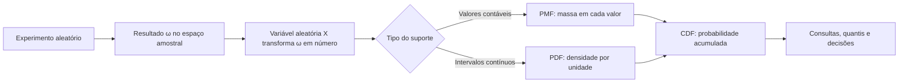
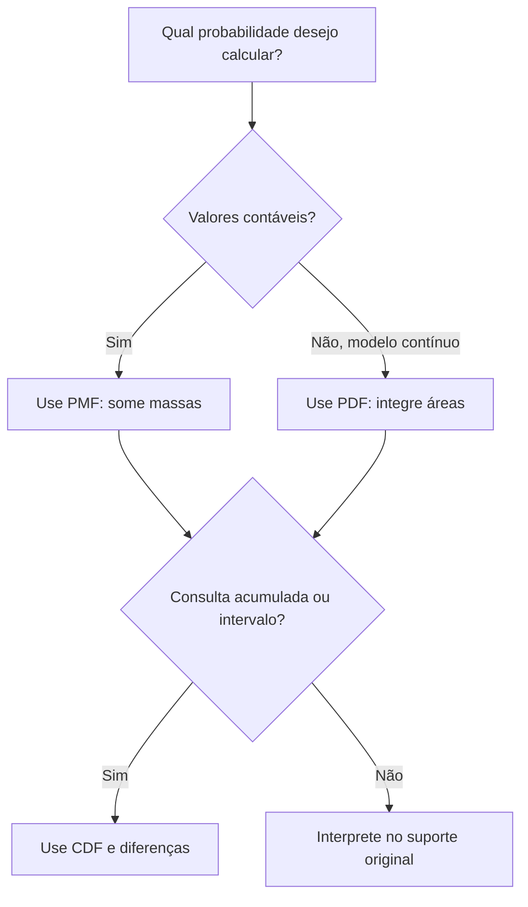

# Aula 05 — Variáveis aleatórias, PMF, PDF e CDF

<!-- mirandastech-aula-v2 -->

> **Trilha:** Estatística para IA  
> **Tempo sugerido:** 90–120 minutos de estudo + 45–60 minutos de laboratório  
> **Pré-requisitos:** eventos e probabilidade (Aula 01), probabilidade condicional (Aula 03) e atualização bayesiana (Aula 04)

Na aula anterior, atualizamos crenças sobre hipóteses. Agora precisamos descrever numericamente **o que pode ser observado**: quantos alertas surgirão, qual será a latência de uma requisição ou que confiança um classificador atribuirá a uma classe. Essa é a função das variáveis aleatórias e de suas distribuições.

---

## 1. Problema motivador: dois tipos de incerteza

Considere uma API que atende uma aplicação de IA. Em uma janela de três verificações, queremos modelar:

- \(X\): número de verificações que geram alerta — valores possíveis \(0,1,2,3\);
- \(T\): tempo de resposta — qualquer valor real não negativo, como \(0{,81\) s ou \(1{,237\) s.

Ambas são quantidades incertas, mas exigem representações diferentes. Para \(X\), faz sentido atribuir probabilidade a cada valor. Para \(T\), um ponto isolado tem probabilidade zero no modelo contínuo; probabilidades pertencem a **intervalos**. A CDF oferece uma linguagem comum aos dois casos.

## 2. Objetivos de aprendizagem

Ao final, você deverá conseguir:

1. explicar o que é uma variável aleatória e distinguir variável de realização observada;
2. reconhecer variáveis discretas, contínuas e mistas pelo suporte;
3. validar e usar uma PMF para calcular probabilidades;
4. interpretar uma PDF sem confundir altura com probabilidade;
5. calcular probabilidades pela CDF e recuperar massas ou densidades;
6. relacionar distribuições a classificadores, regressão probabilística e modelos generativos;
7. construir e verificar distribuições em Python de forma reproduzível.

## 3. Vocabulário essencial

| Termo | Significado |
|---|---|
| Experimento aleatório | Processo cujo resultado não é conhecido antes da observação. |
| Espaço amostral \(\Omega\) | Conjunto de resultados elementares possíveis. |
| Variável aleatória \(X\) | Função que associa um número real a cada resultado do experimento. |
| Realização \(x\) | Valor concreto observado de \(X\). |
| Suporte | Conjunto de valores aos quais a distribuição atribui massa ou densidade relevante. |
| PMF | Função massa de probabilidade de uma variável discreta. |
| PDF | Função densidade de probabilidade de uma variável contínua. |
| CDF | Função distribuição acumulada, válida para qualquer variável real. |
| Quantil | Limiar abaixo do qual se acumula determinada fração de probabilidade. |

## 4. Variável aleatória: a ponte entre resultados e números

Formalmente, uma variável aleatória real é uma função

$$
X:\Omega\rightarrow\mathbb{R}.
$$

Ela não “escolhe” uma fórmula ao acaso. A regra \(X(\omega)\) é fixa; o que varia é o resultado \(\omega\) do experimento. Em uma definição rigorosa, \(X\) também precisa ser mensurável, condição que garante que eventos como \(\{X\leq x\}\) tenham probabilidade definida.

### Exemplo: duas moedas

No lançamento de duas moedas,

$$
\Omega=\{CC, CK, KC, KK\},
$$

em que \(C\) é cara e \(K\) é coroa. Defina \(X\) como o número de caras:

| Resultado \(\omega\) | \(CC\) | \(CK\) | \(KC\) | \(KK\) |
|---|---:|---:|---:|---:|
| \(X(\omega)\) | 2 | 1 | 1 | 0 |

Resultados diferentes podem produzir o mesmo valor. A distribuição de \(X\) reúne as probabilidades dos resultados que chegam a cada número.

> **Variável, realização e amostra:** antes do experimento escrevemos \(X\); depois de observar uma cara, por exemplo, registramos \(x=1\). Uma coleção \(x_1,\ldots,x_n\) é uma amostra observada de variáveis aleatórias.

## 5. Discreta, contínua ou mista?

A classificação depende dos valores que a variável pode assumir e de como a probabilidade é distribuída.

| Tipo | Suporte típico | Ferramenta principal | Exemplo em IA |
|---|---|---|---|
| Discreta | Finito ou contável | PMF e CDF | classe prevista, número de tokens, contagem de erros |
| Contínua | Intervalos de números reais | PDF e CDF | latência, temperatura, ruído de sensor |
| Mista | Pontos com massa + trecho contínuo | CDF; massa e densidade | tempo de espera com chance de atendimento imediato |

Uma quantidade medida com casas decimais não é automaticamente contínua. Um sensor digital registra valores discretizados, embora um modelo contínuo possa ser uma aproximação útil. O modelo é uma escolha que deve respeitar o fenômeno e a precisão necessária.

## 6. PMF: probabilidade em valores discretos

Para uma variável discreta \(X\), a função massa de probabilidade é

$$
p_X(x)=P(X=x).
$$

Uma PMF válida satisfaz:

$$
p_X(x)\geq 0 \quad\text{e}\quad \sum_x p_X(x)=1.
$$

Para qualquer conjunto \(A\) de valores,

$$
P(X\in A)=\sum_{x\in A}p_X(x).
$$

### Exemplo resolvido: número de caras

Se as duas moedas forem justas e independentes, os quatro resultados elementares têm probabilidade \(1/4\). Logo:

| \(x\) | 0 | 1 | 2 |
|---:|---:|---:|---:|
| \(p_X(x)\) | \(1/4\) | \(2/4\) | \(1/4\) |

**Passo 1 — valide:** \(1/4+2/4+1/4=1\).  
**Passo 2 — traduza o evento:** “ao menos uma cara” é \(X\geq1\).  
**Passo 3 — some as massas:**

$$
P(X\geq1)=p_X(1)+p_X(2)=\frac{2}{4}+\frac{1}{4}=\frac{3}{4}.
$$

As barras de uma PMF representam probabilidades; sua soma é 1. Isso contrasta com uma PDF, em que a **área**, não a soma de alturas, é normalizada.

## 7. PDF: densidade em variáveis contínuas

Uma variável contínua pode ser descrita por uma função densidade \(f_X\) tal que

$$
f_X(x)\geq0 \quad\text{e}\quad \int_{-\infty}^{\infty}f_X(x)\,dx=1.
$$

A probabilidade de um intervalo é sua área sob a curva:

$$
P(a\leq X\leq b)=\int_a^b f_X(x)\,dx.
$$

### Exemplo resolvido: latência uniforme

Suponha, apenas para fins didáticos, que \(T\) seja uniforme entre 0 e 4 segundos:

$$
f_T(t)=
\begin{cases}
1/4, & 0\leq t\leq4,\\
0, & \text{caso contrário.}
\end{cases}
$$

Para encontrar a chance de a latência ficar entre 1 e 2,5 segundos:

$$
P(1\leq T\leq2{,}5)
=\int_1^{2{,}5}\frac14\,dt
=\frac{2{,}5-1}{4}
=0{,}375.
$$

### Por que \(P(X=x)=0\) não significa “impossível”?

Um ponto tem largura zero. Portanto, em um modelo contínuo,

$$
P(X=x)=\int_x^x f_X(t)\,dt=0.
$$

Ainda assim, algum valor será observado. Probabilidade zero e impossibilidade não são sinônimos em espaços contínuos: cada ponto isolado tem massa zero, enquanto um intervalo reúne infinitos pontos e pode ter área positiva.

### Uma densidade pode ser maior que 1

Se \(U\) é uniforme em \([0,0{,}5]\), então \(f_U(u)=2\) nesse intervalo. Isso é válido porque a área total é \(2\times0{,}5=1\). A altura da PDF tem unidade “probabilidade por unidade de \(x\)”; ela não é uma probabilidade isolada.

## 8. CDF: uma linguagem universal

A função distribuição acumulada é

$$
F_X(x)=P(X\leq x).
$$

Ela existe para variáveis discretas, contínuas e mistas. Toda CDF:

- é não decrescente;
- é contínua à direita;
- tende a 0 quando \(x\to-\infty\);
- tende a 1 quando \(x\to+\infty\).

Para \(a<b\), a identidade que respeita os extremos é

$$
P(a<X\leq b)=F_X(b)-F_X(a).
$$

Em uma variável contínua, pontos isolados têm probabilidade zero, então trocar \(<\) por \(\leq\) nos extremos não muda o resultado. Em uma variável discreta, pode mudar.

### CDF da contagem de caras

Para a PMF da seção 6:

$$
F_X(x)=
\begin{cases}
0, & x<0,\\
1/4, & 0\leq x<1,\\
3/4, & 1\leq x<2,\\
1, & x\geq2.
\end{cases}
$$

Observe os saltos. A massa em \(x\) é o tamanho do salto:

$$
P(X=x)=F_X(x)-F_X(x^-),
$$

em que \(F_X(x^-)\) é o limite da CDF pela esquerda.

### CDF da latência uniforme

Para \(T\sim\operatorname{Uniforme}(0,4)\):

$$
F_T(t)=
\begin{cases}
0, & t<0,\\
t/4, & 0\leq t\leq4,\\
1, & t>4.
\end{cases}
$$

Assim,

$$
P(1<T\leq2{,}5)=F_T(2{,}5)-F_T(1)=0{,}625-0{,}25=0{,}375.
$$

Quando a CDF é diferenciável, recuperamos a densidade por

$$
f_X(x)=\frac{d}{dx}F_X(x).
$$

## 9. PMF, PDF e CDF lado a lado

| Pergunta | PMF | PDF | CDF |
|---|---|---|---|
| Para que variável? | Discreta | Contínua | Qualquer variável real |
| Valor da função | Probabilidade no ponto | Densidade no ponto | Probabilidade acumulada até o ponto |
| Normalização | \(\sum_xp(x)=1\) | \(\int f(x)dx=1\) | limites 0 e 1 |
| Probabilidade pontual | \(P(X=x)=p(x)\) | \(P(X=x)=0\) | tamanho do salto, se houver |
| Probabilidade em intervalo | Soma de massas | Integral da densidade | Diferença entre valores da CDF |
| Unidade vertical | Probabilidade | Probabilidade por unidade de \(x\) | Probabilidade |

Uma regra mental útil:

## 10. Quantis e amostragem pela CDF

O quantil de nível \(q\in(0,1)\) pode ser definido por

$$
Q(q)=\inf\{x:F_X(x)\geq q\}.
$$

Por exemplo, o quantil 0,95 da latência é um limiar abaixo do qual se encontra pelo menos 95% da distribuição. Isso é diretamente útil em acordos de nível de serviço e análise de cauda.

A CDF também permite amostrar algumas distribuições. Se \(U\sim\operatorname{Uniforme}(0,1)\) e \(F\) é contínua e invertível, então

$$
X=F^{-1}(U)
$$

tem CDF \(F\). O laboratório demonstra esse princípio para a uniforme, sem depender de fórmulas de distribuições que serão estudadas nas aulas seguintes.

## 11. Distribuição teórica, amostra e estimativa

Não confunda três objetos:

1. **Distribuição teórica:** modelo que atribui probabilidades ou densidades.
2. **Amostra:** valores efetivamente observados.
3. **Estimativa empírica:** resumo calculado a partir da amostra, como frequências, histograma ou CDF empírica.

A CDF empírica de uma amostra \(x_1,\ldots,x_n\) é

$$
\widehat F_n(x)=\frac1n\sum_{i=1}^n\mathbf{1}(x_i\leq x),
$$

onde \(\mathbf{1}(\cdot)\) vale 1 quando a condição é verdadeira e 0 caso contrário. Ela é uma função em degraus, mesmo quando o modelo teórico é contínuo.

Histogramas dependem da largura e da posição dos intervalos. Com `density=True`, a área total se aproxima de 1; as alturas deixam de ser probabilidades de cada barra.

## 12. Conexões com IA e machine learning

### Classificação e geração de tokens

Após a normalização, a saída de um classificador multiclasse ou de um modelo de linguagem define uma PMF sobre um conjunto discreto de classes ou tokens:

$$
\sum_{k=1}^K P(Y=k\mid\mathbf{x})=1.
$$

Cada valor é uma massa. Amostrar um token significa selecionar um resultado segundo essa distribuição.

### Regressão probabilística

Um modelo pode produzir não apenas um número, mas uma densidade condicional \(f_{Y\mid\mathbf{x}}(y)\). Intervalos preditivos dependem de áreas ou quantis, e não da altura isolada da densidade.

### Modelos generativos e likelihood

No caso discreto, a verossimilhança usa massas; no contínuo, usa valores de densidade. A densidade em um ponto pode participar de comparações de modelos mesmo sem ser a probabilidade daquele ponto. Produtos de muitos termos podem causar instabilidade numérica; o tratamento por logaritmos, já visto em Bayes, continua importante.

### Decisões por limiar

Se uma ação é tomada quando \(X>c\), então

$$
P(X>c)=1-F_X(c).
$$

Essa forma aparece em detecção de anomalias, alertas de latência e estimativa de risco. A escolha do limiar é uma decisão; a distribuição quantifica a incerteza associada.

## 13. Roteiro prático para modelar uma variável

1. Defina o experimento e o que será observado.
2. Escreva a variável como regra numérica, incluindo unidade.
3. Identifique o suporte possível, não apenas os valores vistos na amostra.
4. Escolha uma representação discreta, contínua ou mista coerente.
5. Verifique não negatividade e normalização.
6. Traduza a pergunta para um evento, como \(X\in A\) ou \(X\leq x\).
7. Some massas, integre densidades ou subtraia valores da CDF.
8. Compare o resultado teórico com simulação ou dados quando possível.
9. Registre hipóteses, unidades, seed e tamanho da amostra.

## 14. Armadilhas e erros comuns

- **Tratar \(f(x)\) como \(P(X=x)\):** em modelos contínuos, probabilidades são áreas.
- **Exigir que a PDF seja menor que 1:** somente a área total precisa ser 1.
- **Somar alturas de uma PDF:** use integração; a soma depende da malha escolhida.
- **Ignorar extremos em variáveis discretas:** \(P(a<X\leq b)=F(b)-F(a)\), não necessariamente \(P(a\leq X\leq b)\).
- **Confundir variável com valor observado:** \(X\) é o objeto aleatório; \(x\) é uma realização.
- **Normalizar pelo número de valores:** uma PMF precisa somar 1, mas não precisa ser uniforme.
- **Usar histograma como verdade:** ele é uma estimativa sensível aos intervalos.
- **Ignorar suporte e unidades:** densidade positiva fora da região possível indica modelo ou código incorreto.
- **Interpretar probabilidade zero como impossibilidade:** essa equivalência falha em espaços contínuos.
- **Usar scores brutos como probabilidades:** valores precisam satisfazer os axiomas após transformação apropriada.

## 15. Laboratório reproduzível

O notebook [`05-variaveis-aleatorias-laboratorio.ipynb`](../notebooks/05-variaveis-aleatorias-laboratorio.ipynb) contém:

- construção e validação da PMF de duas moedas;
- comparação entre probabilidades exatas e frequências simuladas;
- CDF discreta em degraus;
- PDF e CDF de uma latência uniforme;
- demonstração de densidade maior que 1;
- CDF empírica e amostragem por transformação inversa;
- testes automáticos de normalização, suporte e resultados.

Dependências: Python 3.10+, NumPy 1.24+, Matplotlib 3.7+ e SciPy 1.10+. A seed `20260907` torna a simulação reproduzível. O notebook pode ser executado localmente ou pelo botão do Colab no início da aula.

## 16. Checklist de domínio

Antes de avançar, confirme se você consegue:

- [ ] definir uma variável aleatória como função de \(\Omega\) em \(\mathbb R\);
- [ ] identificar variável, realização, suporte e unidade;
- [ ] verificar se uma tabela é uma PMF válida;
- [ ] obter uma probabilidade discreta somando massas;
- [ ] obter uma probabilidade contínua pela área da PDF;
- [ ] explicar por que uma PDF pode superar 1;
- [ ] calcular intervalos com diferenças da CDF;
- [ ] reconhecer saltos da CDF como massas pontuais;
- [ ] distinguir distribuição teórica, amostra, histograma e CDF empírica;
- [ ] conectar PMFs e PDFs a saídas probabilísticas em IA.

## 17. Exercícios

### 1. PMF válida

Uma variável \(Z\) assume \(-1,0,1\) com massas \(0{,}2\), \(0{,}5\) e \(0{,}4\). Essa é uma PMF válida? Se não, qual axioma falha?

### 2. Consulta discreta

Para a PMF do número de caras em duas moedas justas, calcule \(P(0<X\leq2)\) diretamente e pela CDF.

### 3. PDF constante

Se \(Y\) tem densidade constante \(c\) em \([2,5]\) e zero fora desse intervalo:

1. encontre \(c\);
2. calcule \(P(3\leq Y\leq4{,}5)\);
3. calcule \(P(Y=4)\).

### 4. CDF e extremos

Uma variável discreta tem \(F(0)=0{,}10\), \(F(1)=0{,}35\) e \(F(2)=0{,}80\). Calcule \(P(0<X\leq2)\) e a massa em \(X=2\), sabendo que \(F(2^-)=0{,}35\).

### 5. Densidade ou probabilidade?

Um modelo contínuo informa \(f(1{,}2)=1{,}7\). É correto dizer que existe 170% de chance de \(X=1{,}2\)? Explique.

### 6. Aplicação em IA

Um classificador retorna massas \((0{,}05,0{,}15,0{,}80)\) para três classes. Já um modelo de latência retorna uma PDF. Qual objeto usar para calcular: (a) a chance da terceira classe; (b) a chance de latência entre 100 e 200 ms; (c) a chance de latência até 200 ms?

## 18. Respostas comentadas

### 1.

Não. As massas são não negativas, mas somam \(0{,}2+0{,}5+0{,}4=1{,}1\), violando a normalização.

### 2.

O evento contém \(X=1\) e \(X=2\), logo \(P=1/2+1/4=3/4\). Pela CDF, \(F(2)-F(0)=1-1/4=3/4\). A subtração remove a massa de \(X=0\), coerentemente com o extremo aberto.

### 3.

A área total é \(3c=1\), então \(c=1/3\). O intervalo tem largura \(1{,}5\), portanto a probabilidade é \(1{,}5/3=0{,}5\). Como \(Y\) é contínua, \(P(Y=4)=0\).

### 4.

\(P(0<X\leq2)=F(2)-F(0)=0{,}80-0{,}10=0{,}70\). A massa em 2 é o salto: \(F(2)-F(2^-)=0{,}80-0{,}35=0{,}45\).

### 5.

Não. \(1{,}7\) é densidade por unidade de \(X\), não probabilidade. Em um modelo contínuo, \(P(X=1{,}2)=0\); a probabilidade de um intervalo ao redor de 1,2 é a área da densidade nesse intervalo.

### 6.

(a) use diretamente a PMF: \(0{,}80\); (b) integre a PDF entre 100 e 200 ms ou subtraia as CDFs; (c) use a CDF em 200 ms. É indispensável manter a unidade coerente com a PDF.

## 19. Resumo

- Variável aleatória é uma função que transforma resultados em números.
- PMF atribui massas a valores discretos; suas massas somam 1.
- PDF atribui densidade a valores contínuos; probabilidades são áreas e a densidade pode exceder 1.
- CDF acumula \(P(X\leq x)\), serve para qualquer variável real e calcula intervalos por diferenças.
- Saltos da CDF revelam massas pontuais; derivadas revelam densidades onde existirem.
- Uma amostra não é a distribuição, e um histograma é apenas uma estimativa dela.
- Esses conceitos sustentam classificação probabilística, regressão, amostragem generativa e decisões por limiar.

## 20. Referências

### Fontes técnicas

- BLITZSTEIN, Joseph K.; HWANG, Jessica. *Introduction to Probability*. Chapman & Hall/CRC. Materiais abertos do curso Stat 110: <https://stat110.hsites.harvard.edu/>.
- MIT OpenCourseWare. *18.05 Introduction to Probability and Statistics — Class 4: Discrete Random Variables; Class 5: Continuous Random Variables*. <https://ocw.mit.edu/courses/18-05-introduction-to-probability-and-statistics-spring-2022/pages/classes-reading-and-in-class-materials/>.
- NIST/SEMATECH. *e-Handbook of Statistical Methods — Probability Distribution Functions*. <https://www.itl.nist.gov/div898/handbook/eda/section3/eda362.htm>.
- MURPHY, Kevin P. *Probabilistic Machine Learning: An Introduction*. MIT Press, 2022. <https://probml.github.io/pml-book/book1.html>.

### Documentação do laboratório

- NumPy. *Random Generator*. <https://numpy.org/doc/stable/reference/random/generator.html>.
- SciPy. *Statistical functions (`scipy.stats`)*. <https://docs.scipy.org/doc/scipy/reference/stats.html>.
- Matplotlib. *Visualization with Python*. <https://matplotlib.org/stable/>.

---

## Próxima aula

Na [Aula 06 — Esperança, variância e covariância](06-esperanca-variancia-covariancia.md), usaremos as distribuições construídas aqui para resumir centro, dispersão e variação conjunta. Nesta aula aprendemos a representar a incerteza; na próxima, aprenderemos a extrair números que a resumem sem perder de vista suas limitações.
