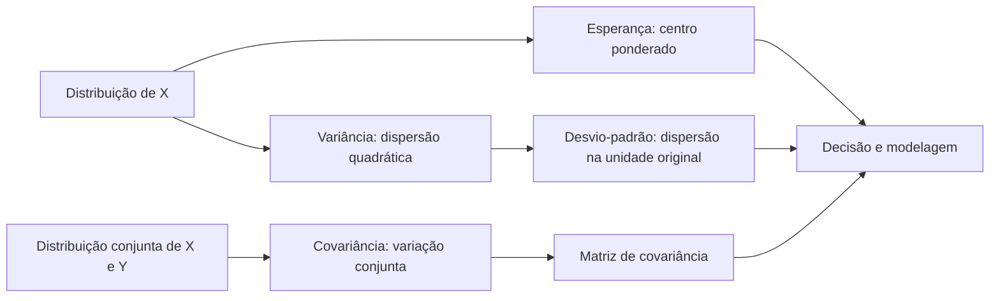
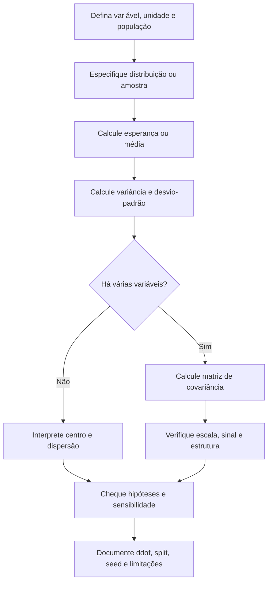

# Aula 06 — Esperança, variância e covariância

<!-- mirandastech-aula-v2 -->

> **Trilha:** Estatística para IA  
> **Tempo sugerido:** 100–130 minutos de estudo + 50–70 minutos de laboratório  
> **Pré-requisito principal:** [Aula 05 — Variáveis aleatórias, PMF, PDF e CDF](05-variaveis-aleatorias-pmf-pdf-cdf.md)

Na aula anterior, aprendemos a representar uma distribuição. Agora vamos responder três perguntas complementares: **onde ela se concentra**, **quanto ela se espalha** e **como duas variáveis se movem juntas**. As respostas — esperança, variância e covariância — aparecem em normalização de dados, inicialização de redes, análise de atributos, PCA e quantificação de incerteza.

---

## 1. Problema motivador: a média sozinha esconde o risco

Dois sistemas de IA entregam o mesmo ganho médio de 10 unidades por execução:

- sistema A: sempre entrega 10;
- sistema B: entrega 0 ou 20, cada resultado com probabilidade 0,5.

Se olharmos somente o valor esperado, os sistemas parecem equivalentes. Mas o segundo oscila muito mais. Além disso, em um pipeline real, latência e consumo de memória podem aumentar juntos: conhecer cada dispersão isoladamente não descreve essa relação.

## 2. Objetivos de aprendizagem

Ao final, você deverá conseguir:

1. calcular e interpretar a esperança de variáveis discretas e contínuas;
2. aplicar a linearidade da esperança sem exigir independência;
3. obter variância pela definição e pela fórmula computacional;
4. distinguir variância de desvio-padrão e acompanhar suas unidades;
5. calcular covariância e interpretar seu sinal com cautela;
6. usar a variância de uma soma e entender onde entra a dependência;
7. ler uma matriz de covariância e verificar suas propriedades básicas;
8. diferenciar parâmetros populacionais de estimativas amostrais;
9. implementar os cálculos de maneira reproduzível e sem vazamento de dados.

## 3. Vocabulário essencial

| Termo | Ideia central |
|---|---|
| Esperança ou valor esperado | Média da distribuição, ponderada por probabilidades ou densidades. |
| Momento | Esperança de uma potência ou transformação, como \(E[X^2]\). |
| Desvio | Distância assinada \(X-E[X]\) em relação ao centro. |
| Variância | Média quadrática dos desvios em relação à esperança. |
| Desvio-padrão | Raiz da variância, expressa na unidade original. |
| Covariância | Medida de variação linear conjunta entre duas variáveis. |
| Matriz de covariância | Tabela de todas as variâncias e covariâncias de um vetor aleatório. |
| Parâmetro | Quantidade da distribuição populacional, como \(\mu\) ou \(\sigma^2\). |
| Estimativa | Valor calculado de uma amostra para aproximar um parâmetro. |

## 4. Esperança: centro ponderado da distribuição

Para uma variável aleatória discreta \(X\) com PMF \(p_X\):

$$
E[X]=\sum_x x\,p_X(x),
$$

desde que a soma exista. Para uma variável contínua com PDF \(f_X\):

$$
E[X]=\int_{-\infty}^{\infty}x f_X(x)\,dx,
$$

quando a integral estiver bem definida.

A esperança é um **centro de massa probabilístico**: valores mais prováveis pesam mais. Ela não precisa ser um resultado possível. Em um dado justo, \(E[X]=3{,}5\), embora nenhuma face mostre 3,5.

### Exemplo resolvido: retorno de uma decisão

Considere \(X\) com a seguinte PMF:

| Retorno \(x\) | \(-2\) | 1 | 4 |
|---:|---:|---:|---:|
| \(p_X(x)\) | 0,2 | 0,5 | 0,3 |

Primeiro valide a PMF: \(0{,}2+0{,}5+0{,}3=1\). Depois, pondere cada retorno:

$$
E[X]=(-2)(0{,}2)+(1)(0{,}5)+(4)(0{,}3)=1{,}3.
$$

Isso significa média teórica de longo prazo sob repetições comparáveis do mecanismo. Não afirma que a próxima execução retornará 1,3, nem que poucas execuções ficarão próximas desse valor.

## 5. Esperança de uma função: LOTUS

Muitas vezes desejamos \(E[g(X)]\), não apenas \(E[X]\). Não é necessário derivar primeiro a distribuição de \(g(X)\). Pela chamada *Law of the Unconscious Statistician* (LOTUS):

$$
E[g(X)]=\sum_x g(x)p_X(x)
$$

no caso discreto, e

$$
E[g(X)]=\int_{-\infty}^{\infty}g(x)f_X(x)\,dx
$$

no caso contínuo.

Para o exemplo anterior:

$$
E[X^2]=(-2)^2(0{,}2)+1^2(0{,}5)+4^2(0{,}3)=6{,}1.
$$

Esse segundo momento será usado para calcular a variância.

## 6. Linearidade da esperança

Para constantes \(a,b\) e variáveis \(X,Y\):

$$
E[aX+bY]=aE[X]+bE[Y].
$$

Essa propriedade vale **mesmo quando \(X\) e \(Y\) são dependentes**. Em particular:

$$
E[aX+b]=aE[X]+b.
$$

### Exemplo: custo total

Se \(X_i\) é o custo da requisição \(i\), então, sem supor independência,

$$
E\left[\sum_{i=1}^{n}X_i\right]=\sum_{i=1}^{n}E[X_i].
$$

Independência será relevante para simplificar a **variância** da soma, mas não para sua esperança.

## 7. Variância: dispersão quadrática

Defina \(\mu=E[X]\). A variância é

$$
\operatorname{Var}(X)=E[(X-\mu)^2].
$$

Elevar ao quadrado evita que desvios positivos e negativos se anulem e penaliza desvios grandes. Expandindo a expressão:

$$
\operatorname{Var}(X)=E[X^2]-\big(E[X]\big)^2.
$$

Essa identidade é útil para cálculo manual, embora implementações numéricas ingênuas possam perder precisão quando subtraem números muito grandes e próximos.

### Exemplo resolvido

Já encontramos \(E[X]=1{,}3\) e \(E[X^2]=6{,}1\). Logo:

$$
\operatorname{Var}(X)=6{,}1-(1{,}3)^2=6{,}1-1{,}69=4{,}41.
$$

O desvio-padrão é

$$
\sigma_X=\sqrt{\operatorname{Var}(X)}=\sqrt{4{,}41}=2{,}1.
$$

Se \(X\) está em reais, sua variância está em reais ao quadrado; o desvio-padrão volta à unidade original.

## 8. Como transformações alteram a dispersão

Para constantes \(a,b\):

$$
\operatorname{Var}(aX+b)=a^2\operatorname{Var}(X),
$$

$$
\operatorname{SD}(aX+b)=|a|\operatorname{SD}(X).
$$

Somar uma constante apenas desloca todos os valores; a dispersão não muda. Multiplicar por \(a\) multiplica os desvios por \(a\), por isso a variância recebe \(a^2\).

### Mesma esperança, riscos diferentes

| Sistema | Resultados | Esperança | Variância | Desvio-padrão |
|---|---|---:|---:|---:|
| A | sempre 10 | 10 | 0 | 0 |
| B | 0 ou 20, com 0,5 cada | 10 | 100 | 10 |

A escolha entre eles depende de tolerância ao risco, custos e objetivos. Estatística descreve a incerteza; não escolhe sozinha a utilidade da decisão.

## 9. Covariância: como duas variáveis variam juntas

Para variáveis \(X\) e \(Y\) com segundos momentos finitos:

$$
\operatorname{Cov}(X,Y)
=E[(X-E[X])(Y-E[Y])].
$$

Uma forma equivalente é

$$
\operatorname{Cov}(X,Y)=E[XY]-E[X]E[Y].
$$

Intuição sobre o sinal:

- **positiva:** valores acima da média de \(X\) tendem a acompanhar valores acima da média de \(Y\);
- **negativa:** valores acima da média de uma tendem a acompanhar valores abaixo da média da outra;
- **próxima de zero:** não há associação linear evidente — mas pode existir dependência não linear.

A covariância depende das unidades. Se \(X\) está em segundos e \(Y\) em megabytes, a covariância está em segundos·megabytes. Isso impede comparar diretamente magnitudes de pares em escalas diferentes. A correlação, aprofundada na Aula 19, padroniza essa medida.

## 10. Propriedades da covariância

Para constantes \(a,b,c,d\):

$$
\operatorname{Cov}(X,Y)=\operatorname{Cov}(Y,X),
$$

$$
\operatorname{Cov}(X,X)=\operatorname{Var}(X),
$$

$$
\operatorname{Cov}(aX+b,cY+d)=ac\operatorname{Cov}(X,Y).
$$

Constantes não variam; por isso, seus deslocamentos desaparecem da covariância.

### Independência implica covariância zero — a volta não vale

Quando \(X\) e \(Y\) são independentes e os momentos existem,

$$
E[XY]=E[X]E[Y],
$$

logo \(\operatorname{Cov}(X,Y)=0\). Porém, covariância zero não garante independência.

Considere \(X\in\{-1,0,1\}\), com probabilidades \(1/4,1/2,1/4\), e \(Y=X^2\). Por simetria, \(E[X]=0\) e \(E[X^3]=0\), então \(\operatorname{Cov}(X,Y)=0\). Mesmo assim, \(Y\) é totalmente determinado por \(X\): há dependência perfeita, porém não linear.

## 11. Variância de uma soma

Para duas variáveis:

$$
\operatorname{Var}(X+Y)
=\operatorname{Var}(X)+\operatorname{Var}(Y)
+2\operatorname{Cov}(X,Y).
$$

Mais geralmente,

$$
\operatorname{Var}(aX+bY)
=a^2\operatorname{Var}(X)+b^2\operatorname{Var}(Y)
+2ab\operatorname{Cov}(X,Y).
$$

Se \(X\) e \(Y\) forem independentes, a covariância é zero e as variâncias se somam. Variáveis positivamente associadas aumentam a dispersão da soma; covariância negativa pode reduzi-la.

> **Armadilha frequente:** \(\operatorname{Var}(X+Y)=\operatorname{Var}(X)+\operatorname{Var}(Y)\) não vale em geral. É preciso justificar covariância zero — e covariância zero, isoladamente, não prova independência.

## 12. Matriz de covariância

Para um vetor aleatório \(\mathbf X=(X_1,\ldots,X_d)^T\), defina \(\boldsymbol\mu=E[\mathbf X]\). Sua matriz de covariância é

$$
\boldsymbol\Sigma
=E\left[(\mathbf X-\boldsymbol\mu)(\mathbf X-\boldsymbol\mu)^T\right].
$$

O elemento \((i,j)\) é \(\operatorname{Cov}(X_i,X_j)\):

$$
\boldsymbol\Sigma=
\begin{bmatrix}
\operatorname{Var}(X_1) & \operatorname{Cov}(X_1,X_2) & \cdots\\
\operatorname{Cov}(X_2,X_1) & \operatorname{Var}(X_2) & \cdots\\
\vdots & \vdots & \ddots
\end{bmatrix}.
$$

Ela possui propriedades importantes:

- é quadrada e simétrica;
- sua diagonal contém variâncias não negativas;
- é semidefinida positiva: \(\mathbf a^T\boldsymbol\Sigma\mathbf a\geq0\) para todo vetor \(\mathbf a\);
- para \(\mathbf Y=A\mathbf X+\mathbf b\), vale \(\operatorname{Cov}(\mathbf Y)=A\boldsymbol\Sigma A^T\).

A última identidade diz como incerteza se propaga por transformações lineares. Geometricamente, variâncias e covariâncias determinam direção e extensão de uma nuvem de dados. Isso será reutilizado em normal multivariada e, mais tarde, em PCA.

## 13. População, amostra e `ddof`

Até aqui, \(E[X]\), \(\operatorname{Var}(X)\) e \(\operatorname{Cov}(X,Y)\) são **parâmetros da distribuição**. Com dados \(x_1,\ldots,x_n\), estimamos esses parâmetros.

Média amostral:

$$
\bar x=\frac1n\sum_{i=1}^{n}x_i.
$$

Variância com denominador \(n\), apropriada para descrever exatamente os valores disponíveis ou como estimador de máxima verossimilhança em certos modelos:

$$
s_n^2=\frac1n\sum_{i=1}^{n}(x_i-\bar x)^2.
$$

Variância amostral corrigida:

$$
s^2=\frac1{n-1}\sum_{i=1}^{n}(x_i-\bar x)^2.
$$

Sob amostragem IID e variância finita, o denominador \(n-1\) torna esse estimador não viesado para a variância populacional. Ele não é “sempre melhor”; a escolha depende do objetivo e deve ser declarada.

No NumPy:

- `np.var(x, ddof=0)` usa \(n\) por padrão;
- `np.var(x, ddof=1)` usa \(n-1\);
- `np.cov` usa, por padrão, a correção por \(n-1\) e interpreta linhas como variáveis, salvo `rowvar=False`.

## 14. Conexões com IA e machine learning

### Padronização de atributos

A transformação

$$
z=\frac{x-\mu}{\sigma}
$$

centraliza e reescala uma variável. Em um pipeline supervisionado, \(\mu\) e \(\sigma\) devem ser ajustados **somente no treino** e depois aplicados à validação e ao teste. Ajustá-los no conjunto inteiro vaza informação.

### Inicialização e propagação de sinais

Pesos com escala inadequada podem fazer ativações e gradientes explodirem ou desaparecerem. Estratégias de inicialização controlam a variância ao longo das camadas; a derivação específica pertence ao módulo de redes neurais, mas a linguagem vem desta aula.

### PCA e representação

PCA procura direções de alta variância a partir da matriz de covariância ou de uma decomposição equivalente. Alta variância não significa automaticamente alta utilidade preditiva, e a escala das features altera o resultado.

### Incerteza e ensembles

A variabilidade entre previsões pode sinalizar incerteza, mas variância empírica de um ensemble não captura necessariamente todas as fontes de erro ou mudança de distribuição.

### Features correlacionadas

Covariância revela redundância linear e estrutura conjunta. Não demonstra causalidade, não detecta toda dependência não linear e é sensível à escala e a observações extremas.

## 15. Fluxo prático de análise

## 16. Armadilhas e erros comuns

- **Interpretar esperança como previsão certa:** ela é um centro de longo prazo, não um resultado obrigatório.
- **Comparar somente médias:** distribuições com mesma esperança podem ter riscos muito diferentes.
- **Confundir variância e desvio-padrão:** apenas o segundo mantém a unidade original.
- **Esquecer o quadrado na escala:** \(\operatorname{Var}(aX)=a^2\operatorname{Var}(X)\).
- **Aplicar linearidade da esperança à variância:** variância de soma inclui covariâncias.
- **Concluir independência de covariância zero:** dependência não linear pode permanecer.
- **Concluir causalidade por covariância:** causas comuns, seleção e acaso podem produzir associação.
- **Misturar `ddof=0` e `ddof=1`:** declare se descreve a população disponível ou estima outra população.
- **Inverter eixos no `np.cov`:** confira `rowvar`; em tabelas usuais, observações estão nas linhas.
- **Padronizar antes do split:** isso causa *data leakage*.
- **Ignorar outliers:** média, variância e covariância não são robustas; esse tema volta na Aula 11.
- **Subtrair momentos grandes ingenuamente:** algoritmos numericamente estáveis são preferíveis em produção.

## 17. Laboratório reproduzível

O notebook [`06-esperanca-variancia-covariancia-laboratorio.ipynb`](../notebooks/06-esperanca-variancia-covariancia-laboratorio.ipynb) contém:

- cálculo exato de esperança, segundo momento, variância e desvio-padrão de uma PMF;
- verificação por Monte Carlo com seed fixa;
- teste das regras de transformação linear;
- comparação entre distribuições de mesma esperança;
- covariância positiva e matriz de covariância visualizada em um diagrama de dispersão;
- contraexemplo de covariância zero com dependência;
- demonstração de `ddof=0` e `ddof=1`;
- padronização ajustada exclusivamente no treino;
- asserções sobre simetria, diagonal e semidefinição positiva.

Dependências: Python 3.10+, NumPy 1.24+ e Matplotlib 3.7+. A seed `20260907` e as tolerâncias são declaradas antes das simulações.

## 18. Checklist de domínio

- [ ] Consigo explicar por que \(E[X]\) pode não pertencer ao suporte.
- [ ] Calculo \(E[X]\) e \(E[g(X)]\) a partir de PMF ou PDF.
- [ ] Sei que linearidade da esperança não requer independência.
- [ ] Calculo variância pelas duas fórmulas e desvio-padrão pela raiz.
- [ ] Acompanho corretamente as unidades das medidas.
- [ ] Incluo a covariância ao calcular variância de uma soma.
- [ ] Não confundo covariância zero com independência.
- [ ] Leio diagonal e entradas fora da diagonal de uma matriz de covariância.
- [ ] Escolho e documento o `ddof` apropriado.
- [ ] Ajusto transformações de dados apenas no conjunto de treino.

## 19. Exercícios

### 1. Esperança e suporte

Um dado justo assume os valores de 1 a 6. Calcule \(E[X]\) e explique por que a resposta não precisa ser uma face possível.

### 2. PMF completa

Para \(X\in\{-2,1,4\}\), com massas \((0{,}2,0{,}5,0{,}3)\), calcule \(E[X]\), \(E[X^2]\), \(\operatorname{Var}(X)\) e \(SD(X)\).

### 3. Transformação linear

Usando os resultados do exercício 2, encontre esperança e variância de \(Y=3X-2\) sem reconstruir a PMF de \(Y\).

### 4. Soma dependente

Se \(\operatorname{Var}(X)=4\), \(\operatorname{Var}(Y)=9\) e \(\operatorname{Cov}(X,Y)=-2\), calcule \(\operatorname{Var}(X+Y)\).

### 5. Matriz

Interprete

$$
\boldsymbol\Sigma=\begin{bmatrix}4&-1\\-1&9\end{bmatrix}.
$$

Quais são as variâncias, os desvios-padrão e o sinal da associação linear?

### 6. `ddof`

Para os dados \((2,4,6)\), calcule a variância com denominadores \(n\) e \(n-1\). Quando cada uma pode ser usada?

### 7. Independência

Explique por que \(Y=X^2\), com \(X\in\{-1,0,1\}\) simétrico, pode ter covariância zero com \(X\) e ainda ser dependente.

## 20. Respostas comentadas

### 1.

$$
E[X]=(1+2+3+4+5+6)/6=3{,}5.
$$

A esperança é um centro ponderado da distribuição, não uma realização obrigatória.

### 2.

\(E[X]=1{,}3\), \(E[X^2]=6{,}1\), \(\operatorname{Var}(X)=6{,}1-1{,}3^2=4{,}41\) e \(SD(X)=2{,}1\).

### 3.

Pela linearidade, \(E[Y]=3(1{,}3)-2=1{,}9\). A constante não altera a dispersão e o fator 3 entra ao quadrado: \(\operatorname{Var}(Y)=9(4{,}41)=39{,}69\).

### 4.

$$
\operatorname{Var}(X+Y)=4+9+2(-2)=9.
$$

A covariância negativa reduz a dispersão da soma.

### 5.

As variâncias são 4 e 9; os desvios-padrão, 2 e 3. A covariância \(-1\) indica associação linear negativa. A magnitude isolada não é comparável sem considerar as escalas.

### 6.

A média é 4 e os desvios quadráticos somam 8. Com \(n\), a variância é \(8/3\); com \(n-1\), é 4. A primeira descreve esses três valores ou aparece em certas estimativas por máxima verossimilhança; a segunda é a correção não viesada usual para estimar a variância populacional sob amostragem IID.

### 7.

Por simetria, \(E[X]=E[X^3]=0\), então \(\operatorname{Cov}(X,X^2)=0\). Contudo, saber \(X\) determina exatamente \(Y\), logo as variáveis não são independentes.

## 21. Resumo

- Esperança é uma média da distribuição ponderada por massa ou densidade.
- A linearidade de \(E[\cdot]\) não depende de independência.
- Variância mede dispersão quadrática; desvio-padrão retorna à unidade original.
- Covariância mede variação linear conjunta e entra na variância de somas.
- Independência implica covariância zero, mas a recíproca é falsa.
- A matriz de covariância reúne variâncias na diagonal e covariâncias fora dela.
- Parâmetros populacionais e estimativas amostrais são objetos diferentes; `ddof` precisa ser explícito.
- Em ML, essas medidas sustentam padronização, PCA, inicialização e análise de incerteza, sem provar causalidade.

## 22. Referências

### Fontes técnicas

- BLITZSTEIN, Joseph K.; HWANG, Jessica. *Introduction to Probability*. Materiais do Harvard Stat 110: <https://stat110.hsites.harvard.edu/>.
- DEISENROTH, Marc Peter; FAISAL, A. Aldo; ONG, Cheng Soon. *Mathematics for Machine Learning*. Cambridge University Press, 2020. <https://mml-book.github.io/>.
- TABOGA, Marco. *Covariance matrix*. StatLect. <https://www.statlect.com/fundamentals-of-probability/covariance-matrix>.
- MURPHY, Kevin P. *Probabilistic Machine Learning: An Introduction*. MIT Press, 2022. <https://probml.github.io/pml-book/book1.html>.

### Documentação do laboratório

- NumPy. `numpy.var`: <https://numpy.org/doc/stable/reference/generated/numpy.var.html>.
- NumPy. `numpy.cov`: <https://numpy.org/doc/stable/reference/generated/numpy.cov.html>.
- scikit-learn. `StandardScaler`: <https://scikit-learn.org/stable/modules/generated/sklearn.preprocessing.StandardScaler.html>.
- Matplotlib. *Visualization with Python*: <https://matplotlib.org/stable/>.

---

## Próxima aula

Na [Aula 07 — Bernoulli, binomial, categorical e multinomial](07-bernoulli-binomial-categorical.md), aplicaremos PMFs, esperança e variância a distribuições discretas fundamentais para cliques, conversões, classificação e contagens de classes.
