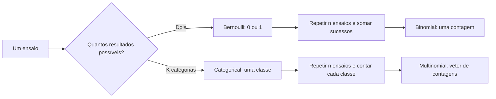
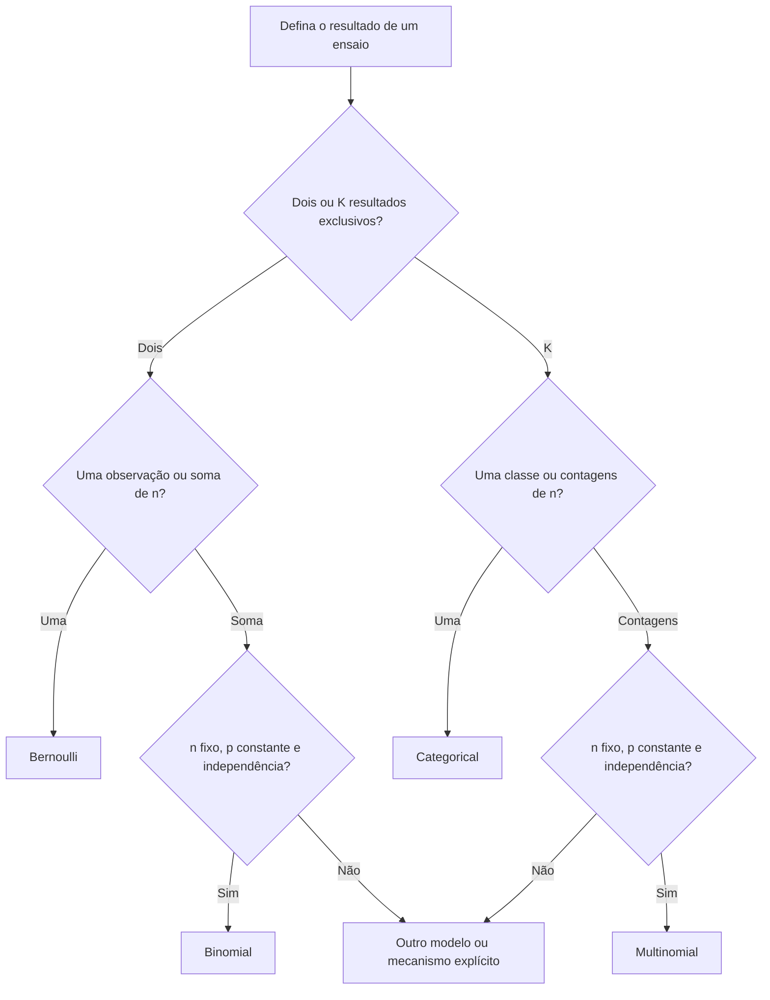

# Aula 07 — Bernoulli, binomial, categorical e multinomial

<!-- mirandastech-aula-v2 -->

> **Trilha:** Estatística para IA  
> **Tempo sugerido:** 110–140 minutos de estudo + 50–70 minutos de laboratório  
> **Pré-requisitos:** [Aula 05 — PMF, PDF e CDF](05-variaveis-aleatorias-pmf-pdf-cdf.md) e [Aula 06 — esperança, variância e covariância](06-esperanca-variancia-covariancia.md)

Um usuário clicará ou não? Quantas conversões ocorrerão em 100 exposições? Qual token será escolhido entre milhares de candidatos? Quantas vezes cada classe aparecerá em um lote? Essas perguntas parecem diferentes, mas formam uma família coerente de modelos discretos.

---

## 1. Problema motivador: do clique ao lote

Considere uma campanha exibida a usuários comparáveis:

1. uma exibição produz **clique** ou **não clique**;
2. em 20 exibições, contamos quantos cliques ocorreram;
3. um sistema classifica uma solicitação como `normal`, `suspeita` ou `crítica`;
4. em um lote de 100 solicitações, contamos quantas caíram em cada classe.

As distribuições adequadas são, respectivamente, Bernoulli, binomial, categorical e multinomial.

## 2. Objetivos de aprendizagem

Ao final, você deverá conseguir:

1. reconhecer o experimento que cada distribuição representa;
2. escrever PMF, suporte, esperança e variância da Bernoulli e da binomial;
3. justificar a fórmula binomial a partir da contagem de sequências;
4. verificar as hipóteses de número fixo de ensaios, dois resultados, probabilidade constante e independência;
5. distinguir variável categorical, vetor *one-hot* e contagem multinomial;
6. calcular probabilidades multinomiais e sua matriz de covariância;
7. usar CDF e função de sobrevivência para probabilidades de cauda;
8. relacionar esses modelos a classificação, softmax, tokens e lotes de dados;
9. simular e validar resultados com Python e seed fixa.

## 3. Vocabulário essencial

| Termo | Significado |
|---|---|
| Ensaio | Uma repetição do mecanismo aleatório. |
| Sucesso | Resultado codificado como 1; o nome não implica algo desejável. |
| Indicadora | Variável que vale 1 quando um evento ocorre e 0 caso contrário. |
| IID | Independentes e identicamente distribuídos. |
| Classe/categoria | Um entre \(K\) rótulos mutuamente exclusivos. |
| *One-hot* | Vetor com um único 1 indicando a categoria observada. |
| Contagem | Número de ocorrências de um resultado em vários ensaios. |
| PMF | Massa atribuída a cada resultado discreto. |
| Cauda | Probabilidade de valores a partir ou até determinado limiar. |

## 4. Bernoulli: um evento, dois resultados

Defina \(X=1\) se um evento ocorrer e \(X=0\) caso contrário. Escrevemos

$$
X\sim\operatorname{Bernoulli}(p),\qquad 0\leq p\leq1.
$$

Sua PMF pode ser condensada em

$$
P(X=x)=p^x(1-p)^{1-x},\qquad x\in\{0,1\}.
$$

Quando \(x=1\), a expressão vale \(p\); quando \(x=0\), vale \(1-p\).

Da Aula 06:

$$
E[X]=0(1-p)+1p=p,
$$

e, como \(X^2=X\) para \(X\in\{0,1\}\),

$$
\operatorname{Var}(X)=E[X^2]-E[X]^2=p-p^2=p(1-p).
$$

A variância é zero em \(p=0\) ou \(p=1\), pois não há incerteza, e é máxima em \(p=0{,}5\).

### Sucesso é uma convenção

Em detecção de fraude, podemos definir 1 como fraude; em controle de qualidade, 1 pode significar defeito. Trocar a codificação altera o parâmetro de \(p\) para \(1-p\), mas não muda o fenômeno. Sempre documente o evento representado por 1.

## 5. De Bernoulli à binomial

Considere \(n\) variáveis Bernoulli independentes com a mesma probabilidade \(p\):

$$
X_1,\ldots,X_n\overset{IID}{\sim}\operatorname{Bernoulli}(p).
$$

O total de sucessos

$$
S=\sum_{i=1}^{n}X_i
$$

segue uma distribuição binomial:

$$
S\sim\operatorname{Binomial}(n,p).
$$

Seu suporte é \(\{0,1,\ldots,n\}\). A Bernoulli é o caso especial binomial com \(n=1\).

## 6. As quatro hipóteses da binomial

Antes de aplicar a fórmula, verifique:

1. **número fixo de ensaios:** \(n\) é conhecido antes da observação;
2. **dois resultados por ensaio:** sucesso ou fracasso;
3. **probabilidade constante:** todo ensaio usa o mesmo \(p\);
4. **independência:** conhecer um resultado não muda a distribuição dos demais.

Se as probabilidades forem diferentes, a soma independente é chamada **Poisson-binomial**, não binomial. Se houver dependência — por exemplo, usuários influenciando uns aos outros — a variância e as caudas podem mudar. O rótulo do modelo depende das hipóteses, não apenas de a variável ser uma contagem.

## 7. PMF binomial: por que aparece a combinação?

Uma sequência específica com \(k\) sucessos e \(n-k\) fracassos tem probabilidade

$$
p^k(1-p)^{n-k}.
$$

Existem \(\binom nk\) posições possíveis para os \(k\) sucessos. Portanto,

$$
P(S=k)=\binom nk p^k(1-p)^{n-k},
\qquad k=0,1,\ldots,n.
$$

### Exemplo resolvido: exatamente dois cliques

Para \(n=10\) exibições independentes e \(p=0{,}2\):

$$
P(S=2)=\binom{10}{2}(0{,}2)^2(0{,}8)^8.
$$

Passo a passo:

$$
\binom{10}{2}=45,
$$

$$
(0{,}2)^2=0{,}04,\qquad (0{,}8)^8=0{,}16777216,
$$

$$
P(S=2)=45\cdot0{,}04\cdot0{,}16777216=0{,}301989888.
$$

Logo, a chance é aproximadamente 30,20% **sob o modelo declarado**.

## 8. Esperança e variância da binomial

Pela linearidade da esperança:

$$
E[S]=\sum_{i=1}^{n}E[X_i]=np.
$$

Como os ensaios são independentes, suas covariâncias são zero:

$$
\operatorname{Var}(S)=\sum_{i=1}^{n}\operatorname{Var}(X_i)=np(1-p).
$$

Assim,

$$
SD(S)=\sqrt{np(1-p)}.
$$

Para \(n=10\) e \(p=0{,}2\), a média é 2, a variância é 1,6 e o desvio-padrão é aproximadamente 1,265. A média igual a 2 não afirma que sempre observaremos dois cliques.

## 9. Consultas de cauda: “ao menos” e “no máximo”

Para o mesmo cenário:

$$
P(S\geq1)=1-P(S=0)=1-(0{,}8)^{10}\approx0{,}892626.
$$

Traduções úteis:

| Linguagem | Evento | Ferramenta |
|---|---:|---|
| exatamente \(k\) | \(S=k\) | PMF |
| no máximo \(k\) | \(S\leq k\) | CDF |
| menos que \(k\) | \(S<k\) | \(F(k-1)\) |
| mais que \(k\) | \(S>k\) | função de sobrevivência em \(k\) |
| ao menos \(k\) | \(S\geq k\) | \(P(S>k-1)\) |

Em bibliotecas numéricas, a função de sobrevivência `sf(k)` pode ser mais precisa que calcular `1 - cdf(k)` quando a cauda é muito pequena.

## 10. Categorical: uma escolha entre K classes

Se um ensaio produz exatamente uma entre \(K\) categorias com probabilidades

$$
\mathbf p=(p_1,\ldots,p_K),\qquad p_k\geq0,\quad\sum_{k=1}^{K}p_k=1,
$$

então

$$
Y\sim\operatorname{Categorical}(\mathbf p),
$$

com

$$
P(Y=k)=p_k.
$$

Exemplo: para `normal`, `suspeita` e `crítica`, suponha

$$
\mathbf p=(0{,}70,0{,}20,0{,}10).
$$

A chance de uma solicitação ser classificada como `crítica` é 0,10. O código numérico dos rótulos é apenas uma convenção: calcular a média de códigos 0, 1 e 2 geralmente não tem interpretação semântica.

## 11. Representação one-hot

A categoria observada pode ser representada pelo vetor

$$
\mathbf Z=(Z_1,\ldots,Z_K)^T,
$$

em que exatamente uma posição vale 1. Se a classe observada for `suspeita`, por exemplo, \(\mathbf Z=(0,1,0)^T\).

Cada componente marginal é Bernoulli:

$$
E[Z_k]=p_k,\qquad \operatorname{Var}(Z_k)=p_k(1-p_k).
$$

Como apenas uma classe pode ocorrer, para \(j\neq k\):

$$
\operatorname{Cov}(Z_j,Z_k)=-p_jp_k.
$$

Em forma matricial:

$$
\operatorname{Cov}(\mathbf Z)=\operatorname{diag}(\mathbf p)-\mathbf p\mathbf p^T.
$$

As covariâncias são negativas porque marcar uma categoria impede marcar outra no mesmo ensaio.

## 12. Multinomial: contagens de várias categorias

Repita \(n\) ensaios categorical independentes, todos com o mesmo vetor \(\mathbf p\). Seja \(N_k\) a contagem da categoria \(k\). Então

$$
\mathbf N=(N_1,\ldots,N_K)^T\sim\operatorname{Multinomial}(n,\mathbf p),
$$

com restrição

$$
N_k\in\{0,1,\ldots,n\},\qquad \sum_{k=1}^{K}N_k=n.
$$

A PMF é

$$
P(\mathbf N=\mathbf n)
=\frac{n!}{n_1!\cdots n_K!}\prod_{k=1}^{K}p_k^{n_k}.
$$

O coeficiente conta quantas sequências diferentes geram o mesmo vetor de contagens.

### Exemplo resolvido

Em 10 classificações independentes, use \(\mathbf p=(0{,}5,0{,}3,0{,}2)\). A probabilidade de obter contagens \((5,3,2)\) é

$$
\frac{10!}{5!3!2!}(0{,}5)^5(0{,}3)^3(0{,}2)^2.
$$

Como \(10!/(5!3!2!)=2520\):

$$
P(5,3,2)=2520(0{,}5)^5(0{,}3)^3(0{,}2)^2=0{,}08505.
$$

## 13. Momentos da multinomial

Para cada categoria:

$$
E[N_k]=np_k,
$$

$$
\operatorname{Var}(N_k)=np_k(1-p_k).
$$

Para categorias distintas:

$$
\operatorname{Cov}(N_j,N_k)=-np_jp_k.
$$

Portanto,

$$
\operatorname{Cov}(\mathbf N)
=n\left[\operatorname{diag}(\mathbf p)-\mathbf p\mathbf p^T\right].
$$

Cada componente isolado \(N_k\) tem distribuição binomial \(\operatorname{Binomial}(n,p_k)\), mas as contagens não são independentes: se o total é fixo, aumentar uma exige reduzir alguma outra. A matriz é singular porque suas linhas somam zero, refletindo a restrição \(\sum_kN_k=n\).

## 14. Comparação direta

| Distribuição | Uma observação representa | Parâmetros | Suporte | Média |
|---|---|---|---|---|
| Bernoulli | um resultado binário | \(p\) | \(\{0,1\}\) | \(p\) |
| Binomial | total de sucessos em \(n\) Bernoullis IID | \(n,p\) | \(\{0,\ldots,n\}\) | \(np\) |
| Categorical | uma entre \(K\) categorias | \(\mathbf p\) | \(\{1,\ldots,K\}\) | depende da codificação; use probabilidades |
| Multinomial | contagem por categoria em \(n\) categoricals IID | \(n,\mathbf p\) | vetores não negativos somando \(n\) | \(n\mathbf p\) |

> A terminologia varia: alguns livros usam *multinoulli* para uma única escolha entre \(K\) categorias. Aqui usamos **categorical** para evitar confusão com a multinomial de contagens.

## 15. Multiclasse não é multirrótulo

- **Multiclasse:** exatamente uma classe por observação; uma categorical é natural.
- **Multirrótulo:** várias etiquetas podem estar presentes simultaneamente; costuma-se modelar um vetor de indicadores Bernoulli, mas independência entre etiquetas é uma hipótese adicional, não automática.

Usar softmax para uma tarefa multirrótulo força competição entre rótulos que poderiam coexistir. A escolha da distribuição deve refletir a estrutura do alvo.

## 16. Conexões com IA e machine learning

### Classificação binária

Um modelo pode fornecer \(p(\mathbf x)=P(Y=1\mid\mathbf x)\). Condicionada aos atributos \(\mathbf x\), a saída define uma Bernoulli. O limiar usado para decidir a classe é uma regra posterior; não faz parte da distribuição.

### Softmax e classificação multiclasse

Logits \(z_1,\ldots,z_K\) podem ser convertidos em probabilidades:

$$
p_k=\frac{e^{z_k}}{\sum_j e^{z_j}}.
$$

Para estabilidade numérica, subtrai-se o maior logit antes de exponenciar. O vetor resultante parametriza uma categorical sobre as classes.

### Modelos de linguagem

A cada passo, um modelo de linguagem produz uma distribuição categorical sobre o vocabulário. Escolher o maior valor é decodificação gulosa; amostrar usa toda a PMF. Temperatura e outros métodos de decodificação modificam essa distribuição, tema de módulos posteriores.

### Lotes e matrizes de confusão

Contagens por classe em um lote podem ser descritas por uma multinomial quando as hipóteses forem plausíveis. Em produção, deriva temporal, agrupamento por usuário e dependência entre eventos frequentemente violam o modelo simples.

### Likelihood e cross-entropy

Para observações independentes, a likelihood multiplica massas; computacionalmente, somamos log-massas para evitar *underflow*. A perda de entropia cruzada usada em classificação nasce dessa estrutura, mas será derivada com cuidado na Aula 22.

## 17. Quando o modelo simples falha

Sinais de inadequação:

- \(p\) muda por usuário, tempo ou contexto;
- ensaios formam grupos ou sequências dependentes;
- o número total de oportunidades não é fixado;
- mais de uma classe pode ocorrer no mesmo ensaio;
- há sobredispersão: a variação observada excede sistematicamente a prevista;
- o processo muda entre treino e produção.

Na Aula 08, estudaremos Poisson para contagens em intervalos e exponencial para tempos entre eventos. Elas respondem a outro desenho de experimento.

## 18. Armadilhas e erros comuns

- **Chamar toda contagem de binomial:** verifique as quatro hipóteses.
- **Confundir \(p\) com contagem esperada:** na binomial, \(E[S]=np\).
- **Esquecer o coeficiente \(\binom nk\):** uma contagem reúne várias sequências.
- **Usar \(1-F(k)\) para “ao menos \(k\)”:** isso calcula \(P(S>k)\); use \(P(S\geq k)=1-F(k-1)\).
- **Tratar categorias como números ordinais:** códigos de classe podem não ter distância ou média interpretável.
- **Confundir categorical com multinomial:** a primeira produz uma classe; a segunda, um vetor de contagens.
- **Confundir multiclasse com multirrótulo:** exclusividade muda o modelo.
- **Assumir independência das contagens multinomiais:** o total fixo induz covariâncias negativas.
- **Aceitar probabilidades que não somam 1:** valide antes de calcular ou amostrar.
- **Multiplicar muitas probabilidades diretamente:** prefira log-PMF ou soma de log-probabilidades.
- **Confiar em simulação sem valor teórico:** use-a como verificação, não substituição da derivação.
- **Estimar e avaliar nos mesmos dados sem cuidado:** incerteza da estimativa será tratada nas aulas de inferência.

## 19. Laboratório reproduzível

O notebook [`07-bernoulli-binomial-categorical-laboratorio.ipynb`](../notebooks/07-bernoulli-binomial-categorical-laboratorio.ipynb) contém:

- PMF, média e variância de Bernoulli;
- PMF binomial completa, consultas exatas e probabilidades de cauda;
- simulação de campanhas e verificação por tolerâncias declaradas;
- impacto de alterar \(n\) e \(p\) na forma da PMF;
- amostragem categorical e codificação *one-hot*;
- covariância teórica e empírica da representação *one-hot*;
- PMF, esperança e covariância multinomiais;
- amostragem de lotes e comparação de contagens;
- softmax numericamente estável para parametrizar uma categorical;
- testes automáticos de suporte, normalização e momentos.

Dependências: Python 3.10+, NumPy 1.24+, SciPy 1.10+ e Matplotlib 3.7+. A seed usada é `20260907`.

## 20. Checklist de domínio

- [ ] Defino explicitamente o que 0 e 1 significam em uma Bernoulli.
- [ ] Sei que Bernoulli é binomial com \(n=1\).
- [ ] Verifico \(n\) fixo, binariedade, \(p\) constante e independência.
- [ ] Calculo PMF, esperança e variância binomiais.
- [ ] Traduzo “ao menos”, “mais que” e “no máximo” corretamente.
- [ ] Distingo rótulo categorical de sua codificação *one-hot*.
- [ ] Calculo uma probabilidade multinomial e verifico se as contagens somam \(n\).
- [ ] Explico por que contagens multinomiais têm covariância negativa.
- [ ] Distingo problemas multiclasse e multirrótulo.
- [ ] Uso seed, tolerâncias e log-probabilidades quando apropriado.

## 21. Exercícios

### 1. Bernoulli

Uma requisição falha com probabilidade 0,03. Defina uma variável Bernoulli para falha e calcule esperança e variância.

### 2. Exatamente dois

Em 10 exposições independentes com CTR 0,2, calcule \(P(S=2)\).

### 3. Ao menos um

No mesmo cenário, calcule a probabilidade de ao menos um clique.

### 4. Diagnóstico do modelo

Dez usuários têm probabilidades de clique diferentes devido a segmentos conhecidos. A contagem total é binomial? Justifique.

### 5. Categorical e one-hot

Para \(\mathbf p=(0{,}7,0{,}2,0{,}1)\), encontre \(E[\mathbf Z]\) e \(\operatorname{Cov}(Z_1,Z_3)\).

### 6. Multinomial

Para \(n=10\), \(\mathbf p=(0{,}5,0{,}3,0{,}2)\), calcule a probabilidade das contagens \((5,3,2)\), a esperança da segunda contagem e \(\operatorname{Cov}(N_1,N_2)\).

### 7. Modelagem de alvo

Uma imagem pode conter simultaneamente `pessoa`, `carro` e `bicicleta`. Categorical é adequada? Qual representação inicial faz mais sentido?

## 22. Respostas comentadas

### 1.

Defina \(X=1\) para falha e 0 caso contrário. Então \(X\sim\operatorname{Bernoulli}(0{,}03)\), \(E[X]=0{,}03\) e \(\operatorname{Var}(X)=0{,}03(0{,}97)=0{,}0291\).

### 2.

$$
P(S=2)=\binom{10}{2}(0{,}2)^2(0{,}8)^8=0{,}301989888.
$$

### 3.

Use o complemento de zero cliques:

$$
P(S\geq1)=1-(0{,}8)^{10}=0{,}8926258176.
$$

### 4.

Não é binomial porque \(p\) não é constante. Se os ensaios ainda forem independentes, a soma segue uma distribuição Poisson-binomial. Substituir tudo pela média dos \(p_i\) pode distorcer a variância e as caudas.

### 5.

\(E[\mathbf Z]=\mathbf p=(0{,}7,0{,}2,0{,}1)^T\). Para categorias distintas, \(\operatorname{Cov}(Z_1,Z_3)=-p_1p_3=-0{,}07\).

### 6.

A probabilidade é 0,08505. Além disso, \(E[N_2]=10(0{,}3)=3\) e

$$
\operatorname{Cov}(N_1,N_2)=-10(0{,}5)(0{,}3)=-1{,}5.
$$

### 7.

Não, porque as classes não são mutuamente exclusivas. Um vetor de indicadores Bernoulli, um por rótulo, é um ponto de partida mais coerente. Tratar esses indicadores como independentes é uma hipótese adicional que deve ser avaliada.

## 23. Resumo

- Bernoulli modela um ensaio binário e tem média \(p\) e variância \(p(1-p)\).
- Binomial soma \(n\) Bernoullis IID e exige condições explícitas.
- O coeficiente combinatório conta sequências que produzem a mesma quantidade de sucessos.
- Categorical representa exatamente uma entre \(K\) classes.
- A codificação *one-hot* tem média \(\mathbf p\) e covariância \(\operatorname{diag}(\mathbf p)-\mathbf p\mathbf p^T\).
- Multinomial conta categorias em \(n\) ensaios categorical IID; suas contagens são dependentes.
- Esses modelos sustentam classificação binária, softmax, geração de tokens e análise de lotes.
- A distribuição deve refletir o mecanismo; uma contagem não é automaticamente binomial ou multinomial.

## 24. Referências

### Fontes técnicas

- BLITZSTEIN, Joseph K.; HWANG, Jessica. *Introduction to Probability*. Harvard Stat 110: <https://stat110.hsites.harvard.edu/>.
- MURPHY, Kevin P. *Probabilistic Machine Learning: An Introduction*. MIT Press, 2022: <https://probml.github.io/pml-book/book1.html>.
- GOODFELLOW, Ian; BENGIO, Yoshua; COURVILLE, Aaron. *Deep Learning*, capítulo 3: <https://www.deeplearningbook.org/contents/prob.html>.

### Documentação do laboratório

- SciPy. `scipy.stats.bernoulli`: <https://docs.scipy.org/doc/scipy/reference/generated/scipy.stats.bernoulli.html>.
- SciPy. `scipy.stats.binom`: <https://docs.scipy.org/doc/scipy/reference/generated/scipy.stats.binom.html>.
- SciPy. `scipy.stats.multinomial`: <https://docs.scipy.org/doc/scipy/reference/generated/scipy.stats.multinomial.html>.
- NumPy. `Generator.multinomial`: <https://numpy.org/doc/stable/reference/random/generated/numpy.random.Generator.multinomial.html>.

---

## Próxima aula

Na [Aula 08 — Poisson e exponencial](08-poisson-exponencial.md), mudaremos a pergunta: em vez de fixar o número de oportunidades, modelaremos quantos eventos ocorrem em um intervalo e quanto tempo esperamos entre eventos.
