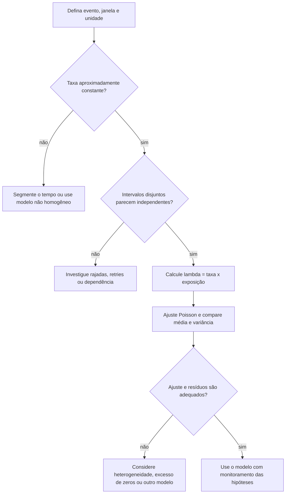
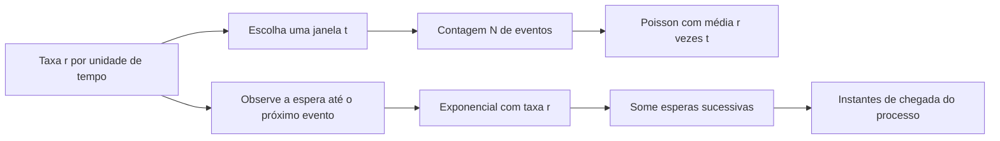

# Aula 08 — Poisson e exponencial: contagens e tempo entre eventos

<!-- mirandastech-aula-v2 -->

> **Trilha:** Estatística para IA  
> **Tempo sugerido:** 100–130 minutos de estudo + 50–70 minutos de laboratório  
> **Pré-requisitos:** [Aula 06 — esperança, variância e covariância](06-esperanca-variancia-covariancia.md) e [Aula 07 — Bernoulli, binomial, categorical e multinomial](07-bernoulli-binomial-categorical.md)

[](https://colab.research.google.com/github/joaopaulomirandamatias/ai-lab/blob/main/02-statistics/notebooks/08-poisson-exponencial-laboratorio.ipynb)

Quantas requisições chegarão ao endpoint de um modelo nos próximos dois minutos? Quanto tempo falta para a próxima requisição? As perguntas são diferentes, mas, sob hipóteses específicas, descrevem o mesmo processo. A distribuição de **Poisson** modela a contagem em uma janela; a **exponencial** modela o tempo até o próximo evento.

Essa dupla é um ponto de partida útil para telemetria, filas e eventos raros. Também é fácil usá-la mal. Tráfego muda ao longo do dia, falhas podem ocorrer em rajadas e tentativas automáticas criam dependência. Nesta aula, cada fórmula virá acompanhada das condições que tornam seu uso defensável.

---

## 1. Problema motivador: capacidade e alerta

Um serviço de inferência recebe, em média, 3 requisições por minuto durante um período estável. A equipe quer responder:

1. qual a probabilidade de chegarem exatamente 4 requisições em 2 minutos?
2. qual a probabilidade de surgir ao menos uma requisição nessa janela?
3. qual a probabilidade de esperar mais de 30 segundos pela próxima?

Se as chegadas puderem ser aproximadas por um processo homogêneo com taxa constante e incrementos independentes, usaremos:

- uma contagem \(N(2)\sim\operatorname{Poisson}(3\times2)\);
- uma espera \(T\sim\operatorname{Exponencial}(3)\), com tempo medido em minutos.

Antes de calcular, note a conversão de unidades: **30 segundos = 0,5 minuto**. Uma grande parte dos erros práticos acontece antes da fórmula, quando taxa e duração estão em unidades incompatíveis.

---

## 2. Objetivos de aprendizagem

Ao concluir a aula, você será capaz de:

- diferenciar taxa por unidade de tempo de média esperada em uma janela;
- calcular e interpretar probabilidades de Poisson;
- explicar a aproximação da binomial por Poisson para eventos raros;
- usar a exponencial para tempos de espera, com parametrização correta;
- demonstrar a ausência de memória e reconhecer quando ela é inadequada;
- ligar contagens de Poisson e intervalos exponenciais em um processo de Poisson;
- diagnosticar sobredispersão e questionar hipóteses de independência e taxa constante;
- simular os modelos de forma reproduzível com NumPy e SciPy.

### Pré-requisitos rápidos

Você deve reconhecer PMF, PDF e CDF, vistas na Aula 05, e esperança e variância, vistas na Aula 06. Da Aula 07, reutilizaremos a binomial: a Poisson aparecerá como um limite de muitas oportunidades com pequena probabilidade individual.

---

## 3. Vocabulário essencial

| Termo | Significado operacional |
|---|---|
| **evento** | ocorrência observada, como uma chegada ou falha |
| **taxa \(r\)** | intensidade média por unidade de exposição, por exemplo, 3 chegadas/minuto |
| **exposição \(t\)** | tamanho da janela observada, por exemplo, 2 minutos |
| **média da janela \(\lambda=rt\)** | número esperado de eventos naquela janela |
| **contagem \(N(t)\)** | quantidade de eventos acumulados até o tempo \(t\) |
| **tempo entre chegadas** | duração entre dois eventos consecutivos |
| **sobrevivência \(S(t)\)** | probabilidade de a espera ultrapassar \(t\) |
| **hazard ou taxa de risco** | taxa instantânea de ocorrência condicionada à sobrevivência até aquele instante |
| **sobredispersão** | variância das contagens maior que a média |
| **incrementos independentes** | contagens em intervalos sem sobreposição são independentes |

Usaremos \(r\) para a taxa por unidade de tempo e \(\lambda=rt\) para a média da janela. Alguns livros chamam ambos de \(\lambda\); a notação funciona, desde que a unidade e a janela sejam declaradas.

---

## 4. Distribuição de Poisson

Uma variável aleatória \(N\) com distribuição de Poisson e parâmetro \(\lambda>0\) assume valores inteiros não negativos:

\[
N\sim\operatorname{Poisson}(\lambda),\qquad N\in\{0,1,2,\ldots\}.
\]

Sua função massa de probabilidade é

\[
P(N=k)=\frac{e^{-\lambda}\lambda^k}{k!},\qquad k=0,1,2,\ldots
\]

O parâmetro resume duas propriedades:

\[
\mathbb E[N]=\lambda
\qquad\text{e}\qquad
\operatorname{Var}(N)=\lambda.
\]

Portanto, em um modelo Poisson ideal, média e variância coincidem. Isso não significa que toda amostra terá média exatamente igual à variância; significa que a igualdade vale para a distribuição populacional. Em uma amostra finita, esperamos proximidade, não identidade.

### Taxa não é a mesma coisa que média da janela

Se a taxa for \(r=3\) eventos/minuto e a janela tiver \(t=2\) minutos,

\[
\lambda=rt=(3\ \text{eventos/minuto})(2\ \text{minutos})=6\ \text{eventos}.
\]

A unidade de tempo se cancela. A taxa possui unidade \(1/\text{tempo}\); \(\lambda\) é uma contagem esperada e entra na PMF.

---

## 5. Exemplo resolvido: requisições em dois minutos

Considere \(N\sim\operatorname{Poisson}(6)\).

### 5.1 Exatamente quatro requisições

\[
\begin{aligned}
P(N=4)
&=\frac{e^{-6}6^4}{4!}\\
&=\frac{e^{-6}\cdot1296}{24}\\
&\approx 0{,}133853.
\end{aligned}
\]

A chance é de aproximadamente **13,39%**.

### 5.2 Ao menos uma requisição

É mais curto usar o complemento:

\[
P(N\ge 1)=1-P(N=0)=1-e^{-6}\approx0{,}997521.
\]

Logo, a chance de observar ao menos uma chegada em dois minutos é de aproximadamente **99,75%**.

Para caudas, bibliotecas estatísticas oferecem a função de sobrevivência `sf`. Em vez de `1 - cdf`, prefira `poisson.sf(0, 6)` para \(P(N>0)\); ela pode ser numericamente mais precisa quando a probabilidade é muito pequena.

---

## 6. Quando um processo de Poisson é plausível?

Para um **processo de Poisson homogêneo** com taxa \(r\), assumimos, em essência:

1. **taxa constante:** a intensidade não muda durante o período analisado;
2. **incrementos independentes:** saber a contagem de um intervalo não altera a distribuição de outro intervalo disjunto;
3. **eventos pontuais:** em uma janela suficientemente curta, a chance de mais de um evento é desprezível em comparação com a de um evento;
4. **contagem proporcional à exposição:** em duração \(t\), o valor esperado é \(rt\).

Essas hipóteses geram a propriedade

\[
N(t)\sim\operatorname{Poisson}(rt).
\]



O fluxograma não “prova” que os dados são Poisson. Ele organiza perguntas de modelagem e verificações empíricas.

---

## 7. Da binomial à Poisson: o limite de eventos raros

Na aula anterior, \(X\sim\operatorname{Binomial}(n,p)\) contou sucessos em \(n\) tentativas independentes. Se \(n\) cresce, \(p\) diminui e o produto \(np\) permanece igual a \(\lambda\), então

\[
\operatorname{Binomial}(n,p)\xrightarrow[n\to\infty]{d}
\operatorname{Poisson}(\lambda).
\]

A intuição é dividir uma janela em muitos pedaços pequenos. Cada pedaço oferece uma oportunidade de evento com probabilidade baixa. A soma desses indicadores Bernoulli se aproxima de uma Poisson.

### Exemplo: 100 oportunidades, 3% de ocorrência

Para \(X\sim\operatorname{Binomial}(100,0{,}03)\), temos \(np=3\). Uma aproximação é \(Y\sim\operatorname{Poisson}(3)\). Para exatamente dois eventos:

\[
P(X=2)\approx P(Y=2)=e^{-3}\frac{3^2}{2!}\approx0{,}2240.
\]

A aproximação melhora quando as probabilidades individuais são pequenas e não há uma única oportunidade dominante. Regras como “\(n\) grande e \(p\) pequeno” são heurísticas; compare as distribuições ou calcule o erro quando a decisão for sensível.

---

## 8. Composição e filtragem de eventos

Duas propriedades ajudam a raciocinar sobre telemetria, sempre sob independência:

- se \(N_1\sim\operatorname{Poisson}(\lambda_1)\) e \(N_2\sim\operatorname{Poisson}(\lambda_2)\) são independentes, então \(N_1+N_2\sim\operatorname{Poisson}(\lambda_1+\lambda_2)\);
- se cada evento de \(N\sim\operatorname{Poisson}(\lambda)\) é mantido independentemente com probabilidade \(p\), a contagem mantida é \(\operatorname{Poisson}(p\lambda)\).

Assim, fluxos independentes de dois endpoints podem ter suas taxas somadas. E uma amostra aleatória de 10% de um fluxo Poisson tem 10% da taxa. Se o amostrador prioriza erros ou as fontes compartilham uma causa, a justificativa muda.

---

## 9. Distribuição exponencial

Agora mudamos a pergunta: em vez de “quantos?”, perguntamos “quanto tempo?”. Uma variável contínua \(T\) com taxa \(r>0\) segue distribuição exponencial quando

\[
T\sim\operatorname{Exponencial}(r).
\]

Sua densidade, para \(t\ge0\), é

\[
f_T(t)=re^{-rt}.
\]

A CDF e a função de sobrevivência são

\[
F_T(t)=P(T\le t)=1-e^{-rt},
\qquad
S_T(t)=P(T>t)=e^{-rt}.
\]

Além disso,

\[
\mathbb E[T]=\frac1r,
\qquad
\operatorname{Var}(T)=\frac1{r^2},
\qquad
\operatorname{mediana}(T)=\frac{\ln2}{r}.
\]

Se \(r\) está em eventos/minuto, \(T\) está em minutos. Na SciPy, `scipy.stats.expon` usa **escala**, não taxa: configure `scale=1/r`.

> Para variável contínua, \(f_T(t)\) é uma densidade, não a probabilidade no ponto. De fato, \(P(T=t)=0\). Probabilidades vêm de áreas ou diferenças da CDF.

---

## 10. Exemplo resolvido: espera pela próxima requisição

Com taxa \(r=3\) por minuto:

### 10.1 Esperar mais de 30 segundos

Converta \(30\) segundos para \(0{,}5\) minuto:

\[
P(T>0{,}5)=e^{-3\cdot0{,}5}=e^{-1{,}5}\approx0{,}223130.
\]

A chance é de aproximadamente **22,31%**.

### 10.2 Receber uma requisição em até 20 segundos

Vinte segundos equivalem a \(1/3\) de minuto:

\[
P(T\le1/3)=1-e^{-3(1/3)}=1-e^{-1}\approx0{,}632121.
\]

Mesmo que a espera média seja \(1/3\) de minuto, a probabilidade de esperar no máximo a média é cerca de 63,21%, não 50%. A exponencial é assimétrica à direita; média e mediana não coincidem.

---

## 11. Ausência de memória

A exponencial satisfaz

\[
P(T>s+t\mid T>s)=P(T>t).
\]

Usando a definição de probabilidade condicional e a sobrevivência exponencial:

\[
\frac{P(T>s+t)}{P(T>s)}
=\frac{e^{-r(s+t)}}{e^{-rs}}
=e^{-rt}
=P(T>t).
\]

Se já esperamos \(s\), a distribuição da espera adicional é igual à distribuição inicial. Isso equivale a uma taxa de risco constante:

\[
h(t)=\frac{f(t)}{S(t)}=r.
\]

Ausência de memória é uma propriedade matemática, não uma regra universal sobre tempos reais. Componentes que envelhecem, tarefas com progresso acumulado, usuários impacientes ou incidentes com escalonamento geralmente não têm risco constante.

---

## 12. A ponte: um único processo, duas perspectivas

No processo de Poisson homogêneo de taxa \(r\):

- a contagem em uma janela \(t\) é \(N(t)\sim\operatorname{Poisson}(rt)\);
- os tempos entre eventos consecutivos são independentes e seguem \(T_i\sim\operatorname{Exponencial}(r)\);
- o instante do \(k\)-ésimo evento é a soma \(S_k=T_1+\cdots+T_k\).



Uma forma de simular uma trajetória é gerar esperas exponenciais e acumulá-las até ultrapassar o horizonte. Outra é gerar diretamente a contagem Poisson de cada janela. As duas abordagens respondem a perguntas diferentes sobre o mesmo modelo.

---

## 13. Comparação dos modelos

| Modelo | Pergunta | Suporte | Parâmetro principal | Média | Variância |
|---|---|---|---|---:|---:|
| Bernoulli | ocorreu nesta tentativa? | \(0,1\) | \(p\) | \(p\) | \(p(1-p)\) |
| Binomial | quantos sucessos em \(n\) tentativas? | \(0,\ldots,n\) | \(n,p\) | \(np\) | \(np(1-p)\) |
| Poisson | quantos eventos na exposição? | \(0,1,2,\ldots\) | \(\lambda=rt\) | \(\lambda\) | \(\lambda\) |
| Exponencial | quanto tempo até o próximo evento? | \([0,\infty)\) | taxa \(r\) | \(1/r\) | \(1/r^2\) |

Poisson é discreta e usa PMF. Exponencial é contínua e usa PDF. A igualdade média = variância pertence à contagem Poisson; não deve ser transferida para a espera exponencial.

---

## 14. Diagnóstico de dispersão

Divida a observação em janelas comparáveis e calcule média e variância das contagens.

- **variância próxima da média:** compatível com Poisson, mas não é prova;
- **variância muito maior que a média:** sobredispersão; pode indicar mistura de taxas, sazonalidade, rajadas ou dependência;
- **variância menor que a média:** subdispersão; pode surgir por limites, regularidade ou mecanismos de espaçamento.

Imagine que metade das janelas tenha taxa 1 e metade taxa 5. A média das taxas é 3, mas a alternância entre regimes adiciona variabilidade. Misturar contextos heterogêneos e ajustar uma única Poisson tende a subestimar caudas e produzir alertas mal calibrados.

O índice empírico \(s^2/\bar x\) é uma triagem simples, não um teste completo. Inspecione série temporal, autocorrelação, sazonalidade, zeros e resíduos. Modelos como binomial negativa, Poisson não homogêneo e processos com autoexcitação aparecem em etapas mais avançadas.

---

## 15. Conexões com IA e ML

### Observabilidade de sistemas de IA

Contagens de erros, timeouts, requisições e violações de política podem ser modeladas por exposição. A exposição precisa acompanhar a pergunta: eventos por minuto, por milhão de tokens ou por mil requisições não são intercambiáveis.

### Detecção de anomalias

Sob um baseline Poisson, uma cauda como \(P(N\ge k)\) ajuda a medir quão incomum é uma contagem. Isso só é útil se o baseline refletir hora do dia, versão do modelo e volume. Um valor de cauda pequeno não identifica a causa e não substitui análise operacional.

### Verossimilhança para dados de contagem

Modelos de regressão de Poisson usam uma média positiva que depende dos atributos e frequentemente incluem um termo de exposição. Aqui basta guardar a ideia: a distribuição pode servir como modelo probabilístico da saída, não apenas como calculadora isolada.

### Processos pontuais

O processo de Poisson homogêneo é um baseline para sequências de eventos. Tráfego com sazonalidade pede taxa variável; conversas, cascatas e incidentes podem criar autoexcitação. Começar pelo modelo simples torna explícito o que precisa ser enriquecido.

---

## 16. Armadilhas e erros comuns

1. **Usar a taxa como \(\lambda\) sem ajustar a janela.** Para 3/min em 20 segundos, \(\lambda=3\times(1/3)=1\).
2. **Misturar segundos e minutos.** Converta tudo antes de multiplicar ou exponenciar.
3. **Passar a taxa como `scale` na SciPy.** Para taxa \(r\), use `scale=1/r`.
4. **Interpretar PDF como probabilidade pontual.** Em contínuas, probabilidade é área.
5. **Calcular cauda como `1 - cdf` em casos extremos.** Prefira `sf` ou `logsf`.
6. **Confundir ausência de memória com independência irrestrita.** A propriedade vale para esperas exponenciais sob o modelo.
7. **Ignorar rajadas e retries.** Um evento pode causar outros, violando incrementos independentes.
8. **Juntar regimes diferentes.** Manhã e madrugada podem ter taxas distintas e gerar sobredispersão.
9. **Tratar média ≈ variância como confirmação.** É apenas uma verificação parcial.
10. **Desconsiderar censura.** Uma observação encerrada antes do próximo evento não equivale a uma espera completa.

---

## 17. Laboratório reproduzível

O [notebook da Aula 08](../notebooks/08-poisson-exponencial-laboratorio.ipynb) usa Python com seed fixa para:

- verificar as probabilidades do exemplo motivador;
- simular contagens e comparar média, variância e PMF;
- quantificar a aproximação binomial–Poisson;
- simular esperas e verificar a ausência de memória;
- construir uma trajetória por intervalos exponenciais;
- demonstrar sobredispersão causada por mistura de taxas.

Dependências explícitas:

```text
Python >= 3.10
numpy >= 1.26
scipy >= 1.11
matplotlib >= 3.8
```

Fallback mínimo, caso você não use Colab:

```python
import numpy as np
from scipy.stats import poisson, expon

r = 3.0          # eventos por minuto
t = 2.0          # minutos
lam = r * t

print(poisson.pmf(4, mu=lam))
print(poisson.sf(0, mu=lam))
print(expon.sf(0.5, scale=1 / r))

rng = np.random.default_rng(20260907)
amostra = rng.poisson(lam=lam, size=200_000)
print(amostra.mean(), amostra.var())
```

---

## 18. Checklist prático

Antes de usar Poisson ou exponencial, confirme:

- [ ] o evento está definido sem ambiguidade;
- [ ] taxa e exposição usam unidades compatíveis;
- [ ] a janela e o contexto operacional estão documentados;
- [ ] a taxa é aproximadamente constante no estrato analisado;
- [ ] rajadas, retries e autocorrelação foram investigados;
- [ ] média e variância das contagens foram comparadas;
- [ ] zeros e caudas foram inspecionados;
- [ ] a parametrização taxa versus escala foi verificada;
- [ ] caudas foram calculadas com `sf` quando apropriado;
- [ ] limitações do modelo acompanham a decisão tomada.

---

## 19. Exercícios

### 1. Conversão de taxa

Um endpoint recebe 12 requisições por hora. Qual é \(\lambda\) para uma janela de 15 minutos?

### 2. Zero eventos

Com \(\lambda=3\), calcule \(P(N=0)\) e \(P(N\ge1)\).

### 3. Contagem exata

Para \(N\sim\operatorname{Poisson}(2)\), calcule \(P(N=2)\).

### 4. Tempo médio e sobrevivência

Falhas ocorrem a uma taxa idealizada de 0,25 por hora. Qual é a espera média? Qual é \(P(T>4\text{ h})\)?

### 5. Ausência de memória

No modelo do exercício 4, sabendo que já se passaram 3 horas sem falha, qual é a probabilidade de esperar mais 4 horas?

### 6. Diagnóstico

As contagens por minuto têm média 4,1 e variância 19,7. A igualdade característica da Poisson parece plausível? Cite duas explicações possíveis.

### 7. Código e parametrização

Para taxa de 5 eventos/minuto, qual chamada da SciPy representa a probabilidade de esperar mais de 12 segundos: `expon.sf(0.2, scale=5)` ou `expon.sf(0.2, scale=1/5)`?

---

## 20. Respostas comentadas

### 1.

Quinze minutos são \(0{,}25\) hora. Logo, \(\lambda=12\times0{,}25=3\).

### 2.

\(P(N=0)=e^{-3}\approx0{,}049787\). Pelo complemento, \(P(N\ge1)=1-e^{-3}\approx0{,}950213\).

### 3.

\[
P(N=2)=e^{-2}\frac{2^2}{2!}=2e^{-2}\approx0{,}270671.
\]

### 4.

A espera média é \(1/r=1/0{,}25=4\) horas. A sobrevivência é \(P(T>4)=e^{-0{,}25\cdot4}=e^{-1}\approx0{,}367879\).

### 5.

Pela ausência de memória, a probabilidade de esperar mais 4 horas, condicionada às 3 já transcorridas, continua sendo \(e^{-1}\approx0{,}367879\). Isso depende da validade do modelo exponencial.

### 6.

A variância é quase cinco vezes a média, um sinal de sobredispersão. Duas explicações possíveis são mistura de períodos com taxas diferentes e dependência causada por eventos em rajadas. Excesso de zeros e retries também merecem investigação.

### 7.

Doze segundos são \(0{,}2\) minuto. Como a SciPy recebe escala, a chamada correta é `expon.sf(0.2, scale=1/5)`. Ela retorna \(e^{-1}\approx0{,}367879\).

---

## 21. Resumo

- Poisson modela contagens inteiras em uma exposição: \(N(t)\sim\operatorname{Poisson}(rt)\).
- Sua PMF é \(e^{-\lambda}\lambda^k/k!\), com média e variância iguais a \(\lambda\).
- A Poisson surge como limite da binomial para muitas oportunidades raras.
- Exponencial modela espera: \(S(t)=e^{-rt}\), média \(1/r\) e variância \(1/r^2\).
- A ausência de memória decorre da sobrevivência exponencial e equivale a hazard constante.
- Em um processo de Poisson homogêneo, contagens são Poisson e intervalos são exponenciais.
- Taxa constante, independência e unidade correta são partes do modelo, não detalhes administrativos.
- Sobredispersão costuma revelar heterogeneidade ou dependência que a Poisson simples não captura.

---

## 22. Próxima aula

Na [Aula 09 — distribuição normal, z-score e normal multivariada](09-normal-zscore-multivariada.md), passaremos de contagens e esperas assimétricas para uma família contínua simétrica. Veremos como padronizar valores, interpretar \(\mu\) e \(\sigma\) e representar dependência por uma matriz de covariância — sem assumir normalidade automaticamente.

---

## 23. Referências

### Fontes técnicas

- BLITZSTEIN, Joseph K.; HWANG, Jessica. *Introduction to Probability*. 2. ed. Chapman & Hall/CRC, 2019. Materiais abertos do curso Stat 110: <https://stat110.hsites.harvard.edu/>.
- NIST/SEMATECH. *e-Handbook of Statistical Methods — Poisson Distribution*. <https://www.itl.nist.gov/div898/handbook/eda/section3/eda366j.htm>.
- NIST/SEMATECH. *e-Handbook of Statistical Methods — Exponential Distribution*. <https://www.itl.nist.gov/div898/handbook/eda/section3/eda3667.htm>.
- SCIPY COMMUNITY. `scipy.stats.poisson`. <https://docs.scipy.org/doc/scipy/reference/generated/scipy.stats.poisson.html>.
- SCIPY COMMUNITY. `scipy.stats.expon`. <https://docs.scipy.org/doc/scipy/reference/generated/scipy.stats.expon.html>.
- NUMPY DEVELOPERS. `Generator.poisson`. <https://numpy.org/doc/stable/reference/random/generated/numpy.random.Generator.poisson.html>.
- NUMPY DEVELOPERS. `Generator.exponential`. <https://numpy.org/doc/stable/reference/random/generated/numpy.random.Generator.exponential.html>.

### Material complementar

- MURPHY, Kevin P. *Probabilistic Machine Learning: An Introduction*. MIT Press, 2022. Versão do autor: <https://probml.github.io/pml-book/book1.html>.
- KHAN ACADEMY. *Poisson process*. Material de apoio para intuição e exercícios: <https://www.khanacademy.org/math/statistics-probability/random-variables-stats-library/poisson-distribution>.

