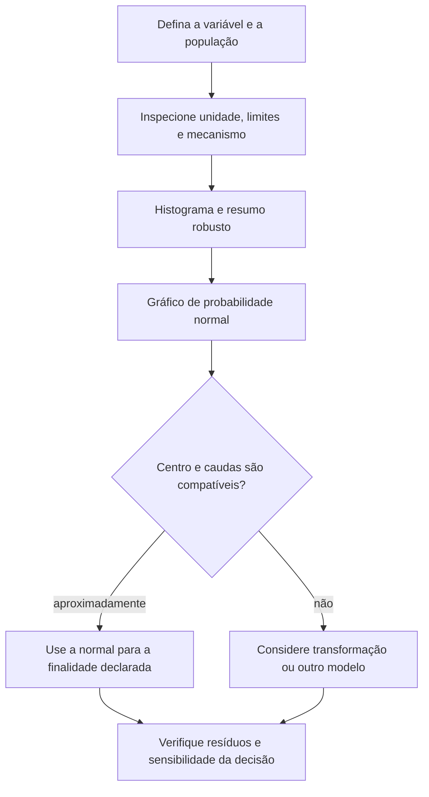
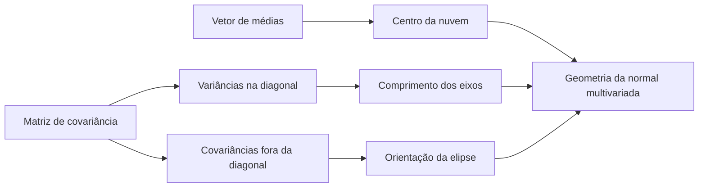

# Aula 09 — Distribuição normal, z-score e normal multivariada

<!-- mirandastech-aula-v2 -->

> **Trilha:** Estatística para IA  
> **Tempo sugerido:** 110–140 minutos de estudo + 60–80 minutos de laboratório  
> **Pré-requisitos:** [Aula 06 — esperança, variância e covariância](06-esperanca-variancia-covariancia.md) e [Aula 08 — Poisson e exponencial](08-poisson-exponencial.md)

[](https://colab.research.google.com/github/joaopaulomirandamatias/ai-lab/blob/main/02-statistics/notebooks/09-normal-zscore-multivariada-laboratorio.ipynb)

Um monitor informa que a latência de uma chamada ficou “1,5 desvio-padrão acima da média”. Isso é incomum? Como comparar esse desvio com o consumo de memória, medido em outra unidade? E, quando duas métricas variam juntas, por que uma região de comportamento típico parece uma elipse, não um retângulo?

A distribuição normal oferece uma linguagem para essas perguntas. O **z-score** transforma distância em unidades de desvio-padrão. A **normal multivariada** estende a ideia para vetores e incorpora dependência pela matriz de covariância. O modelo é central em estatística e IA, mas padronizar dados não os torna normais, e uma curva em forma de sino não valida automaticamente todas as hipóteses.

---

## 1. Problema motivador: um alerta contextualizado

Durante um regime operacional estável, suponha que uma métrica de latência \(X\), em milissegundos, seja razoavelmente modelada por

\[
X\sim\mathcal N(72,8^2).
\]

Isso significa média \(\mu=72\) ms e desvio-padrão \(\sigma=8\) ms. Para uma observação de 84 ms,

\[
z=\frac{84-72}{8}=1{,}5.
\]

Sob o modelo, a probabilidade de uma nova observação ultrapassar 84 ms é

\[
P(X>84)=P(Z>1{,}5)\approx0{,}066807.
\]

Portanto, 84 ms está acima da média, mas não é um evento extremamente raro: a cauda superior contém cerca de **6,68%** das observações. A conclusão depende do modelo, do período usado para estimar os parâmetros e da estabilidade do sistema.

---

## 2. Objetivos de aprendizagem

Ao concluir a aula, você será capaz de:

- interpretar média, variância e desvio-padrão de uma normal;
- converter valores para z-scores e retornar à escala original;
- calcular probabilidades, caudas e quantis com CDF, `sf` e `ppf`;
- explicar por que padronização não implica normalidade;
- inspecionar aderência com histograma e gráfico de probabilidade normal;
- representar vetores gaussianos por média e matriz de covariância;
- interpretar contornos elípticos e distância de Mahalanobis;
- simular uma normal multivariada por decomposição de Cholesky;
- reconhecer hipóteses frágeis, singularidade e vazamento de dados.

### Pré-requisitos rápidos

Da Aula 06, reutilizaremos esperança, variância e covariância. Da Aula 08, traremos o contraste entre distribuições assimétricas, como a exponencial, e uma distribuição simétrica. A razão pela qual médias de muitas observações frequentemente se aproximam de uma normal será estudada somente na Aula 10, com o Teorema Central do Limite.

---

## 3. Vocabulário essencial

| Termo | Significado |
|---|---|
| **normal ou gaussiana** | família contínua determinada por \(\mu\) e \(\sigma^2\) |
| **normal padrão** | normal com média 0 e variância 1 |
| **z-score** | distância assinada até a média, medida em desvios-padrão |
| **CDF** | \(F(x)=P(X\le x)\), área acumulada à esquerda |
| **função de sobrevivência** | \(S(x)=P(X>x)\), cauda à direita |
| **quantil** | valor que deixa uma proporção especificada à esquerda |
| **vetor de médias** | centro de uma distribuição multivariada |
| **matriz de covariância** | variâncias na diagonal e covariâncias fora dela |
| **distância de Mahalanobis** | distância que considera escala e correlação |
| **matriz positiva semidefinida** | matriz com variância não negativa em qualquer direção |
| **gráfico de probabilidade normal** | comparação entre quantis observados e quantis normais teóricos |

---

## 4. A distribuição normal univariada

Escrevemos

\[
X\sim\mathcal N(\mu,\sigma^2),\qquad \sigma>0.
\]

Sua densidade é

\[
f_X(x)=\frac{1}{\sigma\sqrt{2\pi}}
\exp\left[-\frac{(x-\mu)^2}{2\sigma^2}\right],
\qquad x\in\mathbb R.
\]

Cada parte tem uma função:

- \(\mu\) desloca o centro da curva;
- \(\sigma\) controla a escala horizontal;
- \(\sigma^2\) é a variância;
- o termo exponencial reduz a densidade à medida que a distância quadrática ao centro cresce;
- o fator \(1/(\sigma\sqrt{2\pi})\) faz a área total ser 1.

A normal é simétrica em torno de \(\mu\). Nesse modelo, média, mediana e moda coincidem. Valores possíveis ocupam toda a reta; logo, uma normal pode atribuir pequena probabilidade a valores fisicamente impossíveis, como latência negativa. Isso deve ser avaliado no contexto e na escala.

> A altura \(f_X(x)\) é densidade, não probabilidade pontual. Como \(X\) é contínua, \(P(X=x)=0\); probabilidades correspondem a áreas em intervalos.

---

## 5. O papel de \(\mu\) e \(\sigma\)

Considere três modelos:

| Distribuição | Centro | Dispersão | Efeito visual |
|---|---:|---:|---|
| \(\mathcal N(0,1)\) | 0 | \(\sigma=1\) | referência padrão |
| \(\mathcal N(3,1)\) | 3 | \(\sigma=1\) | mesma forma, deslocada |
| \(\mathcal N(0,4)\) | 0 | \(\sigma=2\) | mais larga e menos alta |

Na notação \(\mathcal N(\mu,\sigma^2)\), o segundo argumento é a **variância**, não o desvio-padrão. Já a SciPy usa `loc=mu` e `scale=sigma`. Confundir `scale` com \(\sigma^2\) altera todas as probabilidades.

---

## 6. Padronização e z-score

Se \(X\sim\mathcal N(\mu,\sigma^2)\), então

\[
Z=\frac{X-\mu}{\sigma}\sim\mathcal N(0,1).
\]

O z-score preserva a ordem e remove unidade:

- \(z=0\): valor na média;
- \(z=1{,}5\): 1,5 desvio-padrão acima da média;
- \(z=-2\): 2 desvios-padrão abaixo da média.

Para voltar à escala original,

\[
x=\mu+sigma z.
\]

### Exemplo passo a passo

No problema da latência, \(x=84\), \(\mu=72\) e \(\sigma=8\):

1. subtraia o centro: \(84-72=12\) ms;
2. divida pela escala: \(12/8=1{,}5\);
3. consulte a cauda da normal padrão: \(P(Z>1{,}5)\approx0{,}066807\).

Padronização permite comparar variáveis em unidades diferentes, mas não transforma assimetria, caudas pesadas ou multimodalidade em normalidade.

---

## 7. CDF, caudas e quantis

A CDF normal não tem uma expressão elementar simples; usamos tabelas ou software. Para \(X\sim\mathcal N(\mu,\sigma^2)\):

```python
from scipy.stats import norm

norm.cdf(x, loc=mu, scale=sigma)  # P(X <= x)
norm.sf(x, loc=mu, scale=sigma)   # P(X > x)
norm.ppf(q, loc=mu, scale=sigma)  # quantil q
```

Para caudas muito pequenas, `sf` é preferível a `1 - cdf`, pois evita perda de precisão por subtração entre números quase iguais. Para cálculos em log, `logcdf` e `logsf` são ainda mais estáveis.

### Regra 68–95–99,7

Para uma normal:

\[
P(|X-\mu|\le\sigma)\approx0{,}6827,
\]

\[
P(|X-\mu|\le2\sigma)\approx0{,}9545,
\]

\[
P(|X-\mu|\le3\sigma)\approx0{,}9973.
\]

Esses valores são aproximações úteis, não limiares universais de anomalia. Se milhares de métricas forem examinadas continuamente, eventos além de 3 desvios ocorrerão por acaso; dependência, múltiplas comparações e custo do erro importam.

### Quantil central de 95%

O intervalo central de 95% de uma normal é aproximadamente

\[
[\mu-1{,}96\sigma,\ \mu+1{,}96\sigma].
\]

Isso descreve 95% da distribuição de observações sob parâmetros conhecidos. Não é automaticamente um intervalo de confiança para uma média estimada; intervalos de confiança serão estudados na Aula 14.

---

## 8. Normalidade: hipótese a ser examinada

Um procedimento responsável combina conhecimento do mecanismo e diagnóstico dos dados.



### Histograma

Ajuda a enxergar assimetria, múltiplos grupos e valores extremos, mas depende do número de classes e pode esconder problemas em amostras pequenas.

### Gráfico de probabilidade normal

Ordena os dados e os compara com quantis teóricos normais. Pontos aproximadamente lineares são compatíveis com normalidade; curvatura sistemática sugere assimetria ou caudas diferentes. A função `scipy.stats.probplot` gera um gráfico de probabilidade baseado em quantis. Ele é uma ferramenta diagnóstica, não uma prova.

### Testes formais

Testes de normalidade podem rejeitar desvios irrelevantes em amostras enormes ou ter pouco poder em amostras pequenas. A pergunta correta é: **a aproximação é adequada para a inferência ou decisão pretendida?**

---

## 9. Estimar e padronizar sem vazamento

Quando \(\mu\) e \(\sigma\) são desconhecidos, estimamos no conjunto de treino:

\[
\bar x_{\text{treino}}=\frac1n\sum_{i=1}^n x_i,
\qquad
s_{\text{treino}}=\sqrt{\frac{1}{n-1}\sum_{i=1}^n(x_i-\bar x)^2}.
\]

Depois aplicamos os mesmos parâmetros ao treino, validação, teste e produção:

\[
z=\frac{x-\bar x_{\text{treino}}}{s_{\text{treino}}}.
\]

Recalcular o centro e a escala com o teste deixa informação futura entrar no pré-processamento. Além de vazamento, isso esconde mudança de distribuição: se o teste deslocou, seus z-scores não devem ser artificialmente recentralizados em zero durante a avaliação.

---

## 10. Da reta para vetores

Uma observação de IA geralmente é um vetor: latência, memória, tamanho do prompt, confiança e outras características. Escrevemos

\[
\mathbf X=
\begin{bmatrix}
X_1\\X_2\\\vdots\\X_d
\end{bmatrix}
\sim\mathcal N_d(\boldsymbol\mu,\boldsymbol\Sigma).
\]

O vetor \(\boldsymbol\mu\) localiza o centro. A matriz de covariância é

\[
\boldsymbol\Sigma=
\begin{bmatrix}
\operatorname{Var}(X_1) & \operatorname{Cov}(X_1,X_2) & \cdots\\
\operatorname{Cov}(X_2,X_1) & \operatorname{Var}(X_2) & \cdots\\
\vdots & \vdots & \ddots
\end{bmatrix}.
\]

Ela deve ser simétrica e positiva semidefinida. Para a densidade usual com inversa e determinante, exigimos matriz positiva definida.

---

## 11. Normal multivariada

Para dimensão \(d\) e \(\boldsymbol\Sigma\) positiva definida,

\[
f(\mathbf x)=\frac{1}{(2\pi)^{d/2}|\boldsymbol\Sigma|^{1/2}}
\exp\left[-\frac12(\mathbf x-\boldsymbol\mu)^\top
\boldsymbol\Sigma^{-1}(\mathbf x-\boldsymbol\mu)\right].
\]

A expressão quadrática no expoente mede afastamento levando em conta escala e correlação. Em duas dimensões, pontos de mesma densidade formam elipses:

- autovetores de \(\boldsymbol\Sigma\) definem as direções principais;
- autovalores definem a dispersão nessas direções;
- covariância positiva inclina a elipse para cima;
- covariância negativa inclina a elipse para baixo;
- covariância zero alinha os eixos, embora isso não prove independência fora da família normal conjunta.



---

## 12. Exemplo bivariado resolvido

Considere

\[
\boldsymbol\mu=\begin{bmatrix}2\\-1\end{bmatrix},
\qquad
\boldsymbol\Sigma=
\begin{bmatrix}
4 & 3\\
3 & 9
\end{bmatrix}.
\]

Os desvios-padrão marginais são 2 e 3. A correlação é

\[
\rho=\frac{3}{2\cdot3}=0{,}5.
\]

Logo, as duas componentes tendem a crescer juntas, mas não de modo determinístico. Para \(\mathbf x=[4,2]^\top\), o deslocamento é \([2,3]^\top\). Como

\[
\boldsymbol\Sigma^{-1}
=\frac1{27}
\begin{bmatrix}9&-3\\-3&4\end{bmatrix},
\]

a distância quadrática de Mahalanobis é

\[
D_M^2=(\mathbf x-\boldsymbol\mu)^\top
\boldsymbol\Sigma^{-1}(\mathbf x-\boldsymbol\mu)
=\frac43.
\]

Assim, \(D_M\approx1{,}1547\). A distância euclidiana seria \(\sqrt{13}\), mas ignora que as escalas são diferentes e as componentes correlacionadas.

---

## 13. Elipses de probabilidade e Mahalanobis

Se \(\mathbf X\) é normal multivariada em \(d\) dimensões e \(\boldsymbol\Sigma\) é não singular, então

\[
D_M^2\sim\chi^2_d.
\]

Em duas dimensões, a região que contém 95% da massa é

\[
D_M^2\le \chi^2_{2;0{,}95}\approx5{,}991.
\]

Não use automaticamente \(1{,}96\) como “raio de 95%” multivariado: \(1{,}96\) pertence ao intervalo central univariado. A dimensão muda o limiar.

Mahalanobis é útil para triagem de observações fora do padrão, mas depende de média e covariância bem estimadas. Em alta dimensão, matrizes podem ficar instáveis ou singulares; regularização e métodos robustos podem ser necessários.

---

## 14. Simulação por Cholesky

Se \(\mathbf Z\sim\mathcal N_d(\mathbf0,\mathbf I)\) e \(\boldsymbol\Sigma=\mathbf L\mathbf L^\top\), então

\[
\mathbf X=\boldsymbol\mu+\mathbf L\mathbf Z
\]

tem média \(\boldsymbol\mu\) e covariância \(\boldsymbol\Sigma\). A decomposição de Cholesky fornece \(\mathbf L\) triangular quando \(\boldsymbol\Sigma\) é positiva definida.

Para a matriz do exemplo,

\[
\mathbf L=
\begin{bmatrix}
2&0\\
1{,}5&\sqrt{6{,}75}
\end{bmatrix}.
\]

O laboratório verificará numericamente \(\mathbf L\mathbf L^\top=\boldsymbol\Sigma\) e comparará parâmetros simulados com os teóricos.

---

## 15. Correlação zero não basta

Na normal multivariada conjunta, covariância zero entre componentes implica independência. Fora dessa família, a conclusão é falsa.

Se \(U\) é simétrica em torno de zero e \(Y=U^2\), então \(\operatorname{Cov}(U,Y)=0\), mas \(Y\) é completamente determinado por \(U\). Portanto:

- independência implica covariância zero, quando os momentos existem;
- covariância zero não implica independência em geral;
- a implicação inversa vale para componentes conjuntamente gaussianas.

Essa distinção será retomada na Aula 19, ao separar correlação, dependência e causalidade.

---

## 16. Conexões com IA e ML

### Padronização de atributos

O z-score coloca atributos em escalas comparáveis, o que ajuda otimização e modelos sensíveis a distância. Os parâmetros devem vir do treino e ser preservados no pipeline.

### Inicialização e ruído

Pesos e ruídos gaussianos aparecem em redes neurais, modelos probabilísticos e mecanismos de perturbação. Escolher a variância não é detalhe: ela controla a escala do sinal e do gradiente.

### Espaços latentes

Modelos de variáveis latentes frequentemente usam prior normal multivariada. Uma covariância diagonal simplifica cálculos, mas expressa uma hipótese de ausência de correlação no sistema de coordenadas escolhido.

### Detecção de mudança e observações atípicas

Z-scores e distância de Mahalanobis fornecem baselines interpretáveis. Eles não detectam todo tipo de mudança: a distribuição pode alterar caudas, dependência ou multimodalidade sem deslocar muito a média.

### Resíduos

Muitos métodos clássicos assumem normalidade de erros ou usam a normal como aproximação. Examine resíduos, não apenas a variável-alvo bruta, e identifique exatamente qual conclusão depende da hipótese.

---

## 17. Armadilhas e erros comuns

1. **Confundir variância e desvio-padrão.** Em \(\mathcal N(\mu,\sigma^2)\), a SciPy recebe `scale=sigma`.
2. **Dizer que z-score torna os dados normais.** Ele apenas centraliza e reescala.
3. **Usar parâmetros do teste.** Isso causa vazamento e mascara mudança de distribuição.
4. **Aplicar a regra 68–95–99,7 a qualquer distribuição.** Ela é específica da normal.
5. **Interpretar PDF como probabilidade pontual.** Probabilidade contínua é área.
6. **Calcular caudas extremas por `1-cdf`.** Prefira `sf` ou `logsf`.
7. **Concluir normalidade porque o histograma parece um sino.** Verifique caudas, grupos e mecanismo.
8. **Concluir independência a partir de correlação zero.** Isso requer condições adicionais.
9. **Usar \(1{,}96\) como raio multivariado de 95%.** O limiar vem de \(\chi^2_d\).
10. **Inverter covariância instável sem diagnóstico.** Confira simetria, autovalores, dimensão e tamanho amostral.
11. **Tratar outlier como erro automaticamente.** Pode ser evento legítimo, mudança de regime ou falha de coleta.
12. **Confundir intervalo de observações com intervalo de confiança.** São objetos diferentes.

---

## 18. Laboratório reproduzível

O [notebook da Aula 09](../notebooks/09-normal-zscore-multivariada-laboratorio.ipynb) usa seed fixa para:

- calcular z-score, caudas e quantis;
- verificar a regra 68–95–99,7 por integração e simulação;
- mostrar que padronizar uma lognormal não a torna normal;
- comparar gráficos de probabilidade de dados normais e assimétricos;
- preservar parâmetros do treino diante de mudança no teste;
- gerar uma normal bivariada e recuperar média e covariância;
- desenhar contornos e a elipse de 95%;
- verificar Cholesky e cobertura por Mahalanobis;
- construir um contraexemplo de covariância zero com dependência.

Dependências:

```text
Python >= 3.10
numpy >= 1.26
scipy >= 1.11
matplotlib >= 3.8
```

Fallback mínimo:

```python
from scipy.stats import norm

mu, sigma, x = 72.0, 8.0, 84.0
z = (x - mu) / sigma
cauda = norm.sf(x, loc=mu, scale=sigma)
print(z, cauda)
```

---

## 19. Checklist prático

- [ ] Defini a população, a variável e a unidade.
- [ ] Diferenciei desvio-padrão de variância.
- [ ] Verifiquei limites físicos, assimetria, grupos e caudas.
- [ ] Usei `sf` ou `logsf` para caudas extremas.
- [ ] Ajustei centro e escala somente no treino.
- [ ] Documentei se os parâmetros são populacionais ou estimados.
- [ ] Inspecionei histograma e gráfico de probabilidade.
- [ ] Validei simetria e autovalores da covariância.
- [ ] Usei limiar \(\chi^2_d\) para regiões multivariadas.
- [ ] Fiz análise de sensibilidade quando a decisão depende da normalidade.
- [ ] Registrei o que o modelo não prova.

---

## 20. Exercícios

### 1. z-score

Uma pontuação segue \(\mathcal N(50,10^2)\). Qual é o z-score de 65?

### 2. Volta à escala original

No modelo anterior, qual valor corresponde a \(z=-1{,}2\)?

### 3. Probabilidade central

Qual é aproximadamente \(P(30\le X\le70)\) para \(X\sim\mathcal N(50,10^2)\)?

### 4. Cauda

Qual função da SciPy você usaria para \(P(X>80)\) e por quê?

### 5. Padronização

Depois de padronizar uma variável fortemente assimétrica, sua média ficou 0 e o desvio-padrão 1. Podemos afirmar que ela é normal?

### 6. Covariância

Para \(\boldsymbol\Sigma=[[9,-3],[-3,4]]\), quais são os desvios-padrão marginais e o sinal da correlação?

### 7. Região multivariada

Por que o limite \(|z|\le1{,}96\) não define diretamente uma elipse bivariada contendo 95% da massa?

### 8. Vazamento

O conjunto de treino tem média 100 e desvio-padrão 20; o teste tem uma observação 130. Qual z-score deve ser usado na avaliação? O que há de errado em recentralizar todo o teste?

---

## 21. Respostas comentadas

### 1.

\[
z=(65-50)/10=1{,}5.
\]

### 2.

\[
x=\mu+\sigma z=50+10(-1{,}2)=38.
\]

### 3.

Os limites são \(\mu\pm2\sigma\). Pela normal, a probabilidade é aproximadamente \(0{,}9545\), ou 95,45%.

### 4.

Use `norm.sf(80, loc=50, scale=10)`. A função `sf` calcula a cauda direita diretamente e é numericamente mais estável que `1 - norm.cdf(...)` em regiões extremas.

### 5.

Não. Centralizar e dividir pelo desvio-padrão muda localização e escala, mas preserva características como assimetria e multimodalidade.

### 6.

Os desvios-padrão são \(\sqrt9=3\) e \(\sqrt4=2\). A covariância é -3, então a correlação é negativa: \(\rho=-3/(3\cdot2)=-0{,}5\).

### 7.

\(1{,}96\) é o limite central univariado. Para \(d=2\), a distância quadrática de Mahalanobis segue \(\chi^2_2\), e o limite de 95% é aproximadamente 5,991.

### 8.

Use os parâmetros do treino:

\[
z=(130-100)/20=1{,}5.
\]

Recalcular média e escala no teste usa informação que deveria permanecer externa ao ajuste e pode esconder um deslocamento real de distribuição.

---

## 22. Resumo

- A normal univariada é determinada por \(\mu\) e \(\sigma^2\).
- O z-score mede distância assinada em desvios-padrão e não cria normalidade.
- CDF, `sf` e `ppf` respondem, respectivamente, a probabilidade acumulada, cauda direita e quantil.
- A regra 68–95–99,7 só vale para dados compatíveis com o modelo normal.
- Diagnóstico exige contexto, histograma, quantis e atenção às caudas.
- Na normal multivariada, \(\boldsymbol\mu\) define o centro e \(\boldsymbol\Sigma\) define escala e orientação.
- A distância de Mahalanobis considera variâncias e covariâncias.
- Regiões multivariadas usam quantis \(\chi^2_d\), não o corte univariado 1,96.
- Correlação zero implica independência para componentes conjuntamente normais, mas não em geral.
- Parâmetros de padronização devem ser ajustados somente no treino.

---

## 23. Próxima aula

Na [Aula 10 — Lei dos Grandes Números, Teorema Central do Limite e Monte Carlo](10-lln-clt-monte-carlo.md), veremos por que médias amostrais se estabilizam, em quais condições uma aproximação normal emerge mesmo quando os dados originais não são normais e como simulação aproxima probabilidades difíceis.

---

## 24. Referências

### Fontes técnicas

- DIEZ, David M.; BARR, Christopher D.; ÇETINKAYA-RUNDEL, Mine. *OpenIntro Statistics*. 4. ed. OpenIntro, 2019. <https://www.openintro.org/book/os/>.
- NIST/SEMATECH. *e-Handbook of Statistical Methods — Normal Distribution*. <https://www.itl.nist.gov/div898/handbook/eda/section3/eda3661.htm>.
- SCIPY COMMUNITY. `scipy.stats.norm`. <https://docs.scipy.org/doc/scipy/reference/generated/scipy.stats.norm.html>.
- SCIPY COMMUNITY. `scipy.stats.multivariate_normal`. <https://docs.scipy.org/doc/scipy/reference/generated/scipy.stats.multivariate_normal.html>.
- SCIPY COMMUNITY. `scipy.stats.probplot`. <https://docs.scipy.org/doc/scipy/reference/generated/scipy.stats.probplot.html>.
- NUMPY DEVELOPERS. `Generator.multivariate_normal`. <https://numpy.org/doc/stable/reference/random/generated/numpy.random.Generator.multivariate_normal.html>.

### Material complementar

- MURPHY, Kevin P. *Probabilistic Machine Learning: An Introduction*. MIT Press, 2022. Versão do autor: <https://probml.github.io/pml-book/book1.html>.
- BLITZSTEIN, Joseph K.; HWANG, Jessica. *Introduction to Probability*. 2. ed. Chapman & Hall/CRC, 2019. Materiais do Stat 110: <https://stat110.hsites.harvard.edu/>.

