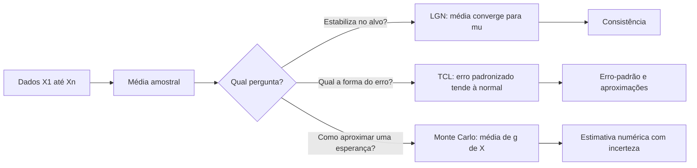
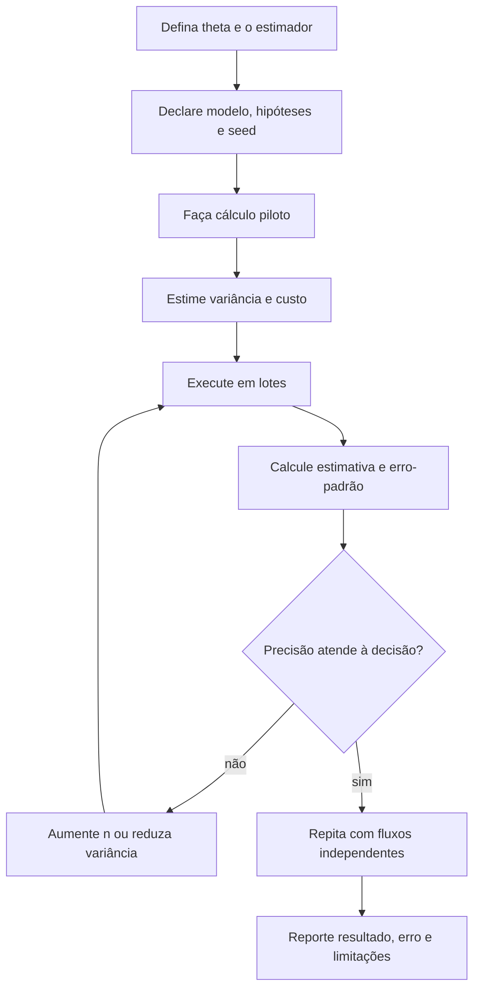

# Aula 10 — Lei dos Grandes Números, Teorema Central do Limite e Monte Carlo

<!-- mirandastech-aula-v2 -->

> **Trilha:** Estatística para IA  
> **Tempo sugerido:** 120–150 minutos de estudo + 70–90 minutos de laboratório  
> **Pré-requisitos:** [Aula 06 — esperança, variância e covariância](06-esperanca-variancia-covariancia.md) e [Aula 09 — distribuição normal e z-score](09-normal-zscore-multivariada.md)

[](https://colab.research.google.com/github/joaopaulomirandamatias/ai-lab/blob/main/02-statistics/notebooks/10-lln-clt-monte-carlo-laboratorio.ipynb)

Uma única avaliação de um modelo pode variar por causa da amostra, da ordem dos exemplos ou da aleatoriedade do próprio sistema. Se repetirmos a medição, a média tende a estabilizar? Qual é a forma da incerteza ao redor dessa média? E como usar amostras aleatórias para aproximar uma integral ou uma probabilidade difícil?

Três ideias respondem a perguntas diferentes:

- a **Lei dos Grandes Números (LGN)** explica a estabilização de médias;
- o **Teorema Central do Limite (TCL)** descreve a distribuição aproximada do erro da média;
- o método de **Monte Carlo** transforma esperanças em algoritmos de aproximação por amostragem.

Confundi-las leva a frases perigosas como “com dados suficientes tudo vira normal”. Não vira. Nesta aula, cada resultado será associado à sua hipótese e ao tipo correto de convergência.

---

## 1. Problema motivador: estimar uma métrica de produção

Considere o custo por requisição de um sistema de IA. A variável \(X_i\) é positiva, assimétrica e tem média populacional \(\mu\), mas não conhecemos \(\mu\). Coletamos \(n\) requisições e calculamos

\[
\bar X_n=\frac1n\sum_{i=1}^n X_i.
\]

Queremos responder:

1. \(\bar X_n\) se aproxima de \(\mu\) quando \(n\) cresce?
2. qual é a escala típica do erro \(\bar X_n-\mu\)?
3. a distribuição de \(\bar X_n\) pode ser aproximada por uma normal?
4. quanto esforço computacional é necessário para reduzir o erro pela metade?

A LGN responde à primeira pergunta. A variância da média e o TCL respondem à segunda e à terceira. Monte Carlo usa as mesmas ideias para a quarta.

---

## 2. Objetivos de aprendizagem

Ao concluir a aula, você será capaz de:

- distinguir convergência em probabilidade de convergência em distribuição;
- enunciar uma versão da LGN e interpretar o que ela garante;
- calcular a variância e o erro-padrão da média sob independência;
- aplicar o TCL a médias e proporções quando as condições forem plausíveis;
- explicar por que não existe um tamanho amostral universal para o TCL;
- construir estimadores de Monte Carlo e quantificar seu erro de simulação;
- explicar a taxa \(1/\sqrt n\) e o custo de aumentar precisão;
- trabalhar com seed, repetições independentes e processamento em lotes;
- reconhecer falhas causadas por dependência, caudas pesadas e eventos raros;
- conectar amostragem a minibatches, avaliação e estimativas estocásticas em IA.

---

## 3. Vocabulário essencial

| Termo | Ideia central |
|---|---|
| **estimador** | regra calculada a partir da amostra para aproximar uma quantidade |
| **consistência** | aproximação do alvo à medida que a amostra cresce |
| **convergência em probabilidade** | a chance de um erro maior que \(\varepsilon\) tende a zero |
| **convergência em distribuição** | a CDF do objeto padronizado tende à CDF de uma distribuição limite |
| **erro-padrão** | desvio-padrão da distribuição amostral de um estimador |
| **distribuição amostral** | distribuição do estimador em repetições do procedimento |
| **Monte Carlo** | aproximação numérica por amostragem pseudoaleatória |
| **erro de Monte Carlo** | diferença aleatória entre estimativa simulada e alvo |
| **viés** | diferença sistemática entre o valor esperado do estimador e o alvo |
| **RMSE** | raiz do erro quadrático médio, combinando viés e variância |
| **taxa raiz de \(n\)** | erro típico proporcional a \(1/\sqrt n\) |

---

## 4. Antes dos teoremas: a média como variável aleatória

Antes de observar os dados, \(\bar X_n\) é aleatória. Se \(X_1,\ldots,X_n\) forem independentes, com mesma média \(\mu\) e mesma variância finita \(\sigma^2\), então

\[
\mathbb E[\bar X_n]=\mu
\]

e

\[
\operatorname{Var}(\bar X_n)
=\operatorname{Var}\left(\frac1n\sum_{i=1}^nX_i\right)
=\frac{1}{n^2}\sum_{i=1}^n\sigma^2
=\frac{\sigma^2}{n}.
\]

Logo, o desvio-padrão da distribuição amostral é

\[
\operatorname{SE}(\bar X_n)=\frac{\sigma}{\sqrt n}.
\]

Se \(\sigma\) for desconhecido, substituímos por uma estimativa \(s\), reconhecendo a incerteza adicional. A fórmula \(\sigma/\sqrt n\) depende do esquema amostral; correlação positiva entre observações reduz a informação efetiva e pode tornar essa expressão otimista.

---

## 5. Lei dos Grandes Números

Uma versão da **LGN fraca** afirma que, para variáveis independentes e identicamente distribuídas com média finita \(\mu\),

\[
\bar X_n\xrightarrow{P}\mu.
\]

Formalmente, para todo \(\varepsilon>0\),

\[
P(|\bar X_n-\mu|>\varepsilon)\longrightarrow0
\qquad\text{quando }n\to\infty.
\]

Isso significa que a média amostral fica concentrada perto de \(\mu\). A LGN não diz que a sequência fica monotonicamente mais próxima, não fornece sozinha uma velocidade exata e não transforma os dados em normais.

### Uma leitura por Chebyshev

Sob variância finita e independência,

\[
P(|\bar X_n-\mu|\ge\varepsilon)
\le\frac{\sigma^2}{n\varepsilon^2}.
\]

O limite cai como \(1/n\). Ele é geral e frequentemente conservador, mas torna a concentração visível sem assumir normalidade.

### LGN forte

A LGN forte estabelece convergência quase certa sob condições apropriadas:

\[
P\left(\lim_{n\to\infty}\bar X_n=\mu\right)=1.
\]

Para esta aula, a distinção principal é conceitual: a versão fraca controla probabilidades de desvios para cada \(n\); a forte descreve trajetórias inteiras. Nenhuma dispensa verificar a existência da média e o mecanismo de amostragem.

---

## 6. Exemplo: frequência de sucesso

Se \(X_i\sim\operatorname{Bernoulli}(p)\), então

\[
\bar X_n=\frac{1}{n}\sum X_i
\]

é a frequência relativa de sucessos. Como \(\mathbb E[X_i]=p\), a LGN afirma que \(\bar X_n\) se aproxima de \(p\).

Para \(p=0{,}3\), a frequência pode oscilar bastante nas primeiras tentativas: 0, 0,5 ou 1 não são surpreendentes com amostras minúsculas. Depois de muitas tentativas independentes, oscilações absolutas tendem a diminuir. Isso explica estabilização, não garante igualdade exata em um número finito de observações.

---

## 7. Teorema Central do Limite

Na forma clássica de Lindeberg–Lévy, se \(X_1,X_2,\ldots\) são i.i.d., com média finita \(\mu\) e variância finita positiva \(\sigma^2\), então

\[
\frac{\sqrt n(\bar X_n-\mu)}{\sigma}
\xrightarrow{d}\mathcal N(0,1).
\]

Equivalentemente, para \(n\) suficientemente grande no problema considerado,

\[
\bar X_n\approx\mathcal N\left(\mu,\frac{\sigma^2}{n}\right).
\]

O TCL descreve a distribuição padronizada do **estimador**, não a distribuição dos dados originais. Uma variável exponencial continua assimétrica; são as médias de várias exponenciais independentes que se tornam progressivamente mais compatíveis com uma normal.



---

## 8. Exemplo resolvido: média de tempos exponenciais

Considere tempos \(X_i\sim\operatorname{Exponencial}(1)\), em minutos. Então \(\mu=1\) e \(\sigma=1\). Para \(n=40\), o TCL fornece

\[
\bar X_{40}\approx\mathcal N\left(1,\frac1{40}\right).
\]

Queremos \(P(\bar X_{40}>1{,}2)\). Padronizando:

\[
z=\frac{1{,}2-1}{1/\sqrt{40}}
=0{,}2\sqrt{40}
\approx1{,}2649.
\]

Assim,

\[
P(\bar X_{40}>1{,}2)\approx P(Z>1{,}2649)\approx0{,}102952.
\]

Neste caso especial, a soma de exponenciais tem distribuição gama, então podemos comparar a aproximação com um valor exato. O laboratório fará essa comparação e medirá o erro, em vez de tratar o TCL como igualdade.

---

## 9. Não existe um “\(n\ge30\)” universal

A qualidade da aproximação depende de:

- assimetria e peso das caudas;
- existência e magnitude dos momentos;
- dependência entre observações;
- dominância de poucas observações;
- quantidade de precisão exigida, especialmente nas caudas.

Uma distribuição quase simétrica pode precisar de poucas observações para uma aproximação central razoável. Uma distribuição muito assimétrica ou de cauda pesada pode exigir centenas ou milhares. Se a variância for infinita, o TCL clássico não se aplica. A distribuição de Cauchy nem sequer possui média finita; sua média amostral não se estabiliza como na LGN clássica.

Para proporções binomiais, condições como \(np\) e \(n(1-p)\) razoavelmente grandes são diagnósticos úteis, não leis universais. Para caudas e eventos raros, compare com cálculo exato ou simulação quando possível.

---

## 10. LGN e TCL não são a mesma coisa

| Aspecto | LGN | TCL |
|---|---|---|
| pergunta | o estimador se aproxima do alvo? | qual é a forma do erro reescalado? |
| objeto | \(\bar X_n\) | \(\sqrt n(\bar X_n-\mu)/\sigma\) |
| convergência | tipicamente em probabilidade ou quase certa | em distribuição |
| resultado | concentração em \(\mu\) | limite normal padrão |
| uso | consistência | aproximações, erros-padrão e quantis |
| não garante | velocidade precisa em toda situação | normalidade dos dados originais |

É possível ter uma LGN aplicável sem que uma aproximação normal simples seja boa no tamanho amostral disponível.

---

## 11. Monte Carlo como média amostral

Suponha que a quantidade de interesse possa ser escrita como

\[
\theta=\mathbb E[g(X)].
\]

Geramos \(X_1,\ldots,X_n\) do modelo e estimamos

\[
\hat\theta_n=\frac1n\sum_{i=1}^n g(X_i).
\]

Sob condições adequadas:

- a LGN justifica \(\hat\theta_n\to\theta\);
- o TCL aproxima o erro por uma normal;
- o erro-padrão é estimado por

\[
\widehat{\operatorname{SE}}(\hat\theta_n)
=\frac{s_g}{\sqrt n},
\]

onde \(s_g\) é o desvio-padrão amostral dos valores \(g(X_i)\).

Um resumo aproximado do erro de simulação é

\[
\hat\theta_n\pm1{,}96\widehat{\operatorname{SE}}.
\]

Aqui ele descreve incerteza de Monte Carlo sob repetições do algoritmo. Intervalos de confiança e suas interpretações formais serão desenvolvidos na Aula 14.

---

## 12. Exemplo Monte Carlo: estimar \(\pi\)

Gere \((U,V)\) uniformemente no quadrado \([-1,1]^2\). O indicador

\[
I=\mathbf1(U^2+V^2\le1)
\]

vale 1 quando o ponto cai no círculo unitário. Como a razão entre as áreas é \(\pi/4\),

\[
\pi=4\mathbb E[I].
\]

O estimador é

\[
\hat\pi=\frac4n\sum_{i=1}^n I_i.
\]

Ele é simples e didático, embora existam métodos muito mais eficientes para calcular \(\pi\). Seu valor está em tornar visíveis convergência, erro-padrão e custo computacional.

---

## 13. A lei do custo: precisão custa ao quadrado

Como o erro-padrão cai aproximadamente como \(1/\sqrt n\):

- multiplicar \(n\) por 4 reduz o erro típico pela metade;
- multiplicar \(n\) por 100 reduz o erro típico por um fator 10;
- ganhar uma casa decimal costuma exigir cerca de 100 vezes mais amostras.

Esse resultado explica por que Monte Carlo ingênuo pode ser caro. Técnicas de redução de variância — amostragem estratificada, variáveis de controle e importance sampling — mudam a constante ou o mecanismo, mas ficam fora do escopo desta aula.

---

## 14. Erro aleatório, viés e erro numérico

Não misture fontes de erro:

| Fonte | Origem | Aumentar \(n\) resolve? |
|---|---|---|
| erro de Monte Carlo | amostra pseudoaleatória finita | reduz, em geral, como \(1/\sqrt n\) |
| viés do estimador | regra ou aproximação sistemática | não necessariamente |
| erro de modelagem | distribuição simulada não representa o fenômeno | não |
| erro numérico | arredondamento, overflow, algoritmo | não necessariamente |
| erro de dados | coleta, rotulagem ou seleção | não |

Uma estimativa muito precisa do modelo errado continua errada. Reporte tanto o erro de simulação quanto as limitações do modelo.

---

## 15. Reprodutibilidade correta

Uma seed fixa permite reproduzir uma sequência pseudoaleatória:

```python
import numpy as np
rng = np.random.default_rng(20260907)
```

Mas seed não valida o método. Boas práticas incluem:

1. registrar seed, versão das bibliotecas e algoritmo;
2. separar fluxos aleatórios em experimentos independentes;
3. executar repetições com seeds distintas para medir variabilidade;
4. processar em lotes quando \(n\) é grande;
5. manter o mesmo protocolo ao comparar métodos;
6. não usar geradores de simulação para criptografia.

Reutilizar exatamente as mesmas amostras em dois métodos pode ser útil como números aleatórios comuns, mas deve ser uma decisão documentada, não um acidente de estado global.

---

## 16. Eventos raros: onde Monte Carlo ingênuo falha

Para estimar \(p=P(Z>4)\approx3{,}17\times10^{-5}\) por indicadores, uma simulação com \(n=100.000\) espera apenas cerca de 3,17 sucessos. O erro-padrão relativo aproximado é

\[
\frac{\sqrt{p(1-p)/n}}{p}
\approx\frac1{\sqrt{np}}
\approx56\%.
\]

Uma execução pode observar zero, duas ou seis ocorrências e produzir estimativas muito diferentes. A seed não cura escassez informativa. Eventos raros pedem muito mais amostras ou técnicas especializadas.

---

## 17. Conexões com IA e ML

### Minibatches e gradientes estocásticos

O gradiente médio de um minibatch aproxima o gradiente do conjunto de dados. Sob amostragem adequada, aumentar o lote reduz variância, mas com retornos de raiz quadrada e custo adicional. Dependência, desbalanceamento e amostragem não uniforme alteram a análise.

### Avaliação de modelos

Accuracy, loss média e custo médio são médias amostrais. Um único número sem tamanho amostral, dispersão ou desenho de amostragem pode sugerir estabilidade inexistente.

### Inferência e geração

Amostragem aparece em modelos probabilísticos, decodificação e aproximação de esperanças. Variabilidade entre execuções pode ser parte do sistema e precisa ser medida.

### Simulação de sistemas agentivos

Monte Carlo permite propagar incerteza em latência, falha de ferramentas e decisões de agentes. O resultado só é defensável se as distribuições de entrada e dependências forem justificadas.

### Monitoramento

Médias móveis parecem mais suaves com janelas maiores, mas observações correlacionadas não equivalem a amostras independentes. Mudança de regime também viola a ideia de um único \(\mu\) estável.

---

## 18. Fluxo prático de uma simulação



---

## 19. Armadilhas e erros comuns

1. **Dizer que a LGN torna os dados normais.** Ela trata de estabilização da média.
2. **Dizer que o TCL vale sempre para \(n\ge30\).** A qualidade depende da distribuição e do objetivo.
3. **Confundir desvio-padrão dos dados com erro-padrão da média.** O segundo é \(\sigma/\sqrt n\) sob as hipóteses usuais.
4. **Ignorar dependência.** Séries temporais, usuários repetidos e lotes correlacionados reduzem o tamanho efetivo.
5. **Aplicar resultados clássicos sem média ou variância finita.** Cauchy é um contraexemplo fundamental.
6. **Interpretar aproximação como igualdade.** Compare com cálculo exato quando disponível.
7. **Usar uma única seed como evidência de robustez.** Repita com fluxos independentes.
8. **Reportar somente a estimativa Monte Carlo.** Inclua erro-padrão e \(n\).
9. **Achar que mais simulação corrige um modelo ruim.** Ela só reduz erro aleatório do cálculo.
10. **Estimar evento raro com poucos sucessos.** O erro relativo pode ser enorme.
11. **Parar quando o resultado “parece bom”.** Parada adaptativa não planejada pode enviesar a comunicação.
12. **Carregar tudo na memória.** Acumule soma, soma de quadrados e contagens em lotes.

---

## 20. Laboratório reproduzível

O [notebook da Aula 10](../notebooks/10-lln-clt-monte-carlo-laboratorio.ipynb) usa seed fixa para:

- visualizar a frequência Bernoulli se estabilizando;
- comparar a desigualdade de Chebyshev com probabilidade simulada;
- observar médias exponenciais se aproximarem da normal;
- comparar TCL e resultado gama exato;
- contrastar caudas moderadas, pesadas e Cauchy;
- estimar \(\pi\) e uma integral por Monte Carlo;
- verificar empiricamente a taxa \(1/\sqrt n\);
- reproduzir o mesmo cálculo em lotes;
- medir a variância de médias de minibatch;
- quantificar a dificuldade de um evento raro.

Dependências:

```text
Python >= 3.10
numpy >= 1.26
scipy >= 1.11
matplotlib >= 3.8
```

Fallback mínimo:

```python
import numpy as np

rng = np.random.default_rng(20260907)
pontos = rng.uniform(-1, 1, size=(500_000, 2))
dentro = np.sum(pontos**2, axis=1) <= 1
pi_estimado = 4 * dentro.mean()
erro_padrao = 4 * dentro.std(ddof=1) / np.sqrt(len(dentro))
print(pi_estimado, erro_padrao)
```

---

## 21. Checklist prático

- [ ] Defini a quantidade-alvo antes de simular.
- [ ] Declarei população, independência e momentos necessários.
- [ ] Diferenciei LGN de TCL.
- [ ] Calculei ou estimei o erro-padrão.
- [ ] Verifiquei se a aproximação normal é adequada ao tamanho \(n\).
- [ ] Registrei seed e versões das dependências.
- [ ] Usei repetições independentes para avaliar estabilidade.
- [ ] Planejei o tamanho da simulação pela precisão necessária.
- [ ] Tratei eventos raros pelo número esperado de sucessos.
- [ ] Separei erro Monte Carlo, viés e erro de modelagem.
- [ ] Usei lotes para controlar memória sem mudar o estimador.
- [ ] Documentei o que o resultado não demonstra.

---

## 22. Exercícios

### 1. Variância da média

Se \(\operatorname{Var}(X)=25\), qual é o erro-padrão de \(\bar X_{100}\)?

### 2. Custo da precisão

Uma simulação usa 10.000 amostras. Quantas são necessárias, aproximadamente, para reduzir o erro-padrão pela metade?

### 3. LGN ou TCL?

Qual resultado justifica que a média se aproxime do alvo? Qual descreve a forma aproximada do erro padronizado?

### 4. Exponencial

Para \(X_i\sim\operatorname{Exponencial}(1)\) e \(n=100\), qual é a distribuição normal aproximada de \(\bar X\)?

### 5. Chebyshev

Com \(\sigma^2=4\), \(n=100\) e \(\varepsilon=1\), qual limite superior Chebyshev fornece para \(P(|\bar X-\mu|\ge1)\)?

### 6. Dependência

Por que 10.000 medições consecutivas de latência podem conter menos informação que 10.000 observações independentes?

### 7. Evento raro

Se \(p=10^{-6}\) e \(n=100.000\), quantos sucessos são esperados? O Monte Carlo ingênuo é informativo?

### 8. Cauchy

Por que aumentar \(n\) não garante estabilização da média amostral de uma Cauchy padrão?

---

## 23. Respostas comentadas

### 1.

\[
\operatorname{SE}=\frac{\sqrt{25}}{\sqrt{100}}=\frac5{10}=0{,}5.
\]

### 2.

É preciso multiplicar \(n\) por 4: aproximadamente 40.000 amostras.

### 3.

A LGN justifica a aproximação da média ao alvo; o TCL descreve o limite normal do erro centralizado e multiplicado por \(\sqrt n\).

### 4.

Como \(\mu=1\) e \(\sigma^2=1\),

\[
\bar X_{100}\approx\mathcal N(1,1/100),
\]

com erro-padrão 0,1.

### 5.

\[
P(|\bar X-\mu|\ge1)\le\frac{4}{100\cdot1^2}=0{,}04.
\]

### 6.

Autocorrelação positiva faz observações carregarem informação repetida. A variância da média inclui termos de covariância, e a fórmula independente \(\sigma^2/n\) subestima a incerteza.

### 7.

O número esperado é \(np=0{,}1\). A maioria das execuções observará zero sucesso; a estimativa ingênua terá enorme erro relativo e será pouco informativa.

### 8.

A Cauchy não possui média nem variância finitas. As hipóteses das versões clássicas da LGN e do TCL usadas nesta aula não são satisfeitas.

---

## 24. Resumo

- A LGN trata da consistência da média; o TCL trata da distribuição limite de seu erro padronizado.
- Sob independência e variância finita, \(\operatorname{SE}(\bar X)=\sigma/\sqrt n\).
- O TCL não torna os dados normais e não possui um corte universal em \(n=30\).
- Monte Carlo estima \(\mathbb E[g(X)]\) por uma média de amostras.
- O erro típico cai como \(1/\sqrt n\); reduzir o erro pela metade custa cerca de quatro vezes mais.
- Seed garante repetição da sequência, não validade científica.
- Dependência, caudas pesadas e eventos raros exigem diagnóstico e, às vezes, outros métodos.
- Mais amostras reduzem erro aleatório, mas não corrigem viés nem um modelo inadequado.

---

## 25. Próxima aula

Na [Aula 11 — estatística descritiva, robustez e outliers](11-descritiva-robustez-outliers.md), iniciaremos o bloco de Estatística. Compararemos média, mediana, quantis, IQR e MAD e veremos como valores extremos podem representar erro, mudança de regime ou um evento raro legítimo.

---

## 26. Referências

### Fontes técnicas

- MASSACHUSETTS INSTITUTE OF TECHNOLOGY. *Reading 6b: Central Limit Theorem and the Law of Large Numbers*. MIT OpenCourseWare, 2022. <https://ocw.mit.edu/courses/18-05-introduction-to-probability-and-statistics-spring-2022/resources/mit18_05_s22_class06-prep-b_pdf/>.
- MASSACHUSETTS INSTITUTE OF TECHNOLOGY. *Lecture 17: Laws of Large Numbers and Central Limit Theorem*. MIT OpenCourseWare, 2018. <https://ocw.mit.edu/courses/6-436j-fundamentals-of-probability-fall-2018/resources/mit6_436jf18_lec17/>.
- BLITZSTEIN, Joseph K.; HWANG, Jessica. *Introduction to Probability*. 2. ed. Chapman & Hall/CRC, 2019. Materiais do Stat 110: <https://stat110.hsites.harvard.edu/>.
- DIEZ, David M.; BARR, Christopher D.; ÇETINKAYA-RUNDEL, Mine. *OpenIntro Statistics*. 4. ed. OpenIntro, 2019. <https://www.openintro.org/book/os/>.
- NUMPY DEVELOPERS. *Random sampling*. <https://numpy.org/doc/stable/reference/random/>.
- SCIPY COMMUNITY. `scipy.stats.gamma`. <https://docs.scipy.org/doc/scipy/reference/generated/scipy.stats.gamma.html>.

### Material complementar

- MURPHY, Kevin P. *Probabilistic Machine Learning: An Introduction*. MIT Press, 2022. Versão do autor: <https://probml.github.io/pml-book/book1.html>.
- ROBERT, Christian P.; CASELLA, George. *Monte Carlo Statistical Methods*. 2. ed. Springer, 2004.

