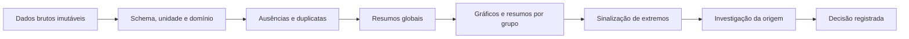
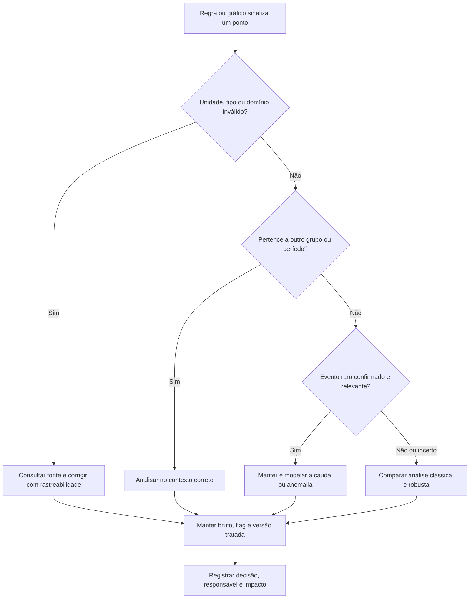

<!-- mirandastech-aula-v2 -->

# Aula 11 — Estatística descritiva, robustez e outliers

> **Bloco B — Estatística aplicada a dados reais**  
> Tempo estimado: 90–120 minutos · Prática: 45–60 minutos

[](https://colab.research.google.com/github/joaopaulomirandamatias/ai-lab/blob/main/02-statistics/notebooks/11-descritiva-robustez-outliers-laboratorio.ipynb)

## O problema: um número estranho pode mudar a história

Uma equipe monitora a massa corporal de pinguins. Cinco medições, em gramas, são
\(98, 99, 100, 101, 102\) depois de uma reescala didática. A média e a mediana são
100. Ao anexar por engano o valor 1.000, a média sobe para 250, enquanto a mediana
vai apenas para 100,5.

Qual resumo descreve melhor os dados? A pergunta está incompleta. Antes, precisamos
saber se 1.000 é:

- um erro de digitação ou de unidade;
- uma observação legítima de outro grupo;
- um evento raro, mas real;
- sinal de mudança no processo;
- ou uma tentativa de fraude.

Estatística descritiva não é apertar `describe()`. É construir uma representação
honesta dos dados, expor limitações e separar **sinalização** de **decisão**. Nesta
aula, faremos isso com o conjunto real Palmer Penguins. Uma corrupção sintética
será criada em uma cópia, sem alterar o arquivo bruto.

## Objetivos de aprendizagem

Ao final, você deverá conseguir:

1. calcular e interpretar média, mediana, média aparada, quantis, IQR, variância,
   desvio-padrão e MAD;
2. explicar por que robustez importa e em que situações uma medida clássica ainda é
   adequada;
3. construir histograma, função de distribuição empírica (ECDF) e boxplot;
4. sinalizar valores extremos com cercas de Tukey e escore z modificado, sem tratá-los
   automaticamente como erros;
5. investigar extremos por grupo, unidade, origem e tempo;
6. manter dados brutos imutáveis e registrar qualquer correção ou acomodação;
7. conectar EDA a pré-processamento, monitoramento e modelagem em IA/ML.

## Pré-requisitos e continuidade

Use os conceitos de esperança, variância e covariância da
[Aula 06](./06-esperanca-variancia-covariancia.md) e a distinção entre parâmetro e
estimativa. A [Aula 10](./10-lln-clt-monte-carlo.md) mostrou como estimativas variam
entre amostras; agora inspecionamos uma amostra observada antes de inferir ou modelar.

A próxima aula aprofundará **população, amostra, representatividade, vieses e data
leakage**. Aqui, mencionaremos separação treino/teste apenas como cuidado operacional.

## Vocabulário essencial

| Termo | Significado prático |
|---|---|
| Unidade observacional | O objeto representado por uma linha, como um pinguim. |
| Variável | Uma característica medida, como massa corporal. |
| Estatística | Número calculado na amostra, como a média amostral. |
| Quantil | Valor abaixo do qual está uma proporção especificada dos dados. |
| Outlier | Observação que se afasta marcadamente do restante sob um contexto definido. |
| Valor influente | Observação que altera de forma relevante uma estimativa ou decisão. |
| Robustez | Estabilidade de um método diante de pequenas contaminações ou desvios do modelo. |
| MAD | Mediana dos desvios absolutos em relação à mediana. |
| ECDF | Distribuição acumulada construída diretamente da amostra. |
| Winsorização | Substituição de extremos por limites escolhidos, sem remover linhas. |
| Proveniência | Origem, coleta e transformações pelas quais o dado passou. |

**Outlier e erro não são sinônimos.** Um valor pode ser extremo e correto; também
pode estar no centro da distribuição e ser incorreto.

## 1. Antes de resumir: audite o dado

Uma média impecavelmente calculada sobre a coluna errada continua errada. Comece por:

1. identificar a unidade observacional e a granularidade;
2. confirmar nomes, tipos e unidades das variáveis;
3. contar ausências e duplicatas;
4. verificar domínios possíveis, como massa positiva;
5. examinar categorias, períodos, equipamentos e grupos;
6. preservar a tabela original e documentar transformações.



No Palmer Penguins há 344 linhas e oito variáveis. Duas massas estão ausentes; logo,
os resumos de massa usam \(n=342\), não 344. Essa diferença precisa acompanhar o
resultado.

## 2. Medidas de posição

### 2.1 Média aritmética

Para \(n\) observações \(x_1,\ldots,x_n\),

\[
\bar{x}=\frac{1}{n}\sum_{i=1}^{n}x_i.
\]

A média usa toda a magnitude dos valores. Isso é útil em modelos aditivos e, sob
hipóteses adequadas, oferece boa eficiência. A mesma propriedade a torna sensível:
um único valor arbitrariamente grande pode deslocá-la sem limite.

### 2.2 Mediana

Após ordenar os dados, a mediana é o valor central; com \(n\) par, é a média dos dois
centrais. Ela depende da ordem, não da distância dos extremos. Por isso resiste a
contaminações que destroem a média.

No conjunto de massas:

- média: \(4.201{,}75\) g;
- mediana: \(4.050\) g.

A diferença não prova erro. A mistura de espécies com massas distintas já produz
assimetria e múltiplos agrupamentos.

### 2.3 Média aparada

A média aparada em proporção \(\alpha\) remove \(\alpha\) dos menores e \(\alpha\)
dos maiores valores antes de calcular a média. Com 10% em cada cauda, ela cria um
compromisso entre eficiência e resistência.

Ela não deve substituir uma política de qualidade. Aparar silenciosamente pode
ocultar um incidente real.

## 3. Medidas de dispersão

Duas amostras podem ter o mesmo centro e comportamentos completamente diferentes.

### 3.1 Variância e desvio-padrão amostrais

\[
s^2=\frac{1}{n-1}\sum_{i=1}^{n}(x_i-\bar{x})^2,
\qquad
s=\sqrt{s^2}.
\]

O quadrado amplifica grandes desvios. Para as massas, \(s=801{,}95\) g. O
denominador \(n-1\) é a convenção do estimador amostral; em NumPy, isso corresponde
a `ddof=1`.

### 3.2 Amplitude interquartil

Se \(Q_1\) e \(Q_3\) são os quantis de 25% e 75%,

\[
IQR=Q_3-Q_1.
\]

A metade central das massas vai de 3.550 g a 4.750 g; portanto,
\(IQR=1.200\) g. Extremos não entram diretamente nesse cálculo.

### 3.3 Desvio absoluto mediano

\[
MAD=\operatorname{mediana}_i\left|x_i-\tilde{x}\right|,
\]

em que \(\tilde{x}\) é a mediana. Para as massas, o MAD bruto é 600 g.

A SciPy oferece dois resultados diferentes:

- `scale=1`: MAD bruto, usado na fórmula do escore z modificado;
- `scale="normal"`: divide por aproximadamente 0,67449, produzindo 889,56 g,
  estimativa comparável ao desvio-padrão sob normalidade.

Declarar a escala evita um erro silencioso muito comum.

## 4. Qual medida escolher?

| Necessidade | Centro | Dispersão | Observação |
|---|---|---|---|
| Dados aproximadamente simétricos e limpos | Média | Desvio-padrão | Usa bem toda a informação. |
| Caudas longas ou contaminação | Mediana | IQR ou MAD | Resiste a extremos. |
| Compromisso | Média aparada | Dispersão robusta | Declare a proporção aparada. |
| Meta operacional, como latência | Mediana e p90/p95/p99 | Intervalos de quantis | A média esconde caudas. |
| Comparação entre grupos | Mesma família por grupo | Mesma família por grupo | Evita confundir composição com anomalia. |

Uma medida robusta não é automaticamente “melhor”. Sob um modelo normal bem
especificado e sem contaminação, a média costuma ser mais eficiente. A mediana tem
ponto de ruptura próximo de 50%: quase metade dos dados precisa ser contaminada para
empurrá-la arbitrariamente. O ponto de ruptura da média tende a zero à medida que
\(n\) cresce: uma observação extrema basta.

## 5. Quantis e resumo de cinco números

O resumo de cinco números contém mínimo, \(Q_1\), mediana, \(Q_3\) e máximo.
Quantis respondem perguntas operacionais:

- p50: experiência típica;
- p95: limite abaixo do qual ficam 95% das observações;
- p99: cauda rara, importante em latência e risco.

Em amostras finitas, bibliotecas oferecem diferentes métodos de interpolação. Registre
versão e método quando o valor for requisito de auditoria. No laboratório usamos o
padrão explícito `method="linear"` do NumPy.

## 6. Gráficos que se complementam

### Histograma

Divide o eixo em intervalos e conta observações. É intuitivo, mas sua aparência muda
com as bordas e a largura das classes. A regra de Freedman–Diaconis propõe

\[
h=2\,IQR\,n^{-1/3},
\]

desde que \(IQR>0\). Para as massas, \(h\approx343{,}19\) g, resultando em 11 classes
ao cobrir a amplitude observada.

### ECDF

A função de distribuição empírica é

\[
\widehat F_n(x)=\frac{1}{n}\sum_{i=1}^{n}\mathbf{1}(x_i\le x).
\]

Ela mostra todos os dados sem escolher classes. Para ler o p90, procure a altura 0,90
e veja o valor correspondente no eixo horizontal.

### Boxplot

Representa mediana, quartis e “bigodes”. Na convenção de Tukey, pontos fora de

\[
[Q_1-1{,}5\,IQR,\;Q_3+1{,}5\,IQR]
\]

são **sinalizados**, não condenados. Para a massa global dos pinguins, as cercas são
1.750 g e 6.550 g; nenhuma observação original está fora delas.

Use os três gráficos juntos. Um histograma revela forma; a ECDF facilita quantis; o
boxplot compara grupos de modo compacto.

## 7. Sinalizar não é decidir

### 7.1 Cercas de Tukey

São simples, robustas e úteis para triagem. Não representam um teste universal e
podem marcar muitos pontos em distribuições assimétricas ou de cauda longa.

### 7.2 Escore z clássico e modificado

O escore z clássico usa média e desvio-padrão:

\[
z_i=\frac{x_i-\bar{x}}{s}.
\]

O próprio extremo infla \(\bar{x}\) e \(s\), podendo mascarar-se. O escore modificado
usa mediana e MAD bruto:

\[
M_i=\frac{0{,}6745(x_i-\tilde{x})}{MAD}.
\]

A regra \(|M_i|>3{,}5\), proposta como sinalização, é uma heurística. Se
\(MAD=0\), a divisão não é definida: investigue empates, precisão e use um método
compatível com o domínio.

### 7.3 O experimento controlado

No laboratório, o maior valor original, 6.300 g, é substituído por 63.000 g **em uma
cópia sintética**. O resultado:

| Estatística | Dados originais | Cópia corrompida |
|---|---:|---:|
| Média | 4.201,75 g | 4.367,54 g |
| Mediana | 4.050 g | 4.050 g |
| Desvio-padrão | 801,95 g | 3.277,37 g |
| IQR | 1.200 g | 1.200 g |
| MAD bruto | 600 g | 600 g |
| Média aparada 10% | 4.154,01 g | 4.154,01 g |

A estabilidade das medidas robustas não torna 63.000 aceitável. Ela permite continuar
descrevendo a maioria dos dados enquanto a origem é investigada.

## 8. Contexto de grupo muda a interpretação

A massa média por espécie é aproximadamente:

| Espécie | \(n\) | Média (g) | Mediana (g) |
|---|---:|---:|---:|
| Adelie | 151 | 3.700,66 | 3.700 |
| Chinstrap | 68 | 3.733,09 | 3.700 |
| Gentoo | 123 | 5.076,02 | 5.000 |

Um Gentoo pesado pode parecer extremo em relação ao conjunto de Adelie e ainda ser
perfeitamente comum em seu grupo. Antes de agir, inspecione variáveis de contexto:
espécie, sexo, equipamento, lote, local e tempo. Porém, não fragmente grupos até
“explicar” qualquer valor; a divisão precisa ter justificativa do domínio e tamanho
suficiente.

## 9. Fluxo responsável para valores extremos



Opções possíveis incluem corrigir um erro verificável, colocar em quarentena, manter
com uma flag, transformar com justificativa, usar perda/modelo robusto ou winsorizar
uma visão derivada. **Excluir é uma decisão de domínio**, não uma consequência
automática do boxplot.

## 10. Conexões com IA e machine learning

- **Escalonamento:** StandardScaler usa média e desvio-padrão; RobustScaler usa
  mediana e IQR. Qualquer transformador deve ser ajustado somente nos dados de treino.
- **Função de perda:** erro quadrático dá peso crescente a resíduos extremos; erro
  absoluto cresce linearmente.
- **Detecção de fraude:** o “outlier” pode ser exatamente o sinal procurado. Removê-lo
  destrói o alvo.
- **Sensores e drift:** uma cauda nova pode indicar defeito, mudança ambiental ou
  mudança legítima do processo.
- **Classificação por grupo:** composição diferente entre espécies, regiões ou perfis
  pode deslocar resumos globais sem que o comportamento dentro dos grupos mude.
- **LLMs:** comprimentos de prompts e latências têm caudas; p95 e p99 são mais úteis
  para capacidade do que apenas a média.

A regra operacional é: ajuste limiares e transformações no conjunto de treino e
aplique-os sem recalcular em validação ou teste. A justificativa estatística dessa
separação aparece na Aula 12.

## 11. Erros comuns

1. **Remover todo ponto do boxplot.** A cerca apenas sinaliza candidatos.
2. **Analisar somente a média.** Forma, caudas, grupos e ausências ficam escondidos.
3. **Confundir MAD bruto com MAD escalado.** Declare a convenção.
4. **Usar z-score clássico em dados contaminados.** O extremo altera o próprio
   centro e a escala.
5. **Ignorar unidades.** 6,3 kg, 6.300 g e 63.000 g não são equivalentes.
6. **Sobrescrever o arquivo original.** Sem linhagem, a correção não é auditável.
7. **Escolher classes do histograma para confirmar uma narrativa.** Mostre ECDF e
   documente a regra.
8. **Misturar grupos.** Uma distribuição multimodal pode ser composição, não ruído.
9. **Calcular limiares com teste ou produção.** Isso antecipa data leakage.
10. **Tratar robustez como licença para não investigar.** Estabilidade não valida o
    dado.

## 12. Laboratório reproduzível

O [notebook da Aula 11](../notebooks/11-descritiva-robustez-outliers-laboratorio.ipynb)
usa Python, NumPy, pandas, SciPy e Matplotlib. Ele:

- carrega o CSV local e, no Colab, usa um fallback estável do repositório;
- valida 344 linhas, schema, ausências e domínios básicos;
- calcula resumos clássicos, robustos e por espécie;
- constrói histogramas, ECDFs e boxplots acessíveis;
- cria uma cópia com corrupção sintética e preserva o original;
- aplica cercas de Tukey e escore z modificado;
- demonstra o impacto no escalonamento;
- executa asserções sobre resultados esperados.

O conjunto usado está versionado em
[`datasets/11-palmer-penguins.csv`](../datasets/11-palmer-penguins.csv).
Se você não puder executar o notebook, reproduza o núcleo com:

```python
import pandas as pd
from scipy import stats

df = pd.read_csv("../datasets/11-palmer-penguins.csv", na_values="NA")
x = df["body_mass_g"].dropna()

resumo = {
    "n": x.size,
    "media": x.mean(),
    "mediana": x.median(),
    "desvio_padrao_amostral": x.std(ddof=1),
    "iqr": stats.iqr(x),
    "mad_bruto": stats.median_abs_deviation(x, scale=1),
}
print(resumo)
```

Saída principal esperada: \(n=342\), média \(4.201{,}7544\), mediana 4.050,
desvio-padrão \(801{,}9545\), IQR 1.200 e MAD bruto 600.

## 13. Checklist prático de EDA robusta

- [ ] Defini unidade observacional, período, origem e unidade de medida.
- [ ] Preservei dados brutos e criei uma versão derivada.
- [ ] Reportei \(n\) válido e ausências por variável.
- [ ] Comparei média/DP com mediana/IQR ou MAD.
- [ ] Usei pelo menos dois gráficos complementares.
- [ ] Examinei grupos e tempo antes de chamar algo de anomalia.
- [ ] Tratei regras de outlier como sinalização.
- [ ] Consultei domínio ou fonte antes de corrigir/excluir.
- [ ] Registrei limiar, método, versão e impacto da decisão.
- [ ] Evitei ajustar transformações fora do treino.

## 14. Exercícios

1. Para \(x=[2,3,3,4,18]\), calcule média e mediana. Qual muda menos se 18 virar 180?
2. Para \(Q_1=10\) e \(Q_3=18\), encontre as cercas de Tukey.
3. Se a mediana é 50, o MAD bruto é 4 e \(x_i=70\), calcule \(M_i\). A regra de 3,5
   sinaliza o ponto?
4. Por que um valor sinalizado em um boxplot não deve ser excluído automaticamente?
5. Em um serviço, as latências são 80, 82, 84, 86 e 900 ms. Que medidas você
   reportaria?
6. Um conjunto tem MAD igual a zero. O que isso significa para o z modificado?
7. No Palmer Penguins, por que a análise por espécie é importante?
8. Você recebeu uma massa de 63.000 g. Descreva uma decisão auditável.

### Respostas comentadas

1. Média \(=6\) e mediana \(=3\). Ao trocar 18 por 180, a média vira 38,4; a
   mediana permanece 3. A mediana é mais resistente, mas isso não decide se 180 é erro.
2. \(IQR=8\). Cercas: \(10-1{,}5(8)=-2\) e \(18+1{,}5(8)=30\).
3. \(M=0{,}6745(70-50)/4=3{,}3725\). Não ultrapassa 3,5. Um limiar não substitui
   contexto.
4. Porque a regra mede afastamento relativo à amostra; não verifica origem, unidade,
   distribuição, grupo ou significado científico.
5. Mediana 84 ms, IQR/quantis e p95/p99 se houver amostra suficiente, além da média
   com e sem investigação do 900. A cauda é operacionalmente relevante.
6. Pelo menos metade dos desvios em torno da mediana é zero, geralmente por muitos
   empates ou baixa precisão. A fórmula divide por zero; não force um resultado.
7. Espécies têm centros distintos. Misturá-las pode transformar diferença biológica
   legítima em aparente anomalia.
8. Preserve o bruto; confira unidade e registro de origem; compare com espécie,
   equipamento e período; crie uma flag; corrija apenas com evidência; mantenha
   versão, motivo, responsável e impacto.

## Resumo

- Centro e dispersão devem ser escolhidos conforme forma, contaminação e objetivo.
- Média e desvio-padrão são informativos, mas sensíveis a extremos.
- Mediana, IQR, MAD e média aparada fornecem visões robustas.
- Histograma, ECDF e boxplot respondem perguntas diferentes.
- Cercas de Tukey e escores z modificados **sinalizam**; não provam erro.
- Grupos, unidades, origem e tempo são parte da análise.
- Dados brutos permanecem imutáveis; decisões de tratamento precisam de rastreabilidade.

## Próxima aula

Na [Aula 12 — Amostragem, representatividade, viés e data leakage](./12-amostragem-vies-leakage.md),
passaremos da descrição da amostra para a pergunta decisiva: **de quem são esses dados
e para qual população queremos generalizar?**

## Referências técnicas

1. NIST/SEMATECH. [*e-Handbook of Statistical Methods — Detection of
   Outliers*](https://www.itl.nist.gov/div898/handbook/eda/section3/eda35h.htm).
2. SciPy. [`median_abs_deviation`](https://docs.scipy.org/doc/scipy/reference/generated/scipy.stats.median_abs_deviation.html)
   e [`iqr`](https://docs.scipy.org/doc/scipy/reference/generated/scipy.stats.iqr.html).
3. NumPy. [`numpy.quantile`](https://numpy.org/doc/stable/reference/generated/numpy.quantile.html).
4. pandas. [`DataFrame.describe`](https://pandas.pydata.org/docs/reference/api/pandas.DataFrame.describe.html).
5. Gorman, K. B.; Williams, T. D.; Fraser, W. R. (2014).
   [*Ecological Sexual Dimorphism and Environmental Variability within a Community
   of Antarctic Penguins (Genus Pygoscelis)*](https://doi.org/10.1371/journal.pone.0090081).
   PLOS ONE, 9(3), e90081.

## Dados e material complementar

- Horst, A. M.; Hill, A. P.; Gorman, K. B.
  [*palmerpenguins: Palmer Archipelago (Antarctica) penguin data*](https://allisonhorst.github.io/palmerpenguins/).
- Çetinkaya-Rundel, M.; Hardin, J.
  [*Introduction to Modern Statistics — OpenIntro*](https://www.openintro.org/book/ims/).

