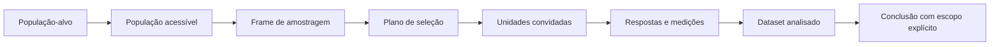
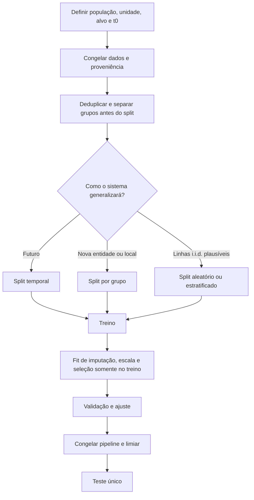

<!-- mirandastech-aula-v2 -->

# Aula 12 — Amostragem, viés, representatividade e data leakage

> **Bloco B — Estatística aplicada a dados reais**  
> Tempo estimado: 100–130 minutos · Prática: 50–70 minutos

[](https://colab.research.google.com/github/joaopaulomirandamatias/ai-lab/blob/main/02-statistics/notebooks/12-amostragem-vies-leakage-laboratorio.ipynb)

## O problema: 99% de acurácia pode não valer nada

Uma equipe treina um modelo para prever falhas em equipamentos. A avaliação mostra
99% de acurácia. Depois do deploy, o desempenho desaba. A investigação encontra três
problemas:

1. o dataset continha apenas equipamentos que permaneceram ativos — os retirados por
   falha haviam desaparecido do cadastro;
2. medições do mesmo equipamento estavam simultaneamente no treino e no teste;
3. uma variável registrada depois da falha foi usada para “prever” a própria falha.

O algoritmo calculou exatamente o que recebeu. O experimento, porém, não representava
o uso real.

Uma amostra não se torna representativa por ser grande, e um teste não se torna
independente por receber o nome `test`. Antes de modelar, precisamos definir **quem
queremos representar**, **como cada unidade entrou nos dados** e **qual informação
existiria no instante real da previsão**.

## Objetivos de aprendizagem

Ao final, você deverá conseguir:

1. distinguir população-alvo, população acessível, frame de amostragem, unidade e
   amostra;
2. separar variabilidade amostral de viés sistemático;
3. comparar amostragem aleatória simples, estratificada, por conglomerados e não
   probabilística;
4. reconhecer viés de cobertura/seleção, autoseleção, não resposta e sobrevivência;
5. usar probabilidades de inclusão ou proporções conhecidas para construir pesos,
   declarando as hipóteses;
6. escolher divisões aleatória, estratificada, temporal ou por grupos conforme a
   unidade de generalização;
7. identificar vazamento de alvo, temporal, de entidade, duplicatas e
   pré-processamento;
8. organizar treino, validação e teste de forma auditável.

## Pré-requisitos e continuidade

A [Aula 11](./11-descritiva-robustez-outliers.md) mostrou como descrever uma amostra
e investigar extremos sem apagar evidências. Agora perguntamos se essa amostra pode
sustentar a generalização desejada.

Na [Aula 13](./13-estimacao-likelihood-mle-map.md), estudaremos estimadores,
likelihood, MLE e MAP. Aqui, o foco é o **processo que produz os dados** e o desenho
da avaliação — não a derivação de estimadores nem intervalos de confiança.

## Vocabulário essencial

| Termo | Pergunta que responde |
|---|---|
| População-alvo | Para quais unidades, locais e períodos queremos concluir? |
| População acessível | Quais unidades poderiam de fato ser alcançadas? |
| Frame de amostragem | Qual lista ou mecanismo permite selecionar as unidades? |
| Unidade amostral | O que é sorteado: pessoa, dispositivo, hospital, sessão? |
| Parâmetro | Qual quantidade fixa da população queremos conhecer? |
| Estatística | Qual número foi calculado na amostra? |
| Probabilidade de inclusão \(\pi_i\) | Qual a chance de a unidade \(i\) entrar na amostra? |
| Peso amostral | Quanto uma unidade observada representa na população? |
| Representatividade | Adequação da amostra à população e ao uso declarados. |
| Data leakage | Uso, no treinamento ou seleção, de informação indisponível no uso real. |
| Instante de previsão | Momento exato em que as features estariam disponíveis. |
| Unidade de generalização | Nova linha, nova pessoa, novo dispositivo, novo local ou futuro? |

## 1. Do mundo à tabela

A cadeia correta é:



Cada seta pode excluir pessoas, dispositivos, locais ou períodos. Um cadastro
desatualizado cria erro de cobertura; uma pesquisa voluntária cria autoseleção; uma
pergunta mal formulada cria erro de medição. A tabela final raramente é uma janela
neutra para a população.

### Exemplo

Objetivo: estimar satisfação de todos os usuários ativos de um serviço no Brasil em
setembro.

- **População-alvo:** todos os usuários ativos no Brasil em setembro.
- **População acessível:** usuários com contato válido e consentimento.
- **Frame:** tabela de contatos elegíveis, congelada em uma data.
- **Unidade:** usuário, não clique nem sessão.
- **Amostra:** usuários selecionados pelo plano.
- **Respondentes:** subconjunto que respondeu.

Se apenas respondentes forem descritos, a conclusão não pode ser silenciosamente
ampliada para todos os usuários.

## 2. Variabilidade amostral não é viés

Duas amostras aleatórias da mesma população produzem estatísticas diferentes. Essa
**variabilidade amostral** diminui, em geral, quando \(n\) cresce.

**Viés** é um deslocamento sistemático provocado pelo mecanismo de inclusão,
medição, processamento ou análise. Se uma pesquisa online exclui sistematicamente
quem não tem acesso, coletar um milhão de respostas online reduz o ruído em torno da
resposta errada; não recupera quem ficou fora.

Em amostragem aleatória simples, cada subconjunto de tamanho \(n\) tem a mesma chance
de ser escolhido. Para a média amostral,

\[
\bar X=\frac{1}{n}\sum_{i=1}^{n}X_i,
\qquad
\mathbb E[\bar X]=\mu
\]

sob o desenho e as condições adequadas. A igualdade é uma propriedade do mecanismo
de amostragem, não uma garantia sobre qualquer arquivo disponível.

## 3. Planos de amostragem

| Plano | Como funciona | Quando ajuda | Cuidado principal |
|---|---|---|---|
| Aleatória simples | Sorteia unidades diretamente do frame. | Frame completo e população relativamente homogênea. | Pode gerar poucos casos de subgrupos raros. |
| Estratificada | Divide em estratos e sorteia dentro de cada um. | Garantir cobertura de regiões ou classes importantes. | Pesos são necessários se frações diferirem. |
| Por conglomerados | Sorteia grupos, como escolas, e observa unidades neles. | Reduzir custo logístico. | Unidades do mesmo grupo são correlacionadas. |
| Sistemática | Escolhe início aleatório e cada \(k\)-ésima unidade. | Frames ordenados sem padrão perigoso. | Periodicidade do frame pode criar viés. |
| Conveniência | Usa o que está disponível. | Exploração e protótipos limitados. | Probabilidade de inclusão é desconhecida. |
| Voluntária | Participantes escolhem responder. | Opiniões dos respondentes. | Forte risco de autoseleção. |

Amostragem estratificada não é o mesmo que `stratify=y` em um split de ML. A
primeira é um desenho para obter dados da população; a segunda preserva proporções
de classes entre subconjuntos de um dataset já coletado.

## 4. Pesos: o que uma linha representa

Se a unidade \(i\) tem probabilidade conhecida \(\pi_i>0\) de inclusão, o peso de
desenho é

\[
w_i=\frac{1}{\pi_i}.
\]

Uma forma normalizada de estimar a média é o estimador de razão de Hájek:

\[
\widehat{\mu}_w=
\frac{\sum_{i\in s}w_i y_i}{\sum_{i\in s}w_i}.
\]

Pesos podem corrigir desproporções **observadas e modeladas**. Eles não recriam
informação de grupos cuja probabilidade de inclusão é zero e não corrigem
automaticamente não resposta associada a variáveis não observadas. Pesos muito
desiguais também aumentam variância: ajuste não cria dados.

### Exemplo resolvido: cidade e interior

Suponha uma população com 60% no grupo urbano e 40% no rural. As satisfações médias
são 70% e 40%. O parâmetro populacional é

\[
\mu=0{,}60(0{,}70)+0{,}40(0{,}40)=0{,}58.
\]

Uma amostra de conveniência tem 90% urbanos e 10% rurais:

\[
\bar y_{\text{ingênua}}=0{,}90(0{,}70)+0{,}10(0{,}40)=0{,}67.
\]

Se as proporções populacionais forem confiáveis, a pós-estratificação recupera 0,58.
Mas a correção assume que, dentro de cada estrato, respondentes representam não
respondentes quanto ao desfecho relevante.

## 5. Famílias de viés

| Viés | Mecanismo | Exemplo | Mitigação |
|---|---|---|---|
| Cobertura/seleção | O frame deixa parte da população fora. | App mede mobilidade apenas de smartphones recentes. | Ampliar frame, combinar fontes, declarar escopo. |
| Autoseleção | Participação depende do interesse. | Só usuários muito satisfeitos ou irritados respondem. | Convite probabilístico, acompanhamento e análise de não resposta. |
| Não resposta | Selecionados não respondem de forma diferencial. | Turno noturno responde menos. | Recontato, múltiplos canais, pesos e sensibilidade. |
| Sobrevivência | Apenas casos que permaneceram são vistos. | Estudar confiabilidade só em máquinas ainda ativas. | Recuperar falhas, saídas e coortes completas. |
| Medição | Instrumento altera ou mede mal a variável. | Sensor satura em temperaturas altas. | Calibração, protocolo e validação contra referência. |
| Histórico | O período coletado não representa o futuro. | Modelo treinado antes de mudança regulatória. | Janela temporal explícita e monitoramento de drift. |

Viés de medição não é estritamente um viés de amostragem, mas afeta a
representatividade do fenômeno registrado. Um bom plano de seleção não salva uma
medida inválida.

## 6. O que “representativo” realmente significa

Representatividade exige uma frase completa:

> “Esta amostra é adequada para estimar **qual variável**, em **qual população**,
> **período** e **condição de uso**, sob **quais hipóteses**?”

Uma amostra pode representar idade e região e ainda falhar em renda, severidade da
doença ou tipo de dispositivo. Comparar marginais observadas é necessário, mas não
prova ausência de viés em variáveis não observadas.

Em ML, balancear classes para treinar pode ser útil, mas altera a prevalência. A
probabilidade prevista pode precisar de calibração para a população operacional. Um
dataset 50/50 não implica que o evento ocorra em 50% da produção.

## 7. Defina a unidade e o instante de previsão

Antes de criar features ou splits, escreva:

- unidade: usuário, pedido, paciente, máquina ou sessão;
- alvo: evento, horizonte e regra de rotulagem;
- instante \(t_0\): quando a predição será emitida;
- features permitidas: dados materializados até \(t_0\);
- latência: o que estará disponível online, não apenas no data warehouse;
- unidade de generalização: nova observação da mesma entidade, nova entidade, novo
  local ou período futuro.

Exemplo: “prever, na abertura do chamado, se ele excederá 24 horas”. `data_fechamento`,
`status_final` e texto da solução são posteriores ao instante \(t_0\); usá-los é
vazamento de alvo.

## 8. Tipos de data leakage

| Tipo | Como aparece | Por que engana |
|---|---|---|
| Vazamento de alvo | Feature é consequência ou proxy quase direto do alvo. | Entrega a resposta que não existirá em produção. |
| Contaminação treino–teste | Teste participa de `fit`, seleção ou imputação. | O teste influencia o modelo que deveria avaliar. |
| Temporal | Futuro ajuda a prever o passado ou split aleatório mistura eras. | Viola a ordem de disponibilidade. |
| Entidade/grupo | Mesma pessoa, dispositivo ou hospital aparece nos dois lados. | Modelo reconhece a entidade em vez de generalizar. |
| Duplicatas | Linha ou quase duplicata cruza o split. | Memorização parece generalização. |
| Feature engineering | Agregação usa toda a história, inclusive após \(t_0\). | Estatística “histórica” contém futuro. |
| Seleção de features | Variáveis escolhidas olhando todos os rótulos. | Informação do teste guia a escolha. |
| Benchmark | Teste público é consultado repetidamente. | O teste vira validação por decisões humanas. |

Leakage não exige copiar explicitamente o alvo. Um contador “número de contatos até
a resolução” pode codificar o desfecho sem ter o mesmo nome.

## 9. Treino, validação e teste têm papéis diferentes

- **Treino:** ajusta parâmetros e transformações.
- **Validação:** escolhe features, hiperparâmetros, limiar e versão.
- **Teste:** estima desempenho final uma vez, após congelar decisões.

Depois que o resultado do teste influencia uma mudança, esse conjunto deixou de ser
um teste intocado. É necessário novo teste ou validação externa.



## 10. Escolha o split pela pergunta

| Cenário real | Split apropriado | Verificação |
|---|---|---|
| Prever próximos meses | Temporal: passado → futuro | `max(treino) < min(validação) < min(teste)` |
| Generalizar a novos pacientes | Por paciente/grupo | Interseção de IDs vazia |
| Generalizar a novo hospital | Leave-one-group-out ou grupos | Hospital de teste ausente no treino |
| Classes raras em linhas independentes | Estratificado | Proporções semelhantes, sem quebrar grupos/tempo |
| Dados espaciais | Blocos geográficos | Distância suficiente entre áreas |
| Recomendação para usuários conhecidos | Temporal dentro do usuário | Nenhum evento futuro nas features |

`train_test_split(..., stratify=y)` não resolve dependência por grupos nem ordem
temporal. `GroupKFold` não resolve sozinho mudanças temporais. O desenho pode exigir
duas restrições simultâneas e código específico.

## 11. Pipelines evitam parte — não todo — do vazamento

Transformações que aprendem com dados têm estado:

- média e desvio do escalonamento;
- mediana da imputação;
- vocabulário e IDF de texto;
- categorias de encoding;
- componentes de PCA;
- features selecionadas;
- limiares de outliers.

A sequência segura é:

```python
from sklearn.pipeline import make_pipeline
from sklearn.impute import SimpleImputer
from sklearn.preprocessing import StandardScaler
from sklearn.linear_model import LogisticRegression

pipeline = make_pipeline(
    SimpleImputer(strategy="median"),
    StandardScaler(),
    LogisticRegression(random_state=20260907),
)
pipeline.fit(X_train, y_train)
score = pipeline.score(X_test, y_test)
```

O pipeline faz `fit` apenas no conjunto entregue ao treinamento. Ainda cabe à equipe
criar o split correto, remover features pós-desfecho e impedir grupos compartilhados.

## 12. Exemplos de falhas silenciosas

### Pacientes repetidos

Há dez consultas por paciente. Um split por linha coloca consultas da mesma pessoa
nos dois lados. Um modelo memoriza padrões individuais. Se o objetivo é atender
novos pacientes, o split deve ser por `patient_id`.

### Séries temporais

Um modelo de demanda treinado com meses futuros e testado em meses antigos não
simula produção. Use blocos ordenados e, se features usam janelas, considere uma
lacuna entre treino e avaliação para impedir sobreposição.

### Imputação global

Calcular a mediana antes do split deixa o teste influenciar o valor usado no treino.
A diferença pode ser pequena, mas o protocolo já foi violado. Faça o split primeiro
e inclua o imputador no pipeline.

## 13. O que tamanho de amostra não resolve

Aumentar \(n\):

- reduz variabilidade sob um desenho adequado;
- não inclui quem tem probabilidade zero;
- não corrige rótulos errados;
- não elimina vazamento;
- não garante diversidade nos subgrupos;
- não torna um período antigo representativo do futuro.

Em termos de erro quadrático médio,

\[
MSE(\widehat\theta)
=
\operatorname{Var}(\widehat\theta)
+
\operatorname{Bias}(\widehat\theta)^2.
\]

Mais dados podem reduzir o primeiro termo e deixar o segundo praticamente intacto.

## 14. Conexões com IA e sistemas reais

- **Visão computacional:** quadros consecutivos do mesmo vídeo não devem cruzar o
  split se o objetivo é generalizar para novos vídeos.
- **Saúde:** múltiplos exames do mesmo paciente exigem split por paciente.
- **Fraude:** amostras negativas podem conter transações ainda não investigadas;
  atraso de rótulo precisa entrar no desenho.
- **LLMs e RAG:** documentos do benchmark não podem aparecer no corpus de treino ou
  recuperação da avaliação.
- **Manutenção preditiva:** sensores da janela posterior à falha são vazamento.
- **Sistemas multiagentes:** traces da mesma execução, prompt ou template podem ser
  quase duplicatas; o split deve respeitar a unidade de tarefa.
- **Monitoramento:** queda em produção pode ser drift real ou diferença entre o frame
  de avaliação e a população atendida.

## 15. Armadilhas e erros comuns

1. Chamar amostra de “aleatória” porque foi usado `shuffle=True`.
2. Confundir grande volume com representatividade.
3. Ajustar pesos sem documentar fonte e validade das proporções.
4. Remover não respondentes da discussão.
5. Balancear classes e interpretar scores como probabilidades populacionais.
6. Fazer engenharia de features antes de fixar \(t_0\).
7. Compartilhar entidades, duplicatas ou janelas sobrepostas entre splits.
8. Ajustar scaler, imputador, PCA ou seleção usando o dataset inteiro.
9. consultar o teste repetidamente durante desenvolvimento;
10. usar acurácia alta como prova de ausência de leakage.

## 16. Laboratório reproduzível

O [notebook da Aula 12](../notebooks/12-amostragem-vies-leakage-laboratorio.ipynb)
usa populações sintéticas porque assim conhecemos a verdade e o mecanismo gerador.

Ele demonstra:

1. amostra aleatória simples versus amostra com 90% de um estrato;
2. correção por pós-estratificação e o custo de pesos desiguais;
3. repetição do experimento para separar viés de variabilidade;
4. split aleatório versus temporal sob drift;
5. vazamento de uma feature pós-desfecho;
6. vazamento de entidade com observações repetidas;
7. pipeline ajustado apenas no treino;
8. testes automatizados de não sobreposição de tempo e grupos.

Dependências: Python 3.10+, NumPy, pandas, SciPy, Matplotlib e scikit-learn. Seed fixa:
`20260907`.

## 17. Checklist antes de confiar na métrica

- [ ] Declarei população, período, unidade e uso-alvo.
- [ ] Documentei frame, elegibilidade e mecanismo de inclusão.
- [ ] Medi cobertura, resposta e perdas em cada etapa.
- [ ] Comparei amostra e referências relevantes por subgrupo.
- [ ] Registrei pesos, sua origem e hipóteses.
- [ ] Defini alvo, horizonte e instante \(t_0\) antes das features.
- [ ] Escolhi o split segundo tempo, grupo, espaço e duplicatas.
- [ ] Garanti interseção vazia de entidades quando necessário.
- [ ] Fiz `fit` de todo pré-processamento apenas no treino.
- [ ] Usei validação para decisões e preservei o teste final.
- [ ] Testei explicitamente colunas pós-desfecho e agregações futuras.
- [ ] Versionei dados, código, seed e relatório de splits.
- [ ] Escrevi o que o resultado não permite generalizar.

## 18. Exercícios

1. Uma pesquisa sobre transporte coleta respostas apenas por aplicativo. Qual é a
   população efetivamente acessível e qual viés pode surgir?
2. Uma população tem 30% do grupo A e 70% do B. A amostra tem 60% de A e 40% de B.
   As médias são 80 e 50. Calcule a média ingênua e a
   pós-estratificada.
3. Por que aumentar uma amostra voluntária de 10 mil para 1 milhão pode não corrigir
   a estimativa?
4. Você prevê reinternação no momento da alta. A coluna `dias_ate_reinternacao` pode
   ser feature? Por quê?
5. Cada paciente tem cinco exames. Qual split usar para novos pacientes?
6. Em uma série mensal, o treino termina em junho, validação vai de julho a setembro
   e teste de outubro a dezembro. Escreva duas asserções temporais.
7. Por que `StandardScaler().fit(X_completo)` antes do split é leakage?
8. Um modelo com uma feature pós-desfecho obtém AUC 1,0. Isso prova excelente
   generalização?
9. Em que situação um split estratificado por classe ainda está errado?
10. O que pesos não conseguem corrigir quando \(\pi_i=0\)?

### Respostas comentadas

1. Usuários com aparelho compatível, acesso e disposição para responder; pessoas fora
   do app ficam sem cobertura. A conclusão deve ser limitada ou o frame ampliado.
2. Ingênua: \(0{,}60(0{,}80)+0{,}40(0{,}50)=0{,}68\).
   Pós-estratificada: \(0{,}30(0{,}80)+0{,}70(0{,}50)=0{,}59\).
3. O volume reduz flutuação entre respondentes, mas mantém o mecanismo de
   autoseleção. A estimativa converge com precisão para a população dos respondentes.
4. Não. O valor só é conhecido depois que o desfecho ocorre e entrega diretamente
   informação sobre o alvo.
5. Split por `patient_id`, como `GroupShuffleSplit` ou `GroupKFold`, verificando
   interseção vazia.
6. `max(treino.data) < min(validacao.data)` e
   `max(validacao.data) < min(teste.data)`.
7. Média e escala aprendidas incluem o teste; portanto o conjunto de avaliação
   influenciou o pipeline. Faça o split e ajuste o scaler no treino.
8. Não. A métrica mede um cenário impossível. Remova features indisponíveis em
   \(t_0\), refaça o split e avalie novamente.
9. Quando linhas da mesma entidade cruzam os lados, quando há ordem temporal ou
   duplicatas. Preservar a classe não garante independência.
10. Não conseguem representar unidades estruturalmente ausentes. É necessário mudar
    o frame/coleta ou restringir o escopo da conclusão.

## Resumo

- A inferência começa na definição da população, não no estimador.
- Variabilidade aleatória e viés sistemático são problemas diferentes.
- Probabilidades de inclusão permitem pesos, mas a correção depende de hipóteses.
- Representatividade sempre é relativa a variável, população, período e uso.
- O split deve reproduzir a unidade de generalização do sistema real.
- Leakage pode vir do alvo, futuro, entidades, duplicatas ou pré-processamento.
- Treino ajusta; validação decide; teste confirma uma versão congelada.
- Uma métrica excelente em um desenho errado não valida o modelo.

## Próxima aula

Na [Aula 13 — Estimação, likelihood, MLE e MAP](./13-estimacao-likelihood-mle-map.md),
partiremos de uma amostra com desenho explícito para estudar como os dados informam
parâmetros e como MLE e MAP aparecem no treinamento de modelos.

## Referências técnicas

1. Çetinkaya-Rundel, M.; Hardin, J.
   [*Introduction to Modern Statistics*, 2ª ed.](https://www.openintro.org/book/ims/).
2. scikit-learn.
   [*Common pitfalls and recommended practices — Data leakage*](https://scikit-learn.org/stable/common_pitfalls.html#data-leakage).
3. scikit-learn.
   [*Cross-validation iterators for grouped data*](https://scikit-learn.org/stable/modules/cross_validation.html#cross-validation-iterators-for-grouped-data)
   e [*TimeSeriesSplit*](https://scikit-learn.org/stable/modules/generated/sklearn.model_selection.TimeSeriesSplit.html).
4. Kaufman, S.; Rosset, S.; Perlich, C.; Stitelman, O. (2012).
   [*Leakage in Data Mining: Formulation, Detection, and Avoidance*](https://doi.org/10.1145/2382577.2382579).
5. James, G.; Witten, D.; Hastie, T.; Tibshirani, R.; Taylor, J.
   [*An Introduction to Statistical Learning with Applications in Python*](https://www.statlearning.com/).

## Material complementar e padrões de transparência

- American Association for Public Opinion Research.
  [*Best Practices for Survey Research*](https://aapor.org/standards-and-ethics/best-practices/).
- Kapoor, S.; Narayanan, A. (2023).
  [*Leakage and the Reproducibility Crisis in Machine-Learning-Based Science*](https://arxiv.org/abs/2207.07048).
