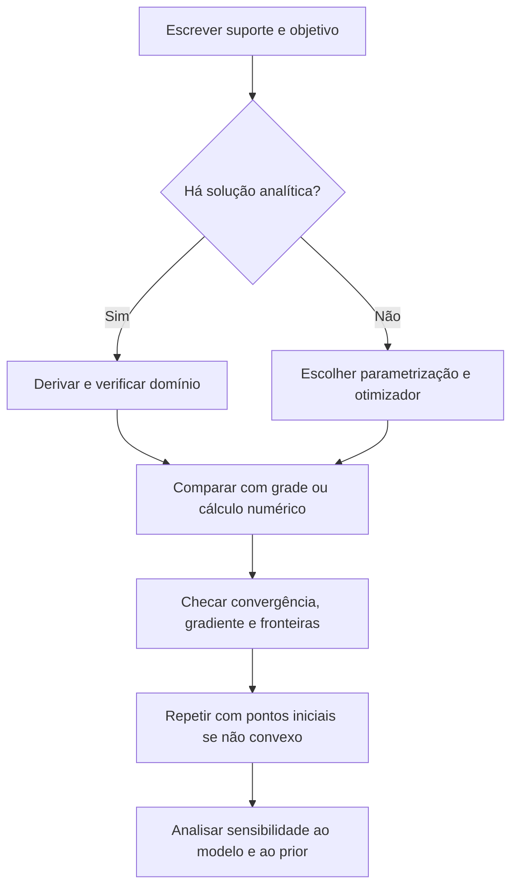

<!-- mirandastech-aula-v2 -->

# Aula 13 — Estimação, likelihood, MLE e MAP

> **Bloco B — Estatística aplicada a dados reais**  
> Tempo estimado: 100–130 minutos · Prática: 50–70 minutos

## O problema: qual probabilidade usar depois de 8 sucessos em 10 tentativas?

Um novo componente de IA acertou 8 de 10 casos. A taxa observada é 80%. Devemos
registrar que sua probabilidade de sucesso é exatamente 0,8?

Há pelo menos três respostas diferentes:

- **descrição:** nesta amostra, a proporção foi \(8/10=0{,}8\);
- **MLE:** sob um modelo Bernoulli independente, o valor de \(p\) que torna os dados
  observados mais plausíveis é 0,8;
- **MAP:** com uma distribuição a priori Beta(2,2), o valor mais provável da
  posterior é 0,75.

Nenhuma resposta conserta uma amostra enviesada. A Aula 12 mostrou que o processo de
coleta e o split vêm antes da estimação. Nesta aula, assumiremos que dados, unidade e
instante de observação já foram definidos para perguntar: **como transformar dados
em uma estimativa de parâmetros?**

## Objetivos de aprendizagem

Ao final, você deverá conseguir:

1. diferenciar estimando, parâmetro, estimador e estimativa;
2. avaliar um estimador por viés, variância, erro quadrático médio e consistência;
3. construir likelihood e log-likelihood a partir de um modelo probabilístico;
4. derivar o MLE da Bernoulli e interpretar soluções de fronteira;
5. explicar por que log-likelihood é numericamente e computacionalmente preferível;
6. combinar prior e likelihood para obter posterior e MAP;
7. distinguir MAP de média posterior e de MLE;
8. relacionar negative log-likelihood, cross-entropy e regularização ao treinamento
   de modelos de machine learning;
9. verificar otimização, identificabilidade e adequação do modelo antes de confiar
   no parâmetro estimado.

## Pré-requisitos e continuidade

Retome o [Teorema de Bayes da Aula 04](./04-bayes.md), o modelo Bernoulli da
[Aula 07](./07-bernoulli-binomial-categorical.md) e o desenho de dados da
[Aula 12](./12-amostragem-vies-leakage.md).

A [Aula 14](./14-intervalos-confianca.md) estudará a incerteza de estimativas e a
cobertura de procedimentos. Aqui, compararemos distribuições amostrais apenas para
entender propriedades de estimadores, sem antecipar intervalos em profundidade.

## Vocabulário essencial

| Termo | Significado |
|---|---|
| Estimando | Quantidade da população ou do modelo que queremos estimar. |
| Parâmetro \(\theta\) | Valor fixo e desconhecido que indexa o modelo. |
| Estimador \(\widehat\theta=T(X_1,\ldots,X_n)\) | Regra aleatória antes de observar os dados. |
| Estimativa | Número obtido ao aplicar o estimador à amostra observada. |
| Distribuição amostral | Distribuição do estimador em repetições do experimento. |
| Likelihood | Plausibilidade relativa dos valores de \(\theta\) com os dados fixados. |
| Log-likelihood | Logaritmo da likelihood; transforma produtos em somas. |
| Função escore | Gradiente da log-likelihood em relação ao parâmetro. |
| MLE | Valor que maximiza a likelihood. |
| Prior | Distribuição sobre o parâmetro antes dos dados atuais. |
| Posterior | Distribuição atualizada do parâmetro após observar os dados. |
| MAP | Moda da posterior. |
| Identificabilidade | Parâmetros distintos geram distribuições observáveis distintas. |

## 1. Parâmetro, estimador e estimativa não são sinônimos

Considere \(X_i\sim\operatorname{Bernoulli}(p)\):

- \(p\) é o parâmetro fixo e desconhecido;
- \(\widehat p=\frac{1}{n}\sum_i X_i\) é o estimador;
- se os dados são \(1,1,1,0,1,1,0,1,1,1\), a estimativa é 0,8;
- em uma nova amostra, a mesma regra produz outro número.

Essa distinção impede frases como “o parâmetro variou de 0,72 para 0,81” quando o que
variou foram estimativas. O parâmetro pode também mudar no tempo — drift —, mas isso
é outra hipótese e precisa ser modelada explicitamente.

## 2. Como avaliar um estimador

Um estimador não é bom apenas porque retorna um número plausível.

### Viés

\[
\operatorname{Bias}(\widehat\theta)
=
\mathbb E_\theta[\widehat\theta]-\theta.
\]

Um estimador é não viesado quando sua média em repetições coincide com o parâmetro.
Isso não garante que uma realização individual seja próxima.

### Variância

\[
\operatorname{Var}_\theta(\widehat\theta)
=
\mathbb E_\theta\left[
(\widehat\theta-\mathbb E_\theta[\widehat\theta])^2
\right].
\]

Baixa variância significa menor oscilação entre amostras do mesmo processo.

### Erro quadrático médio

\[
\operatorname{MSE}(\widehat\theta)
=
\mathbb E_\theta[(\widehat\theta-\theta)^2]
=
\operatorname{Var}(\widehat\theta)
+
\operatorname{Bias}(\widehat\theta)^2.
\]

Um pequeno viés pode ser aceitável se reduzir muito a variância. Regularização em ML
explora justamente esse compromisso.

### Consistência

Uma sequência de estimadores é consistente se, quando \(n\to\infty\),

\[
\widehat\theta_n \xrightarrow{P} \theta.
\]

Consistência é assintótica: não promete bom desempenho em \(n=10\). Também depende
de o modelo e o mecanismo de dados permanecerem adequados.

## 3. Da distribuição para a likelihood

Suponha um modelo \(p(x\mid\theta)\) e dados observados
\(\mathcal D=\{x_1,\ldots,x_n\}\). Se as observações são independentes condicionadas
a \(\theta\),

\[
L(\theta;\mathcal D)
=
p(\mathcal D\mid\theta)
=
\prod_{i=1}^{n}p(x_i\mid\theta).
\]

Na distribuição, \(\theta\) está fixo e os dados poderiam variar. Na likelihood, os
dados observados estão fixos e variamos \(\theta\). Em geral, \(L(\theta;\mathcal D)\)
**não é uma distribuição de probabilidade sobre \(\theta\)** e não precisa integrar
1. Para falar em probabilidade do parâmetro, é necessário um modelo bayesiano com
prior e posterior.

## 4. Exemplo resolvido: MLE da Bernoulli

Para \(x_i\in\{0,1\}\),

\[
p(x_i\mid p)=p^{x_i}(1-p)^{1-x_i}.
\]

Se \(s=\sum_i x_i\) é o número de sucessos, então

\[
L(p;\mathcal D)
=
p^s(1-p)^{n-s},
\qquad 0\le p\le 1.
\]

A log-likelihood é

\[
\ell(p)
=
s\log p+(n-s)\log(1-p).
\]

Para uma solução interior \(0<p<1\), derive e iguale a zero:

\[
\frac{d\ell}{dp}
=
\frac{s}{p}-\frac{n-s}{1-p}=0.
\]

Multiplicando por \(p(1-p)\),

\[
s(1-p)-(n-s)p=0
\Rightarrow s-np=0
\Rightarrow \widehat p_{\text{MLE}}=\frac{s}{n}.
\]

A segunda derivada é

\[
\frac{d^2\ell}{dp^2}
=
-\frac{s}{p^2}-\frac{n-s}{(1-p)^2}<0,
\]

logo o ponto interior é máximo. Para 8 sucessos em 10 tentativas,
\(\widehat p_{\text{MLE}}=0{,}8\).

### Soluções de fronteira

Se \(s=0\), o MLE é 0; se \(s=n\), é 1. A matemática está correta sob o modelo, mas
uma estimativa 1 após duas tentativas não significa certeza sobre a próxima. Esse é
um caso em que prior, regularização e relato de incerteza podem ser decisivos.

## 5. Por que usar log-likelihood

Produtos de muitas probabilidades ficam extremamente pequenos. Em ponto flutuante,

\[
\prod_i p(x_i\mid\theta)
\]

pode arredondar para zero mesmo quando cada fator é válido. Como o logaritmo é
estritamente crescente, maximizar \(L\) equivale a maximizar

\[
\ell(\theta)=\log L(\theta)=\sum_i\log p(x_i\mid\theta).
\]

Vantagens:

- produtos viram somas;
- derivadas ficam mais simples;
- mini-batches somam contribuições;
- rotinas oferecem funções estáveis como `logsumexp`, `logpdf` e `logpmf`;
- diferenças de log-likelihood continuam informativas quando produtos zeram.

Nunca calcule `log(0)` diretamente. Restrinja parâmetros ao suporte ou use funções
numéricas estáveis.

## 6. MLE nem sempre é não viesado

Considere \(X_i\sim\mathcal N(\mu,\sigma^2)\), com ambos desconhecidos. Os MLEs são

\[
\widehat\mu_{\text{MLE}}=\bar X,
\qquad
\widehat{\sigma^2}_{\text{MLE}}
=
\frac{1}{n}\sum_i(X_i-\bar X)^2.
\]

A média é não viesada para \(\mu\), mas

\[
\mathbb E[\widehat{\sigma^2}_{\text{MLE}}]
=
\frac{n-1}{n}\sigma^2.
\]

Por isso o estimador amostral usual divide por \(n-1\). O MLE otimiza um critério;
não recebe automaticamente todas as propriedades desejáveis em amostras finitas.

Outras cautelas:

- o MLE pode não existir ou não ser único;
- pode cair na fronteira;
- pode ser sensível a outliers e má especificação;
- bons resultados assintóticos não garantem uma amostra pequena;
- um ótimo numérico local pode não ser o ótimo global.

## 7. MAP: likelihood mais prior

Pelo Teorema de Bayes,

\[
p(\theta\mid\mathcal D)
=
\frac{p(\mathcal D\mid\theta)p(\theta)}
     {p(\mathcal D)}.
\]

Como a evidência \(p(\mathcal D)\) não depende de \(\theta\),

\[
\widehat\theta_{\text{MAP}}
=
\arg\max_\theta p(\theta\mid\mathcal D)
=
\arg\max_\theta
\left[
\log p(\mathcal D\mid\theta)+\log p(\theta)
\right].
\]

O prior não é um ajuste depois de ver o resultado. Deve representar conhecimento,
restrições ou regularização definidos de forma justificável, com análise de
sensibilidade.

## 8. Exemplo resolvido: Beta–Bernoulli

Escolha o prior conjugado

\[
p\sim\operatorname{Beta}(\alpha,\beta),
\qquad
p(p)\propto p^{\alpha-1}(1-p)^{\beta-1}.
\]

Após \(s\) sucessos em \(n\) tentativas,

\[
p\mid\mathcal D
\sim
\operatorname{Beta}(\alpha+s,\beta+n-s).
\]

Quando os parâmetros posteriores são maiores que 1, a moda é

\[
\widehat p_{\text{MAP}}
=
\frac{\alpha+s-1}
     {\alpha+\beta+n-2}.
\]

Com \(s=8\), \(n=10\) e prior Beta(2,2):

\[
\widehat p_{\text{MAP}}
=
\frac{2+8-1}{2+2+10-2}
=
\frac{9}{12}
=
0{,}75.
\]

A média posterior é outra decisão-resumo:

\[
\mathbb E[p\mid\mathcal D]
=
\frac{\alpha+s}{\alpha+\beta+n}
=
\frac{10}{14}
\approx0{,}7143.
\]

Portanto, **MAP não é média posterior**. A moda pode até ficar na fronteira ou não
ser única quando os parâmetros Beta são menores ou iguais a 1; a fórmula interior
não deve ser aplicada cegamente.

### Intuição de pseudocontagens

Na expressão do MAP, Beta(\(\alpha,\beta\)) contribui como
\(\alpha-1\) sucessos e \(\beta-1\) falhas. É uma intuição útil, não uma licença
para inventar evidência. A força do prior precisa ser compatível com sua origem.

## 9. MLE e MAP lado a lado

| Aspecto | MLE | MAP |
|---|---|---|
| Objetivo | Maximiza likelihood | Maximiza posterior |
| Usa dados | Sim | Sim |
| Usa prior | Não | Sim |
| Amostra grande | Prior tende a perder influência sob condições regulares | Frequentemente se aproxima do MLE |
| Amostra pequena | Pode cair em extremos | Pode estabilizar ou dominar |
| Incerteza completa | Não | Não; é apenas um ponto da posterior |
| Regularização | Precisa ser adicionada ao objetivo | Surge como log-prior |
| Sensibilidade | Ao modelo e aos dados | Ao modelo, dados e prior |

MAP é um estimador pontual bayesiano. Se a pergunta exige incerteza da posterior ou
uma decisão sob função de perda, conservar toda a posterior pode ser mais apropriado.

## 10. MLE, negative log-likelihood e cross-entropy

Para classificação binária, um modelo produz \(q_i=P(Y_i=1\mid x_i,w)\). A
negative log-likelihood média é

\[
\operatorname{NLL}(w)
=
-\frac{1}{n}\sum_{i=1}^{n}
\left[
y_i\log q_i+(1-y_i)\log(1-q_i)
\right].
\]

Essa expressão é a binary cross-entropy. Assim, minimizar cross-entropy equivale a
maximizar a likelihood condicional Bernoulli sob o modelo. Isso não prova que o
modelo esteja bem calibrado, causal ou representativo; apenas identifica o objetivo
otimizado.

Para classes múltiplas, a mesma ideia usa a distribuição categorical e a
cross-entropy softmax. A Aula 22 retomará a interpretação em teoria da informação.

## 11. MAP como regularização

Se os pesos \(w\) têm prior gaussiano isotrópico,

\[
w\sim\mathcal N(0,\tau^2I),
\]

então o negativo do log-prior, ignorando constantes, é

\[
-\log p(w)=\frac{1}{2\tau^2}\lVert w\rVert_2^2.
\]

Logo o MAP minimiza

\[
\operatorname{NLL}(w)
+
\frac{1}{2\tau^2}\lVert w\rVert_2^2,
\]

a forma de regularização L2. Um prior Laplace leva a penalização L1. O valor da
penalização depende da escala usada para a NLL — soma ou média —, então compare
implementações antes de traduzir \(\tau\) para um hiperparâmetro de biblioteca.

Regularização pode melhorar erro preditivo reduzindo variância, mas introduz viés.
Ela não corrige leakage, amostragem ruim ou um alvo mal definido.

## 12. Otimização: derivar quando possível, verificar sempre

Checklist técnico:

- use limites ou transformações para respeitar o suporte;
- calcule log-likelihood, não produtos frágeis;
- verifique `success`, mensagem e gradiente do otimizador;
- compare solução analítica e numérica quando possível;
- trace a função objetivo em problemas unidimensionais;
- teste múltiplos pontos iniciais em objetivos não convexos;
- não arredonde durante a otimização;
- fixe seed apenas para partes aleatórias; a seed não cura instabilidade numérica.

## 13. Identificabilidade e má especificação

Se valores diferentes de \(\theta\) produzem exatamente a mesma distribuição dos
dados observáveis, o parâmetro não é identificável. A likelihood terá uma crista ou
múltiplos máximos equivalentes. Mais iterações do otimizador não criam informação.

Mesmo com identificabilidade, o modelo pode estar errado:

- Bernoulli independente ignora dependência entre tentativas;
- normal pode ser inadequada para caudas ou assimetria;
- parâmetros constantes ignoram drift;
- dados ausentes podem depender do próprio valor não observado.

O MLE escolhe o melhor parâmetro **dentro do modelo proposto**. Ele não certifica que
o modelo representa o processo real.

## 14. Conexões com IA e sistemas modernos

- **Regressão logística:** treinamento sem penalização maximiza likelihood
  condicional; L2 pode ser interpretada como MAP gaussiano.
- **Redes neurais:** cross-entropy é NLL sob Bernoulli/categorical, mas a superfície
  em parâmetros é não convexa e pode ter muitas simetrias.
- **Modelos de linguagem:** minimizar NLL dos próximos tokens equivale a maximizar a
  likelihood condicional da sequência fatorada.
- **Visão computacional:** MSE pode ser interpretado como NLL gaussiana com variância
  fixa, uma hipótese que nem sempre corresponde à percepção humana.
- **Aprendizado online:** estimativas precisam ser atualizadas quando a distribuição
  muda; acumular todos os dados pode esconder drift.
- **Sistemas multiagentes:** taxas de sucesso por ferramenta ou rota podem receber
  priors hierárquicos para evitar decisões extremas com poucos traces.
- **MLOps:** registre modelo probabilístico, objetivo, normalização por lote,
  penalização, seed, versão dos dados e status de convergência.

## 15. Armadilhas e erros comuns

1. Dizer que a likelihood é \(P(\theta\mid\mathcal D)\).
2. Trocar parâmetro, estimador e estimativa na interpretação.
3. Multiplicar milhares de probabilidades em vez de somar logs.
4. Ignorar soluções de fronteira e `log(0)`.
5. Supor que todo MLE é não viesado.
6. Aplicar a fórmula interior do MAP Beta quando seus parâmetros não permitem moda
   interior.
7. Chamar MAP de “média bayesiana”.
8. Escolher prior depois de olhar os dados sem declarar análise exploratória.
9. Comparar penalizações sem verificar se a loss é soma ou média.
10. aceitar o valor retornado sem verificar convergência;
11. interpretar regularização como correção de leakage;
12. assumir que o melhor ajuste implica modelo verdadeiro.

## 16. Laboratório reproduzível

O [notebook da Aula 13](../notebooks/13-estimacao-likelihood-mle-map-laboratorio.ipynb)
usa Python, NumPy, SciPy e Matplotlib, com seed `20260907`. Ele:

1. deriva e confirma o MLE Bernoulli por grade e otimização;
2. visualiza likelihood, log-likelihood, prior e posterior;
3. compara MLE, MAP e média posterior;
4. mostra underflow no produto e estabilidade da soma de logs;
5. simula viés, variância e consistência da proporção amostral;
6. demonstra o viés do MLE da variância normal;
7. ajusta regressão logística por NLL;
8. adiciona prior gaussiano e mostra o encolhimento MAP;
9. executa asserções matemáticas e numéricas.

Dependências explícitas: Python 3.10+, NumPy, pandas, SciPy, Matplotlib e
scikit-learn.

## 17. Checklist prático

- [ ] Defini estimando, população e unidade antes do modelo.
- [ ] Escrevi suporte e hipóteses de \(p(x\mid\theta)\).
- [ ] Distingui função de probabilidade e likelihood.
- [ ] Usei log-likelihood e funções numericamente estáveis.
- [ ] Verifiquei solução analítica, domínio e fronteiras.
- [ ] Reportei viés/variância conhecidos ou limitações em amostra pequena.
- [ ] Se usei MAP, documentei prior e análise de sensibilidade.
- [ ] Não confundi MAP com média posterior.
- [ ] Verifiquei convergência e múltiplas inicializações quando necessário.
- [ ] Testei adequação do modelo e possíveis não identificabilidades.
- [ ] Mantive treino, validação e teste conforme a Aula 12.
- [ ] Registrei dados, código, seed e versões das dependências.
- [ ] Evitei afirmações causais ou certeza não sustentadas.

## 18. Exercícios

1. Em 20 tentativas, ocorreram 14 sucessos. Encontre o MLE de \(p\).
2. Escreva a likelihood Bernoulli para dados \(1,0,1,1,0\).
3. Por que \(L(p;\mathcal D)\) não é, por si só, a probabilidade de \(p\)?
4. Derive o MLE de \(p\) quando há \(s\) sucessos em \(n\) tentativas.
5. Para \(s=0,n=3\), qual é o MLE? Qual cautela interpretativa surge?
6. Com \(s=14,n=20\) e prior Beta(2,2), calcule o MAP e a média posterior.
7. Se \(n=5\) e \(\sigma^2=4\), qual o valor esperado do MLE da variância?
8. Qual prior sobre pesos produz regularização L2 no MAP?
9. Um otimizador retorna `success=False` e um número plausível. O que fazer?
10. Um modelo tem ótima NLL no treino e piora no teste temporal. O MLE “falhou”?

### Respostas comentadas

1. \(\widehat p=14/20=0{,}7\).
2. Há \(s=3\) e \(n-s=2\): \(L(p)=p^3(1-p)^2\).
3. Porque os dados estão fixos e a função mede plausibilidade relativa ao variar
   \(p\); ela não é normalizada sobre o parâmetro. Uma posterior exige prior.
4. \(\ell=s\log p+(n-s)\log(1-p)\); igualando
   \(s/p-(n-s)/(1-p)\) a zero, obtemos \(p=s/n\).
5. O MLE é 0, solução de fronteira. Três falhas não provam impossibilidade de sucesso
   futuro; amostra pequena e incerteza precisam ser relatadas.
6. MAP \(=(14+2-1)/(20+2+2-2)=15/22\approx0{,}6818\).
   Média posterior \(=(14+2)/(20+2+2)=16/24\approx0{,}6667\).
7. \((n-1)\sigma^2/n=(4/5)4=3{,}2\).
8. Prior gaussiano centrado em zero; sua variância controla a força da penalização.
9. Não tratar o retorno como estimativa válida: ler a mensagem, conferir domínio,
   gradiente, escala, ponto inicial e tentar parametrização ou método apropriado.
10. Não necessariamente. O ajuste pode ter otimizado corretamente a distribuição de
    treino, enquanto drift, má especificação ou desenho de avaliação limitaram a
    generalização. MLE não garante estabilidade futura.

## Resumo

- Estimador é uma regra; estimativa é seu valor observado.
- Viés, variância, MSE e consistência descrevem comportamentos diferentes.
- Likelihood fixa os dados e compara parâmetros; não é posterior.
- O MLE Bernoulli é a proporção de sucessos e pode cair na fronteira.
- Log-likelihood preserva o máximo e evita produtos numericamente frágeis.
- MAP maximiza likelihood vezes prior; não é média posterior.
- Priors gaussianos e Laplace conectam MAP a L2 e L1.
- Cross-entropy é negative log-likelihood sob modelos probabilísticos específicos.
- Otimização bem-sucedida não garante identificabilidade nem modelo adequado.

## Próxima aula

Na [Aula 14 — Intervalos de confiança e incerteza da estimativa](./14-intervalos-confianca.md),
quantificaremos quanto uma estimativa poderia variar entre amostras e aprenderemos a
interpretar corretamente a cobertura de 95%.

## Referências técnicas

1. Murphy, K. P. (2022).
   [*Probabilistic Machine Learning: An Introduction*](https://probml.github.io/pml-book/book1.html).
   MIT Press.
2. Goodfellow, I.; Bengio, Y.; Courville, A. (2016).
   [*Deep Learning — Chapter 5: Machine Learning Basics*](https://www.deeplearningbook.org/contents/ml.html).
3. SciPy.
   [`scipy.stats.beta`](https://docs.scipy.org/doc/scipy/reference/generated/scipy.stats.beta.html)
   e [`scipy.optimize.minimize`](https://docs.scipy.org/doc/scipy/reference/generated/scipy.optimize.minimize.html).
4. Wasserman, L. (2004). *All of Statistics*. Springer.
5. James, G.; Witten, D.; Hastie, T.; Tibshirani, R.; Taylor, J.
   [*An Introduction to Statistical Learning with Applications in Python*](https://www.statlearning.com/).

## Material complementar

- Harvard Stat 110.
  [*Probability course and open materials*](https://projects.iq.harvard.edu/stat110/home).
- Stanford CS229.
  [*Course materials*](https://cs229.stanford.edu/materials.html).

