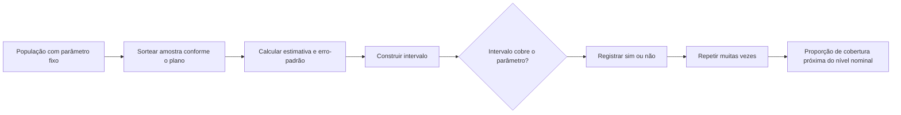
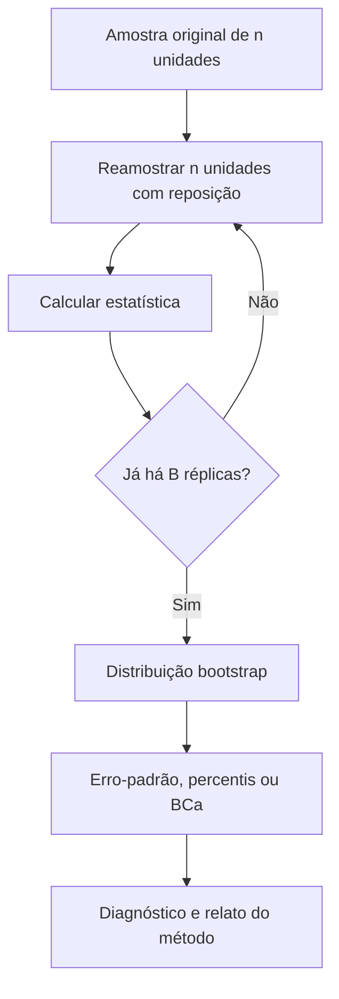
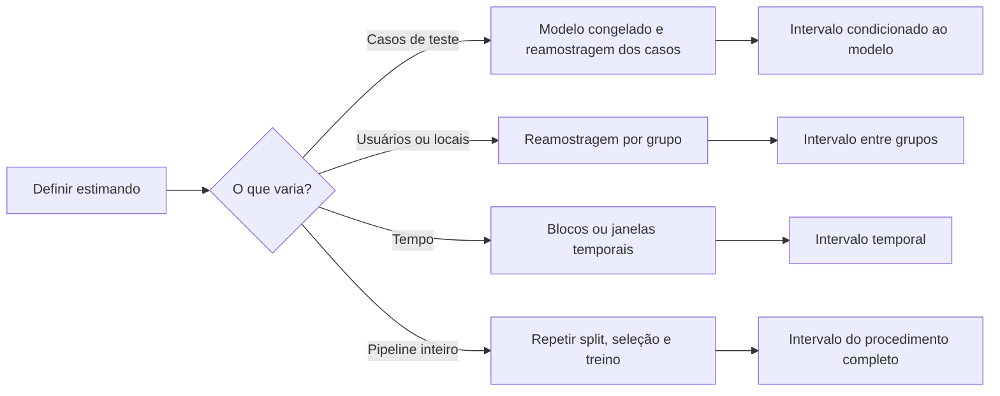

<!-- mirandastech-aula-v2 -->

# Aula 14 — Intervalos de confiança e incerteza da estimativa

> **Bloco B — Estatística aplicada a dados reais**  
> Tempo estimado: 100–130 minutos · Prática: 50–70 minutos

## O problema: 82% de acurácia é uma resposta incompleta

Um classificador congelado acertou 82 de 100 exemplos de teste. A estimativa pontual
da acurácia é 82%, mas outra amostra de 100 casos dificilmente produziria exatamente
o mesmo número. Se o sistema for aprovado por uma diferença de poucos pontos
percentuais, ignorar essa variação pode transformar ruído amostral em “melhoria”.

Um intervalo de confiança responde a uma pergunta mais honesta: **quais valores do
parâmetro são compatíveis com os dados e com o procedimento adotado?** Ele não
elimina a incerteza nem certifica o modelo. Sua validade depende do desenho amostral,
das hipóteses e do método de cálculo.

## Objetivos de aprendizagem

Ao final, você deverá conseguir:

1. explicar intervalo de confiança pela cobertura em amostragens repetidas;
2. distinguir parâmetro fixo, estimativa aleatória e intervalo aleatório;
3. relacionar erro-padrão, nível de confiança, margem de erro e tamanho amostral;
4. calcular e interpretar intervalos para uma média com distribuição t;
5. calcular um intervalo de Wilson para uma proporção e reconhecer a fragilidade do
   intervalo de Wald;
6. estimar tamanho amostral para uma margem de erro planejada;
7. diferenciar intervalo de confiança, intervalo de predição e intervalo de
   tolerância;
8. construir um intervalo por bootstrap e reconhecer quando a unidade de
   reamostragem precisa mudar;
9. quantificar incerteza de métricas de ML sem quebrar pareamento ou reusar dados de
   treinamento como teste;
10. relatar estimativa, intervalo, método, unidade, hipóteses e limitações.

## Pré-requisitos e continuidade

Retome a distribuição normal e o z-score da [Aula 09](./09-normal-zscore-multivariada.md),
o TCL da [Aula 10](./10-lln-clt-monte-carlo.md), o desenho amostral da
[Aula 12](./12-amostragem-vies-leakage.md) e os estimadores da
[Aula 13](./13-estimacao-likelihood-mle-map.md).

A [Aula 15](./15-testes-pvalue-poder.md) transformará perguntas comparativas em
hipóteses, erros I/II e poder. A [Aula 17](./17-bootstrap-permutacao.md) aprofundará
bootstrap e testes de permutação. Aqui o foco é **estimar com incerteza**, sem
antecipar testes de significância.

## Vocabulário essencial

| Termo | Significado |
|---|---|
| Estimativa pontual | Um único valor usado para estimar o parâmetro. |
| Erro-padrão (SE) | Desvio-padrão da distribuição amostral de um estimador. |
| Nível de confiança | Cobertura nominal do procedimento, como 95%. |
| Limites de confiança | Extremos inferior e superior do intervalo observado. |
| Margem de erro | Distância entre a estimativa central e um limite, em intervalos simétricos. |
| Cobertura | Proporção de intervalos que contêm o parâmetro em repetições do processo. |
| Intervalo de Wilson | Intervalo para proporção com comportamento melhor que o Wald em muitos cenários. |
| Bootstrap | Aproximação da distribuição amostral por reamostragem dos dados observados. |
| Unidade de reamostragem | Unidade independente que deve ser sorteada no bootstrap. |
| Condicional ao teste | Incerteza mantendo fixos modelo treinado e conjunto de avaliação. |

## 1. Da estimativa pontual ao procedimento de intervalo

Na Aula 13, um estimador \(\widehat\theta=T(X_1,\ldots,X_n)\) era uma regra antes de
observar os dados. Um procedimento de intervalo também é uma regra:

\[
\left[L(X_1,\ldots,X_n),\;U(X_1,\ldots,X_n)\right].
\]

Antes da coleta, os limites são aleatórios porque dependem da amostra. Depois da
coleta, obtemos números fixos. Em uma formulação frequentista, o parâmetro
\(\theta\) é fixo e desconhecido; não é ele que “entra e sai” do intervalo.

Para um procedimento de 95%, a propriedade desejada é

\[
P_\theta\!\left(L(X)\leq\theta\leq U(X)\right)=0{,}95,
\]

exatamente ou aproximadamente, sob as hipóteses do método. Se repetíssemos todo o
plano amostral muitas vezes e calculássemos um intervalo a cada vez, cerca de 95%
deles cobririam o parâmetro.

### A frase que devemos evitar

Depois de observar um intervalo frequentista de 95% como \([0{,}73;0{,}88]\), não é
correto dizer “há 95% de probabilidade de o parâmetro estar entre 0,73 e 0,88”. O
intervalo já foi calculado e o parâmetro é fixo: ou ele está contido ou não. A
probabilidade de 95% descreve o **procedimento antes da amostra**.

Uma formulação adequada é:

> Pelo método de Wilson e sob amostragem independente representativa, o intervalo
> de confiança de 95% para a acurácia populacional foi de 73,3% a 88,3%.

Em uma análise bayesiana, um intervalo de credibilidade pode receber interpretação
probabilística sobre o parâmetro, condicionado ao modelo e ao prior. Intervalo de
confiança e intervalo de credibilidade não são sinônimos.

## 2. A anatomia: estimativa ± valor crítico × erro-padrão

Muitos intervalos têm a forma aproximada

\[
\text{estimativa}\ \pm\ \text{valor crítico}\times\operatorname{SE}.
\]

Cada componente tem uma função:

- a **estimativa** localiza o centro;
- o **erro-padrão** mede quanto o estimador varia entre amostras;
- o **valor crítico** determina quanta massa da distribuição de referência é
  incluída;
- o produto é a **margem de erro**.

Não confunda desvio-padrão dos dados com erro-padrão da estimativa. Para a média,

\[
\operatorname{SE}(\bar X)=\frac{\sigma}{\sqrt n}
\quad\text{ou, estimado,}\quad
\widehat{\operatorname{SE}}(\bar X)=\frac{s}{\sqrt n}.
\]

O primeiro descreve a variabilidade dos indivíduos; o segundo, a variabilidade da
média amostral. Ao quadruplicar \(n\), o SE cai aproximadamente pela metade — não
por um quarto.

## 3. Intervalo para a média: por que aparece a distribuição t

Se \(X_1,\ldots,X_n\) são observações independentes de uma população normal com
média \(\mu\), mas \(\sigma\) é desconhecido, então

\[
T=\frac{\bar X-\mu}{S/\sqrt n}
\sim t_{n-1}.
\]

O intervalo bilateral de nível \(1-\alpha\) é

\[
\bar x\ \pm\ t_{1-\alpha/2,\,n-1}\frac{s}{\sqrt n}.
\]

A t tem caudas mais pesadas que a normal porque \(s\) também é estimado. Com mais
graus de liberdade, ela se aproxima da normal padrão.

### Exemplo resolvido: latência média

Considere 12 latências em milissegundos:

\[
92,\ 88,\ 95,\ 101,\ 97,\ 90,\ 93,\ 105,\ 99,\ 94,\ 96,\ 91.
\]

Temos \(n=12\), \(\bar x=95{,}083\), \(s=4{,}870\) e

\[
SE=\frac{4{,}870}{\sqrt{12}}\approx1{,}406.
\]

Para 95% e 11 graus de liberdade, \(t_{0{,}975,11}\approx2{,}201\). Logo,

\[
95{,}083\pm2{,}201(1{,}406)
=95{,}083\pm3{,}094,
\]

resultando aproximadamente em \([91{,}989;98{,}178]\) ms.

### Hipóteses e robustez

- as unidades precisam ser independentes ou a dependência deve ser modelada;
- a amostra deve representar a população-alvo;
- para amostras pequenas, assimetria forte e outliers podem invalidar a aproximação;
- com amostras maiores, o TCL ajuda para a média, mas não corrige seleção, drift ou
  dependência;
- medir várias requisições do mesmo usuário como se fossem usuários independentes
  causa pseudorreplicação e SE artificialmente pequeno.

## 4. Intervalos para proporção: Wald não é a escolha automática

Para \(X\sim\operatorname{Binomial}(n,p)\), a proporção amostral é
\(\widehat p=X/n\). O intervalo de Wald usa

\[
\widehat p\pm z_{1-\alpha/2}
\sqrt{\frac{\widehat p(1-\widehat p)}{n}}.
\]

Ele é simples, mas pode ter baixa cobertura em amostras pequenas, perto de 0 ou 1,
e até produzir limites fora de \([0,1]\). Apenas cortar esses limites não restaura a
cobertura planejada.

O intervalo de Wilson reorganiza a aproximação do escore. Com \(z=z_{1-\alpha/2}\),

\[
\text{centro}=
\frac{\widehat p+z^2/(2n)}{1+z^2/n},
\]

\[
\text{meia largura}=
\frac{z}{1+z^2/n}
\sqrt{\frac{\widehat p(1-\widehat p)}{n}+\frac{z^2}{4n^2}}.
\]

### Exemplo resolvido: 8 acertos em 10

- estimativa: \(\widehat p=0{,}8\);
- Wald 95%: aproximadamente \([0{,}552;1{,}048]\), com limite impossível;
- Wilson 95%: aproximadamente \([0{,}490;0{,}943]\).

O intervalo de Wilson comunica algo que “80%” esconde: dez casos ainda deixam muita
incerteza. Há também intervalos binomiais exatos e outros métodos; “exato” não
significa necessariamente estreito ou superior para toda finalidade. Declare o
método usado.

## 5. Largura, nível de confiança e tamanho amostral

Para a média com \(\sigma\) conhecido, a margem de erro é

\[
E=z_{1-\alpha/2}\frac{\sigma}{\sqrt n}.
\]

Uma aproximação para planejar a amostra é

\[
n\geq\left(\frac{z_{1-\alpha/2}\sigma}{E}\right)^2.
\]

Para proporção, usando um valor planejado \(p_0\),

\[
n\geq
\frac{z_{1-\alpha/2}^2p_0(1-p_0)}{E^2}.
\]

Sem estimativa prévia, \(p_0=0{,}5\) produz a variância máxima e uma escolha
conservadora. Para 95% e margem de 3 pontos percentuais,

\[
n\geq\frac{1{,}96^2(0{,}25)}{0{,}03^2}\approx1067{,}11,
\]

portanto arredondamos **para cima**: 1.068 unidades independentes.

Trade-offs:

| Mudança | Efeito típico no intervalo |
|---|---|
| Aumentar \(n\) | Reduz a largura em ordem \(1/\sqrt n\) |
| Elevar confiança de 95% para 99% | Aumenta a largura |
| Aumentar variabilidade | Aumenta a largura |
| Repetir medidas correlacionadas como independentes | Estreita falsamente |
| Melhorar o desenho e reduzir ruído de medição | Pode aumentar precisão sem inflar \(n\) |

Planejamento amostral também precisa considerar perdas, estratos, clusters, custos e
efeito de desenho. O cálculo simples não corrige não resposta ou viés de seleção.

## 6. Confiança, predição e tolerância respondem perguntas diferentes

| Intervalo | Alvo | Pergunta |
|---|---|---|
| Confiança | Parâmetro, como a média populacional | Quão precisamente estimamos o parâmetro? |
| Predição | Uma nova observação ou resultado futuro | Onde pode cair um novo caso? |
| Tolerância | Uma proporção especificada da população | Que faixa contém, por exemplo, 99% da população com certa confiança? |
| Credibilidade | Parâmetro aleatório no modelo bayesiano | Qual faixa contém massa posterior especificada? |

Um intervalo de predição costuma ser mais largo que um intervalo de confiança para a
média, pois inclui a variabilidade de um novo indivíduo além da incerteza sobre a
média. Não use o IC da latência média como garantia para a próxima requisição.

## 7. Bootstrap: uma prévia responsável

Quando a distribuição amostral é difícil de derivar, o bootstrap não paramétrico
aproxima o processo:

1. observe uma amostra de tamanho \(n\);
2. sorteie \(n\) observações **com reposição**;
3. recalcule a estatística;
4. repita muitas vezes;
5. use a distribuição das réplicas para estimar incerteza.

O intervalo percentil usa quantis das réplicas. O BCa busca corrigir viés e
assimetria e é uma opção comum em software estatístico. Nenhum deles é magia:

- a amostra original precisa representar a população;
- poucos dados ou estatísticas descontínuas podem gerar intervalos instáveis;
- séries temporais pedem bootstrap em blocos;
- clusters pedem reamostragem de clusters, não de linhas;
- dados pareados devem manter os pares;
- para desempenho de um pipeline, reamostrar apenas previsões de um modelo já
  treinado mede uma incerteza diferente de refazer treino e avaliação.

A Aula 17 retomará escolha do método, número de réplicas, bootstrap pareado e testes
de permutação com maior profundidade.

## 8. Intervalos em machine learning

### 8.1 Um modelo congelado em casos independentes

Se um modelo já treinado é avaliado uma única vez em casos independentes e
representativos, a acurácia pode ser tratada como proporção e receber um intervalo
de Wilson. Isso quantifica variação dos casos de teste **condicionada ao modelo
congelado**.

### 8.2 Comparar dois modelos nos mesmos casos

As previsões são pareadas por exemplo. Calcule por caso

\[
d_i=\ell_{A,i}-\ell_{B,i}
\]

ou a diferença entre indicadores de acerto e reamostre os pares \((d_i)\). Sortear
as métricas dos modelos separadamente destrói a correlação e responde a outra
pergunta. Relate o intervalo da **diferença**, não apenas dois intervalos marginais.

### 8.3 Incerteza do pipeline completo

Se split, inicialização, treinamento ou seleção de hiperparâmetros também variam, um
intervalo condicionado a um único modelo não inclui essas fontes. Uma avaliação do
pipeline pode exigir repetição externa completa, grupos intactos e seleção feita
somente dentro do treino. Cada nível responde a um estimando diferente.

Não use o conjunto de teste repetidamente para escolher modelo e depois trate o
intervalo como se o teste fosse intocado. Essa adaptação gera otimismo e conecta
diretamente esta aula ao *data leakage* da Aula 12.

## 9. Armadilhas e erros comuns

1. Interpretar um IC frequentista como probabilidade posterior do parâmetro.
2. Dizer que 95% das observações estão dentro de um IC da média.
3. Confundir desvio-padrão com erro-padrão.
4. Usar normal padrão quando a variância foi estimada em amostra pequena sem
   justificativa.
5. Aplicar Wald automaticamente a proporções pequenas ou extremas.
6. Cortar limites do Wald em 0 e 1 e assumir que a cobertura foi corrigida.
7. Tratar linhas correlacionadas como observações independentes.
8. Reamostrar linhas quando a unidade independente é usuário, paciente ou local.
9. Quebrar o pareamento ao comparar modelos nos mesmos casos.
10. Usar bootstrap para corrigir amostra enviesada.
11. Omitir método, nível de confiança, unidade e hipóteses.
12. Interpretar intervalo estreito como ausência de viés sistemático.
13. Selecionar o melhor resultado entre muitas execuções e calcular o intervalo
    apenas para ele.
14. Confundir precisão estatística com relevância prática.

## 10. Laboratório reproduzível

O [notebook da Aula 14](../notebooks/14-intervalos-confianca-laboratorio.ipynb)
usa Python, NumPy, pandas, SciPy e Matplotlib, com seed `20260907`. Ele:

1. calcula manualmente e com SciPy o intervalo t para uma média;
2. compara Wald e Wilson para proporções;
3. simula a cobertura de intervalos z, t e de um procedimento inadequado;
4. confirma a relação entre largura e \(1/\sqrt n\);
5. calcula o tamanho amostral para margem de erro planejada;
6. constrói intervalos bootstrap percentil e BCa para uma mediana assimétrica;
7. compara dois classificadores por bootstrap pareado;
8. executa asserções matemáticas e metodológicas.

Dependências explícitas: Python 3.10+, NumPy, pandas, SciPy e Matplotlib.

## 11. Checklist prático

- [ ] Defini população, parâmetro, unidade independente e período.
- [ ] Especifiquei quais fontes de variação entram no estimando.
- [ ] Confirmei que a amostra representa a população-alvo.
- [ ] Verifiquei independência, grupos, pareamento e ordem temporal.
- [ ] Escolhi um método adequado ao tipo de parâmetro e tamanho da amostra.
- [ ] Não confundi desvio-padrão dos dados com erro-padrão.
- [ ] Calculei limites com precisão antes de arredondar.
- [ ] Declarei nível de confiança e método, como t, Wilson ou BCa.
- [ ] Se usei bootstrap, reamostrei a unidade correta com reposição.
- [ ] Para modelos, preservei o pareamento por caso.
- [ ] Mantive seleção e treinamento fora do conjunto de teste final.
- [ ] Relatei estimativa pontual junto do intervalo.
- [ ] Separei incerteza estatística de viés, drift e relevância prática.
- [ ] Registrei dados, seed, versões e código reproduzível.

## 12. Exercícios

1. Explique cobertura de 95% sem atribuir probabilidade frequentista ao parâmetro
   depois de observar o intervalo.
2. Uma amostra tem \(s=12\) e \(n=36\). Qual é o erro-padrão estimado da média?
3. Por que o intervalo t costuma ser mais largo que o z em amostras pequenas?
4. Para \(\bar x=50\), \(s=8\), \(n=16\) e
   \(t_{0{,}975,15}=2{,}131\), calcule o IC 95% da média.
5. O Wald para 1 sucesso em 10 produz limite inferior negativo. Devemos apenas
   truncá-lo em zero?
6. Sem estimativa prévia de uma proporção, qual \(p_0\) maximiza a variância no
   planejamento amostral?
7. Se quadruplicarmos \(n\), o que acontece aproximadamente com a margem de erro?
8. Qual intervalo responde onde pode cair a latência de uma nova requisição?
9. Dois modelos foram avaliados nos mesmos 500 exemplos. Como preservar a estrutura
   correta no bootstrap da diferença de acurácia?
10. Um dataset contém 20 observações de cada um de 50 usuários. Qual unidade deve
    ser reamostrada se usuários são independentes e observações internas são
    correlacionadas?

### Respostas comentadas

1. Em repetições de todo o plano amostral, aproximadamente 95% dos intervalos
   construídos pelo procedimento conteriam o parâmetro, sob suas hipóteses.
2. \(SE=s/\sqrt n=12/6=2\).
3. Porque \(\sigma\) é desconhecido e estimado por \(s\); as caudas mais pesadas da
   t incorporam essa incerteza adicional.
4. \(SE=8/4=2\), margem \(=2{,}131\times2=4{,}262\); intervalo
   \([45{,}738;54{,}262]\).
5. Não. O truncamento respeita o suporte visualmente, mas não restaura a cobertura.
   Use Wilson ou outro método binomial justificado.
6. \(p_0=0{,}5\), pois maximiza \(p_0(1-p_0)=0{,}25\).
7. Cai aproximadamente pela metade, pois varia como \(1/\sqrt n\).
8. Um intervalo de predição, não um IC da média.
9. Reamostrar índices de casos e, em cada réplica, levar juntas as duas previsões —
   ou reamostrar diretamente as diferenças por caso.
10. Usuários inteiros. Reamostrar as 1.000 linhas trataria correlações internas como
    informação independente e subestimaria a incerteza.

## Resumo

- Intervalo de confiança é um procedimento aleatório com cobertura de longo prazo.
- Depois da amostra, não há 95% de probabilidade frequentista sobre o parâmetro fixo.
- Erro-padrão mede variabilidade do estimador; não é desvio-padrão dos indivíduos.
- O intervalo t incorpora a estimação de \(\sigma\) para médias.
- Wilson costuma ser preferível ao Wald para proporções, especialmente com poucos
  casos ou estimativas extremas.
- Largura depende de confiança, variabilidade, desenho e \(1/\sqrt n\).
- Confiança, predição, tolerância e credibilidade têm alvos diferentes.
- Bootstrap exige representar corretamente independência, grupos, pares e tempo.
- Em ML, declare se a incerteza é do modelo congelado ou do pipeline completo.
- Intervalo estreito não elimina viés, leakage, drift nem irrelevância prática.

## Próxima aula

Na [Aula 15 — Testes de hipótese, p-value, erros I/II e poder](./15-testes-pvalue-poder.md),
usaremos distribuições amostrais para avaliar hipóteses predefinidas, distinguindo
evidência estatística, tipos de erro e capacidade de detectar efeitos.

## Referências técnicas

1. NIST/SEMATECH.
   [*Confidence Limits for the Mean*](https://www.itl.nist.gov/div898/handbook/eda/section3/eda352.htm).
2. OpenIntro.
   [*OpenIntro Statistics*](https://www.openintro.org/book/os/), capítulos de
   fundamentos de inferência e inferência para médias/proporções.
3. SciPy.
   [`scipy.stats.bootstrap`](https://docs.scipy.org/doc/scipy/reference/generated/scipy.stats.bootstrap.html).
4. Efron, B. (1979).
   [*Bootstrap Methods: Another Look at the Jackknife*](https://doi.org/10.1214/aos/1176344552).
   *The Annals of Statistics*, 7(1), 1–26.
5. Wilson, E. B. (1927).
   [*Probable Inference, the Law of Succession, and Statistical Inference*](https://doi.org/10.1080/01621459.1927.10502953).
   *Journal of the American Statistical Association*, 22(158), 209–212.

## Material complementar

- NIST/SEMATECH.
  [*Confidence intervals for a proportion*](https://www.itl.nist.gov/div898/handbook/prc/section2/prc241.htm).
- OpenIntro.
  [Vídeo: *Constructing Confidence Intervals*](https://www.youtube.com/watch?v=FUaXoKdCre4).
