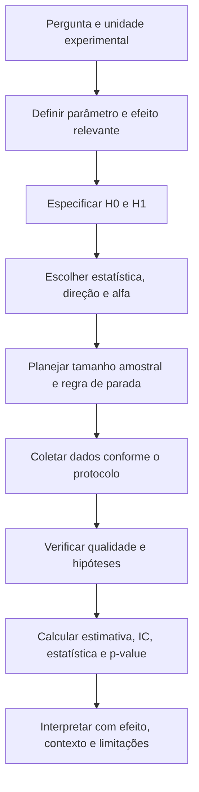
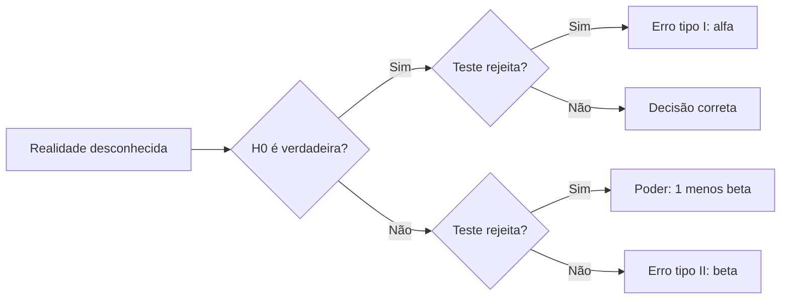
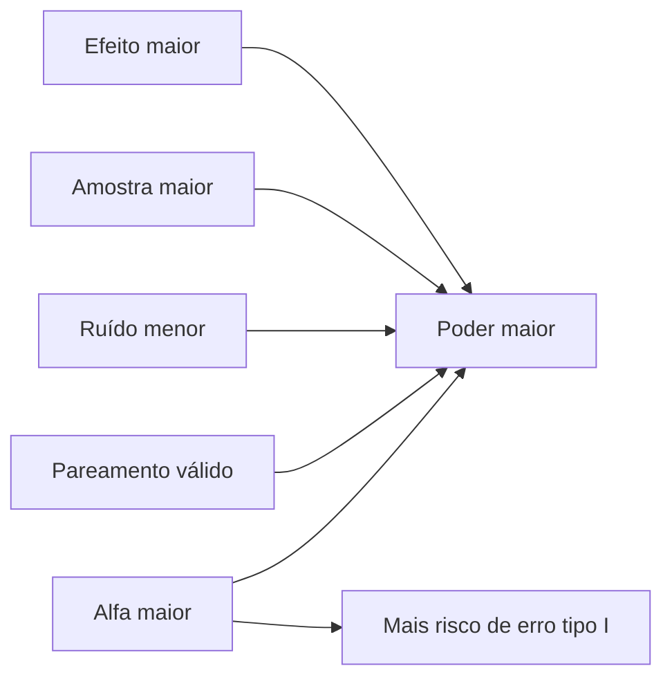

<!-- mirandastech-aula-v2 -->

# Aula 15 — Testes de hipótese, p-value, erros I/II e poder

> **Bloco B — Estatística aplicada a dados reais**  
> Tempo estimado: 100–130 minutos · Prática: 50–70 minutos

## O problema: o serviço ficou mais rápido ou a amostra apenas oscilou?

Uma equipe estabeleceu antes do experimento que a latência média deveria ficar abaixo
de 100 ms. Em 12 medições independentes, obteve média de 95,083 ms e desvio-padrão de
4,870 ms. A diferença observada é grande o bastante para ser difícil de explicar
apenas pela variabilidade amostral se a média de referência fosse 100 ms?

Um teste de hipótese organiza essa pergunta. Ele não prova uma hipótese, não mede a
probabilidade de ela ser verdadeira e não informa sozinho se a diferença importa
operacionalmente. O teste mede quão incompatíveis os dados são com um modelo nulo,
sob um procedimento e hipóteses declarados.

## Objetivos de aprendizagem

Ao final, você deverá conseguir:

1. formular hipótese nula e alternativa antes de examinar o resultado;
2. escolher entre alternativa unilateral e bilateral pela pergunta, não pelo
   p-value obtido;
3. construir e interpretar uma estatística de teste;
4. definir p-value como probabilidade de resultados tão ou mais extremos sob o
   modelo nulo;
5. distinguir “rejeitar” de “não rejeitar” \(H_0\);
6. explicar nível \(\alpha\), erros tipo I e II, \(\beta\) e poder \(1-\beta\);
7. relacionar poder a efeito, variância, tamanho amostral e critério de decisão;
8. conectar testes bilaterais e intervalos de confiança compatíveis;
9. reconhecer p-hacking, parada opcional, seleção pós-resultado e multiplicidade;
10. preservar unidade experimental e pareamento ao testar modelos de IA.

## Pré-requisitos e continuidade

Retome a distribuição normal da [Aula 09](./09-normal-zscore-multivariada.md), a
distribuição amostral da [Aula 10](./10-lln-clt-monte-carlo.md), o desenho e o
*leakage* da [Aula 12](./12-amostragem-vies-leakage.md) e os intervalos de confiança
da [Aula 14](./14-intervalos-confianca.md).

A [Aula 16](./16-tamanho-efeito.md) separará evidência estatística de magnitude e
relevância prática. A [Aula 17](./17-bootstrap-permutacao.md) aprofundará testes de
permutação, e a [Aula 18](./18-multiplas-fdr-anova.md) tratará comparações múltiplas.
Nesta aula, usamos testes clássicos para compreender a lógica de decisão e seus
erros.

## Vocabulário essencial

| Termo | Significado |
|---|---|
| \(H_0\) | Hipótese nula: modelo ou valor de referência usado para calibrar o teste. |
| \(H_1\) ou \(H_a\) | Hipótese alternativa compatível com a pergunta científica. |
| Estatística de teste | Resumo cuja distribuição sob \(H_0\) é conhecida ou aproximável. |
| p-value | Probabilidade, sob \(H_0\), de resultado tão ou mais extremo que o observado. |
| \(\alpha\) | Probabilidade máxima planejada de erro tipo I no procedimento. |
| Erro tipo I | Rejeitar \(H_0\) quando ela é verdadeira. |
| \(\beta\) | Probabilidade de erro tipo II para uma alternativa específica. |
| Erro tipo II | Não rejeitar \(H_0\) quando a alternativa especificada é verdadeira. |
| Poder | \(1-\beta\): probabilidade de rejeitar \(H_0\) sob um efeito específico. |
| Região crítica | Valores da estatística que levam à rejeição de \(H_0\). |
| Unidade experimental | Menor unidade atribuída ou observada independentemente no desenho. |
| Análise pré-especificada | Hipóteses, métricas e decisões definidas antes de ver resultados. |

## 1. Comece pela pergunta, não pela função da biblioteca

Um teste bem definido precisa declarar:

1. população e unidade independente;
2. parâmetro ou contraste de interesse;
3. \(H_0\) e \(H_1\);
4. estatística de teste e suas hipóteses;
5. direção unilateral ou bilateral;
6. nível \(\alpha\);
7. regra para dados ausentes, outliers e exclusões;
8. tamanho amostral ou regra de parada;
9. métrica principal e comparações planejadas;
10. efeito mínimo de interesse prático.

Se a hipótese nasce depois que o gráfico “parece interessante”, a análise é
exploratória. Ela pode gerar uma nova hipótese, mas não deve ser apresentada como
confirmação pré-especificada.

## 2. Hipótese nula e alternativa

Para a latência média \(\mu\), a pergunta “há evidência de que a média é menor que
100 ms?” pode ser escrita como

\[
H_0:\mu\geq100
\qquad\text{versus}\qquad
H_1:\mu<100.
\]

Na calibração do teste t, calculamos a distribuição na fronteira \(\mu_0=100\), a
situação nula mais favorável à rejeição nesse problema unilateral.

Se qualquer mudança — melhora ou piora — importasse, usaríamos

\[
H_0:\mu=100
\qquad\text{versus}\qquad
H_1:\mu\neq100.
\]

### Unilateral versus bilateral

| Alternativa | Região extrema | Quando faz sentido |
|---|---|---|
| \(\mu<\mu_0\) | Cauda inferior | Apenas reduções foram definidas como evidência relevante. |
| \(\mu>\mu_0\) | Cauda superior | Apenas aumentos foram definidos como evidência relevante. |
| \(\mu\neq\mu_0\) | Duas caudas | Mudanças em qualquer direção importam. |

Escolher unilateral depois de observar a direção reduz indevidamente o p-value. A
direção pertence ao protocolo. Um teste unilateral também não autoriza ignorar um
efeito grande na direção oposta: isso pode revelar dano ou falha do modelo.

## 3. Estatística de teste: distância em unidades de erro-padrão

Quando \(\sigma\) é desconhecido e as hipóteses do teste t são adequadas,

\[
t_{\text{obs}}=
\frac{\bar x-\mu_0}{s/\sqrt n}.
\]

Sob \(H_0\) na igualdade, essa estatística segue uma distribuição t com \(n-1\)
graus de liberdade. Para os dados de latência,

\[
t_{\text{obs}}=
\frac{95{,}083-100}{4{,}870/\sqrt{12}}
\approx-3{,}497.
\]

O sinal indica a direção; o módulo mede a distância ao valor nulo em erros-padrão.
Uma grande distância pode surgir por efeito maior, menor variância ou maior \(n\).

## 4. O que o p-value é — e o que não é

Para a alternativa inferior, o p-value é

\[
p=P_{H_0}(T\leq t_{\text{obs}}).
\]

Para o exemplo, \(p\approx0{,}0025\). Isso significa: **se a média nula de 100 ms e
as demais hipóteses do teste fossem adequadas, a probabilidade de obter uma
estatística t igual ou menor que -3,497 seria cerca de 0,25%**.

O p-value não é:

- \(P(H_0\mid\text{dados})\);
- a probabilidade de o resultado ter ocorrido “por acaso”;
- a probabilidade de replicação;
- o tamanho ou a importância do efeito;
- a taxa de falsos positivos entre todos os resultados publicados;
- uma garantia de que dados, código e desenho estão corretos.

Um p-value pequeno indica incompatibilidade entre dados e o conjunto de hipóteses
nulas; não identifica sozinho qual hipótese falhou. Outliers, dependência, seleção,
drift ou erro de implementação também podem produzir incompatibilidade.

## 5. Regra de decisão e linguagem correta

Se o protocolo definiu \(\alpha=0{,}05\):

- quando \(p\leq\alpha\), rejeitamos \(H_0\) segundo a regra planejada;
- quando \(p>\alpha\), **não rejeitamos** \(H_0\).

Não rejeitar não significa aceitar, provar equivalência ou demonstrar ausência de
efeito. O estudo pode ter baixo poder. Da mesma forma, \(p=0{,}049\) e
\(p=0{,}051\) não representam universos científicos opostos; o limiar é uma regra de
decisão, não uma fronteira natural da realidade.

No exemplo, rejeitamos \(H_0\) a 5% e encontramos evidência de que a média é menor
que 100 ms, sob as hipóteses adotadas. Isso fala da **média**, não garante que toda
requisição fique abaixo de 100 ms e não quantifica ainda a relevância operacional.

## 6. Erros tipo I, tipo II e poder

Toda decisão sob incerteza pode errar:

| Realidade | Não rejeitar \(H_0\) | Rejeitar \(H_0\) |
|---|---|---|
| \(H_0\) verdadeira | Decisão correta | Erro tipo I, probabilidade \(\alpha\) |
| Alternativa específica verdadeira | Erro tipo II, probabilidade \(\beta\) | Decisão correta, poder \(1-\beta\) |

\(\alpha\) é escolhido antes dos dados. \(\beta\) não é um único número universal:
depende do efeito verdadeiro escolhido, da variância, do tamanho amostral, do teste e
do próprio \(\alpha\).

### Intuição de controle de qualidade

- erro tipo I: aprovar uma “melhoria” inexistente;
- erro tipo II: deixar de detectar uma melhoria real;
- poder: chance de detectar um efeito definido como relevante.

Os custos podem ser assimétricos. Em segurança, medicina ou infraestrutura crítica,
\(\alpha=0{,}05\) não deve ser adotado por hábito: o limiar precisa refletir risco,
governança e multiplicidade.

## 7. O que aumenta o poder?

Em geral, o poder aumenta quando:

- o efeito verdadeiro se afasta mais de \(H_0\);
- o tamanho amostral cresce;
- a variabilidade diminui por medição ou desenho melhores;
- o pareamento remove variação entre unidades;
- \(\alpha\) aumenta, ao custo de mais erro tipo I;
- um teste unilateral pré-especificado é apropriado;
- a estatística usa eficientemente a estrutura dos dados.

Planejamento de poder exige um **efeito mínimo de interesse**, não o efeito observado
depois do estudo. “Poder observado” calculado com a própria estimativa costuma apenas
reexpressar o p-value e não repara um desenho subdimensionado.

## 8. Relação entre teste bilateral e intervalo de confiança

Quando teste e intervalo usam o mesmo modelo e nível,

\[
\text{rejeitar }H_0:\theta=\theta_0
\text{ em teste bilateral de nível }\alpha
\Longleftrightarrow
\theta_0\notin IC_{1-\alpha}.
\]

Na Aula 14, o IC 95% da média das latências foi aproximadamente
\([91{,}989;98{,}178]\) ms. Como 100 não pertence ao intervalo, o teste bilateral a
5% também rejeitaria \(H_0:\mu=100\). O p-value bilateral seria maior que o
unilateral porque considera extremos nas duas direções.

Essa dualidade não vale se misturarmos métodos, hipóteses, caudas ou ajustes
diferentes. Um intervalo também informa magnitude e precisão melhor que a etiqueta
“significativo/não significativo”.

## 9. Escolher o teste pela estrutura dos dados

| Pergunta | Estrutura | Procedimento comum | Cuidado principal |
|---|---|---|---|
| Uma média versus referência | Uma amostra independente | t de uma amostra | Normalidade aproximada/outliers em \(n\) pequeno |
| Duas médias independentes | Grupos distintos | t de Welch | Não assumir variâncias iguais por padrão |
| Duas médias nas mesmas unidades | Dados pareados | t pareado sobre diferenças | Não quebrar pares |
| Proporção versus referência | Bernoulli/binomial | Teste binomial ou escore | Aproximações em amostras pequenas |
| Distribuição sem forma simples | Estatística escolhida | Permutação ou simulação | Troca sob \(H_0\) precisa ser justificável |

Testes não paramétricos não são “testes sem hipóteses”. Eles mudam as hipóteses. O
teste pareado avalia a média das diferenças; não é equivalente a testar duas amostras
como independentes.

## 10. Não significância, equivalência e não inferioridade

Se \(p>0{,}05\), não concluímos “os sistemas são iguais”. Para demonstrar que uma
diferença é pequena o suficiente, precisamos definir uma margem prática \(\Delta\) e
usar um desenho de equivalência ou não inferioridade adequado.

- **superioridade:** há evidência de benefício?
- **não inferioridade:** o novo sistema não é pior além de \(\Delta\)?
- **equivalência:** a diferença está inteiramente entre \(-\Delta\) e \(+\Delta\)?

Essas perguntas usam hipóteses diferentes. Trocar de superioridade para não
inferioridade depois de ver um resultado inconclusivo é seleção pós-resultado.

## 11. P-hacking e graus de liberdade analíticos

O erro tipo I prometido pelo teste pressupõe que a regra completa foi respeitada.
Práticas que inflam falsos positivos incluem:

- testar muitas métricas e relatar apenas a menor;
- interromper a coleta quando \(p<0{,}05\);
- remover outliers de várias formas até “funcionar”;
- trocar teste bilateral por unilateral após ver o sinal;
- experimentar subgrupos sem declarar exploração;
- selecionar sementes ou splits favoráveis;
- ajustar hiperparâmetros no teste final;
- omitir análises que contradizem a narrativa.

Em um teste contínuo de \(H_0\), o p-value é aproximadamente uniforme. Portanto,
cerca de 5% ficam abaixo de 0,05 por construção. Olhar repetidamente sem correção dá
mais oportunidades para cruzar o limiar. Métodos sequenciais existem, mas exigem
fronteiras e regras próprias definidas de antemão.

## 12. Testes em IA e avaliação de modelos

### Modelos avaliados nos mesmos casos

As perdas ou acertos são pareados por exemplo. Para perdas, defina

\[
d_i=\ell_{A,i}-\ell_{B,i}
\]

e teste a média de \(d_i\), se as hipóteses forem adequadas. O pareamento usa a
correlação entre dificuldades dos casos e pode reduzir o erro-padrão. Tratar os dois
vetores como independentes desperdiça estrutura e pode alterar a conclusão.

### A unidade pode não ser a linha

Prompts do mesmo usuário, frames do mesmo vídeo e exames do mesmo paciente são
correlacionados. A unidade de inferência pode ser usuário, vídeo ou paciente. Testar
mil linhas como independentes quando existem 50 usuários produz pseudorreplicação.

### O que está fixo e o que varia?

- modelo congelado + novos casos: incerteza condicional ao modelo;
- novas sementes de treino: variação do algoritmo;
- novos splits: variação da partição;
- novo período: drift;
- seleção entre muitas configurações: multiplicidade e viés de seleção.

O teste precisa acompanhar o estimando. Para LLMs, documente prompts, juiz, ordem,
temperatura, repetição, versões e dependência por tarefa. Um p-value com dados não
rastreáveis não é evidência auditável.

## 13. Como relatar sem exagerar

Uma frase completa contém:

> Em 12 unidades independentes, a latência média foi 95,08 ms
> (IC 95%: 91,99–98,18). No teste t unilateral pré-especificado contra 100 ms,
> \(t(11)=-3{,}497\), \(p=0{,}0025\). O resultado se refere à média sob as
> hipóteses do teste e não garante o limite para cada requisição.

Inclua também protocolo, exclusões, tamanho amostral planejado, unidade, efeito de
interesse, versões do código e dados. Não escreva “comprovado” nem “não há efeito”.

## 14. Armadilhas e erros comuns

1. Definir \(H_0\) e \(H_1\) depois de olhar os dados.
2. Interpretar p-value como probabilidade de \(H_0\).
3. Confundir \(\alpha\) com o p-value observado.
4. Tratar \(p>\alpha\) como prova de igualdade.
5. Tratar \(p<\alpha\) como efeito importante.
6. Escolher unilateral pela direção observada.
7. Ignorar hipóteses, outliers, dependência e viés de seleção.
8. Usar teste independente para dados pareados.
9. Calcular poder com o efeito observado e chamar isso de planejamento.
10. Repetir análises e manter \(\alpha\) nominal sem ajuste.
11. Parar a coleta assim que o resultado cruza 0,05.
12. Comparar “significativo em A” com “não significativo em B” e concluir que A e B
    diferem; é preciso testar a diferença diretamente.
13. Omitir estimativa, intervalo e relevância prática.
14. Achar que teste sofisticado corrige dados ruins ou leakage.

## 15. Laboratório reproduzível

O [notebook da Aula 15](../notebooks/15-testes-pvalue-poder-laboratorio.ipynb)
usa Python, NumPy, pandas, SciPy e Matplotlib, com seed `20260907`. Ele:

1. calcula manualmente e com SciPy um teste t unilateral;
2. visualiza o p-value como área de cauda sob \(H_0\);
3. confirma por simulação que o erro tipo I fica próximo de \(\alpha\);
4. mostra a distribuição aproximadamente uniforme do p-value sob \(H_0\);
5. calcula curvas de poder por distribuição t não central;
6. compara efeito de \(n\), variância e \(\alpha\);
7. demonstra a vantagem do pareamento em avaliação de modelos;
8. quantifica a inflação de falso positivo por parada opcional;
9. executa asserções matemáticas e metodológicas.

Dependências explícitas: Python 3.10+, NumPy, pandas, SciPy e Matplotlib.

## 16. Checklist prático

- [ ] Defini população, unidade e parâmetro antes do teste.
- [ ] Registrei \(H_0\), \(H_1\), direção e \(\alpha\) previamente.
- [ ] Defini efeito mínimo relevante e planejei poder.
- [ ] Fixei tamanho amostral ou regra sequencial válida.
- [ ] Separei análises confirmatórias e exploratórias.
- [ ] Verifiquei independência, pareamento, grupos e ordem temporal.
- [ ] Escolhi teste compatível com dados e hipóteses.
- [ ] Mantive treino, seleção e teste final separados.
- [ ] Não selecionei métricas, seeds ou subgrupos pelo p-value.
- [ ] Reportei estimativa, IC, estatística, graus de liberdade e p-value.
- [ ] Interpretei p-value condicionado a \(H_0\), não como probabilidade de \(H_0\).
- [ ] Usei “não rejeitar”, sem afirmar equivalência indevida.
- [ ] Documentei multiplicidade e análises adicionais.
- [ ] Registrei dados, código, seed, versões e limitações.

## 17. Exercícios

1. Defina p-value em uma frase sem usar “probabilidade de \(H_0\)”.
2. Em \(\alpha=0{,}01\), o que representa erro tipo I?
3. Se o poder é 0,80 para um efeito específico, qual é \(\beta\)?
4. Um teste retorna \(p=0{,}18\). Podemos afirmar que \(H_0\) é verdadeira?
5. Por que escolher uma cauda depois de observar o sinal é inválido?
6. O que tende a acontecer com o poder quando \(n\) cresce, mantidos efeito,
   variância e \(\alpha\)?
7. Um IC 95% bilateral para \(\mu_A-\mu_B\) é \([0{,}2;1{,}1]\). Qual decisão o
   teste bilateral correspondente toma para \(H_0:\mu_A-\mu_B=0\), a 5%?
8. Dois modelos foram avaliados nos mesmos prompts. Qual é a estrutura correta?
9. O pesquisador olha o p-value a cada dez observações e para ao cruzar 0,05. Qual
   erro é afetado?
10. “Não houve diferença significativa, logo os modelos são equivalentes.” O que
    falta?

### Respostas comentadas

1. É a probabilidade, assumindo \(H_0\) e as demais hipóteses do modelo, de obter uma
   estatística tão ou mais extrema que a observada na direção definida.
2. Rejeitar \(H_0\) quando ela é verdadeira; o procedimento limita essa probabilidade
   a 1% sob suas hipóteses e regra completa.
3. \(\beta=1-0{,}80=0{,}20\).
4. Não. Apenas não rejeitamos \(H_0\) pelo procedimento; baixa precisão ou baixo poder
   podem explicar o resultado.
5. Porque usa os dados duas vezes para escolher e testar a direção, alterando a taxa
   de erro planejada.
6. O poder tende a aumentar, pois o erro-padrão diminui.
7. Rejeita, pois 0 não pertence ao intervalo compatível de 95%.
8. Parear resultados por prompt e testar a diferença dentro de cada par, preservando
   também agrupamentos por usuário ou tarefa quando existirem.
9. O erro tipo I acumulado aumenta se não houver regra sequencial apropriada.
10. Uma margem de equivalência definida antes dos dados, desenho com poder adequado e
    procedimento de equivalência; falhar em rejeitar superioridade não prova
    equivalência.

## Resumo

- Testes começam com pergunta, unidade, hipóteses e decisão pré-especificadas.
- A estatística mede distância ao valor nulo em uma escala calibrada.
- P-value é área de resultados extremos sob \(H_0\), não probabilidade de \(H_0\).
- \(p\leq\alpha\) leva à rejeição; \(p>\alpha\) leva a não rejeitar.
- Erro tipo I tem probabilidade \(\alpha\); poder é \(1-\beta\) para uma alternativa.
- Mais dados, maior efeito, menor ruído e pareamento válido tendem a elevar poder.
- Teste bilateral e IC compatível expressam a mesma fronteira de decisão.
- Não significância não demonstra igualdade, equivalência ou ausência de efeito.
- Parada opcional, seleção de métricas e múltiplas tentativas inflam falsos positivos.
- Em IA, preserve casos pareados, unidades reais e separação do teste final.

## Próxima aula

Na [Aula 16 — Tamanho de efeito e significância prática](./16-tamanho-efeito.md),
quantificaremos a magnitude da diferença e perguntaremos se ela é operacionalmente
importante, mesmo quando há forte evidência estatística.

## Referências técnicas

1. Wasserstein, R. L.; Lazar, N. A. (2016).
   [*The ASA Statement on p-Values: Context, Process, and Purpose*](https://doi.org/10.1080/00031305.2016.1154108).
   *The American Statistician*, 70(2), 129–133.
2. NIST/SEMATECH.
   [*Quantitative Techniques — Hypothesis Testing*](https://www.itl.nist.gov/div898/handbook/eda/section3/eda35.htm).
3. SciPy.
   [`scipy.stats.ttest_1samp`](https://docs.scipy.org/doc/scipy/reference/generated/scipy.stats.ttest_1samp.html)
   e [`scipy.stats.ttest_rel`](https://docs.scipy.org/doc/scipy/reference/generated/scipy.stats.ttest_rel.html).
4. Neyman, J.; Pearson, E. S. (1933).
   [*On the Problem of the Most Efficient Tests of Statistical Hypotheses*](https://royalsocietypublishing.org/doi/10.1098/rsta.1933.0009).
   *Philosophical Transactions of the Royal Society A*, 231, 289–337.
5. OpenIntro.
   [*OpenIntro Statistics*](https://www.openintro.org/book/os/), capítulos de
   fundamentos de inferência e inferência para médias.

## Material complementar

- American Statistical Association.
  [*ASA P-Value Statement Viewed More Than 150,000 Times*](https://www.amstat.org/news-listing/2021/10/08/asa-p-value-statement-viewed-150-000-times).
- NIST/SEMATECH.
  [*Sample sizes required for tests about a mean*](https://www.itl.nist.gov/div898/handbook/prc/section2/prc222.htm).

