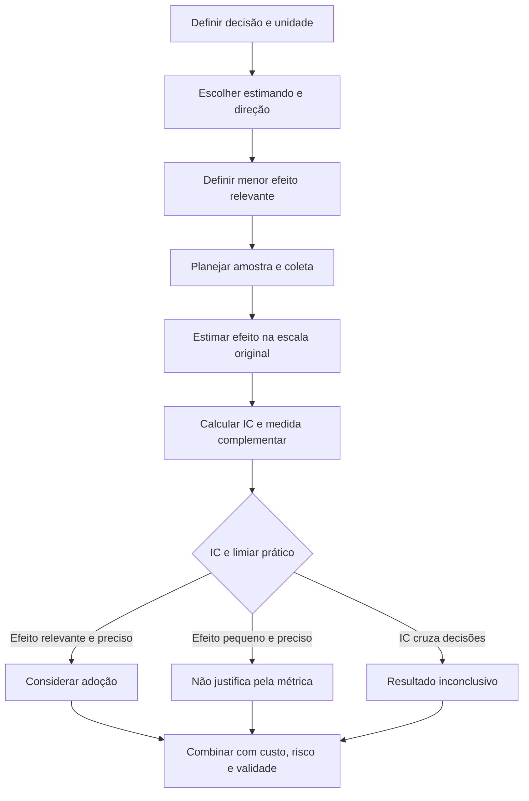
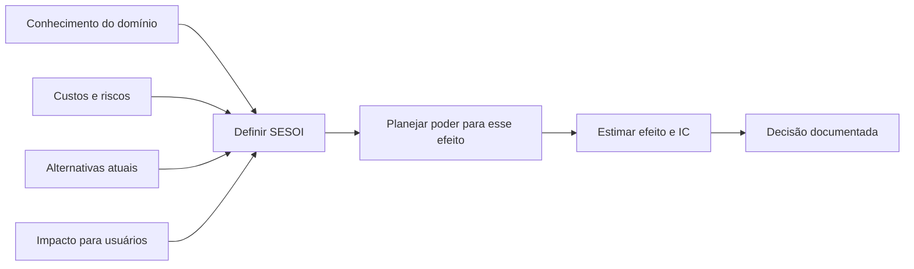

<!-- mirandastech-aula-v2 -->

# Aula 16 — Tamanho de efeito e significância prática

> **Bloco B — Estatística aplicada a dados reais**  
> Tempo estimado: 100–130 minutos · Prática: 50–70 minutos

## O problema: detectar uma diferença basta para aprovar o modelo?

Dois modelos de previsão são avaliados nos mesmos casos. Com uma amostra enorme, o
modelo B reduz o erro médio de `12,00` para `11,95`. O teste retorna um p-value muito
pequeno. Devemos trocar o sistema?

A diferença absoluta é `0,05` unidade, ou apenas `0,42%` do erro do modelo A. Se a
migração custa caro e a equipe havia definido que somente reduções de pelo menos
`0,50` unidade justificariam a troca, o resultado é estatisticamente detectável, mas
não relevante para a decisão.

O p-value da [Aula 15](./15-testes-pvalue-poder.md) responde quão incompatíveis os
dados são com um modelo nulo. **Tamanho de efeito responde quanto, em qual direção e
em qual escala os grupos ou condições diferem.** Para decidir, ainda precisamos da
incerteza da estimativa, de um limiar prático e dos custos e riscos envolvidos.

## Objetivos de aprendizagem

Ao final, você deverá conseguir:

1. separar evidência estatística, magnitude, precisão e relevância prática;
2. definir o estimando e a direção favorável antes de calcular uma medida;
3. calcular diferenças absoluta e relativa sem esconder a unidade original;
4. calcular e interpretar Cohen \(d\) e a correção de Hedges \(g\);
5. distinguir efeitos padronizados para grupos independentes e dados pareados;
6. escolher medidas adequadas para desfechos contínuos, binários e ordinais;
7. interpretar diferença de risco, razão de riscos e probabilidade de superioridade;
8. acompanhar todo efeito com intervalo de confiança;
9. definir um menor efeito de interesse prático antes de olhar os resultados;
10. relatar ganhos de modelos de IA sem exagerar conclusões.

## Pré-requisitos e continuidade

Retome média, variância e covariância na [Aula 06](./06-esperanca-variancia-covariancia.md),
amostragem e *leakage* na [Aula 12](./12-amostragem-vies-leakage.md), intervalos de
confiança na [Aula 14](./14-intervalos-confianca.md) e testes/poder na
[Aula 15](./15-testes-pvalue-poder.md).

A [Aula 17](./17-bootstrap-permutacao.md) construirá intervalos e testes por
reamostragem quando a distribuição analítica for inconveniente. A
[Aula 18](./18-multiplas-fdr-anova.md) tratará multiplicidade e ANOVA. Aqui o escopo é
**definir, calcular e interpretar a magnitude**.

## Vocabulário essencial

| Termo | Significado |
|---|---|
| Estimando | Quantidade populacional que a análise pretende estimar. |
| Estimativa | Valor calculado na amostra para aproximar o estimando. |
| Efeito bruto | Diferença ou razão expressa na escala original. |
| Efeito padronizado | Efeito dividido por uma medida de dispersão, sem unidade. |
| Direção do efeito | Convenção que determina qual sinal representa benefício. |
| IC | Faixa de valores compatíveis com dados e método no nível escolhido. |
| SESOI | *Smallest Effect Size of Interest*: menor efeito considerado relevante. |
| MCID | Diferença mínima clinicamente importante; exemplo de limiar contextual. |
| Ponto percentual | Diferença absoluta entre duas porcentagens. |
| Probabilidade de superioridade | Chance de uma observação de uma condição superar outra, com regra para empates. |

## 1. Quatro perguntas diferentes

Uma análise honesta separa quatro perguntas:

| Pergunta | Ferramenta principal | Exemplo |
|---|---|---|
| Há evidência de diferença? | Teste e p-value | \(p=0{,}002\) |
| Qual é a magnitude? | Estimativa do efeito | redução de 0,05 ms |
| Com que precisão? | Intervalo de confiança | IC 95% de 0,04 a 0,06 ms |
| Isso muda a decisão? | Limiar prático + custos | mínimo exigido: 0,50 ms |

Uma resposta não substitui as outras. Um efeito pode ser grande e impreciso em uma
amostra pequena; pequeno e muito preciso em uma amostra grande; ou relevante para
uma aplicação e irrelevante para outra.

## 2. Comece pelo estimando e pela direção

Antes da fórmula, escreva uma frase:

> Queremos estimar a redução média da perda de B em relação a A nos novos casos da
> população-alvo; valores positivos significam que B é melhor.

Se \(L_A\) e \(L_B\) são perdas nos mesmos casos, uma convenção útil é

\[
D_i=L_{A,i}-L_{B,i}.
\]

Então \(D_i>0\) favorece B. Inverter a subtração inverte o sinal, não a informação.
O relatório deve tornar a convenção explícita.

O estimando também precisa dizer **sobre o que** generalizamos: novos usuários,
novos documentos, novas sementes de treino ou apenas os casos fixos do benchmark?
Linhas do mesmo usuário não viram unidades independentes só porque estão em um CSV.

## 3. Efeito bruto: primeiro na unidade que decide

### Diferença absoluta

Para duas médias,

\[
\Delta=\mu_A-\mu_B.
\]

Se o erro médio cai de 12,00 para 11,95,

\[
\widehat\Delta=12{,}00-11{,}95=0{,}05.
\]

Essa medida preserva a unidade do problema. Para latência, seriam milissegundos;
para custo, reais; para acurácia, pontos percentuais. É normalmente a primeira medida
que pessoas responsáveis pela operação conseguem avaliar.

### Diferença relativa

Tomando A como referência,

\[
\Delta_{rel}=\frac{\mu_A-\mu_B}{\mu_A}\times100\%.
\]

No exemplo,

\[
\widehat\Delta_{rel}=\frac{0{,}05}{12{,}00}\times100\%\approx0{,}417\%.
\]

A porcentagem depende do denominador. “20% melhor” é incompleto sem dizer: 20% de
quê, calculado como e em qual população? Sempre reporte também os valores de base e a
diferença absoluta.

### Porcentagem não é ponto percentual

Se a acurácia cresce de 80% para 82%:

- ganho absoluto: **2 pontos percentuais**;
- ganho relativo: \((0{,}82-0{,}80)/0{,}80=2{,}5\%\);
- redução relativa do erro: \((0{,}20-0{,}18)/0{,}20=10\%\).

As três frases descrevem o mesmo par de números, mas enfatizam denominadores
diferentes. Informe a métrica escolhida, não apenas a porcentagem mais impressionante.

## 4. Efeito padronizado: diferença em desvios-padrão

Medidas padronizadas ajudam a comparar resultados medidos em escalas diferentes e a
planejar estudos. Elas não substituem a escala original.

### Cohen \(d\) para grupos independentes

Para dois grupos independentes com dispersões comparáveis,

\[
s_p=\sqrt{\frac{(n_A-1)s_A^2+(n_B-1)s_B^2}{n_A+n_B-2}},
\qquad
d=\frac{\bar x_A-\bar x_B}{s_p}.
\]

O denominador \(s_p\) é o desvio-padrão combinado dentro dos grupos. Se
\(\bar x_A=10\), \(\bar x_B=8\) e \(s_p=4\), então \(d=0{,}5\): as médias diferem
meio desvio-padrão combinado.

### Hedges \(g\): correção para amostras pequenas

O \(d\) amostral tem viés para longe de zero em amostras pequenas. Uma correção
aproximada é

\[
g=J\,d,
\qquad
J\approx1-\frac{3}{4\,df-1},
\qquad df=n_A+n_B-2.
\]

À medida que os graus de liberdade crescem, \(J\to1\) e \(g\) se aproxima de
\(d\). Registre a fórmula usada: bibliotecas podem adotar correções ligeiramente
diferentes.

### Dados pareados: não use o denominador errado

Para diferenças \(D_i=X_{A,i}-X_{B,i}\), uma medida comum é

\[
d_z=\frac{\bar D}{s_D}.
\]

Ela padroniza pela dispersão **das diferenças**. Existem outras variantes para
desenhos repetidos; elas respondem a objetivos de comparação diferentes. Nunca
escreva apenas “Cohen d” para dados pareados: declare \(d_z\), o sinal e o
denominador.

## 5. Por que o p-value cai com \(n\), mas o efeito não cresce

No teste t pareado,

\[
t=\frac{\bar D}{s_D/\sqrt n}=d_z\sqrt n.
\]

Se \(d_z=0{,}10\):

| \(n\) | \(t\) aproximado | O efeito padronizado mudou? |
|---:|---:|---|
| 25 | 0,5 | Não: continua 0,10 |
| 100 | 1,0 | Não |
| 2.500 | 5,0 | Não |
| 10.000 | 10,0 | Não |

Com mais dados, o erro-padrão diminui e um efeito minúsculo fica detectável. O
p-value pode cair muitas ordens de grandeza, enquanto \(\bar D\), \(d_z\) e a
importância operacional permanecem iguais.

O inverso também acontece: um efeito relevante pode não cruzar \(p<0{,}05\) em uma
amostra pequena. “Não significativo” não significa “pequeno”, assim como
“significativo” não significa “grande”.

## 6. Limiares práticos: SESOI antes dos resultados

SESOI é o menor efeito que justificaria mudar uma decisão. Pode vir de:

- custo de migração ou operação;
- impacto para usuários;
- tolerância de engenharia ou segurança;
- comparação com alternativas disponíveis;
- exigência clínica, regulatória ou contratual;
- benefício necessário para compensar riscos.

Para uma redução de latência, a equipe poderia definir \(\Delta_{min}=5\) ms. Para
uma taxa de incidentes, o limiar pode ser 1 ponto percentual. O valor não deve nascer
de cortes genéricos de \(d\).

### Por que evitar rótulos universais

Os cortes \(d=0{,}2\), \(0{,}5\) e \(0{,}8\) são convenções históricas, não leis.
Um efeito padronizado de 0,1 pode ser valioso se barato e aplicado a milhões de casos;
um efeito de 0,8 pode ser irrelevante se a métrica não representa o objetivo real.
Use referências do próprio domínio e apresente a escala bruta.

## 7. Efeito e intervalo de confiança formam um par

Uma estimativa pontual não mostra a incerteza. Para diferenças pareadas aproximadamente
normais,

\[
IC_{1-\alpha}=\bar D\pm t_{1-\alpha/2,n-1}\frac{s_D}{\sqrt n}.
\]

Compare o intervalo com zero e com o limiar prático \(\Delta_{min}\):

| Posição do IC | Leitura para uma melhoria positiva |
|---|---|
| Todo acima de \(\Delta_{min}\) | Compatível com melhoria relevante e precisa. |
| Todo entre 0 e \(\Delta_{min}\) | Melhoria provável, mas pequena para o critério. |
| Cruza 0 e \(\Delta_{min}\) | Dados insuficientes para a decisão. |
| Todo abaixo de 0 | Evidência de piora na convenção escolhida. |

Isso é uma interpretação decisória, não uma probabilidade frequentista de o parâmetro
estar no intervalo. O método da Aula 14 mantém sua interpretação de cobertura.

## 8. Desfechos binários: reporte medidas complementares

Considere sucesso de 80% no modelo A e 82% no B.

### Diferença de riscos

\[
RD=p_B-p_A=0{,}82-0{,}80=0{,}02.
\]

São 2 pontos percentuais adicionais. É direta e, em contexto causal apropriado, seu
inverso pode originar o número necessário para tratar:

\[
NNT=\frac{1}{|RD|}=50.
\]

Não chame isso de NNT em um benchmark observacional sem intervenção e horizonte
bem definidos.

### Razão de riscos e razão de chances

\[
RR=\frac{p_B}{p_A}=1{,}025,
\qquad
OR=\frac{p_B/(1-p_B)}{p_A/(1-p_A)}\approx1{,}139.
\]

OR e RR não são intercambiáveis. Quando o evento é comum, a razão de chances pode
parecer mais distante de 1. Sempre informe taxas absolutas e intervalos.

## 9. Efeito ordinal ou robusto: probabilidade de superioridade

Quando a interpretação em médias/desvios-padrão é inadequada, uma medida útil é

\[
A=P(X>Y)+\frac{1}{2}P(X=Y).
\]

\(A=0{,}50\) indica ausência de superioridade estocástica; \(A=0{,}70\) significa que
uma observação aleatória de X supera uma de Y em 70% das comparações, contando metade
dos empates. A direção precisa ser declarada.

Ela é próxima da linguagem de produto, mas não garante causalidade nem substitui a
análise de dependência. Para amostras pareadas, use uma medida e um método coerentes
com os pares; não finja independência.

## 10. Qual medida escolher?

| Desfecho/pergunta | Medida principal recomendada | Complemento útil |
|---|---|---|
| Latência ou custo | Diferença em ms/R$ e razão | Quantis e IC |
| Erro ou *loss* contínuo | Diferença pareada na escala original | \(d_z\) declarado |
| Acurácia/taxa | Pontos percentuais | RR, redução de erro e IC |
| Evento raro | Taxa absoluta e diferença | RR ou OR com cautela |
| Escala ordinal | Diferença de medianas/quantis | Probabilidade de superioridade |
| Correlação | \(r\) com sinal e IC | \(r^2\) se a interpretação couber |
| Regressão | Coeficiente na unidade da variável | Coeficiente padronizado, efeito marginal |

Não existe “a melhor medida” fora da pergunta. Para IA, resultados por segmento,
classe e período podem ser mais decisivos do que uma média agregada.

## 11. Conexões com IA e ML

### Métrica de negócio antes da métrica de benchmark

Uma redução de `0,01` na *cross-entropy* pode importar para treinamento, mas a decisão
de produto talvez dependa de custo, latência, taxa de falhas ou satisfação. Traduza o
efeito para a consequência mais próxima possível, sem prometer causalidade indevida.

### Pareamento e repetição

Modelos avaliados nos mesmos exemplos produzem resultados pareados. Se também há
variação por *seed*, trate caso e treinamento como fontes distintas de incerteza. Um
IC apenas sobre exemplos, com modelo fixo, não cobre a variação entre treinamentos.

### Média pode esconder dano localizado

Uma melhoria global de 1 ponto percentual pode coexistir com queda de 8 pontos em um
grupo crítico. Reporte efeito por segmentos pré-especificados, tamanho de cada grupo e
multiplicidade. A Aula 18 aprofundará o controle de falsos achados.

### Benchmark saturado

Ganhar 0,1 ponto em um benchmark quase saturado pode ser tecnicamente difícil, mas
isso não prova benefício fora do benchmark. Verifique *drift*, contaminação, validade
da métrica e custo de inferência.

## 12. Como relatar

Um relato mínimo contém escala, direção, efeito, incerteza e limiar:

> Nos mesmos 300 casos, B reduziu a perda média em 0,041 unidade em relação a A
> (IC 95%: 0,025–0,057; \(d_z=0{,}29\)). Valores positivos favorecem B. O limiar
> pré-especificado para adoção era 0,10 unidade; portanto, embora a redução seja
> estimada com precisão e diferente de zero, ela não alcança a relevância exigida.

Acrescente população-alvo, unidade experimental, versões, exclusões, regra de
agregação e o que o intervalo não cobre.

## 13. Armadilhas e erros comuns

1. Usar p-value como medida de magnitude.
2. Reportar apenas porcentagem relativa e esconder a base.
3. Confundir porcentagem com ponto percentual.
4. Escolher a direção do efeito depois de ver os resultados.
5. Padronizar tudo e omitir a unidade operacional.
6. Aplicar \(d\) independente a observações pareadas.
7. Escrever “Cohen d” sem informar denominador e convenção.
8. Aplicar cortes pequeno/médio/grande como universais.
9. Comparar efeitos padronizados construídos com denominadores diferentes.
10. Ignorar viés de pequena amostra e não considerar Hedges \(g\).
11. Reportar efeito sem IC.
12. Definir o menor efeito relevante depois de ver a estimativa.
13. Chamar associação de efeito causal.
14. Tratar linhas correlacionadas como unidades independentes.
15. Selecionar o melhor entre muitas métricas, segmentos ou *seeds*.
16. Confundir melhoria média com benefício para todos os casos.

## 14. Laboratório reproduzível

O [notebook da Aula 16](../notebooks/16-tamanho-efeito-laboratorio.ipynb) usa Python,
NumPy, pandas, SciPy e Matplotlib, com seed `20260907`. Ele:

1. mantém o efeito fixo e mostra o p-value cair com \(n\);
2. contrasta relevância prática e significância estatística;
3. calcula diferença absoluta, relativa, IC e \(d_z\) em dados pareados;
4. calcula Cohen \(d\) e Hedges \(g\) em grupos independentes;
5. compara pontos percentuais, RR, OR e redução relativa do erro;
6. calcula probabilidade de superioridade com empates;
7. posiciona intervalos em relação a zero e à SESOI;
8. executa asserções sobre fórmulas e resultados.

Dependências explícitas: Python 3.10+, NumPy, pandas, SciPy e Matplotlib.

## 15. Checklist prático

- [ ] Defini população, unidade, estimando e direção.
- [ ] Escrevi a decisão que a métrica deve apoiar.
- [ ] Defini SESOI antes de observar os resultados.
- [ ] Reportei efeito bruto na unidade original.
- [ ] Identifiquei claramente o denominador de toda porcentagem.
- [ ] Diferenciei porcentagem de ponto percentual.
- [ ] Se usei padronização, documentei fórmula e dispersão.
- [ ] Preservei pareamento, grupos e dependência.
- [ ] Apliquei correção de pequena amostra quando cabível.
- [ ] Acompanhei a estimativa com IC.
- [ ] Comparei o IC com zero e com o limiar prático.
- [ ] Evitei cortes universais sem justificativa do domínio.
- [ ] Reportei efeitos por grupos críticos pré-especificados.
- [ ] Mantive teste final separado da seleção de modelos.
- [ ] Documentei custos, riscos, versões e limitações.

## 16. Exercícios

1. A acurácia passa de 75% para 78%. Calcule pontos percentuais e ganho relativo.
2. No exercício anterior, calcule a redução relativa do erro.
3. Duas médias independentes são 15 e 12, com \(s_p=6\). Calcule \(d\).
4. Para \(d=0{,}50\) e \(df=18\), calcule \(g\) com a aproximação apresentada.
5. Em dados pareados, \(\bar D=0{,}30\) e \(s_D=0{,}75\). Calcule \(d_z\).
6. Se \(d_z=0{,}10\) e \(n\) cresce de 100 para 10.000, o efeito muda? E \(t\)?
7. Uma melhoria tem estimativa 0,04, IC `[0,02; 0,06]` e SESOI 0,10. Interprete.
8. O risco cai de 10% para 8%. Calcule diferença absoluta e RR.
9. O que significa probabilidade de superioridade \(A=0{,}65\)?
10. Por que “efeito pequeno” não deve ser definido apenas por \(d<0{,}2\)?

### Respostas comentadas

1. Ganho absoluto: 3 pontos percentuais. Ganho relativo:
   \((0{,}78-0{,}75)/0{,}75=4\%\).
2. O erro cai de 25% para 22%; redução relativa:
   \((0{,}25-0{,}22)/0{,}25=12\%\).
3. \(d=(15-12)/6=0{,}50\), na direção A menos B.
4. \(J\approx1-3/(4\times18-1)=1-3/71\approx0{,}95775\); logo
   \(g\approx0{,}4789\).
5. \(d_z=0{,}30/0{,}75=0{,}40\).
6. \(d_z\) permanece 0,10. Como \(t=d_z\sqrt n\), cresce de 1 para 10 e o
   p-value cai fortemente.
7. O intervalo está acima de zero, mas inteiramente abaixo de 0,10: há uma melhoria
   pequena e precisamente estimada, insuficiente para o critério declarado.
8. Diferença: \(-2\) pontos percentuais, ou redução absoluta de 2 pontos. RR:
   \(0{,}08/0{,}10=0{,}80\).
9. Uma observação aleatória da condição definida como X supera uma de Y em 65% das
   comparações, contando metade dos empates.
10. Porque relevância depende de unidade, custo, risco, base, população e domínio;
    cortes convencionais não substituem um limiar decisório.

## Resumo

- P-value mede incompatibilidade com \(H_0\); não mede magnitude.
- Efeito bruto preserva a unidade da decisão e deve vir primeiro.
- Porcentagens relativas exigem denominador e valores de base.
- Cohen \(d\) padroniza pela dispersão; Hedges \(g\) corrige viés em amostras pequenas.
- Em dados pareados, \(d_z\) usa o desvio-padrão das diferenças.
- Mais dados reduzem o erro-padrão, mas não tornam um efeito maior.
- Medidas binárias absolutas e relativas contam histórias complementares.
- Probabilidade de superioridade oferece interpretação baseada em comparações.
- Todo efeito precisa de IC e de uma direção explícita.
- SESOI transforma “importa?” em critério definido antes dos dados.
- Em IA, preserve pares, unidades reais, segmentos, *seeds* e validade externa.

## Próxima aula

Na [Aula 17 — Bootstrap e testes de permutação](./17-bootstrap-permutacao.md),
estimaremos incerteza e construiremos testes por reamostragem, inclusive para métricas
como mediana e F1 cuja distribuição analítica pode ser inconveniente.

## Referências técnicas

1. Lakens, D. (2013).
   [*Calculating and reporting effect sizes to facilitate cumulative science*](https://doi.org/10.3389/fpsyg.2013.00863).
   *Frontiers in Psychology*, 4, 863.
2. Hedges, L. V. (1981).
   [*Distribution Theory for Glass's Estimator of Effect Size and Related Estimators*](https://doi.org/10.3102/10769986006002107).
   *Journal of Educational Statistics*, 6(2), 107–128.
3. Vargha, A.; Delaney, H. D. (2000).
   [*A Critique and Improvement of the CL Common Language Effect Size Statistics*](https://doi.org/10.3102/10769986025002101).
   *Journal of Educational and Behavioral Statistics*, 25(2), 101–132.
4. NIST/SEMATECH.
   [*Hedge's g statistic*](https://www.itl.nist.gov/div898/software/dataplot/refman2/auxillar/hedgeg.htm).
5. OpenIntro.
   [*OpenIntro Statistics*](https://www.openintro.org/book/os/), capítulos de
   inferência para médias e proporções.

## Material complementar

- Statsmodels.
  [`effectsize_smd`](https://www.statsmodels.org/stable/generated/statsmodels.stats.meta_analysis.effectsize_smd.html),
  documentação de diferença média padronizada com correção de viés.
- SciPy.
  [`scipy.stats.ttest_rel`](https://docs.scipy.org/doc/scipy/reference/generated/scipy.stats.ttest_rel.html),
  referência para o teste t pareado usado no laboratório.
