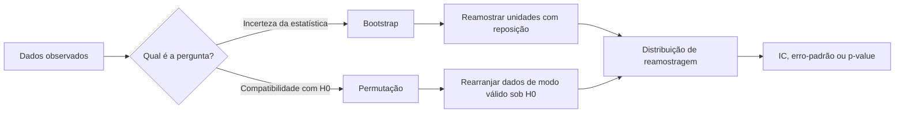
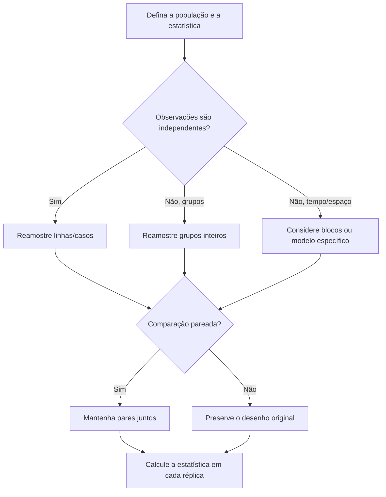

<!-- mirandastech-aula-v2 -->

# Aula 17 — Bootstrap e testes de permutação

> Como medir a incerteza de uma mediana, de um F1-score ou da diferença entre dois modelos quando uma fórmula pronta não parece adequada?

Na [Aula 16](16-tamanho-efeito.md), aprendemos que uma diferença pode ser estatisticamente detectável e, ainda assim, irrelevante na prática. Agora falta quantificar a incerteza dessa diferença e avaliar se ela seria plausível sob uma hipótese nula. **Bootstrap** e **permutação** resolvem essas duas perguntas por reamostragem: o computador recria muitas versões de um experimento que poderíamos ter observado.

O apelo é forte: não precisamos supor que toda estatística tenha distribuição normal. Mas reamostrar não conserta dados enviesados, dependência ignorada ou uma unidade experimental mal definida. A técnica só é tão válida quanto o desenho que ela imita.

## Objetivos

Ao final, você deverá ser capaz de:

- distinguir distribuição dos dados, distribuição amostral e distribuição de reamostragem;
- construir uma distribuição bootstrap e um intervalo de confiança percentil;
- explicar quando preferir intervalos básico ou BCa;
- formular um teste de permutação e identificar a transformação válida sob a hipótese nula;
- comparar reamostragem independente, pareada, por grupos e por blocos;
- calcular corretamente um p-value Monte Carlo que nunca seja zero;
- aplicar essas ideias a métricas e comparações de modelos de IA.

## Pré-requisitos

- distribuição amostral e erro-padrão, vistos na [Aula 10](10-lln-clt-monte-carlo.md);
- amostragem, representatividade e vazamento, vistos na [Aula 12](12-amostragem-vies-leakage.md);
- intervalos de confiança da [Aula 14](14-intervalos-confianca.md);
- testes de hipótese e p-value da [Aula 15](15-testes-pvalue-poder.md);
- tamanho de efeito da [Aula 16](16-tamanho-efeito.md).

## 1. O problema motivador

Uma equipe avalia a latência de uma API de inferência. Os tempos são assimétricos: a maioria das requisições é rápida, mas algumas são muito lentas. A mediana observada foi 182 ms. Qual é a incerteza dessa mediana?

Em outro experimento, dois classificadores A e B foram executados **nos mesmos exemplos**. O F1-score de B excedeu o de A em 0,031. Essa diferença pode ser apenas variação amostral?

Para médias normais e alguns estimadores, há fórmulas analíticas convenientes. Para medianas, quantis, razões e métricas não lineares como F1, a distribuição amostral pode ser difícil de derivar. A reamostragem substitui parte da álgebra por um experimento computacional reproduzível.

## 2. Vocabulário essencial

| Termo | Significado |
|---|---|
| **Estatística** | Número calculado na amostra, como média, mediana ou F1. |
| **Distribuição amostral** | Distribuição que a estatística teria em infinitas amostras novas da população. |
| **Reamostra bootstrap** | Amostra de tamanho \(n\), sorteada **com reposição** dos \(n\) casos observados. |
| **Distribuição bootstrap** | Valores da estatística obtidos em muitas reamostras bootstrap. |
| **Permutação** | Rearranjo dos dados que representa a hipótese nula. |
| **Trocabilidade** | Propriedade que permite permutar rótulos ou condições sem mudar a distribuição sob \(H_0\). |
| **Unidade de reamostragem** | Menor unidade considerada independente: pessoa, paciente, empresa, sessão etc. |
| **Reamostragem pareada** | Mantém juntas observações referentes à mesma unidade. |
| **Teste exato** | Examina todas as permutações possíveis. |
| **Teste Monte Carlo** | Usa uma amostra aleatória das permutações possíveis. |

Uma distinção importante: a **distribuição dos dados** descreve latências individuais; a **distribuição bootstrap da mediana** descreve a variação de medianas. Elas são objetos diferentes e, em geral, têm escalas e formatos diferentes.

## 3. Bootstrap: a intuição

Temos apenas uma amostra. A distribuição empírica atribui probabilidade \(1/n\) a cada observação e funciona como uma aproximação da população. Sorteando dessa distribuição com reposição, criamos novas amostras plausíveis.

Cada reamostra contém \(n\) posições, mas alguns casos aparecem repetidos e outros não aparecem. Isso é esperado: a reposição imita a possibilidade de outra amostra populacional conter observações semelhantes às já vistas.

Para dados \(x=(x_1,\ldots,x_n)\), estatística \(T\) e \(B\) repetições:

1. sorteie \(x^{*(b)}=(x_1^{*(b)},\ldots,x_n^{*(b)})\) com reposição de \(x\);
2. calcule \(T^{*(b)}=T(x^{*(b)})\);
3. repita para \(b=1,\ldots,B\);
4. use \(T^{*(1)},\ldots,T^{*(B)}\) para estimar erro-padrão e intervalo.

O erro-padrão bootstrap é o desvio-padrão das réplicas:

\[
\widehat{SE}_{boot}(T)=
\sqrt{\frac{1}{B-1}\sum_{b=1}^{B}\left(T^{*(b)}-\overline{T^*}\right)^2}.
\]

Com nível \(1-\alpha\), o intervalo percentil é:

\[
IC_{perc}=
\left[q_{\alpha/2}(T^*),\;q_{1-\alpha/2}(T^*)\right],
\]

em que \(q_p\) é o quantil de ordem \(p\) das réplicas bootstrap.

### Exemplo resolvido: mediana de latência

Considere dez latências, em milissegundos:

\[
120,\ 125,\ 128,\ 130,\ 132,\ 135,\ 141,\ 150,\ 190,\ 420.
\]

1. Ordenadas, as duas posições centrais são 132 e 135; a mediana é \((132+135)/2=133{,}5\) ms.
2. Uma reamostra possível é `120, 120, 125, 130, 130, 135, 141, 141, 190, 190`; sua mediana é 132,5 ms.
3. Outra pode repetir 420 e omitir valores baixos; sua mediana será maior.
4. Após milhares de reamostras, os quantis 2,5% e 97,5% das medianas formam um IC bootstrap de 95%.

O valor extremo influencia muito a média, mas pouco a mediana. O bootstrap preserva essa característica da estatística em vez de impor a fórmula da média.

## 4. Percentil, básico e BCa

Não existe um único “IC bootstrap”. Os três formatos mais comuns são:

| Método | Ideia | Vantagem | Limitação |
|---|---|---|---|
| Percentil | Usa diretamente os quantis de \(T^*\). | Simples e intuitivo. | Pode ter cobertura ruim com viés ou assimetria. |
| Básico | Reflete os quantis em torno de \(\hat T\). | Corrige deslocamento simples. | Ainda não corrige bem assimetria variável. |
| BCa | Ajusta viés e aceleração com informação tipo jackknife. | Frequentemente melhora a cobertura. | Mais caro e pode ser instável em amostras pequenas ou estatísticas não suaves. |

Se \(q_L\) e \(q_U\) são quantis bootstrap, o intervalo básico é

\[
IC_{basico}=[2\hat T-q_U,\;2\hat T-q_L].
\]

**BCa** significa *bias-corrected and accelerated*. A correção de viés considera onde \(\hat T\) cai na distribuição bootstrap; a aceleração considera como o erro-padrão muda com o parâmetro. Bibliotecas confiáveis são preferíveis à implementação manual do BCa.

Nenhum método transforma uma amostra ruim em boa evidência. Sempre inspecione a distribuição das réplicas, a estabilidade com diferentes seeds e a plausibilidade do intervalo.

## 5. O que deve ser reamostrado?

Esta é a decisão metodológica central. Reamostre **unidades independentes**, preservando toda estrutura interna relevante.

- Uma linha por pessoa independente: reamostre pessoas.
- Dez medições por paciente: reamostre pacientes, levando todas as dez medições junto.
- Séries temporais autocorrelacionadas: use blocos de tempo, não pontos isolados.
- Modelos A e B no mesmo item: reamostre o par `(y, previsão_A, previsão_B)`.
- Métrica por consulta com vários documentos: reamostre consultas, não documentos soltos.

Se 800 linhas vieram de 80 usuários, tratá-las como 800 unidades independentes costuma produzir intervalos estreitos demais. O laboratório mostrará esse efeito.

## 6. Teste de permutação: a intuição

O bootstrap pergunta: **como a estatística varia ao amostrar novamente da população aproximada pelos dados?** O teste de permutação pergunta: **quais valores da estatística seriam esperados se a hipótese nula fosse verdadeira?**

Suponha dois grupos independentes, tratamento e controle, e \(H_0\): as distribuições são iguais. Sob essa hipótese, os rótulos “tratamento” e “controle” são trocáveis. Mantemos os valores observados, embaralhamos os rótulos e recalculamos a diferença.

Para cada permutação \(\pi\):

\[
T^{(\pi)} = \bar X^{(\pi)}_{tratamento}-\bar X^{(\pi)}_{controle}.
\]

A proporção de valores permutados tão ou mais extremos que \(T_{obs}\) é o p-value. Em teste bilateral, “extremo” costuma significar \(|T^{(\pi)}|\ge |T_{obs}|\).

### A permutação precisa representar a hipótese nula

| Desenho | Transformação válida típica | O que não fazer |
|---|---|---|
| Dois grupos independentes | Embaralhar os rótulos entre unidades. | Quebrar blocos ou estratos do sorteio. |
| Antes/depois na mesma pessoa | Trocar as condições dentro de cada pessoa, ou inverter o sinal da diferença. | Embaralhar todas as medidas como independentes. |
| Dois modelos nos mesmos casos | Trocar A e B dentro de cada caso. | Permutar previsões separadamente e desfazer o pareamento. |
| Experimento em clusters | Permutar no nível dos clusters sorteados. | Permutar indivíduos quando o tratamento foi atribuído por escola/empresa. |

Trocabilidade não significa apenas “é possível embaralhar no código”. Ela deve decorrer do desenho ou de uma hipótese probabilística defensável.

## 7. Exemplo resolvido: comparação pareada

Para seis lotes, a redução de erro de B em relação a A foi:

\[
d=(0{,}08,\ 0{,}03,\ -0{,}01,\ 0{,}05,\ 0{,}02,\ 0{,}07).
\]

A diferença média observada é

\[
\bar d=\frac{0{,}24}{6}=0{,}04.
\]

Sob a hipótese nula de simetria/trocabilidade entre A e B dentro do par, cada diferença pode manter ou inverter seu sinal. Existem \(2^6=64\) combinações. Para cada vetor de sinais \(s_i\in\{-1,+1\}\), calculamos

\[
T_s=\frac{1}{6}\sum_{i=1}^{6}s_i d_i.
\]

O p-value bilateral exato é a fração das 64 médias com \(|T_s|\ge0{,}04\). Com muitos pares, enumerar \(2^n\) combinações fica inviável; usamos uma amostra aleatória de permutações.

## 8. p-value Monte Carlo: por que nunca deve ser zero

Se geramos \(B\) permutações aleatórias e \(b\) delas são tão extremas quanto a observada, use

\[
\hat p=\frac{b+1}{B+1}.
\]

O `+1` inclui a configuração observada e fornece a aproximação conservadora apropriada quando as permutações foram amostradas. Se nenhuma das 9.999 permutações superar o observado, o resultado é \(1/10.000=0{,}0001\), e não zero.

Isso também revela a resolução do experimento: o menor p-value possível é \(1/(B+1)\). Para distinguir valores próximos de 0,001, são necessárias muito mais que 999 permutações. Aumente \(B\), reporte a regra usada e fixe a seed.

Em enumeração **exata** de todas as permutações, conta-se diretamente a proporção no espaço completo; a correção Monte Carlo não é necessária.

## 9. Bootstrap ou permutação?

| Aspecto | Bootstrap | Permutação |
|---|---|---|
| Pergunta | Qual é a incerteza de \(\hat T\)? | Os dados são compatíveis com \(H_0\)? |
| Operação | Amostrar com reposição. | Rearranjar sem reposição sob restrições de \(H_0\). |
| Saída típica | Erro-padrão, viés e IC. | Distribuição nula e p-value. |
| Centro da distribuição | Próximo da estatística observada. | Próximo do valor imposto pela hipótese nula. |
| Suposição crucial | Amostra representa a população e unidades são corretas. | Transformações são trocáveis sob \(H_0\). |
| Uso conjunto | IC do efeito. | Evidência contra a hipótese nula. |

Uma análise madura costuma reportar os dois lados: magnitude com IC e teste compatível com o desenho. O p-value não substitui o tamanho de efeito.

## 10. Aplicações em IA e aprendizado de máquina

### IC de F1 e diferença entre modelos

F1 é uma razão não linear baseada em verdadeiros positivos, falsos positivos e falsos negativos. Um bootstrap por casos pode estimar seu IC. Para comparar modelos nos mesmos casos, use **os mesmos índices** em cada réplica e calcule \(F1_B^*-F1_A^*\). Reamostrar cada modelo separadamente destrói a correlação e responde a outra pergunta.

Se a classe positiva for rara, algumas reamostras pequenas podem não conter positivos; F1 pode ficar indefinido. Defina a convenção antes da análise, aumente a amostra ou reamostre de modo estratificado quando isso corresponder ao desenho.

### Modelo fixo ou treinamento completo?

Há dois alvos diferentes:

1. **Incerteza condicional do teste:** mantenha os modelos treinados fixos e reamostre casos do conjunto de teste.
2. **Incerteza do pipeline:** reamostre os dados de desenvolvimento, refaça treinamento, seleção e avaliação em cada réplica.

O segundo inclui variabilidade do treinamento, mas é muito mais caro. Declare qual estimando está sendo analisado. Não chame o primeiro de “incerteza total do sistema”.

### Seeds, splits e conjunto de teste

Variação entre seeds ou divisões de dados pode ser a unidade relevante. Trate execuções pareadas com o mesmo split como pares. Não consulte repetidamente o teste final para ajustar o modelo: bootstrap e permutação não eliminam vazamento decorrente de escolhas guiadas pelo teste.

## 11. Armadilhas e erros comuns

1. **Reamostrar linhas correlacionadas como independentes.** O IC fica otimista; use clusters ou blocos.
2. **Quebrar o pareamento.** Em comparações no mesmo caso, índices e trocas devem ser compartilhados.
3. **Confundir bootstrap com geração de dados novos.** Ele reutiliza o suporte empírico; não inventa regiões ausentes.
4. **Usar poucas réplicas.** Os quantis e p-values ficam ruidosos. Faça análise de estabilidade.
5. **Reportar p = 0.** Use \((b+1)/(B+1)\) em permutação aleatória.
6. **Permutar sem justificar trocabilidade.** O código roda, mas o teste pode ser inválido.
7. **Reamostrar após escolher a melhor hipótese entre muitas.** A incerteza deve incluir a seleção ou usar dados separados.
8. **Ignorar amostra pequena ou extremo essencial.** O bootstrap não observa valores que não estão na amostra.
9. **Achar que não paramétrico significa “sem suposições”.** Representatividade, independência e desenho continuam essenciais.
10. **Interpretar IC como garantia individual.** Ele descreve incerteza do estimador, não um intervalo de previsão para cada novo caso.

## 12. Checklist prático

- [ ] Escrevi a população, a unidade experimental e a estatística antes do código.
- [ ] Identifiquei pares, clusters, estratos ou dependência temporal.
- [ ] A reamostragem preserva o desenho original.
- [ ] Fixei e documentei a seed e o número de réplicas.
- [ ] Inspecionei a distribuição das réplicas e valores indefinidos.
- [ ] Comparei o resultado para números crescentes de réplicas.
- [ ] No teste, descrevi exatamente \(H_0\) e por que a transformação é trocável.
- [ ] Usei \((b+1)/(B+1)\) para permutações Monte Carlo.
- [ ] Reportei efeito, IC, p-value e relevância prática quando aplicável.
- [ ] Evitei reutilizar o conjunto de teste para seleção ou ajuste.

## 13. Laboratório reproduzível

O [notebook da Aula 17](../notebooks/17-bootstrap-permutacao-laboratorio.ipynb) usa Python, NumPy, pandas, SciPy e Matplotlib, com seed fixa. Ele inclui:

- IC percentil e BCa para a mediana de latências assimétricas;
- estabilidade Monte Carlo conforme cresce o número de réplicas;
- bootstrap pareado da diferença de F1 entre dois classificadores;
- teste de permutação pareado com a correção \((b+1)/(B+1)\);
- enumeração exata para uma amostra pequena;
- comparação entre bootstrap ingênuo por linhas e bootstrap por usuário.

As células contêm `assert`s para verificar os resultados e podem ser executadas de cima para baixo no Colab.

## 14. Exercícios

### 1. Com ou sem reposição?

Uma amostra contém 100 clientes. No bootstrap, quantos clientes são sorteados por réplica e um cliente pode aparecer mais de uma vez?

### 2. Unidade correta

Há 50 pacientes, cada um com quatro imagens. Você quer um IC da acurácia do sistema para a população de pacientes. O que deve ser reamostrado?

### 3. Pareamento

Modelos A e B previram os mesmos 2.000 exemplos. Descreva uma réplica bootstrap válida para a diferença de F1.

### 4. Permutação Monte Carlo

Em 9.999 permutações aleatórias, 24 estatísticas foram tão extremas quanto a observada. Calcule o p-value corrigido.

### 5. Trocabilidade

Em um ensaio, o tratamento foi sorteado por escola, mas o analista permutou rótulos entre alunos. Qual é o problema?

### 6. Bootstrap e viés de seleção

Uma pesquisa por aplicativo excluiu pessoas sem smartphone. Um IC bootstrap estreito resolve a falta de representatividade? Justifique.

## 15. Respostas comentadas

### 1.

São sorteadas 100 posições **com reposição**. Um cliente pode aparecer várias vezes e outro pode ficar ausente. O tamanho da réplica permanece 100.

### 2.

Reamostre os 50 pacientes, levando as quatro imagens de cada paciente junto. As imagens do mesmo paciente não são unidades independentes.

### 3.

Sorteie 2.000 índices de casos com reposição. Use exatamente esses índices para `y`, previsões de A e previsões de B; calcule os dois F1 e armazene \(F1_B^*-F1_A^*\).

### 4.

\[
\hat p=\frac{24+1}{9.999+1}=\frac{25}{10.000}=0{,}0025.
\]

### 5.

A atribuição ocorreu no nível da escola; alunos da mesma escola compartilham condição e contexto. Permutar alunos quebra o desenho e cria unidades falsamente independentes. A permutação deve ocorrer entre escolas de forma compatível com o sorteio, possivelmente dentro de estratos.

### 6.

Não. O bootstrap aproxima a população pela amostra observada; pessoas ausentes do mecanismo de coleta não surgirão nas reamostras. O intervalo pode quantificar precisão condicional à amostra enviesada, não corrigir o viés de cobertura.

## 16. Resumo

- Bootstrap aproxima a distribuição amostral reamostrando unidades com reposição.
- O IC percentil é simples; básico e BCa tratam algumas formas de viés e assimetria.
- A unidade de reamostragem deve refletir a independência real e preservar pares, grupos ou blocos.
- Permutação constrói uma distribuição nula por transformações justificadas pela trocabilidade.
- Em permutação aleatória, \((b+1)/(B+1)\) impede p-values impossíveis iguais a zero.
- Em IA, declare se o alvo é a incerteza do conjunto de teste com modelo fixo ou do pipeline completo.
- Reamostragem não corrige seleção, vazamento, dependência ignorada nem falta de representatividade.

## 17. Próxima aula

Um teste isolado controla seu próprio erro tipo I. Mas projetos reais comparam muitas métricas, grupos, modelos e hiperparâmetros. Na [Aula 18 — Comparações múltiplas, FDR e ANOVA](18-multiplos-testes-anova.md), veremos por que a chance de falsos positivos cresce, como controlar FWER/FDR e como organizar comparações globais antes de testes pós-hoc.

## Referências técnicas

- EFRON, Bradley. [Bootstrap Methods: Another Look at the Jackknife](https://doi.org/10.1214/aos/1176344552). *The Annals of Statistics*, 1979. Artigo fundador.
- PHIPSON, Belinda; SMYTH, Gordon K. [Permutation P-values Should Never Be Zero](https://doi.org/10.2202/1544-6115.1585). *Statistical Applications in Genetics and Molecular Biology*, 2010.
- SCIPY. [`scipy.stats.bootstrap`](https://docs.scipy.org/doc/scipy/reference/generated/scipy.stats.bootstrap.html). Documentação oficial, incluindo o método BCa.
- SCIPY. [`scipy.stats.permutation_test`](https://docs.scipy.org/doc/scipy/reference/generated/scipy.stats.permutation_test.html). Documentação oficial sobre tipos de permutação e p-values aleatórios.
- JAMES, Gareth et al. [*An Introduction to Statistical Learning — Python resources*](https://www.statlearning.com/resources-python). Capítulo de métodos de reamostragem.

## Material complementar

- DOWNEY, Allen. [*Think Stats*, 2ª ed.](https://greenteapress.com/wp/think-stats-2e/). Livro aberto com exemplos computacionais de estimação e testes.
- DIEZ, David; BARR, Christopher; ÇETINKAYA-RUNDEL, Mine. [*OpenIntro Statistics*](https://www.openintro.org/book/os/). Livro aberto para revisão de inferência estatística.
