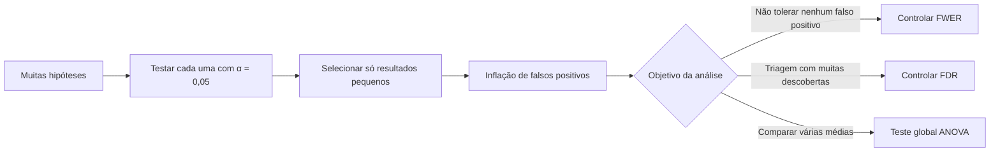
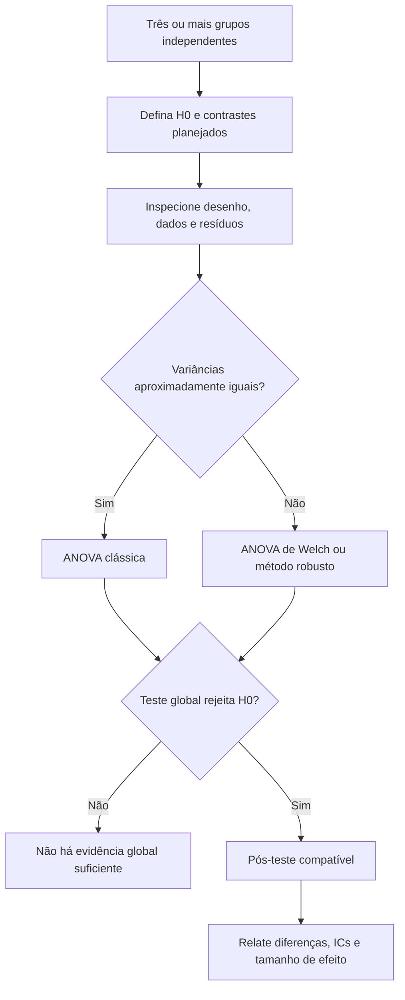

<!-- mirandastech-aula-v2 -->

# Aula 18 — Comparações múltiplas, FDR e ANOVA

> Se você comparar cem prompts, modelos ou segmentos e publicar apenas os p-values menores que 0,05, quase certamente encontrará uma “descoberta” — mesmo quando nada mudou.

Na [Aula 17](17-bootstrap-permutacao.md), construímos intervalos por bootstrap e distribuições nulas por permutação. Esses procedimentos tratavam uma pergunta bem definida. Projetos reais, porém, costumam testar muitas perguntas: dez modelos, cinco métricas, quatro públicos e três janelas de tempo já produzem \(10\times5\times4\times3=600\) comparações.

Esta aula ensina a reconhecer essa **multiplicidade**, escolher a taxa de erro que precisa ser controlada e usar ANOVA para começar uma comparação de várias médias com um teste global. O objetivo não é “fazer p-values passarem”, mas alinhar análise, desenho e decisão.

## Objetivos

Ao final, você deverá ser capaz de:

- explicar por que repetir testes aumenta a probabilidade de falsos positivos;
- definir família de hipóteses, FWER e FDR;
- aplicar e interpretar Bonferroni, Holm e Benjamini–Hochberg;
- executar o algoritmo de Benjamini–Hochberg manualmente;
- formular e interpretar uma ANOVA de uma via;
- verificar independência, resíduos e homogeneidade de variâncias;
- distinguir teste global, tamanho de efeito e comparações pós-hoc;
- planejar comparações de modelos, prompts e métricas sem *cherry-picking*.

## Pré-requisitos

- p-value, erros tipo I/II e poder da [Aula 15](15-testes-pvalue-poder.md);
- tamanho de efeito e relevância prática da [Aula 16](16-tamanho-efeito.md);
- testes por permutação e unidade experimental da [Aula 17](17-bootstrap-permutacao.md).

## 1. Problema motivador: o campeão por acaso

Uma equipe avalia 100 variações de prompt. Todas têm, na realidade, a mesma qualidade. Para cada uma, é feito um teste ao nível \(\alpha=0{,}05\). Qual é a chance de aparecer ao menos um resultado “significativo” apenas por acaso?

Se os testes fossem independentes e todas as hipóteses nulas fossem verdadeiras, a chance de nenhum falso positivo seria \((1-\alpha)^m\). Portanto,

\[
P(\text{ao menos um falso positivo})=1-(1-\alpha)^m.
\]

Para \(m=100\):

\[
1-0{,}95^{100}\approx0{,}9941.
\]

Ou seja, há aproximadamente **99,4%** de chance de pelo menos um falso positivo. A fórmula exata depende da independência, mas a mensagem permanece: olhar apenas os menores p-values após muitas tentativas cria evidência ilusória.

## 2. Vocabulário essencial

| Termo | Significado |
|---|---|
| **Família de hipóteses** | Conjunto de testes considerados em conjunto para uma decisão científica ou operacional. |
| **Descoberta** | Hipótese nula rejeitada. Não é sinônimo de efeito verdadeiro ou importante. |
| **FWER** | Probabilidade de cometer pelo menos um erro tipo I na família. |
| **FDR** | Valor esperado da proporção de falsas descobertas entre as rejeições. |
| **p-value ajustado** | Menor nível global no qual uma hipótese seria rejeitada pelo procedimento escolhido. |
| **Teste global** | Testa uma afirmação conjunta, como “todas as médias são iguais”. |
| **Pós-teste** | Comparação feita após um teste global, com controle de multiplicidade apropriado. |
| **Contraste** | Comparação planejada entre combinações de médias. |
| **ANOVA** | Análise de variância: compara variação entre grupos com a variação dentro dos grupos. |

### Defina a família antes de ver os resultados

Não existe uma regra puramente mecânica para agrupar testes. A família deve corresponder a uma decisão: por exemplo, “todas as alegações usadas para aprovar a versão 2 do modelo”. Separar artificialmente as métricas em famílias depois de ver os p-values enfraquece o controle prometido.

Pergunte: se qualquer resultado deste conjunto fosse positivo, eu o usaria para sustentar a mesma conclusão? Se sim, provavelmente pertence à mesma família.

## 3. FWER: proteger contra qualquer falso positivo

Se \(V\) é o número de hipóteses nulas verdadeiras rejeitadas indevidamente,

\[
FWER=P(V\ge1).
\]

Esse critério é apropriado quando um único falso positivo tem custo alto: aprovar um sistema inseguro, afirmar conformidade inexistente ou selecionar um biomarcador para uma decisão clínica.

### Bonferroni

Para \(m\) testes e nível familiar \(\alpha\), rejeite \(H_i\) somente se

\[
p_i\le\frac{\alpha}{m}.
\]

Equivalentemente, use \(p_i^{aj} = \min(mp_i,1)\). A desigualdade da união garante controle de FWER mesmo sem independência entre testes. Essa robustez custa poder: com muitos testes correlacionados, Bonferroni pode ser conservador.

**Exemplo.** Com 20 hipóteses e \(\alpha=0{,}05\), o limiar é \(0{,}0025\). Um p-value bruto de 0,004 não é rejeitado por Bonferroni, embora seja menor que 0,05.

### Holm: passo a passo e mais poder

Holm também controla FWER, mas usa limiares sequenciais:

1. ordene \(p_{(1)}\le\cdots\le p_{(m)}\);
2. compare \(p_{(1)}\) com \(\alpha/m\);
3. se rejeitar, compare \(p_{(2)}\) com \(\alpha/(m-1)\);
4. continue até a primeira não rejeição; pare e mantenha as restantes.

Holm é pelo menos tão poderoso quanto Bonferroni e também oferece controle forte de FWER sob dependência arbitrária. Por isso, é uma boa escolha confirmatória padrão quando não há motivo específico para o procedimento de um passo.

## 4. FDR: controlar a proporção de falsas descobertas

Em triagem científica, monitoramento ou seleção inicial de milhares de atributos, impedir qualquer falso positivo pode eliminar quase todo o poder. A taxa de falsas descobertas é

\[
FDR=E\left[\frac{V}{\max(R,1)}\right],
\]

em que \(R\) é o total de rejeições e \(V\) é o número de rejeições falsas. Se não houver rejeições, a proporção é definida como zero.

Controlar FDR a 5% não significa que cada descoberta tenha 95% de probabilidade de ser verdadeira. Significa um compromisso de longo prazo sobre a proporção esperada de erros entre as descobertas, sob as condições do método.

### Benjamini–Hochberg (BH)

Para \(m\) p-values e nível desejado \(q\):

1. ordene \(p_{(1)}\le\cdots\le p_{(m)}\);
2. calcule os limiares \(iq/m\), para \(i=1,\ldots,m\);
3. encontre o maior \(k\) tal que \(p_{(k)}\le kq/m\);
4. rejeite \(H_{(1)},\ldots,H_{(k)}\).

Considere \(m=6\), \(q=0{,}05\) e p-values ordenados:

| \(i\) | \(p_{(i)}\) | \(iq/m\) | Passa individualmente? |
|---:|---:|---:|---|
| 1 | 0,003 | 0,0083 | sim |
| 2 | 0,011 | 0,0167 | sim |
| 3 | 0,018 | 0,0250 | sim |
| 4 | 0,041 | 0,0333 | não |
| 5 | 0,200 | 0,0417 | não |
| 6 | 0,700 | 0,0500 | não |

O maior índice que passa é \(k=3\); rejeitamos as três primeiras hipóteses. Note que buscamos o **maior** índice válido e rejeitamos tudo até ele. Não se testa cada linha isoladamente como se as decisões fossem independentes.

O BH clássico controla FDR para testes independentes e em várias estruturas de dependência positiva. Dependência arbitrária pode exigir procedimentos como Benjamini–Yekutieli ou métodos específicos do desenho. Correlação entre métricas não deve ser ignorada apenas porque a biblioteca aceita um vetor de p-values.

## 5. Comparando os procedimentos

| Procedimento | Controla | Dependência | Perfil típico |
|---|---|---|---|
| Nenhum ajuste | Erro por teste | Não controla a família | Uma única hipótese pré-especificada. |
| Bonferroni | FWER | Válido sob dependência arbitrária | Simples, transparente e conservador. |
| Holm | FWER | Válido sob dependência arbitrária | Confirmatório; geralmente preferível a Bonferroni. |
| BH | FDR | Independência ou dependência positiva em sua forma clássica | Triagem e muitas descobertas potenciais. |
| BY | FDR | Dependência arbitrária | Mais conservador que BH. |

Escolha o erro de acordo com o custo da decisão, não com o método que produz mais asteriscos. FWER e FDR respondem a compromissos diferentes.

## 6. ANOVA de uma via: começar por uma pergunta global

Suponha três variantes de um sistema: A, B e C. Executar três testes t — A×B, A×C e B×C — já cria multiplicidade. A ANOVA de uma via começa com:

\[
H_0:\mu_A=\mu_B=\mu_C
\]

contra a alternativa de que **pelo menos uma** média difere. O modelo é

\[
Y_{ij}=\mu+\tau_i+\varepsilon_{ij},
\]

em que \(Y_{ij}\) é a observação \(j\) do grupo \(i\), \(\mu\) é a média geral, \(\tau_i\) é o efeito do grupo e \(\varepsilon_{ij}\) é o erro.

### Intuição da estatística F

A soma de quadrados total é particionada:

\[
SS_T=SS_{entre}+SS_{dentro}.
\]

Para \(k\) grupos e \(N\) observações:

\[
MS_{entre}=\frac{SS_{entre}}{k-1},\qquad
MS_{dentro}=\frac{SS_{dentro}}{N-k},
\]

e

\[
F=\frac{MS_{entre}}{MS_{dentro}}.
\]

Se as médias estão próximas em relação à dispersão interna, \(F\) tende a ficar perto de 1. Se a separação entre grupos é grande, \(F\) cresce. O p-value mede a incompatibilidade do \(F\) observado com o modelo nulo e suas premissas.

## 7. Premissas e diagnósticos

### Independência

É a premissa mais importante e vem do desenho, não de um teste automático. Medições repetidas da mesma pessoa, várias imagens do mesmo paciente ou execuções no mesmo *split* exigem métodos pareados, de medidas repetidas, mistos ou reamostragem por grupos.

### Normalidade dos resíduos

A ANOVA clássica pressupõe erros aproximadamente normais em cada grupo. Não é necessário que os dados agregados tenham uma única distribuição normal. Histogramas e gráficos Q–Q ajudam; testes automáticos podem rejeitar desvios irrelevantes em amostras grandes ou ter pouco poder em amostras pequenas.

### Homogeneidade de variâncias

A variância residual deve ser semelhante entre grupos, especialmente em desenhos desbalanceados. O teste de Levene é um auxílio, não uma licença mecânica. Se dispersões diferem, considere ANOVA de Welch; o pós-teste também deve ser compatível, como Games–Howell.

### Observações extremas e escala

Outliers podem dominar somas de quadrados. Investigue a origem, reporte análise de sensibilidade e nunca remova pontos apenas para obter significância. Transformações devem ter justificativa substantiva.

## 8. Um resultado global não identifica os grupos

Rejeitar \(H_0\) da ANOVA permite concluir apenas que nem todas as médias são iguais. Não autoriza dizer automaticamente que C é melhor que A ou que todos os pares diferem.

Depois do teste global, escolha:

- **Tukey HSD** para todas as comparações pareadas, sob premissas compatíveis, controlando FWER;
- **Games–Howell** quando variâncias e tamanhos diferem;
- **contrastes planejados** quando poucas comparações foram definidas antes da análise;
- métodos robustos, permutacionais ou hierárquicos quando o desenho exige.

Evite a regra “só faço pós-teste se ANOVA for significativa” como dogma universal: contrastes confirmatórios pré-especificados podem ser as perguntas principais. O plano deve vir antes dos resultados.

## 9. Tamanho de efeito na ANOVA

Com \(SS_T\) total:

\[
\eta^2=\frac{SS_{entre}}{SS_T}.
\]

O \(\eta^2\) amostral é a proporção da variabilidade observada associada aos grupos, mas tende a ser otimista. Uma correção comum é

\[
\omega^2=
\frac{SS_{entre}-(k-1)MS_{dentro}}
{SS_T+MS_{dentro}}.
\]

Relate também médias, desvios, diferenças e intervalos. Um p-value global pequeno pode acompanhar um efeito pequeno em uma amostra enorme; a decisão depende da relevância prática definida na Aula 16.

## 10. Conexões com IA e ML

### Modelos, prompts e métricas

Testar cada combinação de modelo, prompt, temperatura, métrica e subgrupo amplia a família. Pré-registre a métrica principal e poucas comparações confirmatórias; trate o restante como exploratório e aplique controle adequado.

### O conjunto de teste também pode ser “consumido”

Selecionar repetidamente o melhor sistema pelo mesmo teste final adapta o processo a esse conjunto, mesmo sem treinar pesos nele. Ajustar p-values da rodada atual não remove esse vazamento histórico. Use validação para desenvolvimento e preserve um teste final para a avaliação confirmatória.

### Pares e seeds

Se todos os modelos usam os mesmos exemplos ou seeds, o desenho é pareado. ANOVA independente não representa essa estrutura. Compare diferenças por caso/seed ou use medidas repetidas, modelos mistos ou permutação pareada conforme o estimando.

### Subgrupos e auditoria

Análises de desempenho por muitos grupos são importantes para segurança e equidade, mas geram multiplicidade e grupos pequenos. Reporte denominadores, ICs, regra de formação da família, resultados negativos e limitações. FDR pode apoiar triagem; decisões críticas podem exigir FWER e confirmação independente.

## 11. Fluxo prático de decisão

1. Escreva a pergunta e a unidade experimental.
2. Liste todas as hipóteses que podem sustentar a mesma decisão.
3. Separe comparações confirmatórias e exploratórias antes de calcular p-values.
4. Escolha FWER quando um falso positivo é grave; FDR quando a proporção entre várias descobertas é o alvo.
5. Para várias médias, formule um teste global ou contrastes planejados.
6. Verifique se o desenho é independente, pareado, em blocos ou clusters.
7. Faça diagnósticos de resíduos e variância; escolha método compatível.
8. Relate p-values brutos e ajustados, método, família, efeito e IC.
9. Registre quantos testes foram tentados, inclusive os resultados não publicados.

## 12. Armadilhas e erros comuns

1. **Definir a família depois de ver os resultados.** Isso permite “fatiar” o problema até algo passar.
2. **Achar que \(p<0{,}05\) em cada teste controla 5% globalmente.** Controla apenas o erro por teste.
3. **Interpretar FDR como probabilidade individual de a hipótese ser falsa.** FDR é uma propriedade média do procedimento.
4. **Aplicar BH e ignorar dependência.** A validade depende da estrutura; declare a suposição.
5. **Escolher Bonferroni sempre.** Ele é seguro, mas pode desperdiçar poder quando outro controle corresponde melhor ao objetivo.
6. **Concluir quais grupos diferem apenas com ANOVA.** O teste global não localiza diferenças.
7. **Fazer todos os pares sem ajuste.** O pós-teste também pertence à família.
8. **Testar normalidade dos dados misturados.** O foco são resíduos condicionais ao grupo.
9. **Ignorar pareamento ou clusters.** Independência falsa produz erro-padrão incorreto.
10. **Reportar só asteriscos.** Inclua estimativas, ICs, tamanho de efeito e relevância.
11. **Usar o teste final como painel de desenvolvimento.** Correções não desfazem seleção adaptativa acumulada.

## 13. Checklist de publicação

- [ ] Família de hipóteses definida e justificada.
- [ ] Comparações confirmatórias separadas das exploratórias.
- [ ] Taxa controlada identificada: erro por teste, FWER ou FDR.
- [ ] Procedimento e versão da biblioteca registrados.
- [ ] p-values brutos e ajustados apresentados sem arredondar para zero.
- [ ] Unidade experimental, pareamento, blocos e clusters descritos.
- [ ] Para ANOVA, modelo, premissas e diagnósticos documentados.
- [ ] Pós-teste compatível com o teste global e com as variâncias.
- [ ] Efeito, IC e critério de relevância prática reportados.
- [ ] Todos os testes tentados e resultados negativos permanecem auditáveis.

## 14. Laboratório reproduzível

O [notebook da Aula 18](../notebooks/18-multiplos-testes-anova-laboratorio.ipynb) usa Python, NumPy, pandas, SciPy e Matplotlib com seed fixa. Ele contém:

- simulação de 100 testes sob a hipótese nula;
- comparação empírica entre ausência de ajuste, Bonferroni, Holm e BH;
- implementações auditáveis de Bonferroni, Holm e BH, verificadas por propriedades matemáticas;
- cenário com hipóteses nulas e efeitos reais para medir descobertas, falsos positivos e poder;
- ANOVA clássica e de Welch para três variantes;
- diagnósticos de resíduos e variâncias;
- Tukey HSD e cálculos de \(\eta^2\) e \(\omega^2\).

## 15. Exercícios

### 1. Inflação do erro

Calcule a probabilidade de ao menos um falso positivo em 20 testes independentes, todos sob \(H_0\), com \(\alpha=0{,}05\).

### 2. Bonferroni

Qual é o limiar por teste para 25 hipóteses e FWER de 5%? Um p-value de 0,0018 é rejeitado?

### 3. Benjamini–Hochberg

Para \(q=0{,}05\) e p-values ordenados \(0{,}004, 0{,}012, 0{,}030, 0{,}040\), encontre \(k\) e as rejeições.

### 4. Interpretação de ANOVA

Uma ANOVA de quatro modelos produz \(F=6{,}2\) e \(p=0{,}001\). O que é possível concluir sem pós-teste?

### 5. Escolha da taxa

Você faz triagem de 10.000 atributos para gerar candidatos que serão validados em outro conjunto. FWER ou FDR tende a corresponder melhor ao objetivo? E se uma única descoberta falsa liberar automaticamente um sistema crítico?

### 6. Unidade experimental

Três modelos são avaliados nas mesmas 30 seeds. Por que uma ANOVA independente de 90 resultados é inadequada?

## 16. Respostas comentadas

### 1.

\[
1-0{,}95^{20}\approx0{,}6415.
\]

Mesmo com apenas 20 testes, a chance é aproximadamente 64,2% sob independência.

### 2.

\[
\alpha^*=0{,}05/25=0{,}002.
\]

Como \(0{,}0018<0{,}002\), a hipótese é rejeitada por Bonferroni.

### 3.

Os limiares são 0,0125; 0,025; 0,0375; 0,05. Todos os quatro p-values satisfazem seus respectivos limiares; o maior índice válido é \(k=4\), então os quatro são rejeitados. No algoritmo *step-up*, uma linha anterior não deve ser usada isoladamente para interromper a busca pelo maior \(k\).

### 4.

Há evidência contra a igualdade de todas as quatro médias; pelo menos uma difere. Não é possível afirmar quais pares diferem, a direção ou a importância prática sem estimativas e comparações adicionais.

### 5.

Na triagem seguida de validação independente, FDR costuma equilibrar descobertas e proporção esperada de erros. Se qualquer falso positivo produz dano crítico imediato, o controle de FWER é mais coerente, possivelmente com requisitos ainda mais rigorosos.

### 6.

Resultados obtidos na mesma seed compartilham condições e são pareados. Tratar 90 valores como independentes ignora essa correlação. A análise deve usar seed como bloco/unidade, por exemplo com medidas repetidas, diferenças pareadas ou modelo misto.

## 17. Resumo

- Muitos testes aumentam a chance de falsos positivos; a família deve ser definida antes dos resultados.
- Bonferroni e Holm controlam FWER; Holm normalmente preserva mais poder.
- BH controla FDR sob condições específicas e é adequado a cenários com muitas descobertas potenciais.
- ANOVA testa globalmente a igualdade de várias médias comparando variação entre e dentro dos grupos.
- Rejeitar a ANOVA não identifica os pares; pós-testes e contrastes precisam de controle próprio.
- Independência vem do desenho; resíduos, variâncias e observações extremas exigem diagnóstico.
- Em IA, multiplicidade surge em modelos, prompts, métricas, seeds e subgrupos, além da seleção adaptativa acumulada.
- Resultados completos incluem efeito, IC, método de ajuste e relevância prática — não apenas p-values.

## 18. Próxima aula

ANOVA organiza diferenças entre grupos categóricos. Na [Aula 19 — Correlação, covariância e causalidade](19-correlacao-causalidade.md), passaremos a relações entre variáveis quantitativas, comparando Pearson e Spearman e examinando não linearidade, confundimento e o paradoxo de Simpson sem confundir associação com causa.

## Referências técnicas

- BENJAMINI, Yoav; HOCHBERG, Yosef. [Controlling the False Discovery Rate: A Practical and Powerful Approach to Multiple Testing](https://doi.org/10.1111/j.2517-6161.1995.tb02031.x). *Journal of the Royal Statistical Society: Series B*, 1995.
- HOLM, Sture. [A Simple Sequentially Rejective Multiple Test Procedure](https://www.jstor.org/stable/4615733). *Scandinavian Journal of Statistics*, 1979.
- NIST/SEMATECH. [One-Way ANOVA](https://www.itl.nist.gov/div898/handbook/prc/section4/prc431.htm) e [modelo e premissas](https://www.itl.nist.gov/div898/handbook/prc/section4/prc432.htm).
- STATSMODELS. [`statsmodels.stats.multitest.multipletests`](https://www.statsmodels.org/stable/generated/statsmodels.stats.multitest.multipletests.html). Documentação oficial.
- SCIPY. [`scipy.stats.f_oneway`](https://docs.scipy.org/doc/scipy/reference/generated/scipy.stats.f_oneway.html). Documentação oficial, incluindo ANOVA de Welch.

## Material complementar

- ISLP. [Multiple Testing — laboratório em Python](https://islp.readthedocs.io/en/latest/labs/Ch13-multiple-lab.html).
- DIEZ, David; BARR, Christopher; ÇETINKAYA-RUNDEL, Mine. [*OpenIntro Statistics*](https://www.openintro.org/book/os/). Livro aberto sobre inferência e comparação de grupos.
