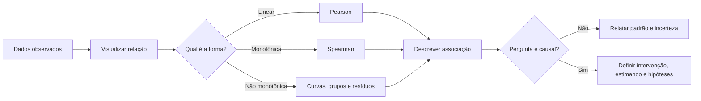
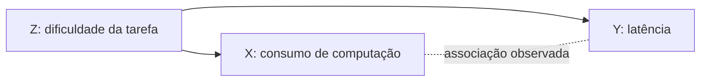
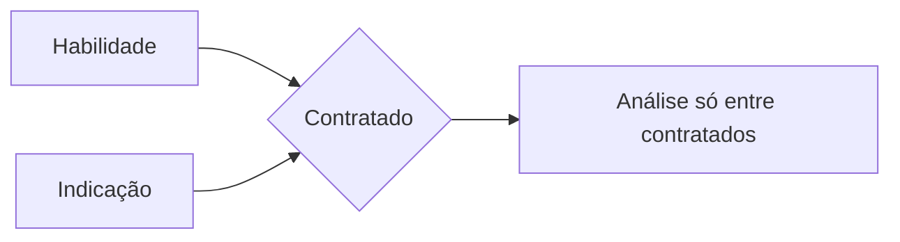

<!-- mirandastech-aula-v2 -->

# Aula 19 — Correlação, covariância e causalidade: o que não concluir

> Um modelo maior aparece associado a melhor desempenho. Aumentar o número de parâmetros **causará** a melhora? A correlação sozinha não responde.

Na [Aula 18](18-multiplos-testes-anova.md), aprendemos a comparar grupos sem fabricar descobertas por multiplicidade. Agora examinaremos relações entre variáveis quantitativas. Correlação é valiosa para explorar dados, detectar redundâncias e auditar *features*, mas não identifica automaticamente mecanismos nem efeitos de intervenção.

Esta aula separa três perguntas:

1. duas variáveis variam juntas?
2. qual forma descreve essa associação?
3. o que aconteceria com \(Y\) se interviéssemos em \(X\)?

As duas primeiras são associativas; a terceira é causal e exige hipóteses adicionais ou desenho experimental.

## Objetivos

Ao final, você deverá ser capaz de:

- interpretar covariância e correlações de Pearson e Spearman;
- distinguir associação linear, monotônica e não monotônica;
- usar gráficos antes de resumir uma relação em um único número;
- reconhecer influência de outliers, amplitude restrita e erro de medição;
- explicar confundimento, causalidade reversa, seleção e viés de colisor;
- interpretar o paradoxo de Simpson;
- diferenciar previsão de efeito causal;
- escrever conclusões que respeitem o que os dados realmente identificam.

## Pré-requisitos

- esperança, variância e covariância da [Aula 06](06-esperanca-variancia-covariancia.md);
- amostragem e viés de seleção da [Aula 12](12-amostragem-vies-leakage.md);
- intervalos, testes e tamanho de efeito das Aulas [14](14-intervalos-confianca.md), [15](15-testes-pvalue-poder.md) e [16](16-tamanho-efeito.md);
- multiplicidade da [Aula 18](18-multiplos-testes-anova.md).

## 1. Intuição: movimento conjunto não é mecanismo

Considere consumo de energia de um servidor e latência de inferência. Quando um cresce, o outro também pode crescer. Essa associação pode ocorrer porque:

- o consumo elevado aumenta a temperatura e reduz o desempenho;
- cargas de trabalho difíceis aumentam simultaneamente consumo e latência;
- a latência faz o escalonador ativar mais recursos;
- só observamos horários de pico, criando seleção;
- a associação surgiu por acaso entre muitas métricas inspecionadas.

O mesmo gráfico é compatível com explicações causais diferentes. A estatística resume o padrão observado; o mecanismo depende de conhecimento do domínio, temporalidade, desenho e hipóteses identificadoras.

## 2. Vocabulário essencial

| Termo | Significado |
|---|---|
| **Covariância** | Medida, dependente das unidades, do movimento conjunto linear. |
| **Correlação** | Medida padronizada de associação entre variáveis. |
| **Pearson \(r\)** | Correlação da relação linear. |
| **Spearman \(\rho_s\)** | Correlação de Pearson aplicada aos postos; mede associação monotônica. |
| **Monotônica** | Relação que só cresce ou só decresce, sem exigir linha reta. |
| **Confundidor** | Causa comum de exposição e desfecho que pode distorcer a associação. |
| **Colisor** | Variável causada por duas outras; condicioná-la pode criar associação espúria. |
| **Estimando** | Quantidade-alvo bem definida, como efeito médio de uma intervenção. |
| **Intervenção** | Ação que define o contraste causal, não mera observação de \(X\). |
| **Paradoxo de Simpson** | Reversão ou alteração de uma associação ao agregar estratos. |

## 3. Covariância: o ponto de partida

Para variáveis aleatórias \(X\) e \(Y\):

\[
\operatorname{Cov}(X,Y)=E[(X-E[X])(Y-E[Y])].
\]

Na amostra:

\[
s_{XY}=\frac{1}{n-1}\sum_{i=1}^{n}(x_i-\bar x)(y_i-\bar y).
\]

- covariância positiva: valores acima da média de \(X\) tendem a acompanhar valores acima da média de \(Y\);
- negativa: desvios costumam ter sinais opostos;
- próxima de zero: não há movimento **linear** evidente.

A magnitude depende das unidades. Trocar segundos por milissegundos multiplica a covariância por mil. Por isso, valores de covariância de pares diferentes raramente são comparáveis diretamente.

## 4. Pearson: associação linear padronizada

O coeficiente amostral de Pearson é

\[
r=\frac{s_{XY}}{s_Xs_Y},\qquad -1\le r\le1.
\]

Ele não tem unidade. \(r=1\) indica que todos os pontos estão sobre uma reta crescente; \(r=-1\), sobre uma reta decrescente; \(r\approx0\) indica ausência de associação linear, não independência.

### Exemplo resolvido

Para \(x=(1,2,3)\) e \(y=(2,4,6)\), temos \(y=2x\). Dobrar a escala de \(y\) aumenta a covariância, mas \(r=1\), pois a relação linear perfeita não mudou.

Agora use \(x=(-2,-1,0,1,2)\) e \(y=x^2=(4,1,0,1,4)\). \(Y\) é totalmente determinado por \(X\), mas produtos de desvios positivos e negativos se cancelam: \(r=0\). Há dependência forte e correlação linear nula.

### O que \(r^2\) não significa automaticamente

Em regressão linear simples com intercepto, \(r^2\) coincide com a fração da variabilidade amostral de \(Y\) explicada pela reta ajustada. Fora desse contexto, chamá-lo de “percentual causado por \(X\)” é incorreto. Nem \(r\) nem \(r^2\) estabelecem causalidade.

## 5. Spearman: associação monotônica por postos

Spearman substitui valores por seus postos e calcula Pearson sobre esses postos:

\[
\rho_s=\operatorname{Corr}(R_X,R_Y).
\]

Se não houver empates, também pode ser escrito como

\[
\rho_s=1-\frac{6\sum d_i^2}{n(n^2-1)},
\]

em que \(d_i) é a diferença entre postos. Com empates, use postos médios e uma implementação confiável.

Spearman é útil quando a relação é crescente ou decrescente, mas curva; também é menos sensível à magnitude de outliers. Ele **não** detecta toda não linearidade: uma curva em U não é monotônica e pode ter Pearson e Spearman próximos de zero.

| Situação | Pearson | Spearman | Ação recomendada |
|---|---|---|---|
| Reta com ruído | Adequado | Também detecta | Relate gráfico e IC. |
| Curva monotônica | Pode subestimar | Geralmente adequado | Compare ambos e visualize. |
| Curva em U | Pode ser zero | Também pode ser zero | Modele a forma; não conclua independência. |
| Outlier de alta alavancagem | Pode mudar muito | Frequentemente menos afetado | Investigue o ponto e faça sensibilidade. |
| Muitos empates | Válido com tratamento de empates | Requer postos médios | Documente o método. |

## 6. Sempre visualize: o quarteto de Anscombe

Francis Anscombe construiu quatro conjuntos com praticamente as mesmas médias, variâncias, correlação e reta de regressão. Os gráficos revelam, porém:

- uma relação linear plausível;
- uma curva que a reta não representa;
- um outlier influente;
- um único ponto de alta alavancagem sustentando a associação.

Uma tabela de estatísticas não substitui o diagrama de dispersão. Antes de interpretar correlação:

1. desenhe os pontos;
2. use cor ou painéis para grupos relevantes;
3. procure curvatura, clusters, limites e valores influentes;
4. observe a faixa de \(X\) efetivamente amostrada;
5. só então escolha um resumo.

## 7. Incerteza e teste de correlação

Uma correlação amostral é um estimador. Relate intervalo de confiança, tamanho da amostra e desenho. Para Pearson sob condições usuais, a transformação de Fisher é

\[
z=\operatorname{arctanh}(r),\qquad SE_z\approx\frac{1}{\sqrt{n-3}}.
\]

Constrói-se um intervalo em \(z\) e retorna-se por \(\tanh\). Bootstrap pareado também é possível: reamostre pares \((x_i,y_i)\), nunca cada coluna separadamente.

O teste usual de \(H_0:\rho=0\) não responde se o efeito é relevante, se a forma é linear ou se \(X\) causa \(Y\). Em amostras grandes, correlações minúsculas podem gerar p-values pequenos. Ao examinar centenas de *features*, aplique o controle de multiplicidade da Aula 18.

## 8. Cinco razões para não inferir causa de correlação

### 8.1 Confundimento

Uma variável \(Z\) causa \(X\) e \(Y\):

Mesmo que intervir no consumo não alterasse a latência, tarefas difíceis poderiam elevar ambos. Ajustar um confundidor exige que ele seja medido adequadamente e que as hipóteses causais sejam defensáveis.

### 8.2 Causalidade reversa

Talvez \(Y\) influencie \(X\). Um sistema pode alocar mais GPU **porque** detectou latência elevada. Dados transversais frequentemente não distinguem a direção.

### 8.3 Chance e multiplicidade

Com milhares de pares de variáveis, algumas correlações altas aparecem ao acaso. Selecionar a maior e calcular seu p-value como se fosse a única análise ignora o processo de busca.

### 8.4 Tendência comum

Duas séries podem crescer ao longo do tempo e, por isso, correlacionar-se mesmo sem ligação substantiva. Remover tendência sem um modelo temporal também pode ser inadequado; a dependência no tempo exige análise própria.

### 8.5 Seleção e colisor

Considere habilidade técnica \(X\) e indicação profissional \(Y\), inicialmente independentes, ambas aumentando a chance de contratação \(S\):

Ao condicionar em \(S=1\), pessoas com pouca indicação precisam compensar com mais habilidade e vice-versa. Surge correlação negativa entre \(X\) e \(Y\) na amostra selecionada, embora fossem independentes na população. Condicionar em um colisor **abre** um caminho espúrio.

## 9. Paradoxo de Simpson

Uma associação pode ser positiva em cada grupo e negativa nos dados agregados. Imagine dois modelos avaliados em tarefas fáceis e difíceis. Dentro de cada dificuldade, mais computação acompanha melhor qualidade; porém, tarefas difíceis recebem mais computação e têm notas menores. Ao juntar tudo, a correlação pode inverter.

Não existe regra “sempre ajuste” ou “nunca agregue”. A variável de estratificação pode ser confundidor, mediador, colisor ou apenas descritiva. A pergunta causal e o processo gerador determinam o que ajustar.

O paradoxo ensina duas práticas:

- visualize relações globais e estratificadas;
- desenhe o grafo causal antes de controlar variáveis automaticamente.

## 10. Associação, previsão e causalidade

| Pergunta | Exemplo | Evidência necessária |
|---|---|---|
| Descritiva | Consumo e latência variam juntos? | Amostra e resumo de associação. |
| Preditiva | Consumo melhora a previsão de latência em novos dados? | Validação fora da amostra. |
| Causal | Reduzir consumo em 10% mudará a latência? | Intervenção definida e identificação causal. |

Um preditor pode ser excelente sem ser causa: CEP prevê renda por refletir contexto, mas mudar o texto do CEP em um cadastro não muda automaticamente a renda. Inversamente, uma causa pode ter ganho preditivo pequeno quando seu efeito é modesto ou já está representado por outras variáveis.

### Defina o estimando

“Efeito de \(X\)” é vago. Uma pergunta melhor é: qual é a diferença média na latência em 24 horas se o mesmo conjunto de requisições fosse atendido com a política A em vez da política B? Isso explicita:

- população-alvo;
- intervenções comparadas;
- desfecho e horizonte temporal;
- resumo do efeito.

Nos próximos passos, serão necessárias hipóteses como consistência, positividade e ausência de confundimento não medido — ou randomização que sustente a comparação.

## 11. Conexões com IA e ML

### Seleção de *features*

Correlação alta entre *feature* e alvo pode indicar sinal, vazamento, proxy de atributo sensível ou consequência do próprio desfecho. Verifique disponibilidade temporal: a variável existia no momento da previsão?

### Importância de variável não é efeito causal

Coeficientes, SHAP e importância por permutação descrevem comportamento do modelo sob definições específicas. Eles não mostram, sozinhos, o efeito de intervir no mundo. Alterar uma *feature* isoladamente pode criar combinações impossíveis ou quebrar relações causais.

### Fairness e seleção

Auditar apenas casos aprovados, atendidos ou rotulados pode condicionar em decisões anteriores. A correlação entre grupo e erro nesse subconjunto pode refletir seleção. Documente quem entrou no dataset, quem ficou sem rótulo e por quê.

### Benchmarks e escala

Correlação entre parâmetros, FLOPs e desempenho combina arquitetura, dados, orçamento e seleção de experimentos. Ela descreve o histórico observado; não prova que aumentar somente parâmetros produzirá o mesmo ganho em outro regime.

### Agentes e observabilidade

Métricas de número de chamadas, custo, latência e sucesso podem ter causas comuns como dificuldade da tarefa. Antes de alterar uma política do agente, formule um experimento ou desenho quase-experimental que preserve unidade, temporalidade e guardrails.

## 12. Armadilhas e erros comuns

1. **“\(r=0\), então são independentes.”** Relações em U contradizem essa conclusão.
2. **“Spearman detecta qualquer relação.”** Ele resume monotonicidade, não toda dependência.
3. **Comparar magnitudes sem gráfico.** Outliers e clusters podem dominar o número.
4. **Remover outlier porque reduz \(r\).** Investigue origem e relate sensibilidade.
5. **Misturar grupos.** A associação agregada pode esconder ou inverter relações internas.
6. **Controlar todas as variáveis disponíveis.** Ajustar mediadores ou colisores pode introduzir viés.
7. **Confundir importância preditiva com efeito de intervenção.** São estimandos diferentes.
8. **Ignorar a unidade experimental.** Muitas linhas da mesma pessoa não são observações independentes.
9. **Examinar muitas correlações sem correção.** A maior associação pode ser seleção pelo acaso.
10. **Usar linguagem causal em estudo observacional sem identificação.** Prefira “associou-se” e declare limitações.
11. **Arredondar correlação e p-value sem amostra.** Sempre reporte \(n\), IC e método.

## 13. Checklist prático

- [ ] Defini população, unidade e momento de medição.
- [ ] Visualizei pontos, grupos, distribuição marginal e valores influentes.
- [ ] Escolhi Pearson para linearidade ou Spearman para monotonicidade justificadamente.
- [ ] Verifiquei curvatura, amplitude restrita, empates e erro de medição.
- [ ] Reportei coeficiente, \(n\), IC e incerteza; não apenas p-value.
- [ ] Registrei quantas correlações foram examinadas.
- [ ] Desenhei hipóteses sobre confundidores, mediadores e colisores.
- [ ] Não ajustei variáveis automaticamente sem papel causal.
- [ ] Separei desempenho preditivo de efeito causal.
- [ ] Se a pergunta é causal, defini intervenção e estimando.
- [ ] Declarei explicitamente o que o resultado não prova.

## 14. Laboratório reproduzível

O [notebook da Aula 19](../notebooks/19-correlacao-causalidade-laboratorio.ipynb) usa Python, NumPy, pandas, SciPy e Matplotlib com seed fixa. Ele inclui:

- comparação de Pearson e Spearman em relações linear, monotônica e em U;
- quarteto de Anscombe com estatísticas quase idênticas e gráficos distintos;
- intervalo de confiança de Pearson por Fisher e bootstrap pareado;
- paradoxo de Simpson com correlações por grupo e agregada;
- viés de colisor produzido apenas pela seleção;
- busca entre centenas de *features* independentes para mostrar correlação espúria.

Todos os dados são sintéticos ou incorporados no notebook, sem dependência de download, e as células contêm verificações numéricas.

## 15. Exercícios

### 1. Linear ou monotônica?

Se \(Y=e^X\) sem ruído e \(X\) varia em um intervalo, o que você espera de Spearman? Pearson precisa ser igual a 1?

### 2. Correlação zero

Construa um exemplo determinístico com Pearson zero. O que ele demonstra?

### 3. Confundimento

Número de chamadas de ferramenta e taxa de erro de um agente correlacionam-se positivamente. Cite uma causa comum plausível.

### 4. Colisor

Desempenho técnico e experiência prévia influenciam a entrada em um programa seletivo. O que pode acontecer se a correlação entre ambos for calculada apenas entre admitidos?

### 5. Simpson

A associação agregada difere da associação em cada região. Devemos sempre controlar região? O que falta saber?

### 6. Conclusão responsável

Um estudo observacional encontra \(r=0{,}62\) entre uso de copiloto e produtividade. Reescreva a frase “o copiloto aumenta a produtividade” de forma compatível com a evidência.

## 16. Respostas comentadas

### 1.

Spearman será 1 porque \(e^X\) é estritamente crescente e preserva os postos. Pearson será positivo, mas não precisa ser 1, pois os pontos não estão em uma reta.

### 2.

Use \(X\) simétrico em torno de zero e \(Y=X^2\). A relação é determinística, mas linearmente simétrica; Pearson pode ser zero. Logo, correlação linear nula não implica independência.

### 3.

Dificuldade da tarefa: tarefas difíceis podem exigir mais chamadas e produzir mais erros. A correlação não prova que reduzir chamadas, isoladamente, reduzirá erros.

### 4.

Admissão é consequência das duas variáveis. Condicionar nela pode criar uma correlação negativa artificial: entre admitidos, menor experiência precisa ser compensada por melhor desempenho e vice-versa.

### 5.

Não. Falta saber o papel causal da região e qual é o estimando. Região pode ser confundidor, modificador de efeito, mediador, colisor ou apenas estrato descritivo.

### 6.

“Na amostra observada, uso de copiloto esteve positivamente associado à produtividade (\(r=0{,}62\)); o desenho não identifica se o uso causou o aumento, pois seleção e confundimento podem explicar parte da associação.”

## 17. Resumo

- Covariância mede movimento linear conjunto, mas depende das unidades.
- Pearson padroniza a covariância e resume linearidade; Spearman resume monotonicidade por postos.
- Correlação zero não implica independência, e uma correlação alta pode depender de poucos pontos.
- Gráficos, grupos, faixa observada e incerteza são parte da análise, não decoração.
- Confundimento, reversão, multiplicidade, tendência e seleção podem gerar associação sem o efeito causal alegado.
- Condicionar em um colisor pode criar uma relação que não existia na população.
- O paradoxo de Simpson mostra que associações agregadas e estratificadas podem apontar em direções opostas.
- Previsão e causalidade são tarefas diferentes; importância de *feature* não é efeito de intervenção.
- Linguagem causal exige intervenção, estimando e hipóteses ou desenho que sustentem identificação.

## 18. Próxima aula

Esta aula mostrou por que observar associação não basta para recomendar uma intervenção. Na [Aula 20 — Desenho experimental, A/B testing e reprodutibilidade](20-desenho-experimental-ab.md), construiremos comparações causais mais defensáveis com randomização, controle, bloqueio, pareamento, métricas pré-definidas e análise reproduzível.

## Referências técnicas

- ANSCOMBE, Francis J. [Graphs in Statistical Analysis](https://doi.org/10.1080/00031305.1973.10478966). *The American Statistician*, 1973.
- HERNÁN, Miguel A.; ROBINS, James M. [*Causal Inference: What If*](https://miguelhernan.org/whatifbook). Livro aberto e materiais oficiais.
- PEARL, Judea; GLYMOUR, Madelyn; JEWELL, Nicholas P. [*Causal Inference in Statistics: A Primer*](https://www.wiley.com/en-us/Causal+Inference+in+Statistics%3A+A+Primer-p-9781119186847). Wiley, 2016.
- SCIPY. [`scipy.stats.pearsonr`](https://docs.scipy.org/doc/scipy/reference/generated/scipy.stats.pearsonr.html). Documentação oficial com testes e intervalos.
- SCIPY. [`scipy.stats.spearmanr`](https://docs.scipy.org/doc/scipy/reference/generated/scipy.stats.spearmanr.html). Documentação oficial.

## Material complementar

- DIEZ, David; BARR, Christopher; ÇETINKAYA-RUNDEL, Mine. [*OpenIntro Statistics*](https://www.openintro.org/book/os/). Livro aberto para associação e inferência.
- VANDERWEELE, Tyler J. [Principles of confounder selection](https://doi.org/10.1007/s10654-019-00494-6). Discussão técnica sobre ajuste guiado por estrutura causal.
