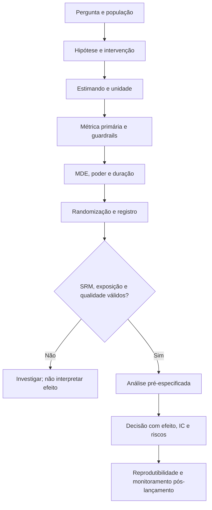
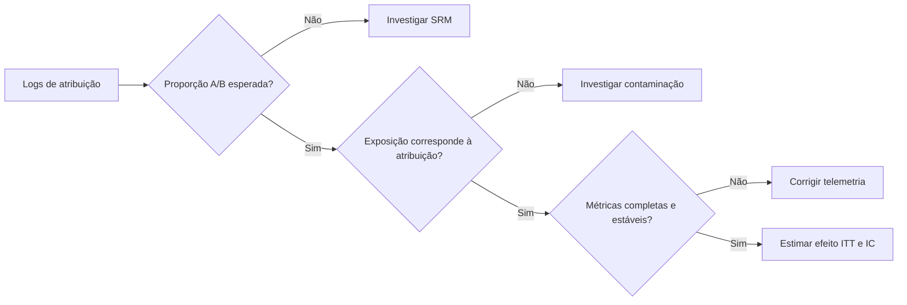

<!-- mirandastech-aula-v2 -->

# Aula 20 — Desenho experimental, testes A/B e reprodutibilidade

> Uma nova política de recuperação reduziu as alucinações do agente no painel interno. Foi a política que causou a melhora ou mudaram, ao mesmo tempo, os usuários, as tarefas e a forma de medir?

Na [Aula 19](19-correlacao-causalidade.md), vimos por que associação observacional não identifica automaticamente o efeito de uma intervenção. Nesta aula, damos o passo seguinte: desenhar um experimento no qual a atribuição aleatória torna os grupos comparáveis **em expectativa** e permite uma interpretação causal mais defensável.

Um teste A/B não é apenas “mostrar duas telas e comparar p-values”. É um protocolo completo: pergunta, população, unidade experimental, intervenção, métricas, randomização, tamanho amostral, regras de parada, análise e decisão. Um erro no desenho não é consertado por um teste estatístico sofisticado no fim.

## Objetivos

Ao final, você deverá ser capaz de:

- formular hipótese, intervenção e estimando antes de observar os resultados;
- distinguir unidade de randomização, unidade de análise e unidade de observação;
- escolher entre desenho completamente aleatorizado, bloqueado, pareado, *cluster* e *crossover*;
- definir métrica primária, métricas secundárias e *guardrails*;
- planejar tamanho amostral a partir de significância, poder e menor efeito relevante;
- diagnosticar *sample ratio mismatch* (SRM), contaminação e falhas de exposição;
- evitar parada opcional, HARKing e multiplicidade não declarada;
- analisar o efeito por intenção de tratar e respeitar dependência entre observações;
- produzir um relatório reproduzível, auditável e útil para decisão.

## Pré-requisitos

- intervalos de confiança da [Aula 14](14-intervalos-confianca.md);
- testes, erros I/II e poder da [Aula 15](15-testes-pvalue-poder.md);
- tamanho de efeito e SESOI da [Aula 16](16-tamanho-efeito.md);
- reamostragem da [Aula 17](17-bootstrap-permutacao.md);
- multiplicidade da [Aula 18](18-multiplos-testes-anova.md);
- associação e causalidade da [Aula 19](19-correlacao-causalidade.md).

## 1. O problema causal

Considere uma população de unidades (i=1,\ldots,N). Para cada unidade, imagine dois desfechos potenciais:

- (Y_i(1)): resultado se ela receber o tratamento B;
- (Y_i(0)): resultado se ela receber o controle A.

O efeito individual seria (Y_i(1)-Y_i(0)), mas nunca observamos os dois resultados simultaneamente para a mesma unidade no mesmo instante. Observamos apenas

\[
Y_i=T_iY_i(1)+(1-T_i)Y_i(0),
\]

em que (T_i\in\{0,1\}) indica o grupo atribuído. O efeito médio do tratamento, ou ATE, é

\[
\tau=E[Y(1)-Y(0)].
\]

A randomização faz (T) ser independente dos resultados potenciais antes do tratamento. Assim, em expectativa,

\[
E[Y\mid T=1]-E[Y\mid T=0]=E[Y(1)]-E[Y(0)]=\tau.
\]

Ela equilibra confundidores conhecidos e desconhecidos **em expectativa**, não garante amostras idênticas. Diferenças casuais ainda ocorrem e são quantificadas pela incerteza estatística.

## 2. Vocabulário essencial

| Termo | Pergunta que responde |
|---|---|
| **Unidade experimental** | Qual entidade pode receber um tratamento independentemente? |
| **Unidade de randomização** | Em que nível o sorteio é realizado: usuário, equipe, escola ou tarefa? |
| **Unidade de observação** | Em que nível os dados são registrados: clique, sessão, usuário ou dia? |
| **Unidade de análise** | Em que nível a incerteza será calculada? Deve respeitar a randomização e a dependência. |
| **Tratamento** | Qual mudança operacional B está sendo comparada ao controle A? |
| **Estimando** | Qual quantidade causal queremos estimar, em qual população e horizonte? |
| **Métrica primária** | Desfecho principal que orienta a conclusão confirmatória. |
| **Guardrail** | Métrica que não pode se degradar além de um limite aceitável. |
| **MDE/SESOI** | Menor efeito que vale detectar ou que é relevante na prática. |
| **ITT** | Intenção de tratar: analisar pela atribuição original, independentemente da adesão. |
| **SRM** | *Sample ratio mismatch*: proporção entre grupos incompatível com a planejada. |
| **Interferência** | O tratamento de uma unidade altera o resultado de outra. |
| **A/A** | Experimento em que ambos os grupos recebem a mesma experiência, usado para validar a plataforma. |

## 3. Da ideia ao protocolo

Um protocolo mínimo deve responder, antes da coleta:

1. **População:** para quem a conclusão será válida?
2. **Intervenção:** o que exatamente muda entre A e B?
3. **Estimando:** qual contraste, período e regra de agregação?
4. **Unidade:** onde randomizar e onde calcular o erro-padrão?
5. **Métricas:** qual é primária e quais protegem segurança, custo e qualidade?
6. **Sensibilidade:** qual menor efeito justificaria a mudança?
7. **Duração:** quantas unidades e quantos ciclos temporais são necessários?
8. **Análise:** teste, IC, tratamento de faltantes e exclusões.
9. **Parada:** data ou regra sequencial válida.
10. **Decisão:** quais combinações de benefício e dano levam a lançar, iterar ou rejeitar?

## 4. Escolha a unidade antes do teste

### Usuário, sessão ou requisição?

Se a interface B ensina um novo comportamento ao usuário, alternar A e B por requisição gera contaminação: a experiência com B afeta respostas futuras sob A. Randomizar por usuário preserva uma experiência consistente.

Se a intervenção ocorre no servidor e não deixa memória, randomizar requisições pode ser aceitável — desde que requisições da mesma pessoa não sejam tratadas como independentes na análise. Mil sessões de cem usuários não equivalem a cem mil usuários independentes.

### Randomização por *cluster*

Quando membros interagem, sorteie o grupo: turma, equipe, empresa ou comunidade. A independência efetiva ocorre entre *clusters*. A correlação intraclasse reduz informação; uma aproximação do fator de desenho é

\[
DE=1+(m-1)\rho_{ICC},
\]

em que (m) é o tamanho médio do *cluster*. Se (m=20) e (
ho_{ICC}=0{,}05), então (DE=1{,}95): é preciso quase duplicar o tamanho amostral de um cálculo que supusesse independência.

### Interferência

Em redes, *marketplaces* e sistemas colaborativos, uma unidade tratada pode afetar o controle. Um novo ranqueador para vendedores altera o que compradores veem; um copiloto em parte de uma equipe muda o fluxo dos colegas. A suposição de “nenhuma interferência” precisa ser avaliada, não apenas citada.

## 5. Desenhos fundamentais

| Desenho | Quando usar | Vantagem | Risco principal |
|---|---|---|---|
| Completamente aleatorizado | Muitas unidades semelhantes | Simples e transparente | Desequilíbrio casual em amostra pequena |
| Bloqueado/estratificado | Há variáveis prognósticas conhecidas | Melhora equilíbrio e precisão | Blocos demais ou mal registrados |
| Pareado | Unidades podem ser pareadas por perfil | Remove variação entre pares | Pareamento fraco ou análise não pareada |
| *Cluster* | Há contaminação ou intervenção coletiva | Respeita a aplicação real | Poucos clusters e erro-padrão subestimado |
| *Crossover* | A mesma unidade pode receber A e B | Cada unidade serve de controle | Efeito residual e tendência temporal |
| Fatorial | Duas intervenções precisam ser avaliadas | Estima efeitos e interação | Interpretação e multiplicidade |

### Bloqueio não é ajuste oportunista

No bloqueio, definimos estratos **antes** da atribuição — por exemplo, plataforma e faixa de atividade — e randomizamos dentro deles. Isso evita que um grupo concentre usuários móveis ou casos difíceis. O NIST resume a lógica como bloquear o que é controlável e randomizar o restante.

### Pareamento em avaliação de modelos

Se os mesmos prompts podem ser enviados aos modelos A e B, a tarefa é o bloco natural. Compare as respostas dentro de cada prompt. Uma análise independente desperdiça informação e ignora que alguns prompts são muito mais difíceis que outros.

## 6. Métricas: uma arquitetura de decisão

Para um assistente de código, poderíamos definir:

- **primária:** proporção de tarefas resolvidas corretamente por usuário em sete dias;
- **secundárias:** tempo até solução e satisfação;
- **guardrails:** custo por tarefa, incidentes de segurança e latência p95;
- **diagnósticas:** chamadas de ferramenta, tokens e taxa de exposição correta.

A métrica primária reduz liberdade analítica. Métricas secundárias ajudam a entender o mecanismo, mas não devem substituir silenciosamente uma primária desfavorável. *Guardrails* exigem limites práticos; “não significativo” não demonstra ausência de dano. Para alegar não inferioridade, planeje margem e método adequados.

### Alinhe numerador, denominador e unidade

“Taxa de sucesso” pode significar sucessos por requisição, por sessão, por usuário ou por tarefa elegível. A escolha muda a ponderação. Defina:

- evento elegível e momento de entrada;
- janela de atribuição e de observação;
- tratamento de unidades sem evento;
- regra para duplicatas, bots, faltantes e atraso de telemetria;
- agregação por unidade antes da comparação, quando necessário.

## 7. Efeito absoluto, relativo e incerteza

Para desfecho binário, sejam (hat p_A) e (hat p_B) as proporções:

\[
\widehat\Delta=\hat p_B-\hat p_A,
\qquad
\text{lift relativo}=\frac{\hat p_B-\hat p_A}{\hat p_A}.
\]

O efeito absoluto em pontos percentuais costuma ser mais acionável. Sob independência entre unidades, um erro-padrão não agrupado para a diferença é

\[
SE(\widehat\Delta)=\sqrt{\frac{\hat p_A(1-\hat p_A)}{n_A}+\frac{\hat p_B(1-\hat p_B)}{n_B}}.
\]

Um IC aproximado de 95% é (widehat\Delta\pm1{,}96SE). Em amostras pequenas, eventos raros ou desenhos agrupados, escolha métodos compatíveis com o desenho.

### Exemplo resolvido

Em 15.000 usuários por grupo:

- A: 1.500 sucessos, (hat p_A=10{,}0\%\);
- B: 1.680 sucessos, (hat p_B=11{,}2\%\).

Logo,

\[
\widehat\Delta=1{,}2\text{ ponto percentual},
\qquad
\text{lift}=12\%.
\]

O erro-padrão é aproximadamente (0{,}00355), e o IC 95% para a diferença fica perto de ([0{,}50;1{,}90]) ponto percentual. O intervalo exclui zero, mas a decisão ainda depende de custo, guardrails, validade do experimento e de 0,5 ponto percentual já ser útil.

## 8. Planejamento de tamanho amostral

Quatro valores conduzem o planejamento:

- nível de significância (alpha), frequentemente 5%;
- poder (1-\beta), frequentemente 80% ou 90%;
- variabilidade ou taxa de base;
- MDE/SESOI (delta), definido pelo valor prático, não pelo resultado desejado.

Para dois grupos iguais e uma proporção próxima de (ar p), uma aproximação é

\[
n_{\text{por grupo}}\approx
\frac{2(z_{1-\alpha/2}+z_{1-\beta})^2\bar p(1-\bar p)}{\delta^2}.
\]

Com taxa-base de 10%, efeito-alvo de 1 ponto percentual, (alpha=0{,}05) e poder de 80%, são necessários aproximadamente **15 mil usuários por grupo**. Reduzir o MDE à metade requer cerca de quatro vezes mais amostra, pois (n) cresce como (1/\delta^2).

Acrescente perdas previstas, fator de desenho por agrupamento e duração suficiente para cobrir sazonalidade. “Rodar por sete dias” não é uma lei: a duração depende do tráfego, do ciclo de uso, do atraso do desfecho e de efeitos de novidade.

### Poder não é calculado depois para explicar um resultado

O chamado poder observado é função do próprio p-value e pouco acrescenta. Depois da coleta, reporte efeito e intervalo. Antes da coleta, use poder para escolher um experimento capaz de responder à pergunta relevante.

## 9. Execução: valide o experimento antes do efeito

### *Sample ratio mismatch*

Se o plano era 50/50 e aparecem 10.800 unidades em A e 9.200 em B, um teste de aderência detectará uma discrepância improvável. SRM pode indicar falha de atribuição, filtro dependente do tratamento, perda de eventos ou elegibilidade calculada depois da exposição. Não “corrija” apenas reponderando: encontre a causa.

### Testes A/A

Em A/A, os dois grupos recebem a mesma variante. Repetições ajudam a verificar:

- se p-values sob a nulidade são aproximadamente uniformes;
- se a taxa de falso positivo acompanha (alpha);
- se a plataforma gera SRM;
- se métricas têm variância e latência previstas;
- se segmentações inventam efeitos.

Um A/A válido não prova que todo futuro A/B será válido, mas revela falhas básicas antes de decisões caras.

### Intenção de tratar

Na análise ITT, cada unidade permanece no grupo sorteado, mesmo que a exposição falhe. Excluir “quem não usou B” quebra a randomização, pois uso pode depender de motivação ou habilidade. Relate adesão como diagnóstico; estimar efeito entre aderentes exige métodos e hipóteses adicionais.

## 10. Parada opcional, HARKing e multiplicidade

Se um teste fixo de 5% for consultado diariamente e encerrado na primeira significância, o erro tipo I excede 5%. Cada consulta oferece nova chance de um falso positivo.

Escolha uma estratégia:

1. **horizonte fixo:** defina amostra/duração e analise ao final;
2. **desenho sequencial:** use fronteiras ou métodos *always-valid* planejados;
3. **monitoramento operacional:** acompanhe segurança e integridade sem tomar decisão de eficácia por p-value ingênuo.

HARKing — formular a hipótese após conhecer o resultado — transforma exploração em falsa confirmação. Descobertas exploratórias são úteis, mas precisam ser rotuladas e confirmadas em nova amostra. Se houver várias variantes, métricas, segmentos ou tempos, registre a família e controle multiplicidade conforme a Aula 18.

## 11. Particularidades de experimentos com IA

### Saídas estocásticas

Repetir o mesmo prompt com várias *seeds* mede variação do modelo, mas não cria novos prompts independentes. A tarefa continua sendo a unidade de generalização. Use desenho hierárquico ou agregação por tarefa; não trate cada geração como uma pessoa independente.

### Comparação pareada

Avalie A e B nas mesmas tarefas, com ordem aleatória e avaliadores cegos quando possível. Registre versão do modelo, prompt de sistema, temperatura, ferramentas, base de conhecimento e data. Sem isso, “modelo B” não é uma intervenção reproduzível.

### Avaliador automático

Um LLM juiz pode ter viés de posição, preferência por estilo e autoconsistência limitada. Randomize a ordem das respostas, valide contra avaliação humana e reporte concordância. O experimento pode estimar com precisão o viés do avaliador errado.

### Guardrails essenciais

Qualidade média pode subir enquanto segurança, grupos minoritários ou caudas de latência pioram. Defina antes limites para:

- violações de segurança e privacidade;
- alucinação factual;
- custo por tarefa;
- latência p95/p99;
- disparidade entre grupos ou idiomas;
- taxa de escalonamento humano.

### Contaminação de benchmark

Se tarefas de avaliação fizeram parte do treinamento, o resultado não generaliza. Mantenha proveniência, conjuntos retidos, versões e data de corte. Nunca ajuste prompts repetidamente no teste final e depois o trate como avaliação intocada.

## 12. Reprodutibilidade e auditabilidade

Um pacote mínimo contém:

- hipótese e protocolo versionados antes da leitura do efeito;
- script determinístico de atribuição ou hash auditável;
- dicionário de métricas e consultas versionadas;
- registro imutável de atribuição, exposição e resultado;
- versões de código, modelo, prompt, dados e dependências;
- seed para simulações — a atribuição real deve usar aleatoriedade apropriada;
- fluxo de exclusões com contagens;
- análise executável do dado bruto ao relatório;
- efeito, IC, teste, guardrails e sensibilidades;
- limitações, desvios do protocolo e o que o resultado não prova.

Reprodutível não significa que todo rerun terá os mesmos usuários; significa que, dados os mesmos artefatos, outra pessoa consegue reconstruir a atribuição, as métricas e a conclusão.

## 13. Critérios de decisão

| Resultado | Leitura possível | Ação prudente |
|---|---|---|
| Benefício relevante e guardrails preservados | Evidência favorável | Lançar gradualmente e monitorar |
| IC inclui benefício e dano relevantes | Experimento inconclusivo | Aumentar informação ou redesenhar |
| Efeito preciso, menor que a SESOI | Pouco valor prático | Não lançar por eficácia |
| Primária melhora, guardrail viola limite | Troca indesejável | Corrigir tratamento antes de lançar |
| SRM ou exposição inválida | Efeito não confiável | Investigar e repetir |
| Efeito só em segmento descoberto depois | Hipótese exploratória | Replicar com segmento pré-definido |

“Não significativo” não é “igual”. “Significativo” não é “vale a pena”. A decisão combina estimativa, incerteza, relevância, riscos e custos.

## 14. Armadilhas e erros comuns

1. Randomizar por sessão e analisar como se usuários fossem independentes.
2. Escolher a métrica vencedora depois de olhar o painel.
3. Definir MDE pelo menor efeito que o tráfego atual consegue detectar.
4. Encerrar no primeiro p-value abaixo de 0,05.
5. Ignorar SRM porque o resultado “parece plausível”.
6. Excluir não aderentes e chamar o contraste de causal.
7. Usar “sem diferença significativa” como prova de equivalência.
8. Tratar gerações do mesmo prompt como tarefas independentes.
9. Comparar modelos em conjuntos ou prompts diferentes sem bloqueio.
10. Alterar modelo, prompt ou base no meio do experimento sem registrar.
11. Testar muitos segmentos e publicar apenas o melhor.
12. Otimizar uma média enquanto caudas, custo ou segurança pioram.
13. Planejar amostra sem considerar agrupamento, perdas ou sazonalidade.
14. Acreditar que seed fixa corrige desenho ou torna resultados externos replicáveis.

## 15. Checklist prático

- [ ] Escrevi pergunta, população, intervenção, estimando e horizonte.
- [ ] Defini unidades de randomização, observação e análise.
- [ ] Avaliei interferência, contaminação e efeito residual.
- [ ] Pré-especifiquei métrica primária, guardrails e denominadores.
- [ ] Defini SESOI/MDE pelo valor da decisão.
- [ ] Planejei (alpha), poder, tamanho, perdas e duração.
- [ ] Escolhi randomização simples, bloqueada, pareada ou por *cluster*.
- [ ] Versionei protocolo, código, métricas e artefatos do sistema.
- [ ] Validei SRM, exposição, faltantes e telemetria antes do efeito.
- [ ] Analisei por intenção de tratar e respeitei dependência.
- [ ] Reportei efeito absoluto, relativo, IC e guardrails.
- [ ] Documentei multiplicidade e regra de parada.
- [ ] Separei análises confirmatórias das exploratórias.
- [ ] Registrei limitações e o que o experimento não generaliza.

## 16. Laboratório reproduzível

O [notebook da Aula 20](../notebooks/20-desenho-experimental-ab-laboratorio.ipynb) usa Python, NumPy, pandas, SciPy e Matplotlib com seed fixa. Ele demonstra:

- planejamento de amostra para duas proporções;
- randomização simples e bloqueada;
- análise ITT com efeito absoluto, lift, IC e p-value;
- diagnóstico de SRM;
- calibração por milhares de testes A/A;
- inflação de falsos positivos por parada opcional;
- subestimação do erro-padrão quando sessões dependentes são tratadas como independentes;
- comparação pareada de dois sistemas de IA nas mesmas tarefas.

Os dados são sintéticos, as dependências são declaradas e as células incluem verificações numéricas.

## 17. Exercícios

### 1. Unidade experimental

Um recurso de recomendação aprende com cliques anteriores. A equipe deseja alternar A/B a cada página. Qual é o risco e que unidade pode ser melhor?

### 2. MDE

Se reduzir o MDE de 2 para 1 ponto percentual mantendo os demais parâmetros, como muda aproximadamente a amostra?

### 3. SRM

O plano era 50/50, mas 54% das unidades aparecem em A. Podemos interpretar o efeito após apenas ajustar pesos?

### 4. Intenção de tratar

Parte dos usuários atribuídos a B nunca ativa o recurso. Devemos removê-los da análise principal?

### 5. Avaliação de IA

Dois modelos respondem aos mesmos 500 prompts. Por que um teste independente por resposta é inferior a uma análise pareada por prompt?

### 6. Resultado inconclusivo

O efeito estimado é +0,4 ponto percentual, com IC 95% de −0,3 a +1,1, e a SESOI é +0,8. O que podemos concluir?

## 18. Respostas comentadas

### 1.

Há contaminação e efeito residual: a exposição anterior altera o usuário e o próprio recomendador. Randomizar por usuário — ou por *cluster* se usuários interagem — tende a preservar tratamentos consistentes.

### 2.

A amostra quadruplica aproximadamente, pois o tamanho cresce com (1/\delta^2). O cálculo final ainda depende da métrica e da aproximação usada.

### 3.

Não diretamente. O SRM é sintoma de possível falha de atribuição, elegibilidade, exposição ou logging. Reponderar não recupera a randomização se a perda depender do tratamento. Primeiro investigue a causa e, se necessário, repita.

### 4.

Não na análise ITT. Manter a atribuição preserva a comparação randomizada e estima o efeito da política de oferecer B. A adesão deve ser reportada; efeitos entre aderentes exigem análise adicional.

### 5.

Prompts diferem muito em dificuldade. Comparar A e B dentro do mesmo prompt controla essa variação e estima a distribuição das diferenças por tarefa. Tratar respostas como independentes ignora o pareamento e pode produzir erro-padrão inadequado.

### 6.

O intervalo contém ausência de efeito e também benefício acima da SESOI. O resultado é inconclusivo para a decisão: não prova equivalência nem benefício relevante. Pode ser necessário obter mais informação ou melhorar o desenho.

## 19. Resumo

- Experimentos estimam efeitos de intervenções por meio de comparações planejadas.
- Randomização equilibra confundidores em expectativa; não substitui controle de qualidade.
- Unidade de randomização e dependência determinam a unidade correta de análise.
- Bloqueio e pareamento usam informação pré-tratamento para melhorar equilíbrio e precisão.
- Métrica primária, guardrails, denominador e janela precisam ser definidos antes da coleta.
- MDE/SESOI vem da decisão prática; poder e tamanho amostral são planejamento, não justificativa posterior.
- SRM, exposição e telemetria devem ser validados antes de interpretar o efeito.
- ITT preserva a randomização; excluir não aderentes pode reintroduzir viés.
- Parada opcional, HARKing e seleção de métricas inflam falsos positivos.
- Experimentos com IA exigem pareamento por tarefa, controle de versões, avaliação do juiz e cuidado com repetições estocásticas.
- Um resultado útil reporta efeito, IC, relevância, guardrails, limitações e trilha reproduzível.

## 20. Próxima aula

Com esta aula, encerramos o bloco de Estatística: aprendemos a transformar uma pergunta causal em um experimento executável e auditável. Na [Aula 21 — Auto-informação e entropia](21-entropia-auto-informacao.md), iniciaremos Teoria da Informação, medindo quanta surpresa existe em um evento e quanta incerteza média há em uma distribuição.

## Referências técnicas

- NIST/SEMATECH. [*e-Handbook of Statistical Methods — Randomized Block Designs*](https://www.itl.nist.gov/div898/handbook/pri/section3/pri332.htm). Referência oficial para bloqueio e desenho experimental.
- STATSMODELS. [`statsmodels.stats.power.zt_ind_solve_power`](https://www.statsmodels.org/stable/generated/statsmodels.stats.power.zt_ind_solve_power.html). Documentação oficial para poder de dois grupos independentes.
- KOHAVI, Ron; TANG, Diane; XU, Ya. [*Trustworthy Online Controlled Experiments*](https://www.cambridge.org/core/books/trustworthy-online-controlled-experiments/D97B26382EB0EB2DC2019A7A7B518F59). Cambridge University Press, 2020.
- DENG, Alex; LU, Jiannan; CHEN, Shouyuan. [Continuous Monitoring of A/B Tests without Pain: Optional Stopping in Bayesian Testing](https://alexdeng.github.io/public/files/continuousMonitoring.pdf). IEEE DSAA, 2016.
- BERMAN, Ron. [False Discovery in A/B Testing](https://doi.org/10.1287/mnsc.2021.4207). *Management Science*, 2022.

## Material complementar

- DIEZ, David; BARR, Christopher; ÇETINKAYA-RUNDEL, Mine. [*OpenIntro Statistics*](https://www.openintro.org/book/os/). Livro aberto com randomização e inferência.
- OPENINTRO. [*Introductory Statistics with Randomization and Simulation*](https://www.openintro.org/book/isrs/). Livro aberto e materiais de simulação.
- KOHAVI, Ron et al. [Trustworthy Online Controlled Experiments: Five Puzzling Outcomes Explained](https://ai.stanford.edu/~ronnyk/puzzlingOutcomesInControlledExperiments.pdf). KDD, 2012.
