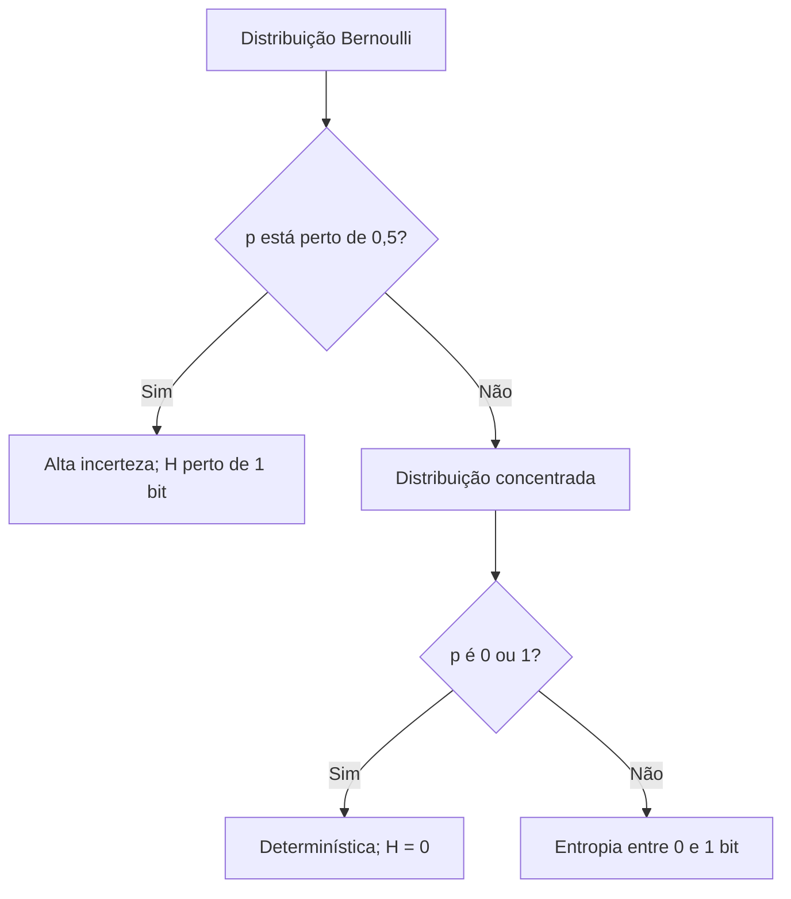

<!-- mirandastech-aula-v2 -->

# Aula 21 — Auto-informação e entropia

[](https://colab.research.google.com/github/joaopaulomirandamatias/ai-lab/blob/main/02-statistics/notebooks/21-entropia-auto-informacao-laboratorio.ipynb)

> Um modelo atribui probabilidade de 90% ao token “São”, 9% a “Rio” e 1% a “Macapá”. Qual observação traz mais informação? E como resumir a incerteza de toda a distribuição antes de saber qual token ocorrerá?

Na [Aula 20](20-desenho-experimental-ab.md), encerramos o bloco de Estatística aprendendo a produzir evidência por experimentos. Agora iniciamos Teoria da Informação: uma linguagem matemática para quantificar surpresa, incerteza e limites de codificação.

O ponto central é separar duas quantidades:

- **auto-informação** mede a surpresa de um resultado observado;
- **entropia** é a surpresa média antes da observação, sob uma distribuição.

Essas ideias sustentam compressão, árvores de decisão, aprendizado por reforço e distribuições de próximo token. Nesta aula, trabalharemos com variáveis discretas. Cross-entropy, log-loss e perplexidade serão formalizadas na Aula 22; KL e informação mútua, na Aula 23.

## Objetivos

Ao final, você deverá ser capaz de:

- explicar por que eventos raros carregam mais auto-informação;
- calcular \(I(x)=-\log p(x)\) em bits, nats e hartleys;
- interpretar entropia como valor esperado da auto-informação;
- calcular entropia de Bernoulli e distribuições categóricas;
- demonstrar os casos de entropia mínima e máxima em suporte finito;
- distinguir entropia de variância, erro, aleatoriedade física e significado;
- lidar corretamente com probabilidades zero;
- estimar entropia a partir de frequências e reconhecer viés de amostra pequena;
- relacionar entropia a códigos, árvores de decisão e incerteza preditiva em IA;
- evitar conclusões indevidas sobre confiança, calibração e correção de modelos.

## Pré-requisitos

- variáveis aleatórias, PMF e distribuições categóricas da [Aula 05](05-variaveis-aleatorias-pmf-pdf-cdf.md);
- esperança matemática da [Aula 06](06-esperanca-variancia-covariancia.md);
- Bernoulli e categorical da [Aula 07](07-bernoulli-binomial-categorical.md);
- estimação da [Aula 13](13-estimacao-likelihood-mle-map.md);
- familiaridade com logaritmos e potências.

## 1. Informação não é significado

Na teoria de Shannon, informação depende das probabilidades dos símbolos, não do valor semântico da mensagem. Receber uma sequência rara pode carregar muitos bits mesmo que seja um ruído sem utilidade; uma frase vital e esperada pode carregar pouca surpresa estatística.

Essa separação é intencional. A teoria responde perguntas como:

- quão surpreendente foi o símbolo observado?
- quanta incerteza havia antes de observá-lo?
- quantas decisões binárias são necessárias, em média, para codificar a fonte?

Ela não responde, sozinha, se a mensagem é verdadeira, útil, ética ou relevante.

```mermaid
flowchart LR
    P[Probabilidade p(x)] --> I[Auto-informação I(x)]
    I --> O[Resultado observado]
    P --> H[Entropia H(X)]
    H --> A[Incerteza média antes da observação]
    H --> C[Limite de codificação]
    H --> M[Aplicações em IA]
```

## 2. Por que aparece um logaritmo?

Uma medida de informação razoável deve respeitar três intuições:

1. **Continuidade:** pequenas mudanças em \(p\) produzem pequenas mudanças na informação.
2. **Monotonicidade:** eventos menos prováveis são mais informativos.
3. **Aditividade:** se eventos independentes \(x\) e \(y\) ocorrem juntos, a informação soma.

Para eventos independentes, \(p(x,y)=p(x)p(y)\). Queremos então

\[
I(x,y)=I(x)+I(y).
\]

O logaritmo transforma produto em soma. Escolhendo uma constante positiva \(k\), obtemos

\[
I(x)=-k\log p(x)=\log\frac{1}{p(x)}.
\]

Quando a base do logaritmo define a unidade, podemos tomar \(k=1\). O sinal negativo torna a informação não negativa, pois \(0<p(x)\le1\) implica \(\log p(x)\le0\).

### Consequências imediatas

- se \(p(x)=1\), então \(I(x)=0\): um evento certo não surpreende;
- se \(p(x)=1/2\), então \(I(x)=1\) bit;
- se \(p(x)=1/8\), então \(I(x)=3\) bits;
- quando \(p(x)\to0^+\), \(I(x)\to\infty\).

## 3. Bits, nats e hartleys

| Base | Unidade | Interpretação |
|---|---|---|
| \(2\) | bit | Número de decisões binárias ideais |
| \(e\) | nat | Unidade natural em cálculo e aprendizado de máquina |
| \(10\) | hartley ou dit | Decisões decimais ideais |

Para o mesmo evento, o número muda, mas a informação física representada não. A conversão vem da mudança de base:

\[
I_{\text{nat}}=I_{\text{bit}}\ln2,
\qquad
I_{\text{bit}}=\frac{I_{\text{nat}}}{\ln2}.
\]

Exemplo: um evento com \(p=1/8\) tem \(3\) bits, \(3\ln2\approx2{,}079\) nats e \(\log_{10}8\approx0{,}903\) hartley. Nunca compare valores sem declarar a base.

## 4. Exemplo motivador: próximo token

Considere a distribuição:

| Token | Probabilidade | Auto-informação |
|---|---:|---:|
| São | \(0{,}90\) | \(-\log_2 0{,}90\approx0{,}152\) bit |
| Rio | \(0{,}09\) | \(-\log_2 0{,}09\approx3{,}474\) bits |
| Macapá | \(0{,}01\) | \(-\log_2 0{,}01\approx6{,}644\) bits |

Observar “Macapá” traz mais surpresa segundo o modelo. Isso **não** significa que o token seja melhor, mais importante ou falso. Significa apenas que recebeu menor probabilidade.

Se um evento ao qual o modelo atribuiu probabilidade zero ocorrer, sua auto-informação teórica é infinita. Em computação, \(\log 0\) não deve ser avaliado ingenuamente; modelos usam probabilidades estritamente positivas, estabilização numérica ou convenções adequadas ao problema.

## 5. Entropia: surpresa média

Se \(X\) é discreta com PMF \(p(x)\), a entropia de Shannon é a esperança da auto-informação:

\[
H(X)=E[I(X)]= -\sum_{x\in\mathcal X}p(x)\log p(x).
\]

Em base 2, \(H\) é medida em bits. Cada resultado contribui com

\[
-p(x)\log_2 p(x).
\]

Um evento muito raro possui alta auto-informação, mas recebe peso pequeno na média. A entropia combina surpresa e frequência.

### Convenção \(0\log 0=0\)

A função \(-p\log p\) tende a zero quando \(p\to0^+\). Portanto, na soma da entropia, definimos

\[
0\log0:=0.
\]

Isso não diz que \(-\log0=0\). São expressões diferentes:

- auto-informação de um evento de probabilidade zero: infinita;
- contribuição média de um resultado impossível: zero, pelo limite.

## 6. Bernoulli: moeda justa e enviesada

Para \(X\sim\operatorname{Bernoulli}(p)\),

\[
H_2(p)=-p\log_2p-(1-p)\log_2(1-p).
\]

### Moeda justa

Com \(p=0{,}5\):

\[
H_2(0{,}5)=-(0{,}5)(-1)-(0{,}5)(-1)=1\text{ bit}.
\]

Antes do lançamento, há máxima incerteza entre dois resultados.

### Moeda enviesada

Com \(p=0{,}9\):

\[
H_2(0{,}9)\approx0{,}469\text{ bit}.
\]

Ainda existe incerteza, mas o resultado “cara” é previsível com frequência. Nos extremos \(p=0\) ou \(p=1\), a entropia é zero.



## 7. Distribuições categóricas

Considere \(p=(1/2,1/4,1/8,1/8)\). As auto-informações são \((1,2,3,3)\) bits. Logo,

\[
H(X)=\frac12(1)+\frac14(2)+\frac18(3)+\frac18(3)=1{,}75\text{ bits}.
\]

Uma distribuição uniforme sobre quatro símbolos teria \(2\) bits. A concentração no primeiro símbolo reduziu a incerteza média.

### Cada contribuição importa

| \(p(x)\) | \(I(x)\) em bits | contribuição \(p(x)I(x)\) |
|---:|---:|---:|
| \(1/2\) | 1 | 0,5 |
| \(1/4\) | 2 | 0,5 |
| \(1/8\) | 3 | 0,375 |
| \(1/8\) | 3 | 0,375 |

Não calcule a média simples das auto-informações; a esperança deve usar os pesos \(p(x)\).

## 8. Entropia mínima e máxima

Para uma variável com \(K\) resultados possíveis,

\[
0\le H(X)\le\log K.
\]

- **mínimo \(0\):** toda massa está em um único resultado;
- **máximo \(\log K\):** os \(K\) resultados são equiprováveis.

Em base 2, uma distribuição uniforme sobre \(K=8\) categorias tem \(H=3\) bits. A ideia de “máxima entropia” depende do conjunto de resultados e das restrições: não se deve comparar fontes com suportes ou discretizações diferentes sem cuidado.

### Demonstração por KL — apenas uma prévia

Se \(u(x)=1/K\) é uniforme, a não negatividade de uma divergência que estudaremos na Aula 23 implica

\[
0\le D_{KL}(p\|u)=\log K-H(p),
\]

logo \(H(p)\le\log K\), com igualdade quando \(p=u\). Por enquanto, guarde o resultado; a derivação completa de KL virá depois.

## 9. Propriedades úteis

### Não negatividade

Para variáveis discretas, \(H(X)\ge0\), pois cada termo \(-p\log p\) é não negativo.

### Simetria

Entropia depende das probabilidades, não dos nomes das categorias. Permutar rótulos não muda \(H\).

### Aditividade para independência

Se \(X\) e \(Y\) são independentes,

\[
H(X,Y)=H(X)+H(Y).
\]

Duas moedas justas independentes têm quatro pares equiprováveis e entropia \(2\) bits. A dependência reduz a quantidade conjunta de novidade: se \(Y=X\), observar \(Y\) depois de \(X\) não acrescenta nova incerteza.

### Concavidade

Misturar distribuições tende a aumentar a incerteza. Para \(0\le\lambda\le1\),

\[
H(\lambda p+(1-\lambda)q)\ge\lambda H(p)+(1-\lambda)H(q).
\]

Essa propriedade explica por que tornar probabilidades mais uniformes costuma elevar a entropia.

## 10. Entropia não é variância

| Aspecto | Entropia | Variância |
|---|---|---|
| Entrada | Distribuição de probabilidades | Valores numéricos e sua média |
| Unidade | bits, nats ou hartleys | unidade original ao quadrado |
| Invariância a rótulos | Sim, para categorias discretas | Não; depende dos valores atribuídos |
| Aplicável a categorias nominais | Sim | Não de modo natural |
| Mede | incerteza média/codificabilidade | dispersão quadrática |

Para uma categoria “azul, verde, vermelho”, entropia é natural; variância exigiria números arbitrários. Para alturas em centímetros, variância preserva distância; discretizar alturas para calcular entropia introduz escolhas de faixas.

Também não confunda entropia com aleatoriedade física. \(H\) descreve uma distribuição ou modelo probabilístico. Uma sequência determinística desconhecida pode parecer imprevisível para um observador, e uma fonte física aleatória pode ter baixa entropia se for muito enviesada.

## 11. Entropia e códigos

Se símbolos frequentes recebem códigos curtos e raros recebem códigos longos, o comprimento ideal associado a \(x\) é

\[
\ell(x)\approx -\log_2p(x).
\]

Para códigos binários prefixos e uma fonte discreta, a entropia é um limite fundamental para o comprimento médio. O código de Huffman satisfaz, sob as condições usuais,

\[
H(X)\le L < H(X)+1,
\]

em que \(L=\sum_xp(x)\ell(x)\).

Para \(p=(1/2,1/4,1/8,1/8)\), comprimentos \((1,2,3,3)\) formam um código ideal, com \(L=1{,}75\) bit por símbolo — igual à entropia. Isso não significa que cada símbolo use uma fração de bit; o ganho aparece na média de mensagens longas.

## 12. Estimando entropia a partir de dados

Se observamos contagens \(n_1,\ldots,n_K\), o estimador *plug-in* usa \(\hat p_k=n_k/n\):

\[
\widehat H_{\text{plug-in}}=-\sum_{k:\,n_k>0}\hat p_k\log\hat p_k.
\]

Ele é simples, mas tende a subestimar entropia em amostras pequenas, especialmente quando há muitas categorias raras. Categorias não observadas recebem frequência zero e parecem contribuir nada, embora possam existir na população.

Boas práticas:

- relate tamanho da amostra e número de categorias observadas;
- mantenha a mesma taxonomia e discretização entre comparações;
- use bootstrap com consciência de que ele não cria categorias ausentes;
- considere correções ou modelos específicos quando \(K\) é grande frente a \(n\);
- não compare entropias de tokenizadores com vocabulários diferentes como se fossem a mesma variável.

Uma correção introdutória é Miller–Madow, em nats:

\[
\widehat H_{MM}=\widehat H_{MLE}+\frac{K_{obs}-1}{2n}.
\]

Ela reduz o viés de primeira ordem, mas não resolve todos os regimes de alta dimensionalidade.

## 13. Entropia diferencial: cuidado com variáveis contínuas

Para uma densidade \(f(x)\), define-se

\[
h(X)=-\int f(x)\log f(x)\,dx.
\]

Essa **entropia diferencial** não herda toda a intuição da entropia discreta: pode ser negativa e muda com escala/unidade. Probabilidade é massa ou área; densidade em um ponto não é probabilidade. Nesta trilha, sempre declare se está usando entropia discreta ou diferencial.

## 14. Aplicações em IA e ML

### Distribuição de próximo token

A entropia da distribuição preditiva resume quão espalhadas estão as probabilidades. Entropia baixa indica concentração; alta indica várias alternativas plausíveis segundo o modelo. Isso não garante calibração: um modelo pode estar muito confiante e errado.

### Temperatura de amostragem

Para logits \(z_i\), a distribuição com temperatura \(T>0\) é

\[
p_i(T)=\frac{\exp(z_i/T)}{\sum_j\exp(z_j/T)}.
\]

Temperaturas menores normalmente concentram a distribuição e reduzem entropia; maiores a aproximam da uniforme e elevam entropia. Use *softmax* estável, subtraindo o maior logit antes da exponenciação.

### Árvores de decisão

Em classificação, um nó puro tem entropia zero. Um corte é útil quando reduz a entropia ponderada dos filhos:

\[
IG=H(\text{pai})-\sum_j\frac{n_j}{n}H(\text{filho}_j).
\]

Esse ganho de informação é um critério de divisão. Ele descreve pureza de classes, não causalidade da *feature*.

### Aprendizado por reforço

Bônus de entropia podem desencorajar políticas prematuramente determinísticas e favorecer exploração. Mais entropia não é sempre melhor: a intensidade do bônus deve equilibrar exploração, recompensa, segurança e fase do treinamento.

### Detecção de incerteza

Entropia preditiva pode ser um sinal para revisão humana, busca adicional ou abstinência. Porém, ela mistura ambiguidades dos dados e limitações do modelo. Mudança de distribuição, má calibração e classes ausentes podem tornar o número enganoso.

### Ponte para a próxima aula

A entropia \(H(p)\) supõe que a distribuição usada para codificar é a própria distribuição verdadeira \(p\). Em aprendizado supervisionado, o modelo oferece outra distribuição \(q\). Medir o custo de usar \(q\) quando os dados seguem \(p\) leva à **cross-entropy**, tema da Aula 22.

## 15. Armadilhas e erros comuns

1. **“Evento raro é importante.”** Raridade mede surpresa, não valor semântico.
2. **Esquecer a base do logaritmo.** O número fica sem unidade interpretável.
3. **Calcular \(\log 0\).** Separe auto-informação infinita da convenção \(0\log0=0\).
4. **Usar média não ponderada.** Entropia é esperança sob \(p\).
5. **Afirmar que alta entropia significa erro.** Pode haver incerteza legítima e boa calibração.
6. **Afirmar que baixa entropia significa acerto.** Confiança pode estar errada.
7. **Comparar suportes diferentes.** \(H\le\log K\) depende de \(K\).
8. **Comparar tokenizadores diretamente.** Tokens e comprimentos de sequência mudam.
9. **Ignorar viés amostral.** Frequências pequenas ocultam categorias raras.
10. **Aplicar fórmula discreta diretamente a valores contínuos únicos.** É preciso modelar densidade ou discretização.
11. **Confundir entropia do rótulo com cross-entropy do modelo.** São quantidades distintas.
12. **Tratar ganho de informação como efeito causal.** É apenas um critério preditivo.

## 16. Checklist prático

- [ ] Defini a variável aleatória e seu suporte.
- [ ] Verifiquei se a distribuição soma 1 e não contém probabilidades negativas.
- [ ] Declarei base e unidade: bit, nat ou hartley.
- [ ] Tratei \(p=0\) por máscara ou convenção matemática correta.
- [ ] Calculei auto-informação apenas para resultados possíveis/observados.
- [ ] Calculei entropia como média ponderada por \(p\).
- [ ] Comparei distribuições com o mesmo suporte e discretização.
- [ ] Relatei tamanho amostral ao estimar \(p\) por frequências.
- [ ] Inspecionei categorias raras ou não observadas.
- [ ] Não confundi concentração com correção ou calibração.
- [ ] Nas aplicações em IA, registrei logits, temperatura e tokenizador.
- [ ] Diferenciei entropia discreta de entropia diferencial.

## 17. Laboratório reproduzível

O [notebook da Aula 21](../notebooks/21-entropia-auto-informacao-laboratorio.ipynb) usa Python, NumPy, pandas e Matplotlib com seed fixa. Ele contém:

- funções numericamente seguras para auto-informação e entropia;
- conversão entre bits, nats e hartleys;
- curva de entropia Bernoulli e verificação do máximo em \(p=0{,}5\);
- decomposição da contribuição de cada categoria;
- demonstração de \(H\le\log_2K\) em milhares de distribuições;
- simulação do viés *plug-in* e correção Miller–Madow;
- construção de códigos de Huffman e comparação \(H\le L<H+1\);
- ganho de informação em uma divisão de árvore;
- efeito da temperatura sobre entropia de próximo token.

Todos os dados são gerados localmente, as versões são exibidas e as células incluem verificações automáticas.

## 18. Exercícios

### 1. Auto-informação

Calcule a auto-informação, em bits, de eventos com probabilidades \(1\), \(1/2\), \(1/4\) e \(1/16\).

### 2. Moeda enviesada

Uma moeda tem \(P(\text{cara})=0{,}8\). Qual resultado individual é mais informativo? A entropia é maior ou menor que 1 bit?

### 3. Categoria impossível

Em \(p=(0{,}7,0{,}3,0)\), como o terceiro termo entra na entropia? Qual seria a auto-informação se esse resultado “impossível” fosse observado?

### 4. Máxima entropia

Qual é a máxima entropia, em bits, para oito categorias? Quando ela ocorre?

### 5. Código

Para \(p=(1/2,1/4,1/8,1/8)\), verifique o comprimento médio de um código com comprimentos \((1,2,3,3)\).

### 6. Modelo confiante

Um classificador atribui 99,9% à classe errada. Sua entropia é baixa. O que esse caso demonstra?

### 7. Estimação

Por que o estimador *plug-in* tende a subestimar a entropia quando há muitas categorias raras?

## 19. Respostas comentadas

### 1.

Os valores são \(0,1,2\) e \(4\) bits, respectivamente. Cada divisão da probabilidade por dois acrescenta um bit.

### 2.

Coroa, com probabilidade 0,2, é mais informativa quando ocorre. A entropia é aproximadamente \(0{,}722\) bit, menor que o máximo de 1 bit.

### 3.

Na entropia, a contribuição é definida como \(0\log0=0\) pelo limite. Já observar um evento ao qual o modelo atribuiu probabilidade exatamente zero produz auto-informação infinita e revela incompatibilidade grave entre observação e modelo.

### 4.

\(\log_2 8=3\) bits, quando todas as oito categorias têm probabilidade \(1/8\).

### 5.

\(L=(1/2)1+(1/4)2+(1/8)3+(1/8)3=1{,}75\) bit por símbolo, igual à entropia dessa distribuição.

### 6.

Entropia baixa significa distribuição concentrada, não previsão correta. É necessário avaliar calibração e desempenho com resultados observados.

### 7.

Categorias não observadas recebem frequência zero e deixam de contribuir. As probabilidades empíricas também aparecem artificialmente concentradas, reduzindo a entropia estimada.

## 20. Resumo

- Auto-informação quantifica a surpresa de um resultado: \(I(x)=-\log p(x)\).
- Eventos certos carregam zero informação; eventos raros carregam mais.
- A base define a unidade: bits, nats ou hartleys.
- Entropia é a auto-informação média: \(H(X)=-\sum p\log p\).
- Na entropia, usa-se \(0\log0=0\); isso não torna \(-\log0\) finito.
- Para \(K\) categorias, \(0\le H\le\log K\), com máximo na uniforme.
- Entropia não depende do nome das categorias e não é a mesma coisa que variância.
- Entropia limita o comprimento médio de códigos prefixos eficientes.
- Estimativas empíricas sofrem viés para baixo quando a amostra é pequena ou há categorias raras.
- Em IA, entropia mede concentração da distribuição, não verdade, qualidade ou calibração.
- Temperatura, tokenizador, suporte e unidade precisam acompanhar qualquer valor reportado.

## 21. Próxima aula

Nesta aula, medimos a incerteza de uma distribuição \(p\). Na [Aula 22 — Cross-entropy, log-loss e perplexidade](22-cross-entropy-perplexidade.md), avaliaremos o custo de prever com uma distribuição \(q\) quando os dados seguem \(p\), conectando teoria da informação à função de perda de classificadores e modelos de linguagem.

## Referências técnicas

- SHANNON, Claude E. [A Mathematical Theory of Communication](https://doi.org/10.1002/j.1538-7305.1948.tb01338.x). *Bell System Technical Journal*, 1948.
- COVER, Thomas M.; THOMAS, Joy A. [*Elements of Information Theory*](https://onlinelibrary.wiley.com/doi/book/10.1002/047174882X). 2. ed. Wiley, 2006.
- MACKAY, David J. C. [*Information Theory, Inference, and Learning Algorithms*](https://www.geophysik.uni-muenchen.de/~igel/Inv-II/Others/Mackay/information_theory.pdf). Cambridge University Press, 2003. Cópia acadêmica hospedada pela LMU München.
- GOODFELLOW, Ian; BENGIO, Yoshua; COURVILLE, Aaron. [Probability and Information Theory](https://www.deeplearningbook.org/contents/prob.html). Capítulo 3 de *Deep Learning*.

## Material complementar

- SCIKIT-LEARN. [Decision Trees — Shannon information gain](https://scikit-learn.org/stable/modules/tree.html#mathematical-formulation). Documentação oficial.
- ZHANG, Aston et al. [Information Theory](https://d2l.ai/chapter_appendix-mathematics-for-deep-learning/information-theory.html). Seção aberta de *Dive into Deep Learning*.
- SHANNON, Claude E. [Reimpressão integral em PDF](https://people.math.harvard.edu/~ctm/home/text/others/shannon/entropy/entropy.pdf). Hospedada pelo Departamento de Matemática de Harvard.
