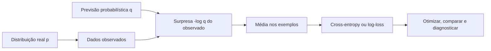
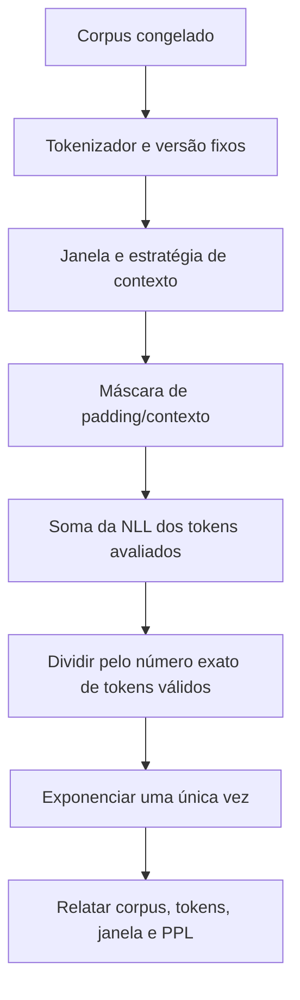

<!-- mirandastech-aula-v2 -->

# Aula 22 — Cross-entropy, log-loss e perplexidade

> Dois classificadores acertam 90% dos exemplos. O primeiro costuma dar 60% à classe escolhida; o segundo dá 99,9%. Eles têm a mesma qualidade? E o que acontece quando a previsão extremamente confiante está errada?

Na [Aula 21](21-entropia-auto-informacao.md), medimos a incerteza de uma distribuição verdadeira \(p\). Agora o modelo propõe outra distribuição, \(q\). A **cross-entropy** mede o custo médio de representar dados gerados por \(p\) usando probabilidades de \(q\).

Essa única ideia aparece com nomes diferentes:

- **cross-entropy**, quando destacamos duas distribuições;
- **log-loss**, quando avaliamos previsões probabilísticas;
- **negative log-likelihood** (NLL), quando ajustamos parâmetros por máxima verossimilhança;
- **perplexidade**, quando exponenciamos a NLL média por token de um modelo de linguagem.

## Objetivos

Ao final, você deverá ser capaz de:

- calcular \(H(p,q)=-\sum_xp(x)\log q(x)\);
- interpretar cross-entropy como surpresa média sob o modelo;
- obter log-loss a partir de rótulos *one-hot*;
- explicar a equivalência entre minimizar NLL e maximizar likelihood;
- calcular binary e multiclass cross-entropy;
- trabalhar diretamente com logits usando *log-sum-exp*;
- derivar o gradiente \(q-y\) de softmax com cross-entropy;
- interpretar perplexidade como fator efetivo de ramificação;
- calcular perplexidade de uma sequência autoregressiva;
- agregar perdas com denominador, máscara e pesos corretos;
- evitar comparações inválidas entre tokenizadores, domínios e janelas de contexto;
- distinguir boa log-loss de boa calibração, boa acurácia e utilidade prática.

## Pré-requisitos

- PMF e distribuições categóricas da [Aula 05](05-variaveis-aleatorias-pmf-pdf-cdf.md);
- Bernoulli e *softmax* da [Aula 07](07-bernoulli-binomial-categorical.md);
- likelihood e MLE da [Aula 13](13-estimacao-likelihood-mle-map.md);
- auto-informação e entropia da [Aula 21](21-entropia-auto-informacao.md);
- logaritmos, derivadas e regra da cadeia.

## 1. Da surpresa individual ao custo médio

Se o resultado observado é \(x\), mas o modelo atribui probabilidade \(q(x)\), a surpresa segundo o modelo é

\[
I_q(x)=-\log q(x).
\]

Se os resultados são gerados por \(p\), a surpresa média de usar \(q\) é

\[
H(p,q)=E_{x\sim p}[-\log q(x)]
=-\sum_{x\in\mathcal X}p(x)\log q(x).
\]

Compare:

| Quantidade | Fórmula | Pergunta |
|---|---|---|
| Auto-informação | \(-\log q(x)\) | Quanto o resultado observado surpreendeu o modelo? |
| Entropia | \(-\sum p(x)\log p(x)\) | Qual é a incerteza inerente de \(p\)? |
| Cross-entropy | \(-\sum p(x)\log q(x)\) | Quanto custa prever dados de \(p\) com \(q\)? |

Quando \(q=p\), a cross-entropy coincide com a entropia. Quando \(q\) diverge de \(p\), aparece um custo excedente. A Aula 23 formalizará esse excesso como divergência KL:

\[
H(p,q)=H(p)+D_{KL}(p\|q).
\]

Por enquanto, use a consequência: para \(p\) fixa, a menor cross-entropy esperada ocorre em \(q=p\).

## 2. Um exemplo resolvido com duas categorias

Suponha que a realidade seja

\[
p=(0{,}8,0{,}2)
\]

e dois modelos proponham

\[
q_A=(0{,}7,0{,}3),\qquad q_B=(0{,}4,0{,}6).
\]

Usando logaritmo natural:

\[
H(p,q_A)=-0{,}8\ln0{,}7-0{,}2\ln0{,}3\approx0{,}5261\text{ nat},
\]

\[
H(p,q_B)=-0{,}8\ln0{,}4-0{,}2\ln0{,}6\approx0{,}8352\text{ nat}.
\]

O modelo A é melhor porque atribui mais probabilidade aos resultados frequentes sob \(p\). A entropia da realidade é

\[
H(p)=-0{,}8\ln0{,}8-0{,}2\ln0{,}2\approx0{,}5004\text{ nat}.
\]

A diferença de aproximadamente \(0{,}0257\) nat para A é o custo de usar uma distribuição imperfeita. A diferença de B é muito maior.

## 3. Do rótulo *one-hot* à log-loss

Em classificação supervisionada, não conhecemos toda a distribuição \(p(\cdot\mid x_i)\) de cada entrada. Observamos um rótulo \(y_i\). Representado em *one-hot*, ele vale 1 na classe correta e 0 nas demais.

Para um exemplo com \(K\) classes,

\[
\ell_i=-\sum_{k=1}^{K}y_{ik}\log q_{ik}.
\]

Como somente a classe correta \(c_i\) tem \(y_{ic_i}=1\), a soma reduz a

\[
\ell_i=-\log q_{i,c_i}.
\]

### Exemplo: três classes

Rótulo correto: classe B, então \(y=(0,1,0)\).

| Modelo | Probabilidades \((A,B,C)\) | Perda em nats |
|---|---|---:|
| cauteloso | \((0{,}25,0{,}50,0{,}25)\) | \(-\ln0{,}50=0{,}6931\) |
| confiante e correto | \((0{,}01,0{,}98,0{,}01)\) | \(-\ln0{,}98=0{,}0202\) |
| confiante e errado | \((0{,}98,0{,}01,0{,}01)\) | \(-\ln0{,}01=4{,}6052\) |

A penalidade cresce sem limite quando a probabilidade da classe verdadeira tende a zero. É por isso que log-loss enxerga diferenças que a acurácia ignora.

## 4. Binary cross-entropy

Para \(y\in\{0,1\}\) e \(q=P(Y=1\mid x)\), a perda binária é

\[
\ell(y,q)=-\left[y\log q+(1-y)\log(1-q)\right].
\]

- se \(y=1\), resta \(-\log q\);
- se \(y=0\), resta \(-\log(1-q)\).

Exemplo: para \(y=1\), prever \(q=0{,}9\) custa \(0{,}1054\) nat; prever \(q=0{,}1\) custa \(2{,}3026\) nats. Para \(y=0\), os papéis se invertem.

Não aplique binary cross-entropy separadamente às classes de um problema mutuamente exclusivo sem entender a modelagem. *Softmax* multiclasses impõe soma 1; várias sigmoides representam rótulos potencialmente simultâneos.

## 5. Log-loss empírica e negative log-likelihood

Em um conjunto de \(n\) exemplos independentes, a likelihood dos rótulos observados é

\[
L(\theta)=\prod_{i=1}^{n}q_\theta(y_i\mid x_i).
\]

O log transforma produto em soma:

\[
\log L(\theta)=\sum_{i=1}^{n}\log q_\theta(y_i\mid x_i).
\]

Logo, maximizar likelihood equivale a minimizar a NLL. Dividindo por \(n\), obtemos a log-loss média:

\[
\widehat{CE}(\theta)=-\frac{1}{n}\sum_{i=1}^{n}\log q_\theta(y_i\mid x_i).
\]

A divisão não muda o minimizador, mas muda a escala do gradiente e permite comparar conjuntos de tamanhos diferentes. Sempre declare se a implementação retorna soma, média por exemplo ou média por token válido.

## 6. Por que otimizar logits, não probabilidades recortadas

Redes neurais produzem **logits** \(z_1,\ldots,z_K\), números reais sem normalização. A *softmax* define

\[
q_k=\frac{e^{z_k}}{\sum_j e^{z_j}}.
\]

Calcular \(e^{z_k}\) diretamente pode causar *overflow*. Para a classe correta \(c\), combine *log-softmax* e NLL:

\[
\ell=-z_c+\log\sum_j e^{z_j}.
\]

Com \(m=\max_jz_j\), a forma estável é

\[
\ell=-(z_c-m)+\log\sum_j e^{z_j-m}.
\]

Subtrair \(m\) não altera a softmax. Já limitar probabilidades com um \(\varepsilon\) arbitrário evita \(\log0\), mas altera a perda e pode mascarar erros. Bibliotecas modernas recebem logits e aplicam a forma estável internamente.

### Gradiente fundamental

Para softmax seguida de cross-entropy *one-hot*,

\[
\frac{\partial\ell}{\partial z_k}=q_k-y_k.
\]

O gradiente aumenta o logit da classe correta quando \(q_k<1\) e reduz os demais proporcionalmente à probabilidade que receberam. Essa expressão reaparecerá no módulo de Deep Learning durante o *backpropagation*.

## 7. Cross-entropy é uma regra de pontuação própria

Uma métrica para probabilidades deve incentivar previsões honestas. Em expectativa, a log-loss é minimizada quando a distribuição prevista coincide com a verdadeira. Mentir que um evento tem 99,9% não traz vantagem sistemática: acertos ficam baratos, mas o raro erro recebe penalidade enorme.

Isso não significa que um modelo treinado com cross-entropy será automaticamente calibrado. Capacidade limitada, regularização, mudança de distribuição, dados ruidosos e otimização imperfeita podem gerar probabilidades ruins. Avalie calibração separadamente com diagramas de confiabilidade e métricas adequadas.

## 8. Acurácia e log-loss respondem perguntas diferentes

| Situação | Acurácia | Log-loss |
|---|---|---|
| Correto com 51% | acerto | penalidade moderada |
| Correto com 99% | acerto | penalidade pequena |
| Errado com 51% | erro | penalidade moderada |
| Errado com 99% | erro | penalidade muito grande |

Acurácia usa somente a classe de maior probabilidade. Log-loss usa a distribuição inteira. Dois modelos podem ter a mesma acurácia e riscos muito diferentes.

Também é possível reduzir log-loss sem mudar nenhuma classe prevista: basta redistribuir probabilidades de modo mais compatível com os rótulos. Isso pode ser valioso para triagem por risco, abstinência e decisões sensíveis a custo.

## 9. Pesos, desbalanceamento e *label smoothing*

### Pesos de classe

Uma perda ponderada pode dar mais importância a classes raras:

\[
\ell_i=-w_{y_i}\log q_{i,y_i}.
\]

Isso altera o objetivo. A perda ponderada não deve ser reportada como se fosse NLL média da distribuição natural. Para avaliação, apresente também métricas sem pesos e resultados por classe.

### *Label smoothing*

Em vez de alvo *one-hot*, distribui-se pequena massa \(\varepsilon\) entre classes. Isso pode regularizar o treinamento e impedir logits extremos, mas muda o alvo. Declare \(\varepsilon\), a convenção de distribuição da massa e se a loss reportada usa rótulo duro ou suavizado.

### Redução

Com pesos, máscaras ou sequências de comprimentos diferentes, “média” é ambígua. O denominador pode ser exemplos, soma dos pesos, tokens válidos ou sequências. Reproduzir um resultado exige declarar numerador e denominador.

## 10. Perplexidade

Para uma sequência tokenizada \(x_1,\ldots,x_T\), um modelo causal fatoriza

\[
q(x_{1:T})=\prod_{t=1}^{T}q(x_t\mid x_{<t}).
\]

A NLL média por token, em nats, é

\[
\overline{NLL}=-\frac{1}{T}\sum_{t=1}^{T}\ln q(x_t\mid x_{<t}).
\]

A perplexidade é

\[
PPL=\exp(\overline{NLL}).
\]

Se a cross-entropy estiver em bits, a forma equivalente é \(PPL=2^{H_2}\).

### Intuição

Perplexidade é o inverso da média geométrica das probabilidades atribuídas aos tokens corretos:

\[
PPL=\left(\prod_{t=1}^{T}\frac{1}{q(x_t\mid x_{<t})}\right)^{1/T}.
\]

Ela pode ser lida como um “número efetivo de alternativas” por posição, não como número literal de tokens considerados.

### Exemplo resolvido

Para probabilidades dos tokens observados \((1/2,1/4,1/8)\):

\[
\overline{NLL}=-\frac{1}{3}\ln\left(\frac12\frac14\frac18\right)
=\frac{\ln64}{3}=\ln4,
\]

portanto \(PPL=e^{\ln4}=4\).

## 11. Como avaliar perplexidade sem se enganar

### Mesmo tokenizador e vocabulário

Perplexidade por token depende de como o texto é segmentado. Um tokenizador pode representar uma palavra com um token; outro, com quatro. Mesmo que ambos atribuam a mesma probabilidade à sequência inteira, a média por token muda.

Exemplo: probabilidade total \(1/16\). Com dois tokens de probabilidade \(1/4\), a PPL é 4; com quatro tokens de probabilidade \(1/2\), a PPL é 2. Não conclua que o segundo modelo linguístico é melhor: a unidade de média mudou.

### Mesmo corpus e domínio

PPL em notícias não é diretamente comparável à PPL em código ou prontuários. Frequências, vocabulário e previsibilidade mudam. Use o mesmo corpus, limpeza e ordem.

### Mesmo contexto

Modelos com janela finita não podem condicionar cada token em todo o passado. Cortar o texto em blocos independentes desperdiça contexto nas bordas e tende a piorar a PPL. Uma janela deslizante permite mais contexto, mas tokens usados apenas como contexto devem ser mascarados para não entrar novamente no denominador.

### Mesma máscara e denominador

Não conte *padding*, tokens ignorados nem o primeiro token sem alvo definido. Some a NLL somente nos alvos avaliados e divida pelo número desses tokens — não pelo comprimento bruto do tensor.

### Modelo causal apropriado

A definição clássica se aplica naturalmente a modelos autoregressivos. Modelos mascarados, como BERT, não oferecem a mesma fatoração causal; métricas pseudo-perplexity exigem outro protocolo e não são diretamente equivalentes.

## 12. Agregação correta

Suponha duas sequências:

- A: 2 tokens válidos, NLL total 2;
- B: 8 tokens válidos, NLL total 16.

A média por sequência das NLLs médias seria \((1+2)/2=1{,}5\). A média por token do corpus é

\[
\frac{2+16}{2+8}=1{,}8.
\]

Para perplexidade de corpus, agregue primeiro a soma das perdas e a contagem de tokens; exponencie somente ao final:

\[
PPL_{corpus}=\exp\left(\frac{\sum_sNLL_s}{\sum_sT_s}\right).
\]

Calcular a média aritmética das perplexidades das sequências produz outra quantidade e dá peso excessivo às sequências curtas.

## 13. Cross-entropy em LLMs

Durante *next-token prediction*, cada posição é um exemplo multiclasses cujo rótulo é o próximo token. Para vocabulário \(V\), o modelo produz logits de forma \([B,T,V]\), e os alvos têm forma \([B,T]\).

O deslocamento é essencial:

- logits na posição \(t\) predizem o token em \(t+1\);
- o primeiro token fornece contexto, mas não é previsto sem um token inicial;
- posições de *padding* são ignoradas;
- a loss é normalmente média sobre tokens válidos.

Uma loss baixa no treino não prova generalização. Meça em conjunto retido, sem vazamento, com o modelo em modo de avaliação. PPL também não mede factualidade, segurança, seguimento de instruções ou qualidade de uma aplicação RAG.

## 14. Diagnóstico prático

| Sintoma | Hipótese | Verificação |
|---|---|---|
| Loss vira `nan` | \(\log0\), overflow ou taxa alta | usar logits estáveis; inspecionar valores e gradientes |
| Loss não cai | alvos desalinhados ou gradiente nulo | testar lote pequeno; conferir shapes e *shift* |
| Treino cai, validação sobe | sobreajuste ou drift | curva por época; dados retidos e estratificados |
| PPL inesperadamente ótima | vazamento ou tokens recontados | auditar corpus, máscara e denominador |
| PPL pior que referência | contexto curto ou tokenizador distinto | reproduzir protocolo idêntico |
| Classe rara ignorada | objetivo dominado pela maioria | métricas por classe; pesos apenas no treino |
| Mesma acurácia, riscos distintos | probabilidades diferentes | comparar log-loss e calibração |

## 15. Armadilhas e erros comuns

1. **Passar probabilidades a uma função que espera logits.** A biblioteca aplicará softmax novamente.
2. **Aplicar softmax antes de uma loss que já o inclui.** Perde-se estabilidade e altera-se o resultado.
3. **Confundir classe prevista com distribuição prevista.** Acurácia descarta confiança.
4. **Usar \(\log_2\) no treino e comparar com uma loss em nats.** A escala muda por \(\ln2\).
5. **Recortar probabilidade sem declarar.** O piso altera perdas extremas.
6. **Calcular média de PPLs.** Agregue NLL e tokens antes de exponenciar.
7. **Contar *padding*.** O denominador precisa usar apenas alvos válidos.
8. **Comparar tokenizadores diferentes.** PPL por token não está na mesma unidade.
9. **Comparar domínios ou janelas diferentes.** O protocolo mudou.
10. **Interpretar PPL como qualidade geral.** Ela mede previsão de tokens sob um corpus.
11. **Reportar loss ponderada como NLL natural.** Pesos mudam a distribuição-alvo operacional.
12. **Avaliar no treino.** Uma loss treinada é otimista para generalização.

## 16. Checklist prático

- [ ] Sei se a função recebe logits, probabilidades ou log-probabilidades.
- [ ] Confirmei shapes, eixo das classes e alinhamento dos alvos.
- [ ] Usei *log-softmax*/*log-sum-exp* estáveis.
- [ ] Declarei base do logaritmo e unidade.
- [ ] Registrei redução, pesos, *label smoothing* e classes ignoradas.
- [ ] Calculei a loss no conjunto retido e em modo de avaliação.
- [ ] Comparei log-loss com baseline, acurácia e calibração.
- [ ] Para LLM, fixei corpus, tokenizador, versão e janela.
- [ ] Mascarei contexto repetido, *padding* e posições sem alvo.
- [ ] Agreguei NLL total e tokens válidos antes de calcular PPL.
- [ ] Não comparei PPL entre tokenizações ou protocolos diferentes.
- [ ] Documentei limitações e o que a métrica não mede.

## 17. Laboratório reproduzível

O [notebook da Aula 22](../notebooks/22-cross-entropy-perplexidade-laboratorio.ipynb) usa NumPy, pandas e Matplotlib com seed fixa. Ele inclui:

- cross-entropy e log-loss implementadas de forma segura;
- equivalência entre *one-hot* e NLL da classe correta;
- penalidade de previsões confiantes e erradas;
- modelos com a mesma acurácia e log-loss diferente;
- *log-softmax* estável e verificação numérica do gradiente \(q-y\);
- binary cross-entropy;
- perplexidade manual de sequência;
- exemplo de não comparabilidade entre tokenizadores;
- diferença entre contexto truncado e janela deslizante;
- agregação correta por token e verificações automáticas.

## 18. Exercícios

### 1. Cross-entropy manual

Calcule \(H(p,q)\) em nats para \(p=(0{,}75,0{,}25)\) e \(q=(0{,}6,0{,}4)\).

### 2. *One-hot*

Para \(y=(0,0,1)\) e \(q=(0{,}2,0{,}3,0{,}5)\), calcule a loss.

### 3. Confiança errada

Compare a perda de uma classe verdadeira à qual o modelo atribui 10% e 0,1%.

### 4. Likelihood

Um modelo atribui às quatro observações corretas probabilidades \((0{,}8,0{,}5,0{,}25,0{,}1)\). Calcule likelihood, NLL total e NLL média.

### 5. Perplexidade

Qual é a PPL de uma sequência cujas probabilidades dos tokens observados são \((1/2,1/2,1/4,1/4)\)?

### 6. Agregação

Por que não se deve calcular a média simples das PPLs de sequências com comprimentos diferentes?

### 7. Comparação inválida

Um modelo tem PPL 12 com um tokenizador e outro PPL 9 com tokenizador diferente. É possível declarar o segundo vencedor?

## 19. Respostas comentadas

### 1.

\[
H(p,q)=-0{,}75\ln0{,}6-0{,}25\ln0{,}4\approx0{,}6122\text{ nat}.
\]

### 2.

Apenas a terceira classe contribui: \(-\ln0{,}5=0{,}6931\) nat.

### 3.

\(-\ln0{,}1=2{,}3026\) nats, enquanto \(-\ln0{,}001=6{,}9078\) nats. Reduzir a probabilidade correta por fator 100 acrescenta \(\ln100\approx4{,}6052\) nats.

### 4.

A likelihood é \(0{,}8\times0{,}5\times0{,}25\times0{,}1=0{,}01\). A NLL total é \(-\ln0{,}01=4{,}6052\); a média é \(1{,}1513\) nat.

### 5.

O produto é \(1/64\). A média sobre quatro tokens produz \(PPL=64^{1/4}=2\sqrt2\approx2{,}8284\).

### 6.

Cada PPL já é uma exponencial de média. A média simples dá peso igual a sequências curtas e longas e não recupera a NLL por token do corpus. Some NLLs e contagens, divida e só então exponencie.

### 7.

Não. A unidade “token” mudou. Para comparação defensável, mantenha corpus, tokenizador, normalização, janela, máscara e denominador iguais, ou use outra unidade comum claramente definida.

## 20. Resumo

- Cross-entropy é a surpresa média de dados de \(p\) quando usamos probabilidades de \(q\).
- Com alvo *one-hot*, a loss é \(-\log q\) da classe correta.
- Minimizar NLL equivale a maximizar likelihood.
- A log-loss recompensa probabilidade bem distribuída e pune confiança errada sem limite.
- Softmax com cross-entropy deve ser calculada a partir de logits por *log-sum-exp* estável.
- Seu gradiente em relação aos logits é \(q-y\).
- Pesos, suavização e redução alteram a interpretação do valor reportado.
- Perplexidade é a exponencial da NLL média por token, ou o inverso da média geométrica das probabilidades corretas.
- Para comparar PPL, fixe corpus, tokenizador, contexto, máscara e denominador.
- PPL não mede, sozinha, factualidade, segurança, utilidade nem qualidade de sistema.

## 21. Próxima aula

Nesta aula, vimos que prever com \(q\) pode custar mais do que a incerteza inerente de \(p\). Na [Aula 23 — Divergência KL e informação mútua](23-kl-informacao-mutua.md), mediremos formalmente esse custo excedente, estudaremos sua assimetria e conectaremos redução de incerteza à dependência entre variáveis.

## Referências técnicas

- COVER, Thomas M.; THOMAS, Joy A. [*Elements of Information Theory*](https://onlinelibrary.wiley.com/doi/book/10.1002/047174882X). 2. ed. Wiley, 2006.
- GOODFELLOW, Ian; BENGIO, Yoshua; COURVILLE, Aaron. [Probability and Information Theory](https://www.deeplearningbook.org/contents/prob.html). Capítulo 3 de *Deep Learning*.
- JURAFSKY, Daniel; MARTIN, James H. [*Speech and Language Processing*](https://web.stanford.edu/~jurafsky/slp3/). Livro aberto, capítulos sobre modelos de linguagem.
- PYTORCH. [CrossEntropyLoss](https://docs.pytorch.org/docs/stable/generated/torch.nn.CrossEntropyLoss.html). Documentação oficial; recebe logits não normalizados.
- SCIKIT-LEARN. [log_loss](https://scikit-learn.org/stable/modules/generated/sklearn.metrics.log_loss.html). Documentação oficial.

## Material complementar

- HUGGING FACE. [Perplexity of fixed-length models](https://huggingface.co/docs/transformers/en/perplexity). Protocolo com janela deslizante e máscara de contexto.
- DIVE INTO DEEP LEARNING. [Information Theory](https://d2l.ai/chapter_appendix-mathematics-for-deep-learning/information-theory.html). Desenvolvimento aberto com exemplos.
