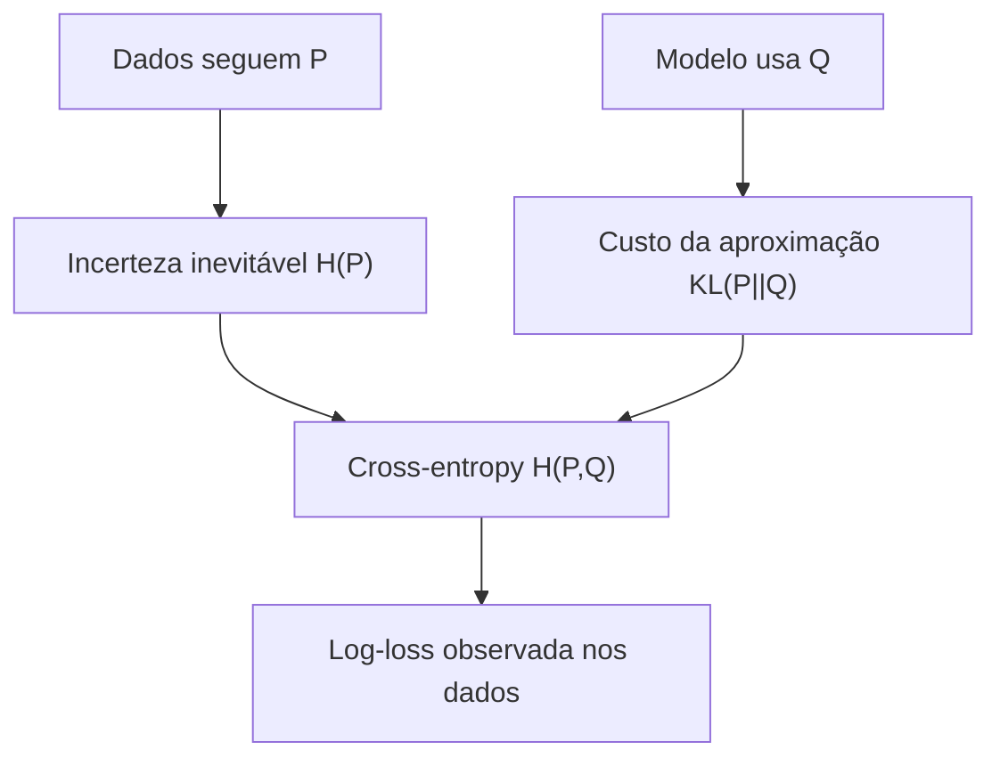
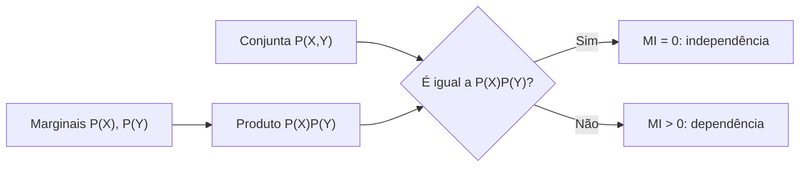

<!-- mirandastech-aula-v2 -->

# Aula 23 — Divergência KL e informação mútua

> Um modelo prevê 90% para “fraude” onde a realidade mostra 50%. Outro preserva as frequências, mas perde uma dependência importante entre horário e fraude. Como medir esses dois tipos de erro sem reduzi-los à acurácia?

Na [Aula 22](22-cross-entropy-perplexidade.md), vimos que prever dados de uma distribuição \(P\) com probabilidades de outra distribuição \(Q\) produz cross-entropy. Agora isolaremos o **custo excedente** dessa aproximação com a divergência de Kullback–Leibler e mediremos quanto duas variáveis compartilham de informação.

## Objetivos

Ao final, você deverá ser capaz de:

- calcular \(D_{KL}(P\|Q)\) em distribuições discretas;
- explicar por que KL é não negativa, mas não é uma distância métrica;
- identificar incompatibilidade de suporte e divergência infinita;
- usar \(H(P,Q)=H(P)+D_{KL}(P\|Q)\);
- interpretar KL como arrependimento logarítmico e log-razão de verossimilhanças;
- calcular informação mútua a partir de uma tabela conjunta;
- relacionar \(I(X;Y)\) a entropias e a uma KL contra independência;
- distinguir informação mútua de informação mútua pontual;
- reconhecer dependências não lineares que correlação pode perder;
- estimar KL e MI com cautela em dados finitos;
- conectar essas quantidades a VAEs, destilação, políticas de RL e seleção de atributos;
- evitar interpretações causais ou comparações com suportes e unidades incompatíveis.

## Pré-requisitos

- distribuições discretas e suporte da [Aula 05](05-variaveis-aleatorias-pmf-pdf-cdf.md);
- probabilidade condicional da [Aula 03](03-condicional-independencia.md);
- entropia da [Aula 21](21-entropia-auto-informacao.md);
- cross-entropy e log-loss da [Aula 22](22-cross-entropy-perplexidade.md);
- somatórios, logaritmos e razão de probabilidades.

## Vocabulário essencial

| Termo | Significado operacional |
|---|---|
| Suporte | Resultados aos quais uma distribuição atribui probabilidade positiva |
| Divergência KL | Custo informacional de usar \(Q\) quando os dados seguem \(P\) |
| Distribuição conjunta | Probabilidade de combinações \((X=x,Y=y)\) |
| Marginal | Distribuição de uma variável após somar a outra |
| Independência | \(p(x,y)=p(x)p(y)\) para todos os pares |
| Informação mútua | Divergência entre a conjunta e o produto das marginais |
| PMI | Informação de um par específico \((x,y)\), que pode ser negativa |
| Estimador *plug-in* | Fórmula teórica avaliada com frequências empíricas |

## 1. O custo de usar a distribuição errada

Para distribuições discretas \(P\) e \(Q\) no mesmo conjunto \(\mathcal X\), define-se

\[
D_{KL}(P\|Q)=\sum_{x\in\mathcal X}p(x)\log\frac{p(x)}{q(x)}.
\]

O primeiro argumento, \(P\), é a referência que gera os dados; o segundo, \(Q\), é a aproximação. Com logaritmo natural, a unidade é **nat**. Com \(\log_2\), a unidade é **bit**.

O termo de cada resultado compara duas descrições: \(\log p(x)\), adequada a \(P\), e \(\log q(x)\), usada por engano. Tirar a média sob \(P\) mede o arrependimento logarítmico esperado:

\[
D_{KL}(P\|Q)=E_{X\sim P}\left[\log\frac{p(X)}{q(X)}\right].
\]

Não leia KL como “porcentagem de diferença”. Seu valor depende da base do logaritmo e resume uma penalidade média.

## 2. A ponte com cross-entropy

Expanda a definição:

\[
\begin{aligned}
D_{KL}(P\|Q)
&=\sum_xp(x)\log p(x)-\sum_xp(x)\log q(x)\\
&=H(P,Q)-H(P).
\end{aligned}
\]

Portanto,

\[
H(P,Q)=H(P)+D_{KL}(P\|Q).
\]

Isso separa dois custos:

1. \(H(P)\): incerteza que existe mesmo com um modelo perfeito;
2. \(D_{KL}(P\|Q)\): custo adicional por usar \(Q\) no lugar de \(P\).

Como \(H(P)\) não depende de \(Q\), minimizar cross-entropy em relação ao modelo equivale, no nível populacional, a minimizar \(D_{KL}(P\|Q)\).

## 3. Exemplo resolvido: a direção importa

Considere

\[
P=(0{,}9,0{,}1),\qquad Q=(0{,}5,0{,}5).
\]

De \(P\) para \(Q\):

\[
D_{KL}(P\|Q)
=0{,}9\ln\frac{0{,}9}{0{,}5}
+0{,}1\ln\frac{0{,}1}{0{,}5}
\approx0{,}3681\text{ nat}.
\]

Invertendo os argumentos:

\[
D_{KL}(Q\|P)
=0{,}5\ln\frac{0{,}5}{0{,}9}
+0{,}5\ln\frac{0{,}5}{0{,}1}
\approx0{,}5108\text{ nat}.
\]

Os valores diferem. Em \(D_{KL}(P\|Q)\), os resultados são ponderados por \(P\); em \(D_{KL}(Q\|P)\), por \(Q\). Trocar a direção muda a pergunta.

## 4. KL não é uma distância métrica

A divergência KL possui propriedades úteis:

- \(D_{KL}(P\|Q)\ge0\);
- vale zero se e somente se \(P=Q\), exceto em conjuntos de probabilidade zero;
- é invariante à forma de nomear as categorias, desde que o pareamento seja preservado.

Mas falha como distância métrica:

- não é simétrica;
- não satisfaz, em geral, a desigualdade triangular;
- pode ser infinita.

A não negatividade decorre da desigualdade de Gibbs. Uma forma curta usa \(\log u\le u-1\):

Somando apenas no suporte positivo de \(P\):

\[
\begin{aligned}
-D_{KL}(P\|Q)
&=\sum_{x:p(x)>0}p(x)\log\frac{q(x)}{p(x)}\\
&\le\sum_{x:p(x)>0}\bigl(q(x)-p(x)\bigr)\\
&\le 0.
\end{aligned}
\]

Logo, \(D_{KL}(P\|Q)\ge0\). Igualdade exige \(q(x)=p(x)\) no suporte de \(P\).

## 5. Suporte, zeros e infinito

As convenções importantes são:

\[
0\log\frac{0}{q}=0,
\qquad
p\log\frac{p}{0}=+\infty\quad\text{se }p>0.
\]

Se \(P\) considera um evento possível e \(Q\) lhe atribui probabilidade zero, observar esse evento gera surpresa infinita sob \(Q\). Dizemos que \(P\) não é absolutamente contínua em relação a \(Q\), ou, no caso discreto, que o suporte de \(P\) não está contido no de \(Q\).

Adicionar um pequeno \(\varepsilon\) evita infinito numericamente, mas altera a distribuição. Se usar suavização:

- aplique-a antes de normalizar;
- documente \(\varepsilon\) ou o prior;
- faça análise de sensibilidade;
- não esconda um problema real de cobertura do modelo.

## 6. KL contínua e dependência da representação

Para densidades \(p\) e \(q\),

\[
D_{KL}(P\|Q)=\int p(x)\log\frac{p(x)}{q(x)}\,dx,
\]

quando a integral existe e o suporte é compatível. Não compare valores obtidos com bases de log diferentes. Embora entropia diferencial isolada dependa da unidade da variável, a KL entre duas distribuições transformadas de modo consistente é invariante a transformações bijetivas regulares.

Não estime densidades de alta dimensão apenas para “plugá-las” nessa integral sem avaliar erro e sensibilidade: pequenas densidades no denominador podem dominar a resposta.

## 7. Uma alternativa simétrica: Jensen–Shannon

Quando a aplicação exige uma comparação simétrica e sempre finita entre distribuições discretas, pode-se usar

\[
M=\frac{P+Q}{2},
\qquad
JS(P,Q)=\frac12D_{KL}(P\|M)+\frac12D_{KL}(Q\|M).
\]

Com log base 2 e pesos iguais, \(0\le JS(P,Q)\le1\) bit. \(\sqrt{JS}\) é uma métrica. Jensen–Shannon não “corrige” a KL universalmente; ela responde a outra pergunta, comparando ambos os lados com a mistura \(M\).

## 8. Da independência à informação mútua

Se \(X\) e \(Y\) são independentes,

\[
p(x,y)=p(x)p(y).
\]

A informação mútua mede quanto a distribuição conjunta se afasta desse cenário:

\[
I(X;Y)=D_{KL}\bigl(P_{XY}\|P_XP_Y\bigr)
=\sum_{x,y}p(x,y)\log\frac{p(x,y)}{p(x)p(y)}.
\]

Assim:

- \(I(X;Y)\ge0\);
- \(I(X;Y)=I(Y;X)\);
- \(I(X;Y)=0\) se e somente se há independência, sob as condições usuais;
- MI detecta dependência geral, não apenas associação linear.

## 9. Três formas equivalentes de MI

Pelas identidades de entropia:

\[
I(X;Y)=H(X)+H(Y)-H(X,Y),
\]

\[
I(X;Y)=H(X)-H(X\mid Y)=H(Y)-H(Y\mid X).
\]

A segunda forma dá a intuição mais direta: MI é a redução média da incerteza sobre uma variável após observar a outra.

Também vale

\[
I(X;Y)=E_{Y}\left[D_{KL}\bigl(P_{X\mid Y}\|P_X\bigr)\right].
\]

Ou seja, depois de observar \(Y=y\), comparamos a crença atualizada sobre \(X\) com a marginal anterior e calculamos a mudança média.

## 10. Exemplo resolvido com uma tabela 2 × 2

Considere a distribuição conjunta:

| \(X\backslash Y\) | 0 | 1 | Marginal de \(X\) |
|---|---:|---:|---:|
| 0 | 0,40 | 0,10 | 0,50 |
| 1 | 0,10 | 0,40 | 0,50 |
| Marginal de \(Y\) | 0,50 | 0,50 | 1,00 |

Sob independência, todas as quatro células teriam \(0{,}5\times0{,}5=0{,}25\). Logo,

\[
\begin{aligned}
I(X;Y)
&=2(0{,}4)\ln\frac{0{,}4}{0{,}25}
+2(0{,}1)\ln\frac{0{,}1}{0{,}25}\\
&\approx0{,}1927\text{ nat}
\approx0{,}2781\text{ bit}.
\end{aligned}
\]

Observar \(Y\) reduz, em média, a incerteza sobre \(X\) em cerca de 0,278 bit. Isso não diz que \(Y\) causa \(X\), nem em que direção uma influência ocorreria.

## 11. Informação mútua pontual não é MI

Para um par específico,

\[
PMI(x,y)=\log\frac{p(x,y)}{p(x)p(y)}.
\]

- PMI positiva: o par ocorre mais do que a independência sugeriria;
- PMI zero: frequência compatível com independência naquele par;
- PMI negativa: o par ocorre menos do que o esperado.

A MI é a média da PMI sob a conjunta:

\[
I(X;Y)=E_{(X,Y)\sim P_{XY}}[PMI(X,Y)].
\]

Uma PMI individual pode ser negativa; a média MI não pode. Em NLP, PMI rara pode ficar artificialmente alta devido a contagens pequenas. Filtros de frequência, suavização e intervalos por reamostragem ajudam a evitar conclusões frágeis.

## 12. MI, correlação e causalidade

| Quantidade | Detecta | Sinal/direção | Implica causalidade? |
|---|---|---|---|
| Correlação de Pearson | associação linear | sim, positivo/negativo | não |
| Spearman | associação monotônica | sim | não |
| Informação mútua | dependência geral | não | não |
| PMI | associação de um par | positiva/negativa | não |

MI pode detectar uma relação em U ou uma regra de paridade que tenha correlação próxima de zero. Porém, MI alta também pode surgir por confundimento, vazamento, duplicatas, identificadores ou processamento feito com o conjunto de teste.

Além disso, MI univariada não captura necessariamente interações. No XOR, cada entrada isolada é independente do alvo, mas o par determina o alvo perfeitamente. Selecionar atributos apenas por MI marginal eliminaria ambos.

## 13. Processamento não cria informação: desigualdade de processamento

Se \(X\to Y\to Z\) forma uma cadeia de Markov, isto é, \(Z\) depende de \(X\) apenas por meio de \(Y\), então

\[
I(X;Z)\le I(X;Y).
\]

Uma transformação ou canal ruidoso não pode criar informação sobre a origem que não estava em sua entrada. Em ML, isso ajuda a raciocinar sobre compressão de representações: uma camada pode preservar informação relevante, descartá-la ou misturá-la, mas não recuperar magicamente informação ausente.

Isso não significa que toda MI com a entrada deva ser maximizada. Uma representação útil pode descartar detalhes irrelevantes e reter informação sobre o alvo.

## 14. Estimação com dados finitos

### Variáveis discretas

O estimador *plug-in* substitui probabilidades por frequências:

\[
\widehat I(X;Y)=\sum_{x,y}\widehat p(x,y)
\log\frac{\widehat p(x,y)}{\widehat p(x)\widehat p(y)}.
\]

Em amostras pequenas e tabelas esparsas, ele tende a indicar MI positiva mesmo sob independência. Compare com uma distribuição nula obtida ao permutar \(Y\), reporte incerteza e evite células definidas depois de ver os resultados.

### Variáveis contínuas

É necessário estimar densidade, vizinhanças ou outra quantidade equivalente. Histogramas dependem dos *bins*; estimadores k-NN dependem de \(k\), escala, dimensão e tratamento de empates. A função `mutual_info_classif` do scikit-learn usa estimadores não paramétricos e requer declarar corretamente quais atributos são discretos.

### Regras metodológicas

- estime transformações e seleção de atributos apenas no treino;
- dentro de validação cruzada, recalcule MI em cada dobra de treino;
- não use o alvo do teste para selecionar atributos;
- trate MI estimada como estatística com variabilidade, não como verdade exata;
- compare resultados sob hiperparâmetros plausíveis;
- faça permutação ou bootstrap respeitando grupos, tempo e dependência.

## 15. Conexões com IA e ML

### Modelos variacionais

Em um VAE, aparece frequentemente

\[
D_{KL}\bigl(q_\phi(z\mid x)\|p(z)\bigr),
\]

regularizando o posterior aproximado em direção ao prior. O sentido da KL faz parte do objetivo; invertê-lo cria outro problema.

### Destilação

Um estudante pode aprender aproximando a distribuição de um professor. Com temperatura \(T\), compara-se a distribuição suavizada do professor com a do estudante. Implementações costumam multiplicar o termo por \(T^2\) para compensar a escala do gradiente; a convenção deve ser declarada.

### Políticas e RLHF

O treinamento de uma política pode incluir penalidade ou restrição de KL em relação a uma política de referência. Isso limita mudanças abruptas, mas “KL alvo” não garante segurança, factualidade ou ausência de *reward hacking*.

### Seleção de atributos

MI captura dependências não lineares e pode ranquear atributos. O ranking precisa ocorrer dentro do pipeline de validação para evitar vazamento, e atributos redundantes podem ter MI alta com o alvo sem acrescentar informação nova em conjunto.

### Monitoramento de distribuição

KL e Jensen–Shannon podem sinalizar mudança entre distribuições categóricas de referência e produção. Zeros, categorias novas, tamanho amostral e significância operacional precisam ser tratados antes de acionar alertas.

## 16. Armadilhas e erros comuns

1. **Chamar KL de distância.** Ela é assimétrica e pode ser infinita.
2. **Trocar \(P\) e \(Q\).** A média passa a ser tomada sob outra distribuição.
3. **Ignorar suporte.** Um zero em \(Q\) onde \(P>0\) produz infinito.
4. **Misturar bits e nats.** Converta dividindo ou multiplicando por \(\ln2\).
5. **Confundir `scipy.special.kl_div` com KL normalizada.** Essa função elemento a elemento contém termos extras; `scipy.stats.entropy(pk, qk)` calcula a divergência entre distribuições.
6. **Interpretar MI como causalidade.** Dependência não define intervenção nem direção.
7. **Comparar MI normalizada sem informar a fórmula.** Existem várias normalizações incompatíveis.
8. **Confiar em MI *plug-in* com tabela esparsa.** O viés pode produzir dependência aparente.
9. **Selecionar atributos antes do split.** O alvo de validação contamina o pipeline.
10. **Usar somente MI marginal.** Interações como XOR podem desaparecer.
11. **Comparar estimativas com discretizações diferentes.** Os *bins* mudam a variável e o valor.
12. **Usar suavização como correção invisível.** Ela muda a pergunta e deve ser documentada.

## 17. Checklist prático

- [ ] Defini qual distribuição é referência e qual é aproximação.
- [ ] Confirmei alinhamento de categorias e compatibilidade de suporte.
- [ ] Declarei base do logaritmo e unidade.
- [ ] Tratei zeros com uma regra explícita.
- [ ] Verifiquei a decomposição entre entropia, cross-entropy e KL.
- [ ] Para MI, construí conjunta e marginais com o mesmo universo.
- [ ] Não interpretei MI como efeito causal ou direção.
- [ ] Examinei relações multivariadas, não apenas rankings marginais.
- [ ] Ajustei discretização, suavização e seleção somente no treino.
- [ ] Quantifiquei viés/variabilidade com permutação ou reamostragem adequada.
- [ ] Registrei hiperparâmetros do estimador e versões das dependências.
- [ ] Relacionei o resultado a uma decisão ou hipótese operacional.

## 18. Laboratório reproduzível

O [notebook da Aula 23](../notebooks/23-kl-informacao-mutua-laboratorio.ipynb) usa Python, NumPy, pandas, Matplotlib e SciPy com seed fixa. Ele inclui:

- implementação validada de entropia, cross-entropy, KL, MI e PMI;
- assimetria e incompatibilidade de suporte;
- verificação numérica de \(H(P,Q)=H(P)+D_{KL}(P\|Q)\);
- MI manual em tabela 2 × 2;
- relação não linear com correlação zero;
- interação XOR invisível à MI marginal;
- viés *plug-in* sob independência e baseline por permutação;
- demonstração da desigualdade de processamento;
- gráficos com rótulos e verificações automáticas.

## 19. Exercícios

### 1. Direção da KL

Calcule, em nats, \(D_{KL}(P\|Q)\) e \(D_{KL}(Q\|P)\) para \(P=(0{,}75,0{,}25)\) e \(Q=(0{,}5,0{,}5)\).

### 2. Suporte

O que ocorre com \(D_{KL}(P\|Q)\) para \(P=(0{,}9,0{,}1)\) e \(Q=(1,0)\)?

### 3. Cross-entropy

Se \(H(P)=1{,}2\) bit e \(D_{KL}(P\|Q)=0{,}3\) bit, qual é \(H(P,Q)\)?

### 4. Independência

Uma tabela conjunta é exatamente o produto de suas marginais. Qual é a MI?

### 5. Entropia condicional

Se \(H(X)=2\) bits e \(H(X\mid Y)=0{,}6\) bit, calcule \(I(X;Y)\).

### 6. PMI negativa

Uma PMI negativa torna a MI total negativa? Explique.

### 7. Pipeline

Por que calcular MI com todo o dataset antes de separar treino e teste produz uma avaliação otimista?

### 8. XOR

Se \(X_1\) e \(X_2\) são bits independentes e \(Y=X_1\oplus X_2\), quanto valem \(I(X_1;Y)\), \(I(X_2;Y)\) e \(I((X_1,X_2);Y)\)?

## 20. Respostas comentadas

### 1.

\[
D_{KL}(P\|Q)=0{,}75\ln1{,}5+0{,}25\ln0{,}5\approx0{,}1308.
\]

\[
D_{KL}(Q\|P)=0{,}5\ln\frac{2}{3}+0{,}5\ln2\approx0{,}1438.
\]

A troca altera os pesos e, portanto, o valor.

### 2.

É infinita: \(P\) atribui probabilidade positiva ao segundo resultado, mas \(Q\) atribui zero.

### 3.

\(H(P,Q)=H(P)+D_{KL}(P\|Q)=1{,}5\) bit.

### 4.

Zero, pois \(P_{XY}=P_XP_Y\) e a KL entre distribuições idênticas é zero.

### 5.

\(I(X;Y)=H(X)-H(X\mid Y)=2-0{,}6=1{,}4\) bit.

### 6.

Não. Uma PMI negativa descreve um par menos frequente que sob independência. MI é a média ponderada das PMIs e permanece não negativa.

### 7.

O ranking usa associações acidentais dos rótulos de teste. Esses rótulos influenciam quais atributos chegam ao modelo; o teste deixa de representar dados não vistos. A seleção deve ser refeita dentro de cada dobra de treino.

### 8.

Cada entrada isolada é independente do alvo: \(I(X_1;Y)=I(X_2;Y)=0\). O par determina \(Y\), então \(I((X_1,X_2);Y)=H(Y)=1\) bit.

## 21. Resumo

- KL mede o custo informacional esperado de aproximar \(P\) por \(Q\).
- \(H(P,Q)=H(P)+D_{KL}(P\|Q)\).
- KL é não negativa, assimétrica e sensível ao suporte; portanto, não é distância métrica.
- Jensen–Shannon oferece uma comparação simétrica e finita, mas responde a outra pergunta.
- MI é \(D_{KL}(P_{XY}\|P_XP_Y)\): mede afastamento da independência.
- \(I(X;Y)=H(X)-H(X\mid Y)\), a redução média de incerteza.
- PMI descreve pares individuais e pode ser negativa; MI é sua média não negativa.
- MI detecta dependência não linear, mas não causalidade, direção ou todas as interações marginais.
- Estimativas em dados finitos dependem de amostra, discretização, suavização e hiperparâmetros.
- Em ML, seleção e estimação de MI devem permanecer dentro do treino.
- KL aparece em modelos variacionais, destilação, regularização de políticas e monitoramento.

## 22. Próxima aula

Com esta aula, concluímos o bloco de Teoria da Informação. Na [Aula 24 — Capstone P3](24-capstone-experimento-estatistico-honesto.md), você integrará amostragem, inferência, tamanho de efeito, reamostragem, experimentação e comunicação de incerteza em um estudo honesto e reproduzível.

## Referências técnicas

- KULLBACK, Solomon; LEIBLER, Richard A. [*On Information and Sufficiency*](https://projecteuclid.org/journals/annals-of-mathematical-statistics/volume-22/issue-1/On-Information-and-Sufficiency/10.1214/aoms/1177729694.full). *Annals of Mathematical Statistics*, 1951.
- COVER, Thomas M.; THOMAS, Joy A. [*Elements of Information Theory*](https://onlinelibrary.wiley.com/doi/book/10.1002/047174882X). 2. ed. Wiley, 2006.
- MACKAY, David J. C. [*Information Theory, Inference, and Learning Algorithms*](https://www.inference.org.uk/itprnn/book.pdf). Cambridge University Press, 2003.
- GOODFELLOW, Ian; BENGIO, Yoshua; COURVILLE, Aaron. [Probability and Information Theory](https://www.deeplearningbook.org/contents/prob.html). Capítulo 3 de *Deep Learning*.
- SCIPY. [`scipy.stats.entropy`](https://docs.scipy.org/doc/scipy/reference/generated/scipy.stats.entropy.html). Documentação oficial para entropia e KL entre distribuições.
- SCIKIT-LEARN. [`mutual_info_classif`](https://scikit-learn.org/stable/modules/generated/sklearn.feature_selection.mutual_info_classif.html). Documentação oficial e referências dos estimadores não paramétricos.

## Material complementar

- DIVE INTO DEEP LEARNING. [Information Theory](https://d2l.ai/chapter_appendix-mathematics-for-deep-learning/information-theory.html). Desenvolvimento aberto com exemplos em aprendizado de máquina.
