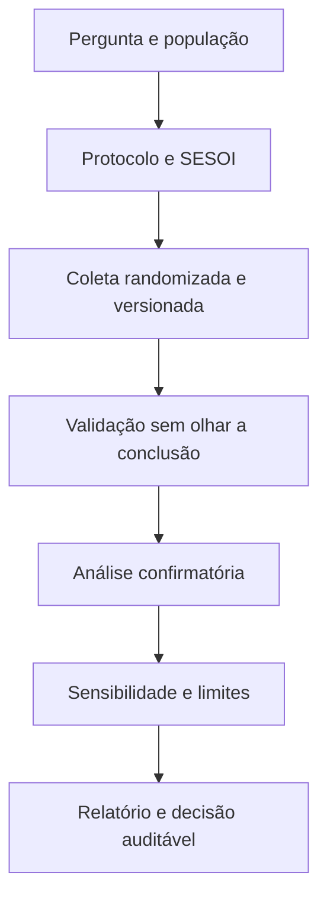

<!-- mirandastech-aula-v2 -->

# Aula 24 — Capstone P3: experimento estatístico honesto e reproduzível

[](https://colab.research.google.com/github/joaopaulomirandamatias/ai-lab/blob/main/02-statistics/notebooks/24-capstone-experimento-estatistico-honesto-laboratorio.ipynb)

> Um sistema de IA governado obteve qualidade média maior que o baseline. Isso basta para adotá-lo? Talvez o ganho seja pequeno, tenha surgido por acaso, dependa de poucas tarefas ou venha acompanhado de latência e custo inaceitáveis.

Este capstone integra o módulo de Estatística. Você transformará uma pergunta em um **protocolo executável**, produzirá evidência com incerteza explícita e escreverá uma conclusão que não exceda o desenho do estudo. O objetivo não é encontrar um resultado “positivo”; é tornar a decisão auditável.

## Problema motivador

Uma equipe compara duas variantes nas mesmas tarefas:

- **baseline:** sistema atual;
- **governado:** sistema com validação de ferramentas, política externa, trilha de auditoria e revisão de saída.

A hipótese é que a variante governada melhora a qualidade. Entretanto, ela pode aumentar latência e custo. Como cada tarefa é executada pelas duas variantes, o desenho é **pareado**: a unidade de análise é a tarefa, e a observação relevante é a diferença dentro de cada tarefa.

O laboratório usa dados sintéticos documentados. Em um estudo real, substitua a geração pelos registros versionados do experimento, sem mudar o protocolo após observar os resultados.

## Objetivos

Ao final, você deverá ser capaz de:

- formular pergunta, população-alvo, unidade de análise e estimando;
- distinguir métrica primária, métricas secundárias e *guardrails*;
- registrar hipótese, SESOI, plano amostral e regra de decisão antes da análise;
- justificar desenho pareado e randomização da ordem de execução;
- validar dados sem contaminar a avaliação;
- estimar efeito pontual, erro-padrão, intervalo de confiança e tamanho de efeito;
- aplicar teste pareado por permutação e interpretar o p-value corretamente;
- controlar multiplicidade nas métricas secundárias;
- executar análises de sensibilidade e heterogeneidade sem promovê-las a confirmação;
- separar significância estatística, relevância prática e viabilidade operacional;
- documentar proveniência, versões, seed, limitações e ameaças à validade;
- produzir um relatório reproduzível e uma decisão condicionada às evidências.

## Pré-requisitos

Este projeto mobiliza especialmente:

- amostragem, representatividade e vazamento da [Aula 12](12-amostragem-vies-leakage.md);
- estimação da [Aula 13](13-estimacao-likelihood-mle-map.md);
- intervalos de confiança da [Aula 14](14-intervalos-confianca.md);
- testes e poder da [Aula 15](15-testes-pvalue-poder.md);
- tamanho de efeito e SESOI da [Aula 16](16-tamanho-efeito.md);
- bootstrap e permutação da [Aula 17](17-bootstrap-permutacao.md);
- múltiplos testes da [Aula 18](18-multiplos-testes-anova.md);
- causalidade e limites de conclusão da [Aula 19](19-correlacao-causalidade.md);
- desenho experimental da [Aula 20](20-desenho-experimental-ab.md).

## Vocabulário do capstone

| Termo | Pergunta que responde |
|---|---|
| População-alvo | Sobre quais casos queremos concluir? |
| Unidade de análise | Qual entidade fornece uma observação independente? |
| Estimando | Qual quantidade populacional queremos estimar? |
| Métrica primária | Qual desfecho sustenta a decisão principal? |
| *Guardrail* | Qual limite não pode piorar além do tolerável? |
| SESOI | Qual é o menor efeito de interesse prático? |
| Protocolo | O que será feito antes, durante e depois da coleta? |
| Análise confirmatória | Análise definida antes de ver os resultados |
| Análise exploratória | Investigação geradora de hipóteses posteriores |
| Proveniência | De onde vieram dados, código, parâmetros e decisões? |
| Ameaça à validade | Mecanismo que pode enfraquecer a interpretação |

## 1. Comece pela pergunta, não pelo teste

Uma pergunta estatística completa contém população, intervenção ou variante, comparação, desfecho e horizonte. Neste projeto:

> Em tarefas representativas do domínio-alvo, qual é a diferença média de qualidade entre o sistema governado e o baseline, quando ambos processam as mesmas tarefas sob ordem randomizada?

Defina o estimando:

\[
\Delta_Q=E\left[Q_{gov}-Q_{base}\right],
\]

em que \(Q_{gov}\) e \(Q_{base}\) são os escores de qualidade da mesma tarefa. O índice “mesma tarefa” é essencial: comparar médias como se fossem grupos independentes descartaria o pareamento.

Uma pergunta não respondida pelo desenho seria: “a governança causará o mesmo ganho em qualquer organização?”. Generalização para outras populações exige amostragem e replicação adequadas.

## 2. Escreva o protocolo antes de analisar

Um protocolo mínimo deve registrar:

1. pergunta e hipótese;
2. população-alvo e critérios de inclusão/exclusão;
3. unidade de análise e estrutura de dependência;
4. métrica primária, secundárias e *guardrails*;
5. SESOI e regra de decisão;
6. tamanho amostral e justificativa;
7. randomização, cegamento e controle de ordem;
8. tratamento de falhas, ausências e duplicatas;
9. método de estimação, IC, teste e correções;
10. análises de sensibilidade e subgrupos pré-especificados;
11. política de parada;
12. artefatos, versões, responsáveis e hash dos dados.

Registrar previamente não impede exploração. Apenas obriga a rotular como exploratório o que foi decidido depois de olhar os dados.



## 3. Métricas: uma principal, várias restrições

Neste estudo, adotaremos:

| Papel | Métrica | Direção desejada | Unidade |
|---|---|---:|---|
| Primária | qualidade avaliada por rubrica | aumentar | pontos entre 0 e 1 |
| Secundária | taxa de erro crítico | diminuir | proporção de tarefas |
| *Guardrail* | latência | não aumentar demais | milissegundos |
| *Guardrail* | custo | não aumentar demais | unidade monetária/tarefa |

A qualidade não deve ser substituída depois por outra métrica que “funcionou”. Latência e custo não precisam melhorar, mas devem permanecer dentro de limites operacionais registrados.

Uma regra de decisão possível é:

- limite inferior do IC 95% de \(\Delta_Q\) acima de zero;
- estimativa de \(\Delta_Q\) pelo menos igual à SESOI de 0,02;
- aumento médio de latência inferior a 450 ms;
- aumento médio de custo inferior a 0,008 por tarefa;
- nenhuma evidência de aumento de erro crítico.

Essa regra combina evidência estatística e valor prático. Pode resultar em “adotar”, “não adotar” ou “coletar mais dados”.

## 4. Por que parear as tarefas

Tarefas variam muito em dificuldade. No desenho independente, a variabilidade entre tarefas entra no erro. No desenho pareado, calculamos

\[
d_i=Q_{gov,i}-Q_{base,i}
\]

e analisamos \(d_1,\ldots,d_n\). A dificuldade compartilhada tende a se cancelar.

O erro-padrão da diferença média é

\[
SE(\bar d)=\frac{s_d}{\sqrt n},
\]

onde \(s_d\) é o desvio-padrão amostral das diferenças. A independência necessária passa a ser entre tarefas, não entre as duas medições da mesma tarefa.

Pareamento incorreto também existe. Se uma tarefa for repetida muitas vezes, a unidade pode ser tarefa — ou usuário, cenário ou sessão — e não cada linha. Tratar repetições correlacionadas como independentes estreita o IC artificialmente.

## 5. Randomização, ordem e cegamento

Executar sempre o baseline primeiro pode misturar efeito da variante com aquecimento de cache, fadiga do avaliador ou mudanças externas. Randomize a ordem dentro de cada tarefa e registre-a.

Quando houver avaliação humana:

- o avaliador não deve saber qual variante produziu a saída, quando possível;
- a rubrica deve existir antes da coleta;
- exemplos de ancoragem devem ser comuns aos avaliadores;
- desacordos e adjudicação devem ser registrados;
- confiabilidade entre avaliadores deve ser avaliada se houver mais de um.

Randomização protege contra confundimento sistemático em expectativa; ela não corrige amostra pouco representativa, métrica ruim ou execução inconsistente.

## 6. Validação dos dados antes da inferência

Validação não é procurar o resultado. É verificar se a tabela corresponde ao protocolo:

- `task_id` é único na unidade declarada;
- ambas as variantes estão presentes para cada tarefa;
- domínios e dificuldades pertencem ao universo permitido;
- escores estão em \([0,1]\);
- latência e custo são finitos e não negativos;
- ordem foi randomizada sem desequilíbrio extremo;
- ausências e falhas têm códigos explícitos;
- hashes e versões identificam a extração.

Uma falha de sistema não deve desaparecer silenciosamente. Defina se ela recebe pior escore, entra em taxa de falha ou torna a tarefa inelegível segundo regra prévia. Excluir apenas falhas da variante nova cria viés.

## 7. Estimativa, IC e tamanho de efeito

A estimativa primária é

\[
\widehat\Delta_Q=\bar d=\frac{1}{n}\sum_{i=1}^{n}d_i.
\]

Sob condições adequadas, um IC t pareado de 95% é

\[
\bar d\pm t_{0{,}975,n-1}\frac{s_d}{\sqrt n}.
\]

Reporte também o tamanho de efeito padronizado pareado:

\[
d_z=\frac{\bar d}{s_d}.
\]

O efeito bruto em pontos é o mais diretamente acionável; \(d_z\) ajuda a comparar com a variabilidade das diferenças. Nenhum deles substitui o IC.

### Exemplo de leitura

Suponha \(\widehat\Delta_Q=0{,}027\), IC 95% \([0{,}020;0{,}034]\) e SESOI 0,02:

- o intervalo exclui zero;
- a estimativa supera a SESOI;
- o limite inferior coincide com a fronteira prática;
- a decisão ainda depende dos *guardrails* e da validade do estudo.

Não escreva “há 95% de probabilidade de o parâmetro estar no intervalo” sob a interpretação frequentista. O procedimento produz intervalos que cobrem o parâmetro em 95% de repetições sob suas premissas.

## 8. Teste de permutação pareado

Sob a hipótese nula de ausência de efeito e com diferenças simétricas/exchangeáveis quanto ao sinal, trocar o sinal de cada \(d_i\) não altera a distribuição. Uma estatística Monte Carlo é gerada por

\[
\bar d^{(b)}=\frac1n\sum_{i=1}^{n}s_i^{(b)}d_i,
\qquad s_i^{(b)}\in\{-1,+1\}.
\]

O p-value bilateral com correção Monte Carlo é

\[
p=\frac{1+\#\{|\bar d^{(b)}|\ge|\bar d|\}}{B+1}.
\]

Ele mede quão incompatível é a estatística observada com esse mecanismo nulo. Não é a probabilidade de \(H_0\) ser verdadeira e não mede importância prática.

## 9. Métricas secundárias e multiplicidade

Se três métricas secundárias forem testadas a \(\alpha=0{,}05\), a chance familiar de pelo menos um falso positivo pode exceder 5%. O procedimento de Holm ordena os p-values e compara o menor com \(\alpha/m\), o seguinte com \(\alpha/(m-1)\) e assim por diante, preservando a taxa de erro familiar.

No capstone:

- qualidade é primária e não entra na família secundária;
- latência, custo e erro crítico formam uma família planejada;
- apresente efeitos e ICs, não apenas decisões binárias;
- não transforme um subgrupo exploratório em nova hipótese confirmatória.

Para erro crítico binário pareado, as discordâncias importam. O teste exato de McNemar pode ser formulado como teste binomial sobre as tarefas em que somente uma das variantes errou.

## 10. Sensibilidade e robustez

Uma única análise raramente revela todas as fragilidades. Defina verificações plausíveis:

| Risco | Análise de sensibilidade |
|---|---|
| poucas diferenças extremas | média aparada e mediana das diferenças |
| efeito de ordem | comparar diferenças por ordem randomizada |
| domínio específico | IC por domínio, rotulado como exploratório |
| falhas operacionais | intenção de avaliar: preservar tarefas conforme regra |
| escala limitada em \([0,1]\) | bootstrap por tarefa e inspeção dos limites |
| dependência por usuário | reamostrar/agrupar no nível do usuário |

Sensibilidade não é escolher a versão mais favorável. Mostre todas as análises previstas e explique se a conclusão muda.

## 11. Ameaças à validade

### Validade interna

- ordem não randomizada;
- rubrica alterada durante o estudo;
- avaliador identifica a variante;
- exclusão diferencial de falhas;
- execução em infraestrutura diferente.

### Validade de construto

- qualidade medida por proxy inadequada;
- custo incompleto;
- “erro crítico” sem definição operacional;
- benchmark contaminado ou memorizado.

### Validade externa

- tarefas não representam produção;
- idioma, domínio ou complexidade restritos;
- único modelo, provedor ou período;
- dados sintéticos, como neste laboratório, não demonstram efeito real.

### Validade estatística

- amostra pequena;
- unidade de análise incorreta;
- múltiplas comparações não declaradas;
- parada opcional;
- distribuição e dependência incompatíveis com o método.

## 12. Proveniência e pacote reproduzível

O pacote mínimo deve permitir reconstruir o resultado:

```text
protocolo.md
dados/raw/manifesto.json
dados/processed/avaliacao.parquet
notebooks/analise.ipynb
src/metricas.py
requirements-lock.txt
relatorio.md
```

Registre:

- origem e licença dos dados;
- instante e critérios da extração;
- hash do arquivo bruto e processado;
- commit do código;
- versões de Python e bibliotecas;
- seed e gerador pseudoaleatório;
- configuração das variantes;
- decisões de limpeza e exclusão;
- quem avaliou, com qual rubrica e em qual versão.

Uma seed reproduz a sequência pseudoaleatória em um ambiente compatível; não substitui versionamento de dados, dependências e configuração.


## 13. Da evidência à decisão

Uma tabela de decisão evita que um único p-value domine a interpretação:

| Evidência | Pergunta | Possível ação |
|---|---|---|
| IC cruza zero | efeito ainda incerto? | ampliar estudo ou não adotar |
| IC acima de zero, abaixo da SESOI | ganho existe, mas importa? | avaliar custo de oportunidade |
| efeito supera SESOI, *guardrail* falha | benefício compensa dano? | otimizar ou rejeitar variante |
| efeito supera SESOI e limites passam | estudo é válido e generalizável? | piloto controlado e monitoramento |
| resultados variam por domínio | hipótese de heterogeneidade | novo estudo confirmatório |

Mesmo quando todos os critérios passam, a formulação correta é condicionada: “nestas tarefas, sob este protocolo e estas versões”.

## 14. Relatório final: estrutura recomendada

1. **Resumo executivo:** pergunta, efeito, IC, *guardrails* e decisão.
2. **Protocolo:** hipóteses, SESOI e plano registrado.
3. **Dados:** população, amostra, unidade, ausências e proveniência.
4. **Métodos:** randomização, métricas, IC, testes e multiplicidade.
5. **Resultados:** fluxograma de casos, tabela principal e figura.
6. **Sensibilidade:** análises robustas e subgrupos exploratórios.
7. **Limitações:** ameaças à validade e escopo da conclusão.
8. **Reprodutibilidade:** commit, hashes, versões e instruções.
9. **Decisão:** regra aplicada e próximos passos.

Inclua obrigatoriamente uma frase explícita:

> **Este resultado não prova que a variante governada será superior em outros domínios, populações, modelos ou condições operacionais.**

## 15. Armadilhas e erros comuns

1. **Escolher a hipótese depois de ver o gráfico.** Rotule descobertas posteriores como exploratórias.
2. **Tratar execuções repetidas como unidades independentes.** Use a entidade que foi amostrada.
3. **Ignorar pareamento.** Analise diferenças dentro da mesma tarefa.
4. **Excluir falhas apenas da variante nova.** Preserve intenção de avaliar conforme regra prévia.
5. **Reportar só p-value.** Mostre efeito, IC, SESOI e *guardrails*.
6. **Confundir ausência de significância com equivalência.** Equivalência exige margens e teste próprios.
7. **Testar dezenas de métricas sem correção.** Defina famílias e hierarquia.
8. **Usar média de médias com pesos implícitos.** Agregue na unidade correta.
9. **Fazer EDA do desfecho de teste para redesenhar o protocolo.** Isso consome independência confirmatória.
10. **Omitir versões do sistema.** Um nome de modelo não identifica configuração completa.
11. **Generalizar benchmark para produção.** Discuta representatividade e mudança de distribuição.
12. **Confundir reprodutibilidade computacional com replicação científica.** Rodar o mesmo código não testa generalização.

## 16. Checklist de aprovação

### Pergunta e desenho

- [ ] Pergunta, população-alvo, unidade e estimando estão explícitos.
- [ ] Métrica primária, SESOI e *guardrails* foram definidos antes da análise.
- [ ] Pareamento, randomização, ordem e cegamento foram tratados.
- [ ] Critérios de inclusão, falha, ausência e parada estão registrados.

### Análise

- [ ] A tabela foi validada contra o protocolo.
- [ ] O efeito bruto possui IC e tamanho padronizado.
- [ ] O teste responde à hipótese e suas premissas foram discutidas.
- [ ] Métricas secundárias receberam correção de multiplicidade.
- [ ] Sensibilidade e subgrupos estão claramente rotulados.

### Reprodutibilidade e comunicação

- [ ] Dados, código, dependências, configuração e seed estão versionados.
- [ ] Proveniência e hashes permitem rastrear os artefatos.
- [ ] Tabelas e gráficos têm unidade, legenda e texto alternativo.
- [ ] Limitações cobrem validade interna, externa, estatística e de construto.
- [ ] A conclusão não excede o desenho.
- [ ] A frase “Este resultado não prova que…” está presente.

## 17. Laboratório reproduzível

O [notebook do capstone](../notebooks/24-capstone-experimento-estatistico-honesto-laboratorio.ipynb) implementa um estudo completo com dados sintéticos e seed fixa. Ele contém:

- protocolo e regra de decisão registrados antes da geração;
- 240 tarefas em quatro domínios;
- ordem randomizada e medições pareadas;
- validação de schema, intervalos e unicidade;
- efeito médio, IC t, bootstrap, \(d_z\) e teste por permutação;
- latência, custo e erro crítico com correção de Holm;
- análises robustas, efeito de ordem e heterogeneidade exploratória;
- tabela decisória, gráfico reproduzível e asserções automáticas.

Os números são uma demonstração metodológica, não evidência sobre um produto real.

## 18. Exercícios

### 1. Unidade de análise

Cada um de 40 usuários avalia 10 tarefas nas duas variantes. Por que \(n=400\) pode ser inadequado para o erro-padrão?

### 2. Pareamento

As diferenças de qualidade têm média 0,03, desvio-padrão 0,12 e \(n=144\). Calcule o erro-padrão e um IC 95% aproximado com \(z=1{,}96\).

### 3. Relevância prática

Um IC 95% para o ganho é \([0{,}001;0{,}009]\), com SESOI 0,02. O resultado é estatisticamente positivo e praticamente suficiente?

### 4. Multiplicidade

Por que a métrica primária não deve ser escolhida entre cinco métricas após a coleta?

### 5. Falhas

A variante governada falhou em 8% das tarefas, que foram removidas antes de calcular qualidade. Qual é o risco?

### 6. Permutação

Em 9.999 permutações, 24 estatísticas foram tão extremas quanto a observada. Calcule o p-value corrigido.

### 7. Generalização

O estudo usou apenas perguntas curtas em português. Escreva uma conclusão que respeite esse escopo.

## 19. Respostas comentadas

### 1.

As dez tarefas do mesmo usuário podem ser correlacionadas. A unidade independente pode ser o usuário; usar 400 linhas como independentes produz erro-padrão otimista. Modele ou reamostre no nível do usuário.

### 2.

\[
SE=\frac{0{,}12}{\sqrt{144}}=0{,}01.
\]

O intervalo aproximado é \(0{,}03\pm1{,}96(0{,}01)=[0{,}0104;0{,}0496]\).

### 3.

O intervalo está acima de zero, mas todo ele fica abaixo da SESOI. Há evidência de ganho positivo sob o método, não de ganho suficientemente relevante segundo a regra definida.

### 4.

Escolher o melhor resultado entre cinco incorpora multiplicidade e viés de seleção. A métrica primária deve ser definida antes; as demais formam famílias secundárias ou análises exploratórias.

### 5.

Há seleção pós-tratamento: removem-se justamente casos em que a variante teve pior resultado. A qualidade condicionada ao sucesso fica otimista. Falhas precisam entrar segundo regra registrada.

### 6.

\[
p=\frac{24+1}{9999+1}=0{,}0025.
\]

### 7.

“Nas perguntas curtas em português incluídas neste estudo, sob as versões e condições registradas, a variante apresentou o efeito estimado. O resultado não estabelece desempenho em textos longos, outros idiomas ou produção.”

## 20. Resumo

- Evidência confiável começa com pergunta, unidade, estimando e protocolo.
- Métrica primária, SESOI e *guardrails* devem preceder a análise.
- Desenhos pareados controlam a variação compartilhada entre tarefas.
- Randomização de ordem e cegamento reduzem vieses previsíveis.
- Efeito, IC e relevância prática são mais informativos que um p-value isolado.
- Permutação exige uma hipótese de troca compatível com o desenho.
- Métricas secundárias e subgrupos exigem controle e transparência.
- Sensibilidade deve desafiar a conclusão, não procurar a análise mais favorável.
- Proveniência, hashes, versões e seed tornam o caminho auditável.
- Dados sintéticos ensinam o método, mas não provam desempenho real.
- A força da conclusão nunca pode exceder o desenho e a população estudada.

## 21. Transição para Machine Learning

Você encerrou Estatística com um experimento completo. O próximo ciclo retorna ao módulo **03 · Machine Learning**, preservando as Aulas 01 e 02 já concluídas, e moderniza a [Aula 03 — Pré-processamento, pipelines e data leakage](../../03-machine-learning/aulas/03-preprocessamento-pipelines-leakage.md). A disciplina estatística deste capstone será a base para separar treino, validação e teste sem contaminar a estimativa de generalização.

## Referências técnicas

- DIEZ, David M.; BARR, Christopher D.; ÇETINKAYA-RUNDEL, Mine. [*OpenIntro Statistics*](https://www.openintro.org/book/os/). Livro aberto sobre inferência e experimentação.
- NIST/SEMATECH. [*e-Handbook of Statistical Methods*](https://www.itl.nist.gov/div898/handbook/). Referência institucional para desenho, análise e diagnóstico.
- WASSERSTEIN, Ronald L.; LAZAR, Nicole A. [The ASA Statement on p-Values](https://doi.org/10.1080/00031305.2016.1154108). *The American Statistician*, 2016.
- NOSEK, Brian A. et al. [The preregistration revolution](https://doi.org/10.1073/pnas.1708274114). *PNAS*, 2018.
- WILKINSON, Mark D. et al. [The FAIR Guiding Principles for scientific data management and stewardship](https://doi.org/10.1038/sdata.2016.18). *Scientific Data*, 2016.
- SCIPY. [`scipy.stats`](https://docs.scipy.org/doc/scipy/reference/stats.html). Documentação oficial para testes, intervalos e reamostragem.
- NUMPY. [Random sampling](https://numpy.org/doc/stable/reference/random/). Documentação oficial do gerador pseudoaleatório.

## Material complementar

- THE TURING WAY COMMUNITY. [*The Turing Way: a handbook for reproducible, ethical and collaborative data science*](https://the-turing-way.netlify.app/). Guia aberto de práticas reprodutíveis.
