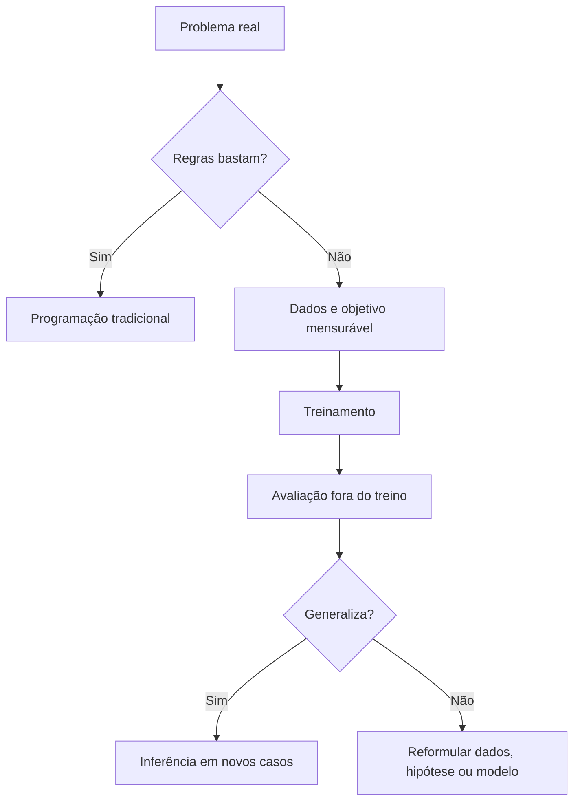
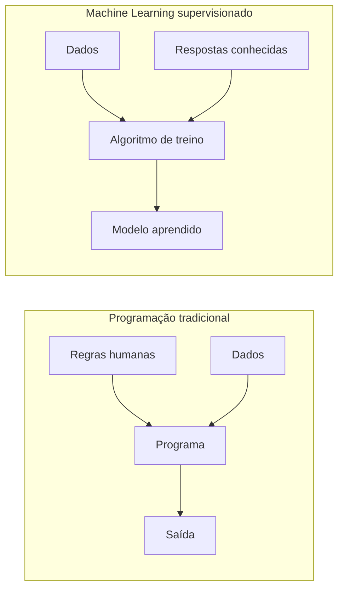
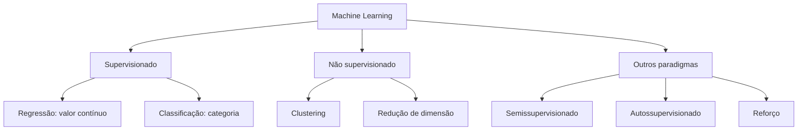
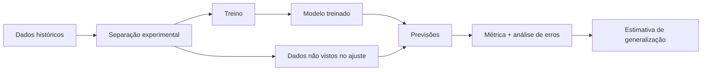
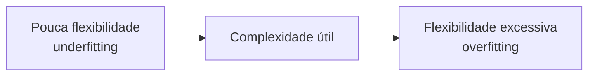

# Aula 01 — Fundamentos de Machine Learning: do problema à generalização

**Trilha:** Especialista em IA  
**Módulo:** 03 · Machine Learning clássico (M4)  
**Aula:** 01 de 24  
**Pré-requisitos:** noções de álgebra linear, probabilidade e estatística  
**Tempo sugerido:** 3 a 4 horas, incluindo laboratório e exercícios  
**Objetivo central:** compreender o que uma máquina realmente aprende, distinguir os principais paradigmas e avaliar se um modelo aprendeu um padrão generalizável — e não apenas memorizou os dados.

> **Ideia-chave:** treinar um modelo não é o objetivo final. O objetivo é produzir previsões úteis para exemplos que o modelo ainda não viu.

## O que você será capaz de fazer ao final

Ao concluir esta aula, você deverá conseguir:

- explicar quando um problema pode — ou não — se beneficiar de Machine Learning;
- distinguir aprendizagem supervisionada, não supervisionada, semissupervisionada, autossupervisionada e por reforço;
- definir amostra, *feature*, *target*, modelo, parâmetro, hiperparâmetro, função de perda e inferência;
- explicar treinamento, validação e generalização sem depender de jargões;
- reconhecer sinais de *underfitting* e *overfitting*;
- executar e interpretar um experimento mínimo e reproduzível em Python.

## Mapa da aula



---

## 1. Comece pelo problema, não pelo algoritmo

Imagine que uma empresa queira decidir se deve aprovar uma compra no cartão.

Uma regra explícita poderia ser:

```text
SE valor > R$ 10.000 E país != país habitual
ENTÃO solicitar verificação adicional
```

Esse tipo de solução é fácil de explicar e testar. Se poucas regras estáveis resolvem o problema, talvez você **não precise de Machine Learning**.

Agora suponha que o risco dependa da combinação de dezenas de sinais: horário, sequência recente de compras, dispositivo, localização aproximada, histórico do estabelecimento e padrões que mudam ao longo do tempo. Escrever manualmente todas as combinações pode se tornar inviável. Nesse cenário, um algoritmo pode usar exemplos históricos para estimar uma função que relacione sinais de entrada ao resultado desejado.

Machine Learning é útil quando:

- existe um padrão que pode ser aprendido a partir de dados;
- o resultado desejado pode ser definido e medido;
- regras manuais são insuficientes, caras ou frágeis;
- há exemplos representativos do contexto em que o sistema será usado;
- o custo de produzir e manter o modelo é menor que o benefício esperado.

Machine Learning pode ser a escolha errada quando:

- uma regra simples resolve o problema de forma confiável;
- não há dados suficientes ou os dados não representam o uso real;
- o evento é essencialmente imprevisível com as informações disponíveis;
- o erro não é tolerável e não existe supervisão ou mecanismo seguro de fallback;
- o objetivo não foi definido de forma mensurável.

> **Pergunta de engenharia:** se você não consegue explicar qual decisão será apoiada, que informação estará disponível naquele momento e como o erro será medido, ainda não existe um problema de ML bem formulado.

## 2. Programação tradicional × Machine Learning

Na programação tradicional, uma pessoa escreve as regras. Em aprendizagem supervisionada, o algoritmo estima as regras internas — os parâmetros — a partir de exemplos.



Depois do treinamento, o modelo recebe novos dados e produz uma previsão:

$$
\hat y=f_{\theta}(x)
$$

onde:

- $x$ representa as informações de entrada;
- $f$ é a família de funções escolhida;
- $\theta$ são os parâmetros aprendidos;
- $\hat y$ é a previsão;
- $y$ é o valor real, quando ele está disponível.

O modelo não “entende” o problema como uma pessoa. Ele ajusta uma função segundo um objetivo matemático e os exemplos fornecidos. Por isso, a qualidade do resultado depende tanto dos dados e do desenho do experimento quanto do algoritmo.

## 3. Vocabulário essencial

| Termo | Significado | Exemplo em detecção de spam |
|---|---|---|
| **Amostra ou exemplo** | Uma unidade observada do dataset | Um e-mail |
| **Feature** | Informação usada como entrada | Frequência de palavras, remetente, número de links |
| **Target, label ou alvo** | Resultado que queremos prever | `spam` ou `não spam` |
| **Dataset** | Conjunto organizado de exemplos | Histórico de e-mails classificados |
| **Modelo** | Função parametrizada que transforma entradas em previsões | Regressão logística, árvore de decisão |
| **Parâmetro** | Valor aprendido durante o treinamento | Peso associado à frequência de uma palavra |
| **Hiperparâmetro** | Configuração escolhida antes ou durante o processo de seleção | Profundidade máxima de uma árvore |
| **Função de perda** | Quantifica o erro que o treinamento tenta reduzir | Log loss, erro quadrático |
| **Treinamento** | Ajuste dos parâmetros a partir dos dados | Aprender pesos usando e-mails rotulados |
| **Inferência** | Uso do modelo já treinado em um novo caso | Classificar um e-mail recém-recebido |
| **Generalização** | Desempenho em casos não usados no ajuste | Manter qualidade em novos e-mails |

### Parâmetro não é hiperparâmetro

Considere uma árvore de decisão:

- os pontos de corte aprendidos pela árvore são **parâmetros**;
- `max_depth=3`, escolhido pelo pesquisador, é um **hiperparâmetro**.

Durante o treinamento, o algoritmo aprende parâmetros. O processo experimental escolhe hiperparâmetros. A Aula 18 tratará essa seleção com profundidade.

## 4. Os principais paradigmas de aprendizagem

“Supervisionado” e “não supervisionado” não são sinônimos de “com” e “sem inteligência”. Eles descrevem o tipo de sinal disponível durante o aprendizado.

| Paradigma | Sinal de aprendizagem | Pergunta típica | Exemplos |
|---|---|---|---|
| **Supervisionado** | Pares de entrada e resposta $(x,y)$ | “Qual será o resultado?” | Classificação de spam, previsão de preço |
| **Não supervisionado** | Entradas $x$, sem um alvo explícito | “Que estrutura existe nesses dados?” | Agrupamento, redução de dimensionalidade |
| **Semissupervisionado** | Poucos exemplos rotulados e muitos não rotulados | “Como aproveitar dados sem rótulo?” | Classificação de imagens com poucos rótulos |
| **Autossupervisionado** | O próprio dado gera o sinal de treinamento | “Que parte do dado pode ser prevista a partir de outra?” | Prever tokens ocultos, contrastar representações |
| **Por reforço** | Recompensas após ações em um ambiente | “Que sequência de ações maximiza o retorno?” | Controle, jogos, robótica |



### Uma correção conceitual importante

Aprendizagem **semissupervisionada** e **autossupervisionada** não são a mesma coisa:

- na semissupervisionada, existem rótulos humanos ou externos, mas em pequena quantidade;
- na autossupervisionada, o sinal de treino é construído automaticamente a partir da estrutura do próprio dado.

Esta trilha concentra-se primeiro em Machine Learning clássico supervisionado e, mais adiante, aborda aprendizagem não supervisionada nas aulas 21 e 22.

## 5. Treinamento, avaliação e inferência

Essas três etapas têm papéis diferentes:

1. **Treinamento:** o algoritmo observa exemplos e ajusta os parâmetros do modelo.
2. **Avaliação fora do treino:** exemplos separados ajudam a estimar se o padrão aprendido funciona além da amostra usada no ajuste.
3. **Inferência:** o modelo já treinado recebe dados novos e produz previsões.



> A separação correta entre treino, validação e teste será construída passo a passo na Aula 02. Por enquanto, guarde a fronteira essencial: **avaliar nos mesmos exemplos usados para ajustar o modelo mede memória de treino, não generalização**.

### O que é generalizar?

Generalizar é manter desempenho útil em novos exemplos provenientes do contexto de interesse. “Novo” não significa apenas uma linha que não estava no arquivo de treino. Pode significar:

- outro cliente;
- outro equipamento;
- outro hospital;
- uma data futura;
- uma região diferente;
- uma condição operacional ainda não observada.

Portanto, nenhuma métrica prova generalização universal. Ela estima desempenho sob hipóteses sobre população, tempo, dependência entre exemplos e estabilidade da distribuição.

## 6. A matemática mínima do aprendizado supervisionado

Considere um conjunto de treinamento

$$
D=\{(x_1,y_1),(x_2,y_2),\ldots,(x_n,y_n)\}.
$$

O algoritmo procura parâmetros $\theta$ que reduzam a perda média nos exemplos observados:

$$
\hat{\theta}=\arg\min_{\theta}\hat R_n(\theta)
=\arg\min_{\theta}\frac{1}{n}\sum_{i=1}^{n}L(f_{\theta}(x_i),y_i).
$$

Leia a equação da direita para a esquerda:

1. o modelo $f_\theta$ produz uma previsão para $x_i$;
2. a função $L$ mede a diferença entre previsão e resposta real;
3. calculamos a média das perdas nos $n$ exemplos;
4. procuramos parâmetros que tornem essa média pequena.

Essa média é o **risco empírico**. Reduzi-la é necessário, mas não garante bom desempenho fora do treino.

<details>
<summary><strong>Aprofundamento opcional — risco populacional</strong></summary>

O objetivo ideal seria minimizar a perda esperada na distribuição de uso:

$$
R(\theta)=\mathbb{E}_{(X,Y)\sim P_{\text{alvo}}}
[L(f_\theta(X),Y)].
$$

Como $P_{\text{alvo}}$ é desconhecida, usamos amostras. A diferença entre o desempenho esperado e o observado no treino é relacionada ao **gap de generalização**. Essa interpretação só é válida se o experimento representar adequadamente o uso pretendido.

</details>

## 7. Underfitting, ajuste adequado e overfitting

### Underfitting

O modelo é simples demais, foi treinado de forma insuficiente ou não recebeu informação capaz de representar o padrão. Ele erra no treino e também fora dele. É um quadro associado a **alto viés**.

### Ajuste adequado

O modelo captura a estrutura relevante sem se tornar excessivamente sensível às particularidades da amostra. Os erros de treino e avaliação são compatíveis com o ruído e com a dificuldade do problema.

### Overfitting

O modelo se ajusta muito bem ao treino, inclusive a ruídos e coincidências, mas perde desempenho em dados não vistos. É um quadro associado a **alta variância**.

| Padrão observado | Treino | Dados não vistos | Diagnóstico provável |
|---|---:|---:|---|
| Erro alto nos dois | ruim | ruim | Underfitting, features fracas ou problema difícil |
| Erro baixo no treino e bem maior fora | ótimo | ruim | Overfitting |
| Erro semelhante e aceitável | bom | bom | Ajuste potencialmente adequado |



### E o erro irredutível?

Mesmo o melhor modelo possível pode errar quando:

- o fenômeno contém aleatoriedade;
- informações relevantes não estão disponíveis;
- os rótulos têm erros ou ambiguidades;
- casos diferentes possuem as mesmas features observadas.

Esse componente é chamado **erro irredutível**. Adicionar complexidade não cria informação ausente; às vezes apenas aumenta o overfitting.

> **Cuidado:** diferença entre treino e avaliação é um sinal, não um diagnóstico automático. Amostras pequenas, splits inadequados, mudança temporal e leakage também podem produzir resultados enganosos.

## 8. Exemplo numérico resolvido

Considere três soluções avaliadas em exemplos que não participaram do ajuste:

| Solução | Erro no treino | Erro fora do treino | Gap |
|---|---:|---:|---:|
| Regra majoritária | — | 9% | — |
| Modelo linear | 7% | 8% | 1 p.p. |
| Árvore sem limite | 2% | 11% | 9 p.p. |

A árvore tem o menor erro de treino, mas o pior resultado fora dele — inclusive pior que a regra majoritária. O modelo linear erra mais no treino, porém apresenta o melhor resultado nos exemplos separados.

Conclusões sustentadas pelo exemplo:

- menor erro de treino não significa melhor modelo;
- um baseline simples é necessário para dar contexto à métrica;
- o gap ajuda a investigar overfitting;
- escolher um modelo exige considerar incerteza, custo dos erros e estabilidade.

Conclusões **não** sustentadas:

- que o modelo linear sempre será melhor;
- que um único split garante desempenho futuro;
- que 8% de erro é aceitável para qualquer aplicação.

## 9. Prática interativa no navegador

Antes do laboratório completo, use o microdesafio abaixo para interpretar scores de treino, validação e gap. Ele roda em Python diretamente no navegador, sem configuração local.

**[Abrir o microdesafio da Aula 01 no Coddy](https://coddy.tech/embed-editor?lang=python&theme=dark&code=IyBBdWxhIDAxIC0gZGlhZ25vc3RpY28gZGlkYXRpY28gZGUgZ2VuZXJhbGl6YWNhbwojIFJlZ3JhIGhldXJpc3RpY2EgcGFyYSBhcHJlbmRlcjsgbmFvIGUgdW0gbGltaWFyIHVuaXZlcnNhbC4KCmRlZiBkaWFnbm9zdGljYXIobm9tZSwgYWNjdXJhY3lfdHJlaW5vLCBhY2N1cmFjeV92YWxpZGFjYW8pOgogICAgZ2FwID0gYWNjdXJhY3lfdHJlaW5vIC0gYWNjdXJhY3lfdmFsaWRhY2FvCiAgICBpZiBhY2N1cmFjeV90cmVpbm8gPCAwLjc1IGFuZCBhY2N1cmFjeV92YWxpZGFjYW8gPCAwLjc1OgogICAgICAgIGxlaXR1cmEgPSAicG9zc2l2ZWwgdW5kZXJmaXR0aW5nIgogICAgZWxpZiBnYXAgPiAwLjA4OgogICAgICAgIGxlaXR1cmEgPSAicG9zc2l2ZWwgb3ZlcmZpdHRpbmciCiAgICBlbHNlOgogICAgICAgIGxlaXR1cmEgPSAiZ2VuZXJhbGl6YWNhbyBwbGF1c2l2ZWw7IGludmVzdGlndWUgbWFpcyIKICAgIHByaW50KGYie25vbWU6MjJ9IHRyZWlubz17YWNjdXJhY3lfdHJlaW5vOi4zZn0gIHZhbGlkYWNhbz17YWNjdXJhY3lfdmFsaWRhY2FvOi4zZn0gIGdhcD17Z2FwOisuM2Z9IikKICAgIHByaW50KGYiICAtPiB7bGVpdHVyYX1cbiIpCgpleHBlcmltZW50b3MgPSBbCiAgICAoImJhc2VsaW5lIiwgMC41MDAsIDAuNTAwKSwKICAgICgiYXJ2b3JlX2RlcHRoXzEiLCAwLjgyMywgMC44NjApLAogICAgKCJhcnZvcmVfZGVwdGhfMyIsIDAuOTA1LCAwLjkzNSksCiAgICAoImFydm9yZV9zZW1fbGltaXRlIiwgMS4wMDAsIDAuODcwKSwKXQoKZm9yIGV4cGVyaW1lbnRvIGluIGV4cGVyaW1lbnRvczoKICAgIGRpYWdub3N0aWNhcigqZXhwZXJpbWVudG8pCgojIERFU0FGSU86CiMgMS4gTXVkZSBvcyBzY29yZXMgZSBvYnNlcnZlIG8gZGlhZ25vc3RpY28uCiMgMi4gQ3JpZSB1bSBjYXNvIGNvbSB0cmVpbm89MC45OCBlIHZhbGlkYWNhbz0wLjYwLgojIDMuIEV4cGxpcXVlIHBvciBxdWUgYSBoZXVyaXN0aWNhIG5hbyBwcm92YSBnZW5lcmFsaXphY2FvLgo%3D&credit=1)**

O programa aplica uma heurística didática aos resultados. Depois de executá-lo:

1. mude os scores de treino e validação;
2. crie um caso com treino `0.98` e validação `0.60`;
3. altere o limiar do gap;
4. explique por que essa regra ajuda a investigar, mas não prova generalização.

> No artigo do MirandasTech, o editor será incorporado diretamente na página. O GitHub bloqueia `iframe`, por isso esta versão oferece o link executável.

### Notebook completo no Google Colab

Para executar o experimento com gráficos e alterar ruído, tamanho da amostra e complexidade do modelo, abra o notebook complementar:

[](https://colab.research.google.com/github/joaopaulomirandamatias/ai-lab/blob/main/03-machine-learning/notebooks/01-fundamentos-machine-learning-laboratorio.ipynb)

O microdesafio treina interpretação rápida; o notebook permite investigação reproduzível com `scikit-learn` e `matplotlib`.

## 10. Laboratório guiado: veja a generalização acontecer

Usaremos um dataset sintético e balanceado com duas classes. O objetivo não é dominar regressão logística ou árvores agora; é observar como complexidade, treino e avaliação interagem.

### 10.1 Preparação

```bash
python -m pip install numpy pandas matplotlib scikit-learn
```

### 10.2 Experimento completo

```python
import numpy as np
import pandas as pd
import matplotlib.pyplot as plt

from sklearn.datasets import make_moons
from sklearn.dummy import DummyClassifier
from sklearn.linear_model import LogisticRegression
from sklearn.metrics import accuracy_score
from sklearn.model_selection import train_test_split
from sklearn.pipeline import make_pipeline
from sklearn.preprocessing import StandardScaler
from sklearn.tree import DecisionTreeClassifier

# 1) Dataset sintético: duas classes em formato de luas
X, y = make_moons(n_samples=800, noise=0.28, random_state=42)

# 2) Holdout didático. A Aula 02 formalizará os papéis dos splits.
X_train, X_valid, y_train, y_valid = train_test_split(
    X,
    y,
    test_size=0.25,
    stratify=y,
    random_state=42,
)

# 3) Modelos com capacidades diferentes
models = {
    "baseline": DummyClassifier(strategy="most_frequent"),
    "linear": make_pipeline(StandardScaler(), LogisticRegression()),
    "arvore_depth_1": DecisionTreeClassifier(max_depth=1, random_state=42),
    "arvore_depth_3": DecisionTreeClassifier(max_depth=3, random_state=42),
    "arvore_sem_limite": DecisionTreeClassifier(random_state=42),
}

# 4) Treinamento e avaliação
rows = []
for name, model in models.items():
    model.fit(X_train, y_train)
    acc_train = accuracy_score(y_train, model.predict(X_train))
    acc_valid = accuracy_score(y_valid, model.predict(X_valid))
    rows.append({
        "modelo": name,
        "accuracy_treino": acc_train,
        "accuracy_validacao": acc_valid,
        "gap": acc_train - acc_valid,
    })

results = pd.DataFrame(rows).sort_values("accuracy_validacao", ascending=False)
print(results.round(3).to_string(index=False))

# 5) Fronteiras de decisão para três árvores
def plot_boundary(ax, model, title):
    x_min, x_max = X[:, 0].min() - 0.5, X[:, 0].max() + 0.5
    y_min, y_max = X[:, 1].min() - 0.5, X[:, 1].max() + 0.5
    xx, yy = np.meshgrid(
        np.linspace(x_min, x_max, 350),
        np.linspace(y_min, y_max, 350),
    )
    grid = np.c_[xx.ravel(), yy.ravel()]
    zz = model.predict(grid).reshape(xx.shape)
    ax.contourf(xx, yy, zz, alpha=0.25, cmap="coolwarm")
    ax.scatter(X_valid[:, 0], X_valid[:, 1], c=y_valid, s=18,
               edgecolor="white", linewidth=0.25, cmap="coolwarm")
    ax.set_title(title)
    ax.set_xticks([])
    ax.set_yticks([])

fig, axes = plt.subplots(1, 3, figsize=(12, 3.8))
for ax, key, title in zip(
    axes,
    ["arvore_depth_1", "arvore_depth_3", "arvore_sem_limite"],
    ["Pouca flexibilidade", "Complexidade útil", "Flexibilidade excessiva"],
):
    plot_boundary(ax, models[key], title)

plt.tight_layout()
plt.show()
```

Com as versões atuais das bibliotecas e a semente fixada, o resultado esperado é aproximadamente:

| Modelo | Accuracy treino | Accuracy validação | Gap |
|---|---:|---:|---:|
| Baseline | 0,500 | 0,500 | 0,000 |
| Linear | 0,853 | 0,885 | −0,032 |
| Árvore depth 1 | 0,823 | 0,860 | −0,037 |
| Árvore depth 3 | 0,905 | 0,935 | −0,030 |
| Árvore sem limite | 1,000 | 0,870 | 0,130 |

Uma pontuação de validação ocasionalmente maior que a de treino não é paradoxal: o subconjunto separado pode ter ficado um pouco mais fácil por variação amostral. O sinal mais importante aqui é a árvore ilimitada atingir 100% no treino e cair fora dele.

### 10.3 O que observar no gráfico

- **Profundidade 1:** fronteira simples demais; não acompanha a geometria das classes.
- **Profundidade 3:** captura a estrutura principal sem fragmentar excessivamente o espaço.
- **Sem limite:** cria regiões pequenas para acertar particularidades do treino; isso é compatível com overfitting.

### 10.4 Experimentos adicionais

Execute uma alteração por vez:

1. Troque `noise=0.28` por `0.10` e depois por `0.45`.
2. Troque `n_samples=800` por `100` e depois por `5_000`.
3. Teste profundidades `2`, `4`, `8` e `None`.
4. Repita com sementes de 0 a 9 e registre média e dispersão.
5. Explique por que escolher a melhor profundidade usando repetidamente o mesmo holdout tornaria a estimativa otimista.

> **Nota metodológica:** usamos accuracy porque o dataset é sintético e balanceado. Em problemas reais, a métrica deve refletir prevalência, custos e tipo de erro. As aulas 13 a 16 aprofundarão avaliação, limiares e classes desbalanceadas.

## 11. Protocolo mínimo de um experimento honesto

Antes de executar:

- escreva a pergunta e a hipótese;
- defina o que representa cada amostra;
- registre quais informações estarão disponíveis no instante da previsão;
- estabeleça um baseline;
- escolha uma métrica coerente com a decisão.

Durante o experimento:

- mantenha a separação entre dados de ajuste e avaliação;
- altere uma decisão por vez;
- registre seed, versões, preprocessing e hiperparâmetros;
- compare o modelo ao baseline.

Depois de executar:

- analise exemplos de erro, não apenas a média;
- registre o que o resultado sustenta e o que não sustenta;
- declare limitações e ameaças à validade;
- preserve código e configuração para reprodução.

## 12. Onde os primeiros projetos costumam errar

1. **Começar pelo algoritmo:** “quero usar Random Forest” não é uma pergunta de pesquisa nem um objetivo de negócio.
2. **Avaliar no treino:** mede o quanto o modelo se ajustou aos exemplos conhecidos.
3. **Confundir correlação com informação utilizável:** uma feature pode revelar o futuro ou o próprio target.
4. **Ignorar o baseline:** 95% pode ser inútil se uma regra simples obtém 99%.
5. **Tratar um split como verdade:** uma única amostra de avaliação contém incerteza.
6. **Usar complexidade para compensar falta de informação:** nenhum modelo aprende uma variável que não foi observada.
7. **Prometer generalização universal:** toda conclusão vale para uma população e um cenário definidos.

## 13. Teste sua compreensão

### Questões conceituais

1. Em que situação uma regra explícita seria melhor que ML?
2. Qual é a diferença entre treinamento e inferência?
3. Por que semissupervisionado e autossupervisionado não são sinônimos?
4. O que significa dizer que um modelo generaliza?
5. Dê um exemplo de parâmetro e outro de hiperparâmetro.
6. Como treino quase perfeito pode coexistir com desempenho ruim fora do treino?
7. O que é erro irredutível?

<details>
<summary><strong>Respostas orientadoras</strong></summary>

1. Quando poucas regras estáveis, auditáveis e baratas resolvem o problema com segurança.
2. Treinamento ajusta parâmetros; inferência usa os parâmetros já ajustados para prever novos casos.
3. O semissupervisionado combina exemplos rotulados e não rotulados; o autossupervisionado deriva o sinal do próprio dado.
4. Significa manter desempenho útil em exemplos não usados no ajuste e representativos do uso pretendido.
5. Peso de um modelo linear; profundidade máxima configurada para uma árvore.
6. O modelo pode memorizar ruído e particularidades da amostra — overfitting.
7. É a parcela de erro causada por aleatoriedade, informação ausente ou ambiguidade que o modelo não consegue eliminar apenas aumentando complexidade.

</details>

### Desafio de transferência

Escolha um problema do seu contexto e preencha:

| Campo | Sua definição |
|---|---|
| Decisão apoiada | |
| Unidade de análise | |
| Entrada disponível no momento da decisão | |
| Resultado a prever ou estrutura a descobrir | |
| Paradigma de aprendizagem | |
| Baseline | |
| Custo de falso positivo | |
| Custo de falso negativo | |
| Cenário em que o modelo será usado | |
| Principal risco de generalização | |

Se algum campo essencial não puder ser preenchido, a próxima tarefa é entender melhor o problema — não escolher um algoritmo.

## 14. Critério de domínio

Você domina esta aula quando consegue, sem consultar o texto:

- explicar ML usando um exemplo próprio;
- identificar se o problema é regressão, classificação, não supervisionado ou não precisa de ML;
- desenhar o ciclo dados → treinamento → modelo → inferência → avaliação;
- explicar parâmetros, hiperparâmetros, perda e generalização;
- interpretar a diferença entre scores de treino e avaliação;
- executar o laboratório, alterar uma hipótese e defender sua conclusão.

### Rubrica

| Nível | Evidência de aprendizagem |
|---:|---|
| 0 — Reconhecimento | Repete termos, mas não explica o mecanismo |
| 1 — Reprodução | Executa o código pronto |
| 2 — Compreensão | Explica resultados e símbolos das equações |
| 3 — Diagnóstico | Prevê underfitting/overfitting e investiga erros |
| 4 — Transferência | Formula e defende um experimento novo e reproduzível |

Avance quando alcançar pelo menos o nível 3.

## 15. Vídeo complementar

**StatQuest — A Gentle Introduction to Machine Learning** (11 min, em inglês, com legendas automáticas). O vídeo apresenta classificação, regressão, viés, variância e avaliação por meio de exemplos visuais simples.

[](https://www.youtube.com/watch?v=Gv9_4yMHFhI)

Use o vídeo como revisão visual depois de ler as seções 1 a 8. Ao assistir, responda: **qual exemplo representa underfitting e qual representa overfitting?**

## 16. Leituras e fontes verificadas

### Essenciais

- Gareth James, Daniela Witten, Trevor Hastie, Robert Tibshirani e Jonathan Taylor. [*An Introduction to Statistical Learning with Applications in Python*](https://www.statlearning.com/), capítulos 1 e 2. Livro aberto, com abordagem aplicada.
- Kevin P. Murphy. [*Probabilistic Machine Learning: An Introduction*](https://probml.github.io/pml-book/book1.html), capítulo 1. Base probabilística para decisão, perda e aprendizagem.
- Trevor Hastie, Robert Tibshirani e Jerome Friedman. [*The Elements of Statistical Learning*](https://hastie.su.domains/ElemStatLearn/), capítulos 2 e 7. Tratamento clássico de generalização, viés e variância.

### Materiais práticos e visuais

- Google for Developers. [Machine Learning Crash Course](https://developers.google.com/machine-learning/crash-course). Curso com vídeos, visualizações interativas e exercícios.
- Coddy. [Editor de código incorporável](https://coddy.tech/embed/pt). Playground executável usado no microdesafio desta aula.
- scikit-learn. [Underfitting vs. Overfitting](https://scikit-learn.org/stable/auto_examples/model_selection/plot_underfitting_overfitting.html). Exemplo visual reproduzível.
- scikit-learn. [Learning curves](https://scikit-learn.org/stable/modules/learning_curve.html). Como interpretar scores de treino e validação.
- Stanford CS229. [Bias–Variance Analysis](https://cs229.stanford.edu/summer2019/BiasVarianceAnalysis.pdf). Notas de aula para aprofundamento matemático.

## 17. Continue a formação

**Próxima aula:** [Aula 02 — Do problema ao experimento: features, target, splits e baseline](./02-framing-dataset-split-baseline.md)

Na próxima etapa, você transformará uma pergunta real em um protocolo mensurável, definindo unidade de análise, instante de predição, features, target, baseline e papéis de treino, validação e teste.

---

**Repositório da formação:** [AI Systems Laboratory](https://github.com/joaopaulomirandamatias/ai-lab)  
**Série:** Machine Learning clássico · 24 aulas
