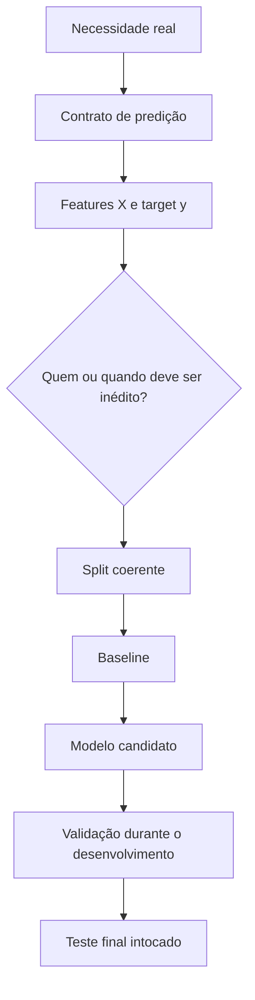
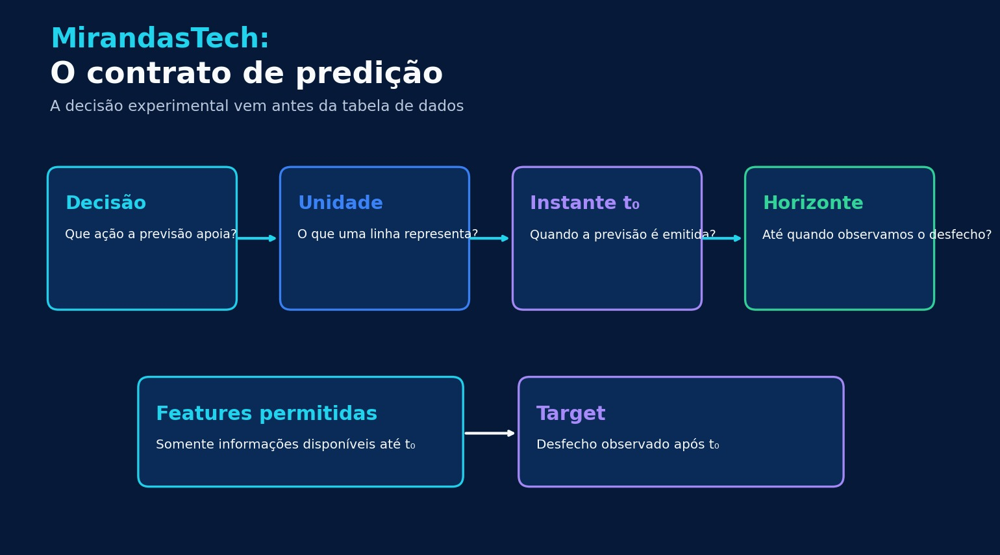
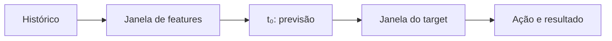
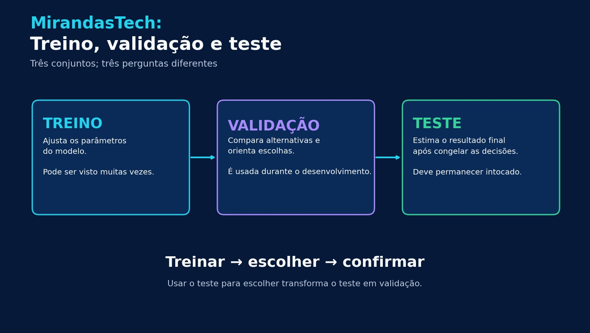
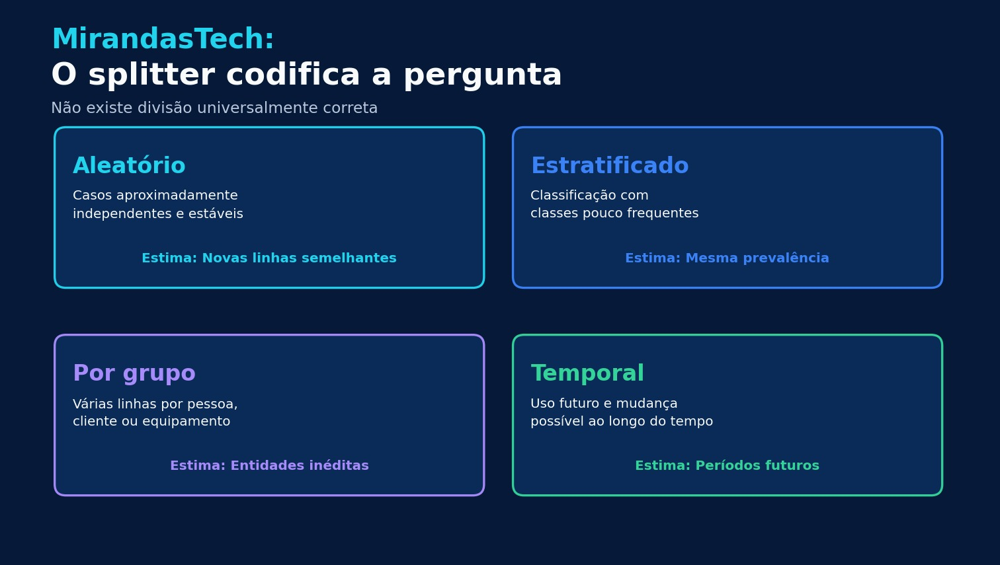
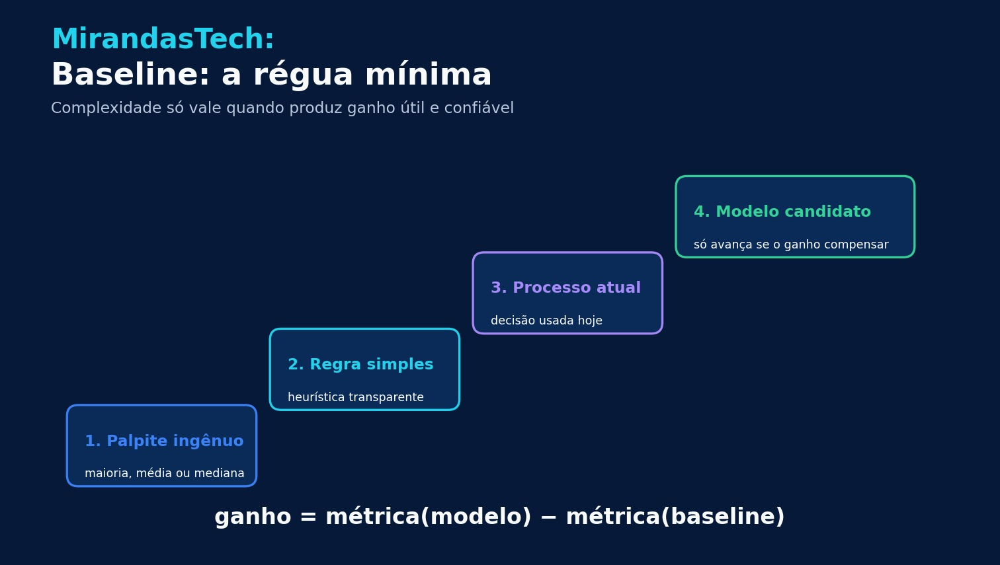
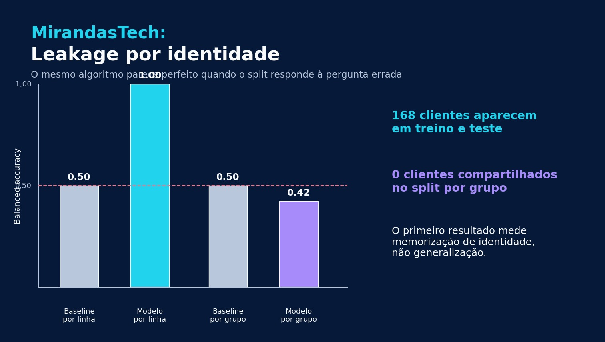

# Aula 02 — Do problema ao experimento: features, target, splits e baseline

**Trilha:** Especialista em IA<br>
**Módulo:** 03 · Machine Learning clássico (M4)<br>
**Aula:** 02 de 24<br>
**Pré-requisito:** Aula 01 — Fundamentos de Machine Learning<br>
**Tempo sugerido:** 3 a 4 horas, incluindo laboratório e exercícios<br>
**Objetivo central:** transformar uma necessidade real em um experimento de Machine Learning mensurável, reproduzível e coerente com o cenário de uso.

> **Ideia-chave:** o *split* não é uma tarefa administrativa. Ele codifica a pergunta “para quais casos novos este modelo deverá generalizar?”.


## O que você será capaz de fazer ao final

Ao concluir esta aula, você deverá conseguir:

- escrever um **contrato de predição** com decisão, unidade de análise, população, instante de predição e horizonte;
- separar **features** e **target** respeitando o que existia no momento da decisão;
- explicar os papéis diferentes de treino, validação e teste;
- escolher entre split aleatório, estratificado, por grupo ou temporal;
- construir baselines que representem alternativas reais;
- detectar avaliações enganosas causadas por identidade repetida, tempo ou uso recorrente do teste;
- executar e documentar um experimento mínimo em Python.

## Mapa da aula



---

## 1. O experimento começa antes do dataset

Considere o pedido: “use IA para reduzir atrasos de entrega”. Ainda não existe um problema de ML bem definido. Reduzir atraso é uma intenção de negócio; falta dizer **qual previsão será feita, para quem, quando e para apoiar qual decisão**.

Compare três formulações:

1. “Prever atrasos.” — ampla demais para orientar coleta ou avaliação.
2. “Classificar se uma entrega atrasará.” — melhor, mas ainda sem instante nem horizonte.
3. “No momento da expedição, estimar se cada entrega chegará mais de 24 horas após o prazo, para priorizar contato com a transportadora.” — testável.

A terceira formulação estabelece uma fronteira operacional. Ela informa quando a previsão precisa existir, qual desfecho será observado e qual ação poderá ser tomada.

Uma boa pergunta preditiva segue este molde:

> Para cada **[unidade]** elegível, no instante **[t₀]**, usar **[informações disponíveis]** para estimar **[desfecho]** no horizonte **[período]**, apoiando **[decisão]**.

## 2. Escreva um contrato de predição

O contrato de predição é uma especificação curta que liga negócio, dados e avaliação.



| Campo | Pergunta | Exemplo: atraso de entrega |
|---|---|---|
| **Decisão** | O que alguém fará com a previsão? | Priorizar contato preventivo com a transportadora |
| **Unidade de análise** | O que uma linha representa? | Uma entrega |
| **População elegível** | Quais casos recebem previsão? | Entregas expedidas e ainda não concluídas |
| **Instante de predição $t_0$** | Quando o modelo será chamado? | Momento da expedição |
| **Horizonte** | Até quando observaremos o resultado? | Data prometida + 24 horas |
| **Target** | Qual desfecho será previsto? | `1` se o atraso exceder 24 h; `0` caso contrário |
| **Features permitidas** | O que existe até $t_0$? | Rota, transportadora, distância, dia, histórico anterior |
| **Features proibidas** | O que só existe depois? | Data real de entrega, status final, dias totais de atraso |
| **Cenário de generalização** | O que deve ser inédito na avaliação? | Entregas futuras; talvez novos clientes ou novas rotas |
| **Métrica e guardrail** | Como sucesso e dano serão medidos? | Métrica principal + limite de falsos alertas |

### Unidade de análise: o significado de uma linha

Uma linha pode representar uma pessoa, transação, pedido, equipamento, imagem ou janela temporal. Essa escolha determina o significado das features, do target e do split.

Se uma pessoa gera dez transações, existem dez linhas, mas não dez pessoas independentes. Ignorar essa dependência pode colocar transações da mesma pessoa em treino e teste. O modelo então reconhece a identidade ou o comportamento já visto, embora o objetivo declarado talvez seja avaliar pessoas novas.

> **Teste rápido:** termine a frase “uma linha do meu dataset representa…”. Se a resposta for ambígua, pare antes de treinar.

## 3. Desenhe a linha do tempo: features antes, target depois

Defina $t_0$ como o instante em que a previsão será produzida. Depois separe quatro janelas:



- **Histórico e janela de features:** apenas dados disponíveis até $t_0$.
- **Instante $t_0$:** momento em que o sistema recebe a entrada e emite a previsão.
- **Janela do target:** período posterior usado para definir o desfecho real.
- **Horizonte de uso:** período em que a previsão ainda permite uma ação útil.

Formalmente, um exemplo supervisionado pode ser escrito como $(x_i,y_i)$, em que:

$$
x_i=\text{informações disponíveis para o caso }i\text{ até }t_0
$$

e

$$
y_i=\text{desfecho observado após }t_0.
$$

### O vazamento mais fácil de ignorar

Imagine uma coluna `dias_ate_entrega`. Ela parece perfeita para prever atraso. Porém, só pode ser calculada depois que a entrega ocorreu. Durante o treinamento histórico a coluna existe; no uso real, não. Esse é um caso de **target leakage**: informação relacionada ao desfecho entra no conjunto de features de uma forma que não estará legitimamente disponível no momento da previsão.

Nesta aula, leakage é a violação da fronteira entre o que o modelo pode conhecer ao aprender e o que poderá conhecer ao prever. A Aula 03 mostrará como evitá-lo dentro das transformações e dos pipelines.

## 4. Features e target: entradas não são respostas disfarçadas

Em aprendizagem supervisionada, organizamos os dados como:

$$
X\in\mathbb{R}^{n\times p},\qquad y\in\mathbb{R}^{n}
$$

onde $n$ é o número de exemplos e $p$ o número de features. O modelo usa $X$ para produzir uma estimativa $\hat y$ e compara essa estimativa com $y$ durante o treinamento.

Para o problema de atraso:

| Variável | Papel | Disponível em $t_0$? | Usar? |
|---|---|---:|---:|
| Distância planejada | Feature | Sim | Sim |
| Transportadora | Feature | Sim | Sim |
| Atrasos anteriores da rota, calculados até ontem | Feature | Sim | Sim |
| Data real da entrega | Define o target | Não | Não como feature |
| Status “entrega concluída com atraso” | Resposta retrospectiva | Não | Não como feature |
| Identificador bruto do cliente | Identidade | Sim | Só com justificativa e split compatível |

Uma feature pode existir no banco de dados e ainda assim ser inválida. A pergunta correta não é “a coluna está preenchida?”, mas “essa informação existiria, com esse mesmo significado, quando o modelo fosse usado?”.

## 5. Treino, validação e teste têm papéis diferentes



### Treino

O conjunto de treino ajusta os **parâmetros** do modelo. Uma regressão logística aprende pesos; uma árvore escolhe cortes. É esperado que o algoritmo observe esses exemplos repetidamente.

### Validação

O conjunto de validação orienta decisões de desenvolvimento: quais features usar, qual família de modelo comparar, quais hiperparâmetros testar e quando interromper uma busca. Portanto, mesmo sem ajustar diretamente os parâmetros, o processo humano se adapta à validação.

### Teste

O teste estima o desempenho do procedimento já escolhido. Ele deve ser consultado depois que contrato, features, transformação, algoritmo e hiperparâmetros estiverem congelados.

Se você olha o teste e modifica o modelo, aquele conjunto passou a influenciar a escolha. Na prática, virou validação. A solução não é fingir que isso não aconteceu; é registrar a decisão e reservar um novo conjunto realmente externo quando necessário.

> **Frase para guardar:** treino ajusta, validação escolhe, teste confirma.

Não existe proporção universal como 70/15/15. O tamanho depende do volume de dados, da variabilidade, da raridade do evento e da precisão necessária na estimativa final. A regra metodológica é preservar os papéis.

## 6. O splitter codifica o cenário de generalização

O splitter deve imitar a fronteira que existirá entre passado conhecido e futuro desconhecido. Escolhê-lo exige responder: **o que precisa ser novo no mundo real?**



| Estratégia | Quando faz sentido | O que ela estima | Risco se usada incorretamente |
|---|---|---|---|
| **Aleatória** | Exemplos aproximadamente independentes e distribuição estável | Novas linhas da mesma população | Misturar entidades ou períodos dependentes |
| **Estratificada** | Classificação com classe pouco frequente | Novas linhas preservando aproximadamente a prevalência | Não resolve dependência por tempo ou grupo |
| **Por grupo** | Várias linhas por pessoa, cliente, equipamento, documento ou unidade | Generalização para grupos inéditos | Resultado otimista por identidade compartilhada |
| **Temporal** | A previsão será usada no futuro | Treinar no passado e avaliar em períodos posteriores | Treinar com o futuro e “prever” o passado |

### Split aleatório

Use quando as linhas podem ser tratadas como aproximadamente independentes e o uso futuro se parece com a população amostrada. `train_test_split(..., random_state=42)` oferece um holdout simples e reproduzível.

### Split estratificado

Em classificação, `stratify=y` ajuda a preservar a proporção das classes nas partições. Isso reduz o risco de uma classe rara desaparecer por acaso de uma partição pequena. Estratificação não corrige leakage temporal nem por grupo.

### Split por grupo

Use quando várias linhas pertencem à mesma entidade e a avaliação deve representar entidades novas. Com `GroupShuffleSplit`, o tamanho do teste se refere à proporção de **grupos**, não necessariamente à proporção exata de linhas.

### Split temporal

Se o sistema será treinado com o passado para operar no futuro, a avaliação deve respeitar a ordem temporal. Embaralhar datas pode permitir que padrões posteriores influenciem o treinamento. A Aula 17 retomará séries temporais, folds e cross-validation em profundidade.

### Situações híbridas

Um hospital pode ter pacientes repetidos ao longo do tempo; uma frota pode ter equipamentos repetidos em meses sucessivos. Nesses casos, talvez seja necessário respeitar **grupo e tempo** ao mesmo tempo. A biblioteca pode não oferecer uma única função que expresse a regra exata; documente e teste o splitter construído para o domínio.

## 7. Baseline: a régua mínima do experimento

Um número isolado não diz se um modelo agrega valor. Compare-o com uma alternativa simples e plausível.



Boas referências incluem:

1. **baseline ingênuo:** média ou mediana em regressão; classe majoritária em classificação;
2. **baseline temporal:** último valor conhecido ou média móvel;
3. **regra simples:** heurística transparente, como sinalizar rotas com taxa histórica acima de um limite;
4. **processo atual:** regra, modelo ou decisão humana usada hoje.

O ganho observado é:

$$
\text{ganho}=\text{métrica(modelo)}-\text{métrica(baseline)}.
$$

Para métricas em que menor é melhor, como MAE, inverta a subtração ou declare explicitamente a direção. O ganho técnico também precisa compensar custos de coleta, latência, manutenção, explicabilidade e erro operacional.

No scikit-learn, `DummyClassifier` e `DummyRegressor` implementam regras simples que ignoram as features. Eles não são candidatos de produção; são réguas de sanidade.

## 8. Métrica nasce do custo do erro

Suponha 1.000 entregas, das quais 200 atrasam. Prever sempre “no prazo” produz:

$$
Accuracy=\frac{800}{1000}=0{,}80.
$$

O número parece alto, mas o sistema não encontra nenhuma entrega atrasada. Se a ação de negócio é intervir antes do atraso, esse baseline tem utilidade quase nula para o objetivo.

Antes de escolher uma métrica, responda:

- qual erro é mais caro: falso positivo ou falso negativo?
- existe capacidade limitada para agir sobre alertas?
- a previsão será uma classe, uma probabilidade ou um ranking?
- há grupos para os quais o dano precisa ser monitorado separadamente?

Nesta aula, usaremos **balanced accuracy** apenas para que cada classe contribua igualmente no laboratório. Precision, recall, F1, ROC, PR-AUC, calibração e escolha de limiar serão estudados nas aulas 14 e 16.

## 9. Exemplo completo: previsão de atraso

Vamos fechar o contrato:

- **decisão:** priorizar contato preventivo com a transportadora;
- **unidade:** uma entrega;
- **população:** entregas expedidas e ainda em trânsito;
- **$t_0$:** instante de expedição;
- **target:** atraso superior a 24 horas em relação ao prazo prometido;
- **features permitidas:** rota, distância, tipo de serviço, transportadora, dia e histórico calculado antes de $t_0$;
- **features proibidas:** horário real de chegada, status final e qualquer agregação atualizada após $t_0$;
- **split principal:** temporal, se a operação usa o modelo em períodos futuros;
- **controle adicional:** por cliente ou rota, se o objetivo inclui entidades inéditas;
- **baseline:** regra vigente e `DummyClassifier`;
- **métrica principal:** escolhida conforme o custo operacional;
- **teste:** período futuro reservado e consultado apenas no encerramento.

Observe que nenhum algoritmo foi escolhido. Mesmo assim, grande parte do risco metodológico já foi tratada.

## 10. Microdesafio interativo — escolha o split

Abra o editor, altere as quatro respostas e execute. Para cada cenário, escolha entre `aleatorio`, `temporal`, `grupo` e `estratificado`.

[▶ Executar o microdesafio no Coddy](https://coddy.tech/embed-editor?lang=python&theme=dark&layout=stacked&code=IyBNaWNyb2Rlc2FmaW86IHF1YWwgc3BsaXQgcmVzcG9uZGUgw6AgcGVyZ3VudGEgcmVhbD8KY2VuYXJpb3MgPSBbCiAgICAiUHJldmVyIGF0cmFzbyBlbSBub3ZvcyBwZWRpZG9zIGluZGVwZW5kZW50ZXMiLAogICAgIlByZXZlciBmcmF1ZGUgZW0gdHJhbnNhw6fDtWVzIGZ1dHVyYXMiLAogICAgIkF2YWxpYXIgcmlzY28gZW0gcGFjaWVudGVzIGRlIGhvc3BpdGFpcyBpbsOpZGl0b3MiLAogICAgIk1hbnRlciBhIHByb3BvcsOnw6NvIGRlIHVtYSBjbGFzc2UgcmFyYSBlbSBjYWRhIHBhcnRpw6fDo28iLApdCgojIEVkaXRlIGFzIHJlc3Bvc3RhczogYWxlYXRvcmlvLCB0ZW1wb3JhbCwgZ3J1cG8gb3UgZXN0cmF0aWZpY2FkbwpyZXNwb3N0YXMgPSBbImFsZWF0b3JpbyIsICJhbGVhdG9yaW8iLCAiYWxlYXRvcmlvIiwgImFsZWF0b3JpbyJdCmdhYmFyaXRvID0gWyJhbGVhdG9yaW8iLCAidGVtcG9yYWwiLCAiZ3J1cG8iLCAiZXN0cmF0aWZpY2FkbyJdCgpmb3IgY2VuYXJpbywgcmVzcG9zdGEsIGNvcnJldGEgaW4gemlwKGNlbmFyaW9zLCByZXNwb3N0YXMsIGdhYmFyaXRvKToKICAgIHN0YXR1cyA9ICLinIUiIGlmIHJlc3Bvc3RhID09IGNvcnJldGEgZWxzZSAi4p2MIgogICAgcHJpbnQoZiJ7c3RhdHVzfSB7Y2VuYXJpb30iKQogICAgaWYgcmVzcG9zdGEgIT0gY29ycmV0YToKICAgICAgICBwcmludChmIiAgIFN1YSByZXNwb3N0YToge3Jlc3Bvc3RhfSB8IFJldmVqYSBhIHBlcmd1bnRhIGRlIGdlbmVyYWxpemHDp8Ojby4iKQoKYWNlcnRvcyA9IHN1bShyID09IGcgZm9yIHIsIGcgaW4gemlwKHJlc3Bvc3RhcywgZ2FiYXJpdG8pKQpwcmludChmIlxuUmVzdWx0YWRvOiB7YWNlcnRvc30ve2xlbihnYWJhcml0byl9IikK)

No blog, o mesmo exercício aparece incorporado e executa sem instalação. No GitHub, o link é o fallback compatível.

## 11. Laboratório guiado — quando 1,00 é um resultado ruim

O laboratório cria 240 clientes, cada um com cinco registros. Cada cliente recebe uma classe fixa e aleatória. O único “sinal” disponível é seu identificador numérico.

O experimento pergunta: **um modelo que memoriza clientes já vistos funciona para clientes inéditos?**

### Hipótese antes de executar

- Com split por linha, o mesmo cliente aparecerá em treino e teste. Um vizinho mais próximo poderá memorizar sua classe e parecer perfeito.
- Com split por grupo, clientes de teste serão inéditos. Como as classes foram sorteadas, o identificador não contém um padrão generalizável e o desempenho deverá ficar próximo do acaso.

```python
import numpy as np
from sklearn.dummy import DummyClassifier
from sklearn.metrics import balanced_accuracy_score
from sklearn.model_selection import GroupShuffleSplit, train_test_split
from sklearn.neighbors import KNeighborsClassifier

rng = np.random.default_rng(42)
n_clientes = 240
linhas_por_cliente = 5

cliente_id = np.repeat(np.arange(n_clientes), linhas_por_cliente)
classe_do_cliente = rng.integers(0, 2, size=n_clientes)
y = np.repeat(classe_do_cliente, linhas_por_cliente)
X = cliente_id.reshape(-1, 1)
indices = np.arange(len(y))

# Cenário enganoso: embaralhar linhas
treino_linha, teste_linha = train_test_split(
    indices, test_size=0.20, stratify=y, random_state=42
)

# Cenário honesto para clientes novos: separar entidades
splitter = GroupShuffleSplit(n_splits=1, test_size=0.20, random_state=42)
treino_grupo, teste_grupo = next(splitter.split(X, y, groups=cliente_id))

def avaliar(treino, teste):
    baseline = DummyClassifier(strategy="most_frequent")
    modelo = KNeighborsClassifier(n_neighbors=1)

    baseline.fit(X[treino], y[treino])
    modelo.fit(X[treino], y[treino])

    return {
        "baseline": balanced_accuracy_score(y[teste], baseline.predict(X[teste])),
        "modelo": balanced_accuracy_score(y[teste], modelo.predict(X[teste])),
        "clientes_compartilhados": len(
            set(cliente_id[treino]) & set(cliente_id[teste])
        ),
    }

print("Split por linha:", avaliar(treino_linha, teste_linha))
print("Split por grupo:", avaliar(treino_grupo, teste_grupo))

assert set(cliente_id[treino_grupo]).isdisjoint(cliente_id[teste_grupo])
```

Com a seed indicada, o resultado esperado é aproximadamente:

```text
Split por linha:  baseline=0.50, modelo=1.00, clientes compartilhados=168
Split por grupo:  baseline=0.50, modelo=0.42, clientes compartilhados=0
```



### Interpretação

`1,00` não significa que descobrimos um fenômeno útil. Significa que o experimento permitiu reconhecer entidades já vistas. Ao mudar a pergunta para “generaliza para clientes novos?”, a habilidade desaparece.

O modelo não piorou entre um split e outro. **Mudou o que foi medido.** O primeiro protocolo mede memorização em clientes repetidos; o segundo estima transferência para identidades inéditas.

> O exemplo é deliberadamente sintético e extremo. Em dados reais, o vazamento pode ser parcial: a métrica não chega a 1,00, mas continua otimista.

[](https://colab.research.google.com/github/joaopaulomirandamatias/ai-lab/blob/main/03-machine-learning/notebooks/02-framing-dataset-split-baseline-laboratorio.ipynb)

## 12. Protocolo mínimo de um experimento honesto

Antes de treinar:

- escreva o contrato de predição;
- declare a hipótese;
- congele a regra que cria o target;
- liste features permitidas e proibidas;
- escolha o splitter a partir do cenário de generalização;
- reserve o teste;
- defina baseline, métrica principal e guardrails.

Durante o desenvolvimento:

- ajuste apenas no treino;
- use validação para comparar alternativas;
- altere uma decisão relevante por vez;
- mantenha a mesma divisão nas comparações;
- registre seed, versões, parâmetros e origem dos dados;
- verifique automaticamente a separação de grupos ou tempo.

Ao encerrar:

- congele a configuração;
- avalie uma vez no teste;
- reporte modelo e baseline;
- inspecione erros e subgrupos relevantes;
- declare limitações e o que o experimento **não** demonstra.

## 13. Armadilhas comuns

### “Embaralhar resolve tudo”

Embaralhar distribui linhas; não elimina dependência entre linhas da mesma pessoa nem respeita causalidade temporal.

### “O identificador existe, então pode ser feature”

Um ID pode permitir memorização. Às vezes ele é necessário para separar grupos, mas não deve automaticamente entrar em $X$.

### “O teste está separado, então posso consultá-lo sempre”

Escolhas repetidas com base no teste adaptam o processo às peculiaridades desse conjunto. Separe validação de teste.

### “Meu modelo tem 90%, então é bom”

Sem métrica, baseline, prevalência, protocolo e custo do erro, 90% é apenas um número.

### “A mesma regra de target vale para produção”

Rótulos históricos podem chegar com atraso, ser revisados ou depender de processos indisponíveis online. Documente como e quando o target é observado.

### “Cross-validation corrige um split errado”

Repetir várias divisões inadequadas produz várias estimativas inadequadas. Primeiro defina a unidade e as restrições; a Aula 17 aprofundará folds e cross-validation.

## 14. Verifique sua compreensão

1. Um paciente possui várias consultas. O objetivo é avaliar pacientes novos. Qual é a unidade de grupo?
2. A previsão é emitida na admissão hospitalar. A duração total da internação pode ser feature?
3. Qual conjunto deve orientar a escolha entre duas famílias de modelos?
4. Quando um split temporal é preferível a um aleatório?
5. Um modelo supera a classe majoritária, mas não supera a regra usada hoje. O que falta demonstrar?

<details>
<summary><strong>Ver respostas comentadas</strong></summary>

1. O identificador do paciente; consultas do mesmo paciente devem permanecer juntas.
2. Não. A duração total só é conhecida após a alta e pertence ao futuro de $t_0$.
3. Validação. O teste deve confirmar a configuração congelada.
4. Quando o uso ocorrerá em períodos posteriores e a ordem temporal afeta disponibilidade ou distribuição.
5. Que a complexidade do modelo produz ganho operacional sobre a alternativa real, e não só sobre um palpite ingênuo.

</details>

## 15. Desafio de transferência

Escolha um problema do AI Systems Laboratory e entregue um arquivo `prediction-contract.md` com:

```markdown
# Contrato de predição

- Decisão apoiada:
- Unidade de análise:
- População elegível:
- Instante de predição (t0):
- Horizonte:
- Target e regra de rotulação:
- Features permitidas:
- Features proibidas:
- Cenário de generalização:
- Split e justificativa:
- Baseline ingênuo:
- Baseline operacional:
- Métrica principal e direção:
- Guardrails:
- Limitações conhecidas:
```

Depois implemente dois protocolos, um plausível e um deliberadamente incorreto. Antes de executar, preveja qual será mais otimista e explique por quê. Compare os resultados e identifique o mecanismo da diferença.

## 16. Rubrica de domínio

- **0 — reconhecimento:** identifica os termos, mas não os relaciona ao uso.
- **1 — reprodução:** executa um split pronto e calcula uma métrica.
- **2 — compreensão:** escreve o contrato e explica os papéis das partições.
- **3 — diagnóstico:** prevê leakage, justifica o splitter e cria testes de separação.
- **4 — transferência:** projeta e defende um experimento novo, reproduzível e auditável.

Avance quando atingir pelo menos o nível 3: você consegue detectar um protocolo enganoso antes de celebrar a métrica.

## 17. Vídeo complementar

Para reforçar a diferença entre treino, validação e teste, assista a **“Intuition: Training Set vs. Test Set vs. Validation Set”**. Enquanto assiste, anote que tipo de decisão usa cada partição e por que reutilizar o teste reduz sua força como evidência.

[▶ Assistir no YouTube](https://www.youtube.com/watch?v=swCf51Z8QDo)

## 18. Leituras verificadas

- Google Machine Learning Crash Course — [Dividing the original dataset](https://developers.google.com/machine-learning/crash-course/overfitting/dividing-datasets): papéis de treino, validação e teste, desgaste por uso repetido e duplicatas.
- scikit-learn — [`GroupShuffleSplit`](https://scikit-learn.org/stable/modules/generated/sklearn.model_selection.GroupShuffleSplit.html): separação por grupos e interpretação de `test_size`.
- scikit-learn — [`DummyClassifier`](https://scikit-learn.org/stable/modules/generated/sklearn.dummy.DummyClassifier.html): baselines que ignoram as features.
- scikit-learn — [`TimeSeriesSplit`](https://scikit-learn.org/stable/modules/generated/sklearn.model_selection.TimeSeriesSplit.html): avaliação respeitando ordem temporal.
- Kaufman, Rosset, Perlich e Stitelman — [Leakage in Data Mining: Formulation, Detection, and Avoidance](https://doi.org/10.1145/2382577.2382579), ACM TKDD, 2012.
- James et al. — [An Introduction to Statistical Learning](https://www.statlearning.com/), capítulos sobre avaliação e reamostragem.

## 19. Próxima aula

Na **Aula 03 — Pré-processamento, pipelines e data leakage**, você aprenderá a aplicar imputação, escala e codificação sem deixar que estatísticas da validação ou do teste contaminem o treinamento.

Até aqui, você definiu **o que** será previsto e **como** a avaliação deve representar o mundo. Na próxima aula, protegerá essa fronteira dentro do código.
