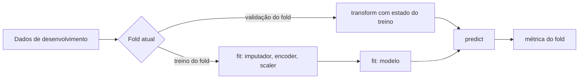
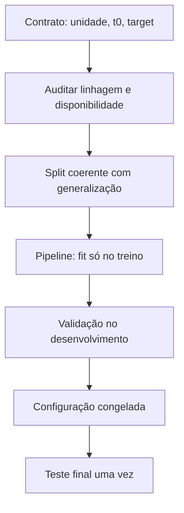

<!-- mirandastech-aula-v2 -->

# Aula 03 — Pré-processamento, pipelines e data leakage

[](https://colab.research.google.com/github/joaopaulomirandamatias/ai-lab/blob/main/03-machine-learning/notebooks/03-preprocessamento-pipelines-leakage-laboratorio.ipynb)

> Seu modelo atingiu 96% na validação. Depois do deploy, mal supera o acaso. O algoritmo pode estar correto: talvez a avaliação tenha deixado o futuro, o alvo ou estatísticas da validação entrarem no treinamento.

Na [Aula 02](02-framing-dataset-split-baseline.md), você definiu o contrato de predição, a unidade de análise, o instante de decisão e o *split*. Agora protegerá essa fronteira dentro do código. A ideia central é simples e exigente:

> Qualquer operação que aprende algo com dados deve executar `fit` somente na partição de treinamento disponível naquele momento.

Isso vale para imputação, escala, vocabulário de categorias, seleção de atributos, redução de dimensionalidade e o próprio modelo. Um `Pipeline` torna essa ordem explícita e repetível; ele reduz uma classe importante de vazamentos, mas não conserta dados cuja origem já viola o contrato.

## Objetivos

Ao final, você deverá ser capaz de:

- distinguir transformação fixa de transformação ajustável;
- explicar `fit`, `transform` e `fit_transform` sem recorrer apenas à API;
- imputar, escalar e codificar dados numéricos e categóricos;
- combinar transformações por coluna com `ColumnTransformer`;
- encapsular pré-processamento e estimador em um `Pipeline`;
- manter o pré-processamento dentro de cada *fold* de validação cruzada;
- reconhecer vazamentos estatístico, temporal, por alvo, por entidade e por duplicação;
- demonstrar experimentalmente como uma seleção de atributos global infla a métrica;
- auditar uma feature pela sua linhagem e disponibilidade no instante de predição;
- registrar testes automáticos que protegem a fronteira entre treino e avaliação.

## Pré-requisitos

- contrato de predição, *baseline* e papéis de treino, validação e teste;
- média, mediana, desvio-padrão e quantis;
- dados tabulares com `pandas`;
- noções de classificação e métricas; a interpretação detalhada das métricas virá nas Aulas 14 e 15.

## Vocabulário essencial

| Termo | Significado operacional |
|---|---|
| `fit` | aprende estado a partir dos dados, como média, mediana, categorias ou coeficientes |
| `transform` | aplica a um conjunto o estado já aprendido |
| `fit_transform` | aprende e aplica no mesmo conjunto; apropriado no treino, perigoso no teste |
| transformador | objeto que implementa transformação e conserva estado ajustado |
| estimador | objeto ajustável, como um classificador ou regressor |
| `Pipeline` | sequência que ajusta transformadores e estimador na ordem correta |
| `ColumnTransformer` | aplica pipelines diferentes a subconjuntos de colunas |
| data leakage | informação indisponível no uso real contamina o treinamento ou a avaliação |
| categoria desconhecida | valor categórico presente fora do treino e ausente no vocabulário aprendido |
| fronteira de aprendizado | limite que define quais observações cada chamada de `fit` pode conhecer |

## 1. Pré-processamento também é aprendizado

Considere uma transformação parametrizada (T_{\phi}). O treinamento correto estima seus parâmetros apenas no treino:

\[
\widehat\phi=\operatorname{fit}(X_{\text{treino}}),
\qquad
Z_{\text{treino}}=T_{\widehat\phi}(X_{\text{treino}}),
\qquad
Z_{\text{teste}}=T_{\widehat\phi}(X_{\text{teste}}).
\]

Aqui, (X) contém atributos, (Z) é a representação transformada e \(\widehat\phi\) é o estado aprendido. Num padronizador, \(\widehat\phi=(\mu_{treino},\sigma_{treino})\). Num imputador pela mediana, é a mediana de cada coluna. Num *one-hot encoder*, é o conjunto e a ordem das categorias observadas.

Uma transformação realmente fixa — converter quilômetros em metros multiplicando por 1.000, por exemplo — não aprende estado. Já “recortar nos percentis 1 e 99” aprende quantis e, portanto, deve ser ajustada apenas no treino.

### Exemplo numérico resolvido

Treino: \([1,2,3]\). Teste: \([100]\).

No treino:

\[
\mu_{treino}=2,
\qquad
\sigma_{treino}=\sqrt{\frac{(1-2)^2+(2-2)^2+(3-2)^2}{3}}\approx0{,}8165.
\]

Logo:

\[
z_{teste}=\frac{100-2}{0{,}8165}\approx120{,}02.
\]

O valor é extremo porque a distribuição mudou. Se ajustarmos o scaler nos quatro valores, a média passa a 26,5 e o desvio a aproximadamente 42,44; o teste vira cerca de 1,73 desvios. O próprio caso de teste ensinou ao pré-processamento como parecer menos surpreendente.

O problema não é a fórmula. É **quem participou da estimação**.

## 2. Imputação: ausência também tem significado

Valores ausentes podem surgir por falha de sensor, campo opcional, processo operacional ou decisão humana. Antes de preencher, pergunte:

1. por que o valor está ausente?
2. esse mecanismo muda entre treino e produção?
3. a ausência em si ajuda a prever o alvo?
4. qual estatística estará disponível no instante de predição?

Para uma coluna numérica assimétrica, a mediana costuma ser mais robusta que a média. Para uma categoria, moda ou uma categoria explícita `"ausente"` são opções. A escolha é parte do modelo e deve ser validada.

`SimpleImputer(add_indicator=True)` pode acrescentar um indicador de ausência. Isso preserva o sinal “estava faltando”, mas não elimina viés de seleção nem recria informação que nunca foi coletada.

Nunca calcule a mediana em treino mais teste. Em validação cruzada, cada *fold* precisa aprender sua própria mediana usando apenas a parte de treino daquele *fold*.

## 3. Escala: quando e por quê

O `StandardScaler` aplica:

\[
z_j=\frac{x_j-\mu_j}{\sigma_j},
\]

para a feature (j), com média \(\mu_j\) e desvio \(\sigma_j\) aprendidos no treino.

Escala é especialmente importante quando o algoritmo usa distâncias, produtos internos ou penalidades compartilhadas entre coeficientes, como KNN, SVM, regressão logística regularizada e redes neurais. Árvores de decisão normalmente são invariantes a transformações monotônicas de uma feature e não exigem padronização para criar seus cortes.

| Transformação | Quando considerar | Limite importante |
|---|---|---|
| `StandardScaler` | distribuição sem caudas muito extremas | média e desvio são sensíveis a outliers |
| `RobustScaler` | presença plausível de outliers | ainda aprende mediana e IQR no treino |
| `MinMaxScaler` | intervalo limitado ou exigência do modelo | novos valores podem sair de \([0,1]\) |
| transformação log | variável positiva e muito assimétrica | requer política para zero e negativos |
| nenhuma escala | árvores ou unidade original já adequada | confirme empiricamente no protocolo |

Escalar não torna uma relação linear nem corrige mudança de distribuição. Um z-score enorme no teste pode ser um diagnóstico útil, não um erro a esconder.

## 4. Codificação categórica sem inventar ordem

Categorias nominais como estado, canal ou tipo de dispositivo não possuem ordem natural. O *one-hot encoding* cria uma coluna binária por categoria aprendida. Para uma categoria (c_k):

\[
z_k=\mathbb{1}(x=c_k).
\]

Use `OneHotEncoder(handle_unknown="ignore")` quando novas categorias puderem aparecer. Uma categoria desconhecida será representada por zeros nas colunas conhecidas. Isso evita falha de execução, mas o modelo não aprendeu o comportamento específico daquele valor; monitore frequência e impacto de categorias novas.

Não use `OrdinalEncoder` apenas para economizar colunas: mapear `AP=0`, `PA=1`, `SP=2` impõe distâncias artificiais. Uma codificação ordinal é adequada quando a ordem é real, como `baixo < médio < alto`, e ainda exige decisão sobre espaçamentos.

Codificação por frequência, média do alvo ou *target encoding* aprende estatísticas. Quando usa (y), precisa de construção *out-of-fold* no treino e política para categorias raras. Calcular a média do alvo em todas as linhas antes do split é vazamento direto.

## 5. `ColumnTransformer`: uma tabela, tratamentos diferentes

Dados reais misturam números, categorias e, às vezes, texto ou datas. Um `ColumnTransformer` permite declarar rotas:

```python
numeric = Pipeline([
    ("imputer", SimpleImputer(strategy="median", add_indicator=True)),
    ("scaler", StandardScaler()),
])

categorical = Pipeline([
    ("imputer", SimpleImputer(strategy="most_frequent")),
    ("onehot", OneHotEncoder(handle_unknown="ignore")),
])

preprocess = ColumnTransformer([
    ("num", numeric, numeric_features),
    ("cat", categorical, categorical_features),
], remainder="drop")
```

`remainder="drop"` torna explícito que colunas não listadas serão descartadas. Essa escolha é segura para uma lista autorizada de features. `remainder="passthrough"` pode deixar um identificador, timestamp futuro ou coluna-alvo atravessar silenciosamente; use-o apenas após auditoria de schema.

Após o ajuste, inspecione `get_feature_names_out()` para verificar a representação produzida. Shape e nomes são parte do contrato entre dados e modelo.

## 6. `Pipeline`: a fronteira executável

O pipeline completo conecta pré-processamento e modelo:

```python
model = Pipeline([
    ("preprocess", preprocess),
    ("classifier", LogisticRegression(max_iter=2_000)),
])

model.fit(X_train, y_train)
pred = model.predict_proba(X_test)[:, 1]
```

Durante `fit`, o pipeline ajusta o pré-processamento em `X_train`, transforma `X_train` e ajusta o classificador. Durante `predict_proba`, apenas `transform` é chamado antes da previsão. O teste não altera imputador, scaler, encoder nem classificador.

Em validação cruzada, o scikit-learn clona o pipeline para cada divisão. Cada clone aprende estado apenas no subconjunto de treino daquele *fold*.



Se `SelectKBest`, `PCA` ou imputação forem executados antes de `cross_validate`, o pipeline já recebe dados contaminados. Estar “antes do modelo” não significa estar “fora do treinamento”.

## 7. Taxonomia prática de leakage

| Tipo | Exemplo | Controle principal |
|---|---|---|
| pré-processamento | scaler ajustado em treino + teste | ajustar transformadores dentro do pipeline |
| alvo | feature contém desfecho, proxy ou estatística de (y) global | linhagem, lista autorizada e codificação *out-of-fold* |
| temporal | usar saldo após a decisão para prever inadimplência | snapshot no instante (t_0) e split temporal |
| entidade | registros da mesma pessoa nos dois lados | split por grupo e agregação na unidade correta |
| duplicação | cópias ou quase cópias atravessam conjuntos | deduplicar antes do split ou agrupar equivalentes |
| seleção | escolher features usando todos os rótulos | seleção dentro do pipeline e dos folds |
| imputação | mediana ou moda calculada globalmente | imputador ajustado apenas no treino |
| avaliação adaptativa | consultar o teste a cada tentativa | teste reservado e avaliação final única |

### Vazamento de disponibilidade

Uma feature pode existir no banco hoje e ainda ser inválida. A pergunta é: **ela existia e estava consolidada no instante (t_0) em que a previsão seria emitida?**

Exemplo: prever cancelamento de pedido no momento da compra usando `motivo_cancelamento`. A coluna não é proibida por ser muito correlacionada; é proibida porque nasce depois do evento.

### Vazamento por agregação

“Número total de compras do cliente” é ambíguo. Se o total inclui compras posteriores à linha prevista, contém futuro. A feature correta seria uma agregação *as-of*: apenas eventos com timestamp anterior a (t_0).

### Vazamento por entidade

Um pipeline não sabe que dez linhas pertencem ao mesmo paciente. Se o objetivo é generalizar para pacientes novos, o splitter deve manter cada paciente em um único lado. O pipeline protege o estado aprendido **depois que o split correto foi definido**.

## 8. Um experimento que denuncia o problema

Considere 160 observações, 5.000 features aleatórias e rótulos aleatórios. Não existe sinal real. Ainda assim, entre milhares de features algumas terão correlação espúria com (y).

Procedimento incorreto:

1. aplicar `SelectKBest` usando todas as observações e rótulos;
2. conservar as features mais correlacionadas;
3. executar validação cruzada sobre a matriz já selecionada.

Cada fold de validação ajudou a escolher as colunas antes de ser avaliado. A métrica pode ficar muito acima de 0,5.

Procedimento correto:

1. colocar `SelectKBest` dentro do pipeline;
2. em cada fold, selecionar usando apenas o treino;
3. transformar e avaliar a validação com aquela seleção local.

Sem sinal real, a média deve oscilar em torno do acaso. O [laboratório](../notebooks/03-preprocessamento-pipelines-leakage-laboratorio.ipynb) implementa essa contraprova com os mesmos folds para as duas versões.

## 9. O que um pipeline não resolve

Pipeline é um mecanismo de composição, não um auditor semântico. Ele não detecta automaticamente:

- coluna que é cópia ou proxy do alvo;
- feature produzida depois de (t_0);
- entidade repetida entre treino e teste;
- escolha inadequada da unidade de análise;
- benchmark contaminado;
- teste reutilizado durante desenvolvimento;
- transformação externa feita antes de os dados entrarem no pipeline.



O controle completo combina contrato, dados, split, pipeline, validação e governança do teste.

## 10. Padrão de implementação auditável

```python
from sklearn.compose import ColumnTransformer
from sklearn.impute import SimpleImputer
from sklearn.linear_model import LogisticRegression
from sklearn.model_selection import StratifiedKFold, cross_validate
from sklearn.pipeline import Pipeline
from sklearn.preprocessing import OneHotEncoder, StandardScaler

numeric_features = ["idade", "renda"]
categorical_features = ["estado", "canal"]

num_pipe = Pipeline([
    ("impute", SimpleImputer(strategy="median", add_indicator=True)),
    ("scale", StandardScaler()),
])
cat_pipe = Pipeline([
    ("impute", SimpleImputer(strategy="most_frequent")),
    ("onehot", OneHotEncoder(handle_unknown="ignore")),
])

preprocess = ColumnTransformer([
    ("num", num_pipe, numeric_features),
    ("cat", cat_pipe, categorical_features),
])

pipeline = Pipeline([
    ("preprocess", preprocess),
    ("model", LogisticRegression(max_iter=2_000)),
])

cv = StratifiedKFold(n_splits=5, shuffle=True, random_state=20260908)
scores = cross_validate(
    pipeline, X_development, y_development,
    cv=cv,
    scoring=["roc_auc", "average_precision"],
    return_train_score=False,
)
```

Por enquanto, use validação cruzada para observar a fronteira de `fit`. A escolha detalhada de folds, incerteza e validação aninhada será aprofundada nas Aulas 17 e 18.

## 11. Testes automáticos de integridade

Além de testar código, teste o protocolo:

```python
assert set(train_ids).isdisjoint(test_ids)
assert set(train_groups).isdisjoint(test_groups)
assert target_column not in feature_columns
assert forbidden_future_columns.isdisjoint(feature_columns)
assert X_train.columns.tolist() == X_test.columns.tolist()
```

Depois do ajuste:

```python
fitted_scaler = pipeline.named_steps["preprocess"] \
    .named_transformers_["num"].named_steps["scale"]
assert len(fitted_scaler.mean_) >= len(numeric_features)
```

Em dados temporais, teste também `train_time.max() < test_time.min()` quando essa for a política. Em dados agrupados, compare identificadores de entidade. Esses asserts transformam premissas em evidência executável.

## 12. Checklist antes de confiar na métrica

### Contrato e dados

- [ ] unidade de análise, (t_0), horizonte e target estão definidos;
- [ ] cada feature possui origem, timestamp e regra de disponibilidade;
- [ ] identificadores e colunas futuras estão fora da lista autorizada;
- [ ] duplicatas e grupos foram tratados antes do split;
- [ ] o teste permaneceu isolado durante desenvolvimento.

### Pré-processamento

- [ ] imputadores, scalers, encoders e seletores estão no pipeline;
- [ ] nenhuma transformação ajustável foi executada antes do split;
- [ ] categorias desconhecidas possuem política explícita;
- [ ] treino e inferência usam o mesmo artefato de pipeline;
- [ ] nomes e shape das features transformadas foram inspecionados.

### Validação e reprodução

- [ ] o splitter representa o cenário de generalização;
- [ ] cada fold ajusta todo estado apenas no treino do fold;
- [ ] seed, versões, hiperparâmetros e schema foram registrados;
- [ ] existem asserts para separação e ausência de colunas proibidas;
- [ ] baseline e distribuição das métricas foram reportados;
- [ ] limitações e riscos residuais de leakage estão documentados.

## 13. Armadilhas comuns

1. **Normalizar antes de dividir.** O scaler já viu a avaliação.
2. **Imputar no DataFrame inteiro.** A estatística global contamina o teste.
3. **Selecionar features antes da CV.** Os rótulos dos folds influenciam a seleção.
4. **Usar `get_dummies` global sem pensar.** O vocabulário pode revelar categorias da avaliação; prefira encoder ajustado no treino.
5. **Confundir `handle_unknown="ignore"` com aprendizado de categoria nova.** O sistema apenas evita erro.
6. **Passar todas as colunas por `remainder="passthrough"`.** Um ID ou proxy pode escapar da auditoria.
7. **Acreditar que pipeline resolve tempo e grupos.** O splitter continua sendo responsabilidade do experimento.
8. **Gerar agregações sem corte temporal.** Totais futuros vazam para o passado.
9. **Fazer SMOTE antes da CV.** Reamostragem supervisionada também deve ocorrer dentro do fluxo de treino; o tema retorna na Aula 16.
10. **Serializar só o modelo.** Em produção, salve o pipeline completo para repetir exatamente a transformação.
11. **Consultar o teste para ajustar categorias ou limites.** Isso transforma teste em validação informal.
12. **Celebrar métrica perfeita sem auditoria.** Resultados bons demais pedem investigação de linhagem, duplicação e proxies.

## 14. Laboratório reproduzível

O notebook desta aula usa Python 3.11+, NumPy, pandas, Matplotlib e scikit-learn. Ele:

- gera dados tabulares mistos e documenta o mecanismo de geração;
- separa desenvolvimento e teste antes de qualquer `fit`;
- compara `DummyClassifier` e regressão logística com pipeline;
- mostra imputação, escala, *one-hot* e categoria desconhecida;
- valida schema, classes, IDs e estado aprendido no treino;
- avalia o desenvolvimento com folds estratificados fixos;
- abre o teste uma única vez após congelar a configuração;
- constrói uma contraprova com 5.000 features e rótulos aleatórios;
- compara seleção global contaminada com seleção dentro do pipeline;
- inclui gráfico, tabela, versões, seed e asserts verificáveis.

Os dados são sintéticos: demonstram o mecanismo, não o desempenho de um produto real.

## 15. Exercícios

### 1. Classifique as operações

Quais operações aprendem estado: converter reais para centavos; preencher pela mediana; recortar no percentil 99; aplicar uma lista fixa de categorias?

### 2. Cálculo manual

O treino é \([2,4,6,8]\) e o teste contém 10. Calcule o z-score do teste usando média e desvio-padrão populacional do treino.

### 3. Categoria nova

O encoder foi ajustado em `AP`, `PA` e `SP`. O teste contém `RR`. O que `handle_unknown="ignore"` faz e o que ele não faz?

### 4. Leakage temporal

Uma feature `total_compras_cliente` foi calculada no fim do ano para prever, em março, se o cliente compraria novamente até junho. Qual é o problema e como reconstruí-la?

### 5. Seleção de atributos

Por que selecionar as 20 features com maior associação a (y) em todo o dataset antes da CV contamina todos os folds?

### 6. Grupos

Cada paciente possui cinco consultas. O pipeline está perfeito, mas consultas da mesma pessoa aparecem em treino e validação. A avaliação é honesta para pacientes novos?

### 7. Desafio prático

Crie uma pipeline para um dataset próprio. Registre lista autorizada de features, colunas proibidas, splitter, política de ausências e categorias desconhecidas. Inclua pelo menos quatro asserts de integridade.

## 16. Respostas comentadas

### 1.

Conversão por fator fixo e aplicação de uma lista fixa não aprendem com as observações. Mediana e percentil 99 dependem da amostra e devem ser ajustados no treino. Se a “lista fixa” foi descoberta olhando todo o dataset, ela deixou de ser verdadeiramente externa.

### 2.

\(\mu=5\) e \(\sigma=\sqrt5\approx2{,}236\). Portanto,

\[
z=\frac{10-5}{\sqrt5}\approx2{,}236.
\]

### 3.

Ele não cria uma coluna para `RR`; codifica o valor com zeros nas colunas conhecidas e mantém a execução. Não aprende efeito próprio para `RR`, não garante boa previsão e não substitui monitoramento de categorias novas.

### 4.

O total anual inclui eventos posteriores a março. Reconstrua uma feature *as-of* usando somente compras com timestamp anterior ao instante de predição de cada linha.

### 5.

Os rótulos das observações que depois formarão a validação participaram da escolha das colunas. Cada fold avalia uma representação parcialmente escolhida por ele mesmo. Coloque o seletor dentro do pipeline para refazer a seleção somente no treino de cada fold.

### 6.

Não. O pipeline protege os parâmetros aprendidos, mas não muda a composição dos folds. Use um splitter por paciente e mantenha todas as consultas da entidade juntas.

### 7.

Uma boa entrega mostra código executável e justificativa. Verifique disjunção de IDs/grupos, ausência do alvo e colunas futuras, schema idêntico, intervalos válidos e ajuste do pré-processamento somente no treino.

## 17. Resumo

- Pré-processamento ajustável faz parte do modelo.
- `fit` aprende estado; `transform` reutiliza esse estado.
- Imputação, escala, encoding, seleção e PCA pertencem ao fluxo de treino.
- `ColumnTransformer` organiza tratamentos por tipo de coluna.
- `Pipeline` mantém treino, validação e inferência sob a mesma sequência.
- Em validação cruzada, o pipeline deve ser clonado e ajustado dentro de cada fold.
- Leakage pode vir do pré-processamento, alvo, futuro, entidades, duplicatas ou avaliação adaptativa.
- Um pipeline não corrige contrato, linhagem ou splitter inadequados.
- Features devem ser auditadas pela disponibilidade no instante (t_0), não apenas pelo nome.
- Asserts tornam premissas metodológicas verificáveis.
- Uma métrica alta só é evidência quando a fronteira de aprendizado foi preservada.

## 18. Próxima aula

Na [Aula 04 — Regressão linear e mínimos quadrados](04-regressao-linear-minimos-quadrados.md), você construirá o primeiro modelo supervisionado clássico e conectará álgebra linear, função de perda e análise de resíduos. O pipeline desta aula será reutilizado para garantir que o modelo veja, no treino e na inferência, a mesma representação sem contaminação.

## Referências técnicas

- SCIKIT-LEARN. [Common pitfalls and recommended practices](https://scikit-learn.org/stable/common_pitfalls.html). Documentação oficial sobre pré-processamento inconsistente e data leakage.
- SCIKIT-LEARN. [Pipelines and composite estimators](https://scikit-learn.org/stable/modules/compose.html). Documentação oficial de `Pipeline` e `ColumnTransformer`.
- SCIKIT-LEARN. [`Pipeline`](https://scikit-learn.org/stable/modules/generated/sklearn.pipeline.Pipeline.html). Contrato da API e comportamento de ajuste sequencial.
- SCIKIT-LEARN. [`ColumnTransformer`](https://scikit-learn.org/stable/modules/generated/sklearn.compose.ColumnTransformer.html). Aplicação de transformadores por subconjunto de colunas.
- SCIKIT-LEARN. [Preprocessing data](https://scikit-learn.org/stable/modules/preprocessing.html). Escala, codificação e transformações.
- KAUFMAN, Shachar; ROSSET, Saharon; PERLICH, Claudia; STITELMAN, Ori. [Leakage in Data Mining: Formulation, Detection, and Avoidance](https://doi.org/10.1145/2382577.2382579). *ACM Transactions on Knowledge Discovery from Data*, 2012.
- JAMES, Gareth et al. [*An Introduction to Statistical Learning*](https://www.statlearning.com/). Livro aberto sobre aprendizagem estatística, avaliação e pré-processamento.

