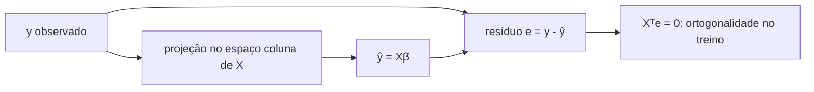
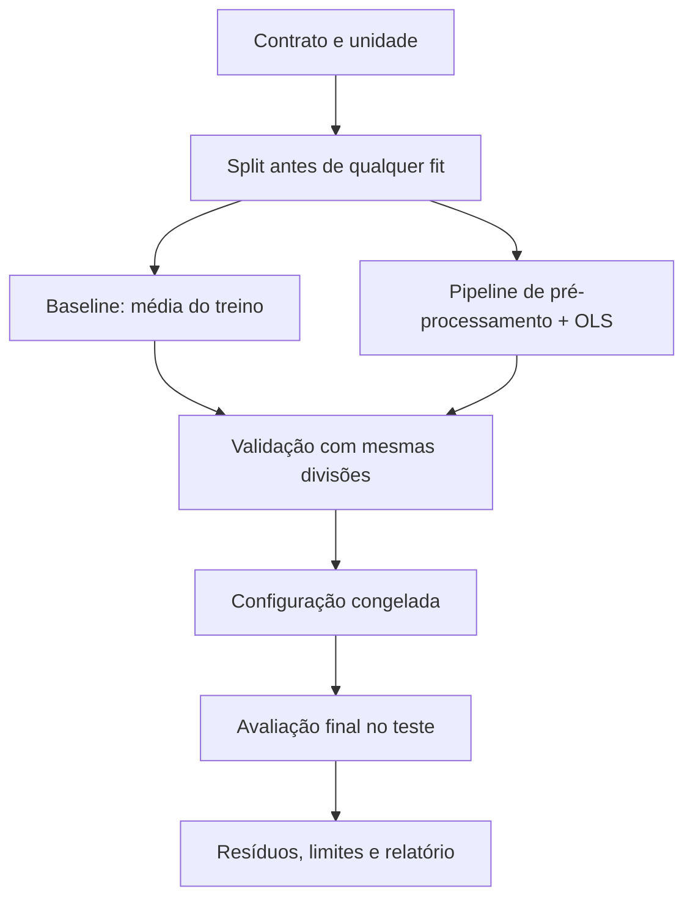

<!-- mirandastech-aula-v2 -->

# Aula 04 — Regressão linear e mínimos quadrados

[](https://colab.research.google.com/github/joaopaulomirandamatias/ai-lab/blob/main/03-machine-learning/notebooks/04-regressao-linear-minimos-quadrados-laboratorio.ipynb)

> Um prédio precisa prever consumo de energia para planejar a operação do dia seguinte. Um modelo linear consegue produzir uma previsão útil, explicar como cada variável entra no cálculo e revelar, pelos próprios erros, quando sua hipótese é insuficiente.

A regressão linear é um dos melhores pontos de entrada em Machine Learning porque reúne álgebra linear, otimização, estatística e avaliação fora da amostra. Ela também serve como **baseline forte e auditável**: antes de justificar um modelo complexo, precisamos saber o que uma combinação linear bem construída já resolve.

Na [Aula 03](03-preprocessamento-pipelines-leakage.md), você aprendeu a preservar a fronteira de `fit`. Aqui, usará esse protocolo para ajustar o primeiro modelo supervisionado clássico, sem confundir bom ajuste, boa generalização e causalidade.

## Objetivos

Ao final, você deverá ser capaz de:

- escrever regressão linear para uma observação e em forma matricial;
- rastrear os shapes de $X$, $y$, $\beta$, $\widehat y$ e resíduos;
- explicar o significado do intercepto e dos coeficientes;
- derivar o gradiente da soma dos quadrados dos resíduos;
- obter e interpretar as equações normais;
- compreender mínimos quadrados como projeção no espaço das colunas;
- resolver OLS com `numpy.linalg.lstsq` sem calcular inversa explicitamente;
- reconhecer posto deficiente, multicolinearidade e mau condicionamento;
- comparar solução numérica, gradiente descendente e `LinearRegression`;
- avaliar fora da amostra contra um baseline;
- diagnosticar não linearidade, heterocedasticidade, outliers e extrapolação;
- separar associação preditiva de afirmação causal.

## Pré-requisitos

- vetores, matrizes, produto interno, transposição e norma Euclidiana;
- média, variância e covariância;
- treino, validação, teste e baseline;
- pré-processamento dentro de pipeline, sem data leakage.

## Vocabulário essencial

| Termo | Significado |
|---|---|
| variável resposta | quantidade contínua que queremos prever, $y$ |
| matriz de projeto | matriz $X$ com observações nas linhas e features nas colunas |
| coeficiente | peso $\beta_j$ associado à feature $x_j$ |
| intercepto | previsão quando todas as features valem zero |
| valor ajustado | previsão $\widehat y_i$ para a observação $i$ |
| resíduo | diferença observada menos ajustada, $e_i=y_i-\widehat y_i$ |
| SSE/RSS | soma dos quadrados dos resíduos |
| OLS | mínimos quadrados ordinários, *ordinary least squares* |
| posto | número de direções linearmente independentes de uma matriz |
| condicionamento | sensibilidade da solução a pequenas perturbações |
| extrapolação | previsão fora da região representada no treinamento |

## 1. O problema de previsão

Suponha que, para cada dia, temos temperatura, ocupação do prédio e indicador de dia útil. Queremos prever consumo em kWh. Para uma observação com $p$ features:

\[
\widehat y=\beta_0+\beta_1x_1+\beta_2x_2+\cdots+\beta_px_p.
\]

- $\widehat y$: previsão;
- $\beta_0$: intercepto;
- $\beta_j$: coeficiente da feature $j$;
- $x_j$: valor observado da feature $j$.

O modelo é **linear nos parâmetros**. As features podem incluir transformações definidas antes do ajuste, como $x^2$, $\log x$ ou interações. Por exemplo,

\[
\widehat y=\beta_0+\beta_1x+\beta_2x^2
\]

continua sendo uma regressão linear em $\beta_0,\beta_1,\beta_2$, embora a curva prevista não seja reta em $x$. Feature engineering será aprofundada na Aula 19; aqui trabalharemos com a representação já definida.

## 2. Forma matricial e shapes

Com $n$ observações e $p$ features, inclua uma coluna de uns para o intercepto:

\[
X=
\begin{bmatrix}
1 & x_{11} & \cdots & x_{1p}\\
1 & x_{21} & \cdots & x_{2p}\\
\vdots & \vdots & \ddots & \vdots\\
1 & x_{n1} & \cdots & x_{np}
\end{bmatrix},
\qquad
\beta=
\begin{bmatrix}
\beta_0\\
\beta_1\\
\vdots\\
\beta_p
\end{bmatrix}.
\]

Então:

\[
\widehat y=X\beta.
\]

| Objeto | Shape | Papel |
|---|---:|---|
| $X$ | $n\times(p+1)$ | matriz de projeto com intercepto |
| $\beta$ | $(p+1)\times1$ | parâmetros |
| $y$ | $n\times1$ | respostas observadas |
| $\widehat y$ | $n\times1$ | previsões |
| $e=y-\widehat y$ | $n\times1$ | resíduos |

Conferir shapes evita muitos erros de implementação. Em `scikit-learn`, `X` deve ser bidimensional, mesmo com uma feature; use `x.reshape(-1, 1)`. O vetor `y` costuma ter shape `(n,)`.

## 3. O que significa cada coeficiente

Mantendo as outras features do modelo constantes, $\beta_j$ é a variação prevista em $y$ para uma unidade adicional de $x_j$.

Se

\[
\widehat{consumo}=120+3{,}5\cdot temperatura+18\cdot ocupacao,
\]

então, sob o modelo:

- 1 °C adicional está associado a 3,5 kWh adicionais, mantendo ocupação constante;
- uma unidade adicional na escala de ocupação está associada a 18 kWh;
- 120 kWh é a previsão quando temperatura e ocupação valem zero.

O intercepto pode não possuir interpretação física se “todas as features iguais a zero” estiver fora do domínio observado. Centralizar features pode torná-lo mais interpretável.

Coeficientes dependem de unidade, codificação e conjunto de variáveis. Trocar reais por milhares de reais altera a magnitude numérica. Incluir uma variável correlacionada pode mudar coeficientes sem alterar muito a previsão.

## 4. A função de perda

Para cada observação:

\[
e_i=y_i-\widehat y_i.
\]

OLS escolhe $\beta$ que minimiza a soma dos quadrados:

\[
\widehat\beta
=\arg\min_{\beta}\operatorname{SSE}(\beta)
=\arg\min_{\beta}\sum_{i=1}^{n}(y_i-x_i^T\beta)^2
=\arg\min_{\beta}\lVert y-X\beta\rVert_2^2.
\]

Elevar ao quadrado:

- impede cancelamento entre erros positivos e negativos;
- penaliza erros grandes de forma quadrática;
- produz uma função convexa e diferenciável;
- sob ruído Gaussiano homoscedástico, coincide com máxima verossimilhança.

Essa escolha também traz sensibilidade a outliers. Um resíduo de magnitude 10 contribui 100 para a SSE; um de magnitude 2 contribui apenas 4.

MSE divide a SSE por $n$; RMSE tira a raiz. Esses fatores não mudam o minimizador, mas mudam a unidade e a escala reportada.

## 5. Exemplo resolvido passo a passo

Considere os pontos \((0,1)\), \((1,3)\) e \((2,5)\).

### Passo 1 — matriz e vetor

\[
X=
\begin{bmatrix}
1&0\\
1&1\\
1&2
\end{bmatrix},
\qquad
y=
\begin{bmatrix}
1\\3\\5
\end{bmatrix}.
\]

### Passo 2 — observe o padrão

A cada unidade adicional de $x$, $y$ cresce 2. Quando $x=0$, $y=1$. Logo, candidato:

\[
\widehat y=1+2x,
\qquad
\widehat\beta=
\begin{bmatrix}1\\2\end{bmatrix}.
\]

### Passo 3 — previsões e resíduos

\[
\widehat y=X\widehat\beta=
\begin{bmatrix}1\\3\\5\end{bmatrix},
\qquad
e=y-\widehat y=0.
\]

A SSE é zero.

Agora troque o último alvo por 8. A solução OLS passa a

\[
\widehat y=0{,}5+3{,}5x.
\]

As previsões são \([0{,}5,4,7{,}5]\), os resíduos \([0{,}5,-1,0{,}5]\) e

\[
\operatorname{SSE}=0{,}5^2+(-1)^2+0{,}5^2=1{,}5.
\]

Um único valor alterou a inclinação de 2 para 3,5. Esse exemplo pequeno torna visível a influência quadrática de observações extremas.

## 6. Derivando as equações normais

Expanda a loss:

\[
J(\beta)=(y-X\beta)^T(y-X\beta)
=y^Ty-2\beta^TX^Ty+\beta^TX^TX\beta.
\]

O gradiente é:

\[
\nabla_{\beta}J(\beta)=2X^T(X\beta-y).
\]

No mínimo, o gradiente vale zero:

\[
X^T(X\widehat\beta-y)=0
\quad\Longrightarrow\quad
X^TX\widehat\beta=X^Ty.
\]

Essas são as **equações normais**. Se $X$ possui colunas linearmente independentes, $X^TX$ é inversível e podemos escrever:

\[
\widehat\beta=(X^TX)^{-1}X^Ty.
\]

Essa expressão explica a solução, mas **não recomenda calcular a inversa explicitamente**. Formar $X^TX$ piora o condicionamento numérico; QR, SVD ou rotinas de mínimos quadrados resolvem o problema com mais estabilidade.

Em NumPy:

```python
beta, residuals, rank, singular_values = np.linalg.lstsq(X, y, rcond=None)
```

Além dos coeficientes, a rotina informa posto e valores singulares, úteis para diagnóstico.

## 7. A geometria: projeção ortogonal

O vetor de previsões $\widehat y=X\widehat\beta$ pertence ao espaço gerado pelas colunas de $X$. OLS procura nesse espaço o ponto mais próximo de $y$.

A condição das equações normais equivale a:

\[
X^T(y-X\widehat\beta)=X^Te=0.
\]

Logo, o vetor de resíduos é ortogonal a cada coluna de $X$. Com intercepto, uma das colunas é o vetor de uns, então:

\[
\sum_{i=1}^{n}e_i=0
\]

até erro numérico. A média dos resíduos de treino é zero quando o modelo OLS contém intercepto.



A ortogonalidade é propriedade do ajuste no treino. Não espere soma zero ou ortogonalidade no teste.

## 8. Quando a solução não é única

Se uma coluna é combinação linear exata de outras, $X$ tem posto deficiente. Exemplo: incluir temperatura em °C e a mesma temperatura em °F junto com intercepto cria dependência exata.

Se duas features são idênticas, há vários vetores $\beta$ com as mesmas previsões. A pseudoinversa/SVD pode retornar a solução de menor norma, mas o coeficiente individual deixa de ser identificável.

Mesmo sem dependência exata, colunas muito correlacionadas geram **multicolinearidade**. Consequências:

- pequenos ruídos alteram muito os coeficientes;
- sinais e magnitudes tornam-se instáveis;
- previsões dentro da região observada podem continuar razoáveis;
- extrapolação e interpretação tornam-se frágeis.

O número de condição baseado nos valores singulares mede sensibilidade:

\[
\kappa(X)=\frac{\sigma_{\max}}{\sigma_{\min}}.
\]

Quanto maior $\kappa$, maior a amplificação potencial de perturbações. Não existe um limiar universal: unidade, precisão numérica e objetivo importam. Na [Aula 05](05-regularizacao-ridge-lasso-elastic-net.md), veremos como penalização pode estabilizar esse cenário.

## 9. Gradiente descendente

Também podemos minimizar o MSE iterativamente:

\[
J(\beta)=\frac{1}{n}\lVert X\beta-y\rVert_2^2,
\qquad
\nabla J(\beta)=\frac{2}{n}X^T(X\beta-y),
\]

\[
\beta^{(t+1)}=\beta^{(t)}-\eta\nabla J(\beta^{(t)}),
\]

onde $\eta$ é a taxa de aprendizado.

Para OLS pequeno, `lstsq` é preferível. O gradiente descendente é didático porque antecipa a otimização de modelos maiores:

- taxa muito pequena converge devagar;
- taxa muito grande oscila ou diverge;
- features em escalas muito diferentes tornam o caminho difícil;
- critérios de parada devem observar gradiente, melhoria ou número máximo de iterações.

Padronizar as features no treino melhora o condicionamento do problema iterativo. O intercepto pode ser tratado por uma coluna de uns ou separadamente.

## 10. Avaliação honesta e baseline

Um modelo OLS minimiza erro **no treino**. Isso não garante menor erro em dados novos. O fluxo correto reutiliza a disciplina das aulas anteriores:



Para regressão, um baseline simples prevê a média do target de treino para todos os casos. O modelo precisa demonstrar ganho fora da amostra em uma métrica coerente com o custo do erro.

Use pelo menos:

- MAE para magnitude absoluta típica;
- RMSE quando erros grandes merecem peso maior;
- $R^2$ como ganho relativo à previsão pela média no mesmo conjunto.

As definições e escolhas de métricas serão aprofundadas na Aula 13. Nesta aula, o essencial é comparar no **mesmo split**, reportar unidade e nunca escolher configuração pelo teste.

## 11. Resíduos como instrumento de diagnóstico

Um escalar não conta toda a história. Plote resíduos contra previsões, features importantes e tempo.

| Padrão | Possível explicação | Próxima verificação |
|---|---|---|
| curva em U | relação não linear | transformação ou modelo não linear |
| funil | variância muda com o nível previsto | escala do target, modelo de variância |
| sequência temporal | autocorrelação ou drift | split temporal e resíduos por tempo |
| poucos resíduos enormes | outliers, erro de dados ou cauda pesada | proveniência e método robusto |
| grupos deslocados | variável omitida ou efeito por segmento | análise de erro estratificada |
| centro fora de zero no teste | viés sob nova distribuição | calibração, drift ou intercepto |

Resíduo não é o mesmo que erro irredutível. Ele mistura ruído, inadequação do modelo, erro de medição e informação omitida.

### Heterocedasticidade

Quando a dispersão de $e_i$ muda com $x$ ou $\widehat y$, temos heterocedasticidade. OLS ainda pode produzir previsões úteis, mas inferência clássica sobre erros-padrão exige cuidados. Para previsão, avalie erros por faixa e considere transformação do alvo ou modelos adequados.

### Outliers e alavancagem

Um ponto com target extremo gera resíduo grande. Um ponto com features distantes do centro possui alta alavancagem e pode puxar a reta, mesmo com resíduo final moderado. Remover automaticamente é inadequado: investigue origem, validade e população-alvo.

## 12. Interpolação e extrapolação

Se o treino contém temperaturas entre 15 °C e 32 °C, prever a 25 °C é interpolar; prever a 50 °C é extrapolar. A reta continua numericamente, mas os dados não validaram que a relação permanece linear naquela região.

Registre os intervalos observados no treino e sinalize previsões fora de suporte. Um $R^2$ alto no teste histórico não autoriza extrapolação arbitrária.

Em sistemas de IA, extrapolação pode aparecer como:

- carga muito acima da operação usual;
- novo perfil de cliente;
- sensor em faixa inédita;
- política ou preço fora do período de treinamento.

## 13. Predição não é causalidade

Um coeficiente descreve associação condicional ao conjunto de features e ao modelo. Não significa que intervir em $x_j$ causará mudança de $\beta_j$ em $y$.

Confundimento, causalidade reversa, seleção e variáveis omitidas podem produzir coeficientes preditivos sem interpretação causal. Dizer “ocupação está associada a maior consumo, mantendo as demais features do modelo constantes” é diferente de “aumentar ocupação causará exatamente $\beta$ kWh”.

Para afirmação causal, são necessários desenho e hipóteses adicionais. O foco aqui é previsão fora da amostra.

## 14. Pipeline reproduzível

Para features numéricas em escalas diferentes:

```python
from sklearn.impute import SimpleImputer
from sklearn.linear_model import LinearRegression
from sklearn.pipeline import Pipeline
from sklearn.preprocessing import StandardScaler

model = Pipeline([
    ("imputer", SimpleImputer(strategy="median")),
    ("scaler", StandardScaler()),
    ("regressor", LinearRegression()),
])

model.fit(X_train, y_train)
prediction = model.predict(X_test)
```

OLS não precisa de escala para encontrar previsões equivalentes em aritmética exata quando as colunas apenas mudam de unidade. Ainda assim, escala pode melhorar condicionamento, otimização iterativa e comparação dos coeficientes padronizados. Ela também será essencial ao aplicar penalização na próxima aula.

Se houver categorias, reutilize `ColumnTransformer` da Aula 03. Salve o pipeline completo, não apenas os coeficientes.

## 15. Conexões com IA e sistemas reais

A regressão linear aparece como:

- baseline para consumo, demanda, custo, latência e duração;
- camada final de modelos que aprendem representações;
- aproximação local para interpretar comportamento de modelos complexos;
- modelo auxiliar em controle e detecção de tendência;
- teste de sanidade para pipelines tabulares;
- componente de modelos probabilísticos Gaussianos.

Uma implementação simples facilita auditoria: features, unidades, coeficientes, intervalo de treino, versão e resíduos podem ser registrados. Simplicidade não elimina riscos, mas torna muitos deles observáveis.

## 16. Armadilhas comuns

1. **Calcular \((X^TX)^{-1}\) diretamente.** Use `lstsq`, QR ou SVD.
2. **Esquecer o intercepto.** Isso força a reta pela origem e muda os resíduos.
3. **Passar vetor 1D como $X$.** Mantenha observações nas linhas e features nas colunas.
4. **Interpretar coeficiente sem unidade.** Diga “por unidade de quê”.
5. **Comparar coeficientes em escalas diferentes.** Magnitude bruta depende da unidade.
6. **Confundir ajuste no treino com generalização.** Avalie fora da amostra.
7. **Reportar apenas $R^2$.** Inclua magnitude do erro na unidade do target.
8. **Ignorar baseline.** Um modelo complexo pode perder para a média de treino.
9. **Remover outlier porque piora a métrica.** Investigue com regra definida, não por conveniência.
10. **Concluir causalidade pelo sinal do coeficiente.** O modelo é associativo sem desenho causal.
11. **Extrapolar sem alerta.** Registre suporte observado e mudança de distribuição.
12. **Omitir multicolinearidade.** Previsões podem parecer estáveis enquanto coeficientes não são.
13. **Olhar resíduos do teste para redesenhar repetidamente o modelo.** Isso desgasta o teste.
14. **Pré-processar antes do split.** Todo estado ajustável continua dentro do pipeline.

## 17. Checklist prático

### Formulação

- [ ] target contínuo, unidade, população e instante de predição estão definidos;
- [ ] baseline e custo dos erros foram registrados;
- [ ] features são disponíveis em $t_0$ e não contêm leakage;
- [ ] split representa o cenário de uso.

### Matemática e implementação

- [ ] shapes de $X$, $y$, $\beta$ e $\widehat y$ estão corretos;
- [ ] intercepto foi incluído ou deliberadamente removido;
- [ ] solução numérica evita inversa explícita;
- [ ] posto, valores singulares ou condicionamento foram inspecionados;
- [ ] pré-processamento e modelo formam um único pipeline;
- [ ] baseline e modelo usam as mesmas partições.

### Diagnóstico e comunicação

- [ ] MAE/RMSE têm unidade e interpretação;
- [ ] resíduos foram avaliados por previsão, feature, grupo e tempo quando aplicável;
- [ ] outliers e pontos de alavancagem foram investigados, não apagados silenciosamente;
- [ ] intervalo das features no treino foi registrado para detectar extrapolação;
- [ ] coeficientes foram descritos como associações, não causas;
- [ ] limitações e hipóteses foram documentadas.

## 18. Laboratório reproduzível

O [notebook da aula](../notebooks/04-regressao-linear-minimos-quadrados-laboratorio.ipynb) usa dados sintéticos de consumo de energia e seed fixa. Ele:

- registra o protocolo antes da geração;
- cria desenvolvimento e teste antes de qualquer `fit`;
- implementa baseline pela média do treino;
- resolve OLS com `np.linalg.lstsq`;
- confirma ortogonalidade dos resíduos e posto da matriz;
- reproduz a solução com `LinearRegression`;
- implementa gradiente descendente em features padronizadas;
- compara coeficientes e previsões entre as três abordagens;
- mede MAE, RMSE e $R^2$ no teste reservado;
- mostra resíduos, heterocedasticidade, outlier e extrapolação;
- constrói um caso multicolinear e inspeciona número de condição;
- executa asserts sobre shapes, split, convergência e equivalência numérica.

Os dados sintéticos demonstram mecanismos; não medem um prédio ou produto real.

## 19. Exercícios

### 1. Shape

Um dataset possui 200 observações e 4 features. Qual é o shape de $X$ após incluir uma coluna de intercepto? E o de $\beta$?

### 2. Previsão

Para \(\widehat y=10+2x_1-0{,}5x_2\), calcule a previsão em \(x_1=3\), \(x_2=8\).

### 3. Resíduos

Os valores observados são \([2,5,7]\) e as previsões \([3,4,8]\). Calcule os resíduos e a SSE.

### 4. Gradiente

O que significa \(X^Te=0\) na solução OLS? Essa condição vale necessariamente no teste?

### 5. Dependência linear

Por que incluir metros, centímetros da mesma medida e intercepto pode tornar coeficientes não identificáveis?

### 6. Diagnóstico

Um gráfico de resíduos contra previsões forma um funil. O que isso sugere?

### 7. Extrapolação

O modelo foi treinado para cargas entre 10% e 75%. Como deve ser tratada uma previsão em 98%?

### 8. Causalidade

O coeficiente de treinamento recebido por funcionários é positivo. Por que isso não prova que oferecer treinamento causará o aumento previsto de produtividade?

## 20. Respostas comentadas

### 1.

Com intercepto, $X\in\mathbb{R}^{200\times5}$ e $\beta\in\mathbb{R}^{5}$ — ou $5\times1$ na notação de vetor-coluna.

### 2.

\[
\widehat y=10+2(3)-0{,}5(8)=12.
\]

### 3.

Como $e=y-\widehat y$, temos $[-1,1,-1]$. A SSE é $1+1+1=3$.

### 4.

Os resíduos de treino são ortogonais às colunas de $X$: nenhuma direção linear já presente reduz a SSE por uma pequena mudança nos coeficientes. É propriedade da solução de treino e não precisa valer no teste.

### 5.

Centímetros são 100 vezes metros. Uma coluna é combinação exata da outra, então vários pares de coeficientes produzem a mesma previsão. A matriz perde posto completo.

### 6.

A variância do erro parece mudar com o nível previsto: possível heterocedasticidade. Avalie erros por faixa, origem dos dados e transformações adequadas; não conclua somente pela aparência.

### 7.

É extrapolação. Sinalize fora de suporte, verifique restrições físicas e evite afirmar validade com base apenas na métrica dentro do intervalo treinado.

### 8.

Funcionários que recebem treinamento podem diferir em experiência, função, motivação ou seleção do gestor. O coeficiente é associação condicional ao modelo; efeito causal exige desenho e hipóteses adicionais.

## 21. Resumo

- Regressão linear combina features por coeficientes e intercepto.
- Linearidade refere-se aos parâmetros, não necessariamente à forma bruta da feature.
- OLS minimiza a soma dos resíduos quadráticos.
- O gradiente leva às equações normais $X^TX\widehat\beta=X^Ty$.
- Resíduos de treino são ortogonais ao espaço das colunas de $X$.
- `lstsq`, QR e SVD são preferíveis à inversa explícita.
- Posto deficiente impede identificar coeficientes únicos.
- Mau condicionamento torna coeficientes sensíveis a pequenas perturbações.
- Gradiente descendente revela o papel da escala e da taxa de aprendizado.
- Baseline e avaliação fora da amostra são indispensáveis.
- Resíduos revelam não linearidade, heterocedasticidade, outliers e drift.
- Predições fora do suporte observado são extrapolações frágeis.
- Coeficiente preditivo não é efeito causal.

## 22. Próxima aula

Na [Aula 05 — Regularização: Ridge, Lasso e Elastic Net](05-regularizacao-ridge-lasso-elastic-net.md), você verá como adicionar penalidades para controlar a magnitude dos coeficientes, introduzir viés deliberado e aumentar estabilidade quando há muitas features ou multicolinearidade.

## Referências técnicas

- SCIKIT-LEARN. [Ordinary Least Squares](https://scikit-learn.org/stable/modules/linear_model.html#ordinary-least-squares). Documentação oficial sobre OLS, custo computacional e multicolinearidade.
- SCIKIT-LEARN. [`LinearRegression`](https://scikit-learn.org/stable/modules/generated/sklearn.linear_model.LinearRegression.html). Contrato oficial do estimador.
- NUMPY. [`numpy.linalg.lstsq`](https://numpy.org/doc/stable/reference/generated/numpy.linalg.lstsq.html). Solução numérica de mínimos quadrados, posto e valores singulares.
- JAMES, Gareth et al. [*An Introduction to Statistical Learning*](https://www.statlearning.com/). Capítulo sobre regressão linear e avaliação.
- HASTIE, Trevor; TIBSHIRANI, Robert; FRIEDMAN, Jerome. [*The Elements of Statistical Learning*](https://hastie.su.domains/ElemStatLearn/). Modelos lineares e fundamentos estatísticos.
- MURPHY, Kevin P. [*Probabilistic Machine Learning: An Introduction*](https://probml.github.io/pml-book/book1.html). Formulação probabilística dos modelos lineares.
