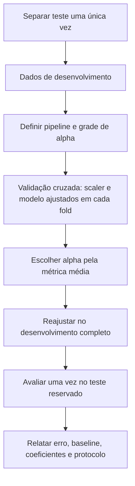

<!-- mirandastech-aula-v2 -->

# Aula 05 — Regularização: Ridge, Lasso e Elastic Net

[](https://colab.research.google.com/github/joaopaulomirandamatias/ai-lab/blob/main/03-machine-learning/notebooks/05-regularizacao-ridge-lasso-elastic-net-laboratorio.ipynb)

> Dois modelos têm erro semelhante no treino. Um usa coeficientes enormes que mudam radicalmente quando poucas linhas são substituídas; o outro aceita um pequeno viés, mas permanece estável. Qual deles merece chegar à produção?

Na [Aula 04](04-regressao-linear-minimos-quadrados.md), ajustamos regressão linear por mínimos quadrados ordinários (OLS). Quando há muitas features, ruído ou colunas correlacionadas, minimizar apenas o erro de treino pode produzir uma solução frágil. Nesta aula, acrescentaremos uma preferência explícita por coeficientes menores. Essa **regularização** controla complexidade e pode melhorar a generalização.

Regularizar não é apagar coeficientes arbitrariamente. É declarar, antes de olhar o teste, quanto estamos dispostos a trocar ajuste nos dados de desenvolvimento por estabilidade. Ridge, Lasso e Elastic Net implementam essa troca de maneiras diferentes.

## Objetivos

Ao final, você deverá ser capaz de:

- explicar regularização como controle do compromisso viés–variância;
- escrever e interpretar as funções objetivo de Ridge, Lasso e Elastic Net;
- distinguir contração de coeficientes de seleção de features;
- justificar por que as features devem ser padronizadas dentro do pipeline;
- explicar o efeito de colunas correlacionadas em cada penalidade;
- selecionar `alpha` somente com dados de desenvolvimento e validação cruzada;
- interpretar caminhos de regularização, esparsidade e estabilidade;
- evitar penalizar o intercepto inadvertidamente;
- avaliar o modelo escolhido uma única vez no conjunto de teste reservado;
- reconhecer situações em que coeficiente zero não prova irrelevância causal.

## Pré-requisitos

- regressão linear, resíduos, MSE e mínimos quadrados;
- norma $L_1$ e norma $L_2$;
- treino, validação, teste e validação cruzada;
- `Pipeline` e prevenção de *data leakage*.

## Vocabulário essencial

| Termo | Significado |
|---|---|
| penalidade | termo adicionado à perda para desencorajar soluções complexas |
| *shrinkage* | contração dos coeficientes em direção a zero |
| hiperparâmetro | escolha feita fora do ajuste dos coeficientes; aqui, a força `alpha` |
| esparsidade | presença de muitos coeficientes exatamente iguais a zero |
| caminho de regularização | trajetória dos coeficientes enquanto `alpha` varia |
| `l1_ratio` | proporção da penalidade $L_1$ no Elastic Net |
| efeito de agrupamento | tendência de features correlacionadas permanecerem juntas no modelo |
| estabilidade | pouca variação da solução sob pequenas perturbações dos dados |

## 1. O problema que OLS não resolve sozinho

OLS escolhe $\widehat\beta$ para minimizar a soma dos quadrados dos resíduos:

\[
\operatorname{RSS}(\beta)=\sum_{i=1}^{n}(y_i-\beta_0-x_i^T\beta)^2.
\]

Se duas colunas de $X$ carregam quase a mesma informação, muitas combinações de coeficientes geram previsões parecidas. Uma pequena mudança na amostra pode deslocar muito peso de uma coluna para outra. O erro de treino quase não muda, mas a interpretação e a previsão fora da amostra podem mudar.

Considere duas features idênticas e uma previsão que depende de $4x$:

\[
\widehat y=\beta_1x+\beta_2x,\qquad \beta_1+\beta_2=4.
\]

As soluções $(4,0)$, $(3,1)$ e $(2,2)$ fazem a mesma previsão. OLS não tem motivo preditivo para preferir uma delas. Ridge prefere $(2,2)$ porque

\[
2^2+2^2=8<4^2+0^2=16.
\]

A penalidade torna explícita uma preferência entre soluções que ajustam os dados de forma semelhante.


## 2. A ideia central: perda mais penalidade

Usaremos uma forma normalizada da função objetivo:

\[
\underset{\beta_0,\beta}{\operatorname{minimizar}}
\quad
\frac{1}{2n}\sum_{i=1}^{n}(y_i-\beta_0-x_i^T\beta)^2
+\alpha\,\Omega(\beta).
\]

- $n$: número de observações;
- $x_i$: vetor de features da observação $i$;
- $y_i$: resposta observada;
- $\beta_0$: intercepto;
- $\beta$: vetor de coeficientes;
- $\Omega(\beta)$: penalidade;
- $\alpha\geq0$: força da regularização.

Quando $\alpha=0$, recuperamos OLS. Ao aumentar $\alpha$, aceitamos mais erro de ajuste para reduzir a magnitude dos coeficientes. Se $\alpha$ for excessivo, o modelo sofre *underfitting*.

Há convenções diferentes para o fator diante da perda e da penalidade. Por isso, valores de `alpha` não são diretamente comparáveis entre bibliotecas ou formulações. Compare o comportamento do modelo e leia a documentação da implementação.

O intercepto costuma ficar fora de $\Omega$. Ele representa o nível médio da resposta, não a sensibilidade às features. Em `scikit-learn`, os estimadores tratados aqui não penalizam o intercepto quando `fit_intercept=True`.

## 3. Ridge: penalidade quadrática $L_2$

Ridge usa

\[
\Omega(\beta)=\frac{1}{2}\|\beta\|_2^2
=\frac{1}{2}\sum_{j=1}^{p}\beta_j^2.
\]

Sua função objetivo é

\[
\underset{\beta_0,\beta}{\operatorname{minimizar}}
\quad
\frac{1}{2n}\|y-\beta_0\mathbf{1}-X\beta\|_2^2
+\frac{\alpha}{2}\|\beta\|_2^2.
\]

A derivada da penalidade cresce com $|\beta_j|$. Coeficientes muito grandes recebem pressão maior. Em geral, Ridge os aproxima de zero, mas não os zera exatamente.

Com $X$ e $y$ centralizados, e usando a convenção sem o fator $1/n$, a solução fechada é

\[
\widehat\beta_{\text{ridge}}
=(X^TX+\lambda I)^{-1}X^Ty.
\]

O termo $\lambda I$ aumenta os valores na diagonal de $X^TX$, melhorando o condicionamento quando há colinearidade. A expressão é útil para compreender o método; em código, não calcule a inversa explicitamente. Solvers numéricos são mais estáveis.

### Quando Ridge é uma boa escolha

- muitas features têm pequenos efeitos distribuídos;
- há multicolinearidade;
- previsão e estabilidade importam mais que uma lista curta de variáveis;
- deseja-se manter todas as features no modelo.

### Limite importante

Ridge reduz magnitude, mas não faz seleção automática. Um coeficiente pequeno também depende da unidade da feature; sua interpretação exige padronização e contexto.

## 4. Lasso: penalidade absoluta $L_1$

Lasso — *Least Absolute Shrinkage and Selection Operator* — usa

\[
\Omega(\beta)=\|\beta\|_1=\sum_{j=1}^{p}|\beta_j|.
\]

Logo:

\[
\underset{\beta_0,\beta}{\operatorname{minimizar}}
\quad
\frac{1}{2n}\|y-\beta_0\mathbf{1}-X\beta\|_2^2
+\alpha\|\beta\|_1.
\]

O valor absoluto tem uma quina em zero. Geometricamente, as quinas da região $L_1$ favorecem soluções nos eixos; computacionalmente, o operador de limiarização pode levar coeficientes exatamente a zero. Por isso, Lasso combina contração e seleção de features.

Imagine o caso ortogonal, com features padronizadas. A solução de cada coeficiente se comporta como uma limiarização suave:

\[
\widehat\beta_j^{\text{lasso}}
=\operatorname{sign}(z_j)\max(|z_j|-\alpha,0),
\]

onde $z_j$ é o coeficiente não penalizado na convenção correspondente. Se $|z_j|\leq\alpha$, o resultado é zero.

### Quando Lasso é atraente

- acredita-se que poucos preditores carregam a maior parte do sinal;
- um modelo esparso reduz custo de medição ou comunicação;
- seleção de variáveis é útil como etapa preditiva exploratória.

### O perigo das features correlacionadas

Se duas features são substitutas, Lasso pode escolher uma e zerar a outra; outra amostra pode inverter a escolha. O modelo pode prever bem e ainda ser instável como mecanismo de seleção. Coeficiente zero não significa ausência de associação no mundo real nem ausência de efeito causal.

Como $|\beta|$ não é diferenciável em zero, não usamos a mesma solução fechada de Ridge. Algoritmos como descida por coordenadas resolvem o problema convexo de forma eficiente.

## 5. Elastic Net: combinar $L_1$ e $L_2$

Elastic Net mistura as duas penalidades:

\[
\underset{\beta_0,\beta}{\operatorname{minimizar}}
\quad
\frac{1}{2n}\|y-\beta_0\mathbf{1}-X\beta\|_2^2
+\alpha\rho\|\beta\|_1
+\frac{\alpha(1-\rho)}{2}\|\beta\|_2^2.
\]

- $\alpha$ controla a força total;
- $\rho$, chamado `l1_ratio` em `scikit-learn`, controla a mistura;
- $\rho=1$ reproduz Lasso;
- $\rho=0$ corresponde à penalidade Ridge nessa parametrização, embora a implementação de `ElasticNet` não seja a opção numérica recomendada para Ridge puro.

Elastic Net pode produzir zeros e, graças ao componente $L_2$, tende a ser mais estável quando features correlacionadas formam grupos. Ele adiciona um hiperparâmetro: se `l1_ratio` também for selecionado, essa busca deve acontecer dentro do mesmo protocolo de validação.

| Método | Penalidade | Zera coeficientes? | Features correlacionadas | Uso típico |
|---|---|---:|---|---|
| OLS | nenhuma | não | pode ser instável | baseline, poucos preditores bem condicionados |
| Ridge | $L_2$ | raramente | divide o peso, com maior estabilidade | sinal distribuído e colinearidade |
| Lasso | $L_1$ | sim | pode escolher uma arbitrariamente | hipótese esparsa e seleção preditiva |
| Elastic Net | $L_1+L_2$ | sim | favorece efeito de agrupamento | esparsidade com grupos correlacionados |

## 6. Por que a escala muda a penalidade

Suponha que distância esteja em quilômetros e temperatura em graus. O mesmo fenômeno pode ser representado como metros multiplicando a coluna por 1.000. Para preservar a previsão, seu coeficiente é dividido por 1.000. A penalidade, porém, vê números diferentes.

Sem padronização, uma feature medida em escala grande pode usar coeficiente numericamente pequeno e receber menos penalidade. Isso torna a escolha dependente da unidade de medida.

Padronizamos cada coluna usando apenas o treino do fold:

\[
z_{ij}=\frac{x_{ij}-\mu_j^{(\text{treino})}}{s_j^{(\text{treino})}}.
\]

O `StandardScaler` deve estar dentro de um `Pipeline`. Durante validação cruzada, cada fold aprende $\mu_j$ e $s_j$ apenas em sua parte de treino. Padronizar todo o conjunto antes da validação vaza informação das partições de validação.

Features binárias podem ou não ser escaladas conforme a representação e a interpretação desejada. O ponto metodológico é decidir conscientemente e manter o ajuste dentro da fronteira de treino.

## 7. Selecionar `alpha` sem usar o teste

`alpha` não é aprendido pela minimização dos coeficientes. É um hiperparâmetro. O conjunto de teste não participa de sua escolha.



Um protocolo mínimo:

1. separe o teste antes de explorar os hiperparâmetros;
2. escolha uma métrica coerente com o problema, como RMSE;
3. defina a grade de `alpha` em escala logarítmica;
4. para cada candidato, execute validação cruzada com todo pré-processamento no pipeline;
5. escolha o candidato pelo desempenho médio ou por uma regra pré-definida;
6. ajuste o pipeline escolhido em todos os dados de desenvolvimento;
7. avalie uma única vez no teste.

Grades logarítmicas são naturais porque o efeito relevante pode ocorrer em ordens de grandeza diferentes. Se o melhor valor estiver na borda da grade, amplie-a e repita a busca apenas no desenvolvimento.

Há incerteza na própria validação. Diferenças mínimas entre candidatos não justificam uma narrativa de superioridade. Uma alternativa é a regra de um erro-padrão: escolher a solução mais regularizada cujo erro esteja a até um erro-padrão do mínimo. Ela favorece simplicidade, mas precisa ser definida antes da inspeção final.

## 8. Caminhos de coeficientes e diagnóstico

Um único `alpha` esconde a dinâmica. No **caminho de regularização**, cada curva mostra um coeficiente ao variar `alpha`.

- em `alpha` pequeno, a solução se aproxima de OLS;
- em Ridge, as curvas normalmente encolhem de forma contínua;
- em Lasso, algumas curvas atingem zero;
- entradas e saídas instáveis entre features correlacionadas são um alerta interpretativo.

Avalie mais que o RMSE:

| Pergunta | Evidência útil |
|---|---|
| o modelo generaliza? | validação cruzada e teste reservado |
| supera uma regra simples? | baseline da média ou do domínio |
| é estável? | dispersão dos coeficientes em reamostragens |
| é esparso? | número de coeficientes não nulos e tolerância declarada |
| depende da unidade? | teste de invariância após reescala |
| extrapola perigosamente? | faixa das features e análise de resíduos |

Em problemas temporais ou agrupados, troque o `KFold` aleatório por um particionamento compatível com a unidade de generalização. A regularização não corrige um desenho experimental inadequado.

## 9. Exemplo resolvido: escolher entre as três penalidades

Uma equipe prevê consumo usando 30 sensores, vários deles medindo fenômenos semelhantes.

**Passo 1 — objetivo.** Minimizar RMSE fora da amostra; manter estabilidade é um requisito operacional.

**Passo 2 — teste reservado.** Os últimos períodos são isolados se o uso real é temporal. Nenhuma decisão de `alpha` consulta esse teste.

**Passo 3 — pipelines.** Cada candidato contém imputação, padronização e estimador. Aqui omitimos imputação apenas se os dados forem comprovadamente completos.

**Passo 4 — validação.** Avaliam-se `alpha` em uma grade logarítmica. Elastic Net também fixa ou valida `l1_ratio`.

**Passo 5 — escolha.** Se Ridge e Lasso tiverem RMSE quase igual, mas Lasso alternar sensores selecionados entre folds, Ridge pode atender melhor ao requisito de estabilidade. Se o custo de manter sensores for alto, um Elastic Net esparso e estável pode ser preferível.

**Passo 6 — teste.** O pipeline escolhido é reajustado no desenvolvimento completo e medido uma vez no teste. Essa estimativa não volta para orientar nova busca.

**Passo 7 — relatório.** Registre grade, folds, seed, métrica, coeficientes na escala padronizada, baseline e resultado do teste.

O “melhor” regularizador depende do objetivo, da estrutura de correlação e do custo dos erros. Não existe vencedor universal.

## 10. Implementação segura com `scikit-learn`

```python
from sklearn.linear_model import ElasticNet, Lasso, Ridge
from sklearn.model_selection import KFold, cross_val_score
from sklearn.pipeline import make_pipeline
from sklearn.preprocessing import StandardScaler

cv = KFold(n_splits=5, shuffle=True, random_state=20260908)

modelo = make_pipeline(
    StandardScaler(),
    ElasticNet(
        alpha=0.1,
        l1_ratio=0.5,
        max_iter=100_000,
        tol=1e-7,
        random_state=20260908,
    ),
)

rmse = -cross_val_score(
    modelo,
    X_desenvolvimento,
    y_desenvolvimento,
    scoring="neg_root_mean_squared_error",
    cv=cv,
).mean()
```

O código ilustra um candidato, não a seleção completa. Na prática, avalie a grade no desenvolvimento; não escolha `alpha=0.1` por costume.

## 11. Armadilhas e erros comuns

1. **Padronizar antes do split ou fora dos folds.** O scaler aprende estatísticas que não deveria conhecer.
2. **Escolher `alpha` pelo teste.** O teste deixa de ser uma estimativa final honesta.
3. **Comparar `alpha` entre bibliotecas sem conferir a função objetivo.** Fatores de escala mudam o significado numérico.
4. **Interpretar zero do Lasso como causalidade.** Seleção preditiva não identifica efeitos causais.
5. **Ignorar correlação.** Lasso pode trocar arbitrariamente uma feature por outra substituta.
6. **Penalizar o intercepto por acidente.** Isso desloca o nível médio sem justificativa.
7. **Usar apenas erro de treino.** Regularização é escolhida por generalização, não por ajuste aparente.
8. **Declarar esparsidade com igualdade de ponto flutuante.** Use uma tolerância explícita, por exemplo $|\beta_j|>10^{-8}$.
9. **Confiar em convergência silenciosa.** Aumente `max_iter`, inspecione avisos e confira `dual_gap_` quando aplicável.
10. **Confundir coeficiente pequeno com impacto pequeno.** Escala, distribuição da feature e interações importam.

## 12. Checklist prático

- [ ] Separei o teste antes da busca?
- [ ] Minha divisão respeita tempo, grupos e unidade de análise?
- [ ] Todo pré-processamento está dentro do pipeline?
- [ ] A grade cobre várias ordens de grandeza?
- [ ] A métrica foi escolhida antes de olhar os resultados?
- [ ] O melhor `alpha` não ficou preso à borda da grade?
- [ ] Registrei a convenção da função objetivo e a versão da biblioteca?
- [ ] Comparei contra baseline e OLS?
- [ ] Analisei estabilidade, correlação e caminho dos coeficientes?
- [ ] Avaliei o teste apenas uma vez?
- [ ] Evitei interpretações causais indevidas?

## 13. Laboratório reproduzível

O [notebook da aula](../notebooks/05-regularizacao-ridge-lasso-elastic-net-laboratorio.ipynb) gera dados sintéticos documentados com features correlacionadas e unidades muito diferentes. Ele:

- separa o teste antes da seleção;
- compara baseline, OLS, Ridge, Lasso e Elastic Net;
- escolhe `alpha` com validação cruzada somente no desenvolvimento;
- traça caminhos de coeficientes;
- mede a esparsidade do Lasso;
- verifica que a padronização torna Ridge praticamente invariante a uma troca de unidade;
- compara estabilidade de coeficientes por reamostragem;
- inclui `asserts` para checar propriedades metodológicas e numéricas.

Dependências mínimas: Python 3.10, NumPy 1.24, pandas 2.0, Matplotlib 3.7 e scikit-learn 1.4. A seed é `20260908`. Os dados são sintéticos para tornar a execução independente de rede e permitir conhecer a estrutura geradora.

## 14. Resumo

- regularização adiciona uma preferência por coeficientes menores à perda;
- Ridge usa $L_2$, contrai coeficientes e estabiliza soluções correlacionadas;
- Lasso usa $L_1$ e pode gerar soluções esparsas;
- Elastic Net combina esparsidade e efeito de agrupamento;
- padronização deve ser ajustada apenas no treino de cada fold;
- `alpha` é escolhido no desenvolvimento, nunca no teste;
- caminhos e reamostragens ajudam a avaliar estabilidade;
- seleção preditiva de features não autoriza conclusão causal.

## 15. Exercícios

### Exercício 1 — penalidade Ridge

Dois vetores produzem o mesmo RSS: $\beta^{(A)}=(4,0)$ e $\beta^{(B)}=(2,2)$. Qual Ridge prefere, mantendo o mesmo `alpha` positivo?

<details>
<summary>Resposta comentada</summary>

Ridge compara a soma dos quadrados. Para A, $\|\beta^{(A)}\|_2^2=16$; para B, $\|\beta^{(B)}\|_2^2=8$. Como o RSS é igual, prefere B. O exemplo ilustra a divisão de peso entre features redundantes.

</details>

### Exercício 2 — penalidade Lasso

Para os mesmos vetores, Lasso distingue A e B?

<details>
<summary>Resposta comentada</summary>

Não: $\|\beta^{(A)}\|_1=4$ e $\|\beta^{(B)}\|_1=4$. Em presença de colunas idênticas, a solução Lasso pode não ser única quanto à distribuição do peso. Isso ajuda a explicar sua instabilidade com preditores fortemente correlacionados.

</details>

### Exercício 3 — troca de unidade

Uma coluna em quilômetros é convertida para metros. O que acontece se Ridge for reajustado sem padronização?

<details>
<summary>Resposta comentada</summary>

Para a mesma contribuição preditiva, o coeficiente numérico é dividido por 1.000, reduzindo drasticamente sua penalidade quadrática. O ajuste pode mudar apenas por causa da unidade. Com padronização aprendida no treino, a representação padronizada permanece equivalente, salvo erro numérico.

</details>

### Exercício 4 — desenho do experimento

Você testou 20 valores de `alpha`, escolheu o menor RMSE no teste e publicou esse mesmo RMSE. Qual é o problema?

<details>
<summary>Resposta comentada</summary>

O teste foi usado como validação. O menor valor explora flutuações favoráveis entre 20 tentativas e tende a ser otimista. Selecione `alpha` por validação cruzada no desenvolvimento, reajuste o modelo e use o teste reservado uma única vez.

</details>

### Exercício 5 — escolha do método

Há 200 variáveis derivadas de 20 sensores, com grupos muito correlacionados, e deseja-se alguma esparsidade sem escolher arbitrariamente apenas um sensor por grupo. Qual ponto de partida é mais coerente?

<details>
<summary>Resposta comentada</summary>

Elastic Net é um ponto de partida coerente: o componente $L_1$ permite zeros e o componente $L_2$ favorece maior estabilidade entre variáveis correlacionadas. A decisão final ainda depende de validação, custo, estabilidade e comparação com baselines.

</details>

## 16. Conexões com IA e próxima aula

A mesma ideia reaparece em toda IA: *weight decay* em redes neurais se relaciona à penalização $L_2$ sob condições específicas; modelos esparsos podem reduzir custo; e regularização expressa preferências indutivas sobre soluções. Mas o efeito depende do otimizador e da parametrização — equivalências não devem ser assumidas sem conferir a implementação.

Na próxima aula, avançaremos para [regressão logística e classificação probabilística](06-regressao-logistica.md). A regularização continuará presente, agora aplicada a uma perda de classificação baseada em log-verossimilhança. O foco novo será transformar uma combinação linear em probabilidade, interpretar log-odds e separar probabilidade estimada de decisão por limiar.

## Referências técnicas

- Hoerl, A. E.; Kennard, R. W. (1970). [Ridge Regression: Biased Estimation for Nonorthogonal Problems](https://doi.org/10.1080/00401706.1970.10488634). *Technometrics*, 12(1), 55–67.
- Tibshirani, R. (1996). [Regression Shrinkage and Selection via the Lasso](https://doi.org/10.1111/j.2517-6161.1996.tb02080.x). *Journal of the Royal Statistical Society: Series B*, 58(1), 267–288.
- Zou, H.; Hastie, T. (2005). [Regularization and Variable Selection via the Elastic Net](https://doi.org/10.1111/j.1467-9868.2005.00503.x). *Journal of the Royal Statistical Society: Series B*, 67(2), 301–320.
- scikit-learn. [Linear Models: Ridge, Lasso and Elastic Net](https://scikit-learn.org/stable/modules/linear_model.html). Documentação oficial; consulte a versão instalada para a convenção exata da função objetivo.
- Hastie, T.; Tibshirani, R.; Wainwright, M. (2015). [Statistical Learning with Sparsity](https://hastie.su.domains/StatLearnSparsity/). Livro aberto.

## Material complementar

- James, G. et al. [An Introduction to Statistical Learning](https://www.statlearning.com/). Capítulo sobre seleção e regularização de modelos lineares.

