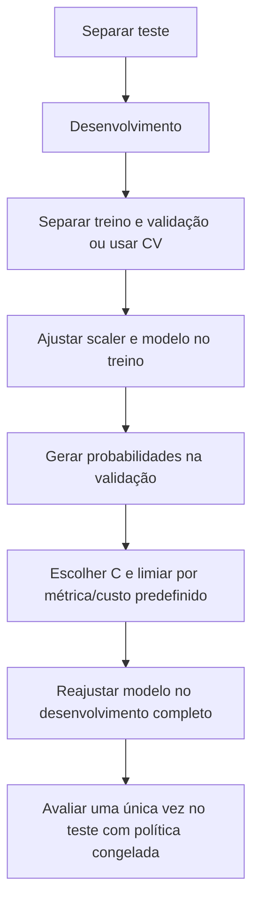

<!-- mirandastech-aula-v2 -->

# Aula 06 — Regressão logística e classificação probabilística

[](https://colab.research.google.com/github/joaopaulomirandamatias/ai-lab/blob/main/03-machine-learning/notebooks/06-regressao-logistica-classificacao-probabilistica-laboratorio.ipynb)

> Um sistema de prevenção a fraudes estima risco de 18% para uma transação e 73% para outra. Esses números não são decisões: bloquear, revisar ou aprovar depende do custo de cada erro e da capacidade operacional. Primeiro precisamos entender como o modelo produz probabilidades; depois, como transformá-las em ações.

Na [Aula 05](05-regularizacao-ridge-lasso-elastic-net.md), adicionamos penalidades a um modelo linear para controlar complexidade. Agora o alvo deixa de ser contínuo e passa a ser binário: fraude ou não fraude, falha ou operação normal, inadimplência ou pagamento. A regressão logística mantém um preditor linear, mas o conecta a uma probabilidade por meio da função sigmoide.

Esta aula encerra o bloco de modelos lineares. O foco é o mecanismo probabilístico, a função de perda, o gradiente e a separação entre **estimativa** e **decisão**. Métricas de classificação, curvas ROC/PR e calibração serão aprofundadas nas Aulas 14 e 15.

## Objetivos

Ao final, você deverá ser capaz de:

- distinguir regressão linear, score, logit, probabilidade e classe;
- transformar odds em probabilidade e interpretar log-odds;
- escrever o modelo Bernoulli-logístico e sua função de verossimilhança;
- derivar a binary cross-entropy e o gradiente $X^T(p-y)/n$;
- implementar sigmoide e log-loss com estabilidade numérica;
- interpretar coeficientes como razões de odds condicionais;
- explicar por que probabilidade prevista e regra de decisão são objetos distintos;
- escolher um limiar com uma matriz de custos usando apenas validação;
- usar regularização e padronização dentro de um pipeline;
- reconhecer separação perfeita, mudança de prevalência e probabilidade mal calibrada;
- avaliar o modelo final uma única vez no teste reservado.

## Pré-requisitos

- combinação linear, produto matricial e gradiente;
- probabilidade condicional, Bernoulli, odds e máxima verossimilhança;
- cross-entropy e log-loss;
- regularização $L_2$, desenvolvimento, validação e teste;
- `Pipeline` e prevenção de *data leakage*.

## Vocabulário essencial

| Termo | Significado |
|---|---|
| classe positiva | evento codificado como $y=1$ |
| score | valor numérico usado para ordenar casos; não precisa ser probabilidade |
| logit | preditor linear $z=w^Tx+b$; também é o logaritmo das odds |
| sigmoide | função que converte qualquer real em valor entre 0 e 1 |
| odds | razão $p/(1-p)$ entre probabilidade de ocorrer e de não ocorrer |
| log-odds | logaritmo natural das odds |
| log-loss/BCE | perda probabilística da classificação binária |
| limiar | regra que transforma probabilidade em ação ou classe |
| calibração | concordância entre probabilidades previstas e frequências observadas |
| prevalência | proporção da classe positiva na população ou amostra |

## 1. Por que não usar regressão linear para um alvo binário?

Poderíamos ajustar OLS a valores 0 e 1, mas a reta não respeita os limites de uma probabilidade: pode prever $-0{,}3$ ou $1{,}4$. Além disso, a variância de um alvo Bernoulli depende de sua média:

\[
\operatorname{Var}(Y\mid X=x)=p(x)[1-p(x)].
\]

A regressão logística modela uma quantidade não limitada — as log-odds — como função linear das features, e então a transforma em uma probabilidade válida.


O modelo termina em $p$. A política de decisão começa depois dele. Essa separação permite usar o mesmo modelo com limiares diferentes para revisão manual, bloqueio automático ou priorização.

## 2. Do preditor linear à sigmoide

Para uma observação $x\in\mathbb{R}^p$, calculamos:

\[
z=w^Tx+b,
\]

onde $w$ contém os $p$ coeficientes e $b$ é o intercepto. Como $z$ pode assumir qualquer valor real, aplicamos a função sigmoide:

\[
p=P(Y=1\mid X=x)=\sigma(z)=\frac{1}{1+e^{-z}}.
\]

Propriedades úteis:

- $sigma(0)=0{,}5$;
- se $z\to+\infty$, então $sigma(z)\to1$;
- se $z\to-\infty$, então $sigma(z)\to0$;
- $sigma(-z)=1-\sigma(z)$;
- a derivada é $sigma'(z)=\sigma(z)[1-\sigma(z)]$.

| Logit $z$ | Probabilidade $sigma(z)$ | Leitura |
|---:|---:|---|
| $-4$ | $0{,}018$ | evento pouco provável |
| $-1$ | $0{,}269$ | abaixo de 50% |
| $0$ | $0{,}500$ | odds iguais |
| $1$ | $0{,}731$ | acima de 50% |
| $4$ | $0{,}982$ | evento muito provável |

A sigmoide satura nas extremidades. Uma diferença de uma unidade perto de $z=0$ altera bastante a probabilidade; perto de $z=10$, altera pouco. O efeito de uma feature sobre $p$ depende do ponto em que a observação está.

## 3. Odds e log-odds

As **odds** de um evento são:

\[
\operatorname{odds}(p)=\frac{p}{1-p}.
\]

Se $p=0{,}75$, as odds são $0{,}75/0{,}25=3$: esperamos três ocorrências para cada não ocorrência em uma interpretação de frequências repetidas. Probabilidade e odds não são a mesma coisa.

Partindo da sigmoide:

\[
p=\frac{1}{1+e^{-z}}
\quad\Longrightarrow\quad
\frac{p}{1-p}=e^z
\quad\Longrightarrow\quad
\log\left(\frac{p}{1-p}\right)=z.
\]

Portanto, a hipótese estrutural da regressão logística é:

\[
\log\left(\frac{p(x)}{1-p(x)}\right)=w^Tx+b.
\]

Ela não afirma que a probabilidade seja linear nas features. Afirma que as **log-odds** são lineares.

## 4. Interpretação dos coeficientes

Mantendo as outras features constantes, aumentar $x_j$ em uma unidade acrescenta $w_j$ às log-odds. Exponenciando:

\[
\frac{\operatorname{odds}(x_j+1)}{\operatorname{odds}(x_j)}=e^{w_j}.
\]

Assim, $e^{w_j}$ é uma razão de odds condicional sob o modelo.

### Exemplo

Se $w_j=0{,}40$, então $e^{0{,}40}\approx1{,}492$. Uma unidade adicional em $x_j$ multiplica as odds por aproximadamente 1,492, mantendo as demais features fixas. Isso representa aumento de 49,2% **nas odds**, não na probabilidade.

Se a probabilidade inicial é 20%, suas odds são 0,25. Multiplicando por 1,492, obtemos odds 0,373 e nova probabilidade:

\[
p'=\frac{0{,}373}{1+0{,}373}\approx0{,}272.
\]

O aumento foi de 7,2 pontos percentuais, não 49,2 pontos.

Quando a feature é padronizada, uma unidade significa um desvio-padrão do treino. Isso facilita comparar magnitudes, mas muda a interpretação. Codificação, interações e correlação também afetam coeficientes. Como nos modelos lineares anteriores, associação condicional não identifica causalidade.

## 5. Modelo probabilístico Bernoulli

Para cada observação:

\[
Y_i\mid X_i=x_i\sim\operatorname{Bernoulli}(p_i),
\qquad
p_i=\sigma(w^Tx_i+b).
\]

A função de probabilidade de uma Bernoulli pode ser escrita como:

\[
P(Y_i=y_i\mid x_i)=p_i^{y_i}(1-p_i)^{1-y_i},
\qquad y_i\in\{0,1\}.
\]

Assumindo observações condicionais independentes, a verossimilhança é:

\[
L(w,b)=\prod_{i=1}^{n}p_i^{y_i}(1-p_i)^{1-y_i}.
\]

Produtos de muitas probabilidades podem sofrer *underflow*. Tomamos o log e transformamos produto em soma:

\[
\log L(w,b)=\sum_{i=1}^{n}left[y_i\log p_i+(1-y_i)\log(1-p_i)\right].
\]

Maximizar a log-verossimilhança equivale a minimizar sua média negativa, a **binary cross-entropy** ou **log-loss**:

\[
J(w,b)=-\frac{1}{n}\sum_{i=1}^{n}left[y_i\log p_i+(1-y_i)\log(1-p_i)\right].
\]

Uma previsão correta e confiante recebe perda pequena. Uma previsão confiante e errada recebe penalidade grande. Isso incentiva o modelo a representar incerteza, não apenas acertar um lado do limiar.

## 6. Estabilidade numérica

Calcular $e^{-z}$ diretamente pode transbordar para logits extremos. Calcular `log(p)` após arredondar $p$ para zero produz `-inf`. Em termos do logit, a perda individual pode ser escrita de modo estável:

\[
\ell(z,y)=\log(1+e^z)-yz.
\]

O termo $log(1+e^z)$ é a função *softplus*. Em NumPy, `np.logaddexp(0, z)` computa esse valor de forma estável:

```python
loss = np.mean(np.logaddexp(0.0, logits) - y * logits)
```

Recortar probabilidades é aceitável para algumas métricas, mas não substitui uma formulação estável durante otimização.

## 7. O gradiente surpreendentemente simples

Para uma observação, a derivada da BCE em relação ao logit é:

\[
\frac{\partial \ell}{\partial z}=p-y.
\]

Uma forma de ver isso é combinar a derivada da BCE em relação a $p$ com $partial p/\partial z=p(1-p)$; os termos se cancelam. Como $z=Xw+b$, para o conjunto completo:

\[
\nabla_w J=\frac{1}{n}X^T(p-y),
\qquad
\frac{\partial J}{\partial b}=\frac{1}{n}\sum_{i=1}^{n}(p_i-y_i).
\]

O vetor $p-y$ é o erro probabilístico assinado. O gradiente propaga esse erro para cada feature. Essa estrutura reaparecerá em redes neurais e modelos com softmax.

A BCE logística é convexa em $w$ e $b$. Com dados adequados, métodos numéricos encontram o ótimo global. Isso não significa que haja sempre um ótimo finito: na separação perfeita sem regularização, os coeficientes podem crescer indefinidamente enquanto a perda se aproxima de zero.

## 8. Regularização na regressão logística

O conhecimento da Aula 05 continua válido. Com penalidade $L_2$:

\[
J_{L_2}(w,b)=J(w,b)+\frac{\lambda}{2}\|w\|_2^2.
\]

O intercepto normalmente não é penalizado. A regularização limita coeficientes, ajuda com colinearidade e evita divergência em casos separáveis.

Em `scikit-learn`, `LogisticRegression` aplica $L_2$ por padrão. Seu parâmetro `C` é inversamente relacionado à força de regularização: `C` maior significa penalidade mais fraca. A convenção exata depende do estimador e da versão; registre ambos. Se as features tiverem escalas diferentes, coloque `StandardScaler` dentro do pipeline.

Não selecione `C` pelo teste. Esse hiperparâmetro deve ser escolhido por validação no desenvolvimento, como `alpha` na aula anterior.

## 9. Probabilidade não é decisão

Uma regra binária usual é:

\[
\widehat y=
\begin{cases}
1,&p\geq\tau,\\
0,&p<\tau,
\end{cases}

\]

onde $	au$ é o limiar. O valor 0,5 é apenas uma convenção; ele pode ser inadequado quando classes, custos ou capacidades são assimétricos.

Considere os custos:

| Resultado | Custo no exemplo |
|---|---:|
| verdadeiro positivo | 0 |
| verdadeiro negativo | 0 |
| falso positivo: revisão desnecessária | 1 |
| falso negativo: fraude não bloqueada | 5 |

Para um conjunto de validação, o custo médio de um limiar é:

\[
\widehat C(\tau)=\frac{c_{FP}\,FP(\tau)+c_{FN}\,FN(\tau)}{n_{val}}.
\]

Escolhemos $	au$ que minimiza esse custo **na validação**, congelamos a política e só então avaliamos o teste. Se a capacidade de revisão for limitada, o problema pode exigir escolher os top-$k$ riscos, não um limiar fixo.



## 10. Calibração: o que significa prever 0,7?

Um modelo está calibrado se, entre casos aos quais atribui probabilidade próxima de 0,7, aproximadamente 70% são positivos em condições comparáveis. Um modelo pode ordenar muito bem os casos e ainda produzir probabilidades ruins.

A log-loss avalia a distribuição probabilística e pune confiança errada. O Brier score calcula o erro quadrático das probabilidades:

\[
\operatorname{Brier}=\frac{1}{n}\sum_{i=1}^{n}(p_i-y_i)^2.
\]

Uma curva de confiabilidade agrupa previsões e compara probabilidade média com frequência observada. Porém, poucos dados por faixa produzem estimativas ruidosas; o número e o tipo de bins mudam o gráfico.

Regressão logística costuma oferecer probabilidades razoáveis quando a especificação é adequada, mas calibração não é garantida. Mudança de prevalência, seleção amostral, regularização e relações não lineares podem degradá-la. A Aula 15 tratará diagnóstico e métodos de calibração com o protocolo apropriado.

## 11. Exemplo resolvido passo a passo

Considere $w=1{,}2$, $x=2$ e $b=-1$.

**Passo 1 — logit:**

\[
z=1{,}2\cdot2-1=1{,}4.
\]

**Passo 2 — probabilidade:**

\[
p=\sigma(1{,}4)=\frac{1}{1+e^{-1{,}4}}\approx0{,}8022.
\]

**Passo 3 — odds:**

\[
\frac{p}{1-p}\approx\frac{0{,}8022}{0{,}1978}\approx4{,}055.
\]

Isso também é $e^{1{,}4}\approx4{,}055$.

**Passo 4 — perda se $y=1$:**

\[
\ell=-\log(0{,}8022)\approx0{,}2204.
\]

**Passo 5 — perda se $y=0$:**

\[
\ell=-\log(1-0{,}8022)\approx1{,}6204.
\]

**Passo 6 — decisão:** com $	au=0{,}5$, a classe é positiva; com $	au=0{,}85$, é negativa. A probabilidade não mudou, apenas a política.

## 12. Implementação segura com `scikit-learn`

```python
from sklearn.linear_model import LogisticRegression
from sklearn.pipeline import make_pipeline
from sklearn.preprocessing import StandardScaler

modelo = make_pipeline(
    StandardScaler(),
    LogisticRegression(C=1.0, max_iter=2_000, random_state=20260908),
)
modelo.fit(X_treino, y_treino)

probabilidade = modelo.predict_proba(X_validacao)[:, 1]
classe_operacional = (probabilidade >= limiar_escolhido).astype(int)
```

`predict_proba` entrega probabilidades por classe na ordem de `classes_`. Não presuma que a segunda coluna representa o evento desejado sem verificar `modelo[-1].classes_`.

## 13. Armadilhas e erros comuns

1. **Chamar logit de probabilidade.** $w^Tx+b$ não está limitado a $[0,1]$.
2. **Usar regressão linear e recortar as saídas.** Isso não produz o modelo Bernoulli nem a loss correta.
3. **Escolher limiar no teste.** A política fica superajustada ao conjunto final.
4. **Assumir que 0,5 é universal.** Custos e capacidade operacional determinam a decisão.
5. **Interpretar $e^{w_j}$ como aumento percentual da probabilidade.** Ele multiplica odds.
6. **Ignorar a classe positiva.** Inverter 0 e 1 inverte a interpretação.
7. **Calcular BCE de forma instável.** Use logits e `logaddexp` ou funções confiáveis.
8. **Ignorar separação perfeita.** Coeficientes sem penalização podem divergir.
9. **Padronizar antes do split.** O scaler deve aprender apenas no treino de cada etapa.
10. **Tratar ranking como calibração.** Ordenar bem não garante probabilidades corretas.
11. **Confiar em probabilidades após mudança de prevalência.** Monitore o contexto de implantação.
12. **Inferir causalidade dos coeficientes.** O modelo é associativo sob as variáveis observadas.

## 14. Checklist prático

- [ ] Defini claramente qual evento é $y=1$?
- [ ] Declarei unidade de análise e instante da previsão?
- [ ] Separei teste antes de ajustar modelo, regularização ou limiar?
- [ ] Todo pré-processamento está dentro da fronteira de treino?
- [ ] Verifiquei estabilidade numérica da sigmoide e da log-loss?
- [ ] Selecionei `C` somente no desenvolvimento?
- [ ] Defini custos ou objetivo operacional antes de escolher o limiar?
- [ ] Comparei probabilidades contra um baseline de prevalência?
- [ ] Reportei ao menos log-loss e uma medida de decisão coerente?
- [ ] Inspecionei confiabilidade e casos confiantes errados?
- [ ] Registrei seed, versões, coeficientes e política de decisão?
- [ ] Evitei afirmações causais não sustentadas?

## 15. Laboratório reproduzível

O [notebook da aula](../notebooks/06-regressao-logistica-classificacao-probabilistica-laboratorio.ipynb) gera dados Bernoulli com estrutura conhecida e escalas diferentes. Ele:

- separa teste antes de qualquer escolha;
- implementa sigmoide estável, BCE a partir de logits e gradientes em NumPy;
- valida o gradiente com diferenças finitas;
- treina regressão logística por gradiente descendente;
- compara coeficientes e probabilidades com `LogisticRegression` sem penalização;
- interpreta razões de odds na escala padronizada;
- escolhe um limiar por custo apenas na validação;
- reajusta o pipeline no desenvolvimento e avalia o teste uma única vez;
- produz uma curva de loss e um diagrama de confiabilidade com texto alternativo;
- inclui `asserts` para separação, estabilidade, convergência e integridade.

Dependências mínimas: Python 3.10, NumPy 1.24, pandas 2.0, Matplotlib 3.7 e scikit-learn 1.4. A seed fixa é `20260908`; não há download nem credencial.

## 16. Resumo

- regressão logística modela log-odds lineares e produz probabilidade pela sigmoide;
- probabilidade, score, classe e ação são objetos distintos;
- máxima verossimilhança Bernoulli leva à binary cross-entropy;
- o gradiente em relação ao logit é $p-y$;
- `logaddexp` evita instabilidade numérica na perda;
- $e^{w_j}$ multiplica odds, não probabilidades;
- regularização ajuda a controlar coeficientes e separação perfeita;
- `C` e limiar são escolhidos no desenvolvimento;
- calibração precisa ser verificada e monitorada;
- o teste é usado uma única vez, com modelo e política congelados.

## 17. Exercícios

### Exercício 1 — probabilidade, odds e logit

Para $p=0{,}8$, calcule odds e logit.

<details>
<summary>Resposta comentada</summary>

As odds são $0{,}8/0{,}2=4$. O logit é $\log 4\approx1{,}3863$. Aplicar a sigmoide a 1,3863 devolve aproximadamente 0,8.

</details>

### Exercício 2 — interpretação de coeficiente

Um coeficiente vale $-0{,}7$. Qual é sua razão de odds?

<details>
<summary>Resposta comentada</summary>

$e^{-0{,}7}\approx0{,}497$. Uma unidade adicional multiplica as odds por cerca de 0,497, mantendo as demais features fixas — redução aproximada de 50,3% nas odds. A mudança na probabilidade depende do valor inicial.

</details>

### Exercício 3 — BCE

Duas observações positivas recebem probabilidades 0,9 e 0,6. Qual delas tem maior perda?

<details>
<summary>Resposta comentada</summary>

Para $y=1$, a perda é $-\log p$. Temos $-\log(0{,}9)\approx0{,}105$ e $-\log(0{,}6)\approx0{,}511$. A previsão 0,6 tem maior perda porque atribuiu menos probabilidade ao evento observado.

</details>

### Exercício 4 — limiar e custo

Por que um falso negativo cinco vezes mais caro que um falso positivo tende a favorecer limiar menor?

<details>
<summary>Resposta comentada</summary>

Reduzir o limiar classifica mais casos como positivos, normalmente reduz falsos negativos e aumenta falsos positivos. Se evitar um falso negativo vale muito mais, essa troca pode reduzir custo total. O limiar exato deve ser escolhido em validação representativa, não por intuição nem pelo teste.

</details>

### Exercício 5 — separação perfeita

Por que os coeficientes podem crescer sem limite quando uma reta separa perfeitamente as classes?

<details>
<summary>Resposta comentada</summary>

Multiplicar os coeficientes aumenta a magnitude dos logits mantendo os sinais corretos. As probabilidades se aproximam de 1 para positivos e 0 para negativos, reduzindo continuamente a log-loss, sem que exista um máximo finito da verossimilhança. Regularização torna a solução finita.

</details>

### Exercício 6 — ranking versus calibração

Um modelo atribui scores 0,6 a positivos e 0,4 a negativos em todos os casos. Ele ordena perfeitamente. Está necessariamente calibrado?

<details>
<summary>Resposta comentada</summary>

Não. Ordenação perfeita diz apenas que positivos recebem scores maiores. Se todos os casos com 0,6 forem positivos, prever 60% subestima a frequência observada de 100%. Ranking e calibração medem propriedades diferentes.

</details>

## 18. Conexões com IA e próxima aula

Classificação logística é a unidade básica de muitos sistemas: uma camada linear seguida de sigmoide aparece em redes neurais binárias; o gradiente $p-y$ é um caso fundamental de aprendizado por cross-entropy; e separar probabilidade de política é essencial em detecção, segurança e triagem assistida por IA.

Na próxima aula, estudaremos [K-Nearest Neighbors](07-knn-distancias-dimensionalidade.md). Em vez de aprender uma fronteira global linear, o KNN decide localmente a partir dos exemplos próximos. Essa mudança tornará explícitos o papel da escala, da métrica e da dimensionalidade.

## Referências técnicas

- Cox, D. R. (1958). [The Regression Analysis of Binary Sequences](https://doi.org/10.1111/j.2517-6161.1958.tb00292.x). *Journal of the Royal Statistical Society: Series B*, 20(2), 215–242.
- Murphy, K. P. (2022). [Probabilistic Machine Learning: An Introduction](https://probml.github.io/pml-book/book1.html). MIT Press; capítulos sobre modelos lineares e regressão logística.
- scikit-learn. [Logistic regression](https://scikit-learn.org/stable/modules/linear_model.html#logistic-regression). Documentação oficial; consulte a versão instalada para solvers e convenções.
- scikit-learn. [Tuning the decision threshold for class prediction](https://scikit-learn.org/stable/modules/classification_threshold.html). Documentação oficial.
- scikit-learn. [Probability calibration](https://scikit-learn.org/stable/modules/calibration.html). Documentação oficial.

## Material complementar

- James, G. et al. [An Introduction to Statistical Learning](https://www.statlearning.com/). Capítulo 4, classificação.

