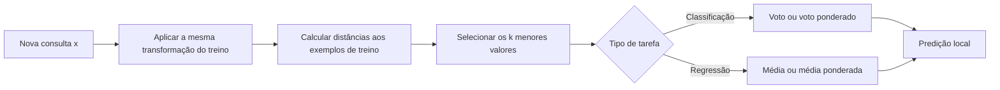
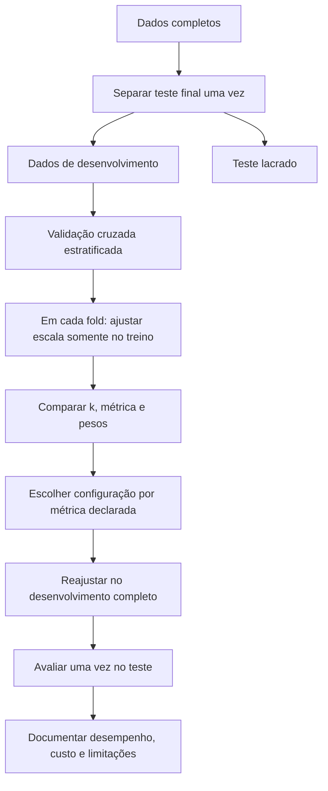

<!-- mirandastech-aula-v2 -->

# Aula 07 — K-Nearest Neighbors: distâncias e maldição da dimensionalidade

[](https://colab.research.google.com/github/joaopaulomirandamatias/ai-lab/blob/main/03-machine-learning/notebooks/07-knn-distancias-dimensionalidade-laboratorio.ipynb)

Na [aula anterior](06-regressao-logistica-classificacao-probabilistica.md), construímos um classificador **global**: a regressão logística aprende uma única combinação linear das variáveis. Agora estudaremos uma ideia quase oposta. O K-Nearest Neighbors (KNN) não resume o conjunto de treino em poucos coeficientes; para decidir sobre um novo exemplo, procura casos parecidos e consulta seus rótulos.

Essa simplicidade esconde decisões importantes. O que significa “parecido”? Um quilômetro deve pesar mais que um ano? Quantos vizinhos consultar? O que acontece quando adicionamos centenas de atributos irrelevantes? Esta aula transforma essas perguntas em um protocolo reproduzível.

---

## Problema motivador

Uma equipe precisa classificar solicitações de suporte como normais ou urgentes. Ela possui exemplos históricos com tempo de espera, número de interações e características do texto. Uma regra local parece natural: chamados semelhantes aos urgentes provavelmente também são urgentes.

Considere, porém, duas colunas:

- tempo de espera entre 0 e 60 minutos;
- similaridade textual entre 0 e 1.

Sem padronização, uma diferença de dez minutos domina uma diferença de 0,8 na similaridade. O algoritmo não conhece unidades nem relevância semântica: ele enxerga apenas números. Portanto, no KNN, **representação, escala e métrica fazem parte do modelo**.

## Objetivos

Ao final, você deverá ser capaz de:

1. explicar KNN como aprendizado baseado em instâncias;
2. calcular uma predição manualmente;
3. escolher uma métrica compatível com a representação;
4. relacionar `k` ao compromisso entre viés e variância;
5. padronizar dentro de um pipeline, sem vazamento de dados;
6. selecionar hiperparâmetros sem consultar o conjunto de teste;
7. reconhecer concentração de distâncias e outros efeitos da alta dimensionalidade;
8. avaliar se custo de memória e latência permitem usar KNN em produção.

### Pré-requisitos

- vetores, normas e distância euclidiana;
- divisão treino–validação–teste e validação cruzada;
- classificação, regressão e métricas básicas;
- `Pipeline` e `StandardScaler`, vistos na Aula 03.

## Vocabulário essencial

| Termo | Significado nesta aula |
|---|---|
| instância | uma linha do conjunto de dados |
| consulta | novo ponto para o qual se deseja uma predição |
| vizinhança | conjunto dos exemplos de treino mais próximos da consulta |
| métrica | função que quantifica distância entre dois pontos |
| `k` | quantidade de vizinhos usada na decisão |
| voto uniforme | cada vizinho contribui com o mesmo peso |
| voto por distância | vizinhos mais próximos contribuem mais |
| modelo não paramétrico | modelo cuja flexibilidade não é fixada por um pequeno vetor de parâmetros |
| alta dimensionalidade | espaço com muitas features; não é sinônimo de muitos exemplos |

---

## 1. Intuição: decisões locais

Imagine um mapa em que cada exemplo de treino é um ponto colorido por classe. Para classificar uma consulta:

1. mede-se a distância da consulta a cada exemplo conhecido;
2. selecionam-se os `k` menores valores;
3. agregam-se os rótulos desses vizinhos;
4. retorna-se a classe mais votada.



O “treino” clássico é barato: armazenam-se os exemplos, possivelmente em uma estrutura de índice. O custo aparece na inferência, quando a busca deve encontrar vizinhos. Por isso o KNN é chamado de método baseado em instâncias ou de aprendizado preguiçoso (*lazy learning*).

Não confunda “não paramétrico” com “sem hiperparâmetros”. KNN depende de `k`, métrica, pesos, transformação das features e estratégia de busca.

## 2. Formalização

Sejam os dados de treino

\[
\mathcal{D}=\{(\mathbf{x}_i,y_i)\}_{i=1}^{n},
\]

em que \(\mathbf{x}_i\in\mathbb{R}^{d}\) contém `d` features e \(y_i\) é o alvo. Para uma consulta \(\mathbf{x}\), denotamos por \(\mathcal{N}_k(\mathbf{x})\) os índices dos `k` exemplos com menor distância até ela.

### Classificação

Com votos uniformes, a frequência local da classe \(c\) é

\[
\widehat{P}(Y=c\mid\mathbf{x})=
\frac{1}{k}\sum_{i\in\mathcal{N}_k(\mathbf{x})}\mathbb{1}(y_i=c).
\]

Aqui, \(\mathbb{1}(\cdot)\) vale 1 quando a condição é verdadeira e 0 caso contrário. A classe prevista maximiza essa frequência:

\[
\widehat{y}=\arg\max_c\widehat{P}(Y=c\mid\mathbf{x}).
\]

Essa saída é uma proporção de votos, mas não deve ser automaticamente interpretada como probabilidade calibrada. Amostra pequena, sobreposição entre classes e escolha de `k` podem torná-la excessivamente discreta ou confiante.

### Regressão

Para alvo contínuo, usa-se a média local:

\[
\widehat{y}=\frac{1}{k}\sum_{i\in\mathcal{N}_k(\mathbf{x})}y_i.
\]

A lógica geométrica é a mesma; muda apenas a regra de agregação.

### Exemplo resolvido

Considere a consulta \(q=(1,1)\) e cinco pontos:

| Ponto | Coordenadas | Classe | Distância euclidiana até `q` |
|---|---:|---:|---:|
| A | `(1, 2)` | 0 | \(\sqrt{0^2+1^2}=1\) |
| D | `(2, 2)` | 0 | \(\sqrt{1^2+1^2}=\sqrt{2}\) |
| B | `(3, 1)` | 1 | \(\sqrt{2^2+0^2}=2\) |
| E | `(7, 7)` | 1 | \(\sqrt{6^2+6^2}=\sqrt{72}\) |
| C | `(8, 8)` | 1 | \(\sqrt{7^2+7^2}=\sqrt{98}\) |

Com `k=3`, os vizinhos são A, D e B. A classe 0 recebe dois votos e a classe 1 recebe um. Logo, \(\widehat y=0\) e a frequência local estimada é `(2/3, 1/3)`.

Observe como `k` muda a decisão: com `k=5`, a classe 1 vence por três votos. O algoritmo não “descobriu” uma verdade diferente; nós alteramos a escala espacial da pergunta.

---

## 3. A métrica define a vizinhança

A família de distâncias de Minkowski é

\[
d_p(\mathbf{x},\mathbf{z})=
\left(\sum_{j=1}^{d}|x_j-z_j|^p\right)^{1/p}.
\]

Cada símbolo tem um papel:

- `j` percorre as features;
- `d` é a dimensionalidade;
- `p` controla a geometria;
- `p=1` produz Manhattan;
- `p=2` produz Euclidiana.

| Distância | Intuição | Uso típico | Cuidado |
|---|---|---|---|
| Euclidiana (`p=2`) | linha reta | features contínuas padronizadas | sensível a escala e valores extremos |
| Manhattan (`p=1`) | soma por eixos | espaços em que desvios se acumulam | ainda exige escala coerente |
| cosseno | diferença de direção | vetores esparsos ou embeddings | ignora magnitude; zero requer tratamento |
| Hamming | proporção de posições distintas | atributos binários comparáveis | codificação de categorias altera significado |

Escolher métrica não é apenas buscar a que dá melhor resultado. A distância deve expressar a noção de similaridade relevante para o problema. Para texto, cosseno pode ser adequado; para latitude e longitude, a geometria esférica importa; para categorias nominais, atribuir inteiros como `azul=1`, `verde=2`, `vermelho=3` cria distâncias artificiais.

### Por que a escala é decisiva

Considere uma feature em milhares e outra entre 0 e 1. Na distância euclidiana, a primeira dominará a soma dos quadrados. A padronização transforma, em cada coluna,

\[
z_j=\frac{x_j-\mu_j}{\sigma_j},
\]

onde \(\mu_j\) e \(\sigma_j\) devem ser estimados **apenas no treino**. Em validação cruzada, isso significa colocar `StandardScaler` dentro do `Pipeline`. Ajustá-lo antes de separar folds vaza informação sobre a distribuição de validação.

Escalar não torna toda feature relevante. Uma variável de ruído padronizada continua sendo ruído e passa a contribuir para a distância com variância comparável às demais.

## 4. Escolhendo `k`: localidade contra suavização

`k` controla a complexidade efetiva do modelo:

| Escolha | Efeito | Risco predominante |
|---|---|---|
| `k=1` | fronteira muito local; treino frequentemente perfeito | alta variância e sensibilidade a ruído |
| `k` intermediário | combina evidência de uma região | depende da densidade dos dados |
| `k` muito grande | fronteira suave, próxima à prevalência global | alto viés e apagamento de minorias locais |

Não existe `k` universal. Escolha uma grade plausível com validação cruzada nos dados de desenvolvimento. Valores ímpares podem reduzir empates em classificação binária, mas não os eliminam em multiclasse nem quando há distâncias idênticas.

### Votos por distância

Em vez de peso uniforme, podemos usar

\[
w_i=\frac{1}{d(\mathbf{x},\mathbf{x}_i)+\varepsilon},
\]

com pequeno \(\varepsilon>0\) para evitar divisão por zero. A classe acumula os pesos de seus vizinhos. Isso permite que um caso muito próximo influencie mais, mas também aumenta a sensibilidade a duplicatas incorretas e ruído local. `weights` deve ser validado como qualquer outro hiperparâmetro.

### Empates, duplicatas e reprodutibilidade

- documente a regra de desempate;
- investigue pontos duplicados com rótulos conflitantes;
- preserve a ordem dos dados quando a implementação a usa para desempatar distâncias idênticas;
- registre transformações, métrica, `k`, pesos e versão da biblioteca.

---

## 5. Maldição da dimensionalidade

Em baixa dimensão, “perto” e “longe” costumam ser distinguíveis. Ao adicionar dimensões independentes, cada uma acrescenta variação à distância. O espaço disponível cresce rapidamente, os dados ficam esparsos e uma quantidade fixa de observações cobre uma fração cada vez menor dele.

Um sinal operacional é o contraste relativo:

\[
C=\frac{d_{\max}-d_{\min}}{d_{\min}}.
\]

Quando `C` cai, o vizinho mais próximo se distingue menos do mais distante. Isso não afirma que toda tarefa de alta dimensão é impossível: dados reais podem viver em uma estrutura de dimensão intrínseca menor, e boas representações podem aproximar semanticamente os itens relevantes. A conclusão prática é que proximidade precisa ser **medida e validada**, não presumida.

### Features irrelevantes

Suponha duas features informativas e 200 colunas gaussianas independentes do alvo. Depois da padronização, cada coluna de ruído contribui para a distância. A soma dessas contribuições pode encobrir a geometria útil das duas primeiras.

Isso conecta KNN a etapas posteriores do curso:

- seleção e engenharia de atributos procuram representações mais informativas;
- redução de dimensionalidade, estudada adiante, pode remover redundância;
- embeddings aprendidos tentam colocar objetos semanticamente semelhantes próximos;
- busca vetorial em RAG é, em essência, uma forma escalável de recuperação por vizinhança.

Não aplique redução dimensional antes da divisão dos dados: ela também deve ser ajustada dentro do protocolo de validação.

## 6. Custo computacional e implantação

Para `n` exemplos e `d` features, uma busca exata por força bruta calcula aproximadamente `n × d` contribuições por consulta. O armazenamento é da ordem de `n × d`. Em lotes grandes, isso pode ser incompatível com orçamento de latência e memória.

| Estratégia | Ideia | Quando pode ajudar | Limite |
|---|---|---|---|
| força bruta | compara com todos | bases pequenas, dados esparsos, hardware vetorizado | cresce linearmente com `n` por consulta |
| KD-tree | particiona o espaço por eixos | poucas dimensões contínuas | perde eficiência quando `d` cresce |
| Ball-tree | organiza regiões em hiperesferas | certas métricas e estruturas geométricas | ganho depende dos dados |
| busca aproximada | aceita pequena perda de recall | coleções muito grandes | exige medir qualidade, latência e memória |

No scikit-learn, `algorithm="auto"` escolhe entre estratégias disponíveis a partir dos dados e parâmetros. Não transforme uma heurística da biblioteca em garantia de desempenho: faça *benchmark* com o volume, a métrica e o hardware reais.

---

## 7. Protocolo metodológico



Passo a passo:

1. defina a unidade de análise e elimine duplicação entre partições;
2. separe o teste antes de explorar hiperparâmetros;
3. encapsule imputação, codificação e escala em um pipeline;
4. escolha uma métrica de avaliação coerente com custos e classes;
5. compare `k`, pesos e, se justificado, distância dentro dos mesmos folds;
6. inspecione média e dispersão entre folds, não apenas o maior número;
7. selecione uma configuração sem consultar o teste;
8. reajuste no desenvolvimento completo e abra o teste uma vez;
9. meça também memória, tempo de consulta e comportamento em subgrupos;
10. registre o protocolo para reprodução.

### Exemplo em scikit-learn

```python
from sklearn.model_selection import GridSearchCV, StratifiedKFold
from sklearn.neighbors import KNeighborsClassifier
from sklearn.pipeline import Pipeline
from sklearn.preprocessing import StandardScaler

pipeline = Pipeline([
    ("scale", StandardScaler()),
    ("knn", KNeighborsClassifier()),
])

cv = StratifiedKFold(n_splits=5, shuffle=True, random_state=20260908)
search = GridSearchCV(
    pipeline,
    param_grid={
        "knn__n_neighbors": [1, 3, 5, 9, 15, 25, 41],
        "knn__weights": ["uniform", "distance"],
    },
    scoring="balanced_accuracy",
    cv=cv,
)
search.fit(X_dev, y_dev)
```

O teste não aparece nesse código. Isso é intencional.

## 8. Quando KNN é uma boa escolha?

KNN é especialmente útil como baseline quando:

- o conjunto cabe em memória;
- há uma noção defensável de distância;
- a dimensão efetiva é moderada;
- a fronteira pode ser irregular;
- exemplos locais são úteis para explicar uma decisão.

Considere outra família quando:

- a latência de consulta é crítica e o conjunto cresce continuamente;
- há muitas features irrelevantes ou uma representação ruim;
- extrapolação além das regiões observadas é necessária;
- memória ou privacidade impedem armazenar instâncias;
- probabilidades calibradas são requisito central.

KNN não extrapola como um modelo funcional: longe dos dados, ele ainda devolve os rótulos dos pontos “menos distantes”, mesmo que todos sejam remotos. Monitorar distância ao vizinho mais próximo pode ajudar a detectar consultas fora de suporte.

---

## 9. Laboratório reproduzível

O [notebook da aula](../notebooks/07-knn-distancias-dimensionalidade-laboratorio.ipynb) executa um experimento completo com dados sintéticos:

1. implementa distância, ordenação e voto manual;
2. cria uma classificação não linear com unidades incompatíveis;
3. reserva 25% dos dados para teste;
4. seleciona `k` e pesos por validação cruzada;
5. compara pipeline escalado e KNN sem escala;
6. abre o teste apenas após a seleção;
7. visualiza fronteiras para `k` pequeno, escolhido e grande;
8. acrescenta 0, 10, 50 e 200 features irrelevantes;
9. mede concentração de distâncias em 2, 10, 50 e 200 dimensões;
10. audita os vizinhos de uma predição.

Dependências mínimas declaradas: Python 3.10, NumPy 1.24, pandas 1.5, Matplotlib 3.7 e scikit-learn 1.3. A semente fixa é `20260908`. O notebook usa dados gerados localmente, contém `asserts` metodológicos e não requer rede ou credenciais.

## 10. Armadilhas e erros comuns

| Erro | Consequência | Correção |
|---|---|---|
| medir distância em colunas com escalas incompatíveis | vizinhos definidos pela unidade dominante | ajustar transformação dentro do pipeline |
| padronizar antes dos folds | vazamento de média e variância | pipeline em cada fold |
| escolher `k` pelo teste | estimativa final otimista | teste lacrado até o fim |
| usar inteiros arbitrários para categorias | ordem e distância fictícias | representação compatível com a semântica |
| adicionar todas as features disponíveis | ruído dilui proximidade | ablação e seleção validadas |
| supor que voto local é calibrado | decisões de risco mal dimensionadas | avaliar calibração separadamente |
| ignorar duplicatas conflitantes | empate instável e diagnóstico difícil | auditar origem e rótulos |
| avaliar somente qualidade | surpresa de memória ou latência | medir requisitos operacionais |
| interpretar vizinhança como causalidade | conclusão não sustentada | separar associação preditiva de efeito causal |

## 11. Checklist prático

- [ ] A unidade de análise está explícita?
- [ ] A distância tem interpretação no domínio?
- [ ] Features categóricas foram representadas sem ordem artificial?
- [ ] Imputação e escala estão dentro do pipeline?
- [ ] O teste foi isolado antes da seleção?
- [ ] `k`, pesos e métrica foram comparados nos mesmos folds?
- [ ] Há baseline simples e métrica adequada às classes?
- [ ] Foram testadas features irrelevantes ou ablações?
- [ ] Distâncias dos vizinhos foram inspecionadas?
- [ ] Duplicatas, empates e consultas fora de suporte foram tratados?
- [ ] Memória e latência foram medidas no cenário real?
- [ ] Semente, versões e decisões estão registradas?

## 12. Resumo

- KNN prediz por agregação dos exemplos de treino mais próximos.
- Métrica, representação e escala determinam o significado de vizinhança.
- `k` pequeno tende a alta variância; `k` grande tende a alto viés.
- Pesos por distância podem ajudar, mas precisam de validação.
- Padronização deve ocorrer dentro do pipeline e de cada fold.
- Features irrelevantes e alta dimensionalidade reduzem o contraste entre distâncias.
- O custo de ajuste é baixo, mas armazenamento e consulta podem ser altos.
- O teste final serve para estimar desempenho uma vez, não para escolher o modelo.

---

## 13. Exercícios com respostas comentadas

### Exercício 1 — cálculo manual

Para a consulta `q=(0,0)`, considere A=`(1,0)`, classe 0; B=`(0,2)`, classe 1; C=`(2,2)`, classe 1. Qual é a predição com distância euclidiana para `k=1` e `k=3`?

<details>
<summary>Resposta comentada</summary>

As distâncias são 1, 2 e \(\sqrt 8\). Com `k=1`, somente A vota e a saída é 0. Com `k=3`, as classes são `(0,1,1)` e a saída é 1. O exemplo mostra que `k` define a escala local da decisão.

</details>

### Exercício 2 — escala

Uma base usa renda em reais e idade em anos. Por que dividir apenas a renda por 1.000 não é uma solução metodológica geral?

<details>
<summary>Resposta comentada</summary>

Isso apenas troca uma unidade arbitrária por outra e pode continuar privilegiando uma coluna. A transformação deve ser justificada e estimada somente no treino. Padronização é um ponto de partida, não uma garantia de relevância.

</details>

### Exercício 3 — pesos

Os três vizinhos de uma consulta têm `(distância, classe)` iguais a `(0,1; 1)`, `(0,9; 0)` e `(1,0; 0)`. Compare voto uniforme e pesos `1/d`.

<details>
<summary>Resposta comentada</summary>

No voto uniforme, a classe 0 vence por 2 a 1. Com `1/d`, a classe 1 recebe peso 10, enquanto a classe 0 recebe aproximadamente `1/0,9 + 1/1 = 2,111`; a classe 1 vence. O ganho potencial de localidade vem acompanhado de maior sensibilidade ao vizinho muito próximo.

</details>

### Exercício 4 — vazamento

Um analista ajusta `StandardScaler` em toda a base e depois executa validação cruzada. Onde está o vazamento?

<details>
<summary>Resposta comentada</summary>

As médias e desvios usados nos folds de treino incorporam observações que deveriam estar nos folds de validação. O scaler deve ficar em um pipeline ajustado novamente dentro de cada fold.

</details>

### Exercício 5 — dimensionalidade

Se 100 features de ruído reduzem a acurácia do KNN, aumentar `k` necessariamente resolve o problema?

<details>
<summary>Resposta comentada</summary>

Não. Um `k` maior suaviza votos, mas não recupera automaticamente a geometria encoberta. É preciso revisar representação, relevância das features, métrica e quantidade de dados; qualquer transformação deve ser validada sem tocar no teste.

</details>

### Exercício 6 — produção

O KNN e a regressão logística têm a mesma qualidade no teste. Que evidências operacionais ajudam a decidir?

<details>
<summary>Resposta comentada</summary>

Compare memória, latência por consulta e por lote, capacidade de atualização, explicabilidade necessária, comportamento fora de suporte, privacidade e estabilidade em subgrupos. Métrica preditiva isolada não encerra a decisão.

</details>

---

## Referências

### Fontes técnicas

- Cover, T.; Hart, P. **Nearest Neighbor Pattern Classification**. *IEEE Transactions on Information Theory*, 1967. [DOI 10.1109/TIT.1967.1053964](https://doi.org/10.1109/TIT.1967.1053964).
- Beyer, K. et al. **When Is “Nearest Neighbor” Meaningful?** *ICDT*, 1999. [DOI 10.1007/3-540-49257-7_15](https://doi.org/10.1007/3-540-49257-7_15).
- Hastie, T.; Tibshirani, R.; Friedman, J. **The Elements of Statistical Learning**, 2ª ed. [Página oficial e PDF aberto](https://hastie.su.domains/ElemStatLearn/).
- scikit-learn. **Nearest Neighbors**. Documentação oficial, consultada em 8 set. 2026. [Acesso](https://scikit-learn.org/stable/modules/neighbors.html).
- scikit-learn. **Preprocessing data**. Documentação oficial, consultada em 8 set. 2026. [Acesso](https://scikit-learn.org/stable/modules/preprocessing.html).

### Material complementar

- Murphy, K. P. **Probabilistic Machine Learning: An Introduction**. MIT Press, 2022. [Página oficial e versão aberta](https://probml.github.io/pml-book/book1.html).

## Próxima aula

KNN decide por vizinhança sem aprender uma distribuição explícita. Na [Aula 08 — Naive Bayes](08-naive-bayes-probabilidade-condicional.md), faremos outra simplificação poderosa: modelar probabilidades condicionais sob uma hipótese de independência. A comparação mostrará dois caminhos distintos para classificação — evidência local e modelo probabilístico.
