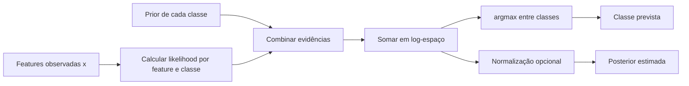
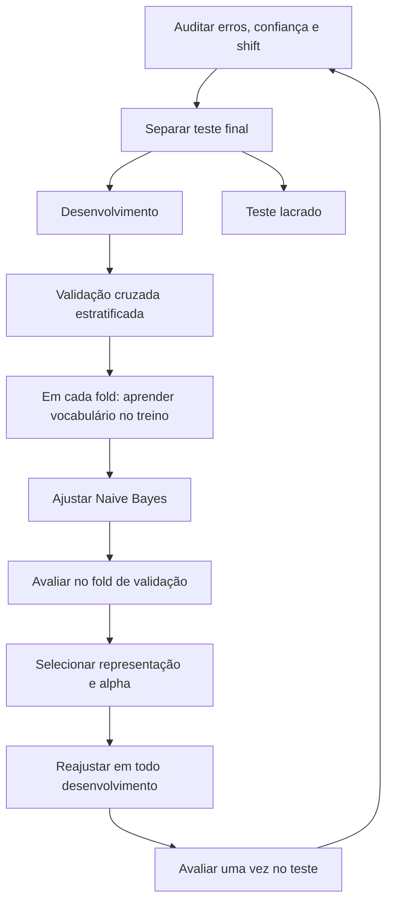

<!-- mirandastech-aula-v2 -->

# Aula 08 — Naive Bayes: probabilidade condicional aplicada à classificação

[](https://colab.research.google.com/github/joaopaulomirandamatias/ai-lab/blob/main/03-machine-learning/notebooks/08-naive-bayes-probabilidade-condicional-laboratorio.ipynb)

Na [Aula 07](07-knn-distancias-dimensionalidade.md), classificamos uma consulta procurando exemplos próximos. Naive Bayes segue outro caminho: aprende, para cada classe, como as features costumam se distribuir e pergunta **qual classe tornaria a observação recebida mais provável?**

É um modelo simples, rápido e especialmente importante para compreender classificação probabilística, texto e modelos generativos. Sua hipótese central — independência condicional entre features — quase nunca é literalmente verdadeira. Mesmo assim, a ordenação dos scores pode ser útil. O cuidado é não confundir uma boa decisão de classe com uma probabilidade confiável.

---

## Problema motivador

Um sistema recebe milhares de mensagens e deve encaminhá-las para duas filas: normal ou suspeita. As palavras “grátis”, “prêmio” e “urgente” aparecem com maior frequência nas suspeitas; “reunião”, “projeto” e “relatório” aparecem mais nas normais.

Poderíamos memorizar mensagens parecidas com KNN, mas a busca ficaria cara à medida que o histórico crescesse. Naive Bayes resume o treino em:

- frequência de cada classe;
- estatísticas de cada feature dentro de cada classe.

Na predição, combina essas evidências. O ganho de velocidade vem acompanhado de uma suposição forte: conhecendo a classe, cada feature é tratada como independente das demais.

## Objetivos

Ao final, você deverá ser capaz de:

1. derivar a regra de decisão a partir do teorema de Bayes;
2. explicar prior, likelihood, evidência, posterior e score;
3. interpretar a hipótese de independência condicional;
4. calcular Multinomial Naive Bayes manualmente;
5. aplicar suavização de Laplace ou Lidstone;
6. usar log-probabilidades para evitar underflow;
7. escolher entre Gaussian, Multinomial, Bernoulli e Categorical NB;
8. treinar um classificador de texto sem vazamento de vocabulário;
9. distinguir qualidade de classificação de calibração probabilística.

### Pré-requisitos

- probabilidade conjunta, marginal e condicional;
- teorema de Bayes, likelihood e MAP;
- classificação e divisão treino–validação–teste;
- contagens, logaritmos e vetores esparsos;
- pipelines e validação cruzada.

## Vocabulário

| Termo | Significado |
|---|---|
| prior | crença sobre a classe antes de observar as features, \(P(Y=c)\) |
| likelihood | compatibilidade das features com uma classe, \(P(\mathbf{x}\mid Y=c)\) |
| evidência | probabilidade marginal das features, \(P(\mathbf{x})\) |
| posterior | probabilidade da classe após observar as features, \(P(Y=c\mid\mathbf{x})\) |
| independência condicional | features independentes entre si quando a classe é conhecida |
| suavização | pseudocontagem que evita probabilidades exatamente zero |
| score conjunto | log-prior somado às log-likelihoods; basta para comparar classes |
| modelo generativo | modela a distribuição dos dados condicionada à classe e o prior |

---

## 1. Do teorema de Bayes ao classificador

Para uma classe \(c\) e uma observação \(\mathbf{x}=(x_1,\ldots,x_d)\), Bayes afirma:

\[
P(Y=c\mid\mathbf{x})=
\frac{P(\mathbf{x}\mid Y=c)P(Y=c)}{P(\mathbf{x})}.
\]

- \(P(Y=c)\) é o prior;
- \(P(\mathbf{x}\mid Y=c)\) é a likelihood;
- \(P(\mathbf{x})\) normaliza as classes;
- \(P(Y=c\mid\mathbf{x})\) é a posterior.

Para escolher a classe, o denominador é igual para todas as alternativas. Podemos omiti-lo no `argmax`:

\[
\widehat y=\arg\max_c P(Y=c)P(\mathbf{x}\mid Y=c).
\]

Ainda resta estimar uma distribuição conjunta em `d` dimensões, tarefa difícil com poucos dados. Entra então a hipótese *naive*:

\[
P(\mathbf{x}\mid Y=c)=\prod_{j=1}^{d}P(x_j\mid Y=c).
\]

A regra se torna

\[
\widehat y=\arg\max_c P(Y=c)
\prod_{j=1}^{d}P(x_j\mid Y=c).
\]



O modelo é **generativo** porque especifica \(P(\mathbf{x}\mid Y)\) e \(P(Y)\). Ele poderia, em princípio, gerar features após escolher uma classe. A regressão logística da Aula 06 é discriminativa: modela diretamente \(P(Y\mid\mathbf{x})\).

## 2. O que significa independência condicional?

A hipótese correta não é “as features são independentes”. É:

\[
P(x_i\mid Y,c,x_j)=P(x_i\mid Y=c),\quad i\neq j.
\]

Depois de conhecer a classe, observar uma feature não deveria alterar a distribuição de outra. Em texto, isso implicaria que a presença de “machine” não altera a chance de “learning” quando a classe já é conhecida — claramente uma aproximação.

Por que o classificador ainda pode funcionar?

- classificação depende da ordem relativa dos scores, não de reconstruir perfeitamente o mundo;
- muitos sinais individuais apontam na direção correta;
- a fatoração reduz drasticamente o número de parâmetros;
- estimativas simples podem ter menor variância quando os dados são limitados.

Isso não autoriza ignorar a hipótese. Features redundantes podem contar a mesma evidência várias vezes e produzir posteriores extremas.

### Exemplo de evidência duplicada

Se uma feature “contém oferta” for copiada para outra coluna idêntica, o sistema não recebeu informação nova. Naive Bayes, porém, multiplica as duas likelihoods como se fossem evidências independentes. A classe pode permanecer igual, enquanto `predict_proba` se aproxima artificialmente de 0 ou 1.

---

## 3. Trabalhando em log-espaço

Um documento pode conter centenas de tokens com probabilidades menores que 1. Multiplicar muitos números pequenos causa **underflow**: o computador arredonda o resultado para zero.

Aplicando logaritmo:

\[
g_c(\mathbf{x})=log P(Y=c)+
\sum_{j=1}^{d}\log P(x_j\mid Y=c).
\]

Como o logaritmo é crescente,

\[
\widehat y=\arg\max_c g_c(\mathbf{x}).
\]

Produtos viram somas, e a decisão não muda. Para transformar scores em posterior normalizada, usa-se uma forma estável de *log-sum-exp*:

\[
\log P(Y=c\mid\mathbf{x})=
g_c-\log\sum_r e^{g_r}.
\]

Subtrair o maior score antes de exponenciar evita overflow. Implementações maduras fazem isso internamente; entender o mecanismo ajuda a detectar cálculos manuais frágeis.

## 4. Multinomial Naive Bayes

No modelo multinomial, \(x_j\ge 0\) representa a contagem do termo `j`. Para cada classe `c`, estimamos

\[
\widehat\theta_{cj}=
\frac{N_{cj}+\alpha}{N_c+\alpha V},
\]

onde:

- \(N_{cj}\) é o total de ocorrências do termo `j` em documentos da classe `c`;
- \(N_c=\sum_j N_{cj}\) é o total de tokens da classe;
- `V` é o tamanho do vocabulário;
- \(\alpha\ge0\) controla a suavização.

`alpha=1` é a suavização de Laplace; valores entre 0 e 1 são frequentemente chamados de Lidstone.

### Por que suavizar?

Sem suavização, se “grátis” nunca apareceu na classe normal, então

\[
P(\text{grátis}\mid\text{normal})=0.
\]

O produto completo da classe normal se torna zero, independentemente das outras palavras. Uma amostra finita não justifica certeza absoluta. A pseudocontagem mantém suporte para termos raros e controla a intensidade das estimativas.

### Exemplo resolvido passo a passo

Considere seis documentos: três suspeitos e três normais. Após contar tokens:

| Classe | `grátis` | `urgente` | total de tokens \(N_c\) |
|---|---:|---:|---:|
| normal | 0 | 0 | 9 |
| suspeita | 2 | 2 | 9 |

Suponha vocabulário com `V=11`, `alpha=1` e priors iguais a 0,5. Para a consulta “grátis urgente”:

\[
P(\text{grátis}\mid\text{normal})=
P(\text{urgente}\mid\text{normal})=\frac{1}{9+11}=0{,}05,
\]

\[
P(\text{grátis}\mid\text{suspeita})=
P(\text{urgente}\mid\text{suspeita})=\frac{3}{20}=0{,}15.
\]

Scores não normalizados:

\[
s_{normal}=0{,}5\times0{,}05^2=0{,}00125,
\]

\[
s_{suspeita}=0{,}5\times0{,}15^2=0{,}01125.
\]

A soma é 0,0125. Normalizando:

\[
P(\text{suspeita}\mid\mathbf{x})=
\frac{0{,}01125}{0{,}0125}=0{,}9.
\]

O laboratório confirma o valor `0,9` tanto no cálculo manual quanto no scikit-learn.

---

## 5. Variantes e hipóteses

As variantes diferem principalmente na forma de \(P(x_j\mid Y=c)\).

| Variante | Tipo de feature | Modelo condicional | Exemplo |
|---|---|---|---|
| `GaussianNB` | contínua | normal por feature e classe | sensores, medidas físicas |
| `MultinomialNB` | contagem ou valor não negativo | frequência de eventos | contagem de palavras |
| `BernoulliNB` | binária | presença e ausência | termo apareceu ou não |
| `CategoricalNB` | categoria discreta | distribuição categórica por feature | canal, região, dispositivo |
| `ComplementNB` | contagens não negativas | estatísticas do complemento da classe | texto com classes desbalanceadas |

### Gaussian Naive Bayes

Para feature contínua `j`, assume-se

\[
P(x_j\mid Y=c)=
\frac{1}{\sqrt{2\pi\sigma_{cj}^2}}
\exp\left[-\frac{(x_j-\mu_{cj})^2}{2\sigma_{cj}^2}\right].
\]

O treino estima uma média \(\mu_{cj}\) e uma variância \(\sigma_{cj}^2\) para cada par classe–feature. O modelo não exige que a distribuição marginal de toda a base seja normal; exige normalidade condicional por classe e feature, além da fatoração independente.

### Bernoulli versus Multinomial

Bernoulli usa ocorrência binária. Ele considera tanto presença quanto ausência:

\[
P(x_j\mid c)=p_{cj}^{x_j}(1-p_{cj})^{1-x_j}.
\]

Multinomial usa repetição. “grátis grátis grátis” exerce mais peso que “grátis”. A escolha depende do evento que representa o documento, não apenas do nome do algoritmo. Compare as alternativas dentro do mesmo protocolo.

### TF-IDF com Multinomial NB

O modelo multinomial nasce para contagens. Vetores TF-IDF não são contagens inteiras, mas são não negativos e podem funcionar bem empiricamente. Isso deve ser tratado como uma alternativa experimental, não como consequência exata do modelo probabilístico. Ajuste vocabulário, IDF e classificador dentro de cada fold.

## 6. Priors e mudança de prevalência

O prior usual é a frequência da classe no treino:

\[
\widehat P(Y=c)=\frac{n_c}{n}.
\]

Se 2% das mensagens de treino são suspeitas, o prior aprendido refletirá aproximadamente 2%. Isso pode ser inadequado quando:

- a amostra foi balanceada artificialmente;
- a prevalência em produção mudou;
- o custo do erro exige uma política de decisão diferente.

Não “corrija” o prior consultando o teste. Use conhecimento externo justificável ou estimação em dados de desenvolvimento representativos. E não misture prior com limiar: um altera o modelo probabilístico; o outro traduz scores em ação, assunto aprofundado na Aula 15.

---

## 7. Classificação não é calibração

Um classificador pode ordenar corretamente as classes mesmo quando suas probabilidades são ruins. Naive Bayes frequentemente produz valores extremos porque evidências correlacionadas são contadas como independentes.

Considere dois sistemas que acertam as mesmas 95 mensagens em 100:

- o primeiro atribui 0,75 à classe prevista;
- o segundo atribui 0,999.

Ambos têm a mesma acurácia, mas os cinco erros do segundo recebem penalidade muito maior na log-loss. Em decisões de alto risco, uma saída `0,99` precisa ter interpretação empírica: entre casos semelhantes, aproximadamente 99% deveriam pertencer à classe.

Use:

- macro-F1 ou métricas de decisão para comparar rótulos;
- log-loss e Brier para avaliar previsões probabilísticas;
- diagrama de confiabilidade para comparar probabilidade média e frequência observada.

Essas medidas misturam aspectos diferentes e exigem amostra suficiente. A calibração será aprofundada na Aula 15. Aqui, a regra é simples: `predict_proba` não recebe confiança automática só porque soma 1.

## 8. Pipeline correto para texto

O vocabulário também é aprendido. Se `CountVectorizer` ou `TfidfVectorizer` for ajustado antes da validação, os folds de treino descobrem quais termos existem nos folds de validação. Mesmo sem usar rótulos, isso contamina a representação estimada.



Exemplo:

```python
from sklearn.feature_extraction.text import CountVectorizer
from sklearn.model_selection import GridSearchCV, StratifiedKFold
from sklearn.naive_bayes import MultinomialNB
from sklearn.pipeline import Pipeline

pipeline = Pipeline([
    ("vectorizer", CountVectorizer()),
    ("nb", MultinomialNB()),
])

cv = StratifiedKFold(n_splits=5, shuffle=True, random_state=20260908)
search = GridSearchCV(
    pipeline,
    param_grid={"nb__alpha": [0.1, 0.5, 1.0, 2.0]},
    scoring="f1_macro",
    cv=cv,
)
search.fit(text_dev, y_dev)
```

O conjunto `text_test` não participa da busca.

## 9. Laboratório reproduzível

O [notebook da aula](../notebooks/08-naive-bayes-probabilidade-condicional-laboratorio.ipynb) usa um corpus sintético controlado e executa:

1. contagem manual por classe;
2. cálculo da posterior para “grátis urgente”;
3. comparação exata com `MultinomialNB`;
4. demonstração de probabilidade zero e underflow;
5. geração de 1.200 mensagens com sobreposição documentada;
6. reserva de 25% para teste;
7. comparação de contagem, presença binária e TF-IDF;
8. seleção de `alpha` por cinco folds estratificados;
9. avaliação final contra baseline majoritária;
10. inspeção dos termos associados às classes e dos erros mais confiantes;
11. duplicação deliberada de features correlacionadas;
12. diagrama de confiabilidade;
13. verificação manual do Gaussian NB.

Dependências mínimas: Python 3.10, NumPy 1.24, pandas 1.5, Matplotlib 3.7, SciPy 1.10 e scikit-learn 1.3. A semente é `20260908`; não há rede ou credenciais. O teste é aberto apenas após a seleção.

## 10. Conexões com IA e sistemas reais

- **Classificação de texto:** spam, triagem, intenção e roteamento recebem um baseline rápido e auditável.
- **Aprendizado incremental:** variantes do scikit-learn oferecem `partial_fit`, útil quando dados chegam em lotes; monitore mudança de distribuição.
- **IA generativa:** a decomposição prior × likelihood prepara a leitura de modelos probabilísticos mais complexos.
- **RAG e agentes:** classificadores leves podem rotear consultas ou sinalizar risco antes de chamar componentes caros, mas não substituem políticas externas.
- **Auditoria:** contagens, priors e log-likelihoods podem ser versionados e inspecionados; ainda assim, termos associados podem revelar vieses do corpus.

O modelo não “entende” o sentido de uma palavra. Ele aprende associação estatística na representação disponível. Uma mudança de idioma, campanha ou domínio pode invalidar as frequências.

---

## 11. Armadilhas comuns

| Erro | Consequência | Correção |
|---|---|---|
| interpretar independência como verdade causal | explicação incorreta | tratá-la como hipótese operacional |
| ajustar vetorizador antes dos folds | vazamento de vocabulário e IDF | colocar representação no pipeline |
| omitir suavização | um termo raro zera toda a classe | validar `alpha > 0` |
| multiplicar probabilidades diretamente | underflow | usar log-probabilidades |
| usar Gaussian NB sem examinar distribuição condicional | likelihood inadequada | inspecionar por classe e comparar baseline |
| usar valores negativos no Multinomial NB | violação do suporte | escolher representação não negativa |
| duplicar features correlacionadas | confiança excessiva | remover redundância e avaliar calibração |
| selecionar `alpha` no teste | resultado otimista | CV apenas em desenvolvimento |
| tratar top tokens como causa | interpretação indevida | comunicar associação e contexto |
| ignorar prevalência em produção | prior desatualizado | monitorar shift e revisar protocolo |

## 12. Checklist prático

- [ ] A variante combina com o tipo de feature?
- [ ] A unidade de análise está definida?
- [ ] Priors refletem o cenário de uso ou têm justificativa externa?
- [ ] Vocabulário e IDF são ajustados dentro de cada fold?
- [ ] Há suavização e o valor de `alpha` foi validado?
- [ ] Os cálculos usam log-espaço?
- [ ] O teste permaneceu lacrado durante a seleção?
- [ ] Existe baseline simples?
- [ ] Métricas de decisão e probabilísticas foram separadas?
- [ ] Features redundantes e erros confiantes foram auditados?
- [ ] O comportamento com tokens desconhecidos foi verificado?
- [ ] Versões, seed e configuração foram registrados?

## 13. Resumo

- Naive Bayes combina prior e likelihood pelo teorema de Bayes.
- A hipótese *naive* fatora a likelihood em distribuições univariadas condicionais.
- O denominador da posterior pode ser omitido ao escolher a classe.
- Log-probabilidades evitam underflow sem mudar o `argmax`.
- Suavização impede que ausência no treino vire impossibilidade absoluta.
- Multinomial modela contagens; Bernoulli, presença/ausência; Gaussian, features contínuas; Categorical, categorias.
- Vetorização e hiperparâmetros devem ser ajustados dentro dos folds.
- Features correlacionadas podem manter a classificação e degradar a confiança.
- Boa acurácia não implica posterior calibrada.

---

## 14. Exercícios com respostas comentadas

### Exercício 1 — retirando o denominador

Por que \(P(\mathbf{x})\) pode ser omitido ao escolher a classe, mas é necessário para obter uma posterior normalizada?

<details>
<summary>Resposta comentada</summary>

Para uma consulta fixa, \(P(\mathbf{x})\) é igual em todas as classes e não altera o `argmax`. Para produzir probabilidades que somem 1, é preciso dividir cada score pela soma dos scores, equivalente à evidência.

</details>

### Exercício 2 — suavização

Uma classe contém 20 tokens, o vocabulário tem 10 termos e o termo `x` apareceu duas vezes. Calcule \(P(x\mid c)\) com `alpha=1`.

<details>
<summary>Resposta comentada</summary>

\[
P(x\mid c)=\frac{2+1}{20+1\times10}=\frac3{30}=0{,}1.
\]

A pseudocontagem entra no numerador, e `alpha × V` entra no denominador.

</details>

### Exercício 3 — Bernoulli ou Multinomial

Para mensagens muito curtas, importa principalmente se um termo ocorreu; repetição acidental não deve aumentar evidência. Qual variante é mais natural?

<details>
<summary>Resposta comentada</summary>

Bernoulli NB, com representação binária. Ele modela presença e ausência. A escolha ainda deve ser comparada fora da amostra com Multinomial NB.

</details>

### Exercício 4 — independência

Duplicar uma coluna informativa mantém o conteúdo disponível, mas pode alterar `predict_proba`. Explique.

<details>
<summary>Resposta comentada</summary>

As colunas são perfeitamente dependentes. A fatoração naive multiplica suas likelihoods como duas evidências, contando o mesmo sinal novamente. A classe pode não mudar, enquanto a posterior se torna mais extrema.

</details>

### Exercício 5 — vazamento

Um analista ajusta `TfidfVectorizer` em todos os documentos e depois faz validação cruzada. Onde está o problema?

<details>
<summary>Resposta comentada</summary>

O vocabulário e o IDF dos folds de treino incorporam a existência e frequência dos documentos de validação. O vetorizador deve ficar no pipeline e ser reajustado dentro de cada fold.

</details>

### Exercício 6 — decisão e probabilidade

Dois modelos têm a mesma macro-F1. O primeiro tem log-loss 0,18 e o segundo 0,70. O que é possível concluir?

<details>
<summary>Resposta comentada</summary>

As decisões agregadas podem ser equivalentes, mas o primeiro recebeu menor penalidade probabilística nesse conjunto. Isso não prova calibração isoladamente, pois log-loss combina discriminação e qualidade probabilística; examine também diagrama de confiabilidade e incerteza amostral.

</details>

### Exercício 7 — Gaussian NB

Uma feature é fortemente assimétrica dentro de cada classe. O nome `GaussianNB` garante validade?

<details>
<summary>Resposta comentada</summary>

Não. O modelo assume likelihood gaussiana por classe e feature. Compare diagnóstico, transformação justificada e alternativas no mesmo protocolo; uma boa métrica não transforma a hipótese em descrição verdadeira.

</details>

---

## Referências

### Fontes técnicas

- Domingos, P.; Pazzani, M. **On the Optimality of the Simple Bayesian Classifier under Zero-One Loss**. *Machine Learning*, 1997. [DOI 10.1023/A:1007413511361](https://doi.org/10.1023/A:1007413511361).
- McCallum, A.; Nigam, K. **A Comparison of Event Models for Naive Bayes Text Classification**. AAAI/ICML Workshop, 1998. [Artigo](https://cdn.aaai.org/Workshops/1998/WS-98-05/WS98-05-007.pdf).
- Manning, C.; Raghavan, P.; Schütze, H. **Introduction to Information Retrieval — Naive Bayes text classification**. Cambridge University Press, 2008. [Livro aberto](https://nlp.stanford.edu/IR-book/html/htmledition/naive-bayes-text-classification-1.html).
- scikit-learn. **Naive Bayes**. Documentação oficial, consultada em 8 set. 2026. [Acesso](https://scikit-learn.org/stable/modules/naive_bayes.html).
- scikit-learn. **Probability calibration**. Documentação oficial, consultada em 8 set. 2026. [Acesso](https://scikit-learn.org/stable/modules/calibration.html).

### Material complementar

- Murphy, K. P. **Probabilistic Machine Learning: An Introduction**. MIT Press, 2022. [Página oficial e versão aberta](https://probml.github.io/pml-book/book1.html).

## Próxima aula

Naive Bayes combina evidências por uma fatoração probabilística fixa. Na [Aula 09 — Árvores de decisão](09-arvores-decisao.md), aprenderemos partições recursivas do tipo \(x_j<t\), veremos como impureza guia cada corte e por que profundidade controla complexidade.
