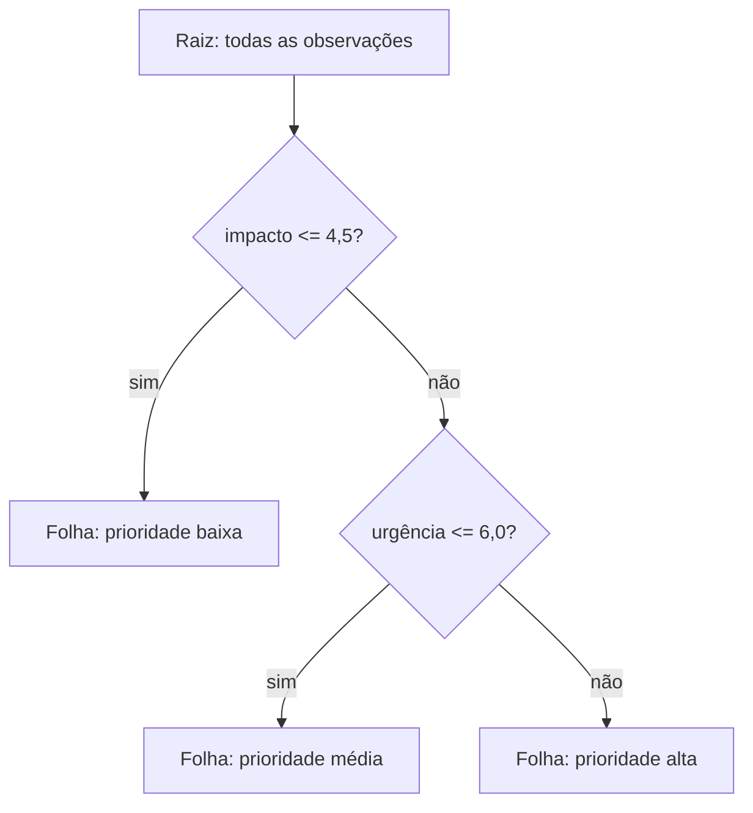

<!-- mirandastech-aula-v2 -->

# Aula 09 — Árvores de decisão: partições, impureza e interpretabilidade

[](https://colab.research.google.com/github/joaopaulomirandamatias/ai-lab/blob/main/03-machine-learning/notebooks/09-arvores-decisao-laboratorio.ipynb)

Na [Aula 08](08-naive-bayes-probabilidade-condicional.md), classificamos observações combinando evidências probabilísticas sob uma hipótese forte de independência condicional. Agora construiremos decisões por outro princípio: dividir recursivamente o espaço de features em regiões e atribuir uma previsão a cada região.

Árvores conseguem representar interações e relações não lineares sem exigir uma fórmula global. Essa flexibilidade, porém, cobra um preço: uma árvore profunda pode memorizar ruído, e uma pequena mudança na amostra pode alterar sua estrutura. O objetivo desta aula é entender tanto o mecanismo quanto os limites de sua aparente interpretabilidade.

---

## Problema motivador

Uma equipe precisa priorizar solicitações técnicas. Há duas features disponíveis no instante da decisão: impacto estimado e urgência. A regra real não é simplesmente “quanto maior, melhor”: um caso deve ser priorizado quando o impacto é muito alto **ou** quando impacto e urgência são simultaneamente moderados. Um modelo linear teria dificuldade para representar essas regiões sem engenharia de features.

Uma árvore pode aprender regras como:

1. se `impacto > 8`, encaminhar para prioridade alta;
2. caso contrário, se `urgencia > 6` e `impacto > 4`, também priorizar;
3. nos demais casos, manter a fila normal.

Essas regras são auditáveis, rápidas na inferência e capazes de capturar interações. Mas continuam sendo associações aprendidas dos dados — não políticas causais nem verdades de negócio.

## Objetivos

Ao final, você deverá ser capaz de:

1. interpretar raiz, nós internos, ramos, folhas e profundidade;
2. explicar árvores como partições recursivas e modelos constantes por região;
3. calcular Gini, entropia e ganho ponderado de um split;
4. relacionar profundidade e tamanho de folha ao viés e à variância;
5. aplicar pré-poda e poda por custo-complexidade;
6. selecionar hiperparâmetros sem consultar o conjunto de teste;
7. auditar regras, probabilidades nas folhas e estabilidade estrutural;
8. reconhecer limites de extrapolação, importância por impureza e interpretação causal.

### Pré-requisitos

- classificação, regressão e generalização;
- probabilidade de classe, entropia e média;
- divisão treino–validação–teste e validação cruzada;
- overfitting, viés e variância;
- pipelines e prevenção de data leakage.

## Vocabulário

| Termo | Significado |
|---|---|
| raiz | primeiro nó, que recebe toda a amostra de treino |
| nó interno | região que ainda será dividida por uma regra |
| split | regra `feature <= limiar` que cria dois filhos |
| ramo | caminho produzido por uma condição verdadeira ou falsa |
| folha | região terminal que emite a previsão |
| profundidade | número de splits entre a raiz e um nó |
| impureza | medida da mistura de classes ou dispersão do target em um nó |
| ganho | redução ponderada de impureza obtida por um split |
| pré-poda | impedir crescimento usando restrições como `max_depth` |
| pós-poda | crescer a árvore e remover ramos por um critério de complexidade |
| instabilidade | mudança relevante da árvore diante de pequenas mudanças na amostra |

---

## 1. Intuição: recortar o espaço de features

Considere duas features, \(x_1\) e \(x_2\). Uma regra \(x_1 \leq 4{,}5\) traça uma linha vertical e separa o espaço em duas regiões. Em cada lado, uma nova regra pode fazer outro corte. Depois de vários passos, surgem retângulos alinhados aos eixos.

Cada observação percorre um único caminho da raiz até uma folha. Em classificação, a folha armazena a distribuição das classes entre as observações de treino que chegaram ali. Em regressão com erro quadrático, normalmente armazena a média do target.



A árvore é, portanto, uma função constante por partes. Ela não aprende uma reta ou curva suave; aprende regiões com previsões constantes. Isso explica sua flexibilidade e também sua dificuldade de extrapolar.

### Anatomia e shapes

O treino recebe:

- \(X\in\mathbb{R}^{n\times d}\): \(n\) observações e \(d\) features;
- \(y\in\{0,\ldots,K-1\}^{n}\) em classificação;
- \(y\in\mathbb{R}^{n}\) em regressão.

Uma regra candidata é \(\theta=(j,t)\), composta pela feature \(j\) e pelo limiar \(t\). Para o conjunto \(S\) de um nó:

\[
S_L(\theta)=\{(\mathbf{x},y)\in S:x_j\leq t\},\qquad
S_R(\theta)=S\setminus S_L(\theta).
\]

O CART, algoritmo usado pelo `DecisionTreeClassifier` do scikit-learn, constrói árvores binárias: cada split tem exatamente dois filhos.

## 2. Como escolher um split

Queremos filhos mais homogêneos que o pai. Para uma medida de impureza \(I\), a impureza após o corte é a média ponderada:

\[
I_{\text{filhos}}(S,\theta)=
\frac{|S_L|}{|S|}I(S_L)+
\frac{|S_R|}{|S|}I(S_R).
\]

O ganho é:

\[
\operatorname{Gain}(S,\theta)=I(S)-I_{\text{filhos}}(S,\theta).
\]

- \(|S|\) é o número de observações no nó pai;
- \(|S_L|\) e \(|S_R|\) são os tamanhos dos filhos;
- o peso impede que um filho minúsculo e puro pareça artificialmente excelente.

O algoritmo examina features e limiares candidatos e escolhe, naquele nó, o maior ganho. A decisão é **gulosa e local**: não há garantia de que a sequência resulte na menor ou melhor árvore global.

## 3. Impureza em classificação

Se \(p_k\) é a proporção da classe \(k\) em um nó, duas medidas comuns são:

### Índice de Gini

\[
Gini(S)=1-\sum_{k=1}^{K}p_k^2
=\sum_{k=1}^{K}p_k(1-p_k).
\]

Gini vale zero em uma folha pura. Para duas classes igualmente frequentes, vale \(0{,}5\), seu máximo no caso binário.

### Entropia

\[
H(S)=-\sum_{k=1}^{K}p_k\log_2 p_k,
\]

com a convenção \(0\log 0=0\). Em duas classes, a entropia varia de zero a um bit. Ela mede a incerteza sobre o rótulo de uma observação sorteada no nó.

| Critério | Folha pura | Máximo binário | Observação |
|---|---:|---:|---|
| Gini | 0 | 0,5 | padrão frequente; cálculo simples |
| Entropia | 0 | 1 bit | conecta árvores à teoria da informação |
| Erro de classificação | 0 | 0,5 | pouco sensível para escolher splits; útil como noção de erro |

Gini e entropia frequentemente escolhem árvores parecidas, mas não são idênticos. O critério é um hiperparâmetro; não se deve declarar um vencedor universal.

### Exemplo resolvido: ganho de Gini

Um nó pai contém seis positivos e quatro negativos:

\[
Gini_{pai}=1-0{,}6^2-0{,}4^2=0{,}48.
\]

Um split produz:

- esquerda: quatro positivos e nenhum negativo, logo \(Gini_L=0\);
- direita: dois positivos e quatro negativos, logo

\[
Gini_R=1-\left(\frac{2}{6}\right)^2-
\left(\frac{4}{6}\right)^2=\frac{4}{9}\approx0{,}4444.
\]

A impureza ponderada é:

\[
I_{filhos}=\frac{4}{10}(0)+\frac{6}{10}\left(\frac{4}{9}\right)
=0{,}2667.
\]

Portanto:

\[
Gain=0{,}48-0{,}2667=0{,}2133.
\]

O cálculo compara splits no treino; ele não prova que a árvore completa generalizará.

## 4. Probabilidades nas folhas

Se uma folha recebe 30 observações da classe 0 e 70 da classe 1, a estimativa empírica é:

\[
\widehat P(Y=1\mid \mathbf{x}\text{ cai na folha})=\frac{70}{100}=0{,}7.
\]

Todos os pontos na região recebem a mesma probabilidade. Uma folha com uma única observação produz probabilidade 0 ou 1, frequentemente confiante demais. `min_samples_leaf` regulariza não apenas a geometria, mas também a granularidade dessas estimativas.

Probabilidade de folha não é automaticamente calibrada. Calibração será aprofundada na Aula 15; aqui, trate folhas pequenas como sinal de incerteza estrutural.

## 5. Árvores de regressão

Para target contínuo e critério de erro quadrático, um nó prevê a média:

\[
\bar y_S=\frac{1}{|S|}\sum_{i\in S}y_i,
\]

e sua impureza pode ser escrita como:

\[
MSE(S)=\frac{1}{|S|}\sum_{i\in S}(y_i-\bar y_S)^2.
\]

O split procura reduzir a soma ponderada desses erros. O resultado é uma função em degraus. Fora do intervalo observado, a árvore tende a repetir o valor de uma folha extrema; ela não continua uma tendência. Em problemas que exigem extrapolação, isso é uma limitação decisiva.

## 6. Crescimento, overfitting e viés–variância

Uma árvore sem restrições pode continuar dividindo até obter folhas muito pequenas. No treino, o erro cai; fora da amostra, a variância cresce porque regras passam a reagir a acidentes específicos daquela amostra.

| Controle | Efeito principal | Risco quando restritivo demais |
|---|---|---|
| `max_depth` | limita número de decisões por caminho | underfitting de interações profundas |
| `min_samples_split` | exige amostras para tentar dividir um nó | mantém nós heterogêneos |
| `min_samples_leaf` | garante suporte mínimo em cada folha | suaviza demais regiões legítimas |
| `max_leaf_nodes` | limita diretamente o número de regiões | representação grosseira |
| `min_impurity_decrease` | aceita apenas ganhos mínimos | ignora melhorias pequenas, porém reais |
| `ccp_alpha` | poda ramos pelo custo-complexidade | árvore excessivamente curta |

Esses mecanismos regularizam a estrutura. Seus valores devem ser escolhidos na validação, nunca procurando o melhor resultado no teste.


### Pré-poda e pós-poda

Pré-poda impede o crescimento quando uma condição é atingida. Pós-poda começa com uma árvore maior e remove subárvores cuja melhoria não compensa a complexidade.

Na poda por custo-complexidade, escolhe-se a árvore \(T\) que minimiza:

\[
R_\alpha(T)=R(T)+\alpha|\widetilde T|.
\]

- \(R(T)\) é o risco empírico ponderado nas folhas;
- \(|\widetilde T|\) é o número de folhas;
- \(\alpha\geq0\) penaliza complexidade.

Com \(\alpha=0\), não há penalidade adicional. À medida que \(\alpha\) cresce, ramos precisam justificar sua existência por uma redução maior do risco. No scikit-learn, esse parâmetro é `ccp_alpha`.

## 7. Um protocolo experimental honesto

Uma avaliação defensável segue esta ordem:

1. defina unidade de análise, target e instante de predição;
2. separe o teste de acordo com a estrutura real — aleatório, temporal ou por grupo;
3. mantenha o teste lacrado;
4. compare com um baseline simples;
5. selecione `max_depth`, `min_samples_leaf` e `ccp_alpha` nos folds de desenvolvimento;
6. examine média e dispersão, não apenas o melhor fold;
7. reajuste a configuração escolhida em todo o desenvolvimento;
8. avalie uma vez no teste e registre a decisão.

Árvores geralmente não precisam de padronização: uma transformação estritamente crescente preserva a ordem dos valores e, portanto, os candidatos a partição. Isso não as torna imunes a preprocessing nem leakage. Imputação, codificação categórica e seleção de features ainda precisam aprender somente no treino de cada fold.

O `DecisionTreeClassifier` do scikit-learn não aceita categorias nominais de forma nativa. Converter categorias sem ordem em inteiros pode criar cortes artificiais como `cidade <= 3`. Use uma representação apropriada dentro do pipeline e avalie o custo de alta cardinalidade.

## 8. Interpretabilidade com limites

Uma árvore pequena permite seguir o caminho de uma observação e produzir uma explicação local fiel ao próprio modelo. Isso é útil para depuração e auditoria. Ainda assim, quatro cautelas são essenciais.

### Regra preditiva não é regra causal

Se a raiz divide por idade, isso significa que o corte reduziu impureza naquela amostra. Não significa que alterar idade causaria a previsão desejada, nem que a feature deva virar uma política operacional.

### Estabilidade faz parte da explicação

Duas features correlacionadas podem oferecer ganhos quase iguais. Uma pequena mudança nos dados faz uma ocupar a raiz e a outra desaparecer. Uma explicação não é robusta apenas porque cabe em um diagrama.

### Importância por impureza pode enviesar

`feature_importances_` soma reduções de impureza atribuídas a cada feature. Features contínuas ou de alta cardinalidade oferecem muitos candidatos de corte e podem receber importância exagerada. A Aula 20 tratará métodos de interpretação e avaliação fora da amostra.

### Visualização não elimina complexidade

Uma árvore com milhares de nós é tecnicamente transparente, mas cognitivamente opaca. Interpretabilidade envolve tamanho, estabilidade, dados de referência e finalidade da explicação.

## 9. Instabilidade: um exemplo conceitual

Suponha que `impacto` e `perda_estimada` sejam fortemente correlacionados. Na amostra A, o maior ganho da raiz vem de `impacto <= 4,8`; na amostra bootstrap B, vem de `perda_estimada <= 910`. As duas árvores podem ter desempenho semelhante, embora contem histórias diferentes.

Isso caracteriza alta variância estrutural. Regularização pode reduzir, mas não eliminar, o fenômeno. Na [Aula 10](10-random-forest-bagging.md), veremos como agregar árvores treinadas em amostras e subconjuntos de features reduz a variância preditiva. Nesta aula, basta diagnosticar a árvore individual.

## 10. Laboratório reproduzível

O notebook usa dados sintéticos bidimensionais para tornar as fronteiras visíveis. O protocolo:

1. reserva o teste antes de qualquer seleção;
2. confirma manualmente o ganho de Gini;
3. compara profundidades nos mesmos folds estratificados;
4. seleciona regularização por validação cruzada;
5. inspeciona regras e fronteiras;
6. mede a estabilidade do split raiz com bootstrap apenas no desenvolvimento;
7. confirma invariância a uma mudança positiva de escala;
8. abre o teste uma única vez.

Dependências mínimas:

```text
numpy>=1.26
pandas>=2.2
matplotlib>=3.8
scikit-learn>=1.4
```

O conjunto é gerado com seed fixa `20260908`; não depende de rede, arquivos externos ou credenciais. As células possuem `asserts` para confirmar propriedades metodológicas e resultados centrais.

### Código mínimo

```python
from sklearn.tree import DecisionTreeClassifier

tree = DecisionTreeClassifier(
    max_depth=4,
    min_samples_leaf=10,
    ccp_alpha=0.001,
    random_state=20260908,
)
tree.fit(X_dev, y_dev)
```

Esse bloco é apenas o ajuste. A evidência vem da seleção nos folds, da comparação com baseline, da avaliação reservada e da auditoria de estabilidade.

## 11. Armadilhas e erros comuns

- **Deixar crescer e reportar treino.** Pureza no treino pode ser memorização.
- **Escolher profundidade no teste.** Isso transforma o teste em validação e otimiza o relatório.
- **Usar uma árvore enorme como explicação.** Fidelidade formal não implica compreensão humana.
- **Interpretar split como causal.** O algoritmo encontra associação preditiva.
- **Confiar cegamente em `feature_importances_`.** Muitos limiares e correlações distorcem a atribuição.
- **Codificar categoria nominal como número ordinal.** O limiar passa a representar uma ordem inexistente.
- **Afirmar que árvore dispensa pipeline.** Features podem exigir imputação, encoding e seleção sem vazamento.
- **Ignorar folhas pequenas.** Elas geram previsões frágeis e probabilidades extremas.
- **Esperar extrapolação.** Previsões constantes por região não prolongam tendências.
- **Fixar a seed e chamar isso de estabilidade.** Reprodutibilidade repete a execução; estabilidade testa perturbações dos dados.

## 12. Checklist prático

- [ ] Declarei a unidade de análise e o instante de predição.
- [ ] Reservei o teste antes de escolher hiperparâmetros.
- [ ] Registrei baseline, seed, folds e métrica.
- [ ] Comparei treino e validação para diagnosticar overfitting.
- [ ] Controlei profundidade e suporte mínimo das folhas.
- [ ] Selecionei `ccp_alpha` apenas no desenvolvimento.
- [ ] Inspecionei número de nós, folhas e profundidade efetiva.
- [ ] Verifiquei categorias, ausentes e leakage no pipeline.
- [ ] Testei estabilidade com reamostragem.
- [ ] Evitei interpretar importância ou regra como causal.
- [ ] Abri o teste apenas para a avaliação final.
- [ ] Registrei limitações e condições de uso.

## 13. Resumo

- Árvores aprendem regras binárias que particionam recursivamente o espaço de features.
- Cada folha produz uma previsão constante: proporção de classe ou resumo do target.
- Gini, entropia e MSE quantificam heterogeneidade; o split maximiza sua redução ponderada.
- CART é guloso: escolhe o melhor corte local, não a árvore globalmente ótima.
- Profundidade excessiva e folhas pequenas aumentam variância e overfitting.
- Pré-poda e custo-complexidade controlam a estrutura, com hiperparâmetros escolhidos na validação.
- Árvores não exigem escala padronizada, mas continuam sujeitas a preprocessing incorreto e leakage.
- Uma árvore pequena pode ser auditável, porém regras, importâncias e estrutura podem ser instáveis e não causais.
- O teste reservado serve para uma avaliação final, depois da seleção.

## 14. Exercícios com respostas comentadas

### 1. Gini de uma folha 80/20

Calcule o índice.

**Resposta:**

\[
1-0{,}8^2-0{,}2^2=1-0{,}64-0{,}04=0{,}32.
\]

A folha não é pura, mas é menos impura que uma folha 50/50.

### 2. Por que ponderar os filhos?

**Resposta:** sem pesos, um filho puro com uma única observação poderia compensar indevidamente um filho grande e heterogêneo. A ponderação mede a impureza esperada de uma observação que atravessa o split.

### 3. O que ocorre quando `max_depth` cresce muito?

**Resposta:** o erro de treino tende a cair, mas folhas menores passam a capturar ruído. O viés pode diminuir enquanto a variância aumenta; a validação pode piorar.

### 4. Uma árvore precisa de `StandardScaler`?

**Resposta:** em geral, não. Multiplicar uma feature por uma constante positiva preserva sua ordenação e apenas transforma os limiares. Ainda são necessários cuidados com ausentes, categorias, seleção e leakage.

### 5. Calcule uma probabilidade de folha

Uma folha contém 18 exemplos positivos e 12 negativos. Qual a probabilidade empírica positiva?

**Resposta:** \(18/(18+12)=0{,}6\). O valor é compartilhado por toda a região e sua confiabilidade depende do suporte e da representatividade da folha.

### 6. Por que uma árvore reproduzível pode ser instável?

**Resposta:** a seed fixa reproduz o mesmo ajuste sobre os mesmos dados. Instabilidade pergunta se pequenas mudanças na amostra produzem outra árvore. São propriedades diferentes.

### 7. Desenhe um protocolo

Você recebeu dados trimestrais e quer prever inadimplência do trimestre seguinte. Como selecionar profundidade?

**Resposta:** reserve os períodos finais como teste; use validação temporal apenas nos períodos anteriores; escolha profundidade e demais controles nesses folds; reajuste no desenvolvimento e faça uma avaliação final no período reservado. Um split aleatório misturaria passado e futuro.

### 8. Contraprova experimental

Treine uma árvore irrestrita e outra regularizada em várias amostras bootstrap. Compare score, feature e limiar da raiz.

**Resposta esperada:** a irrestrita costuma ajustar melhor o treino; a validação e a estrutura podem variar mais. O resultado exato depende dos dados, por isso reporte frequências e dispersões em vez de uma anedota.

## Critério de domínio

Você domina esta aula quando consegue:

1. calcular manualmente ganho de Gini;
2. explicar como um ponto percorre uma árvore;
3. implementar seleção sem tocar no teste;
4. justificar pelo menos dois controles de complexidade;
5. distinguir reprodutibilidade, estabilidade e interpretabilidade;
6. identificar afirmações preditivas que não autorizam conclusão causal.

## Referências técnicas

- Breiman, Friedman, Olshen e Stone — [*Classification and Regression Trees*](https://www.taylorfrancis.com/books/mono/10.1201/9781315139470/classification-regression-trees-leo-breiman-jerome-friedman-olshen-charles-stone) (CART), publicado originalmente em 1984.
- scikit-learn — [Decision Trees: formulação, critérios e recomendações práticas](https://scikit-learn.org/stable/modules/tree.html).
- scikit-learn — [Minimal Cost-Complexity Pruning](https://scikit-learn.org/stable/auto_examples/tree/plot_cost_complexity_pruning.html).
- James, Witten, Hastie, Tibshirani e Taylor — [An Introduction to Statistical Learning](https://www.statlearning.com/), capítulo sobre métodos baseados em árvores.
- Hastie, Tibshirani e Friedman — [The Elements of Statistical Learning](https://hastie.su.domains/ElemStatLearn/), capítulo 9.

## Próxima aula

Na [Aula 10 — Bagging e Random Forest](10-random-forest-bagging.md), combinaremos árvores treinadas com perturbações de amostras e features. A meta será reduzir a variância da árvore individual sem perder sua capacidade de modelar relações não lineares.
