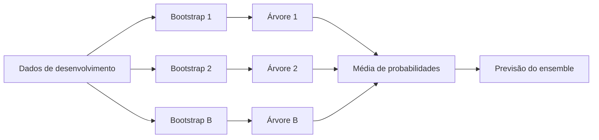
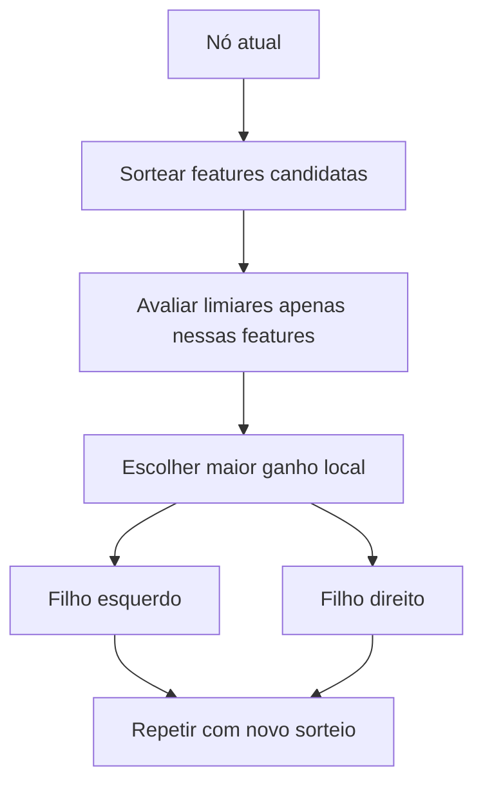
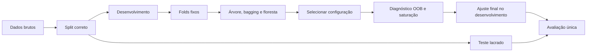

<!-- mirandastech-aula-v2 -->

# Aula 10 — Bagging e Random Forest: reduzindo variância com ensembles

[](https://colab.research.google.com/github/joaopaulomirandamatias/ai-lab/blob/main/03-machine-learning/notebooks/10-random-forest-bagging-laboratorio.ipynb)

Na [Aula 09](09-arvores-decisao.md), vimos que uma árvore consegue representar interações e fronteiras não lineares, mas é instável: pequenas mudanças na amostra podem alterar os primeiros splits e a previsão. Nesta aula, transformaremos essa fragilidade em uma estratégia. Em vez de procurar uma árvore perfeita, treinaremos muitas árvores diferentes e agregaremos suas previsões.

Essa é a intuição de **bagging**. A Random Forest acrescenta uma segunda fonte de diversidade: além de reamostrar observações, limita aleatoriamente as features candidatas em cada split. O resultado costuma ser mais estável que uma árvore isolada, desde que as árvores tenham alguma qualidade e não cometam exatamente os mesmos erros.

---

## Problema motivador

Uma empresa usa dados tabulares para priorizar alertas de fraude. Uma árvore treinada hoje escolhe `valor_transacao` na raiz; outra, após a entrada de poucos casos, escolhe `tempo_desde_ultima_compra`. Ambas ajustam bem o treino, mas a decisão operacional oscila.

Há dois problemas relacionados:

1. **alta variância:** cada amostra produz uma árvore diferente;
2. **erros correlacionados:** features dominantes fazem muitas árvores repetir a mesma estrutura.

Bagging ataca o primeiro problema treinando versões do modelo em amostras bootstrap. Random Forest ataca também o segundo ao sortear as features consideradas em cada nó. A agregação suaviza decisões individuais sem transformar o método em uma fórmula linear.

## Objetivos

Ao final, você deverá ser capaz de:

1. explicar bootstrap aggregation passo a passo;
2. calcular a fração esperada de observações únicas e out-of-bag;
3. distinguir bagging de Random Forest;
4. relacionar força individual, diversidade e correlação de erros;
5. interpretar a fórmula de variância da média de estimadores correlacionados;
6. usar previsões OOB sem tratá-las como teste universal;
7. avaliar saturação com `n_estimators` e custo computacional;
8. selecionar `max_features` e regularização sem consultar o teste;
9. reconhecer vieses de importância por impureza e limites de interpretabilidade;
10. construir um experimento reproduzível comparando árvore, bagging e floresta.

### Pré-requisitos

- árvores de decisão, profundidade, folhas e overfitting;
- amostragem com reposição, esperança e variância;
- correlação e covariância;
- classificação probabilística;
- treino, validação cruzada e teste reservado.

## Vocabulário

| Termo | Significado |
|---|---|
| ensemble | modelo que agrega previsões de vários estimadores-base |
| bootstrap | amostra de tamanho \(n\), sorteada com reposição de um conjunto de \(n\) unidades |
| bagging | *bootstrap aggregating*: treinar em bootstraps e agregar previsões |
| estimador-base | algoritmo treinado em cada réplica, como uma árvore |
| OOB | observações *out-of-bag*, ausentes do bootstrap de uma árvore |
| random subspace | sorteio de um subconjunto de features candidatas |
| `max_features` | quantidade de features consideradas a cada split |
| correlação entre árvores | semelhança dos erros ou previsões dos membros do ensemble |
| saturação | região em que adicionar árvores quase não muda a métrica |
| MDI | importância por redução média de impureza |

---

## 1. Bagging: várias versões do mesmo problema

Considere um conjunto de treino \(D=\{(\mathbf{x}_i,y_i)\}_{i=1}^{n}\). Para cada \(b=1,\ldots,B\):

1. sorteie, com reposição, uma amostra bootstrap \(D^{(b)}\) de tamanho \(n\);
2. ajuste um estimador \(\widehat f^{(b)}\) nessa amostra;
3. armazene sua previsão.

Em regressão, a agregação natural é a média:

\[
\widehat f_{bag}(\mathbf{x})=
\frac{1}{B}\sum_{b=1}^{B}\widehat f^{(b)}(\mathbf{x}).
\]

Em classificação, podemos votar nas classes ou calcular a média das probabilidades. O `RandomForestClassifier` do scikit-learn agrega as probabilidades previstas pelas árvores e escolhe a classe com maior média.



Uma árvore individual é um estimador de alta variância. A média cancela parte das oscilações: um split acidentalmente ruim em uma réplica pode ser compensado por outras árvores.

Bagging ajuda sobretudo quando o estimador-base é **instável**. Se pequenas perturbações do treino não alteram o modelo, as réplicas serão quase iguais e haverá pouco a agregar.

## 2. O que realmente existe em um bootstrap?

Cada sorteio escolhe uma das \(n\) observações. Para uma unidade específica, a chance de não aparecer em um sorteio é \(1-1/n\). Depois de \(n\) sorteios:

\[
P(\text{unidade ausente})=\left(1-\frac{1}{n}\right)^n
\xrightarrow[n\to\infty]{}e^{-1}\approx0{,}368.
\]

Logo, a fração esperada de unidades distintas presentes é:

\[
1-e^{-1}\approx0{,}632.
\]

Isso não significa que o bootstrap tenha apenas \(0{,}632n\) linhas. Ele tem \(n\) linhas, mas várias são repetições. Em média, cerca de 36,8% das unidades ficam fora daquela réplica.

### Exemplo resolvido

Em um treino com 1.000 unidades, cada árvore recebe 1.000 sorteios com reposição. Para uma árvore:

- unidades distintas esperadas: aproximadamente \(632\);
- unidades OOB esperadas: aproximadamente \(368\);
- linhas totais do bootstrap: exatamente \(1.000\).

Uma unidade pode ser OOB para algumas árvores e aparecer várias vezes em outras. Isso permite construir uma previsão OOB agregando apenas árvores que não treinaram naquela unidade.

## 3. Por que a média reduz variância?

Suponha que as previsões de \(B\) árvores tenham a mesma variância \(\sigma^2\) e correlação par a par média \(\rho\). A variância da média é:

\[
\operatorname{Var}(\bar f)=
\sigma^2\left(\rho+\frac{1-\rho}{B}\right).
\]

Cada símbolo tem um papel:

- \(\sigma^2\): instabilidade de uma árvore individual;
- \(\rho\): parcela compartilhada das oscilações;
- \(B\): número de árvores.

Com árvores independentes, \(\rho=0\), e a variância cai como \(\sigma^2/B\). Com árvores perfeitamente correlacionadas, \(\rho=1\), e a média não reduz variância.

### Exemplo numérico

Para \(B=100\) e \(\rho=0{,}10\):

\[
\operatorname{Var}(\bar f)=
\sigma^2\left(0{,}10+\frac{0{,}90}{100}\right)
=0{,}109\sigma^2.
\]

Se \(\rho=0{,}80\):

\[
\operatorname{Var}(\bar f)=0{,}802\sigma^2.
\]

Adicionar árvores reduz a parcela \((1-\rho)/B\), mas não remove o piso \(\rho\sigma^2\). É por isso que **diversidade**, não apenas quantidade, importa.

## 4. De bagging a Random Forest

Bagging de árvores reamostra linhas, mas cada árvore ainda examina todas as features em cada split. Se uma feature é muito dominante, muitas árvores escolherão regras parecidas e permanecerão correlacionadas.

Random Forest modifica o processo: em cada nó, sorteia um subconjunto de features e procura o melhor split somente dentro dele. O parâmetro `max_features` controla esse sorteio.



O subconjunto é sorteado **a cada split**, e não necessariamente uma única vez para toda a árvore. Isso força features menos dominantes a participar, reduzindo correlação entre árvores. Se `max_features` for pequeno demais, cada árvore pode ficar fraca; se for grande demais, a floresta se aproxima do bagging puro.

| Método | Reamostra observações | Sorteia features por split | Treino entre membros | Agregação |
|---|---|---|---|---|
| árvore única | não | não | — | nenhuma |
| bagging de árvores | sim | geralmente não | independente | média/voto |
| Random Forest | sim, por padrão | sim | independente | média de probabilidades |
| boosting | não é o mecanismo central | depende | sequencial | soma ponderada |

Boosting aparece apenas para contraste. Na [Aula 11](11-gradient-boosting.md), estudaremos como novos modelos corrigem erros anteriores de forma sequencial.

## 5. OOB: avaliação interna sem um conjunto extra

Para cada unidade \(i\), considere somente as árvores cujos bootstraps não contêm \(i\). A previsão OOB é:

\[
\widehat f_{OOB}(\mathbf{x}_i)=
\frac{1}{|\mathcal{B}_{-i}|}
\sum_{b\in\mathcal{B}_{-i}}\widehat f^{(b)}(\mathbf{x}_i),
\]

onde \(\mathcal{B}_{-i}\) é o conjunto de árvores para as quais \(i\) ficou fora do bootstrap.

Com árvores suficientes, quase toda unidade recebe várias previsões OOB. O score OOB pode estimar generalização durante o desenvolvimento e ajudar no diagnóstico de saturação.

### O que OOB não resolve

- **tempo:** bootstraps aleatórios podem treinar no futuro e prever o passado;
- **grupos:** linhas da mesma pessoa podem aparecer dentro e fora do bootstrap;
- **drift:** a distribuição OOB ainda vem do mesmo período e domínio;
- **preprocessing:** um transformador ajustado em todo o desenvolvimento pode ter visto as linhas OOB;
- **seleção repetida:** experimentar muitas configurações e escolher pelo OOB também otimiza sobre essa estimativa.

Portanto, OOB não substitui automaticamente validação temporal, por grupo, pipeline completo ou teste reservado. Ele é uma evidência adicional cuja validade depende da estrutura dos dados.

## 6. Hiperparâmetros que mudam o comportamento

| Parâmetro | Pergunta que responde | Trade-off |
|---|---|---|
| `n_estimators` | quantas árvores agregar? | estabilidade versus custo |
| `max_features` | quantas features competem por split? | força individual versus decorrelação |
| `bootstrap` | reamostrar observações? | diversidade e possibilidade de OOB |
| `max_samples` | qual tamanho de cada bootstrap? | diversidade versus informação por árvore |
| `max_depth` | quão profunda pode ser cada árvore? | flexibilidade versus overfitting/custo |
| `min_samples_leaf` | qual suporte mínimo por folha? | suavização versus detalhe |
| `class_weight` | como ponderar classes? | custo/raridade; será aprofundado na Aula 16 |
| `n_jobs` | quantos processos/threads usar? | tempo versus recursos e contenção |

`n_estimators` normalmente não cria o mesmo padrão clássico de overfitting que aumentar indefinidamente a profundidade de uma árvore. O ganho, porém, satura: depois de certo ponto, mais árvores consomem memória, treino e latência quase sem alterar a métrica.

Uma floresta também pode overfitar por árvores excessivamente adaptadas, features ruidosas, leakage ou busca de hiperparâmetros agressiva. “Mais árvores” não corrige um protocolo inválido.

## 7. Protocolo experimental honesto

Uma comparação defensável segue esta sequência:

1. declare unidade de análise, target, instante de predição e métrica;
2. reserve o teste segundo tempo, grupo ou processo real;
3. fixe folds do conjunto de desenvolvimento;
4. inclua um `DummyClassifier` e uma árvore única;
5. compare bagging e Random Forest nos mesmos folds;
6. selecione `max_features`, `min_samples_leaf` e demais controles no desenvolvimento;
7. examine média e dispersão entre folds e seeds;
8. use OOB como diagnóstico, não como autorização para abrir o teste;
9. escolha um número de árvores em região de saturação;
10. reajuste no desenvolvimento completo e avalie uma única vez no teste.



Árvores não exigem padronização, mas categorias, ausentes e seleção de features ainda precisam de tratamento sem vazamento. Se houver preprocessing aprendido, coloque o modelo em um `Pipeline` e faça validação do pipeline completo.

## 8. Estabilidade, número de árvores e seeds

Fixar `random_state` torna uma execução reproduzível. Isso não prova estabilidade. Para medir estabilidade, repita o treinamento com seeds ou reamostragens distintas e compare:

- distribuição da métrica;
- concordância das classes previstas;
- variação das probabilidades;
- custo e tempo;
- importância ou ranking de features, quando necessário.

Uma árvore pode alternar muito entre seeds/amostras. A média de centenas de árvores costuma variar menos. Ainda assim, florestas treinadas em dados diferentes podem discordar, sobretudo perto da fronteira de decisão ou sob mudança de domínio.

## 9. Importância de features: útil, mas não causal

`feature_importances_` calcula a redução total de impureza atribuída a cada feature, ponderada pelo número de amostras que chega aos nós e agregada entre árvores. É rápida, porém pode favorecer features com muitos valores e repartir importância de modo instável entre features correlacionadas.

Ela não responde:

- o que causou o target;
- quanto a previsão mudaria sob intervenção;
- se a feature funciona fora do domínio observado;
- se uma variável proxy é social ou juridicamente aceitável.

Permutation importance em validação mede queda de desempenho após embaralhar uma feature, mas também sofre com correlação: outra feature pode substituir o sinal. A interpretação será aprofundada na Aula 20. Aqui, use importâncias somente como diagnóstico, em dados fora do ajuste, e documente suas limitações.

## 10. Probabilidades, margem e incerteza

A média de probabilidades costuma ser menos extrema que a saída de uma folha isolada, mas não é sinônimo de probabilidade calibrada. Árvores correlacionadas podem concordar e estar erradas juntas.

A dispersão entre árvores descreve desacordo interno do ensemble; não captura automaticamente incerteza por drift, amostragem enviesada ou ausência de suporte. Calibração, thresholds e custos dos erros serão tratados nas Aulas 15 e 16.

## 11. Custo computacional e operação

Bagging e Random Forest permitem paralelizar árvores porque cada uma é treinada independentemente. Isso difere do boosting sequencial. Entretanto:

- `n_jobs=-1` pode disputar CPU e memória com outros processos;
- modelos grandes aumentam tamanho do artefato e tempo de inferência;
- latência de cauda importa em serviços online;
- reproducibilidade requer registrar versão, seed, features e hiperparâmetros;
- reentreinar com dados novos pode alterar probabilidades e importâncias.

O menor ensemble dentro da região de saturação pode ser uma escolha operacional melhor que o campeão por uma diferença irrelevante de métrica.

## 12. Laboratório reproduzível

O notebook utiliza dados sintéticos tabulares, sem rede ou credenciais, e reserva o teste antes da seleção. O roteiro:

1. confirma matematicamente as proporções bootstrap/OOB;
2. implementa bagging manual de árvores e compara com a biblioteca;
3. usa os mesmos folds para árvore, bagging e Random Forest;
4. seleciona `max_features` e `min_samples_leaf` somente no desenvolvimento;
5. compara OOB e validação cruzada;
6. mede correlação entre árvores;
7. constrói curva de saturação com `n_estimators`;
8. compara variabilidade entre seeds em validação interna;
9. abre o teste uma única vez para árvore e floresta pré-declaradas.

Dependências mínimas:

```text
numpy>=1.26
pandas>=2.2
matplotlib>=3.8
scikit-learn>=1.4
```

Seed global: `20260908`. Todos os resultados centrais têm verificações automáticas.

### Código mínimo

```python
from sklearn.ensemble import RandomForestClassifier

forest = RandomForestClassifier(
    n_estimators=300,
    max_features="sqrt",
    min_samples_leaf=3,
    bootstrap=True,
    oob_score=True,
    n_jobs=-1,
    random_state=20260908,
)
forest.fit(X_dev, y_dev)
print(forest.oob_score_)
```

O score isolado não encerra o experimento. Ele precisa de baseline, protocolo de split, comparação justa, incerteza e limitações.

## 13. Armadilhas e erros comuns

- **Confundir linhas e unidades únicas no bootstrap.** Há \(n\) sorteios, mas cerca de \(0{,}632n\) unidades distintas.
- **Achar que 36,8% é um conjunto OOB fixo.** Cada árvore deixa um subconjunto diferente de fora.
- **Usar OOB em séries temporais ou grupos repetidos sem crítica.** A independência necessária pode falhar.
- **Selecionar tudo pelo OOB e chamar o mesmo score de avaliação final.** Houve adaptação à estimativa.
- **Aumentar `n_estimators` sem medir saturação e custo.** Mais não é automaticamente melhor.
- **Achar que `max_features` sorteia um conjunto único por árvore.** O sorteio ocorre a cada split.
- **Usar importância por impureza como causalidade.** Ela descreve o ajuste do modelo.
- **Comparar modelos em folds diferentes.** Parte da diferença pode vir da amostragem.
- **Aplicar preprocessing antes dos folds.** O ensemble continua sujeito a leakage.
- **Confundir seed fixa com robustez.** Repetibilidade e estabilidade são propriedades distintas.
- **Ignorar probabilidades.** Mesma classe prevista pode esconder mudanças relevantes de confiança.

## 14. Checklist prático

- [ ] Defini unidade de análise e instante de predição.
- [ ] Reservei o teste antes da seleção.
- [ ] Usei baseline e árvore única como referências.
- [ ] Mantive os mesmos folds em todas as comparações.
- [ ] Registrei bootstrap, `max_samples` e `max_features`.
- [ ] Medi média e dispersão da métrica.
- [ ] Comparei OOB com CV sem tratá-los como idênticos.
- [ ] Verifiquei saturação do número de árvores.
- [ ] Testei estabilidade entre seeds no desenvolvimento.
- [ ] Mantive preprocessing dentro dos folds.
- [ ] Tratei importâncias como diagnóstico, não causalidade.
- [ ] Reportei custo, latência e tamanho quando relevantes.
- [ ] Abri o teste apenas depois de congelar a configuração.

## 15. Resumo

- Bagging treina estimadores em amostras bootstrap e agrega previsões.
- Um bootstrap de tamanho \(n\) contém cerca de 63,2% das unidades distintas; cerca de 36,8% ficam OOB para uma árvore.
- A média reduz a variância apenas na parcela não compartilhada entre os estimadores.
- Random Forest sorteia features em cada split para decorrelacionar árvores.
- `max_features` negocia força individual e diversidade.
- OOB é uma estimativa interna útil, mas não corrige tempo, grupos, drift ou preprocessing contaminado.
- Mais árvores estabilizam o ensemble até uma região de saturação, com custo crescente.
- Importância por impureza pode ser enviesada e nunca estabelece causalidade.
- Um experimento honesto mantém teste lacrado, folds fixos e comparação com baselines.

## 16. Exercícios com respostas comentadas

### 1. Fração OOB

Qual a fração limite de unidades ausentes de um bootstrap de tamanho \(n\)?

**Resposta:**

\[
\lim_{n\to\infty}\left(1-\frac1n\right)^n=e^{-1}\approx0{,}368.
\]

É uma expectativa para cada árvore, não uma divisão fixa do dataset.

### 2. Variância com árvores independentes

Se \(B=25\), \(\rho=0\) e cada árvore tem variância \(4\), qual a variância da média?

**Resposta:** \(4/25=0{,}16\). A redução forte depende da hipótese de correlação zero.

### 3. Efeito da correlação

Com \(B\to\infty\), o que ocorre na fórmula?

**Resposta:** o termo \((1-\rho)/B\) tende a zero e resta \(\rho\sigma^2\). Árvores adicionais não removem a parcela correlacionada.

### 4. Bagging versus Random Forest

**Resposta:** ambos podem usar bootstraps e agregação. Random Forest também sorteia features candidatas em cada split, reduzindo a correlação entre árvores.

### 5. OOB substitui teste temporal?

**Resposta:** não. O bootstrap ignora a direção do tempo e pode usar observações futuras para construir árvores que predizem observações passadas. O split deve representar o uso real.

### 6. Por que `n_estimators=10.000` pode ser inadequado?

**Resposta:** a métrica pode já ter saturado, enquanto memória, treino, armazenamento e latência continuam crescendo. A decisão deve considerar incerteza e custo.

### 7. Duas features correlacionadas recebem importâncias baixas. Isso prova irrelevância?

**Resposta:** não. O sinal pode ser repartido ou uma feature pode substituir a outra. Importe o protocolo e faça análise de ablação/permutação em validação, sem inferência causal.

### 8. Protocolo por usuário

Cada usuário gera vinte eventos. Como validar uma floresta?

**Resposta:** divida por usuário com folds de grupo; todas as linhas de uma pessoa ficam no mesmo lado. OOB por linha não garante esse isolamento. Reserve usuários ou períodos finais para teste conforme o cenário.

### 9. Contraprova

Compare vinte árvores únicas e vinte florestas, variando a seed em uma validação interna fixa.

**Resposta esperada:** as árvores tendem a apresentar maior dispersão de métrica e probabilidade. Se não ocorrer, investigue estabilidade do problema, regularização e correlação das florestas em vez de forçar a conclusão.

## Critério de domínio

Você domina esta aula quando consegue:

1. derivar \(e^{-1}\) para a fração OOB;
2. explicar a fórmula de variância de estimadores correlacionados;
3. implementar bagging simples antes de usar a abstração pronta;
4. distinguir OOB, validação cruzada e teste;
5. justificar `max_features`, `min_samples_leaf` e `n_estimators`;
6. demonstrar estabilidade e saturação com evidência reproduzível;
7. explicar por que importância preditiva não é causalidade.

## Referências técnicas

- Breiman, L. — [*Bagging Predictors*](https://doi.org/10.1007/BF00058655), *Machine Learning* 24, 123–140, 1996.
- Breiman, L. — [*Random Forests*](https://doi.org/10.1023/A:1010933404324), *Machine Learning* 45, 5–32, 2001.
- scikit-learn — [Ensembles: forests and randomized trees](https://scikit-learn.org/stable/modules/ensemble.html#forest).
- scikit-learn — [`RandomForestClassifier`](https://scikit-learn.org/stable/modules/generated/sklearn.ensemble.RandomForestClassifier.html).
- James, Witten, Hastie, Tibshirani e Taylor — [An Introduction to Statistical Learning](https://www.statlearning.com/), capítulo de métodos baseados em árvores.
- Hastie, Tibshirani e Friedman — [The Elements of Statistical Learning](https://hastie.su.domains/ElemStatLearn/), seções de bagging e Random Forest.

## Próxima aula

Na [Aula 11 — Boosting e Gradient Boosting](11-gradient-boosting.md), trocaremos o paralelismo independente por uma construção sequencial: cada novo modelo tentará corrigir os erros que o ensemble aditivo ainda comete.
