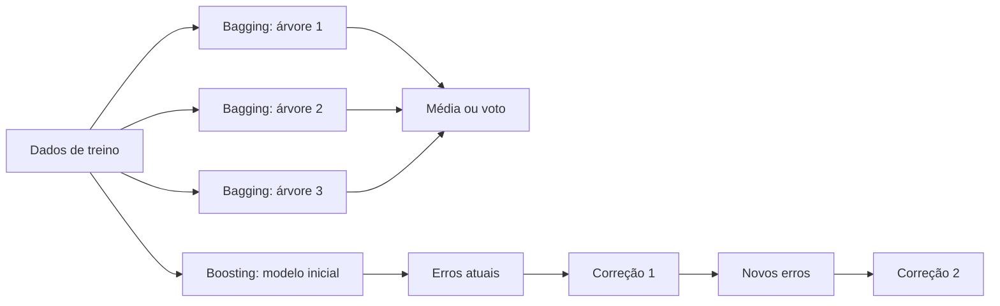
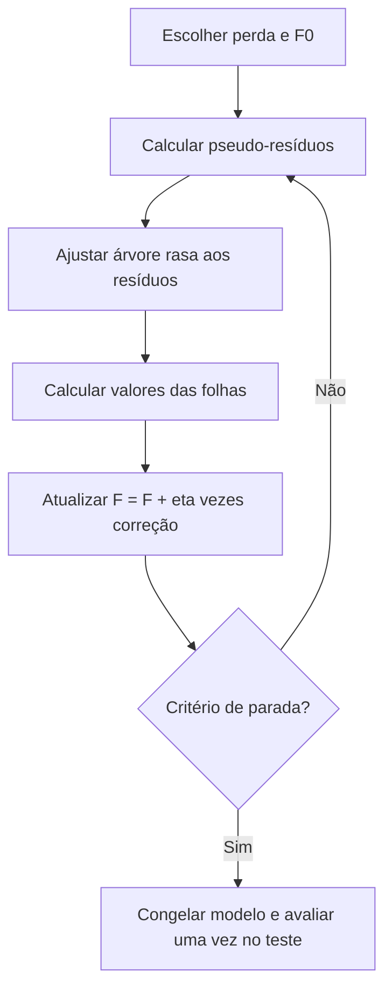
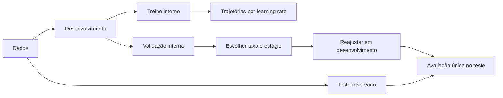

<!-- mirandastech-aula-v2 -->

# Aula 11 — Boosting e Gradient Boosting

Na aula anterior, reduzimos a instabilidade de árvores combinando modelos treinados em amostras e subconjuntos de atributos diferentes. Uma Random Forest pergunta a muitas árvores independentes e agrega suas respostas. Agora surge outra ideia: em vez de construir especialistas independentes, podemos criar uma sequência em que cada novo modelo tenta corrigir os erros que o conjunto ainda comete.

Imagine uma previsão de tempo de atendimento. Um primeiro modelo acerta a tendência geral, mas subestima sistematicamente chamados complexos. O segundo aprende parte desse resíduo; o terceiro corrige o que restou. Essa soma de pequenas correções é o núcleo do **boosting**.

> Boosting não é “uma árvore muito grande”. É um modelo aditivo, construído em etapas, no qual cada aprendiz fraco é condicionado ao estado atual do conjunto.

## Objetivos

Ao final, você deverá ser capaz de:

- distinguir bagging, AdaBoost e gradient boosting;
- explicar boosting como minimização de uma função de perda no espaço de funções;
- derivar os pseudo-resíduos para erro quadrático e log-loss binária;
- interpretar `learning_rate`, número e profundidade das árvores como regularizadores acoplados;
- escolher a quantidade de estágios usando apenas validação;
- reconhecer riscos de ruído, sobreajuste, extrapolação e vazamento;
- treinar e auditar um `GradientBoostingRegressor` com teste final isolado.

## Pré-requisitos

- árvores, impureza e poda da [Aula 09](09-arvores-decisao.md);
- bagging e Random Forest da [Aula 10](10-random-forest-bagging.md);
- derivadas, gradiente e funções de perda;
- separação entre treino, validação e teste.

## Vocabulário essencial

| Termo | Significado |
|---|---|
| *Boosting* | Construção sequencial de aprendizes, cada um dependente do conjunto corrente. |
| Aprendiz fraco | Modelo simples, ligeiramente melhor que uma regra trivial; em GBDT costuma ser uma árvore rasa. |
| Modelo aditivo | Preditor expresso como soma de contribuições. |
| Pseudo-resíduo | Gradiente negativo da perda em relação à predição atual. |
| Estágio | Uma iteração que acrescenta um novo aprendiz ao conjunto. |
| *Shrinkage* | Redução do tamanho de cada atualização pelo `learning_rate`. |
| Boosting estocástico | Variante que usa uma fração aleatória das linhas em cada estágio. |
| *Early stopping* | Interrupção definida pelo desempenho em validação, antes de consultar o teste. |

## 1. Bagging e boosting atacam problemas diferentes

| Aspecto | Bagging / Random Forest | Boosting |
|---|---|---|
| Construção | Modelos independentes | Modelos sequenciais |
| Combinação | Média ou voto | Soma ponderada de correções |
| Foco típico | Reduzir variância | Reduzir viés sem perder controle da variância |
| Dados por etapa | Bootstrap e/ou atributos aleatórios | Erros, pesos ou gradientes do conjunto corrente |
| Paralelismo entre árvores | Natural | Limitado pela dependência entre estágios |
| Regularização central | Diversidade e média | Passo, complexidade, amostragem e parada |

No bagging, uma árvore não sabe que outra existe. No boosting, a árvore do estágio (m) só pode ser ajustada depois de conhecermos (F_{m-1}). Por isso, “mais árvores” não tem o mesmo significado nas duas famílias.

### E o AdaBoost?

AdaBoost popularizou a construção sequencial reponderando observações: exemplos classificados incorretamente recebem mais influência na próxima rodada. Gradient boosting generaliza a ideia escolhendo uma perda diferenciável e ajustando cada novo modelo ao seu gradiente negativo. AdaBoost é uma referência histórica importante; daqui em diante, o foco será **Gradient Boosted Decision Trees (GBDT)**.

## 2. Da intuição ao modelo aditivo

Queremos aprender uma função (F(x)) que minimize a perda empírica:

\[
\mathcal{R}(F)=\sum_{i=1}^{n} L\bigl(y_i,F(x_i)\bigr),
\]

em que (n) é o número de exemplos, (x_i) são os atributos, (y_i) é o alvo e (L) mede o erro. Gradient boosting constrói:

\[
F_M(x)=F_0(x)+\eta\sum_{m=1}^{M}\rho_m h_m(x).
\]

- (F_0): melhor constante para a perda escolhida;
- (h_m): árvore de regressão ajustada no estágio (m);
- (
ho_m): tamanho ótimo da correção — algumas implementações o incorporam aos valores das folhas;
- (eta\in(0,1]): taxa de aprendizado;
- (M): quantidade de estágios.

O adjetivo “gradiente” aparece porque, em cada observação, calculamos

\[
r_{im}=-\left.
\frac{\partial L(y_i,F(x_i))}{\partial F(x_i)}
\right|_{F=F_{m-1}}.
\]

Depois, (h_m(x)) aproxima esses pseudo-resíduos. Isso é análogo ao gradiente descendente, mas a direção de atualização é uma **função**, não um vetor fixo de coeficientes.

## 3. Exemplo resolvido: regressão com erro quadrático

Use a perda

\[
L(y,F)=\frac{1}{2}(y-F)^2.
\]

Sua derivada em relação a (F) é (F-y); portanto, o gradiente negativo é

\[
r=y-F.
\]

Em palavras: para erro quadrático, cada árvore aprende os resíduos comuns.

Considere (y=[3,5,9]). A melhor constante inicial é a média:

\[
F_0=\bar y=\frac{3+5+9}{3}=5{,}667.
\]

Os resíduos são, aproximadamente, ([-2{,}667,-0{,}667,3{,}333]). Suponha que um toco de decisão produza as correções ([-2,-2,3]). Com (eta=0{,}1):

\[
F_1=F_0+0{,}1h_1=[5{,}467,5{,}467,5{,}967].
\]

Para a terceira observação, a previsão subiu de (5{,}667) para (5{,}967), na direção de (9). O passo foi deliberadamente pequeno: a próxima árvore ainda poderá corrigir o que restou.

### Por que árvores de regressão até na classificação?

Na classificação binária com log-loss, o modelo acumula escores (F(x)), convertidos em probabilidade pela sigmoide (p=\sigma(F)). Para (y\in\{0,1\}), o gradiente negativo é:

\[
r=y-p.
\]

Logo, a árvore continua aproximando um alvo numérico. Se (y=1) e (p=0{,}8), a correção é (0{,}2); se (y=0) e (p=0{,}3), é (-0{,}3). A transformação para classe acontece somente depois, e seu limiar deve refletir o custo da decisão.

## 4. Regularização: os controles trabalham juntos

Boosting pode ajustar padrões muito finos. O objetivo não é maximizar cada parâmetro, mas controlar a capacidade do conjunto.

| Controle | Se aumentar | Uso responsável |
|---|---|---|
| `n_estimators` | Mais correções e custo de inferência | Escolher por validação ou parada antecipada |
| `learning_rate` | Cada árvore altera mais o conjunto | Taxas menores geralmente pedem mais árvores |
| `max_depth` | Interações mais complexas por árvore | Começar com árvores rasas |
| `max_leaf_nodes` | Mais regiões por estágio | Alternativa direta ao controle de profundidade |
| `min_samples_leaf` | Folhas menos específicas | Aumentar quando houver ruído ou poucos dados |
| `subsample` | Em 1 usa todas as linhas | Valores menores introduzem aleatoriedade e podem reduzir variância |
| `max_features` | Mais atributos candidatos | Reduzir para diversidade e custo, validando o efeito |
| `loss` | Muda o que significa “erro” | Alinhar ao alvo e à decisão, não só à conveniência |

Uma taxa pequena não garante generalização. Se adicionarmos árvores até memorizar o treino, apenas tornamos o caminho mais longo. O par ((\eta,M)) deve ser selecionado em conjunto.

### Interações e profundidade

Uma árvore de profundidade 1 modela um efeito principal por estágio. Árvores mais profundas conseguem representar interações entre atributos dentro da mesma correção. Essa flexibilidade também permite aprender ruído, sobretudo em folhas pequenas. Profundidade não é “qualidade”; é uma hipótese sobre a complexidade da função.

### Boosting estocástico

Com `subsample < 1`, cada estágio usa uma subamostra sem reposição. A aleatoriedade pode reduzir a correlação entre correções e agir como regularização, mas cria variação entre seeds. Relate a seed e, em estudos importantes, verifique a estabilidade em várias delas.

## 5. Seleção honesta e parada antecipada

O teste não é um painel de acompanhamento. Se escolhermos (M) olhando repetidamente seu resultado, o teste vira validação e sua estimativa final fica otimista.

Um protocolo simples é:

1. separar o teste antes de qualquer ajuste;
2. dividir o restante em treino e validação, preservando tempo, grupos ou classes quando necessário;
3. treinar um orçamento amplo de estágios;
4. medir a perda de validação após cada estágio com `staged_predict`;
5. escolher ((\eta,M)) apenas pela validação;
6. reajustar no conjunto de desenvolvimento completo com essa configuração;
7. abrir o teste uma única vez.

Em dados temporais, “dividir” significa respeitar o tempo; em múltiplas linhas por usuário, respeitar a entidade; em classes raras, estratificar quando isso for metodologicamente válido. O algoritmo não corrige um desenho experimental contaminado.

## 6. Implementações modernas sem misturar conceitos

O princípio aditivo é compartilhado, mas as bibliotecas não são intercambiáveis parâmetro a parâmetro.

| Implementação | Ideia distintiva | Atenção |
|---|---|---|
| `GradientBoosting*` | Implementação clássica, didática, com predições por estágio | Pode ser lenta em bases grandes |
| `HistGradientBoosting*` | Agrupa valores em bins e usa histogramas | API e perdas disponíveis diferem da versão clássica |
| XGBoost | Objetivo regularizado e aproximações eficientes | Defaults e significado dos controles são próprios |
| LightGBM | Crescimento e amostragem desenhados para eficiência | Árvores *leaf-wise* podem exigir forte controle de folhas |
| CatBoost | Tratamento ordenado para atributos categóricos e *target statistics* | Ainda exige separação correta e auditoria de categorias |

Na documentação atual do scikit-learn, a família histogram-based é indicada como muito mais rápida quando há dezenas de milhares de amostras e oferece suporte nativo a valores ausentes. Isso não torna imputação ou ausência “irrelevantes”: o padrão de falta pode mudar entre treino e produção e precisa ser monitorado.

## 7. O que o modelo aprende — e o que não aprende

### Extrapolação

Árvores produzem valores constantes por região. Uma soma de árvores continua sem impor tendência linear além do domínio observado. Prever demanda em uma faixa nunca vista pode apenas prolongar o valor da última região, não a tendência real.

### Importância não é causalidade

Redução de perda ou importância por impureza descrevem uso preditivo no conjunto observado. Atributos correlacionados podem dividir crédito; identificadores de alta cardinalidade podem induzir padrões espúrios; uma feature vazada pode parecer decisiva. Explicação local ou importância não transforma associação em efeito causal.

### Probabilidade não é automaticamente calibrada

Otimizar log-loss ajuda a qualidade probabilística, mas seleção, desbalanceamento, regularização e mudança de distribuição afetam calibração. Avalie Brier/log-loss e curvas de calibração em dados adequados antes de tratar `predict_proba` como risco operacional.

## 8. Armadilhas frequentes

- **Parar pelo teste:** produz estimativa final contaminada.
- **Comparar taxas com número de árvores arbitrariamente fixo:** ignora o acoplamento entre passo e estágios.
- **Usar árvores profundas como aprendizes “fracos”:** acelera memorização de ruído.
- **Otimizar só treino:** a perda de treino quase sempre favorece mais capacidade.
- **Ignorar baseline:** um modelo sofisticado pode não superar média, mediana ou regra vigente.
- **Misturar unidade de análise:** linhas do mesmo usuário em partições distintas criam leakage.
- **Codificar categorias antes da divisão:** estatísticas do alvo podem atravessar a fronteira.
- **Interpretar ganho como causalidade:** o ensemble é preditivo.
- **Esperar extrapolação suave:** árvores não carregam essa hipótese.
- **Desconsiderar latência:** a inferência percorre uma sequência de árvores; meça p95/p99 no ambiente real.

## 9. Checklist prático

- [ ] Defini unidade de análise, horizonte e variável-alvo antes do split.
- [ ] Reservei o teste e não o usei em early stopping.
- [ ] Comparei com baseline e com uma árvore simples.
- [ ] Selecionei `learning_rate` e número de estágios conjuntamente.
- [ ] Controlei profundidade, folhas mínimas e, quando útil, `subsample`.
- [ ] Registrei seed, versões, features e regra de particionamento.
- [ ] Avaliei métrica alinhada ao custo da decisão.
- [ ] Inspecionei estabilidade, resíduos e subgrupos relevantes.
- [ ] Testei mudança de distribuição e extrapolação plausível.
- [ ] Medi custo e latência de inferência.

## 10. Laboratório reproduzível

O [notebook da aula](../notebooks/11-gradient-boosting-laboratorio.ipynb) implementa:

- a primeira correção residual passo a passo;
- gradient check da perda quadrática;
- dados sintéticos de Friedman com split treino–validação–teste;
- trajetórias `staged_predict` para quatro taxas de aprendizado;
- seleção conjunta de taxa e estágio sem consultar o teste;
- comparação com baseline e árvore única;
- análise da variabilidade causada por `subsample` em várias seeds;
- asserts para shapes, isolamento das partições e resultados numéricos.

Dependências mínimas: Python 3.10, NumPy 1.24, pandas 2.0, Matplotlib 3.7 e scikit-learn 1.3. O notebook usa `SEED = 20260908`, dados gerados localmente, nenhuma credencial e nenhum download.

## 11. Exercícios

### 1. Pseudo-resíduo

Para (y=12), (F=9) e (L=\tfrac12(y-F)^2), calcule o pseudo-resíduo.

**Resposta comentada:** (r=y-F=3). A próxima árvore deve empurrar a previsão para cima naquela região.

### 2. Shrinkage

Uma folha prevê correção (4). Compare atualizações com (eta=0{,}1) e (eta=0{,}02).

**Resposta comentada:** as atualizações são (0{,}4) e (0{,}08). A segunda é mais conservadora e tende a exigir mais estágios; não é automaticamente melhor.

### 3. Classificação

Calcule (y-p) para (y=0) e (p=0{,}9).

**Resposta comentada:** (-0{,}9). O erro confiante produz uma correção negativa grande no espaço de escores.

### 4. Protocolo

Um time treina 500 árvores e escolhe 173 porque ali o RMSE de teste foi mínimo. Qual o problema?

**Resposta comentada:** o teste participou da seleção e deixou de ser uma avaliação independente. Deve-se escolher o estágio em validação e usar o teste apenas ao final.

### 5. Bagging ou boosting?

Qual família permite treinar árvores independentemente e agregá-las por média?

**Resposta comentada:** bagging. No boosting, cada estágio depende das previsões anteriores.

### 6. Diagnóstico

A perda de treino continua caindo, mas a validação sobe após 120 árvores. O que fazer?

**Resposta comentada:** escolher a região do mínimo de validação — de preferência com uma regra de tolerância/paciência — e investigar regularização. Continuar apenas porque o treino melhora é sobreajuste.

## Resumo

- Boosting constrói um ensemble sequencial de correções.
- Gradient boosting ajusta árvores ao gradiente negativo da perda.
- Para erro quadrático, o pseudo-resíduo é o resíduo (y-F); para log-loss binária, é (y-p).
- Taxa de aprendizado, quantidade e complexidade das árvores formam um sistema de regularização.
- Early stopping e seleção pertencem à validação, nunca ao teste.
- GBDTs são fortes em dados tabulares, mas não resolvem leakage, causalidade, calibração ou extrapolação por conta própria.

## Referências

### Fontes técnicas

1. Friedman, J. H. (2001). [Greedy Function Approximation: A Gradient Boosting Machine](https://doi.org/10.1214/aos/1013203451). *The Annals of Statistics*, 29(5), 1189–1232.
2. Friedman, J. H. (2002). [Stochastic Gradient Boosting](https://doi.org/10.1016/S0167-9473(01)00065-2). *Computational Statistics & Data Analysis*, 38(4), 367–378.
3. Scikit-learn. [Gradient-boosted trees — User Guide](https://scikit-learn.org/stable/modules/ensemble.html#gradient-boosting). Documentação oficial, consultada em setembro de 2026.
4. Chen, T.; Guestrin, C. (2016). [XGBoost: A Scalable Tree Boosting System](https://doi.org/10.1145/2939672.2939785). *KDD '16*.
5. Ke, G. et al. (2017). [LightGBM: A Highly Efficient Gradient Boosting Decision Tree](https://proceedings.neurips.cc/paper/2017/hash/6449f44a102fde848669bdd9eb6b76fa-Abstract.html). *NeurIPS 30*.
6. Prokhorenkova, L. et al. (2018). [CatBoost: unbiased boosting with categorical features](https://proceedings.neurips.cc/paper/2018/hash/14491b756b3a51daac41c24863285549-Abstract.html). *NeurIPS 31*.

### Material complementar

7. Hastie, T.; Tibshirani, R.; Friedman, J. [The Elements of Statistical Learning](https://hastie.su.domains/ElemStatLearn/). 2ª ed., capítulo 10.

## Próxima aula

Na [Aula 12 — Support Vector Machines](12-svm.md), trocaremos partições aditivas por outra geometria: margens máximas, vetores de suporte e kernels. A comparação ficará mais clara agora que já sabemos como árvores e ensembles controlam complexidade.
