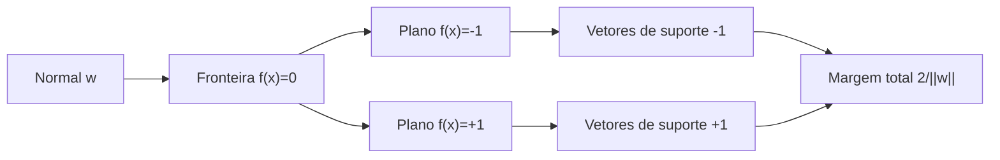
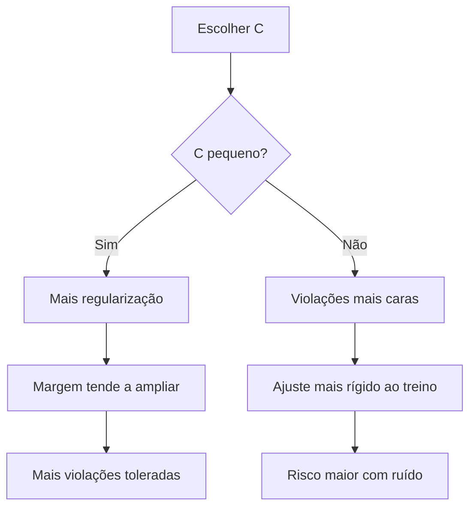
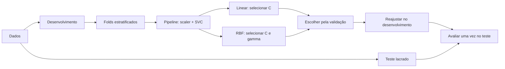

<!-- mirandastech-aula-v2 -->

# Aula 12 — Support Vector Machines: margens e kernels

Na [Aula 11](11-gradient-boosting.md), construímos uma fronteira somando pequenas árvores. Uma Support Vector Machine, ou **SVM**, parte de outra pergunta: entre todas as fronteiras que separam duas classes, qual deixa a maior faixa de segurança ao redor da decisão?

Imagine um sistema que classifica peças por duas medições. Vários hiperplanos acertam o treino, mas uma fronteira colada aos exemplos pode mudar de decisão com pequeno ruído do sensor. A SVM procura uma **margem ampla** e permite violações controladas quando a separação perfeita não existe.

> SVM não significa apenas “separar classes”: significa equilibrar largura da margem e violações, usando exemplos críticos — os vetores de suporte — para definir a decisão.

## Objetivos de aprendizagem

- Explicar hiperplano e margem.
- Identificar support vectors.
- Entender parâmetro C.
- Compreender kernel trick conceitualmente.
- Usar RBF com scaling e tuning correto.

## Pré-requisitos

- produto interno, norma, distância e hiperplanos;
- classificação binária e regularização;
- [pipelines e prevenção de leakage](03-preprocessamento-pipelines-leakage.md);
- separação entre desenvolvimento e teste.

## Vocabulário

| Termo | Significado |
|---|---|
| Hiperplano | Conjunto de pontos que satisfaz \(w^\top x+b=0\). |
| Função de decisão | Score assinado \(f(x)\); o sinal determina a classe binária. |
| Margem | Faixa entre os planos de suporte. |
| Vetor de suporte | Exemplo com coeficiente dual não nulo que participa da decisão. |
| *Slack* \(\xi_i\) | Quantidade de violação da margem pelo exemplo \(i\). |
| Hinge loss | Perda \(\max(0,1-yf(x))\). |
| Kernel | Produto interno calculado em uma representação implícita. |
| \(C\) | Peso atribuído às violações. |
| \(\gamma\) | Alcance do kernel RBF. |

## 1. Da reta ao hiperplano

Para \(x\in\mathbb{R}^p\), a fronteira linear é \(f(x)=w^\top x+b\). O vetor \(w\) é perpendicular ao hiperplano, \(b\) o desloca e o sinal de \(f(x)\) determina o lado da decisão.

A distância assinada à fronteira é \(f(x)/\lVert w\rVert\). Multiplicar \(w\) e \(b\) pela mesma constante não muda a fronteira, mas muda o score. A escala canônica da SVM fixa os exemplos mais próximos em \(y_i f(x_i)=1\). Os planos de suporte são \(f(x)=+1\) e \(f(x)=-1\); a largura total entre eles é

\[
\frac{2}{\lVert w\rVert}.
\]

Assim, maximizar a margem equivale a minimizar \(\lVert w\rVert\).

## 2. Ideias fundamentais

### 1. Margem

O classificador busca um hiperplano com grande margem entre classes. Apenas pontos próximos à fronteira influenciam diretamente a solução.

### 2. Soft margin

C controla o custo de violações. C alto penaliza erros com força; C baixo permite margem mais suave.

### 3. Kernel

Kernels permitem calcular produtos internos em espaços transformados sem construir explicitamente todas as novas features.

### 4. RBF

O kernel RBF cria fronteiras flexíveis; gamma controla a escala de influência dos pontos.

## 3. Margem rígida, margem suave e hinge loss

No caso separável, a margem rígida resolve

\[
\min_{w,b}\frac12\lVert w\rVert^2
\quad\text{sujeito a}\quad y_i(w^\top x_i+b)\ge1.
\]

Um ponto ruidoso pode tornar as restrições inviáveis. Para dados sobrepostos, introduzimos \(\xi_i\ge0\):

\[
\min_{w,b,\xi}\frac12\lVert w\rVert^2+C\sum_i\xi_i,
\qquad y_i(w^\top x_i+b)\ge1-\xi_i.
\]

| Slack | Interpretação |
|---|---|
| \(\xi_i=0\) | correto, sobre ou além do plano de suporte |
| \(0<\xi_i<1\) | correto, mas dentro da margem |
| \(\xi_i=1\) | sobre a fronteira central |
| \(\xi_i>1\) | classificado incorretamente |

A forma equivalente usa hinge loss:

\[
\frac12\lVert w\rVert^2+C\sum_i\max(0,1-y_i f(x_i)).
\]

Quando \(y_i f(x_i)\ge1\), a perda é zero. Pontos suficientemente corretos deixam de empurrar a fronteira.

- **\(C\) pequeno:** penaliza menos violações, regulariza mais e tende a ampliar a margem;
- **\(C\) grande:** cobra mais violações, ajusta o treino rigidamente e pode estreitar a margem.

Essa é uma tendência, não uma garantia. O valor adequado depende de escala, ruído, amostra, pesos e kernel.

## 4. Forma dual e vetores de suporte

No dual, a decisão linear pode ser escrita como

\[
f(x)=\sum_{i\in SV}\alpha_i y_i\,x_i^\top x+b,
\]

em que \(SV\) reúne os vetores de suporte. Exemplos com coeficiente zero desaparecem da soma. A fronteira depende dos casos críticos; com kernel, a inferência compara a nova observação aos vetores de suporte. Muitos vetores elevam memória e latência. “Esparsidade” aqui significa usar parte dos exemplos, não necessariamente poucos atributos.

## 5. Kernel trick: linear em outro espaço

Podemos transformar \(x\) em \(\phi(x)\) e ajustar um hiperplano nesse espaço. Como o dual precisa apenas de produtos internos, um kernel calcula

\[
K(x,z)=\phi(x)^\top\phi(z)
\]

sem materializar \(\phi\). A decisão torna-se

\[
f(x)=\sum_{i\in SV}\alpha_i y_i K(x_i,x)+b.
\]

| Kernel | Fórmula | Hipótese |
|---|---|---|
| Linear | \(x^\top z\) | separação aproximadamente linear |
| Polinomial | \((\gamma x^\top z+r)^d\) | interações até o grau \(d\) |
| RBF | \(\exp(-\gamma\lVert x-z\rVert^2)\) | similaridade local e radial |

Nem toda similaridade é kernel válido. A matriz de Gram deve ser simétrica e semidefinida positiva.

### Exemplo RBF resolvido

Para \(x=(0,0)\), \(z=(1,1)\) e \(\gamma=0{,}5\):

\[
\lVert x-z\rVert^2=2,\qquad K(x,z)=e^{-1}\approx0{,}3679.
\]

Com \(\gamma=2\), a similaridade cai para \(e^{-4}\approx0{,}0183\). \(\gamma\) baixo espalha influência; \(\gamma\) alto cria influência local. \(C\) e \(\gamma\) precisam ser selecionados em conjunto.

## 6. Escala faz parte do modelo

Se `idade` varia de 18 a 80 e `renda_centavos` de 100.000 a 5.000.000, a segunda feature domina a distância. Isso muda as similaridades RBF e a regularização linear.

Padronize com estatísticas aprendidas apenas no treino:

\[
z_{ij}=\frac{x_{ij}-\mu_j^{(treino)}}{\sigma_j^{(treino)}}.
\]

Use `Pipeline(StandardScaler(), SVC(...))`. Durante validação cruzada, cada fold ajusta seu próprio scaler. Ajustá-lo antes dos folds é vazamento. No scikit-learn, `gamma="scale"` usa \(1/(p\,\mathrm{Var}(X))\): um ponto inicial dependente dos dados.

## 7. Score não é probabilidade

`decision_function` retorna score de margem. Score 2 não significa 200% nem implica probabilidade fixa. No `SVC`, `probability=True` faz calibração adicional por validação cruzada interna e aumenta o custo. Calibração será estudada na Aula 15.

## 8. Equação para guardar

$$
K(x,z)=\exp(-\gamma\|x-z\|^2)
$$

Não memorize a fórmula isoladamente. Pergunte sempre: **o que entra, o que é aprendido, qual hipótese está sendo feita e como isso será avaliado fora da amostra?**

### Exemplo mental: não linearidade

Duas classes em círculos concêntricos não são linearmente separáveis no espaço original, mas um kernel pode induzir uma separação adequada.

### Exemplo linear resolvido

Em uma dimensão, negativos em $x=-2,-1$ e positivos em $x=1,2$. O hiperplano $w=1,b=0$ separa em zero. Os pontos $-1$ e $1$ satisfazem $y(wx+b)=1$ e são vetores de suporte. A distância de cada plano de suporte ao centro é $1/\|w\|=1$; a largura total da margem é 2.

O ponto $x=0{,}5$ recebe score $0{,}5$ e classe positiva, mas score não é probabilidade calibrada.

### Multiclasse, custo e escolha da implementação

O problema foi formulado para duas classes. O `SVC` do scikit-learn treina internamente classificadores **um contra um**: para (k) classes, são (k(k-1)/2) problemas binários. Já `LinearSVC` usa uma estratégia um contra o restante e uma formulação diferente; por isso seus coeficientes e resultados não precisam coincidir com `SVC(kernel="linear")`.

O `SVC` kernelizado é valioso em bases pequenas e médias, mas seu ajuste cresce pelo menos quadraticamente com o número de amostras na prática. Além disso, a predição depende da quantidade de vetores de suporte. Em dados grandes ou texto esparso, compare `LinearSVC`, `SGDClassifier` ou aproximações de kernel e meça tempo, memória e latência no ambiente real.

## 9. Seleção honesta e laboratório reproduzível

O teste não é painel de tuning. O protocolo é:

1. declare unidade, alvo e instante de predição;
2. reserve o teste por tempo, entidade ou amostragem coerente;
3. compare baseline, linear e RBF nos mesmos folds;
4. inclua o scaler dentro do pipeline;
5. selecione hiperparâmetros apenas no desenvolvimento;
6. congele tudo, reajuste e abra o teste uma vez.

A [Aula 18](18-hyperparameter-tuning.md) aprofundará busca aleatória, nested CV e orçamento. Aqui usamos uma grade limitada para compreender o mecanismo.

O [notebook da aula](../notebooks/12-svm-kernels-laboratorio.ipynb) inclui:

- margem linear e vetores de suporte em um caso calculável;
- hinge loss e efeito de `C`;
- kernel RBF manual conferido contra o scikit-learn;
- `make_moons` com teste isolado e folds fixos;
- comparação linear–RBF dentro de pipeline;
- reconstrução da decisão pela soma dual;
- troca de unidades com e sem padronização;
- fronteiras, contagem de vetores de suporte e asserts.

Dependências mínimas: Python 3.10, NumPy 1.24, pandas 2.0, Matplotlib 3.7 e scikit-learn 1.3. O laboratório usa `SEED = 20260908`, dados gerados localmente e nenhuma credencial.

## 10. Conexão com o AI Systems Laboratory

Para o projeto longitudinal, aplique este conceito a um dataset real e salve:
- configuração do experimento;
- baseline;
- métricas de validação;
- análise de erros;
- limitações;
- evidência de que o teste não contaminou o treinamento.

Ao longo do M4, esses artefatos serão acumulados até formar o **Gate II**.

## 11. Armadilhas comuns

- **RBF sem escala:** uma feature domina a distância.
- **Scaler fora do pipeline:** folds recebem informação uns dos outros.
- **\(C\) e \(\gamma\) escolhidos no teste:** a avaliação fica otimista.
- **\(\gamma\) alto com ruído:** surgem ilhas locais e memorização.
- **\(C\) alto tratado como confiança:** é penalização, não certeza.
- **Score tratado como probabilidade:** margem e probabilidade têm significados diferentes.
- **Muitos vetores de suporte ignorados:** inferência pode ficar cara.
- **Kernel complexo quando o linear basta:** flexibilidade sem ganho validado.
- **Acurácia isolada em classe rara:** custos e métricas serão aprofundados nas Aulas 14 e 16.
- **Split aleatório em processo temporal:** o teste deve imitar produção.

### Checklist prático

- [ ] Defini unidade, classe positiva e momento da previsão.
- [ ] Reservei o teste antes do preprocessing.
- [ ] Coloquei transformações aprendidas dentro do pipeline.
- [ ] Comparei baseline e kernel linear antes do RBF.
- [ ] Busquei \(C\) e \(\gamma\) em escala logarítmica.
- [ ] Usei os mesmos folds nas comparações.
- [ ] Registrei seed, versões, grade e critério de escolha.
- [ ] Contei vetores de suporte e considerei custo de inferência.
- [ ] Não tratei `decision_function` como probabilidade.
- [ ] Abri o teste uma única vez após congelar a configuração.

## 12. Exercícios com respostas comentadas

### 1. Margem

Se \(\lVert w\rVert=4\), qual é a largura total?

**Resposta:** \(2/4=0{,}5\). A fórmula vale na escala canônica dos planos \(f(x)=\pm1\).

### 2. Slack

Interprete \(\xi=0{,}4\) e \(\xi=1{,}3\).

**Resposta:** o primeiro ponto está correto, mas dentro da margem; o segundo atravessou a fronteira e está incorreto.

### 3. Hinge loss

Calcule a perda quando \(y=+1\) e \(f=0{,}25\).

**Resposta:** \(\max(0,1-0{,}25)=0{,}75\). O sinal está correto, mas a margem foi violada.

### 4. RBF

Para distância quadrática 3, compare \(\gamma=0{,}1\) e 10.

**Resposta:** \(e^{-0,3}\) mantém similaridade relevante; \(e^{-30}\) é praticamente zero. O segundo kernel é muito mais local.

### 5. Leakage

Por que ajustar `StandardScaler` antes de `GridSearchCV` é inadequado?

**Resposta:** médias e desvios usam também os folds que deveriam ficar ocultos. O scaler deve integrar o pipeline ajustado dentro de cada fold.

### 6. Vetores de suporte

Dois modelos têm a mesma qualidade de validação, mas usam 80 e 8.000 vetores. O que investigar?

**Resposta:** latência, memória, estabilidade e distribuição dos scores. A quantidade maior encarece a função kernelizada, embora não determine sozinha a escolha.

### 7. Probabilidade

`decision_function=2.4` implica qual probabilidade?

**Resposta:** nenhuma pode ser inferida sem calibração ajustada e validada. O score é margem, não probabilidade.

### Resumo

- A SVM linear escolhe um hiperplano com margem ampla.
- A margem suave equilibra norma de \(w\) e violações controladas por \(C\).
- Vetores de suporte são os exemplos com coeficiente dual não nulo.
- Kernels permitem fronteiras não lineares por produtos internos implícitos.
- No RBF, \(\gamma\) controla o alcance da similaridade.
- Escala faz parte do modelo e deve ser aprendida dentro do pipeline.
- Kernel, \(C\) e \(\gamma\) pertencem à seleção no desenvolvimento.
- Score não é probabilidade, e muitos vetores elevam o custo.

## 13. Critério de domínio

Você domina esta aula quando consegue:
1. explicar o conceito sem consultar a documentação;
2. implementar um experimento mínimo;
3. identificar pelo menos dois modos de leakage ou avaliação enganosa;
4. justificar a métrica e o protocolo de validação.

## 14. Referências

### Fontes técnicas

1. Cortes, C.; Vapnik, V. (1995). [Support-Vector Networks](https://doi.org/10.1007/BF00994018). *Machine Learning*, 20, 273–297.
2. Boser, B.; Guyon, I.; Vapnik, V. (1992). [A Training Algorithm for Optimal Margin Classifiers](https://doi.org/10.1145/130385.130401). *COLT '92*.
3. Scikit-learn. [Support Vector Machines — User Guide](https://scikit-learn.org/stable/modules/svm.html). Documentação oficial, consultada em setembro de 2026.
4. Scikit-learn. [SVC — API Reference](https://scikit-learn.org/stable/modules/generated/sklearn.svm.SVC.html). Documentação oficial, consultada em setembro de 2026.

### Material complementar

5. James, G. et al. [An Introduction to Statistical Learning](https://www.statlearning.com/). 2ª ed., capítulo 9.
6. Hastie, T.; Tibshirani, R.; Friedman, J. [The Elements of Statistical Learning](https://hastie.su.domains/ElemStatLearn/). 2ª ed., capítulo 12.

## Próxima aula

Na [Aula 13 — Métricas de regressão](13-metricas-regressao.md), mudaremos da construção dos modelos para a pergunta que sustenta qualquer comparação: que erro medimos, em qual unidade e com qual consequência?
