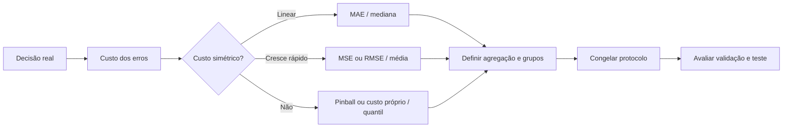
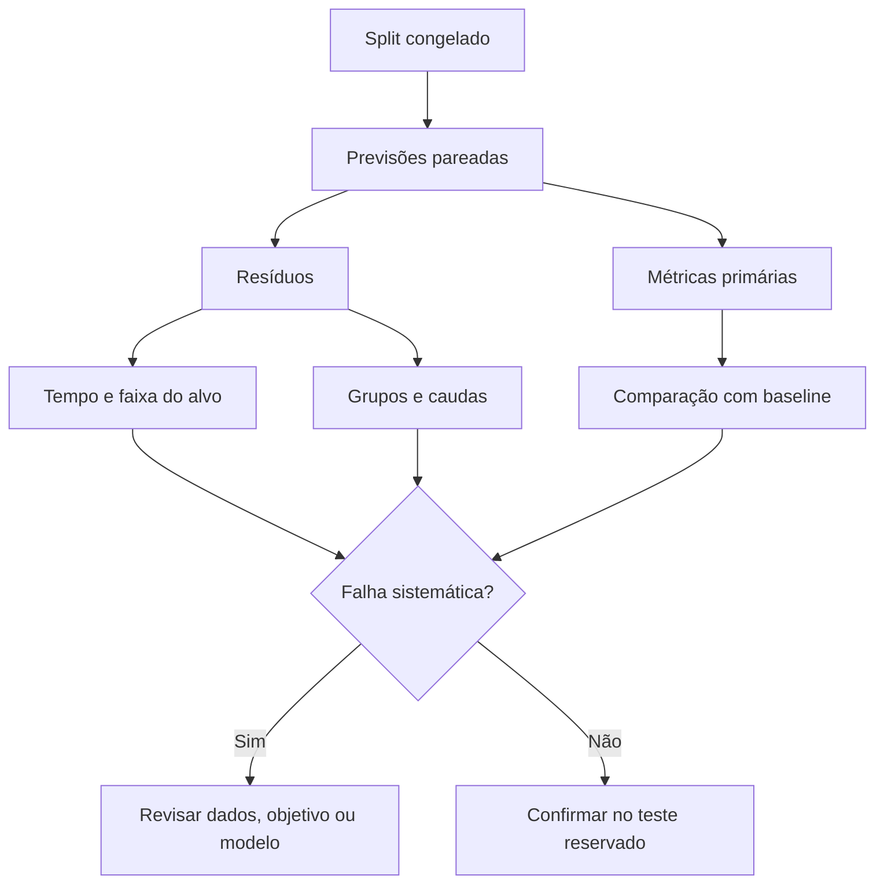

<!-- mirandastech-aula-v2 -->

# Aula 13 — Métricas de regressão: MAE, MSE, RMSE, R² e erro relativo

[](https://colab.research.google.com/github/joaopaulomirandamatias/ai-lab/blob/main/03-machine-learning/notebooks/13-metricas-regressao-laboratorio.ipynb)

**Trilha:** Especialista em IA  
**Módulo:** 03 · Machine Learning clássico (M4)  
**Pré-requisito:** [Aula 12 — Support Vector Machines: margens e kernels](12-svm-kernels.md)  
**Objetivo central:** escolher métricas de regressão que representem a decisão real, calculá-las corretamente e evitar conclusões enganosas.

> Um número não diz se um modelo é bom. Ele diz como o modelo se saiu segundo uma definição de erro, em uma população, unidade de análise e horizonte definidos.

## Problema motivador: duas previsões, a mesma MAE

Um sistema prevê demanda diária. Dois modelos produzem erros absolutos:

| Dia | Modelo A | Modelo B |
|---:|---:|---:|
| 1 | 2 | 0 |
| 2 | 2 | 0 |
| 3 | 2 | 0 |
| 4 | 2 | 8 |

Ambos têm MAE igual a 2 unidades. Porém, o Modelo B concentra todo o erro em um dia. Se um desvio de 8 causa ruptura de estoque, tratá-los como equivalentes é uma decisão ruim. O RMSE vale 2 para A e 4 para B, pois penaliza mais o erro extremo.

A lição é geral: **a métrica codifica uma preferência operacional**. Antes de calcular, pergunte qual decisão a previsão sustentará e quanto custam erros de tamanhos e sinais diferentes.

## Objetivos de aprendizagem

Ao final, você será capaz de:

- calcular MAE, MSE, RMSE e \(R^2\) manualmente e com `scikit-learn`;
- explicar por que MAE favorece a mediana condicional e MSE favorece a média condicional;
- interpretar \(R^2\), inclusive valores negativos e casos degenerados;
- reconhecer os limites de MAPE, WAPE, sMAPE e MASE;
- escolher uma métrica coerente com unidade, escala, assimetria de custo e população;
- agregar erros sem introduzir vieses por lote, grupo ou volume;
- definir um painel mínimo de métricas antes de consultar o teste.

## Pré-requisitos

Você deve conhecer média, mediana, variância, resíduos, e os papéis de treino, validação e teste. A [Aula 04](04-regressao-linear-minimos-quadrados.md) introduziu mínimos quadrados; esta aula separa a função usada para treinar da evidência usada para decidir.

## Vocabulário essencial

| Termo | Significado |
|---|---|
| **alvo** \(y_i\) | valor real da observação \(i\) |
| **previsão** \(\hat y_i\) | valor estimado pelo modelo |
| **resíduo** \(e_i=y_i-\hat y_i\) | erro com sinal; positivo indica subprevisão |
| **perda** | penalidade aplicada a uma observação |
| **métrica** | resumo do desempenho em um conjunto |
| **funcional-alvo** | propriedade prevista: média, mediana ou quantil |
| **baseline** | regra simples e congelada usada como referência |
| **microagregação** | calcula juntando todas as observações |
| **macroagregação** | calcula por grupo e dá o mesmo peso a cada grupo |

## 1. Do resíduo à decisão

Para \(n\) observações, defina:

\[
e_i=y_i-\hat y_i,\qquad i=1,\ldots,n.
\]

O sinal diagnostica viés, mas positivos e negativos se cancelariam em uma média simples. Métricas usuais aplicam uma função \(L(e_i)\):

\[
\text{erro médio}=\frac{1}{n}\sum_{i=1}^{n}L(e_i).
\]

A escolha de \(L\) determina o peso de erros grandes e a propriedade da distribuição ótima em expectativa. “Otimizar uma métrica” não é uma decisão neutra.



## 2. MAE: custo linear

O erro absoluto médio é

\[
\operatorname{MAE}=\frac{1}{n}\sum_{i=1}^{n}|y_i-\hat y_i|.
\]

Cada unidade adicional de erro adiciona a mesma penalidade. A MAE tem a unidade do alvo, é menos dominada por poucos extremos que MSE e corresponde, sob custo absoluto simétrico, à **mediana condicional**. Dizer que é “robusta a outliers” exige cuidado: um extremo ainda a aumenta, apenas não é elevado ao quadrado.

Para previsão constante \(a\), minimizar \(\mathbb{E}[|Y-a|]\) produz uma mediana de \(Y\). Mover \(a\) para a direita reduz distâncias aos valores à direita e aumenta distâncias aos da esquerda; o equilíbrio ocorre quando ao menos metade da massa está de cada lado.

## 3. MSE e RMSE: erros grandes pesam mais

O erro quadrático médio é

\[
\operatorname{MSE}=\frac{1}{n}\sum_{i=1}^{n}(y_i-\hat y_i)^2.
\]

Dobrar \(|e_i|\) quadruplica sua contribuição. O MSE tem unidade ao quadrado. Sua raiz retorna à unidade original:

\[
\operatorname{RMSE}=
\sqrt{\frac{1}{n}\sum_{i=1}^{n}(y_i-\hat y_i)^2}.
\]

MSE e RMSE ordenam igualmente modelos avaliados nas mesmas observações e pesos, pois a raiz é crescente. Sob perda quadrática, a previsão ótima é a **média condicional**:

\[
a^\star=\arg\min_a\mathbb{E}[(Y-a)^2]=\mathbb{E}[Y].
\]

### Armadilha de agregação

Não faça a média dos RMSEs de lotes com tamanhos diferentes. Some erros quadráticos e só então extraia a raiz:

\[
\operatorname{RMSE}_{global}
=\sqrt{\frac{\sum_b\operatorname{SSE}_b}{\sum_b n_b}},
\]

em que \(\operatorname{SSE}_b=\sum_{i\in b}e_i^2\). A média simples dá o mesmo peso a um lote de 10 e a outro de 10 mil exemplos.

## 4. Exemplo resolvido

Considere \(y=[10,12,18]\) e \(\hat y=[9,15,17]\).

1. Resíduos: \(e=[1,-3,1]\).
2. Erros absolutos: \([1,3,1]\).
3. Erros quadráticos: \([1,9,1]\).

Logo,

\[
\operatorname{MAE}=\frac{5}{3}\approx1{,}667,
\]

\[
\operatorname{MSE}=\frac{11}{3}\approx3{,}667,\qquad
\operatorname{RMSE}=\sqrt{\frac{11}{3}}\approx1{,}915.
\]

A média observada é \(\bar y=13{,}333\), e

\[
\operatorname{SST}=\sum_i(y_i-\bar y)^2\approx34{,}667.
\]

Como \(\operatorname{SSE}=11\), \(R^2=1-11/34{,}667\approx0{,}683\). As medidas descrevem o mesmo conjunto sob lentes diferentes.

## 5. \(R^2\): comparação, não porcentagem causal

A definição usual no conjunto de avaliação é

\[
R^2
=1-\frac{\sum_i(y_i-\hat y_i)^2}
{\sum_i(y_i-\bar y)^2},
\qquad
\bar y=\frac{1}{n}\sum_i y_i.
\]

O denominador é o erro de prever a **média do próprio conjunto avaliado**:

- \(R^2=1\): previsões perfeitas;
- \(R^2=0\): mesmo SSE que essa referência;
- \(R^2<0\): SSE pior que a referência;
- não há limite inferior.

\(R^2=0{,}68\) não significa que o modelo “explica causalmente 68%” do fenômeno. Também não revela se o erro é aceitável.

Se todos os \(y_i\) são iguais, o denominador é zero. O `scikit-learn` converte casos não finitos por padrão para valores convenientes à seleção; use `force_finite=False` para auditar o caso bruto. Com uma observação, \(R^2\) não é definido.

### Baseline operacional é outra quantidade

Se a referência válida é a média do treino, uma previsão sazonal ou o modelo implantado, declare um *skill score*:

\[
S=1-\frac{\sum_i(y_i-\hat y_i)^2}
{\sum_i(y_i-\hat y_i^{\,base})^2}.
\]

Ele se parece com \(R^2\), mas responde a outra pergunta. Não substitua silenciosamente \(\bar y\) pela média do treino na fórmula padrão.

## 6. Métricas relativas

### MAPE

\[
\operatorname{MAPE}
=\frac{100}{n}\sum_i\left|\frac{y_i-\hat y_i}{y_i}\right|.
\]

A leitura percentual é atraente, mas MAPE é indefinida em \(y_i=0\), explode perto de zero, trata sobre e subprevisão assimetricamente e não faz sentido se o zero é arbitrário, como em Celsius. Adicionar \(\epsilon\) muda a métrica e pode mudar o ranking; o valor precisaria de justificativa do domínio.

### WAPE

\[
\operatorname{WAPE}
=\frac{\sum_i|y_i-\hat y_i|}{\sum_i|y_i|}.
\]

Evita divisões individuais, mas grupos de grande volume dominam. Se \(\sum_i|y_i|=0\), também é indefinida.

### sMAPE

\[
\operatorname{sMAPE}
=\frac{100}{n}\sum_i
\frac{2|y_i-\hat y_i|}{|y_i|+|\hat y_i|}.
\]

É limitada quando o denominador não é zero, porém possui variantes incompatíveis e continua problemática em zero/zero. Registre a fórmula, não só o nome.

### MASE

Para série temporal com sazonalidade \(m\), escale o MAE pelo erro ingênuo calculado **somente no treino**:

\[
\operatorname{MASE}
=
\frac{\frac{1}{n}\sum_{i=1}^{n}|y_i-\hat y_i|}
{\frac{1}{T-m}\sum_{t=m+1}^{T}|y_t^{train}-y_{t-m}^{train}|}.
\]

MASE menor que 1 indica erro médio menor que o baseline ingênuo. Ela compara escalas, mas exige ordem temporal e denominador não nulo.

| Métrica | Unidade | Funcional | Vantagem | Limite |
|---|---|---|---|---|
| MAE | alvo | mediana | direta e linear | suaviza extremos |
| MSE | alvo² | média | conveniente para otimização | unidade pouco intuitiva |
| RMSE | alvo | média | destaca erros grandes | dominada por extremos |
| \(R^2\) | adimensional | ranking quadrático | referência relativa | não mede aceitabilidade |
| MAPE | % | depende | familiar | zeros e assimetria |
| WAPE | razão | — | erro agregado | volume domina |
| sMAPE | % | — | geralmente limitada | variantes e zero/zero |
| MASE | adimensional | mediana relativa | compara escalas | exige baseline temporal |

## 7. Custos assimétricos: perda pinball

Se subprever custa mais que sobreprever, métricas simétricas não representam a decisão. Para \(u=y-\hat y\),

\[
\rho_\tau(u)=
\begin{cases}
\tau u, & u\ge 0,\\
(\tau-1)u, & u<0.
\end{cases}
\]

Minimizá-la estima o quantil condicional \(\tau\). Com \(\tau=0{,}9\), subprevisões recebem peso 0,9 e sobreprevisões, 0,1. Isso muda explicitamente a pergunta para um quantil alto.

## 8. Peso, grupo e unidade de análise

`sample_weight` é adequado quando observações representam exposições ou custos documentados. Não o use para esconder segmentos difíceis. Registre a origem dos pesos.

Mil previsões de um produto de alto volume e dez de um produto raro ilustram a diferença:

- **micro:** junta observações e será dominada pelo primeiro produto;
- **macro:** calcula por produto e dá igual peso aos produtos, mas torna cada observação rara influente.

Reporte métrica global, distribuição por grupo, pior grupo, tamanhos amostrais e variação entre folds ou seeds. Eventos repetidos por usuário, paciente, loja ou dispositivo precisam respeitar a unidade de decisão.

## 9. Diagnóstico além do escalar

Inspecione média e mediana dos resíduos, faixas do alvo e da previsão, tempo, grupos, caudas, gráfico real × previsto e maiores erros com contexto.



Se o modelo foi treinado em \(\log(1+y)\), avaliar só na escala transformada responde a outra pergunta. Inverta para a unidade operacional. Como \(\mathbb{E}[\exp Z]\neq\exp(\mathbb{E}[Z])\), exponenciar a média logarítmica pode introduzir viés de retransformação.

## 10. Laboratório reproduzível

O notebook [`13-metricas-regressao-laboratorio.ipynb`](../notebooks/13-metricas-regressao-laboratorio.ipynb) executa, sem dados externos:

- implementação manual conferida contra `scikit-learn`;
- mesma MAE com RMSEs diferentes;
- curva de sensibilidade a outlier;
- \(R^2\) negativo e baseline separado;
- instabilidade de MAPE;
- média, mediana e quantil como funcionais;
- RMSE global versus média ingênua por lote;
- micro e macroagregação por grupo;
- testes automáticos.

**Dependências mínimas:** Python 3.10, NumPy 1.24, pandas 2.0, Matplotlib 3.7 e scikit-learn 1.3. A seed é `20260908` e os dados são sintéticos.

```python
from sklearn.metrics import mean_absolute_error, mean_squared_error, r2_score

mae = mean_absolute_error(y_true, y_pred)
mse = mean_squared_error(y_true, y_pred)
rmse = mse ** 0.5
r2 = r2_score(y_true, y_pred)
```

Na validação cruzada, nomes como `neg_mean_absolute_error` são negados porque *scorers* adotam “maior é melhor”; reverta o sinal antes de comunicar o erro.

## 11. Armadilhas comuns

- escolher a métrica depois de ver qual favorece o modelo;
- chamar RMSE de “erro típico” sem examinar a cauda;
- comparar erros entre alvos de escalas diferentes;
- interpretar \(R^2\) como porcentagem causal;
- usar MAPE com zeros ou quase zeros;
- modificar a fórmula de \(R^2\) sem renomeá-la;
- fazer média simples de RMSEs de lotes desiguais;
- misturar horizonte, grupos ou versões do alvo;
- selecionar o modelo no conjunto de teste;
- avaliar apenas em log quando a decisão ocorre na escala original.

## 12. Checklist prático

Antes:

- [ ] Declare unidade, horizonte e instante da previsão.
- [ ] Traduza custo de sub e sobreprevisão.
- [ ] Escolha média, mediana ou quantil.
- [ ] Defina métrica primária, guardrails e baseline.
- [ ] Congele split, grupos, pesos e agregação.
- [ ] Determine o tratamento de zeros e ausentes.

Depois:

- [ ] Calcule métricas nos mesmos exemplos pareados.
- [ ] Verifique resíduos, caudas, tempo e grupos.
- [ ] Confirme unidades e fórmulas.
- [ ] Reagregue SSE para o RMSE global.
- [ ] Consulte o teste apenas após selecionar.
- [ ] Registre versões, seed, limitações e resultados.

## 13. Resumo

- MAE penaliza linearmente e se alinha à mediana.
- MSE e RMSE penalizam quadraticamente e se alinham à média.
- \(R^2\) compara SSE à dispersão do alvo avaliado, pode ser negativo e não é causal.
- MAPE, WAPE, sMAPE e MASE respondem a perguntas diferentes e têm limites.
- Pinball representa custos assimétricos mediante quantis.
- Métrica, população, pesos, horizonte e agregação formam um contrato único.
- Um escalar deve vir acompanhado de resíduos e baseline.

## 14. Exercícios com respostas comentadas

### 1. MAE igual, risco diferente

Para \(A=[2,2,2,2]\) e \(B=[0,0,0,8]\), calcule MAE e RMSE.

**Resposta:** ambos têm MAE 2. Para A, RMSE 2. Para B, \(\sqrt{64/4}=4\). Se o custo é superlinear, B é pior.

### 2. \(R^2\) negativo

SST é 100 e SSE do modelo é 160. Qual é o \(R^2\)?

**Resposta:** \(1-160/100=-0{,}6\). O erro quadrático é pior que a referência baseada na média avaliada.

### 3. MAPE e zero

Para \(y=[0,100]\) e \(\hat y=[1,90]\), por que MAPE falha?

**Resposta:** o primeiro termo divide por zero. Trocá-lo por \(\epsilon\) faria um erro absoluto de 1 dominar arbitrariamente. Prefira unidade original ou razão agregada coerente.

### 4. Média ou mediana?

Tempos são \([4,5,5,6,60]\). Qual constante minimiza MSE e qual minimiza MAE?

**Resposta:** a média 16 minimiza MSE; a mediana 5 minimiza MAE. O extremo desloca a média.

### 5. Custo assimétrico

Subprever capacidade custa nove vezes mais que sobreprever igualmente. O que usar?

**Resposta:** um quantil alto, como \(\tau=0{,}9\), avaliado por pinball. O quantil exato deve derivar do custo real.

### 6. Agregação por lote

Um lote de 100 exemplos tem RMSE 1; outro de 1 exemplo tem RMSE 10. A média 5,5 é global?

**Resposta:** não. SSE total \(=100\cdot1^2+1\cdot10^2=200\); RMSE global \(=\sqrt{200/101}\approx1{,}407\).

### 7. Projeto aplicado

Defina um painel para duração de chamados com casos raros muito longos.

**Resposta comentada:** use MAE como leitura central; RMSE ou percentil do erro como guardrail; viés médio; cortes por fila/prioridade; e baseline congelado. Evite MAPE se houver tempos próximos de zero. Preserve o teste até a escolha final.

## 15. Conexões com IA e sistemas reais

Essas métricas aparecem em previsão de demanda, custo, energia e latência; manutenção preditiva; duração; valor de cliente; e propriedades numéricas estimadas por sistemas de IA.

Um escore automático contínuo de um sistema generativo pode ser tratado como alvo de regressão, mas não vira “verdade”: validade do rótulo, erro do avaliador e diferenças entre grupos continuam essenciais. O módulo 13 retomará sistemas completos; aqui o foco é o contrato matemático de um alvo numérico.

## Referências técnicas

1. scikit-learn. [Metrics and scoring: regression metrics](https://scikit-learn.org/stable/modules/model_evaluation.html#regression-metrics). Consultado em 8 set. 2026.
2. scikit-learn. [`r2_score`](https://scikit-learn.org/stable/modules/generated/sklearn.metrics.r2_score.html). Definição, casos não finitos e `force_finite`.
3. GNEITING, T. [Making and Evaluating Point Forecasts](https://doi.org/10.1198/jasa.2011.r10138). *Journal of the American Statistical Association*, v. 106, 2011.
4. HYNDMAN, R. J.; KOEHLER, A. B. [Another look at measures of forecast accuracy](https://doi.org/10.1016/j.ijforecast.2006.03.001). *International Journal of Forecasting*, v. 22, 2006.

## Material complementar

- JAMES, G. et al. [An Introduction to Statistical Learning](https://www.statlearning.com/).
- MURPHY, K. P. [Probabilistic Machine Learning: An Introduction](https://probml.github.io/pml-book/book1.html).

## Próxima aula

Na **Aula 14 — Métricas de classificação: matriz de confusão, precision, recall e F1**, sairemos de alvos contínuos para decisões categóricas e veremos como a taxa-base altera a leitura das métricas.
