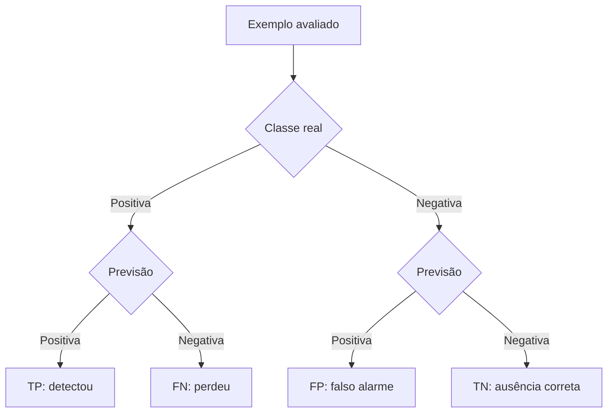
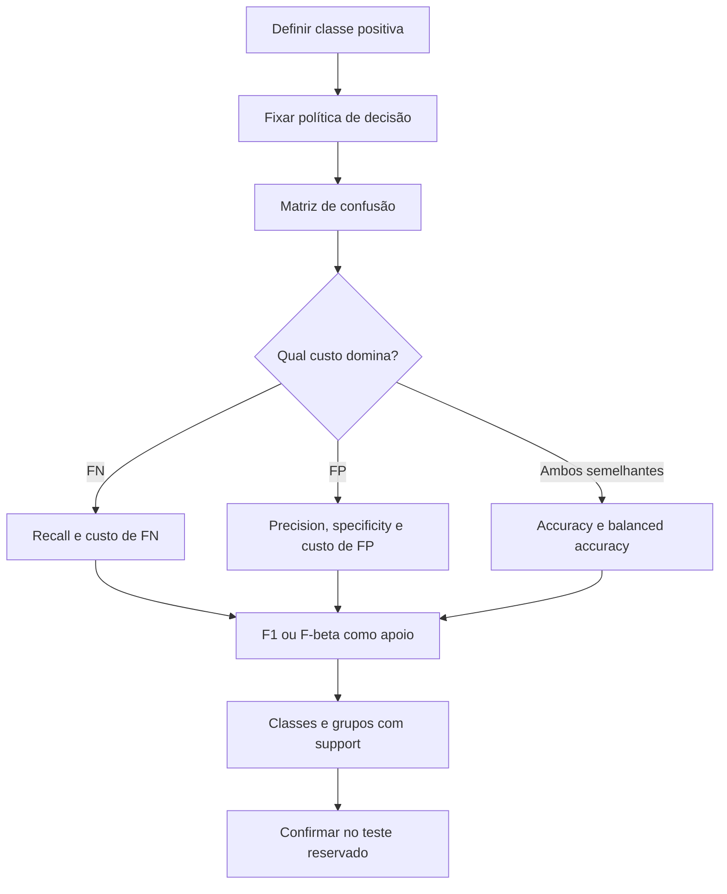

<!-- mirandastech-aula-v2 -->

# Aula 14 — Métricas de classificação: matriz de confusão, precision, recall e F1

[](https://colab.research.google.com/github/joaopaulomirandamatias/ai-lab/blob/main/03-machine-learning/notebooks/14-metricas-classificacao-laboratorio.ipynb)

**Trilha:** Especialista em IA  
**Módulo:** 03 · Machine Learning clássico (M4)  
**Pré-requisito:** [Aula 13 — Métricas de regressão](13-metricas-regressao.md)  
**Objetivo central:** transformar acertos e erros de classificação em medidas coerentes com a decisão real.

> Em classificação, “acertar 97%” pode descrever tanto um sistema útil quanto um sistema que ignora quase todos os casos importantes. A matriz de confusão revela qual situação ocorreu.

## Problema motivador: alta accuracy, falha grave

Uma triagem processa 1.000 eventos. Há 60 casos realmente críticos; o sistema identifica 40, perde 20 e gera 10 alarmes falsos. Ele acerta 970 eventos, portanto sua accuracy é 97%.

O número parece excelente, mas o sistema perde um terço dos casos críticos:

\[
\operatorname{recall}=\frac{40}{40+20}=0{,}667.
\]

Se um falso negativo interrompe uma operação ou deixa uma fraude passar, a accuracy isolada responde à pergunta errada. Precisamos nomear a classe positiva, contar os quatro resultados possíveis e ligar cada erro ao seu custo.

## Objetivos de aprendizagem

Ao final, você será capaz de:

- construir e ler uma matriz de confusão binária;
- calcular accuracy, precision, recall, specificity, NPV, F1 e \(F_\beta\);
- demonstrar por que a prevalência altera precision mesmo sem mudar sensibilidade e especificidade;
- reconhecer quando accuracy é útil e quando esconde a classe rara;
- distinguir médias macro, micro e ponderada em classificação multiclasse;
- tratar denominadores nulos explicitamente;
- comparar métricas por grupo e custo sem consultar o conjunto de teste para redesenhar a política.

## Pré-requisitos

Você deve conhecer classificação binária, probabilidades e divisão treino–validação–teste. A [Aula 06](06-regressao-logistica-classificacao-probabilistica.md) apresentou scores e probabilidades; esta aula avalia **rótulos decididos por uma política já fixada**. Curvas, escolha de threshold e calibração ficam para a Aula 15.

## Vocabulário

| Termo | Significado |
|---|---|
| classe positiva | evento que queremos detectar; deve ser declarado |
| classe negativa | ausência do evento positivo |
| TP | positivo real previsto como positivo |
| FP | negativo real previsto como positivo |
| FN | positivo real previsto como negativo |
| TN | negativo real previsto como negativo |
| prevalência | proporção de positivos reais, \((TP+FN)/n\) |
| support | número de ocorrências reais de uma classe |
| erro tipo operacional | custo concreto ligado a FP ou FN, não apenas sua contagem |
| limiar ou threshold | regra que converte score em rótulo; será aprofundada na Aula 15 |

## 1. A matriz de confusão

Considere positivo como “fraude” e negativo como “transação legítima”:

|  | Previsto positivo | Previsto negativo |
|---|---:|---:|
| **Real positivo** | TP: fraude bloqueada | FN: fraude liberada |
| **Real negativo** | FP: transação legítima bloqueada | TN: transação legítima liberada |



A orientação gráfica varia entre livros. No `scikit-learn`, `confusion_matrix(y_true, y_pred)` usa **linhas como classes reais** e **colunas como classes previstas**. Para rótulos binários ordenados como 0 e 1:

```python
tn, fp, fn, tp = confusion_matrix(y_true, y_pred, labels=[0, 1]).ravel()
```

Fixar `labels=[0, 1]` documenta a ordem. Sem essa clareza, uma transposição silenciosa troca FP por FN.

## 2. Métricas condicionadas aos casos reais

### Recall, sensibilidade ou TPR

\[
\operatorname{recall}
=\frac{TP}{TP+FN}.
\]

Pergunta: **entre todos os positivos reais, quantos detectamos?** É central quando perder um positivo custa caro. Recall alto não garante poucos falsos alarmes.

### Specificity ou TNR

\[
\operatorname{specificity}
=\frac{TN}{TN+FP}.
\]

Pergunta: **entre os negativos reais, quantos rejeitamos corretamente?** Sua complementar é a taxa de falsos positivos:

\[
\operatorname{FPR}=1-\operatorname{specificity}=\frac{FP}{FP+TN}.
\]

Recall e specificity condicionam pela classe **real**. Por isso são menos diretamente afetados pela prevalência que precision, embora possam mudar se o perfil dos casos mudar.

### Balanced accuracy

\[
\operatorname{balanced\ accuracy}
=\frac{\operatorname{recall}+\operatorname{specificity}}{2}.
\]

Ela dá o mesmo peso às duas classes reais. É útil como resumo em desbalanceamento, mas ainda presume que sensibilidade e especificidade merecem pesos iguais.

## 3. Métricas condicionadas às decisões

### Precision ou valor preditivo positivo

\[
\operatorname{precision}
=\frac{TP}{TP+FP}.
\]

Pergunta: **entre os alarmes emitidos, quantos eram positivos reais?** É importante quando cada alarme consome revisão, bloqueia usuário ou gera intervenção.

### NPV, valor preditivo negativo

\[
\operatorname{NPV}
=\frac{TN}{TN+FN}.
\]

Pergunta: **entre os casos liberados como negativos, quantos realmente eram negativos?**

Precision e NPV dependem da composição da população. Um teste com a mesma sensibilidade e especificidade pode ter precision muito menor em uma população onde o evento positivo é raro.

## 4. Accuracy e taxa-base

\[
\operatorname{accuracy}
=\frac{TP+TN}{TP+FP+FN+TN}.
\]

Accuracy responde à proporção total de decisões corretas. Ela pode ser adequada quando:

- classes têm frequências semelhantes ou a prevalência de uso está representada;
- FP e FN têm custos aproximadamente iguais;
- todas as observações têm importância comparável;
- há baseline explícito e análise das classes.

Em uma base com 1% de positivos, prever “negativo” sempre alcança 99% de accuracy e recall zero. Compare qualquer modelo com esse `DummyClassifier` e nunca use a taxa bruta de acerto sem informar prevalência.

## 5. Exemplo resolvido passo a passo

Para \(TP=40\), \(FP=10\), \(FN=20\), \(TN=930\):

\[
\operatorname{precision}=\frac{40}{50}=0{,}800,
\qquad
\operatorname{recall}=\frac{40}{60}=0{,}667,
\]

\[
\operatorname{specificity}=\frac{930}{940}\approx0{,}989,
\qquad
\operatorname{NPV}=\frac{930}{950}\approx0{,}979.
\]

Accuracy:

\[
\frac{40+930}{1000}=0{,}970.
\]

Balanced accuracy:

\[
\frac{0{,}667+0{,}989}{2}\approx0{,}828.
\]

A accuracy alta reflete sobretudo os 940 negativos. Recall mostra que 20 de 60 positivos foram perdidos; precision mostra que 10 de 50 alarmes eram falsos.

## 6. F1 e \(F_\beta\)

F1 é a média harmônica de precision \(P\) e recall \(R\):

\[
F_1=2\frac{PR}{P+R}
=\frac{2TP}{2TP+FP+FN}.
\]

No exemplo:

\[
F_1=\frac{80}{80+10+20}\approx0{,}727.
\]

A média harmônica cai quando uma das parcelas é baixa. Porém, F1:

- ignora TN;
- não representa um custo monetário automaticamente;
- dá peso simétrico a precision e recall;
- pode ser indefinida quando não há TP, FP nem FN.

A generalização é

\[
F_\beta=(1+\beta^2)\frac{PR}{\beta^2P+R}.
\]

- \(\beta>1\): recall recebe mais peso;
- \(\beta<1\): precision recebe mais peso;
- \(\beta=1\): recupera F1.

O quadrado de \(\beta\), não \(\beta\), é o fator de peso relativo na fórmula. Ainda assim, \(F_\beta\) é um compromisso matemático, não uma tabela de custos. Se o domínio conhece \(c_{FP}\) e \(c_{FN}\), reporte também:

\[
\operatorname{custo\ médio}
=\frac{c_{FP}FP+c_{FN}FN}{n}.
\]

A política que gerou os rótulos deve ser fixada na validação. Usar o teste para escolher o threshold contamina a avaliação.

## 7. Prevalência muda precision

Se sensibilidade \(s\), taxa de falsos positivos \(f\) e prevalência \(\pi=P(Y=1)\) permanecem fixas, então

\[
\operatorname{precision}
=\frac{s\pi}{s\pi+f(1-\pi)}.
\]

Exemplo: \(s=0{,}90\) e \(f=0{,}05\).

| Prevalência | Precision esperada |
|---:|---:|
| 50% | 94,7% |
| 10% | 66,7% |
| 1% | 15,4% |
| 0,1% | 1,8% |

O classificador não mudou; a taxa-base mudou. Isso explica por que precision medida em um dataset artificialmente balanceado não pode ser transportada diretamente à produção. Reporte a prevalência da avaliação e compare-a com a população de uso.

## 8. Multiclasse: uma classe por vez

Para \(K\) classes mutuamente exclusivas, a matriz é \(K\times K\). A diagonal contém acertos; a célula \((i,j)\) conta exemplos da classe real \(i\) previstos como \(j\).

Para calcular precision e recall da classe \(k\), trate-a como positiva e todas as outras como negativas (*one-vs-rest*). Isso produz uma métrica por classe. Depois escolha a agregação:

| `average` | Cálculo | Pergunta respondida |
|---|---|---|
| `None` | uma métrica por classe | onde o sistema falha? |
| `macro` | média simples das classes | como vai a classe típica, dando igual peso? |
| `weighted` | média ponderada pelo support | como vai uma observação típica da amostra? |
| `micro` | soma TP, FP e FN antes da razão | como vai o conjunto total de decisões? |

Em multiclasse de rótulo único, micro-precision, micro-recall e micro-F1 coincidem com accuracy. `weighted` pode esconder classe rara; `macro` pode variar muito se uma classe tiver pouquíssimos exemplos. Portanto, mostre support e métricas por classe antes do resumo.

A média `samples` pertence a problemas **multilabel**, nos quais cada exemplo pode ter vários rótulos. Não a use como sinônimo de macro ou micro.

## 9. Denominadores nulos não são zero “por natureza”

Se o modelo nunca prevê positivo, \(TP+FP=0\): precision não está matematicamente definida. Se a avaliação não contém positivos reais, \(TP+FN=0\): recall também não está definido.

No `scikit-learn`, configure `zero_division` de forma explícita:

- `zero_division=0`: devolve zero;
- `zero_division=1`: devolve um;
- `zero_division=np.nan`: devolve NaN e o exclui de algumas médias;
- `"warn"`: comporta-se como zero e emite aviso.

A decisão deve aparecer no protocolo. Zero pode ser uma penalidade operacional sensata, mas não transforma a fração indefinida em identidade matemática.

## 10. Métricas por grupo e unidade de análise

Uma boa média global pode coexistir com recall baixo em uma região, equipamento, faixa etária ou tipo de documento. Para cada corte relevante, reporte:

1. support;
2. prevalência;
3. matriz de confusão;
4. precision e recall;
5. incerteza amostral;
6. justificativa para o corte.

Não conclua desigualdade apenas por pequenas diferenças em grupos minúsculos. Ao mesmo tempo, não use o resumo ponderado para apagar uma falha sistemática. A unidade de análise — pessoa, evento, sessão ou dispositivo — deve coincidir com a decisão real e com o split.



## 11. Laboratório reproduzível

O notebook [`14-metricas-classificacao-laboratorio.ipynb`](../notebooks/14-metricas-classificacao-laboratorio.ipynb) usa vetores sintéticos e seed `20260908` para:

- reconstruir TP, FP, FN e TN manualmente;
- conferir métricas contra `scikit-learn`;
- demonstrar o baseline sempre negativo;
- calcular precision sob diferentes prevalências;
- comparar F1, \(F_{0,5}\) e \(F_2\);
- calcular custo de FP e FN para uma política fixa;
- comparar macro, micro e weighted em multiclasse;
- reconstruir uma classe no esquema one-vs-rest;
- revelar diferença de recall entre grupos;
- executar asserts e manter o notebook sem outputs no commit.

**Dependências mínimas:** Python 3.10, NumPy 1.24, pandas 2.0, Matplotlib 3.7 e scikit-learn 1.3. Os dados não exigem download, rede ou credenciais.

## 12. Armadilhas comuns

- não declarar qual rótulo é positivo;
- transpor a matriz e trocar FP por FN;
- usar accuracy sem prevalência e baseline;
- confundir precision (“dos alarmes”) com recall (“dos positivos reais”);
- afirmar que specificity alta implica poucos falsos alarmes em números absolutos;
- escolher F1 porque é popular, sem discutir TN e custos;
- reportar “F1” multiclasse sem dizer `average`;
- ocultar métricas por classe atrás do weighted-F1;
- transformar divisão indefinida em zero sem registrar `zero_division`;
- ajustar threshold no teste;
- comparar modelos em exemplos ou populações diferentes;
- ignorar support e incerteza de grupos pequenos.

## 13. Checklist prático

- [ ] Classe positiva e unidade de análise estão declaradas.
- [ ] Labels reais e previstos usam o mesmo vocabulário e ordem.
- [ ] Prevalência e baseline foram reportados.
- [ ] Matriz de confusão foi conferida antes dos resumos.
- [ ] FP e FN foram traduzidos em consequências reais.
- [ ] Métrica primária foi definida antes de abrir o teste.
- [ ] Accuracy vem acompanhada de recall, precision ou balanced accuracy.
- [ ] Em multiclasse, há métricas por classe, support e tipo de média.
- [ ] `zero_division` foi tratado explicitamente.
- [ ] Grupos relevantes foram auditados sem esconder tamanho amostral.
- [ ] Threshold e demais decisões foram fixados na validação.
- [ ] O teste reservado será consultado uma única vez.

## 14. Resumo

- A matriz de confusão é a fonte de TP, FP, FN e TN.
- Recall condiciona nos positivos reais; specificity, nos negativos reais.
- Precision condiciona nas previsões positivas; NPV, nas negativas.
- Accuracy pode ser dominada pela classe frequente.
- Balanced accuracy equilibra recall e specificity.
- F1 equilibra precision e recall, mas ignora TN e custo explícito.
- \(F_\beta\) muda a ênfase, sem substituir uma função de custo.
- Precision depende da prevalência.
- Macro, weighted e micro respondem a unidades de ponderação diferentes.
- Denominadores nulos e análises por grupo precisam de política explícita.

## 15. Exercícios com respostas comentadas

### 1. Cálculo binário

Para \(TP=80\), \(FP=20\), \(FN=40\), \(TN=860\), calcule precision, recall e accuracy.

**Resposta:** precision \(=80/100=0{,}80\); recall \(=80/120=0{,}667\); accuracy \(=(80+860)/1000=0{,}94\). A accuracy não revela sozinha os 40 positivos perdidos.

### 2. Baseline raro

Uma base tem 10 positivos e 990 negativos. O classificador sempre negativo possui qual accuracy e recall?

**Resposta:** accuracy 99% e recall 0%. O exemplo demonstra por que a taxa-base precisa acompanhar a accuracy.

### 3. Precision versus recall

Um filtro encaminha mensagens para revisão humana, cuja capacidade é limitada. Qual métrica observa diretamente a pureza da fila?

**Resposta:** precision, pois mede a proporção de positivos entre itens enviados. A decisão completa também precisa de recall para quantificar o que ficou de fora.

### 4. \(F_\beta\)

Quando \(F_2\) é mais apropriado que \(F_{0,5}\)?

**Resposta:** quando recall merece maior ênfase. \(F_2\) pesa recall quatro vezes em relação a precision na fórmula; \(F_{0,5}\) enfatiza precision.

### 5. Prevalência

Mantendo TPR e FPR, o que ocorre com precision quando a prevalência cai?

**Resposta:** em geral cai, porque os falsos positivos passam a competir com um número menor de positivos verdadeiros. A equação de Bayes da seção 7 quantifica o efeito.

### 6. Multiclasse

Um relatório mostra macro-F1 0,42 e weighted-F1 0,91. O que investigar?

**Resposta:** supports e F1 por classe. Classes frequentes provavelmente têm bom desempenho enquanto alguma classe rara falha; o peso por support preserva o valor alto.

### 7. Denominador nulo

O modelo não emitiu nenhum positivo. A precision é matematicamente zero?

**Resposta:** não; \(TP/(TP+FP)=0/0\) é indefinido. O software pode devolver zero por política. Registre `zero_division` e interprete como ausência de alarmes.

### 8. Custo

Com \(FP=30\), \(FN=4\), \(c_{FP}=R\$20\) e \(c_{FN}=R\$1.000\), qual é o custo total?

**Resposta:** \(30\cdot20+4\cdot1000=R\$4.600\). Apesar de haver mais FP, os FN dominam o custo. Isso não autoriza ajustar a política no teste.

## 16. Conexões com IA e sistemas reais

Essas métricas governam triagem médica, fraude, moderação, manutenção, alertas de segurança, classificação documental e filtros de agentes. Em RAG e LLMs, a mesma lógica aparece ao classificar relevância, detectar conteúdo inseguro ou decidir se uma resposta exige revisão humana.

A matriz de confusão avalia uma decisão categórica já tomada. Ela não mede qualidade do ranking nem honestidade das probabilidades. Essa separação evita misturar três perguntas: **quem vem primeiro**, **qual ação tomar** e **quão confiável é a probabilidade**.

## Referências técnicas

1. scikit-learn. [Classification metrics](https://scikit-learn.org/stable/modules/model_evaluation.html#classification-metrics). Documentação consultada em 8 set. 2026.
2. scikit-learn. [`confusion_matrix`](https://scikit-learn.org/stable/modules/generated/sklearn.metrics.confusion_matrix.html). Convenção de linhas reais e colunas previstas.
3. scikit-learn. [`precision_recall_fscore_support`](https://scikit-learn.org/stable/modules/generated/sklearn.metrics.precision_recall_fscore_support.html). Agregações, support e `zero_division`.
4. SOKOLOVA, M.; LAPALME, G. [A systematic analysis of performance measures for classification tasks](https://doi.org/10.1016/j.ipm.2009.03.002). *Information Processing & Management*, v. 45, 2009.

## Material complementar

- JAMES, G. et al. [An Introduction to Statistical Learning](https://www.statlearning.com/).
- MURPHY, K. P. [Probabilistic Machine Learning: An Introduction](https://probml.github.io/pml-book/book1.html).

## Próxima aula

Na **Aula 15 — ROC, Precision-Recall, thresholds e calibração**, avaliaremos scores antes da decisão, escolheremos políticas na validação e separaremos capacidade de ranking de qualidade probabilística.
