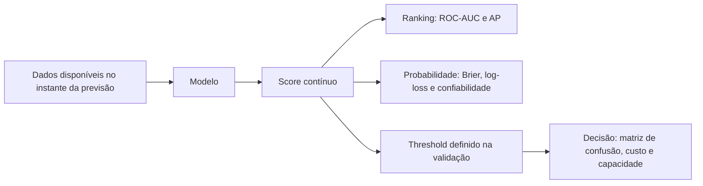
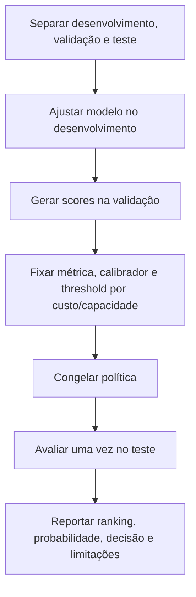

# Aula 15 — ROC, Precision-Recall, thresholds e calibração

<!-- mirandastech-aula-v2 -->

**Trilha:** Especialista em IA  
**Módulo:** 03 · Machine Learning clássico (M4)  
**Pré-requisito:** [Aula 14 — Métricas de classificação](./14-metricas-classificacao.md)  
**Próxima aula:** [Aula 16 — Classes desbalanceadas](./16-classes-desbalanceadas.md)

Na aula anterior, uma matriz de confusão descreveu decisões já tomadas. Mas um classificador costuma produzir primeiro um **score** ou uma **probabilidade**; só depois uma política transforma esse número em ação. Misturar essas etapas leva a perguntas mal formuladas: um modelo pode ordenar os casos perfeitamente e ainda fornecer probabilidades ruins; pode estar bem calibrado e ser inútil para separar positivos de negativos; pode também ser bom, mas operar com um limiar incompatível com o custo real.

Nesta aula, você aprenderá a avaliar separadamente **ranking**, **decisão** e **qualidade probabilística**.

## Objetivos de aprendizagem

Ao final, você deverá conseguir:

- construir e interpretar curvas ROC e Precision-Recall;
- explicar ROC-AUC como probabilidade de ordenação por pares;
- distinguir average precision de uma área trapezoidal qualquer;
- escolher um threshold na validação por custo ou capacidade;
- avaliar probabilidades com Brier score, log-loss e diagrama de confiabilidade;
- aplicar calibração sem contaminar a avaliação final;
- registrar uma política de decisão auditável para um sistema de IA.

## Pré-requisitos e vocabulário

Você deve dominar TP, FP, FN, TN, precision e recall. O vocabulário novo é:

| Termo | Significado operacional |
|---|---|
| **score** | número contínuo usado para ordenar casos; não precisa ser probabilidade |
| **probabilidade prevista** | estimativa em $[0,1]$ que pretende representar frequência condicional |
| **threshold** ou limiar | valor que converte score em uma decisão binária |
| **ROC** | curva de TPR contra FPR ao variar o limiar |
| **PR** | curva de precision contra recall ao variar o limiar |
| **calibração** | concordância entre probabilidades previstas e frequências observadas |
| **sharpness** | capacidade de emitir probabilidades afastadas da prevalência sem perder calibração |

## 1. O problema real: triagem de alertas

Imagine um detector de incidentes que atribui risco a 100 mil eventos por dia. Três perguntas diferentes aparecem:

1. **Ranking:** eventos realmente críticos tendem a receber score maior?
2. **Decisão:** quais eventos devem abrir um chamado, dado o custo dos erros e a capacidade da equipe?
3. **Probabilidade:** entre eventos previstos com risco de 20%, aproximadamente 20% são críticos?

Cada pergunta requer métricas próprias.

ROC-AUC e AP não escolhem o limiar. Brier e log-loss não informam quantos alertas cabem na operação. Precision e recall em um ponto não descrevem todo o ranking. Separar as camadas é o primeiro mecanismo de controle.

## 2. Curva ROC: sensibilidade contra falsos alarmes

Para um limiar $t$, predizemos positivo quando $s_i \geq t$. Então:

$$
TPR(t)=\frac{TP(t)}{TP(t)+FN(t)},
\qquad
FPR(t)=\frac{FP(t)}{FP(t)+TN(t)}.
$$

O **true positive rate** é o recall da classe positiva. O **false positive rate** é a fração dos negativos que virou falso alarme. A curva ROC plota $TPR(t)$ no eixo vertical contra $FPR(t)$ no horizontal enquanto $t$ diminui. Com limiar acima de todos os scores, nenhum caso é positivo: $(0,0)$. Abaixo de todos, todos são positivos: $(1,1)$.

### 2.1 ROC-AUC como ranking

Sem empates, a área sob a ROC tem a interpretação:

$$
\operatorname{AUC}=P(S^+>S^-),
$$

em que $S^+$ é o score de um positivo aleatório e $S^-$ o de um negativo aleatório. Com empates, conta-se meio acerto:

$$
\operatorname{AUC}
=\frac{1}{n_+n_-}\sum_{i:y_i=1}\sum_{j:y_j=0}
\left[\mathbb{1}(s_i>s_j)+\frac{1}{2}\mathbb{1}(s_i=s_j)\right].
$$

Assim, AUC 0,80 significa que um positivo aleatório recebe score maior que um negativo aleatório em cerca de 80% dos pares, não que o classificador tem “80% de acurácia”.

Qualquer transformação estritamente crescente, como $s'=s^3$ para scores positivos, preserva a ordem e a ROC-AUC. Por isso, ROC-AUC **não mede calibração**.

### 2.2 Limites da ROC

Em eventos raros, uma FPR aparentemente pequena pode gerar muitos falsos positivos. Se há 99.000 negativos, FPR de 1% corresponde a 990 alertas falsos. A ROC continua matematicamente correta; ela apenas não mostra diretamente a pureza da fila positiva nem a carga absoluta de trabalho.

## 3. Curva Precision-Recall e average precision

A curva PR usa:

$$
Precision(t)=\frac{TP(t)}{TP(t)+FP(t)},
\qquad
Recall(t)=\frac{TP(t)}{TP(t)+FN(t)}.
$$

Ela responde: à medida que recuperamos mais positivos, qual fração dos alertas continua correta? Isso costuma ser mais revelador quando a classe positiva é rara e a atenção está nos alertas positivos.

A **average precision** (AP) resume a curva como soma ponderada pelos incrementos de recall:

$$
AP=\sum_k \left(R_k-R_{k-1}\right)P_k,
$$

em que $P_k$ e $R_k$ são precision e recall no ponto $k$. Essa definição em degraus não é, em geral, idêntica à integração trapezoidal de precision contra recall. Ao reportar “PR-AUC”, declare qual cálculo foi usado; neste módulo, usaremos `average_precision_score`.

Para um ranking aleatório, a precision esperada é aproximadamente a prevalência $\pi=P(Y=1)$. Logo, AP 0,20 pode ser extraordinária se $\pi=0,01$ e fraca se $\pi=0,40$. Comparações exigem contexto de prevalência.

| Pergunta | Métrica adequada | O que ela não resolve |
|---|---|---|
| O modelo ordena positivos acima de negativos? | ROC-AUC | threshold e calibração |
| A fila positiva permanece útil ao aumentar cobertura? | curva PR e AP | custo específico da operação |
| Quantos erros ocorrerão com a política escolhida? | matriz de confusão no threshold | qualidade global do ranking |
| As probabilidades têm significado frequencista? | Brier, log-loss e confiabilidade | capacidade operacional |

## 4. Exemplo resolvido: o ranking não mudou, a política mudou

Considere scores $[0{,}9,0{,}8,0{,}7,0{,}1]$ e rótulos $[1,0,1,0]$.

| Limiar | Predições | TP | FP | FN | TN | Precision | Recall |
|---:|---|---:|---:|---:|---:|---:|---:|
| 0,75 | $[1,1,0,0]$ | 1 | 1 | 1 | 1 | 0,50 | 0,50 |
| 0,65 | $[1,1,1,0]$ | 2 | 1 | 0 | 1 | 0,67 | 1,00 |

Os scores e sua ordem são idênticos; portanto ROC-AUC e AP não mudaram. Apenas o threshold — a política — mudou.

Para a AUC, há quatro pares positivo-negativo. Os positivos têm scores 0,9 e 0,7; os negativos, 0,8 e 0,1. Três dos quatro pares estão na ordem correta, então $AUC=3/4=0{,}75$.

## 5. Escolher o threshold é uma decisão

Um threshold deve refletir consequência, não conveniência estatística. Com custos $C_{FP}$ e $C_{FN}$, uma função simples na validação é:

$$
\widehat C(t)=\frac{C_{FP}FP(t)+C_{FN}FN(t)}{n}.
$$

Se as probabilidades forem calibradas, os custos das decisões corretas forem zero e não houver outras restrições, agir quando

$$
\hat p \geq \frac{C_{FP}}{C_{FP}+C_{FN}}
$$

minimiza o custo esperado por caso. Mas sistemas reais podem ter orçamento, capacidade diária, custos dependentes do caso ou múltiplas ações. Nesses cenários, uma regra como “revisar os 200 maiores riscos” pode ser mais fiel que um limiar fixo.

O protocolo honesto é:

Escolher o threshold que maximiza F1 no teste usa o teste como validação. O resultado deixa de ser uma estimativa independente. Se houver poucos dados, use previsões out-of-fold para seleção e reserve ainda assim um teste final quando a decisão for de alto impacto.

## 6. Calibração: 0,8 deve significar 80%

Idealmente, para todo $p$ relevante:

$$
P(Y=1\mid \hat p=p)=p.
$$

Como valores idênticos raramente se repetem, um **diagrama de confiabilidade** agrupa previsões em bins e compara a probabilidade média com a frequência observada. Pontos abaixo da diagonal indicam, em geral, excesso de confiança; acima, subconfiança. Bins vazios, poucos exemplos e escolhas de binning podem alterar a aparência. Sempre mostre também a quantidade de observações ou a distribuição das probabilidades.

Calibração sozinha não basta: prever a prevalência para todos pode ser calibrado em média, porém sem discriminação. Queremos probabilidades calibradas e **sharp**, isto é, capazes de se afastar responsavelmente da taxa-base.

### 6.1 Brier score e log-loss

Para classificação binária:

$$
BS=\frac{1}{n}\sum_{i=1}^{n}(\hat p_i-y_i)^2,
$$

$$
LogLoss=-\frac{1}{n}\sum_{i=1}^{n}
\left[y_i\log(\hat p_i)+(1-y_i)\log(1-\hat p_i)\right].
$$

Aqui, $n$ é o número de casos, $y_i\in\{0,1\}$ é o rótulo e $\hat p_i$ é a probabilidade prevista. Quanto menor, melhor. Ambas são **proper scoring rules**: em expectativa, incentivam reportar a probabilidade verdadeira. A log-loss pune previsões confiantes e erradas de modo especialmente severo.

No exemplo anterior:

$$
BS=\frac{(0{,}9-1)^2+(0{,}8-0)^2+(0{,}7-1)^2+(0{,}1-0)^2}{4}=0{,}1875.
$$

O falso positivo confiante em 0,8 contribui com 0,64 dos 0,75 pontos de erro quadrático somado. Importante: Brier não isola apenas calibração; também reflete resolução/refinamento e incerteza do problema.

O **ECE** (expected calibration error) é popular, mas depende dos bins, não é uma proper scoring rule e pode esconder erros compensatórios. Use-o, se necessário, como diagnóstico auxiliar — não como único placar.

## 7. Recalibração: sigmoid ou isotonic?

Um calibrador aprende um mapeamento do score bruto para probabilidade. Ele precisa receber dados que não foram usados para ajustar o modelo base.

| Método | Forma | Pontos fortes | Riscos |
|---|---|---|---|
| sigmoid/Platt | função logística paramétrica | estável com amostras menores; preserva ranking sem empates | limitado se a distorção não for sigmoidal |
| isotonic regression | função monotônica por partes | flexível para distorções não lineares | sobreajusta com poucos dados; cria empates |
| calibração via CV | previsões out-of-fold | usa dados com eficiência | protocolo e custo computacional mais complexos |

No scikit-learn, `CalibratedClassifierCV` automatiza a separação por folds. Para compreender o mecanismo, o laboratório ajusta uma regressão logística unidimensional aos logits de scores distorcidos em um conjunto de calibração separado.

Recalibrar pode melhorar Brier e log-loss sem alterar ROC-AUC. Isotonic pode alterar levemente métricas de ranking ao produzir empates. Nenhum calibrador corrige falta de sinal, leakage ou mudança de distribuição.

## 8. Laboratório reproduzível

O notebook desta aula usa dados sintéticos documentados, `numpy`, `matplotlib` e `scikit-learn`, com seed fixa. Ele:

1. confirma AUC manual por pares;
2. treina uma regressão logística em dados com prevalência baixa;
3. aplica transformação monotônica que preserva o ranking e degrada probabilidades;
4. mede ROC-AUC, AP, Brier e log-loss;
5. ajusta calibração sigmoid somente na validação;
6. escolhe threshold por custo somente na validação;
7. avalia a política congelada uma vez no teste;
8. executa asserts metodológicos e numéricos.

Dependências mínimas: Python 3.10, NumPy 1.24, Matplotlib 3.7 e scikit-learn 1.3. Os dados são gerados localmente; não há rede, credenciais nem arquivos externos.

## 9. Armadilhas e limites

- **Chamar AUC de acurácia.** AUC mede ordenação por pares, não acertos em um threshold.
- **Declarar “PR-AUC” sem definir a integração.** Informe AP ou a regra de área adotada.
- **Comparar AP entre populações sem registrar prevalência.** A referência muda.
- **Escolher threshold no teste.** Isso contamina a estimativa final.
- **Aplicar 0,5 por hábito.** Esse valor só é defensável sob hipóteses específicas de custo e calibração.
- **Tratar scores como probabilidades.** `decision_function` pode rankear bem e não pertencer a $[0,1]$.
- **Concluir calibração por um gráfico pequeno.** Relate contagens, incerteza e proper scores.
- **Calibrar e avaliar nos mesmos casos.** O calibrador também é um modelo e pode sobreajustar.
- **Ignorar drift.** A prevalência e a relação entre features e target podem mudar após o deploy.

## 10. Checklist prático

- [ ] Defini o evento positivo e a unidade de análise.
- [ ] Separei desenvolvimento, validação/calibração e teste antes de modelar.
- [ ] Reportei prevalência e um baseline.
- [ ] Escolhi ROC-AUC e/ou AP de acordo com a pergunta.
- [ ] Declarei como a área PR foi calculada.
- [ ] Avaliei Brier, log-loss e confiabilidade quando usei probabilidades.
- [ ] Especifiquei custos, capacidade ou restrições da decisão.
- [ ] Fixei calibrador e threshold sem consultar o teste.
- [ ] Reportei contagens absolutas de TP, FP, FN e TN no teste.
- [ ] Registrei seed, versões, split, parâmetros e limitações.

## 11. Conexões com IA e sistemas reais

As mesmas três camadas aparecem em sistemas modernos. Um reranker de RAG precisa ordenar evidências; um detector de conteúdo inseguro precisa de política de bloqueio; um roteador de modelos precisa estimar risco ou confiança; um agente pode exigir revisão humana acima de determinada probabilidade de dano. Em todos esses casos, uma métrica única esconde decisões distintas.

Para o **AI Systems Laboratory**, registre um artefato com quatro blocos: métrica de ranking, métrica probabilística, política de threshold/capacidade e matriz de custos. Esse contrato será reutilizado no Gate II e, mais adiante, nas avaliações de RAG e agentes.

## 12. Exercícios com respostas comentadas

### 1. Transformação monotônica

Um modelo troca $s$ por $s'=\sqrt{s}$, com $0\leq s\leq1$. O que ocorre com ROC-AUC e calibração?

**Resposta:** a raiz quadrada é estritamente crescente, então preserva a ordem e a ROC-AUC (salvo efeitos numéricos). As probabilidades mudam; em geral a calibração, o Brier e a log-loss também mudam.

### 2. Carga operacional

Há 100 positivos e 9.900 negativos. Em certo threshold, TPR = 0,80 e FPR = 0,02. Calcule TP, FP e precision.

**Resposta:** $TP=80$ e $FP=198$. Logo, $Precision=80/(80+198)\approx0{,}288$. Uma FPR de apenas 2% ainda gera mais falsos do que verdadeiros alertas.

### 3. Limiar por custo

Com probabilidades calibradas, $C_{FP}=1$ e $C_{FN}=9$, qual é o limiar teórico sob as hipóteses simplificadas da aula?

**Resposta:** $t=1/(1+9)=0{,}10$. Acima de 10%, o custo esperado de não agir supera o de agir. Capacidade e outros custos podem mudar a política.

### 4. AP e prevalência

Dois testes produzem AP 0,20. No primeiro, a prevalência é 1%; no segundo, 18%. O resultado tem o mesmo significado?

**Resposta:** não. O ranking aleatório tem precision esperada próxima à prevalência; o ganho sobre a taxa-base é muito maior no primeiro teste. Também é preciso verificar se as populações são comparáveis.

### 5. Protocolo de calibração

Por que ajustar isotonic regression no teste e depois reportar o Brier do mesmo teste é inválido?

**Resposta:** os rótulos do teste influenciaram o calibrador. O conjunto deixou de representar dados não vistos, e o Brier fica otimista. Use calibração separada ou previsões out-of-fold e preserve o teste final.

### 6. Contraprova

Construa um preditor que sempre devolve a prevalência. Ele pode ser calibrado? Ele discrimina?

**Resposta:** se a prevalência for estável, ele pode estar calibrado em média e alcançar o Brier de um baseline climatológico. Porém todos recebem o mesmo score: ROC-AUC 0,5 e nenhuma capacidade de ranking.

## 13. Resumo

- ROC-AUC e AP avaliam **ranking**, sob perspectivas diferentes.
- Curvas PR expõem diretamente a qualidade dos alertas positivos e dependem da prevalência.
- Threshold é uma **política de decisão** escolhida por custo, capacidade e restrições.
- Calibração dá significado frequencista às probabilidades; Brier e log-loss avaliam previsões probabilísticas.
- Ranking forte não implica calibração, e calibração não implica discriminação.
- Calibrador e threshold são aprendidos na validação; o teste permanece intocado até a avaliação final.

## 14. Referências verificadas

### Referências técnicas

- Fawcett, T. (2006). [An introduction to ROC analysis](https://doi.org/10.1016/j.patrec.2005.10.010). *Pattern Recognition Letters*, 27(8), 861–874.
- Saito, T.; Rehmsmeier, M. (2015). [The Precision-Recall Plot Is More Informative than the ROC Plot When Evaluating Binary Classifiers on Imbalanced Datasets](https://doi.org/10.1371/journal.pone.0118432). *PLOS ONE*, 10(3).
- Niculescu-Mizil, A.; Caruana, R. (2005). [Predicting Good Probabilities with Supervised Learning](https://doi.org/10.1145/1102351.1102430). *ICML*.
- Gneiting, T.; Raftery, A. E. (2007). [Strictly Proper Scoring Rules, Prediction, and Estimation](https://doi.org/10.1198/016214506000001437). *JASA*, 102(477), 359–378.

### Documentação oficial consultada

- scikit-learn 1.9 (consultado em setembro de 2026): [métricas e scoring](https://scikit-learn.org/stable/modules/model_evaluation.html), [calibração de probabilidades](https://scikit-learn.org/stable/modules/calibration.html) e [ajuste do threshold de decisão](https://scikit-learn.org/stable/modules/classification_threshold.html).

## Próxima aula

Na [Aula 16](./16-classes-desbalanceadas.md), trataremos prevalência rara, pesos de classe e reamostragem. O pré-requisito é exatamente o que foi construído aqui: medir ranking, probabilidades e decisões sem deixar a prevalência ou o threshold criar uma ilusão de desempenho.
