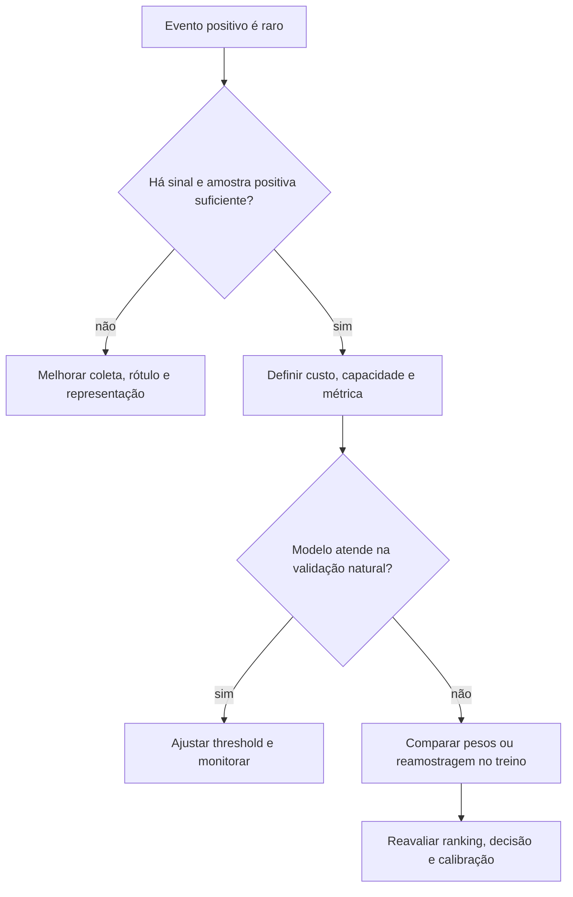
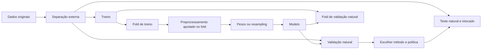

# Aula 16 — Classes desbalanceadas: amostragem, pesos e avaliação correta

<!-- mirandastech-aula-v2 -->

**Trilha:** Especialista em IA  
**Módulo:** 03 · Machine Learning clássico (M4)  
**Pré-requisito:** [Aula 15 — ROC, Precision-Recall, thresholds e calibração](./15-roc-pr-threshold-calibracao.md)  
**Próxima aula:** [Aula 17 — Cross-validation](./17-cross-validation.md)

Fraudes, falhas industriais, doenças raras e incidentes de segurança têm algo em comum: o evento relevante é pouco frequente. Um classificador que sempre responde “normal” pode atingir 99,5% de accuracy e, ainda assim, deixar passar todos os casos importantes. A reação automática costuma ser “balancear o dataset”. Essa frase é perigosa: **desbalanceamento é uma propriedade da população; reamostragem é uma intervenção no conjunto de treino**. Confundir as duas coisas produz métricas irreais e probabilidades sem significado operacional.

Esta aula conecta a avaliação da Aula 15 a um protocolo seguro para pesos, oversampling, undersampling e SMOTE.

## Objetivos de aprendizagem

Ao final, você deverá conseguir:

- quantificar prevalência e razão de desbalanceamento;
- explicar por que desbalanceamento não é automaticamente um defeito;
- comparar pesos de classe, oversampling, undersampling e SMOTE;
- aplicar qualquer amostragem somente ao subconjunto de treinamento de cada split ou fold;
- escolher métricas coerentes com prevalência, custo e capacidade;
- reconhecer que pesos e reamostragem podem alterar a calibração;
- corrigir probabilidades sob mudança conhecida de prior, declarando suas hipóteses;
- construir uma avaliação em que validação e teste preservam a distribuição-alvo.

## Pré-requisitos e vocabulário

Você deve dominar matriz de confusão, precision, recall, ROC-AUC, average precision, calibração e threshold. Nesta aula:

| Termo | Significado operacional |
|---|---|
| **prevalência** | fração de positivos, $\pi=n_+/n$ |
| **razão de desbalanceamento** | $IR=n_-/n_+$ quando negativos são maioria |
| **custo sensível à classe** | loss em que erros/exemplos recebem pesos diferentes |
| **oversampling** | aumentar a representação da minoria no treino |
| **undersampling** | reduzir a representação da maioria no treino |
| **SMOTE** | sintetizar pontos entre vizinhos da classe minoritária |
| **prior shift** | mudança em $P(Y)$ com $P(X\mid Y)$ aproximadamente estável |

## 1. O problema não é apenas a contagem

Um dataset com 1% de positivos pode ser fácil se as classes forem bem separadas e houver milhares de positivos. Um dataset 50/50 pode ser difícil por ruído, sobreposição ou rótulos errados. Antes de intervir, pergunte:

1. quantos exemplos positivos independentes existem, e de quais grupos/períodos?
2. qual será a prevalência na população de uso?
3. quais são os custos de FP e FN?
4. a saída precisa ser ranking, decisão ou probabilidade calibrada?
5. existe capacidade máxima de revisão?

Balancear não cria informação ausente. Duplicar dez vezes 20 pacientes não transforma a amostra em 200 pacientes independentes.

## 2. Por que accuracy pode enganar

Considere 1.000 transações, das quais 5 são fraude. Prever tudo como normal produz:

$$
Accuracy=\frac{995}{1000}=99{,}5\%,\qquad Recall_+=0.
$$

A **balanced accuracy** atribui peso igual ao recall de cada classe:

$$
BalancedAccuracy=\frac{TPR+TNR}{2},
$$

em que $TPR=TP/(TP+FN)$ e $TNR=TN/(TN+FP)$. Para o classificador constante, $TPR=0$, $TNR=1$ e balanced accuracy = 0,5.

Agora suponha que outro sistema sinalize 20 transações e encontre 4 fraudes:

$$
Recall=\frac45=0{,}80,\qquad Precision=\frac4{20}=0{,}20.
$$

Ele cria 16 falsos alarmes, mas pode ter valor se evitar quatro perdas graves. A conclusão depende do custo e da capacidade, não de uma obrigação abstrata de equilibrar classes.

### 2.1 Precision depende da prevalência

Com prevalência $\pi$, sensibilidade $TPR$ e taxa de falsos positivos $FPR$:

$$
Precision=\frac{TPR\,\pi}{TPR\,\pi+FPR(1-\pi)}.
$$

Se $TPR=0{,}80$ e $FPR=0{,}02$, então:

- com $\pi=10\%$, precision $\approx81{,}6\%$;
- com $\pi=1\%$, precision $\approx28{,}8\%$;
- com $\pi=0{,}1\%$, precision $\approx3{,}85\%$.

O mesmo mecanismo de classificação pode gerar filas operacionais muito diferentes. Por isso, registre a prevalência e reporte contagens absolutas.

## 3. Estratégias de treinamento

### 3.1 Baseline e threshold antes de reamostrar

Comece com um modelo sem intervenção. Meça ROC-AUC/AP, curvas de calibração e métricas no threshold definido por custo ou capacidade. Às vezes, o ranking já é adequado e basta alterar a política de decisão. Reamostrar por hábito aumenta complexidade sem demonstrar ganho.

### 3.2 Pesos de classe

Na classificação binária, uma entropia cruzada ponderada pode ser escrita como:

$$
\mathcal L=-\frac1n\sum_{i=1}^n
\left[w_1y_i\log \hat p_i+w_0(1-y_i)\log(1-\hat p_i)\right].
$$

$w_1$ aumenta ou reduz a contribuição dos positivos; $w_0$ faz o mesmo para negativos. No scikit-learn, `class_weight="balanced"` usa:

$$
w_c=\frac{n}{K n_c},
$$

em que $K$ é o número de classes e $n_c$ a contagem da classe $c$. Essa heurística equaliza a massa total das classes na loss; ela **não codifica automaticamente o custo de negócio**.

Pesos mantêm todas as linhas e são simples para modelos que aceitam `class_weight` ou `sample_weight`. Porém podem deslocar a fronteira e alterar as probabilidades. O threshold 0,5 após ponderação não deve ser interpretado automaticamente como risco natural de 50%.

### 3.3 Random oversampling

O oversampling aleatório replica exemplos minoritários no treino. Para losses aditivas, replicar uma linha se aproxima de aumentar seu peso, mas regularização, otimização estocástica e modelos não lineares podem tornar os resultados diferentes.

Vantagens: não descarta a maioria e é fácil de auditar. Limites: aumenta custo computacional, repete ruído e não cria diversidade factual. Repetições do mesmo sujeito continuam sendo um único sujeito.

### 3.4 Random undersampling

O undersampling remove parte da maioria. Ele reduz tempo e pode ajudar quando há enorme redundância negativa. Em troca, descarta informação sobre a fronteira e pode elevar a variância. Guarde quais índices foram retidos; amostras diferentes podem produzir modelos diferentes.

### 3.5 SMOTE

Para um exemplo minoritário $x_i$ e um de seus vizinhos minoritários $x_{nn}$, o SMOTE gera:

$$
x_{novo}=x_i+\lambda(x_{nn}-x_i),\qquad \lambda\sim U(0,1).
$$

Ele interpola no espaço de features; não “inventa um novo caso real”. O pressuposto é que o segmento entre vizinhos permanece plausível. Isso pode falhar em regiões de sobreposição, outliers, features categóricas, contagens discretas, restrições físicas ou dados esparsos de alta dimensão. Para categorias, use método compatível, como SMOTENC, e valide a semântica dos pontos gerados.

| Estratégia | Preserva maioria? | Cria linhas? | Principal benefício | Risco principal |
|---|---:|---:|---|---|
| pesos | sim | não | loss sensível à classe | probabilidades deslocadas |
| oversampling aleatório | sim | réplicas | implementação simples | sobreajuste/tempo |
| undersampling aleatório | não | não | treino menor | perda de informação |
| SMOTE | sim | sintéticas | suaviza representação local | interpolação implausível |

Não existe vencedor universal. A comparação deve manter o mesmo protocolo, métrica e população de validação.

## 4. A regra inviolável: resampling só no treino

O erro clássico é aplicar SMOTE ou balanceamento a todo o dataset e só depois fazer o split. Isso causa dois problemas:

1. validação e teste deixam de representar a prevalência de uso;
2. o sampler pode usar informação de casos que depois estarão na validação ou no teste.

Em cross-validation, “treino” significa **a parte de treino de cada fold**, não todo o conjunto de desenvolvimento antes da CV.

Em código, samplers não pertencem ao `sklearn.pipeline.Pipeline`, porque mudam simultaneamente $X$ e $y$. Use `imblearn.pipeline.Pipeline`: o sampler atua em `fit`, mas não em `predict`. Mesmo dentro do pipeline, respeite grupos e tempo; um SMOTE correto no fold errado continua respondendo à pergunta errada.

## 5. Avaliação correta

Nenhuma métrica é “imune” ao desbalanceamento; cada uma responde a uma pergunta.

| Necessidade | Medida recomendada | Observação |
|---|---|---|
| ranking global | ROC-AUC | pode ocultar baixa pureza da fila rara |
| qualidade da fila positiva | curva PR e AP | baseline depende da prevalência |
| tratamento igual dos recalls | balanced accuracy | fixa um threshold e ignora custos específicos |
| cobertura com qualidade mínima | recall com precision mínima | threshold escolhido na validação |
| capacidade operacional | precision@k e recall@k | declare $k$ e regra de empate |
| consequência | custo esperado e contagens | custos devem ser justificáveis |
| probabilidade | Brier, log-loss e confiabilidade | reavalie após pesos/reamostragem |

Evite otimizar uma métrica e narrar outra. Se a equipe revisa 200 alertas por dia, `recall@200` é mais operacional que F1 em 0,5. Reporte também intervalos ou dispersão entre folds — assunto central da próxima aula.

## 6. Prevalência de treino não é prevalência de produção

Oversampling e pesos alteram a distribuição efetiva vista pela loss. Se um modelo foi treinado em prior amostral $\pi_s$ e produz $q=P_s(Y=1\mid X)$, sob **prior probability shift** — $P(X\mid Y)$ estável — podemos ajustar odds para um prior-alvo $\pi_t$:

$$
odds_t=\frac{q}{1-q}
\times
\frac{\pi_t/(1-\pi_t)}{\pi_s/(1-\pi_s)},
\qquad
p_t=\frac{odds_t}{1+odds_t}.
$$

Essa correção não é um passe livre: falha se $P(X\mid Y)$ mudou, se o modelo não está calibrado no domínio amostrado ou se o mecanismo de seleção depende de $X$. Use validação natural e calibração posterior. Monitore prevalência, Brier/log-loss e confiabilidade após deploy.

## 7. Exemplo resolvido: pesos e probabilidades

Suponha treino com 900 negativos e 100 positivos. Para duas classes:

$$
w_0=\frac{1000}{2\cdot900}=0{,}556,
\qquad
w_1=\frac{1000}{2\cdot100}=5.
$$

A massa de peso total é 500 para cada classe. Isso equivale a uma loss com prior efetivo balanceado, não à afirmação de que a prevalência real seja 50%. Se o sistema precisa de probabilidades naturais, avalie e calibre em dados que preservem o prior de uso.

## 8. Laboratório reproduzível

O notebook usa dados sintéticos numéricos, seed fixa e apenas NumPy, Matplotlib e scikit-learn. Ele:

1. cria uma população com cerca de 2% de positivos;
2. reserva validação e teste com prevalência natural;
3. implementa pesos, oversampling, undersampling e SMOTE somente no treino;
4. compara accuracy, balanced accuracy, recall, precision, ROC-AUC, AP e Brier;
5. demonstra correção de prior nas probabilidades de oversampling;
6. mede o mesmo classificador sob três prevalências por reamostragem do teste;
7. executa asserts de separação, seed e integridade.

Dependências mínimas: Python 3.10, NumPy 1.24, Matplotlib 3.7 e scikit-learn 1.3. O notebook implementa SMOTE de forma didática; para projetos reais, prefira a implementação testada do imbalanced-learn dentro de seu `Pipeline`.

## 9. Armadilhas e limites

- **Balancear antes do split.** Contamina dados e cria uma população de teste artificial.
- **Aplicar sampler ao teste.** O teste deve representar o uso, não o desejo do pesquisador.
- **Usar accuracy isolada.** Um classificador constante pode parecer excelente.
- **Confundir duplicação com nova evidência.** A unidade independente não mudou.
- **Aplicar SMOTE em categorias como se fossem contínuas.** Interpolações podem ser inválidas.
- **Ignorar grupos e tempo.** Registros do mesmo paciente ou futuro no treino causam leakage.
- **Assumir que `balanced` significa custo correto.** A heurística equaliza classes, não consequências.
- **Confiar em `predict_proba` após ponderação.** O nome do método não garante calibração natural.
- **Comparar AP sem prevalência.** Sua referência muda com a população.
- **Otimizar todas as escolhas no teste.** Isso transforma o teste em validação.

## 10. Checklist prático

- [ ] Defini positivo, unidade de análise e instante de predição.
- [ ] Registrei contagens e prevalência por split, grupo e período.
- [ ] Mantive validação e teste na distribuição-alvo.
- [ ] Comecei por baseline e ajuste de threshold.
- [ ] Apliquei pesos/resampling somente no treino de cada fold.
- [ ] Ajustei preprocessamento antes do sampler dentro do fold quando a distância o exige.
- [ ] Comparei métodos nos mesmos splits e com seeds registradas.
- [ ] Reportei AP, contagens, capacidade/custo e não só accuracy.
- [ ] Reavaliei calibração após qualquer intervenção.
- [ ] Documentei limitações sem chamar pontos sintéticos de novos casos reais.

## 11. Conexões com IA e sistemas reais

Detecção de alucinação, filtro de segurança, roteamento para revisão humana, detecção de ataques e alertas de agentes são tarefas raras. O custo de um falso negativo pode ser alto, mas uma avalanche de falsos positivos também paralisa a operação. O contrato de produção deve declarar: prevalência esperada, orçamento de alertas, custos, threshold, regra de revisão e gatilhos de recalibração.

No **AI Systems Laboratory**, salve a distribuição natural antes de qualquer sampler, a lista de índices usada em cada split, o estado aleatório, os parâmetros de amostragem e as métricas por estratégia. Isso fornece evidência auditável para o Gate II.

## 12. Exercícios com respostas comentadas

### 1. Baseline enganoso

Há 30 positivos em 10.000 casos. Um modelo prevê tudo como negativo. Calcule accuracy e balanced accuracy.

**Resposta:** accuracy = $9.970/10.000=99{,}7\%$. Como $TPR=0$ e $TNR=1$, balanced accuracy = 0,5. A accuracy alta não representa utilidade positiva.

### 2. Peso balanceado

Em 2.000 exemplos há 100 positivos. Calcule os pesos `balanced`.

**Resposta:** $w_1=2000/(2\cdot100)=10$ e $w_0=2000/(2\cdot1900)\approx0{,}526$. A soma de pesos de cada classe é 1.000.

### 3. Precision sob prior raro

Com $TPR=0{,}9$, $FPR=0{,}01$ e $\pi=0{,}005$, calcule precision.

**Resposta:** $0{,}9\cdot0{,}005/[0{,}9\cdot0{,}005+0{,}01\cdot0{,}995]\approx0{,}311$. Mesmo com boa sensibilidade e FPR baixa, quase 69% dos alertas são falsos.

### 4. Leakage por SMOTE

Por que executar SMOTE antes de `train_test_split` é inválido?

**Resposta:** vizinhos que participarão do teste podem influenciar pontos sintéticos do treino; além disso, o teste fica artificialmente balanceado. O desempenho não estima a população natural.

### 5. Escolha de método

Quando undersampling pode ser razoável?

**Resposta:** quando a maioria é enorme e redundante, o custo de treino importa e uma amostra ainda representa bem sua diversidade. Deve-se medir variabilidade entre amostras e nunca reduzir validação/teste.

### 6. SMOTE e categorias

Por que interpolar códigos `cidade=1` e `cidade=3` para obter `cidade=2` é incorreto?

**Resposta:** os códigos são rótulos, não uma escala métrica. O valor intermediário pode significar outra cidade sem relação semântica. Use representação e sampler compatíveis com categorias.

### 7. Probabilidade após oversampling

Um treino foi balanceado para $\pi_s=0{,}5$, mas produção tem $\pi_t=0{,}02$. É seguro tratar $q=0{,}5$ como risco natural de 50%?

**Resposta:** não. Sob prior shift, as odds devem ser ajustadas pelo fator $(0{,}02/0{,}98)/(0{,}5/0{,}5)$. Mesmo assim, a correção precisa ser validada em dados naturais.

## 13. Resumo

- Classe rara não implica modelo ruim nem exige balanceamento automático.
- Accuracy pode esconder recall zero; balanced accuracy, AP, custo e métricas de capacidade respondem perguntas mais úteis.
- Pesos mudam a loss; oversampling replica; undersampling descarta; SMOTE interpola.
- Nenhuma intervenção substitui exemplos independentes e rótulos confiáveis.
- Resampling ocorre apenas no treino de cada fold; validação e teste preservam a população-alvo.
- Pesos e amostragem podem distorcer probabilidades; calibração e prevalência devem ser reavaliadas.
- O método escolhido deve superar um baseline no mesmo protocolo, não apenas produzir uma classe “equilibrada”.

## 14. Referências verificadas

### Artigos e fontes técnicas

- Chawla, N. V. et al. (2002). [SMOTE: Synthetic Minority Over-sampling Technique](https://www.jair.org/index.php/jair/article/view/10302). *Journal of Artificial Intelligence Research*, 16, 321–357.
- He, H.; Garcia, E. A. (2009). [Learning from Imbalanced Data](https://doi.org/10.1109/TKDE.2008.239). *IEEE Transactions on Knowledge and Data Engineering*, 21(9), 1263–1284.
- Saito, T.; Rehmsmeier, M. (2015). [The Precision-Recall Plot Is More Informative than the ROC Plot When Evaluating Binary Classifiers on Imbalanced Datasets](https://doi.org/10.1371/journal.pone.0118432). *PLOS ONE*, 10(3).

### Documentação oficial consultada

- scikit-learn 1.9 (consultado em setembro de 2026): [`compute_class_weight`](https://scikit-learn.org/stable/modules/generated/sklearn.utils.class_weight.compute_class_weight.html) e [`balanced_accuracy_score`](https://scikit-learn.org/stable/modules/generated/sklearn.metrics.balanced_accuracy_score.html).
- imbalanced-learn 0.14.2 (consultado em setembro de 2026): [erros comuns e prevenção de leakage](https://imbalanced-learn.org/stable/common_pitfalls.html) e [`imblearn.pipeline.Pipeline`](https://imbalanced-learn.org/stable/references/generated/imblearn.pipeline.Pipeline.html).
- imbalanced-learn 0.14.2 (consultado em setembro de 2026): [armadilhas de data leakage](https://imbalanced-learn.org/stable/common_pitfalls.html) e [`imblearn.pipeline.Pipeline`](https://imbalanced-learn.org/stable/references/generated/imblearn.pipeline.Pipeline.html).

## Próxima aula

Na [Aula 17](./17-cross-validation.md), o protocolo será generalizado: escolheremos o splitter coerente com amostras iid, grupos ou tempo e mediremos a variabilidade do procedimento inteiro. A regra permanece: cada transformação e sampler aprende somente com o fold de treino.
