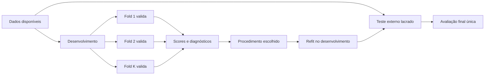
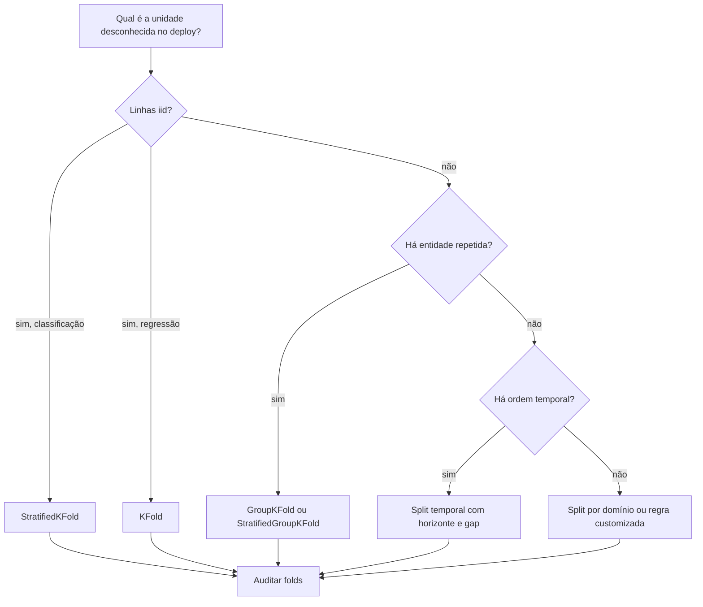

# Aula 17 — Cross-validation: estimando generalização sem desperdiçar dados

<!-- mirandastech-aula-v2 -->

**Trilha:** Especialista em IA  
**Módulo:** 03 · Machine Learning clássico (M4)  
**Pré-requisito:** [Aula 16 — Classes desbalanceadas](./16-classes-desbalanceadas.md)  
**Próxima aula:** [Aula 18 — Hyperparameter tuning](./18-hyperparameter-tuning.md)

[](https://colab.research.google.com/github/joaopaulomirandamatias/ai-lab/blob/main/03-machine-learning/notebooks/17-cross-validation-laboratorio.ipynb)

Imagine um classificador de reinternação treinado com várias consultas de cada paciente. Um K-fold aleatório pode pôr a consulta de março no treino e a de abril do mesmo paciente na validação. A métrica parece excelente porque o modelo reconhece características daquele paciente; em produção, porém, chegam pacientes novos. Em previsão de demanda, embaralhar datas permite um erro ainda mais direto: aprender com dezembro para “validar” em agosto.

Cross-validation (CV) não é apenas repetir treino e calcular uma média. Ela é uma **simulação da fronteira entre o que o sistema conhece e o que deverá generalizar**. A escolha dos folds materializa a pergunta científica. Se a fronteira estiver errada, mais folds e mais casas decimais apenas tornam precisa uma resposta irrelevante.

## Objetivos de aprendizagem

Ao final, você deverá conseguir:

- explicar o que K-fold estima e por que ele não elimina a necessidade do teste externo;
- escolher entre K-fold, estratificação, grupos e divisão temporal a partir da unidade de generalização;
- ajustar preprocessing, seleção e reamostragem exclusivamente no treino de cada fold;
- calcular média, dispersão e agregação ponderada das métricas;
- distinguir scores por fold de predições out-of-fold (OOF);
- reconhecer a dependência entre folds e evitar intervalos de confiança ingênuos;
- auditar sobreposição de entidades, ordem temporal e lacunas operacionais;
- preparar uma validação reproduzível para a seleção de hiperparâmetros da próxima aula.

## Pré-requisitos e vocabulário

Você deve dominar splits, pipelines, leakage e métricas das Aulas 13–16.

| Termo | Significado operacional |
|---|---|
| **fold** | subconjunto usado uma vez para validação em uma rodada |
| **splitter** | regra que produz índices de treino e validação |
| **unidade de análise** | linha sobre a qual a métrica é calculada |
| **unidade de generalização** | entidade, período ou domínio que deve permanecer desconhecido |
| **iid** | amostras aproximadamente independentes e da mesma distribuição |
| **OOF** | predição de cada exemplo produzida por um modelo que não o treinou |
| **gap** | intervalo excluído entre treino e validação temporal |
| **teste externo** | conjunto reservado e consultado uma única vez após decisões |

Uma transação pode ser a unidade de análise, enquanto o cliente é a unidade de generalização. Declarar apenas “uma linha por transação” não resolve a dependência entre cinco compras do mesmo cliente.

## 1. Intuição: várias provas, sempre com matéria inédita

Em um único holdout, o resultado pode depender muito de uma partição afortunada. K-fold divide o conjunto de desenvolvimento em \(K\) blocos. Em cada rodada, treina em \(K-1\) blocos e valida no bloco restante. Ao final, todo exemplo foi usado para validação uma vez e para treino \(K-1\) vezes.



O objeto avaliado não é somente uma instância já ajustada. É o **procedimento completo**: transformações, estimador, hiperparâmetros fixados, seed quando pertinente e regra de treinamento. Cada rodada precisa reconstruí-lo do zero.

## 2. K-fold formalmente

Seja o conjunto de desenvolvimento \(D=\{(x_i,y_i)\}_{i=1}^{n}\), particionado em folds disjuntos \(D_1,\ldots,D_K\). Na rodada \(k\):

1. ajuste o procedimento \(A\) em \(D_{-k}=D\setminus D_k\);
2. produza previsões para \(D_k\);
3. calcule a métrica \(m_k=M(y_{D_k},\hat y_{D_k})\).

A média não ponderada é:

$$
\bar m = \frac{1}{K}\sum_{k=1}^{K}m_k.
$$

O desvio-padrão amostral dos folds é:

$$
s_m=\sqrt{\frac{1}{K-1}\sum_{k=1}^{K}(m_k-\bar m)^2}.
$$

Aqui, \(K\) é o número de folds, \(m_k\) é o score no fold \(k\), \(\bar m\) é a média e \(s_m\) descreve a variação observada entre partições. Quando os folds têm tamanhos diferentes e a métrica é uma média aditiva por exemplo, use:

$$
\bar m_w=\frac{\sum_{k=1}^{K}n_km_k}{\sum_{k=1}^{K}n_k},
$$

em que \(n_k=|D_k|\). Para F1, AUC e outras métricas não aditivas, a média de folds e a métrica recalculada sobre todas as previsões OOF podem divergir; reporte claramente qual agregação foi usada.

### Exemplo resolvido

Considere cinco scores de ROC-AUC: \([0{,}71,0{,}76,0{,}74,0{,}62,0{,}77]\).

$$
\bar m=\frac{0{,}71+0{,}76+0{,}74+0{,}62+0{,}77}{5}=0{,}72.
$$

As diferenças em relação à média são \([-0{,}01,0{,}04,0{,}02,-0{,}10,0{,}05]\). A soma dos quadrados é \(0{,}0146\); dividindo por \(K-1=4\) e extraindo a raiz:

$$
s_m=\sqrt{0{,}0146/4}\approx0{,}0604.
$$

“\(0{,}72\pm0{,}06\)” resume os folds, mas não é automaticamente um intervalo de confiança de 68%. Os conjuntos de treino se sobrepõem, logo os scores são dependentes. O fold de 0,62 merece inspeção: outro hospital, período ou perfil pode revelar fragilidade estrutural.

### O que a estimativa representa

Cada modelo usa aproximadamente \((K-1)n/K\) exemplos, menos do que o refit final. A CV estima o desempenho do procedimento sob esse tamanho de treino e sob a distribuição induzida pelo splitter. Aumentar \(K\) aproxima o tamanho de treino de \(n\), mas eleva custo e pode aumentar variância; leave-one-out não é automaticamente superior. Cinco ou dez folds são pontos de partida, nunca leis universais.

## 3. O splitter é a hipótese de generalização

Antes de importar uma classe do scikit-learn, complete: **“em produção, preciso generalizar para…”**

| Situação real | Splitter inicial | Restrição indispensável |
|---|---|---|
| novas linhas aproximadamente iid, regressão | `KFold` | embaralhar apenas se a ordem não carregar estrutura |
| novas linhas iid, classificação | `StratifiedKFold` | preservar aproximadamente as proporções de classe |
| novos pacientes, clientes, documentos ou dispositivos | `GroupKFold` | um grupo inteiro em apenas um lado |
| classes raras e grupos indivisíveis | `StratifiedGroupKFold` | equilíbrio é aproximado, nunca à custa de quebrar grupos |
| futuro a partir do passado | `TimeSeriesSplit` ou janela móvel | treino anterior à validação; considerar `gap` |
| novo hospital, país ou site | `GroupKFold`/`LeaveOneGroupOut` | o grupo deve representar o domínio de implantação |

### 3.1 K-fold e estratificação

`KFold` ignora classes e grupos. Em classificação rara, algum fold pode ficar sem positivos, tornando métricas indefinidas. `StratifiedKFold` preserva aproximadamente a frequência das classes e melhora a estabilidade computacional.

Estratificar, porém, **não cria independência**. Consultas do mesmo paciente continuam correlacionadas. A documentação do scikit-learn 1.9 observa também que a estratificação é uma solução de engenharia: por homogeneizar folds, pode reduzir artificialmente a dispersão aparente. Use-a para viabilizar a métrica, não como prova de incerteza pequena.

### 3.2 Grupos

Em `GroupKFold`, nenhum identificador de grupo aparece simultaneamente em treino e validação. Isso vale mesmo que o identificador não seja uma feature: outras variáveis podem funcionar como assinatura da entidade. A auditoria mínima é:

```python
for train_idx, val_idx in cv.split(X, y, groups):
    assert set(groups[train_idx]).isdisjoint(groups[val_idx])
```

`GroupKFold` não garante equilíbrio de classes. Se todos os positivos estiverem concentrados em dois hospitais, não existem cinco folds independentes com positivos sem dividir hospitais. A limitação está nos dados; o algoritmo de split não deve escondê-la.

### 3.3 Tempo, horizonte e gap

Séries temporais exigem ordem. Em validação de origem móvel, o treino contém apenas passado e a validação representa um horizonte futuro. `TimeSeriesSplit` usa janelas de treino crescentes; `max_train_size` permite janela limitada, e `gap` exclui observações imediatamente anteriores à validação.

O gap deve refletir a operação. Se uma feature leva sete dias para consolidar ou rótulos amadurecem após 30 dias, a fronteira precisa respeitar essa latência. Também evite features calculadas retrospectivamente com toda a série, como uma média centrada que inclui o futuro.



## 4. Todo aprendizado fica dentro do fold

O scaler, imputador, encoder, seleção de features, redução de dimensionalidade e reamostragem estimam estado. Se forem ajustados antes da CV, a validação influencia o treino. Use `Pipeline` para que cada `fit` receba somente os índices de treino da rodada.

Para oversampling ou SMOTE, a operação ocorre somente no treino de cada fold; validação mantém a prevalência-alvo. Para grupos e tempo, o sampler não pode criar pares que atravessem a fronteira. A mesma regra alcança embeddings aprendidos, vocabulários, agregações históricas e seleção supervisionada.

## 5. Scores por fold e predições OOF

`cross_validate` calcula uma ou várias métricas em cada fold e pode devolver tempos, estimadores e índices. `cross_val_predict` devolve uma predição OOF por linha quando o esquema atribui cada exemplo à validação exatamente uma vez.

OOF é útil para:

- construir gráficos e analisar erros sem usar previsões in-sample;
- treinar o segundo nível de stacking sem vazamento;
- estimar métricas agregadas e auditar subgrupos;
- preparar uma calibração dentro de outro protocolo de separação.

Mas OOF continua pertencendo ao desenvolvimento. Depois de olhar os erros e mudar o procedimento, você se adaptou a esses dados. Ela não substitui o teste externo. Além disso, juntar probabilidades de modelos treinados em folds diferentes não cria um único modelo calibrado.

### Média dos folds versus métrica OOF

Para loss média com folds iguais, as duas agregações coincidem. Para F1, average precision e AUC, não necessariamente:

1. **macro entre folds:** calcula a métrica em cada fold e dá peso igual aos cenários;
2. **ponderada:** dá peso ao número de exemplos quando isso tem interpretação;
3. **OOF pooled:** reúne todas as previsões e calcula uma métrica global.

Escolha antes e reporte as três quando a diferença tiver implicação operacional. Nunca selecione a agregação que favoreceu o modelo depois de ver os resultados.

## 6. CV não é um selo de imparcialidade

Os \(K\) scores compartilham muitos exemplos de treino. Portanto, tratá-los como \(K\) observações iid em um teste t ou calcular \(\bar m\pm1{,}96s/\sqrt K\) pode subestimar incerteza. Repetir K-fold mede sensibilidade a diferentes partições, mas as repetições também reutilizam dados.

Outras ameaças permanecem:

- testar centenas de pipelines e reportar apenas o melhor score;
- ajustar decisões humanas após observar todos os folds;
- usar grupos, períodos ou duplicatas correlacionados em lados opostos;
- escolher o splitter porque produziu a melhor métrica;
- comparar modelos em folds diferentes;
- ignorar que os dados de implantação pertencem a outro domínio.

Cawley e Talbot mostraram que o próprio critério de seleção pode sofrer overfitting. Na Aula 18, a validação aninhada separará um loop interno de seleção de um loop externo de estimativa. Nesta aula, guarde a fronteira: **CV simples ajuda a desenvolver; o teste externo permanece lacrado**.

## 7. Protocolo reproduzível

1. Declare unidade de análise, unidade de generalização e instante da predição.
2. Reserve o teste externo antes de explorar configurações.
3. Escolha splitter, \(K\), shuffle, seed, horizonte, gap e grupos por hipótese operacional.
4. Congele os mesmos índices para comparações pareadas.
5. Coloque todo passo aprendido em `Pipeline`.
6. Calcule baseline e métricas primária/secundárias em cada fold.
7. Salve scores, tamanhos, prevalências, grupos e intervalos temporais.
8. Inspecione o pior fold e erros por domínio.
9. Refaça o procedimento no desenvolvimento completo.
10. Consulte o teste apenas após congelar decisões.

Registre versões do código, dataset e dependências. A seed torna a partição reproduzível; não torna o resultado universal.

## 8. Laboratório reproduzível

O notebook desta aula contém três experimentos com dados sintéticos e seed fixa:

1. registros repetidos por entidade, comparando split estratificado ingênuo a `GroupKFold`;
2. visualização de `TimeSeriesSplit` com gap e asserts de causalidade;
3. pipeline iid com predições OOF, métricas por fold e teste externo único.

A hipótese principal é que um splitter aleatório permitirá ao KNN reconhecer assinaturas de entidades já vistas e inflará a balanced accuracy. Ao manter grupos inteiros fora do treino, a estimativa deverá cair em direção ao desempenho em entidades realmente novas.

## 9. Armadilhas e correções

| Erro | Por que invalida | Correção |
|---|---|---|
| escalar antes da CV | estatísticas da validação entram no treino | `Pipeline` ajustado em cada fold |
| passar `cv=5` sem pensar | aceita a suposição padrão do estimador | instanciar splitter explícito |
| estratificar linhas de pacientes | equilibra classe, mas vaza identidade | split por paciente |
| embaralhar tempo | futuro ajuda a prever passado | janelas ordenadas e gap |
| reportar só a média | esconde fragilidade de domínio | scores, dispersão e pior fold |
| tratar \(s/\sqrt K\) como erro-padrão iid | folds compartilham treino | declarar dependência e usar desenho apropriado |
| usar teste como fold adicional | adapta decisões à avaliação | lacrar teste |
| comparar em folds diferentes | ruído da partição confunde modelos | reutilizar índices |

## 10. Checklist prático

- [ ] A pergunta “generalizar para quem/quando/onde?” está escrita.
- [ ] Grupos, duplicatas e dependência temporal foram auditados.
- [ ] Nenhum grupo atravessa treino e validação.
- [ ] Todo índice de treino temporal precede a validação e o gap é justificável.
- [ ] Transformações e amostragem ficam dentro do fold.
- [ ] As mesmas partições comparam os procedimentos.
- [ ] Métrica primária, regra de agregação e \(K\) foram definidos antes.
- [ ] Scores por fold, tamanhos e diagnósticos foram preservados.
- [ ] O teste externo não orientou nenhuma decisão.

## 11. Exercícios com respostas comentadas

### 1. Cinco consultas por paciente

**Pergunta:** a tarefa avalia risco em pacientes novos. Qual splitter usar?

**Resposta:** `GroupKFold` com `patient_id` como grupo. Estratificar consultas não impede que a identidade atravesse a fronteira. Se o rótulo for raro, teste `StratifiedGroupKFold`, aceitando que o equilíbrio é limitado pelos grupos.

### 2. Churn mensal

**Pergunta:** por que `shuffle=True` é inadequado quando se prevê o mês seguinte?

**Resposta:** permite que padrões e transformações do futuro participem do treino. Use origem móvel, horizonte coerente e gap correspondente à latência de dados e rótulos.

### 3. Média manual

**Pergunta:** calcule média e desvio amostral de \([0{,}80,0{,}82,0{,}74,0{,}84]\).

**Resposta:** \(\bar m=0{,}80\). A soma dos desvios quadráticos é \(0{,}0056\); \(s=\sqrt{0{,}0056/3}\approx0{,}0432\). O fold 0,74 deve ser investigado, e \(s\) não é um IC clássico.

### 4. Folds com 90 e 10 exemplos

**Pergunta:** duas losses médias são 0,20 e 0,80. Qual loss por exemplo agregada?

**Resposta:** \((90\cdot0{,}20+10\cdot0{,}80)/100=0{,}26\). A média simples, 0,50, responde a outra pergunta: desempenho médio por fold com peso igual.

### 5. OOF perfeita e teste fraco

**Pergunta:** isso é impossível?

**Resposta:** não. Pode haver vazamento entre entidades, adaptação excessiva às decisões de desenvolvimento ou shift no teste. Audite a fronteira, o pipeline, duplicatas e diferenças de domínio.

### 6. Projeto aplicado

Escolha um dataset do AI Systems Laboratory. Entregue um “contrato de split” com unidade de generalização, diagrama dos folds, asserts de sobreposição, métricas por fold e justificativa do teste externo. A solução é aceitável somente se outra pessoa puder reconstruir exatamente os índices.

## 12. Conexões com IA e sistemas reais

A mesma lógica aparece além do ML tabular:

- em RAG, documentos da mesma fonte ou versões quase duplicadas devem ficar no mesmo lado;
- em LLMs, templates, autores e benchmarks contaminados podem inflar a avaliação;
- em agentes, episódios do mesmo usuário ou workflow compartilham contexto;
- em visão médica, imagens do mesmo paciente não são amostras independentes;
- em sistemas multiagentes, seeds e cenários devem formar blocos comparáveis.

CV não corrige benchmark contaminado nem distribuição ausente. Ela torna explícito o mecanismo de reamostragem; a validade externa ainda depende de dados representativos.

## Resumo

- Cross-validation estima um procedimento sob uma hipótese de particionamento.
- K-fold treina \(K\) modelos; cada exemplo valida uma vez e treina \(K-1\) vezes.
- Estratificação preserva classes, mas não resolve dependência entre entidades.
- Grupos, tempo, domínio, horizonte e gap devem refletir o deploy.
- Todo passo que aprende estado precisa ser ajustado dentro do fold.
- Média, dispersão e OOF respondem perguntas relacionadas, porém não idênticas.
- Scores de folds são dependentes; não os trate como observações iid.
- O teste externo continua necessário depois que as decisões forem congeladas.

## Referências técnicas verificadas

- scikit-learn 1.9 — [Cross-validation: evaluating estimator performance](https://scikit-learn.org/stable/modules/cross_validation.html), incluindo pipelines, OOF, estratificação, grupos e séries temporais (consulta em 8 set. 2026).
- scikit-learn 1.9 — [GroupKFold](https://scikit-learn.org/stable/modules/generated/sklearn.model_selection.GroupKFold.html) e [TimeSeriesSplit](https://scikit-learn.org/stable/modules/generated/sklearn.model_selection.TimeSeriesSplit.html) (consulta em 8 set. 2026).
- Kohavi, R. (1995) — [A Study of Cross-Validation and Bootstrap for Accuracy Estimation and Model Selection](https://www.ijcai.org/Proceedings/95-2/Papers/016.pdf), IJCAI.
- Cawley, G. C.; Talbot, N. L. C. (2010) — [On Over-fitting in Model Selection and Subsequent Selection Bias in Performance Evaluation](https://jmlr.org/papers/v11/cawley10a.html), JMLR 11.
- James et al. — [An Introduction to Statistical Learning](https://www.statlearning.com/), capítulo 5.
- Hastie, Tibshirani e Friedman — [The Elements of Statistical Learning](https://hastie.su.domains/ElemStatLearn/), capítulo 7.

## Próxima aula

Na [Aula 18](./18-hyperparameter-tuning.md), usaremos os folds como infraestrutura para Grid Search, Random Search e validação aninhada, separando seleção de hiperparâmetros da estimativa de generalização.
