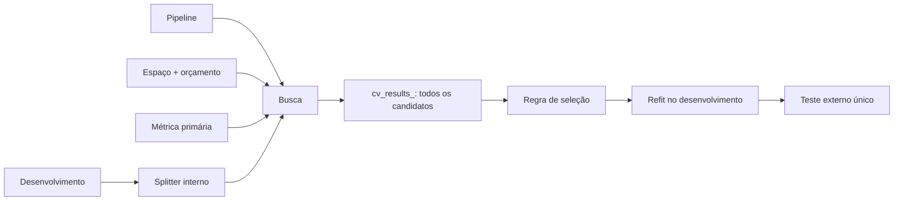
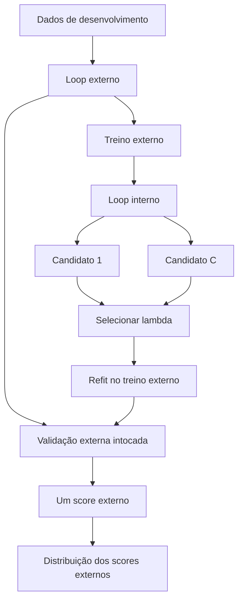

# Aula 18 — Hyperparameter tuning: Grid Search, Random Search e validação aninhada

<!-- mirandastech-aula-v2 -->

**Trilha:** Especialista em IA  
**Módulo:** 03 · Machine Learning clássico (M4)  
**Pré-requisito:** [Aula 17 — Cross-validation](./17-cross-validation.md)  
**Próxima aula:** [Aula 19 — Feature engineering e seleção de variáveis](./19-feature-engineering-selection.md)

[](https://colab.research.google.com/github/joaopaulomirandamatias/ai-lab/blob/main/03-machine-learning/notebooks/18-hyperparameter-tuning-laboratorio.ipynb)

Uma equipe testa 200 combinações de uma SVM e encontra ROC-AUC 0,91 na cross-validation. Outra testa apenas a configuração padrão e obtém 0,87. Podemos concluir que a primeira entregará 0,91 em produção? Não. Cada score é uma estimativa ruidosa; escolher o maior entre muitos candidatos também seleciona parte do ruído favorável. Quanto mais decisões são guiadas pelos mesmos folds, mais esses folds funcionam como dados de treino do **processo de seleção**.

Hyperparameter tuning não é uma competição para produzir o maior número. É uma busca sob orçamento, com uma métrica definida antes, dentro de uma arquitetura de avaliação que separa **ajuste**, **seleção** e **estimativa final**.

## Objetivos de aprendizagem

Ao final, você deverá conseguir:

- distinguir parâmetros aprendidos de hiperparâmetros escolhidos;
- definir espaços coerentes com escala, tipo e dependências entre parâmetros;
- comparar `GridSearchCV` e `RandomizedSearchCV` sob o mesmo orçamento;
- calcular o número de ajustes exigido por busca simples e validação aninhada;
- manter preprocessing e seleção dentro de um `Pipeline`;
- interpretar `best_score_`, `best_params_`, `best_estimator_` e `cv_results_`;
- usar múltiplas métricas sem escolher a regra de decisão depois de ver os resultados;
- explicar por que o melhor score interno é otimista;
- implementar nested cross-validation e preservar um teste externo lacrado.

## Pré-requisitos e vocabulário

Você deve dominar pipelines, leakage, métricas e splitters da Aula 17.

| Termo | Significado operacional |
|---|---|
| **parâmetro** | quantidade aprendida pelo `fit`, como coeficientes de regressão |
| **hiperparâmetro** | decisão externa ao `fit`, como \(C\), \(\gamma\), profundidade ou \(k\) |
| **candidato** | uma configuração completa de hiperparâmetros |
| **espaço de busca** | conjunto ou distribuição de candidatos possíveis |
| **trial** | avaliação de um candidato por uma regra de CV |
| **orçamento** | limite de candidatos, fits, tempo, memória ou energia |
| **loop interno** | CV que escolhe o candidato |
| **loop externo** | CV que estima o procedimento de seleção inteiro |
| **refit** | ajuste final do candidato escolhido em todos os dados entregues à busca |

## 1. Parâmetros e hiperparâmetros

Considere um algoritmo \(A_\lambda\), controlado por hiperparâmetros \(\lambda\). Ao receber o treino \(D_{\text{tr}}\), ele aprende parâmetros \(\hat\theta_\lambda\):

$$
\hat\theta_\lambda=A_\lambda(D_{\text{tr}}).
$$

Na regressão logística, os coeficientes são \(\hat\theta\); o inverso da força de regularização \(C\), o tipo de penalidade e o solver são componentes de \(\lambda\). Em uma árvore, limiares e valores das folhas são aprendidos, enquanto `max_depth` e `min_samples_leaf` são escolhidos.

A distinção é funcional: se uma decisão usa o target ou o score de validação, ela pertence ao procedimento de seleção e precisa ser avaliada fora dos dados que a orientaram.

## 2. Anatomia de uma busca honesta

Uma busca precisa de cinco contratos:

1. **estimador completo:** pipeline com tudo que aprende estado;
2. **espaço:** candidatos válidos e escalas justificadas;
3. **splitter:** coerente com linhas iid, grupos, tempo ou domínio;
4. **métrica primária:** definida antes de observar os rankings;
5. **orçamento e regra de refit:** quando parar e qual candidato reconstruir.

`GridSearchCV` e `RandomizedSearchCV` implementam a API de estimadores. O `fit` avalia candidatos nos folds internos e, por padrão, refaz o melhor em todo o conjunto fornecido. Portanto, `best_estimator_` já está ajustado nesse conjunto; `best_score_` é a média interna que o escolheu, não desempenho em dados novos.

`cv_results_` preserva candidatos, scores por fold, média, desvio, ranking e tempos. Esse registro é parte da evidência: reportar apenas o vencedor esconde instabilidade e equivalências práticas.



## 3. Grid Search: exaustiva apenas sobre a grade

Grid Search enumera o produto cartesiano dos valores fornecidos. Se:

$$
\Lambda=\Lambda_1\times\Lambda_2\times\cdots\times\Lambda_p,
$$

o número de candidatos é:

$$
N_{\text{cand}}=\prod_{j=1}^{p}|\Lambda_j|.
$$

Uma grade com cinco valores de \(C\), quatro de \(\gamma\) e dois kernels teria \(5\cdot4\cdot2=40\) candidatos se todas as combinações fossem válidas. Com CV de cinco folds:

$$
N_{\text{fits}}=40\cdot5+1=201,
$$

incluindo um refit final. “Exaustiva” significa somente que todas as combinações **da grade discretizada** foram testadas. Não significa que todo valor contínuo possível foi explorado.

Grid Search é apropriada quando há poucos parâmetros discretos, valores cientificamente motivados ou uma vizinhança pequena a confirmar. Sua fraqueza é combinatória: adicionar dez valores em uma dimensão multiplica o custo de todas as demais.

### Espaços condicionais

Nem todo parâmetro existe em todo candidato. \(\gamma\) é relevante para kernel RBF, não para kernel linear. Em scikit-learn, use uma lista de dicionários:

```python
param_grid = [
    {"svc__kernel": ["linear"], "svc__C": [0.1, 1, 10]},
    {"svc__kernel": ["rbf"], "svc__C": [0.1, 1, 10],
     "svc__gamma": [0.01, 0.1, 1]},
]
```

Isso produz 3 candidatos lineares e \(3\cdot3=9\) RBF, não 18 combinações com parâmetros sem efeito.

## 4. Random Search: amostrar o espaço sob orçamento

Random Search sorteia `n_iter` candidatos. O orçamento independe do número de dimensões, e parâmetros pouco influentes não forçam a repetição cartesiana dos valores importantes. Bergstra e Bengio mostraram por que isso é vantajoso quando apenas algumas dimensões afetam fortemente o desempenho.

| Aspecto | Grid Search | Random Search |
|---|---|---|
| candidatos | produto cartesiano finito | amostras de listas/distribuições |
| orçamento | cresce com a grade | controlado por `n_iter` |
| cobertura | regular nos valores escolhidos | irregular, melhora ao ampliar amostras |
| melhor uso | espaço pequeno e discreto | espaço amplo ou contínuo |
| reprodutibilidade | grade determinística | exige `random_state` |
| garantia | cobre a grade declarada | não garante visitar uma região específica |

Random Search não é sempre melhor. Com três candidatos válidos e conhecidos, enumerá-los é sensato. Também não corrige um espaço mal definido: sorteios entre valores absurdos apenas desperdiçam orçamento.

### 4.1 Escala linear versus logarítmica

Parâmetros como \(C\), \(\gamma\), `alpha` e taxa de aprendizado frequentemente variam por ordens de grandeza. Sortear uniformemente \(C\in[10^{-4},10^4]\) concentra quase toda a massa em valores grandes. A distribuição log-uniforme atribui a mesma probabilidade a cada intervalo multiplicativo:

$$
p(x)=\frac{1}{x\ln(b/a)},\qquad a\le x\le b.
$$

Com \(a=10^{-4}\) e \(b=10^4\), intervalos \([10^{-4},10^{-3}]\) e \([10^2,10^3]\) têm a mesma probabilidade. Use `scipy.stats.loguniform(a,b)` para grandezas positivas; `randint` para inteiros; listas para categorias. A distribuição codifica conhecimento anterior, não é um detalhe sintático.

## 5. Métrica primária, restrições e refit

Uma busca pode calcular várias métricas:

```python
scoring = {"auc": "roc_auc", "f1": "f1", "neg_log_loss": "neg_log_loss"}
search = GridSearchCV(
    pipeline,
    param_grid,
    scoring=scoring,
    refit="auc",
    cv=inner_cv,
)
```

`refit="auc"` declara que ROC-AUC ordena candidatos e reconstrói o vencedor. F1 e log-loss continuam disponíveis para auditoria. Escolher depois a métrica em que o modelo ficou melhor é multiplicidade disfarçada.

Em sistemas reais, “melhor” pode incluir restrições: latência máxima, memória, calibração ou recall mínimo. O scikit-learn aceita `refit` chamável para selecionar uma linha de `cv_results_`. Documente a política antes da execução. Diferenças menores que a instabilidade dos folds podem justificar o modelo mais simples ou barato; ranking 1 não significa superioridade material.

## 6. Overfitting à validação

Para cada candidato, pense no score estimado como:

$$
\widehat S(\lambda)=S(\lambda)+\varepsilon_\lambda,
$$

em que \(S(\lambda)\) é o desempenho esperado e \(\varepsilon_\lambda\) é erro da estimativa. Selecionamos:

$$
\lambda^*=\arg\max_{\lambda\in\Lambda}\widehat S(\lambda).
$$

Mesmo que os candidatos tenham desempenho real semelhante, o máximo tende a favorecer \(\varepsilon_\lambda>0\). Esse “winner's curse” cresce com número de tentativas, variância dos folds e decisões manuais. Cawley e Talbot destacam que o critério de seleção também pode overfitar.

O problema não é “usar CV”; é usar a mesma evidência para escolher e estimar sem contabilizar a escolha. `best_score_` responde “qual foi a melhor média observada no loop interno?”, não “quanto o procedimento entregará em dados independentes?”.

## 7. Nested cross-validation

A validação aninhada cria duas fronteiras:

- **loop interno:** busca \(\lambda_k^*\) usando somente o treino externo;
- **loop externo:** avalia o procedimento escolhido no fold externo, que nunca orientou a busca.

Para \(K_o\) folds externos, \(K_i\) internos e \(C\) candidatos:

$$
N_{\text{fits,nested}}=K_o(CK_i+1).
$$

O \(+1\) é o refit da melhor configuração em cada treino externo. Com \(K_o=5\), \(K_i=4\) e \(C=20\), são \(5(20\cdot4+1)=405\) fits. Uma busca posterior em todo o desenvolvimento acrescenta \(20\cdot4+1=81\).



O resultado principal é a distribuição dos scores externos. Os `best_score_` internos servem para diagnosticar otimismo e estabilidade. Os hiperparâmetros podem variar entre folds porque cada busca recebeu dados diferentes; isso não é erro.

### 7.1 E o teste externo?

Nested CV é especialmente útil para comparar procedimentos em amostras pequenas ou estudos científicos. Se o protocolo também reservou teste externo:

1. use nested CV no desenvolvimento para estimar e comparar procedimentos;
2. congele espaço, métrica, orçamento e regra;
3. execute a busca em todo o desenvolvimento;
4. avalie `best_estimator_` uma única vez no teste.

Nested CV não autoriza consultas repetidas ao teste. Sem teste externo, os scores externos podem ser a estimativa final, desde que nenhum passo posterior seja apresentado como já avaliado.

## 8. Pipeline, grupos e tempo

Os nomes de parâmetros atravessam o pipeline com dois sublinhados, como `svc__C`. Scaler, imputação, seleção e reamostragem ficam dentro dele e são refeitos em cada fold interno.

O splitter dos dois loops deve refletir o deploy:

- pacientes novos: grupos disjuntos nos loops interno e externo;
- futuro: janelas externas e internas causalmente ordenadas;
- classes raras iid: estratificação;
- novo site: site como unidade externa; grupos menores podem estruturar o interno.

Usar nested CV com `KFold` aleatório não corrige uma unidade de generalização errada. Em grupos ou tempo, passe metadados e índices explicitamente e teste a ausência de sobreposição.

## 9. Grid e Random sob comparação justa

Para comparar métodos de busca:

1. use o mesmo pipeline, dados, folds internos e métrica;
2. iguale o número de candidatos ou o custo real;
3. fixe a seed da busca aleatória;
4. registre valores efetivamente amostrados;
5. não use o teste para declarar o vencedor da estratégia.

Tempo total pode diferir mesmo com igual número de candidatos: alguns hiperparâmetros tornam o fit mais caro. Registre `mean_fit_time` e `std_fit_time`, mas não trate medições paralelas como benchmark de precisão. `n_jobs=-1` pode competir por memória ou gerar oversubscription; reprodutibilidade exige registrar recursos computacionais.

## 10. Laboratório reproduzível

O notebook desta aula:

1. gera classificação sintética e reserva teste externo;
2. demonstra amostragem log-uniforme;
3. compara Grid e Random Search com 16 candidatos e os mesmos quatro folds;
4. inspeciona `cv_results_` e métricas secundárias;
5. executa nested CV manual com cinco folds externos;
6. mede a diferença entre melhor score interno e score externo;
7. refaz a busca no desenvolvimento e consulta o teste uma vez.

Todos os dados são locais, a seed é fixa e o código inclui asserts sobre orçamento, disjunção e outputs numéricos.

## 11. Armadilhas e correções

| Erro | Consequência | Correção |
|---|---|---|
| tunar no teste | teste vira desenvolvimento | lacrar até o procedimento estar congelado |
| ajustar scaler antes da busca | validação influencia candidatos | pipeline dentro da busca |
| usar escala linear para \(C\) | orçamento concentrado em uma região | valores log-space ou `loguniform` |
| comparar Grid 1000 × Random 20 | conclusão mistura método e orçamento | igualar candidatos/fits |
| reportar `best_score_` como final | viés de seleção | nested CV ou teste externo |
| escolher métrica após resultados | multiplicidade | métrica primária pré-definida |
| ignorar `cv_results_` | instabilidade fica invisível | guardar ranking, folds e tempos |
| usar todos os pares condicionais | candidatos sem sentido | lista de dicionários |
| multiplicar `n_jobs` em loops | consumo imprevisível | paralelizar um nível e medir |

## 12. Checklist prático

- [ ] A métrica primária representa o custo ou objetivo real.
- [ ] O splitter respeita entidades, tempo e domínio.
- [ ] O teste externo foi separado antes da exploração.
- [ ] Todo preprocessing está no pipeline.
- [ ] O espaço e suas escalas têm justificativa.
- [ ] Condições entre hiperparâmetros estão representadas.
- [ ] O orçamento em candidatos, fits e tempo foi calculado.
- [ ] Seeds e versões foram registradas.
- [ ] Métodos de busca usam folds e orçamento comparáveis.
- [ ] `cv_results_` foi preservado e auditado.
- [ ] O score interno não foi chamado de desempenho final.
- [ ] O teste será consultado uma única vez.

## 13. Exercícios com respostas comentadas

### 1. Conte os fits

**Pergunta:** uma grade \(4\times3\times2\), CV de cinco folds e refit exige quantos ajustes?

**Resposta:** \(24\) candidatos, \(24\cdot5=120\) ajustes nos folds e um refit: **121 fits**. Pré-processamento dentro do pipeline também é reajustado em cada um.

### 2. Escolha a distribuição

**Pergunta:** \(C\) pode variar de \(10^{-5}\) a \(10^3\). Uniforme ou log-uniforme?

**Resposta:** log-uniforme como ponto de partida, porque a incerteza é multiplicativa e cobre oito ordens de grandeza sem concentrar massa perto de \(10^3\).

### 3. Melhor score interno

**Pergunta:** `best_score_=0.90` e média externa 0,84 contradizem-se?

**Resposta:** não. O primeiro foi maximizado durante a seleção; o segundo avalia o procedimento em dados que não escolheram o candidato. A diferença de 0,06 é um diagnóstico de otimismo e variabilidade.

### 4. Múltiplas métricas

**Pergunta:** a equipe quer alta AUC, mas recall mínimo de 0,75. Como proceder?

**Resposta:** pré-registre a restrição, calcule ambas as métricas e use uma regra de refit que descarte candidatos abaixo do recall antes de maximizar AUC. Se o threshold também for ajustado, essa decisão pertence ao loop interno.

### 5. Grupos repetidos

**Pergunta:** nested `StratifiedKFold` resolve consultas do mesmo paciente?

**Resposta:** não. O aninhamento separa seleção e estimativa, mas não impede vazamento de identidade. Os loops precisam manter pacientes disjuntos.

### 6. Grid versus Random

**Pergunta:** Grid com 81 candidatos venceu Random com 12. Isso prova superioridade?

**Resposta:** não. O orçamento é um fator de confusão. Compare sob o mesmo número de candidatos ou custo, repita seeds quando pertinente e avalie o procedimento fora da busca.

### 7. Projeto aplicado

Defina um espaço para um modelo do AI Systems Laboratory. Entregue justificativa de cada parâmetro, distribuição, métrica, splitter, orçamento, tabela completa de resultados e desenho nested. A rubrica máxima exige que outra pessoa reproduza os candidatos e os índices.

## 14. Conexões com IA e sistemas reais

Tuning reaparece em todo o percurso:

- em RAG, escolhem-se tamanho de chunk, \(k\), pesos da busca híbrida e reranker;
- em LLMs, temperatura, learning rate, rank de LoRA e quantização afetam qualidade e custo;
- em agentes, limites de passos, retries e políticas de memória também são hiperparâmetros do sistema;
- em multiagentes, número de agentes e topologia podem ser selecionados sobre benchmarks;
- em operação, roteamento e cache exigem otimização multiobjetivo.

Se várias configurações são comparadas no mesmo benchmark, existe risco de overfitting à avaliação mesmo sem gradientes. A unidade correta é o **procedimento de seleção do sistema**, não só os pesos do modelo.

## Resumo

- Grid Search cobre todas as combinações de uma grade finita; Random Search amostra um espaço sob orçamento.
- Parâmetros contínuos multiplicativos pedem escala logarítmica.
- Métrica, splitter, espaço, orçamento e refit devem ser definidos antes.
- `best_score_` é evidência interna usada na seleção, não estimativa final.
- `cv_results_` registra ranking, dispersão, tempos e candidatos.
- Nested CV usa o loop interno para selecionar e o externo para estimar o procedimento.
- Pipeline, grupos e causalidade temporal continuam obrigatórios dentro dos loops.
- Depois de congelar decisões, a busca é refeita no desenvolvimento e o teste é usado uma vez.

## Referências técnicas verificadas

- scikit-learn 1.9 — [Tuning the hyper-parameters of an estimator](https://scikit-learn.org/stable/modules/grid_search.html), [GridSearchCV](https://scikit-learn.org/stable/modules/generated/sklearn.model_selection.GridSearchCV.html) e [RandomizedSearchCV](https://scikit-learn.org/stable/modules/generated/sklearn.model_selection.RandomizedSearchCV.html) (consulta em 8 set. 2026).
- scikit-learn 1.9 — [Nested versus non-nested cross-validation](https://scikit-learn.org/stable/auto_examples/model_selection/plot_nested_cross_validation_iris.html) (consulta em 8 set. 2026).
- SciPy 1.18 — [`scipy.stats.loguniform`](https://docs.scipy.org/doc/scipy/reference/generated/scipy.stats.loguniform.html) (consulta em 8 set. 2026).
- Bergstra, J.; Bengio, Y. (2012) — [Random Search for Hyper-Parameter Optimization](https://jmlr.org/papers/v13/bergstra12a.html), JMLR 13.
- Cawley, G. C.; Talbot, N. L. C. (2010) — [On Over-fitting in Model Selection and Subsequent Selection Bias in Performance Evaluation](https://jmlr.org/papers/v11/cawley10a.html), JMLR 11.
- James et al. — [An Introduction to Statistical Learning](https://www.statlearning.com/), capítulo 5.

## Próxima aula

Na [Aula 19](./19-feature-engineering-selection.md), trataremos transformação e seleção de variáveis como partes do pipeline e, quando orientadas pelo target, como decisões que pertencem ao loop interno.
