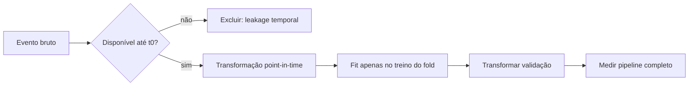
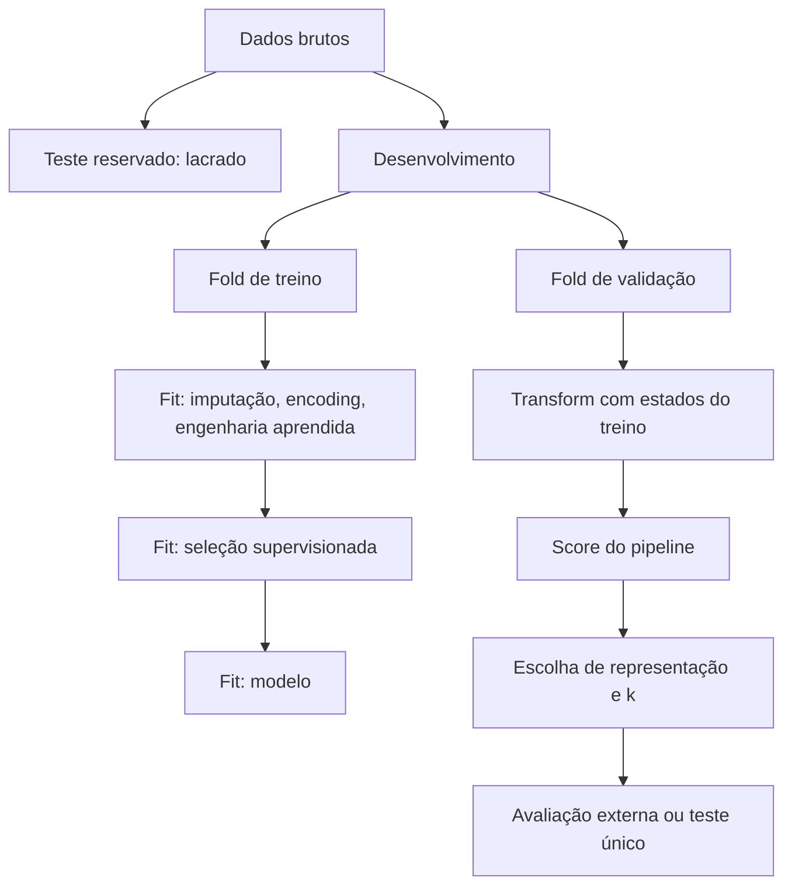

# Aula 19 — Feature engineering e seleção de variáveis

<!-- mirandastech-aula-v2 -->

**Trilha:** Especialista em IA  
**Módulo:** 03 · Machine Learning clássico (M4)  
**Pré-requisito:** [Aula 18 — Hyperparameter tuning](./18-hyperparameter-tuning.md)  
**Próxima aula:** [Aula 20 — Interpretabilidade de modelos](./20-interpretabilidade-modelos.md)

[](https://colab.research.google.com/github/joaopaulomirandamatias/ai-lab/blob/main/03-machine-learning/notebooks/19-feature-engineering-selection-laboratorio.ipynb)

> Feature engineering é a tradução de conhecimento sobre o problema para uma representação que o modelo consegue aprender. Seleção de variáveis decide quais coordenadas dessa representação chegam ao estimador. Ambas podem melhorar generalização — ou fabricar um resultado excelente e inválido se usarem o alvo, o futuro ou o conjunto de teste.

## Problema motivador

Uma equipe prevê fraude no instante em que uma transação é autorizada. A tabela contém horário, valor, identificador do cartão, histórico de compras e o campo `contestada_em_ate_30_dias`. O último campo é o melhor preditor, mas só existe depois da decisão. Em outro extremo, passar a hora como um número de 0 a 23 faz 23h parecer distante de 0h, embora sejam vizinhas no relógio.

O modelo não conhece relógios, causalidade nem disponibilidade operacional. Ele recebe números. O trabalho desta aula é construir números que expressem a estrutura correta e existam no instante da previsão, sem deixar que a avaliação contamine essa construção.

## Objetivos

Ao final, você será capaz de:

- distinguir dado bruto, transformação, extração, engenharia e seleção de features;
- representar ciclos, interações, razões e históricos sem violar disponibilidade temporal;
- comparar filtros, wrappers e métodos *embedded*;
- explicar por que um filtro univariado pode perder uma interação útil;
- colocar toda transformação aprendida e toda seleção supervisionada dentro de `Pipeline` e da validação;
- medir desempenho, custo dimensional e estabilidade da seleção;
- auditar uma feature desde a origem até o instante de predição.

## Pré-requisitos e vocabulário

Use os conceitos de split, leakage e `Pipeline` da [Aula 03](./03-preprocessamento-pipelines-leakage.md), regularização da [Aula 05](./05-regularizacao-ridge-lasso-elastic-net.md), cross-validation da [Aula 17](./17-cross-validation.md) e tuning da [Aula 18](./18-hyperparameter-tuning.md).

| Termo | Significado operacional |
|---|---|
| **feature** | variável oferecida ao estimador para produzir uma previsão |
| **transformação** | função que muda a representação, como log, escala ou seno/cosseno |
| **feature engineering** | criação de variáveis a partir de dados e conhecimento do domínio |
| **extração** | conversão de objeto bruto em vetor, como texto em contagens |
| **seleção** | escolha de um subconjunto das features disponíveis |
| ***stateless*** | transformação sem parâmetros aprendidos, se sua definição já está fixada |
| **estado aprendido** | parâmetros estimados no `fit`, como média, vocabulário ou ranking feature–alvo |
| **point-in-time correct** | valor que poderia ser reconstruído usando apenas informação disponível em \(t_0\) |

## 1. Intuição: o modelo só enxerga a geometria entregue

Considere um modelo \(f\) que opera sobre

\[
\mathbf{z}=\phi(\mathbf{x};\boldsymbol{\eta}),
\qquad
\widehat{y}=f(\mathbf{z};\boldsymbol{\theta}).
\]

Aqui:

- \(\mathbf{x}\in\mathbb{R}^{p}\) é o registro bruto com \(p\) campos;
- \(\phi\) é o mapa de representação;
- \(\boldsymbol{\eta}\) reúne parâmetros aprendidos pela transformação;
- \(\mathbf{z}\in\mathbb{R}^{q}\) é a representação com \(q\) features;
- \(\boldsymbol{\theta}\) são os parâmetros do modelo;
- \(\widehat{y}\) é a previsão.

Uma transformação logarítmica afirma que razões importam; uma interação afirma que o efeito de uma variável depende de outra; uma janela de sete dias afirma quanto passado é relevante. Portanto, \(\phi\) incorpora hipóteses. Se \(\boldsymbol{\eta}\) depende dos dados — categorias observadas, imputação, médias por grupo ou associação com \(y\) — ele deve ser estimado apenas no treino de cada fold.

Seleção acrescenta um subconjunto \(S\subseteq\{1,\ldots,q\}\):

\[
\widehat{y}=f(\mathbf{z}_S;\boldsymbol{\theta}).
\]

O objetivo preditivo não é recuperar uma suposta lista universal de “variáveis verdadeiras”, mas escolher um pipeline que generalize sob restrições de latência, custo, manutenção e disponibilidade.

## 2. Criar features úteis

### 2.1 Transformações monotônicas e de escala

Valores positivos com cauda longa — preço, contagem, intervalo — podem ser transformados por

\[
z=\log(1+x).
\]

Isso comprime extremos e permite que um modelo linear represente efeitos multiplicativos. A transformação não conserta outliers nem autoriza valores negativos: é preciso justificar domínio e tratamento. Razões, como `valor / limite_disponivel`, podem expressar mecanismo melhor que os campos isolados, mas o denominador próximo de zero exige regra explícita.

### 2.2 Ciclos

Codificar hora \(h\in\{0,\ldots,23\}\) como inteiro cria uma fronteira artificial. Para um período \(P=24\):

\[
z_{\sin}=\sin\left(\frac{2\pi h}{P}\right),
\qquad
z_{\cos}=\cos\left(\frac{2\pi h}{P}\right).
\]

A dupla é necessária: apenas seno confunde pontos simétricos. Para 23h,
\(\phi(23)\approx(-0{,}259,\ 0{,}966)\); para 0h, \(\phi(0)=(0,\ 1)\). A distância é

\[
\sqrt{(-0{,}259)^2+(0{,}966-1)^2}\approx0{,}261,
\]

coerente com uma hora de separação. O mesmo padrão serve para dia da semana, direção e sazonalidade anual, desde que o ciclo faça sentido no domínio.

### 2.3 Interações e não linearidade

Uma interação \(x_1x_2\) permite que a inclinação associada a \(x_1\) dependa de \(x_2\):

\[
\widehat{y}=\beta_0+\beta_1x_1+\beta_2x_2+\beta_3x_1x_2.
\]

Se \(x_2=0\), o efeito de \(x_1\) é \(\beta_1\); se \(x_2=1\), é \(\beta_1+\beta_3\). Isso é útil quando risco depende da combinação “valor alto **e** dispositivo novo”. Não crie todas as interações cegamente. Para \(p\) variáveis, um polinômio de grau até \(d\), incluindo o viés, produz

\[
\binom{p+d}{d}
\]

termos. Com \(p=20\) e \(d=2\), são \(\binom{22}{2}=231\): crescimento suficiente para aumentar memória, variância e custo.

### 2.4 Ausência, agregação e contexto

Um indicador `valor_ausente` pode capturar o processo de coleta, mas também pode codificar um fluxo operacional que muda. Contagens históricas, recência e médias móveis costumam ser poderosas:

\[
\operatorname{contagem}_{i,t}^{(7d)}
=\sum_s \mathbb{1}\{i_s=i,\ t-7d\le t_s<t\}.
\]

Observe o intervalo aberto em \(t\): o evento atual e eventos futuros não entram. A unidade \(i\), a janela e a política para empates de timestamp devem ser declaradas.

## 3. Disponibilidade temporal é parte da definição

Para cada predição, registre:

- **tempo do evento:** quando o fato ocorreu;
- **tempo de processamento:** quando ficou disponível ao sistema;
- **tempo de predição \(t_0\):** quando a decisão precisa ser tomada;
- **tempo do rótulo:** quando o desfecho amadurece.

Uma feature é válida somente se seu valor puder ser reproduzido com dados cujo tempo de processamento é menor ou igual a \(t_0\). Um *as-of join* busca a versão mais recente disponível até esse instante. “A coluna existe hoje no data lake” não prova que existia durante a decisão histórica.



Exemplos inválidos incluem status final da contestação, média calculada com o mês inteiro, quantidade de chamadas resolvidas e categoria corrigida após auditoria. Mesmo uma feature sem \(y\) explícito pode ser um proxy pós-desfecho.

## 4. Seleção de variáveis

Seleção pode reduzir latência, custo de aquisição, ruído e complexidade operacional. Ela não é obrigatória: regularização e modelos de árvore frequentemente lidam bem com muitas variáveis. Remover informação cedo demais também prejudica.

| Família | Como decide | Vantagem | Limite principal |
|---|---|---|---|
| não supervisionada | variância, duplicidade, regra de domínio | barata; não consulta \(y\) | baixa variância não significa irrelevância |
| filtro | score de cada feature com \(y\) | rápido e agnóstico ao modelo | ignora interações e redundância |
| wrapper | treina modelos para comparar subconjuntos | otimiza em torno do estimador | muitos fits; viés se o loop não for aninhado |
| *embedded* | seleção ocorre durante o ajuste | integra objetivo e estimador | depende de hipóteses e hiperparâmetros do modelo |

### 4.1 Filtros

`VarianceThreshold` remove constantes ou baixa variância sem usar \(y\). Entre filtros supervisionados, o teste F procura dependência linear; \(\chi^2\) requer features não negativas; informação mútua capta dependência mais geral, mas sua estimativa não paramétrica demanda mais amostras.

`SelectKBest` cria um ranking e mantém \(k\) features. Tanto o score quanto \(k\) pertencem ao pipeline e, se \(k\) for escolhido, ao loop de tuning. Ajustar o seletor uma vez no dataset completo antes de cross-validation revela ao processo quais correlações aleatórias ocorreram nos folds de validação.

### 4.2 Wrappers

RFE elimina iterativamente as features menos valorizadas por um estimador. Seleção sequencial adiciona ou remove features conforme um score de validação. São procedimentos gulosos: não garantem o melhor subconjunto global. Seu custo pode ser alto; uma etapa backward de \(m\) para \(m-1\) features com \(K\) folds exige \(mK\) ajustes. Se o wrapper escolhe features por CV, a estimativa final requer um loop externo ou teste reservado.

### 4.3 Métodos *embedded*

Lasso e regressão logística com penalidade L1 produzem coeficientes esparsos; árvores podem alimentar `SelectFromModel`. O conjunto selecionado depende da escala, regularização, correlações, seed e amostra. Importância por impureza também pode favorecer variáveis contínuas ou de alta cardinalidade. A próxima aula tratará interpretação; aqui, importância é apenas uma regra de seleção que deve ser validada fora da amostra.

## 5. O ponto cego univariado: XOR

Suponha \(x_1,x_2\in\{-1,+1\}\) igualmente prováveis e

\[
y=\mathbb{1}\{x_1x_2>0\}.
\]

Separadamente, \(x_1\) e \(x_2\) não informam \(y\): para qualquer valor de \(x_1\), metade dos exemplos é positiva. Um filtro univariado pode descartar ambos. A interação \(x_1x_2\), porém, determina a classe perfeitamente.

Esse exemplo não condena filtros; mostra que o mecanismo gerador e o estimador importam. Antes de selecionar, pergunte quais relações podem existir e se a etapa anterior de engenharia as torna visíveis.

## 6. Redundância e estabilidade

Duas cópias correlacionadas carregam quase a mesma informação. Pequenas mudanças de amostra podem fazer um seletor escolher uma ou outra, preservando a previsão mas alterando a lista. Para subconjuntos \(S_a\) e \(S_b\), uma medida simples é Jaccard:

\[
J(S_a,S_b)=\frac{|S_a\cap S_b|}{|S_a\cup S_b|}.
\]

Valores próximos de 1 indicam listas semelhantes; valores baixos pedem investigação. Estabilidade não prova validade, e exigir estabilidade perfeita pode punir grupos redundantes legítimos. Reporte desempenho e estabilidade, além do custo de obter cada feature.

## 7. Pipeline experimental correto



Um esqueleto para dados heterogêneos:

```python
from sklearn.compose import ColumnTransformer
from sklearn.feature_selection import SelectKBest, f_classif
from sklearn.impute import SimpleImputer
from sklearn.linear_model import LogisticRegression
from sklearn.pipeline import Pipeline
from sklearn.preprocessing import OneHotEncoder, StandardScaler

pre = ColumnTransformer([
    ("num", Pipeline([
        ("impute", SimpleImputer(strategy="median")),
        ("scale", StandardScaler()),
    ]), numeric_columns),
    ("cat", OneHotEncoder(handle_unknown="ignore"), categorical_columns),
])

model = Pipeline([
    ("pre", pre),
    ("select", SelectKBest(f_classif, k=20)),
    ("clf", LogisticRegression(max_iter=2_000)),
])
```

`Pipeline` garante ordem e isolamento estatístico, mas não corrige uma coluna futura, um split incompatível com grupos ou uma transformação customizada que consulta dados globais. O protocolo ainda é responsabilidade de quem modela.

### Checklist de comparação

1. Fixe pergunta, unidade de análise, \(t_0\), split e métrica.
2. Compare com um baseline de representação bruta.
3. Altere uma família de features por vez nos mesmos folds.
4. Coloque transformações aprendidas e seletores dentro do pipeline.
5. Ajuste \(k\), regularização e demais escolhas somente no treino interno.
6. Reporte média, dispersão, número de features e tempo/custo.
7. Faça ablação por famílias, não apenas feature por feature.
8. Inspecione estabilidade entre folds ou reamostragens.
9. Refaça a auditoria point-in-time antes do teste reservado.

## 8. Laboratório reproduzível

O [notebook da Aula 19](../notebooks/19-feature-engineering-selection-laboratorio.ipynb) usa dados sintéticos e seed fixa. Ele:

- compara hora bruta com seno/cosseno em uma relação periódica;
- mostra uma interação que um modelo linear bruto não aprende;
- contrasta seleção contaminada com `SelectKBest` dentro do pipeline;
- demonstra o salto enganoso de uma feature disponível apenas depois de \(t_0\);
- executa asserts e registra versões.

Dependências mínimas: Python 3.10, NumPy 1.26, Matplotlib 3.8 e scikit-learn 1.4. Não há download, credencial ou dado pessoal. O teste fica lacrado durante decisões de representação.

## 9. Armadilhas e limites

- **Gerar antes do split não é sempre seguro.** Seno/cosseno com período fixado pelo domínio é *stateless*; média, frequência, vocabulário e target encoding aprendem estado.
- **Target encoding ingênuo vaza.** Cada linha não deve enxergar o próprio rótulo; use cross-fitting no treino e política para categorias novas.
- **Correlação não mede disponibilidade.** Uma feature perfeita pode ser impossível em produção.
- **Alta cardinalidade explode dimensão.** Hashing, agrupamento ou regularização podem ser necessários, sempre medidos no pipeline.
- **Mais features não significam mais sinal.** A busca encontra correlações espúrias quando \(p\) é grande e \(n\) pequeno.
- **Seleção não estabelece causalidade.** O algoritmo otimiza associação preditiva sob o dataset e o protocolo.
- **Lista selecionada não é eterna.** Mudanças de coleta, população e custo exigem monitoramento e nova validação.

## 10. Exercícios com respostas comentadas

### 1. Ciclo

Codifique terça-feira em um ciclo semanal com segunda \(=0\).

**Resposta:** terça tem \(h=1\) e \(P=7\):
\[
(\sin(2\pi/7),\cos(2\pi/7))\approx(0{,}782,\ 0{,}623).
\]
O par preserva proximidade circular entre domingo e segunda.

### 2. Contagem dimensional

Quantas colunas `PolynomialFeatures(degree=2, include_bias=False)` cria para \(p=8\)?

**Resposta:** \(\binom{8+2}{2}-1=45-1=44\). Isso inclui termos lineares, quadrados e interações; o “\(-1\)” remove o viés.

### 3. Leakage de seleção

Por que selecionar 30 entre 10.000 features usando todo o dataset e depois executar CV é inválido?

**Resposta:** os rótulos de cada fold de validação já influenciaram o ranking das 30 features. A CV mede um pipeline com acesso indireto à validação. O seletor deve ser reajustado dentro de cada fold.

### 4. Timestamp

“Número de tickets encerrados pelo cliente nos sete dias seguintes” é uma feature histórica?

**Resposta:** não para uma decisão em \(t_0\). O intervalo está no futuro. Uma alternativa válida seria a contagem encerrada nos sete dias anteriores, usando tempo de processamento e intervalo estritamente anterior a \(t_0\).

### 5. XOR

Por que manter apenas variáveis com alto score F univariado pode falhar no XOR?

**Resposta:** cada variável isolada é independente do rótulo, embora o produto das duas determine a classe. Engenharia de interação ou um estimador capaz de aprender a interação precisa ocorrer antes da decisão de descarte.

### 6. Filtro, wrapper ou *embedded*

Classifique `VarianceThreshold`, seleção sequencial e Lasso.

**Resposta:** respectivamente: filtro não supervisionado, wrapper e método *embedded*. O primeiro olha apenas \(X\); o segundo compara subconjuntos treinando modelos; o terceiro induz esparsidade durante o ajuste.

### 7. Estabilidade

Dois folds selecionaram \(S_1=\{a,b,c,d\}\) e \(S_2=\{a,b,d,e\}\). Calcule Jaccard.

**Resposta:** a interseção tem 3 elementos e a união 5, então \(J=3/5=0{,}6\). O valor sugere investigar redundância e tamanho da amostra; não permite concluir sozinho que o pipeline é ruim.

### 8. Desenho real

Para um sistema de triagem, documente uma feature temporal.

**Resposta-modelo:** “`chamados_30d` é a contagem de chamados da mesma conta com `processado_em < t0` e `evento_em >= t0-30d`; eventos com processamento atrasado não entram; a implementação é validada por snapshots históricos”. A definição informa entidade, janela, relógios e política de corte.

## Resumo

- Representação é uma hipótese operacional expressa por \(\phi\).
- Ciclos precisam de duas coordenadas; interações permitem efeitos condicionais.
- Features históricas exigem correção point-in-time e distinção entre tempo do evento e de processamento.
- Filtros são baratos, wrappers são caros e métodos *embedded* dependem do estimador.
- Seleção supervisionada e seus hiperparâmetros pertencem ao pipeline e ao loop interno.
- Filtros univariados podem perder interações; features correlacionadas podem tornar a lista instável.
- Desempenho, estabilidade, custo e disponibilidade devem ser avaliados juntos.

## Referências técnicas

Fontes verificadas em **8 de setembro de 2026**:

1. Guyon, I.; Elisseeff, A. (2003). [An Introduction to Variable and Feature Selection](https://jmlr.org/papers/v3/guyon03a.html). JMLR 3 — artigo primário sobre objetivos, métodos e riscos de seleção.
2. scikit-learn 1.9. [Feature selection](https://scikit-learn.org/stable/modules/feature_selection.html) — filtros, RFE, `SelectFromModel`, seleção sequencial e uso em pipeline.
3. scikit-learn 1.9. [Pipelines and composite estimators](https://scikit-learn.org/stable/modules/compose.html#pipeline) — composição, tuning conjunto e isolamento entre treino e validação.
4. scikit-learn 1.9. [PolynomialFeatures](https://scikit-learn.org/stable/modules/generated/sklearn.preprocessing.PolynomialFeatures.html) — definição e crescimento dimensional.
5. scikit-learn 1.9. [Common pitfalls and recommended practices](https://scikit-learn.org/stable/common_pitfalls.html) — preprocessing, leakage e escolhas aleatórias.
6. James et al. (2023). [An Introduction to Statistical Learning with Applications in Python](https://www.statlearning.com/) — bases não lineares, regularização e seleção.

## Próxima aula

Na [Aula 20](./20-interpretabilidade-modelos.md), usaremos coeficientes, permutation importance e SHAP para investigar como um modelo treinado usa suas features — sem confundir explicação preditiva com causalidade.
