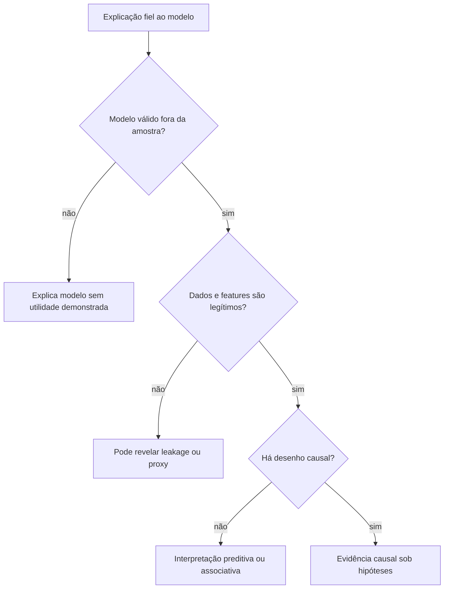

# Aula 20 — Interpretabilidade: coeficientes, permutation importance e SHAP

<!-- mirandastech-aula-v2 -->

**Trilha:** Especialista em IA  
**Módulo:** 03 · Machine Learning clássico (M4)  
**Pré-requisito:** [Aula 19 — Feature engineering e seleção de variáveis](./19-feature-engineering-selection.md)  
**Próxima aula:** [Aula 21 — Clustering: K-Means, hierárquico e DBSCAN](./21-clustering-kmeans-hierarquico-dbscan.md)

[](https://colab.research.google.com/github/joaopaulomirandamatias/ai-lab/blob/main/03-machine-learning/notebooks/20-interpretabilidade-modelos-laboratorio.ipynb)

> Uma explicação pode ser fiel ao comportamento de um modelo e ainda assim descrever um modelo errado, dados contaminados ou uma associação sem efeito causal. Interpretar é formular uma pergunta precisa, escolher uma referência e testar a explicação — não apenas gerar um gráfico colorido.

## Problema motivador

Um modelo de risco rejeita uma solicitação. A pessoa afetada pergunta: “por que **esta** decisão?”. A equipe de produto pergunta: “o que o modelo usa **em média**?”. A auditoria pergunta: “ele depende de um proxy indevido?”. Já a equipe científica pergunta: “essa variável causa o desfecho?”.

São quatro perguntas diferentes. Um coeficiente global, uma queda de score após permutação e uma atribuição SHAP local não respondem a todas elas. Antes de escolher a ferramenta, defina modelo e versão, população de referência, pergunta global ou local, saída explicada, significado de “feature ausente” e público da explicação.

## Objetivos

Ao concluir a aula, você será capaz de:

- separar interpretabilidade intrínseca e explicação *post hoc*;
- interpretar coeficientes respeitando unidade, escala, codificação e colinearidade;
- calcular permutation importance em dados não usados no ajuste;
- explicar por que features correlacionadas dividem ou mascaram importância;
- derivar valores de Shapley e descrever o papel do *background*;
- distinguir explicação global, local, fidelidade, estabilidade e utilidade;
- executar testes negativos antes de usar uma explicação em sistema real;
- afirmar com precisão o que uma explicação preditiva não demonstra.

## Pré-requisitos e vocabulário

Retome modelos lineares das [Aulas 04](./04-regressao-linear-minimos-quadrados.md) e [06](./06-regressao-logistica-classificacao-probabilistica.md), árvores e ensembles das [Aulas 09](./09-arvores-decisao.md) e [10](./10-random-forest-bagging.md), avaliação fora da amostra da [Aula 17](./17-cross-validation.md) e representação da [Aula 19](./19-feature-engineering-selection.md).

| Termo | Significado nesta aula |
|---|---|
| **interpretação global** | resumo de como o modelo se comporta em uma população de referência |
| **explicação local** | decomposição ou aproximação de uma previsão específica |
| **intrínseca** | interpretação obtida da própria forma do modelo, sob hipóteses declaradas |
| ***post hoc*** | análise realizada depois que o modelo foi treinado |
| **model-specific** | técnica que usa a estrutura interna de uma família de modelos |
| **model-agnostic** | técnica que trata o modelo como função de entrada e saída |
| **fidelidade** | quanto a explicação representa o comportamento do modelo na pergunta definida |
| **estabilidade** | quanto a explicação muda sob perturbações justificáveis |
| ***background*** | distribuição ou amostra que define a referência de uma explicação local |
| **atribuição** | crédito numérico dado a uma feature; não é automaticamente causalidade |

## 1. A tríade: modelo, dados e pergunta

Uma explicação nunca existe sozinha:

\[
\mathcal{E}=\mathcal{E}(f,\mathcal{D},q),
\]

em que \(f\) é o modelo treinado, \(\mathcal{D}\) é o conjunto ou distribuição de referência e \(q\) é a pergunta. Trocar teste por treino, população geral por um segmento ou logit por probabilidade pode mudar o resultado.


**Interpretação intrínseca** não significa interpretação automática. Uma árvore rasa pode ser inspecionável; uma floresta com centenas de árvores não é. Uma regressão linear tem coeficientes, mas interações, transformações, colinearidade e escala alteram o significado.

## 2. Coeficientes: simples na fórmula, condicionais na leitura

Para regressão linear:

\[
\widehat{y}=\beta_0+\sum_{j=1}^{p}\beta_jx_j.
\]

Mantendo as demais features fixas, aumentar \(x_j\) em uma unidade altera \(\widehat y\) em \(\beta_j\). Essa comparação precisa fazer sentido e permanecer no domínio observado.

### 2.1 Unidade e escala

Se quilômetros são substituídos por metros, as mesmas previsões surgem com coeficiente mil vezes menor. Magnitude bruta não compara importância entre unidades. Após padronizar

\[
z_j=\frac{x_j-\mu_j}{\sigma_j},
\]

o coeficiente corresponde a um desvio-padrão de \(x_j\), mas depende da população de treino e não resolve colinearidade.

### 2.2 Categóricas, transformações e interações

Um coeficiente de *one-hot* é relativo à categoria de referência. Em \(x_1x_2\), o efeito de \(x_1\) é \(\beta_1+\beta_3x_2\), portanto não há uma inclinação independente de \(x_2\). Se a feature é \(\log(x)\), uma unidade no espaço transformado não é uma unidade original.

Guarde nomes produzidos pelo pipeline. Explicar `x17` depois de imputação, *one-hot* e polinômios não atende uma auditoria.

### 2.3 Regressão logística

Com

\[
\log\frac{p}{1-p}=\beta_0+\sum_j\beta_jx_j,
\]

\(\exp(\beta_j)\) é a razão multiplicativa das *odds* para uma unidade adicional de \(x_j\), mantendo as demais features fixas. Não é aumento absoluto de probabilidade: o mesmo deslocamento no logit tem efeitos distintos conforme o ponto inicial.

### 2.4 Colinearidade

Se \(x_1\) e \(x_2\) carregam quase a mesma informação, muitos pares produzem previsões semelhantes:

\[
\beta_1x_1+\beta_2x_2
\approx(\beta_1+\delta)x_1+(\beta_2-\delta)x_2.
\]

No laboratório, coeficientes individuais de duas cópias correlacionadas variam entre bootstraps, enquanto sua soma e o \(R^2\) permanecem estáveis. Sinal instável não significa necessariamente previsão instável.

## 3. Permutation importance: “quanto este modelo depende?”

Depois de validar que o modelo generaliza, calcule um score \(s\). Para cada feature \(j\), embaralhe a coluna \(K\) vezes e meça:

\[
I_j=s-\frac{1}{K}\sum_{k=1}^{K}s_{k,j}.
\]

Aqui, \(I_j\) é a importância, \(s\) é o score sem corrupção, \(s_{k,j}\) é o score na repetição \(k\) e \(K\) controla a incerteza Monte Carlo. Se quebrar a associação da feature com as linhas prejudica o score, o modelo dependia dela naquele dataset e naquela métrica. A técnica é *model-agnostic*, mas não mede valor intrínseco universal.

```python
from sklearn.inspection import permutation_importance

result = permutation_importance(
    fitted_model,
    X_test,
    y_test,
    scoring="r2",
    n_repeats=20,
    random_state=20260908,
)
```

### 3.1 Onde medir

- **Treino:** mostra o que o modelo explorou, inclusive sobreajuste.
- **Validação/teste não usado no fit:** aproxima dependência ligada à generalização.
- **Segmento:** responde sobre aquela subpopulação e exige amostra e incerteza adequadas.

Importância depende da métrica. Uma feature pode ser relevante para recall raro e pouco alterar accuracy. Valor negativo é possível: a corrupção melhorou o score naquela amostra, sinal de ruído, sobreajuste ou variação da estimativa — não “importância causal negativa”.

### 3.2 Features correlacionadas

Ao permutar \(x_1\), o modelo ainda recupera sinal por \(x_2\). A importância individual de ambas pode parecer pequena. Uma **permutação agrupada** aplica a mesma permutação às colunas relacionadas, preserva sua relação conjunta e quebra a ligação do grupo com \(y\).

O laboratório mostra queda agrupada maior que as quedas individuais. O grupo responde “quanto este modelo depende desta família?”, não “qual membro é causa”.

### 3.3 Perturbações fora da distribuição

Permutar uma coluna independentemente pode criar combinações impossíveis — idade 8 com 30 anos de emprego. Alternativas condicionais tentam respeitar dependências, mas precisam estimar \(P(X_j\mid X_{-j})\) e introduzem hipóteses novas.

## 4. SHAP e o valor de uma coalizão

SHAP conecta explicações aditivas locais aos valores de Shapley. Para uma observação \(x\), defina \(v(S)\): a previsão esperada quando o conjunto \(S\) é conhecido e as demais features são tratadas conforme uma distribuição de referência.

Para \(M\) features:

\[
\phi_j=
\sum_{S\subseteq F\setminus\{j\}}
\frac{|S|!\,(M-|S|-1)!}{M!}
\left[v(S\cup\{j\})-v(S)\right].
\]

Nessa expressão, \(F=\{1,\ldots,M\}\), \(S\) é uma coalizão sem \(j\), o termo fatorial pondera todas as ordens possíveis e \(\phi_j\) é a contribuição marginal média. A decomposição satisfaz

\[
f(x)=\phi_0+\sum_{j=1}^{M}\phi_j,
\qquad
\phi_0=v(\varnothing).
\]

Essa eficiência verifica a soma, não a correção semântica.

### Exemplo resolvido

Considere \(f(x)=1+2x_1+0{,}5x_2\), \(x=(3,4)\) e *background* médio \(\mu=(1,2)\). Para o modelo linear aditivo:

\[
\phi_0=f(\mu)=4,\quad
\phi_1=2(3-1)=4,\quad
\phi_2=0{,}5(4-2)=1.
\]

Logo \(4+4+1=9=f(x)\). Se a referência mudar para \(\mu_1=2{,}5\), o baseline sobe e \(\phi_1\) cai. A previsão não mudou; mudou “em relação a quem?”.

### 4.1 “Feature ausente” não é ausência literal

Modelos tabulares geralmente não aceitam uma coluna apagada. É necessário integrar, condicionar ou substituir:

- **interventional:** combina features de \(x\) com linhas do *background*; pode quebrar dependências;
- **conditional:** usa a distribuição das ausentes condicionada às presentes; preserva associações, mas exige estimá-la;
- **máscara nativa:** alguns modelos têm mecanismo próprio, cuja semântica precisa ser justificada.

Com features correlacionadas, essas escolhas distribuem crédito de modos diferentes. Declare biblioteca, versão, explicador, output, *background* e amostra.

### 4.2 O espaço da saída

Uma soma no espaço de log-odds não deve ser apresentada como pontos percentuais. Verifique se o explicador reconstrói \(f(x)\), logit ou outra transformação. Em multiclasse, informe a classe explicada.

## 5. O que a explicação não prova



Uma atribuição alta não demonstra que alterar a feature produzirá o efeito, que ela é aceitável, que o dado existe em produção, que o modelo é calibrado/justo/robusto ou que a decisão final é adequada. CEP pode ser proxy socioeconômico; contatos após atraso podem ser leakage. Explicações apoiam diagnóstico e governança, mas não substituem desenho causal, análise de impacto nem revisão humana competente.

## 6. Como auditar uma explicação

| Teste | Pergunta | Falha revelada |
|---|---|---|
| desempenho externo | o modelo generaliza antes de ser explicado? | importância de modelo ruim |
| reconstrução local | baseline + atribuições recupera a saída? | output ou implementação incorreta |
| repetição/seed | ranking e sinal resistem ao acaso? | explicação instável |
| reamostragem | coeficientes resistem à amostra? | colinearidade ou poucos dados |
| *backgrounds* plausíveis | a narrativa muda com a referência? | população omitida |
| grupos correlacionados | a dependência aparece ao perturbar a família? | crédito mascarado |
| randomização | o explicador reage ao destruir modelo/labels? | mapa desconectado do modelo |
| revisão de domínio | perturbações são possíveis? | explicação fora da distribuição |

### Checklist prático

- [ ] Identifiquei modelo, hash/versão, pipeline e dataset.
- [ ] Declarei público, decisão e pergunta global/local.
- [ ] Validei o modelo em dados não usados no ajuste.
- [ ] Nomeei o output explicado e sua unidade.
- [ ] Mantive nomes após todas as transformações.
- [ ] Reportei dispersão, não apenas ranking médio.
- [ ] Investiguei features correlacionadas em grupo.
- [ ] Testei pelo menos dois *backgrounds* defensáveis.
- [ ] Verifiquei reconstrução ou fidelidade local.
- [ ] Separei associação preditiva de afirmação causal.
- [ ] Registrei limitações e mecanismo de contestação.

## 7. Laboratório reproduzível

O [notebook da Aula 20](../notebooks/20-interpretabilidade-modelos-laboratorio.ipynb) usa dados sintéticos, seed fixa e apenas NumPy, Matplotlib e scikit-learn. Ele:

1. ajusta regressão com duas features quase duplicadas;
2. compara coeficientes brutos e padronizados;
3. mede instabilidade individual e estabilidade conjunta por bootstrap;
4. calcula permutation importance individual e agrupada em teste reservado;
5. implementa Shapley exato para quatro features, enumerando 16 coalizões;
6. confirma eficiência numérica e compara dois *backgrounds*.

Dependências mínimas: Python 3.10, NumPy 1.26, Matplotlib 3.8 e scikit-learn 1.4. Não é preciso instalar `shap`; a implementação pequena explicita a função de valor interventional.

## 8. Armadilhas e limites

- Ordenar coeficientes brutos de features em unidades diferentes.
- Interpretar coeficiente logístico como variação direta de probabilidade.
- Omitir categoria de referência ou nomes após `OneHotEncoder`.
- Explicar treino e chamar o resultado de generalização.
- Calcular permutation importance antes de validar o modelo.
- Ignorar correlação e concluir que features substituíveis são inúteis.
- Usar um único *background* conveniente sem dizer quem ele representa.
- Mostrar SHAP no logit como se fosse probabilidade.
- Confundir exatidão aditiva com verdade causal.
- Usar explicação local para afirmar comportamento global.
- Usar gráfico persuasivo sem estabilidade ou randomização.

## 9. Exercícios com respostas comentadas

### 1. Escala

Distância em quilômetros tem coeficiente \(-0{,}8\). Qual coeficiente mantém as previsões se a coluna mudar para metros?

**Resposta:** \(-0{,}0008\) por metro. Mil metros produzem \(-0{,}8\), mostrando por que magnitude bruta não compara unidades.

### 2. Odds

Na regressão logística, \(\beta=0{,}693\). O que \(\exp(\beta)\approx2\) significa?

**Resposta:** mantendo as demais features fixas, uma unidade adicional multiplica as *odds* por aproximadamente 2. Não duplica necessariamente a probabilidade nem prova causa.

### 3. Permutação

O \(R^2\) é \(0{,}72\). Após quatro permutações, os scores são \(0{,}60\), \(0{,}58\), \(0{,}62\) e \(0{,}56\). Calcule \(I_j\).

**Resposta:** a média é \(0{,}59\); então \(I_j=0{,}72-0{,}59=0{,}13\).

### 4. Importância negativa

Uma feature obteve \(I_j=-0{,}004\pm0{,}012\). Ela protege o sistema?

**Resposta:** não. É compatível com contribuição nula e variação amostral/Monte Carlo. Investigue sobreajuste; não dê sentido causal ao sinal.

### 5. Correlação

Duas medidas duplicadas têm importância individual baixa, mas a permutação conjunta derruba o score. Interprete.

**Resposta:** o modelo substitui uma pela outra quando só uma é corrompida. O grupo carrega sinal; o experimento não identifica qual medida é causal.

### 6. Shapley com duas features

Se \(v(\varnothing)=2\), \(v(\{1\})=5\), \(v(\{2\})=4\) e \(v(\{1,2\})=8\), calcule as atribuições.

**Resposta:**
\[
\phi_1=\tfrac12[(5-2)+(8-4)]=3{,}5,\qquad
\phi_2=\tfrac12[(4-2)+(8-5)]=2{,}5.
\]
Baseline e contribuições somam \(2+3{,}5+2{,}5=8\).

### 7. Background

Por que a explicação muda ao trocar população geral por clientes empresariais?

**Resposta:** baseline e contribuições passam a responder “em relação a clientes empresariais”. Modelo e previsão podem permanecer iguais; a referência mudou.

### 8. Causalidade

SHAP alto para `numero_de_cobrancas` prova que aumentar cobranças reduz inadimplência?

**Resposta:** não. A variável pode refletir risco anterior, política operacional ou seleção. Efeito de intervenção exige desenho causal próprio.

## Resumo

- Toda explicação depende de modelo, dados de referência e pergunta.
- Coeficientes exigem unidade, escala, codificação, interações e colinearidade explícitas.
- Permutation importance mede queda de uma métrica para um modelo, não valor universal.
- Features correlacionadas dividem ou mascaram crédito; permutação agrupada responde sobre a família.
- SHAP calcula contribuições marginais sobre coalizões e um *background* declarado.
- Eficiência aditiva verifica a soma, não causalidade, justiça ou correção do modelo.
- Explicações precisam de reconstrução, estabilidade, randomização e plausibilidade.

## Referências técnicas

Fontes verificadas em **8 de setembro de 2026**:

1. Lundberg, S.; Lee, S.-I. (2017). [A Unified Approach to Interpreting Model Predictions](https://papers.nips.cc/paper_files/paper/2017/hash/8a20a8621978632d76c43dfd28b67767-Abstract.html). NeurIPS — artigo original do SHAP.
2. Fisher, A.; Rudin, C.; Dominici, F. (2019). [All Models are Wrong, but Many are Useful](https://jmlr.org/papers/v20/18-760.html). JMLR — model reliance.
3. Adebayo et al. (2018). [Sanity Checks for Saliency Maps](https://proceedings.neurips.cc/paper/2018/hash/294a8ed24b1ad22ec2e7efea049b8737-Abstract.html). NeurIPS — testes de randomização.
4. scikit-learn 1.9. [Permutation feature importance](https://scikit-learn.org/stable/modules/permutation_importance.html) — algoritmo, métrica e correlação.
5. scikit-learn 1.9. [Pitfalls in coefficient interpretation](https://scikit-learn.org/stable/auto_examples/inspection/plot_linear_model_coefficient_interpretation.html) — escala, variabilidade e correlação.

## Próxima aula

Na [Aula 21](./21-clustering-kmeans-hierarquico-dbscan.md), retiraremos o target e estudaremos clustering. Sem rótulo, um grupo encontrado não é automaticamente uma categoria real; geometria, estabilidade e utilidade de domínio tornam-se centrais.
