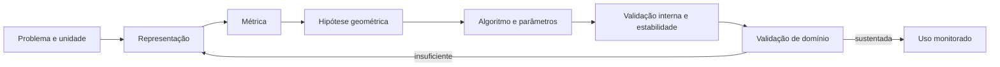
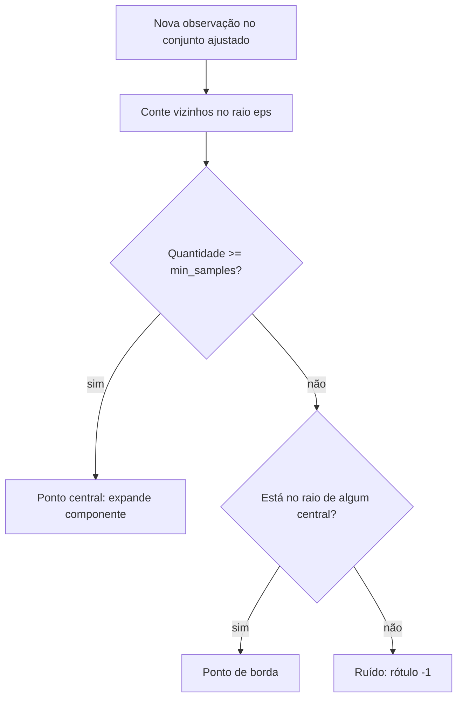

# Aula 21 — Clustering: K-Means, hierárquico e DBSCAN

<!-- mirandastech-aula-v2 -->

**Trilha:** Especialista em IA  
**Módulo:** 03 · Machine Learning clássico (M4)  
**Pré-requisito:** [Aula 20 — Interpretabilidade de modelos](./20-interpretabilidade-modelos.md)  
**Próxima aula:** [Aula 22 — Redução de dimensionalidade em ML](./22-reducao-dimensionalidade-ml.md)

[](https://colab.research.google.com/github/joaopaulomirandamatias/ai-lab/blob/main/03-machine-learning/notebooks/21-clustering-kmeans-hierarquico-dbscan-laboratorio.ipynb)

> Clustering não descobre automaticamente “os grupos verdadeiros”. Ele propõe uma partição coerente com uma representação, uma métrica e uma hipótese geométrica. O trabalho científico começa quando verificamos se essa partição é estável, útil e defensável no domínio.

## Problema motivador

Uma equipe quer segmentar usuários para personalizar atendimento. Não existe uma coluna `perfil`; há frequência de uso, gasto, tempo desde a última atividade e canal preferido. K-Means retorna quatro grupos com nomes tentadores: “fiéis”, “em risco”, “premium” e “ocasionais”. Mas outra unidade de medida, uma inicialização diferente ou a inclusão de uma feature redundante muda os grupos.

Isso não é um detalhe cosmético. Uma segmentação pode definir preço, campanha, prioridade de fiscalização ou investigação científica. Antes de dar significado aos rótulos, precisamos responder:

- quais objetos podem ser comparados e em qual instante;
- que representação e distância expressam similaridade relevante;
- que forma, tamanho e densidade o algoritmo pressupõe;
- se o agrupamento resiste a amostragem, ruído e escolhas plausíveis;
- se os grupos geram uma decisão útil sem produzir dano indevido.

## Objetivos

Ao concluir a aula, você será capaz de:

- formalizar clustering como construção de uma partição sem target;
- implementar e interpretar as etapas de Lloyd do K-Means;
- comparar os linkages de clustering hierárquico e ler um dendrograma;
- definir pontos centrais, de borda e ruído no DBSCAN;
- explicar como escala, métrica, outliers e dimensionalidade alteram a geometria;
- calcular inertia, silhouette e Adjusted Rand Index (ARI) sem tratá-los como verdade;
- medir estabilidade por perturbação ou reamostragem;
- distinguir método indutivo de método transdutivo;
- criar um protocolo auditável antes de batizar ou operacionalizar clusters.

## Pré-requisitos e vocabulário

Retome distância e escala na [Aula 07](./07-knn-distancias-dimensionalidade.md), pipelines e leakage na [Aula 03](./03-preprocessamento-pipelines-leakage.md), validação na [Aula 17](./17-cross-validation.md) e cautelas de interpretação na [Aula 20](./20-interpretabilidade-modelos.md).

| Termo | Significado nesta aula |
|---|---|
| **partição** | divisão das observações em subconjuntos disjuntos |
| **cluster** | subconjunto produzido por um critério operacional, não uma classe natural por definição |
| **centroide** | média vetorial das observações atribuídas a um cluster |
| **métrica** | regra usada para quantificar distância ou dissimilaridade |
| **linkage** | regra de distância entre dois grupos no método hierárquico |
| **densidade** | concentração de observações em uma vizinhança definida |
| **ruído** | ponto não atribuído a cluster pelo DBSCAN, indicado por rótulo `-1` |
| **estabilidade** | concordância da partição sob mudanças justificáveis em dados ou procedimento |
| **indutivo** | possui regra para atribuir novas observações depois do ajuste |
| **transdutivo** | produz rótulos principalmente para o conjunto ajustado, sem `predict` natural |

## 1. O objeto científico vem antes do algoritmo

Em aprendizagem supervisionada, o target orienta o que deve ser previsto. Em clustering, essa âncora não existe. O algoritmo vê somente uma matriz

\[
X\in\mathbb{R}^{n\times p},
\]

com \(n\) observações e \(p\) features, mais as decisões de representação. Se idade está em anos e renda em centavos, distância euclidiana será dominada pela renda. Se duas colunas repetem a mesma informação, essa dimensão recebe peso duplicado. Se misturamos eventos da mesma pessoa em períodos diferentes, talvez agrupemos fases da pessoa em vez de pessoas.

O protocolo mínimo declara unidade de análise, janela temporal, população, features disponíveis, tratamento de ausentes, escala, métrica e uso pretendido. Não use outcome futuro para “melhorar” a segmentação: mesmo sem target explícito, isso pode vazar informação para uma decisão posterior.



## 2. K-Means: uma hipótese de centroides

Para \(K\) clusters \(C_1,\ldots,C_K\), K-Means minimiza a soma de quadrados dentro dos grupos, também chamada *inertia*:

\[
J=\sum_{k=1}^{K}\sum_{x_i\in C_k}\lVert x_i-\mu_k\rVert_2^2,
\qquad
\mu_k=\frac{1}{|C_k|}\sum_{x_i\in C_k}x_i.
\]

Aqui, \(x_i\) é a observação \(i\), \(\mu_k\) é o centroide do grupo \(k\), \(|C_k|\) é seu número de pontos e \(\lVert\cdot\rVert_2\) é a norma euclidiana. O quadrado pune distâncias grandes e torna a média o centro ótimo para atribuições fixas.

### 2.1 Algoritmo de Lloyd

1. Inicialize \(K\) centroides.
2. Atribua cada ponto ao centroide mais próximo.
3. Recalcule cada centroide como a média dos pontos atribuídos.
4. Repita até os centroides estabilizarem ou atingir o limite.

Cada passo não aumenta \(J\), mas a função não é convexa em atribuições e centroides simultaneamente. A solução pode ser um mínimo local. `k-means++` espalha os centros iniciais e `n_init` repete o ajuste; seed fixa garante reexecução, não validade.

### Exemplo resolvido

Considere \(x=[0,1,9,10]\), \(K=2\) e centros iniciais \(\mu_1=0\), \(\mu_2=9\). A atribuição gera \(C_1=\{0,1\}\) e \(C_2=\{9,10\}\). As médias tornam-se \(0{,}5\) e \(9{,}5\). A inertia é

\[
(0-0{,}5)^2+(1-0{,}5)^2+(9-9{,}5)^2+(10-9{,}5)^2=1.
\]

Na iteração seguinte, as atribuições não mudam. Os nomes `0` e `1` são arbitrários: trocar seus números não altera a partição.

### 2.2 O que a função objetivo favorece

K-Means cria células de Voronoi e funciona melhor para grupos compactos, convexos, aproximadamente isotrópicos e de variâncias comparáveis. Ele exige \(K\), é sensível a outliers e pode dividir uma forma curva ou juntar regiões de densidades distintas. Menor inertia não escolhe \(K\): ela nunca aumenta quando adicionamos centroides e vale zero quando cada ponto vira seu próprio grupo.

## 3. Clustering hierárquico aglomerativo

O método aglomerativo começa com um cluster por observação e funde, passo a passo, os dois grupos mais próximos. O dendrograma registra a sequência e a distância de cada fusão. Cortá-lo em certa altura produz uma partição, mas um ramo visualmente longo não substitui validação.

| Linkage | Distância entre grupos | Comportamento típico |
|---|---|---|
| **single** | menor distância entre pares | alcança formas não globulares, mas sofre *chaining* e ruído |
| **complete** | maior distância entre pares | favorece grupos compactos e limita diâmetro |
| **average** | média das distâncias entre pares | compromisso; aceita várias métricas |
| **Ward** | aumento de variância após fusão | grupos regulares; requer geometria euclidiana |

Ward escolhe a fusão com menor aumento da soma de quadrados:

\[
\Delta(A,B)=\frac{|A||B|}{|A|+|B|}\lVert\mu_A-\mu_B\rVert_2^2.
\]

O dendrograma é especialmente útil para examinar granularidades. Porém, o custo de armazenar distâncias pode crescer quadraticamente; para grandes \(n\), conectividade esparsa, amostragem ou outro método podem ser necessários. `AgglomerativeClustering` é transdutivo: não oferece uma regra canônica para novos pontos.

## 4. DBSCAN: conectividade por densidade

DBSCAN usa raio \(\varepsilon\) e `min_samples`. Para um ponto \(x_i\), defina a vizinhança

\[
N_\varepsilon(x_i)=\{x_j:d(x_i,x_j)\leq\varepsilon\}.
\]

- **ponto central:** \(|N_\varepsilon(x_i)|\geq m\), incluindo o próprio ponto, onde \(m\) é `min_samples`;
- **ponto de borda:** não é central, mas pertence à vizinhança de um ponto central;
- **ruído:** não é alcançável por densidade a partir de nenhum núcleo.

Pontos centrais conectados expandem o mesmo cluster. Assim, DBSCAN encontra formas curvas e marca ruído sem exigir \(K\). Ele não é “sem parâmetros”: `eps`, `min_samples`, métrica e escala definem o que significa região densa.

Um único `eps` falha quando densidades variam muito: um valor pequeno fragmenta a região rarefeita; um valor grande une regiões densas ou absorve ruído. Em alta dimensão, vizinhanças também perdem contraste. O rótulo `-1` significa incompatibilidade com o critério ajustado, não fraude, anomalia ou erro de medição por si só.



DBSCAN também é transdutivo em sua forma usual. Atribuir um novo ponto exige regra adicional, readequação ou modelo indutivo separado; não improvise `predict` como se o método tivesse aprendido centroides.

## 5. Avaliação sem se enganar

### 5.1 Silhouette

Para ponto \(i\), seja \(a(i)\) a distância média aos membros de seu cluster e \(b(i)\) a menor distância média a outro cluster. Então

\[
s(i)=\frac{b(i)-a(i)}{\max\{a(i),b(i)\}}\in[-1,1].
\]

Valores altos indicam coesão e separação segundo a métrica escolhida. Próximo de zero sugere fronteira; negativo sugere maior proximidade de outro grupo. A média é uma métrica interna, não prova semântica. Ela tende a favorecer clusters convexos e pode premiar a mesma geometria pressuposta pelo algoritmo. Para DBSCAN, declare se pontos `-1` foram excluídos; excluir muito ruído pode inflar a métrica.

### 5.2 ARI e informação externa

Quando existe uma referência externa legítima — como classes conhecidas em dados sintéticos — podemos comparar duas partições com o Adjusted Rand Index:

\[
ARI=\frac{RI-\mathbb{E}[RI]}{\max(RI)-\mathbb{E}[RI]}.
\]

O ajuste desconta concordância esperada ao acaso; 1 indica partições idênticas, independentemente dos números dos rótulos, e valores próximos de 0 indicam concordância semelhante ao acaso. No laboratório, o `truth` sintético serve somente para revelar falhas conhecidas. Em projeto real, não crie uma “verdade” depois de observar os clusters.

### 5.3 Estabilidade

Uma partição útil deveria resistir a pequenas mudanças plausíveis. Podemos perturbar medições, variar seeds, refazer o pré-processamento ou reamostrar observações e comparar atribuições em um conjunto comum com ARI. Estabilidade alta também não basta: um algoritmo pode produzir sempre o mesmo agrupamento irrelevante.

```text
validade da segmentação = evidência interna
                         + estabilidade
                         + validação externa/de domínio
                         + utilidade e impacto monitorados
```

## 6. Comparação operacional

| Critério | K-Means | Hierárquico | DBSCAN |
|---|---|---|---|
| parâmetro principal | número \(K\) | linkage + corte/\(K\) | `eps` + `min_samples` |
| geometria favorecida | compacta/convexa | depende do linkage | regiões densas conectadas |
| marca ruído | não | não, na forma básica | sim |
| novas observações | `predict` por centroide | sem `predict` natural | sem `predict` natural |
| sensibilidade à escala | alta | alta | alta |
| inicialização aleatória | sim | geralmente não | não |
| grande limitação | exige \(K\), outliers | custo e escolha do corte | densidades variáveis |

## 7. Laboratório reproduzível

O [notebook da Aula 21](../notebooks/21-clustering-kmeans-hierarquico-dbscan-laboratorio.ipynb) usa dados sintéticos para conhecer a estrutura geradora sem confundi-la com informação disponível ao algoritmo. Ele:

1. implementa Lloyd com NumPy e verifica que a inertia não aumenta;
2. demonstra que mudar unidades altera K-Means sem padronização;
3. compara K-Means, Ward e DBSCAN em duas luas;
4. mede silhouette, ARI, número de clusters e fração de ruído;
5. gera um dendrograma e compara quatro linkages;
6. mede estabilidade sob pequenas perturbações;
7. mostra a falha de um único `eps` em densidades distintas;
8. executa asserts metodológicos e numéricos.

Dependências mínimas: Python 3.10, NumPy 1.26, Matplotlib 3.8, SciPy 1.11 e scikit-learn 1.4. Todos os dados são gerados com seed fixa; o notebook não baixa arquivos nem usa credenciais.

## 8. Armadilhas e limites

- Rodar clustering antes de definir unidade de análise e uso.
- Padronizar automaticamente variáveis cuja diferença de peso é substantiva — escala também é decisão de domínio.
- Misturar números contínuos, categorias codificadas como inteiros e distâncias euclidianas sem justificativa.
- Escolher \(K\) apenas pelo “cotovelo”; inertia cai por construção.
- Selecionar parâmetros e reportar a silhouette máxima como estimativa imparcial.
- Excluir ruído do DBSCAN sem informar sua fração e perfil.
- Tratar `-1` como anomalia confirmada.
- Usar rótulos externos para ajustar tudo e ainda chamar o processo de não supervisionado.
- Comparar labels diretamente; `0` e `1` podem apenas ter sido permutados. Use ARI ou alinhamento.
- Usar um mapa 2D de t-SNE/UMAP como prova de separação. A próxima aula tratará desse limite.
- Nomear grupos por estereótipo depois de olhar médias, sem teste e revisão de impacto.
- Esperar `predict` de algoritmos transdutivos sem definir política para novos dados.

## 9. Checklist prático

- [ ] Declarei unidade, população, janela e uso da segmentação.
- [ ] Auditei features disponíveis no instante pertinente.
- [ ] Justifiquei transformações, pesos e métrica.
- [ ] Comparei uma partição trivial e mais de uma hipótese geométrica.
- [ ] Registrei seed, versões e hiperparâmetros.
- [ ] Reportei inertia/silhouette com suas limitações.
- [ ] Reportei número e tamanho dos clusters e fração de ruído.
- [ ] Testei estabilidade sob mudanças plausíveis.
- [ ] Usei informação externa somente com protocolo declarado.
- [ ] Revisei significado e impacto com especialistas do domínio.
- [ ] Defini tratamento de novas observações e monitoramento.
- [ ] Evitei transformar cluster em identidade essencial de pessoa.

## 10. Exercícios com respostas comentadas

### 1. Centroide

Qual é o centroide dos pontos \((0,2)\), \((2,4)\) e \((4,0)\)?

**Resposta:** \((2,2)\), a média por coordenada. Ele não precisa coincidir com uma observação.

### 2. Inertia

Por que não escolher \(K\) apenas minimizando inertia?

**Resposta:** porque a inertia nunca aumenta com mais centros e chega a zero com \(K=n\). Precisamos equilibrar granularidade, estabilidade e utilidade.

### 3. Escala

Altura está em metros e renda em centavos. O que ocorre na distância euclidiana?

**Resposta:** diferenças de renda tendem a dominar. Padronizar é uma possibilidade, mas a ponderação final deve representar o conceito de similaridade do domínio.

### 4. Linkage

Qual linkage é mais vulnerável a uma cadeia de pontos ligando dois grupos?

**Resposta:** `single`, pois basta um par muito próximo para aproximar dois clusters. Isso ajuda em formas alongadas, mas facilita *chaining*.

### 5. DBSCAN

Com `min_samples=5`, um ponto tem quatro vizinhos além dele dentro de `eps`. É central?

**Resposta:** sim na convenção do scikit-learn, pois o próprio ponto integra a vizinhança, totalizando cinco amostras.

### 6. Silhouette

Um modelo descarta 70% das observações como ruído e obtém silhouette 0,91 nos restantes. É suficiente?

**Resposta:** não. O número pode descrever apenas a minoria retida. Reporte cobertura, perfil do ruído, estabilidade e utilidade para toda a população.

### 7. Labels

As partições `[0,0,1,1]` e `[1,1,0,0]` discordam?

**Resposta:** não; apenas os nomes foram trocados. ARI é 1. Comparação elemento a elemento daria uma conclusão errada.

### 8. Estabilidade

ARI entre perturbações é 0,98, mas especialistas dizem que os grupos não mudam nenhuma decisão. O clustering foi validado?

**Resposta:** demonstrou estabilidade, não utilidade ou significado. Validade requer evidências complementares e objetivo operacional.

### 9. Novos pontos

Por que `AgglomerativeClustering` e DBSCAN não oferecem a mesma previsão natural de K-Means?

**Resposta:** são essencialmente transdutivos: constroem relações entre os pontos ajustados. Uma regra indutiva posterior deve ser especificada e validada separadamente.

## Resumo

- Clustering depende de representação, métrica e hipótese geométrica.
- K-Means minimiza soma de quadrados e favorece grupos compactos.
- O dendrograma registra fusões; linkage determina o significado de proximidade entre grupos.
- DBSCAN conecta regiões densas e marca ruído, mas um único `eps` sofre com densidades variáveis.
- Silhouette mede coesão/separação na geometria escolhida; não mede verdade substantiva.
- ARI compara partições sem depender do número dos rótulos.
- Estabilidade é necessária, mas não suficiente para validade.
- Nomes, decisões e impactos exigem validação externa e revisão de domínio.

## Referências técnicas

Fontes verificadas em **8 de setembro de 2026**:

1. scikit-learn 1.9. [Clustering — User Guide](https://scikit-learn.org/stable/modules/clustering.html) — objetivos, hipóteses, escalabilidade e caráter indutivo/transdutivo.
2. Ester, M.; Kriegel, H.-P.; Sander, J.; Xu, X. (1996). [A Density-Based Algorithm for Discovering Clusters in Large Spatial Databases with Noise](https://cdn.aaai.org/KDD/1996/KDD96-037.pdf) — artigo original do DBSCAN.
3. Rousseeuw, P. J. (1987). [Silhouettes: a graphical aid to the interpretation and validation of cluster analysis](https://doi.org/10.1016/0377-0427(87)90125-7) — definição original da silhouette.
4. Arthur, D.; Vassilvitskii, S. (2007). [k-means++: The Advantages of Careful Seeding](https://theory.stanford.edu/~sergei/papers/kMeansPP-soda.pdf) — inicialização de centroides.
5. James, G. et al. [An Introduction to Statistical Learning with Applications in Python](https://www.statlearning.com/) — aprendizagem não supervisionada.

## Próxima aula

Na [Aula 22](./22-reducao-dimensionalidade-ml.md), estudaremos PCA como transformação linear e t-SNE/UMAP como mapas exploratórios. A pergunta central será: o que uma projeção preserva — e o que ela distorce — antes de enxergar “ilhas” como clusters reais?
