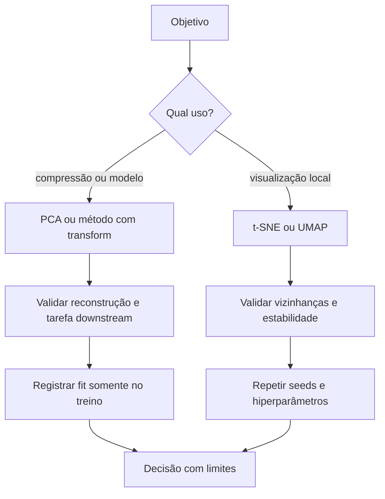
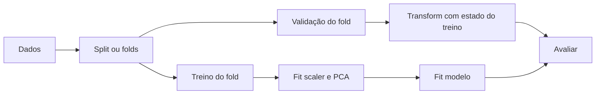

# Aula 22 — Redução de dimensionalidade em ML: PCA, t-SNE e UMAP com responsabilidade

<!-- mirandastech-aula-v2 -->

**Trilha:** Especialista em IA  
**Módulo:** 03 · Machine Learning clássico (M4)  
**Pré-requisito:** [Aula 21 — Clustering](./21-clustering-kmeans-hierarquico-dbscan.md)  
**Próxima aula:** [Aula 23 — Reprodutibilidade, provenance e zero data leakage](./23-reprodutibilidade-provenance-leakage.md)

[](https://colab.research.google.com/github/joaopaulomirandamatias/ai-lab/blob/main/03-machine-learning/notebooks/22-reducao-dimensionalidade-ml-laboratorio.ipynb)

> Uma projeção 2D é uma resposta visual a uma função objetivo, não uma fotografia da realidade. PCA preserva variância linear; t-SNE e UMAP priorizam vizinhanças de maneiras diferentes. Antes de enxergar “ilhas”, descubra o que o método preservou, distorceu e aprendeu dos dados.

## Problema motivador

Uma equipe recebe 500 medições de sensores por equipamento. Para reduzir custo, aplica PCA; para apresentar os dados, gera um mapa t-SNE colorido por falha. As cores formam ilhas convincentes. Surge a conclusão: “existem cinco tipos naturais de defeito”.

Há pelo menos quatro saltos lógicos:

1. variância alta pode ser ruído operacional e variância baixa pode carregar o sinal da falha;
2. PCA aprende média e direções: ajustá-lo antes do split contamina a avaliação;
3. t-SNE foi otimizado para vizinhanças, não para preservar tamanho ou distância global entre ilhas;
4. cor, seed e hiperparâmetros influenciam a narrativa visual.

Reduzir dimensionalidade pode comprimir, remover redundância, acelerar modelos, visualizar vizinhanças ou apoiar exploração. Esses objetivos não são equivalentes. Um método adequado para um deles pode ser inadequado para outro.

## Objetivos

Ao concluir a aula, você será capaz de:

- distinguir seleção de features e construção de componentes;
- derivar PCA pela maximização de variância, autovetores e SVD;
- interpretar scores, loadings, variância explicada e erro de reconstrução;
- explicar por que PCA centra, mas não padroniza automaticamente;
- manter PCA dentro do pipeline em avaliação supervisionada;
- formalizar as probabilidades e a divergência otimizadas pelo t-SNE;
- descrever o grafo fuzzy e a otimização do UMAP;
- usar trustworthiness para auditar vizinhanças sem confundi-la com validade substantiva;
- comparar mapas entre seeds e hiperparâmetros;
- comunicar com precisão o que um mapa 2D não permite concluir.

## Pré-requisitos e vocabulário

Retome autovetores, projeções e SVD no [módulo de Matemática](../../01-math/README.md), pipelines na [Aula 03](./03-preprocessamento-pipelines-leakage.md), cross-validation na [Aula 17](./17-cross-validation.md) e a diferença entre grupo geométrico e categoria real na [Aula 21](./21-clustering-kmeans-hierarquico-dbscan.md).

| Termo | Significado nesta aula |
|---|---|
| **componente** | nova coordenada construída como combinação das features |
| **score** | coordenada de uma observação no espaço dos componentes |
| **loading** | peso de uma feature original em um componente |
| **variância explicada** | fração da variância total capturada por componentes selecionados |
| **reconstrução** | aproximação dos dados originais a partir da representação reduzida |
| **embedding** | representação em um novo espaço, frequentemente de dimensão menor |
| **vizinhança** | conjunto de pontos próximos segundo uma métrica e um parâmetro |
| **perplexity** | escala efetiva de vizinhança usada pelo t-SNE |
| **trustworthiness** | penalização de vizinhos falsos introduzidos no mapa |
| **fuzzy graph** | grafo ponderado de pertenças graduais usado pelo UMAP |

## 1. A pergunta vem antes da projeção



- **Compressão:** quantas dimensões preservam erro aceitável?
- **Denoising:** a estrutura descartada é realmente ruído?
- **Entrada de modelo:** a tarefa downstream melhora fora da amostra?
- **Visualização:** quais vizinhanças são preservadas e quão estáveis são?
- **Exploração:** que hipótese será testada em dados ou análise independentes?

Um gráfico atraente não responde automaticamente a nenhuma dessas perguntas.

## 2. PCA: a melhor projeção linear para variância/reconstrução

Considere a matriz centralizada

\[
X_c=X-\mathbf{1}\mu^\top\in\mathbb{R}^{n\times p},
\]

em que \(\mu\in\mathbb{R}^p\) contém as médias do treino. A covariância amostral é

\[
S=\frac{1}{n-1}X_c^\top X_c.
\]

O primeiro componente procura uma direção unitária \(w_1\) que maximize a variância projetada:

\[
w_1=\arg\max_{\lVert w\rVert_2=1} w^\top S w.
\]

A solução é o autovetor associado ao maior autovalor \(\lambda_1\). Os componentes seguintes maximizam variância sob ortogonalidade aos anteriores. Com \(W_k=[w_1,\ldots,w_k]\), os scores são

\[
Z=X_cW_k,
\]

e a reconstrução é

\[
\widehat X=ZW_k^\top+\mu.
\]

O mesmo resultado pode ser obtido pela decomposição em valores singulares:

\[
X_c=U\Sigma V^\top.
\]

As linhas de \(V^\top\) são direções principais; os autovalores são \(\lambda_j=\sigma_j^2/(n-1)\). Para \(k\) fixo, PCA minimiza o erro quadrático de reconstrução entre todas as projeções lineares ortogonais de posto \(k\).

### 2.1 Variância explicada

A proporção do componente \(j\) é

\[
r_j=\frac{\lambda_j}{\sum_{\ell=1}^{p}\lambda_\ell}.
\]

Somar os primeiros \(k\) valores responde “quanta variação em \(X\) foi retida?”, não “quanta informação sobre \(y\) foi retida?”. Uma feature de baixa variância pode separar classes, enquanto um sensor ruidoso domina \(r_1\). O laboratório constrói exatamente essa contraprova.

### 2.2 Escala, sinal e interpretação

`PCA` do scikit-learn centra as colunas, mas não as padroniza. Medidas em volts, segundos e centavos podem ter variâncias incomparáveis. `StandardScaler` antes do PCA equivale a analisar a matriz de correlação, mas também impõe pesos iguais em unidades de desvio-padrão; justifique essa escolha.

O sinal de um componente é indeterminado: \(w\) e \(-w\) representam o mesmo eixo. Portanto, implementações podem inverter loadings sem divergir. Componentes são combinações, não necessariamente conceitos reais. Loadings densos e colinearidade podem dificultar nomes como “maturidade” ou “risco”.

### 2.3 Exemplo resolvido

Para dados centralizados \((2,0),(-2,0),(0,1),(0,-1)\), usando divisor \(n\), a covariância é diagonal com variâncias 2 e 0,5. O primeiro eixo explica

\[
\frac{2}{2+0{,}5}=0{,}8.
\]

Projetar em uma dimensão retém 80% da variância e zera a segunda coordenada na reconstrução. Isso é ótimo para erro linear de posto 1; se o target dependesse somente do eixo de menor variância, seria péssimo para classificação.

### 2.4 Whitening não é apenas redução

Com `whiten=True`, os scores são reescalados para variância unitária. Isso remove a escala relativa dos componentes e pode ajudar métodos que assumem isotropia, mas descarta informação de magnitude. Compare como hiperparâmetro dentro do protocolo; não o aplique por hábito.

## 3. PCA em pipeline: onde ocorre leakage

PCA aprende \(\mu\), componentes e variâncias. Se for ajustado em treino + validação/teste, a geometria futura influencia a representação. O fluxo correto é:



```python
from sklearn.pipeline import make_pipeline
from sklearn.preprocessing import StandardScaler
from sklearn.decomposition import PCA
from sklearn.linear_model import LogisticRegression

model = make_pipeline(
    StandardScaler(),
    PCA(n_components=0.95),
    LogisticRegression(max_iter=2000),
)
```

Durante cross-validation, cada fold ajusta seu próprio scaler e PCA. Depois de escolher a configuração, refaça em todo o treino e transforme o teste reservado uma única vez. O fato de PCA não usar \(y\) não autoriza olhar a distribuição do teste.

## 4. t-SNE: vizinhanças probabilísticas para visualização

t-SNE constrói probabilidades de vizinhança no espaço original. Para ponto \(i\),

\[
p_{j\mid i}=\frac{\exp(-\lVert x_i-x_j\rVert^2/2\sigma_i^2)}
{\sum_{k\ne i}\exp(-\lVert x_i-x_k\rVert^2/2\sigma_i^2)},
\]

com \(p_{i\mid i}=0\). Cada \(\sigma_i\) é ajustado para uma perplexity definida a partir da entropia da distribuição condicional. A simetrização produz \(p_{ij}\).

No mapa, a similaridade usa uma distribuição t de Student com um grau de liberdade:

\[
q_{ij}=\frac{(1+\lVert y_i-y_j\rVert^2)^{-1}}
{\sum_{k\ne \ell}(1+\lVert y_k-y_\ell\rVert^2)^{-1}}.
\]

O algoritmo minimiza

\[
KL(P\Vert Q)=\sum_{i\ne j}p_{ij}\log\frac{p_{ij}}{q_{ij}}.
\]

Como a divergência é assimétrica, separar vizinhos reais recebe grande penalização; aproximar alguns não vizinhos custa menos. A cauda pesada ajuda a reduzir o *crowding problem*. O resultado privilegia estrutura local.

### O que perplexity, seed e otimização mudam

- perplexity pequena enfatiza vizinhanças muito locais e pode fragmentar;
- perplexity maior mistura escalas mais amplas, sem transformar o mapa em métrica global;
- inicialização, learning rate e número de iterações alteram mínimos locais;
- o tamanho, densidade e distância entre ilhas não devem ser lidos literalmente;
- a implementação `TSNE` do scikit-learn é principalmente transdutiva e não oferece `transform` para novos pontos.

Colorir o mapa por \(y\) é útil para inspeção, mas não valida um classificador. Treinar e testar no mesmo embedding transdutivo também não estima generalização para novos dados.

## 5. UMAP: grafo fuzzy e embedding

UMAP começa com um grafo de \(k\) vizinhos no espaço original. Para cada ponto, uma distância local \(\rho_i\) e uma escala \(\sigma_i\) adaptam a vizinhança. Uma forma simplificada da pertença dirigida é

\[
p_{j\mid i}=\exp\left(-\frac{\max(0,d(x_i,x_j)-\rho_i)}{\sigma_i}\right).
\]

As duas direções são combinadas por união fuzzy:

\[
p_{ij}=p_{j\mid i}+p_{i\mid j}-p_{j\mid i}p_{i\mid j}.
\]

Depois, uma representação de baixa dimensão é otimizada para aproximar esse grafo com uma função de similaridade e cross-entropy, usando amostragem negativa na implementação prática. `n_neighbors` controla o compromisso entre escalas locais e mais amplas; `min_dist` controla quão compactos os pontos podem ficar no embedding.

UMAP possui formulação para `transform` de novas observações na biblioteca `umap-learn`, ao contrário do t-SNE básico do scikit-learn. Isso não torna um mapa automaticamente apropriado como feature: o transform e o modelo downstream precisam ser ajustados e validados dentro dos folds.

O notebook implementa o estágio de grafo fuzzy para tornar \(\rho_i\), \(\sigma_i\) e os pesos auditáveis. A otimização completa do layout é uma extensão opcional com `umap-learn`; não há dependência oculta no laboratório principal.

## 6. PCA, t-SNE e UMAP não são intercambiáveis

| Critério | PCA | t-SNE | UMAP |
|---|---|---|---|
| natureza | linear | não linear | não linear baseada em grafo |
| objetivo central | variância/reconstrução | probabilidades de vizinhança | estrutura fuzzy de vizinhos |
| uso típico | compressão e pipeline | visualização exploratória | visualização e representação |
| estrutura global | limitada à projeção linear | não confiável no mapa | pode capturar mais estrutura, sem garantia literal |
| novas amostras | `transform` direto | não no `TSNE` básico | `transform` disponível em `umap-learn` |
| estocasticidade | solver pode ser aleatório | alta | alta |
| hiperparâmetros-chave | `n_components`, scaling, whitening | perplexity, learning rate, seed | `n_neighbors`, `min_dist`, metric, seed |
| erro clássico | variância ≠ sinal | interpretar ilhas globalmente | tratar layout como topologia verdadeira |

## 7. Avaliando a representação

Para compressão, reporte curva de variância e erro de reconstrução. Para uso supervisionado, compare a métrica downstream em folds idênticos e custo/latência. Para mapas, uma opção é trustworthiness:

\[
T(k)=1-\frac{2}{nk(2n-3k-1)}
\sum_{i=1}^{n}\sum_{j\in U_k^{(i)}}(r(i,j)-k),
\]

em que \(U_k^{(i)}\) contém pontos que entraram indevidamente entre os \(k\) vizinhos de \(i\) no mapa e \(r(i,j)\) é a posição de \(j\) no espaço original. O valor fica entre 0 e 1; alto significa poucos vizinhos falsos para aquele \(k\), não que distâncias globais, clusters ou causalidade estejam corretos.

Audite também:

- várias seeds e valores plausíveis de perplexity/`n_neighbors`;
- concordância de vizinhos, não coordenadas brutas sujeitas a rotação;
- metadados não usados no fit, adicionados depois para inspeção;
- densidade e tamanho no espaço original;
- casos que mudam muito de vizinhança;
- uso downstream avaliado fora da amostra.

## 8. Laboratório reproduzível

O [notebook da Aula 22](../notebooks/22-reducao-dimensionalidade-ml-laboratorio.ipynb) utiliza somente dados sintéticos e o dataset `digits` empacotado no scikit-learn. Ele:

1. implementa PCA por SVD e confere variância e reconstrução;
2. compara a implementação manual com `PCA` até indeterminação de sinal;
3. mostra como escala altera os loadings;
4. demonstra que alta variância explicada pode preservar ruído e perder o target;
5. prova por estado interno que PCA ajustado no conjunto completo viu o teste;
6. gera t-SNE com duas perplexities e duas seeds;
7. mede trustworthiness e correlação de distâncias;
8. implementa o grafo fuzzy inicial do UMAP para dois `n_neighbors`;
9. executa verificações numéricas e metodológicas.

Dependências mínimas: Python 3.11, NumPy 2.0, SciPy 1.13, Matplotlib 3.8 e scikit-learn 1.5. O laboratório principal não exige `umap-learn`, rede, dados externos ou credenciais; outputs permanecem limpos no arquivo versionado.

## 9. Armadilhas e limites

- Ajustar scaler ou PCA antes de separar folds.
- Dizer que PCA “selecionou features”; ele construiu combinações.
- Interpretar sinal de loading como identificador estável.
- Escolher componentes apenas por 95% de variância sem avaliar a tarefa.
- Aplicar PCA a categorias codificadas arbitrariamente como inteiros.
- Usar t-SNE/UMAP para provar número ou existência de clusters.
- Comparar coordenadas entre seeds sem alinhar rotação/reflexão.
- Ler distância entre ilhas, área ou densidade como grandeza original.
- Ajustar hiperparâmetros até surgir a figura desejada e mostrar só ela.
- Colorir por target durante exploração e depois formular a hipótese como se fosse anterior.
- Usar embedding transdutivo feito com teste como entrada de avaliação supervisionada.
- Omitir métrica, seed, amostra e versões ao publicar a figura.

## 10. Checklist prático

- [ ] Declarei objetivo: compressão, visualização, denoising ou modelagem.
- [ ] Defini unidade de análise e população antes do embedding.
- [ ] Justifiquei escala e métrica.
- [ ] Ajustei transformadores somente no treino/fold.
- [ ] Comparei baseline sem redução.
- [ ] Reportei dimensões, variância e reconstrução do PCA.
- [ ] Avaliei a tarefa downstream fora da amostra.
- [ ] Variei seeds e hiperparâmetros dos mapas.
- [ ] Medi preservação de vizinhos e examinei falhas.
- [ ] Adicionei cores/rótulos externos depois do fit exploratório.
- [ ] Não tratei ilha visual como cluster ou causa.
- [ ] Registrei código, dados, versões e parâmetros.

## 11. Exercícios com respostas comentadas

### 1. Shapes

Se \(X_c\) tem shape \((1000,50)\) e \(W_k\) tem shape \((50,8)\), quais são os shapes de \(Z\) e \(\widehat X\)?

**Resposta:** \(Z=X_cW_k\) tem \((1000,8)\). Já \(ZW_k^\top\) volta a \((1000,50)\), antes de recolocar a média.

### 2. Variância

Autovalores são \([9,4,1,1]\). Quanta variância os dois primeiros componentes explicam?

**Resposta:** \((9+4)/(9+4+1+1)=13/15\approx86{,}67\%\).

### 3. Sinal do componente

Duas bibliotecas retornam loadings opostos e scores também opostos. Há inconsistência?

**Resposta:** não. Multiplicar ambos por \(-1\) preserva projeção e reconstrução; o eixo não tem orientação intrínseca.

### 4. Target em baixa variância

PCA retém 99% da variância, mas a classificação piora. Como isso é possível?

**Resposta:** PCA ignora \(y\). A variância retida pode ser ruído, enquanto a direção discriminativa tem pouca variância marginal.

### 5. Leakage

Por que ajustar PCA em todo \(X\) antes da cross-validation é incorreto, mesmo sem passar \(y\)?

**Resposta:** médias, variâncias e direções dos folds de validação influenciam a representação aprendida. O score deixa de simular dados realmente não vistos.

### 6. Perplexity

Dois mapas t-SNE com perplexities 5 e 50 exibem números diferentes de ilhas. Qual é o número verdadeiro de clusters?

**Resposta:** não pode ser deduzido desses mapas. Perplexity muda a escala local otimizada; valide clusters no espaço e protocolo apropriados.

### 7. Trustworthiness

Um mapa tem trustworthiness 0,98 para \(k=10\). O que está sustentado?

**Resposta:** poucas vizinhanças falsas foram introduzidas na escala de dez vizinhos. Não estão sustentadas distâncias globais, densidades, causalidade nem significado das ilhas.

### 8. Novas observações

Por que `transform` importa em um sistema online?

**Resposta:** o sistema precisa mapear pontos futuros sem refazer a representação com eles. O transform deve usar apenas estado de treino e ter estabilidade monitorada.

### 9. UMAP

O que tende a mudar ao elevar `n_neighbors`?

**Resposta:** o grafo considera uma vizinhança mais ampla, normalmente reduzindo ênfase ultralocal. O efeito final depende dos dados, métrica, `min_dist`, seed e otimização.

## Resumo

- PCA encontra projeções lineares que maximizam variância e minimizam reconstrução para posto fixo.
- Variância explicada descreve \(X\), não relevância para o target.
- PCA centra, mas não padroniza; escala é uma decisão metodológica.
- Todo transformador aprendido deve ficar dentro do split/pipeline.
- t-SNE minimiza uma divergência entre probabilidades de vizinhança e privilegia estrutura local.
- UMAP constrói um grafo fuzzy local antes de otimizar o layout.
- Trustworthiness audita vizinhos falsos em uma escala; não valida clusters ou significado.
- Mapas precisam de seeds, hiperparâmetros, métricas, contraprovas e limites explícitos.

## Referências técnicas

Fontes verificadas em **8 de setembro de 2026**:

1. scikit-learn 1.9. [Decomposing signals in components](https://scikit-learn.org/stable/modules/decomposition.html) — PCA, SVD, scaling e transformações.
2. scikit-learn 1.9. [Manifold learning](https://scikit-learn.org/stable/modules/manifold.html) — hipóteses e limitações de métodos não lineares.
3. van der Maaten, L.; Hinton, G. (2008). [Visualizing Data using t-SNE](https://jmlr.org/papers/v9/vandermaaten08a.html). JMLR — artigo original.
4. McInnes, L.; Healy, J.; Melville, J. (2018). [UMAP: Uniform Manifold Approximation and Projection for Dimension Reduction](https://arxiv.org/abs/1802.03426) — descrição algorítmica.
5. McInnes, L.; Healy, J.; Saul, N.; Großberger, L. (2018). [UMAP: Uniform Manifold Approximation and Projection](https://joss.theoj.org/papers/10.21105/joss.00861). JOSS — software e referência técnica.
6. Jolliffe, I. T.; Cadima, J. (2016). [Principal component analysis: a review and recent developments](https://royalsocietypublishing.org/rsta/article/374/2065/20150202/115142/Principal-component-analysis-a-review-and-recent). Philosophical Transactions A — revisão aberta.

## Próxima aula

Na [Aula 23](./23-reprodutibilidade-provenance-leakage.md), transformaremos decisões como seed, versão, split, média, componentes e hiperparâmetros em artefatos rastreáveis. Um mapa só se torna evidência auditável quando outra pessoa consegue reconstruir como ele foi produzido.
