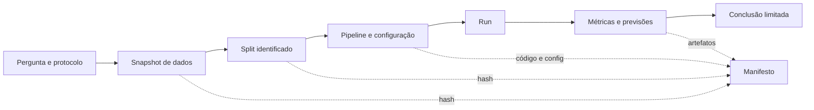
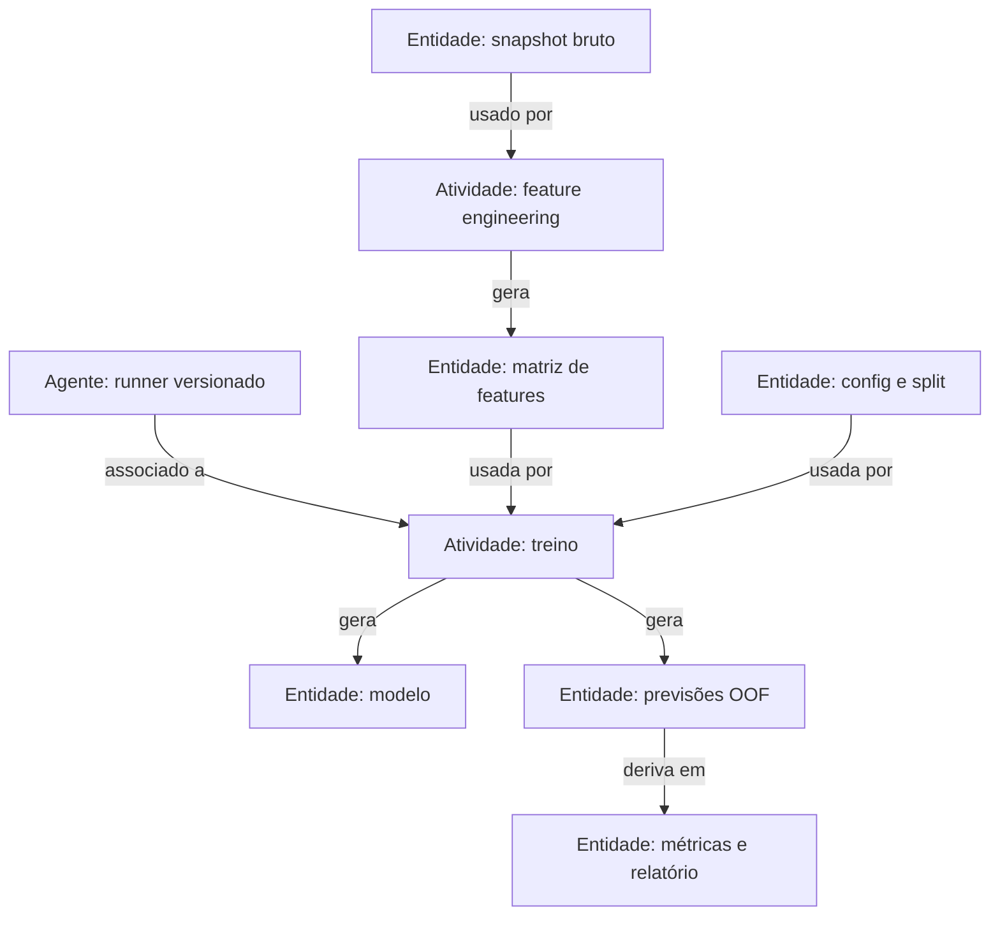

# Aula 23 — Reprodutibilidade, provenance, pipelines e zero data leakage

<!-- mirandastech-aula-v2 -->

**Trilha:** Especialista em IA  
**Módulo:** 03 · Machine Learning clássico (M4)  
**Pré-requisito:** [Aula 22 — Redução de dimensionalidade](./22-reducao-dimensionalidade-ml.md)  
**Próxima aula:** [Aula 24 — Gate II](./24-gate-ii-experimento-ml-classico.md)

[](https://colab.research.google.com/github/joaopaulomirandamatias/ai-lab/blob/main/03-machine-learning/notebooks/23-reprodutibilidade-provenance-leakage-laboratorio.ipynb)

> Reexecutar um erro produz o mesmo erro. Reprodutibilidade fortalece a evidência apenas quando acompanha um protocolo válido, artefatos identificáveis e uma trilha que explica de onde cada resultado veio.

## Problema motivador

Uma equipe apresenta ROC-AUC 0,94 para prever quais equipamentos falharão nas próximas 24 horas. O notebook está salvo, a seed é 42 e o modelo pode ser carregado. Ainda assim, ninguém consegue responder com segurança:

- qual snapshot de dados gerou o resultado;
- se registros do mesmo equipamento atravessaram treino e validação;
- quais colunas existiam no instante da previsão;
- se o scaler foi ajustado dentro de cada fold;
- quantas decisões foram tomadas depois de olhar o teste;
- qual commit, configuração e ambiente produziram o modelo.

O número é repetível no computador original, mas não é auditável. Pior: uma coluna chamada `tempo_ate_reparo` foi calculada depois da falha. O experimento reproduz perfeitamente um vazamento.

Nesta aula, vamos transformar “rodei o notebook” em uma cadeia de evidência: pergunta congelada, dados identificados por conteúdo, configuração canônica, splits rastreáveis, pipeline, resultados ligados ao código e testes negativos contra leakage.

## Objetivos

Ao concluir, você será capaz de:

- distinguir repetibilidade, reprodutibilidade e replicação sob uma taxonomia declarada;
- modelar provenance com `Entity`, `Activity` e `Agent`;
- diferenciar provenance, lineage, versionamento e rastreamento de experimentos;
- construir um manifesto canônico com hashes de dados, configuração, splits e previsões;
- explicar o que uma seed controla e o que ela não controla;
- reconhecer vazamento por alvo, tempo, entidade, preprocessing, seleção e uso reiterado do teste;
- mostrar por que `Pipeline` é necessário, mas insuficiente para “zero leakage”;
- criar testes automáticos que falham quando o protocolo é violado;
- entregar evidência reconstruível para pesquisa e sistemas reais.

## Pré-requisitos e vocabulário

Retome o instante de previsão e o split na [Aula 02](./02-framing-dataset-split-baseline.md), pipelines na [Aula 03](./03-preprocessamento-pipelines-leakage.md), cross-validation na [Aula 17](./17-cross-validation.md) e tuning sem consultar o teste na [Aula 18](./18-hyperparameter-tuning.md).

| Termo | Definição operacional nesta aula |
|---|---|
| **run** | uma execução identificada de um protocolo |
| **artefato** | dado, configuração, modelo, métrica ou relatório persistido |
| **snapshot** | estado imutável ou identificável de um conjunto de dados |
| **provenance** | informação sobre entidades, atividades e agentes envolvidos na produção de algo |
| **lineage** | caminho de derivações e transformações entre artefatos |
| **manifesto** | registro estruturado que liga entradas, código, configuração, ambiente e saídas |
| **hash** | resumo determinístico de bytes usado para detectar mudanças |
| **leakage** | informação indisponível no uso real ou pertencente à avaliação influencia aprendizagem/seleção |
| **threat to validity** | condição que limita a interpretação ou generalização do resultado |

Os termos *reproducibility* e *replicability* variam entre comunidades. Aqui adotamos e declaramos: **repetibilidade** para mesma equipe/artefatos/ambiente; **reprodutibilidade** para outra equipe reconstruir o resultado com os artefatos e método fornecidos; **replicação** para testar a conclusão com nova implementação, amostra ou coleta. O rótulo importa menos que explicitar o teste realizado.

## 1. Três níveis de reconstrução

| Nível | O que muda | Pergunta respondida | Não garante |
|---|---|---|---|
| repetibilidade | quase nada | a mesma execução retorna resultado compatível? | protocolo correto |
| reprodutibilidade | pessoa/ambiente | os artefatos permitem reconstruir a evidência? | validade externa |
| replicação | implementação ou dados | a conclusão resiste a uma prova independente? | causalidade automática |

Resultados estocásticos raramente precisam coincidir bit a bit em todo hardware. Defina uma tolerância ou distribuição esperada. Um teste pode exigir o mesmo hash de split e previsões idênticas no ambiente travado; outro pode exigir ROC-AUC dentro de uma faixa em várias seeds.



## 2. Provenance e lineage

O W3C PROV organiza provenance em três classes iniciais:

- `prov:Entity`: algo físico, digital ou conceitual com aspectos fixos, como snapshot, configuração ou modelo;
- `prov:Activity`: processo que usa ou gera entidades, como preparar dados ou treinar;
- `prov:Agent`: responsável por uma atividade ou entidade, como pessoa, organização ou software.

Relações como `prov:used`, `prov:wasGeneratedBy`, `prov:wasDerivedFrom` e `prov:wasAssociatedWith` formam cadeias interoperáveis. Lineage é a visão de percurso: por quais fontes e transformações uma feature, previsão ou figura passou.



Um registry de modelos sem origem dos dados não fecha a cadeia. Um dataset versionado sem código e configuração também não. Provenance precisa responder pelo menos: **o quê, de onde, por qual atividade, sob qual configuração, por quem ou qual software e quando**.

## 3. Identidade por conteúdo: hashes e canonicalização

Para bytes (b), um hash criptográfico produz um identificador:

\[
h=\operatorname{SHA256}(b).
\]

Uma alteração mínima tende a mudar (h). Isso ajuda a detectar que dois snapshots não são idênticos. Entretanto:

- hash não prova que o dado é verdadeiro;
- hash sem armazenamento imutável não recupera o conteúdo;
- serializações equivalentes podem produzir bytes diferentes;
- hash não substitui assinatura, autorização ou controle de acesso;
- dados pessoais não devem ser publicados só porque receberam hash.

Para configuração, use serialização canônica: chaves ordenadas, encoding explícito, valores normalizados e ausência de campos voláteis. Um identificador didático de experimento pode ser:

\[
e=\operatorname{SHA256}(h_D\Vert h_S\Vert h_C\Vert v_K),
\]

em que (h_D) identifica os dados, (h_S) os splits, (h_C) a configuração e (v_K) o código versionado. O símbolo (Vert) representa concatenação com formato não ambíguo.

Não use somente `modelo_final_v7.pkl`. O nome não revela se `v7` mudou porque o dado, código, seed, split ou hiperparâmetro mudou.

## 4. Manifesto mínimo de um experimento

| Campo | Exemplo | Função |
|---|---|---|
| `experiment_id` | SHA-256 composto | liga a execução ao protocolo |
| `question` e `prediction_time` | falha em 24 h; (t_0) | impede redefinição oportunista |
| `dataset_sha256` | hash do snapshot canônico | detecta troca de dados |
| `schema` | nomes, tipos e unidades | torna entrada interpretável |
| `splitter` e `split_sha256` | `GroupKFold(5)` | reconstrói quem avaliou quem |
| `features_at_t0` | lista ordenada | audita disponibilidade temporal |
| `target_definition` | regra e janela | evita alvo móvel |
| `code_ref` | commit Git | identifica implementação |
| `config_sha256` | hash de JSON canônico | identifica parâmetros |
| `environment` | Python, bibliotecas, SO | contextualiza diferenças |
| `seeds` | geração, split, estimador | localiza aleatoriedade |
| `metrics_by_fold` | vetor, não só média | expõe variabilidade |
| `prediction_sha256` | hash de OOF/teste | confere saída |
| `limitations` | grupos, período, viés | limita a alegação |

Datas e duração são importantes para auditoria, mas não devem entrar no ID se impedirem que uma reexecução idêntica produza o mesmo identificador lógico. Separe identidade do protocolo e metadados operacionais do run.

## 5. Seed é controle parcial, não selo mágico

Uma seed inicializa geradores pseudoaleatórios. Ainda podem variar:

- ordem dos dados e iteração sobre estruturas;
- múltiplos geradores não inicializados;
- paralelismo, redução numérica e número de threads;
- bibliotecas BLAS, compilador, CPU, GPU e drivers;
- algoritmos com operações não determinísticas;
- dados externos mutáveis e dependências sem versão travada.

Registre as seeds e passe `random_state` explicitamente. Para evidência científica, execute várias seeds quando a variabilidade faz parte do método. Para reconstrução operacional, registre também versões, imagem/lockfile, hardware relevante e flags de determinismo.

Se a repetição exata não for portável, estabeleça invariantes: mesmos grupos fora do treino, ausência de sobreposição, shapes, limites de métricas e tolerâncias numéricas. **Determinismo é propriedade testada, não presumida.**

## 6. Taxonomia prática de leakage

Leakage ocorre quando treinamento, transformação, seleção ou decisão recebe informação que não estaria legitimamente disponível no instante e contexto de uso.

| Tipo | Exemplo | Defesa |
|---|---|---|
| target/proxy | `tempo_ate_reparo` para prever falha | contrato de disponibilidade em (t_0) |
| temporal | média calculada com eventos futuros | corte por tempo e janelas causais |
| entidade/grupo | visitas do mesmo paciente em treino e validação | split por entidade |
| duplicata | cópias quase idênticas atravessam conjuntos | deduplicar antes do split e agrupar |
| preprocessing | imputação/seleção ajustada em todo (X) | `Pipeline` dentro dos folds |
| tuning | escolher hiperparâmetro pelo teste | validação/nested CV; teste uma vez |
| test feedback | reescrever features após olhar erros do teste | novo teste ou avaliação externa |
| upstream | rótulos ou embeddings treinados com período futuro | provenance das fontes e artefatos |

### Pipeline é necessário, mas não suficiente

`Pipeline` garante a ordem `fit`/`transform` entre folds para etapas compatíveis com sua API. Ele não sabe:

- que uma coluna só nasce depois do desfecho;
- que duas linhas pertencem à mesma pessoa;
- que o timestamp exige embargo;
- que o teste foi consultado em uma reunião anterior;
- que um artefato externo foi treinado em dados proibidos.

Logo, “zero leakage” não é uma função booleana de biblioteca. É uma alegação sustentada por contrato de dados, split coerente, pipeline, provenance e testes.

## 7. Exemplo resolvido: o identificador que vaza

Suponha 100 clientes, cada um com quatro atendimentos, e um desfecho quase constante por cliente. Um modelo recebe `cliente_id` codificado.

1. Um split aleatório por linha coloca aproximadamente três atendimentos no treino e um na validação.
2. O modelo aprende a associação entre ID e desfecho.
3. A validação parece excelente porque reconhece clientes, não porque generaliza.
4. Em produção chegam clientes novos; os IDs são desconhecidos.

O protocolo correto depende da pergunta. Se o objetivo é prever **novos clientes**, todos os registros de cada cliente devem ficar no mesmo lado usando `GroupKFold`, `GroupShuffleSplit` ou equivalente. Se o objetivo legítimo é prever novos eventos de clientes conhecidos, é necessário um corte temporal por cliente que respeite (t_0). “Embaralhar mais” não resolve dependência.

## 8. Testes automáticos do método

Além de testar código, teste o desenho experimental:

```python
assert set(groups_train).isdisjoint(groups_test)
assert (feature_timestamp <= prediction_timestamp).all()
assert set(features) <= set(available_at_prediction)
assert dataset_sha256 == expected_dataset_sha256
assert split_sha256 == expected_split_sha256
assert test_access_count == 1
```

Alguns controles precisam existir fora do notebook: permissões que ocultam o teste, armazenamento append-only, revisão do contrato de features e registro de acessos. Um `assert` escrito pela mesma pessoa que escolhe ignorá-lo não é segregação de função.

## 9. Laboratório reproduzível

O [notebook da Aula 23](../notebooks/23-reprodutibilidade-provenance-leakage-laboratorio.ipynb) usa dados sintéticos de atendimentos repetidos. Ele:

1. cria e serializa um snapshot canônico;
2. calcula hashes de dados, configuração e folds;
3. gera previsões *out-of-fold* com preprocessing dentro do pipeline;
4. monta e valida um manifesto JSON;
5. repete a execução e confere IDs, métricas e previsões;
6. altera uma única célula e demonstra mudança do dataset e do experimento;
7. compara split ingênuo por linha com split honesto por entidade;
8. introduz uma feature pós-desfecho para provar que pipeline não bloqueia leakage semântico;
9. cria uma trilha PROV simplificada entre entidades e atividades.

Dependências mínimas: Python 3.11, NumPy 1.26, pandas 2.1 e scikit-learn 1.4. O dataset é gerado localmente com seed fixa; não há rede, credenciais nem dados pessoais. O notebook versionado permanece sem outputs após a execução de validação.

## 10. Checklist de entrega

### Antes de treinar

- [ ] Pergunta, população, unidade de análise e (t_0) estão escritos.
- [ ] Target, horizonte, métricas e baseline foram congelados.
- [ ] Cada feature tem origem e disponibilidade temporal.
- [ ] Entidades, duplicatas, tempo e dependências orientaram o splitter.
- [ ] O teste está reservado e seu acesso é controlado.

### Durante o experimento

- [ ] Transformações aprendidas vivem no pipeline/fold.
- [ ] Espaço de tuning e regra de seleção foram registrados.
- [ ] Seeds e fontes de não determinismo estão documentadas.
- [ ] Dados, config, splits, código e previsões têm identificadores.
- [ ] Métricas por fold e erros são preservados, não só o melhor score.

### Depois

- [ ] O modelo aponta para o manifesto que o gerou.
- [ ] A conclusão distingue observação, interpretação e limite.
- [ ] Testes negativos procuram leakage deliberadamente.
- [ ] Outra pessoa consegue reconstruir o run com um comando ou roteiro.
- [ ] Informações sensíveis permanecem em armazenamento autorizado.

## 11. Armadilhas e limites

- Confundir seed fixa com experimento reproduzível.
- Hash de arquivo comprimido variar por metadados, embora o conteúdo lógico seja igual.
- Registrar `pip freeze` sem SO, runtime ou fonte dos dados.
- Versionar dados sensíveis diretamente no Git.
- Sobrescrever artefatos com nomes como `final` ou `latest`.
- Guardar somente média do CV e perder os folds.
- Incluir timestamp no ID lógico e tornar toda repetição “diferente”.
- Acreditar que container elimina não determinismo de hardware.
- Usar hash como prova de autenticidade ou qualidade.
- Reproduzir uma métrica contaminada e chamá-la de evidência.
- Declarar “zero leakage” sem delimitar as ameaças avaliadas.

## 12. Exercícios com respostas comentadas

### 1. Seed

Duas execuções usam seed 42, mas GPUs e versões de biblioteca diferentes. Elas precisam ser bit a bit idênticas?

**Resposta:** não necessariamente. Registre o ambiente e defina tolerâncias/invariantes. Se igualdade exata for requisito, use operações determinísticas suportadas e teste no ambiente alvo.

### 2. Hash

O hash do CSV mudou após reordenar linhas, sem alterar os registros. Houve corrupção?

**Resposta:** não se conclui isso. O hash identifica bytes e a ordem faz parte da serialização. Defina se ordem é semântica e canonicalize antes de comparar.

### 3. Provenance

Classifique como `Entity`, `Activity` ou `Agent`: dataset, treinamento e runner.

**Resposta:** dataset é `Entity`; treinamento é `Activity`; runner pode ser `SoftwareAgent`. O modelo gerado volta a ser `Entity`.

### 4. Lineage

Por que saber apenas a URL da fonte não basta?

**Resposta:** faltam versão/snapshot, regras de extração, filtros, joins, transformações e atividades que produziram as features usadas.

### 5. Grupos

Quatro imagens do mesmo paciente aparecem em momentos próximos. Qual cuidado mínimo?

**Resposta:** se o objetivo envolve pacientes novos, agrupe todas as imagens do paciente no mesmo fold. Se envolve futuro do mesmo paciente, use corte temporal coerente e impeça informação posterior a (t_0).

### 6. Pipeline

Uma coluna `alta_hospitalar_em_dias` entra em um pipeline perfeito para prever internação prolongada. O protocolo está protegido?

**Resposta:** não. A coluna é conhecida depois do desfecho. Pipeline não entende disponibilidade temporal; o contrato de features deve excluí-la.

### 7. Teste reutilizado

Após dez rodadas guiadas pelos erros do teste, a equipe mantém o mesmo conjunto e reporta a última métrica. Ele ainda é teste?

**Resposta:** não para uma estimativa imparcial; tornou-se parte do processo de seleção. Reserve um novo teste ou obtenha avaliação externa.

### 8. Manifesto

Quais quatro identificadores mínimos compõem o ID didático desta aula?

**Resposta:** hashes de dados, split e configuração, mais referência versionada do código. Ambiente e resultados também devem constar no manifesto, ainda que não definam o protocolo lógico.

### 9. Contraprova

Um run é perfeitamente repetível e tem ROC-AUC 0,99. O que testar antes de comemorar?

**Resposta:** disponibilidade em (t_0), sobreposição de entidades/duplicatas, ajuste fora dos folds, tuning ou feedback pelo teste e provenance de artefatos upstream. Repetibilidade não detecta invalidade.

## Resumo

- Repetir, reproduzir e replicar são testes diferentes; declare a taxonomia.
- Provenance conecta entidades, atividades e agentes; lineage segue suas derivações.
- Hash detecta mudança de bytes, mas não prova verdade, autenticidade ou qualidade.
- Um manifesto liga dados, split, configuração, código, ambiente, previsões e métricas.
- Seed controla apenas fontes explícitas de pseudoaleatoriedade.
- Leakage pode vir do alvo, futuro, grupos, duplicatas, preprocessing, tuning ou feedback do teste.
- Pipeline impede classes importantes de contaminação, mas não entende semântica ou tempo.
- “Zero leakage” é uma alegação auditável apoiada por controles e testes negativos.
- Um experimento reexecutável e inválido continua inválido.

## Referências técnicas

Fontes verificadas em **8 de setembro de 2026**:

1. W3C. [PROV-O: The PROV Ontology](https://www.w3.org/TR/prov-o/) — Recomendação de 30 de abril de 2013; classes e relações interoperáveis de provenance.
2. W3C. [PROV-DM: The PROV Data Model](https://www.w3.org/TR/prov-dm/) — modelo conceitual normativo da família PROV.
3. scikit-learn 1.9. [Common pitfalls and recommended practices](https://scikit-learn.org/stable/common_pitfalls.html) — pipelines, leakage e controle de aleatoriedade.
4. Pineau et al. (2021). [Improving Reproducibility in Machine Learning Research](https://jmlr.org/papers/v22/20-303.html). JMLR — relatório do programa de reprodutibilidade NeurIPS 2019.
5. Sculley et al. (2015). [Hidden Technical Debt in Machine Learning Systems](https://proceedings.neurips.cc/paper/2015/hash/86df7dcfd896fcaf2674f757a2463eba-Abstract.html) — dependências e dívida sistêmica em ML.
6. NeurIPS. [Paper Checklist Guidelines](https://neurips.cc/public/guides/PaperChecklist) — transparência de código, dados, experimentos e limitações.

## Transição para o Gate II

Na [Aula 24](./24-gate-ii-experimento-ml-classico.md), o manifesto deixa de ser exercício isolado e passa a acompanhar a entrega completa: baseline, modelos candidatos, cross-validation, critério de seleção congelado, teste reservado, análise de erros e conclusão limitada. O Gate II não premia a maior métrica; premia evidência preditiva que resiste a auditoria.
