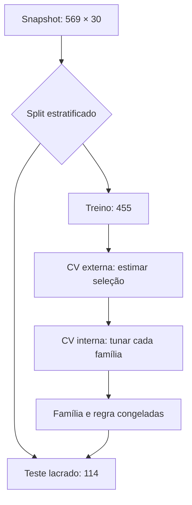
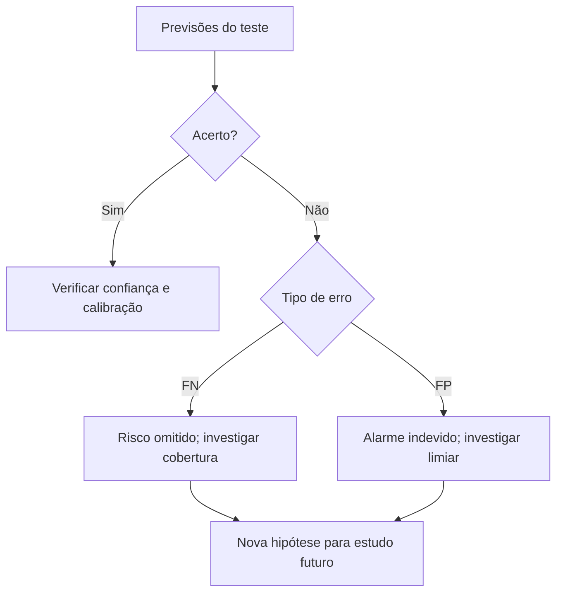

<!-- mirandastech-aula-v2 -->

# Aula 24 — Gate II: experimento completo de Machine Learning clássico

- **Trilha:** Especialista em IA
- **Módulo:** 03 · Machine Learning clássico (M4)
- **Pré-requisito:** [Aula 23 — Reprodutibilidade, provenance e zero data leakage](./23-reprodutibilidade-provenance-leakage.md)
- **Objetivo central:** integrar framing, baseline, pipeline, validação, tuning, decisão, teste externo, análise de erros e proveniência em uma única evidência auditável.
- **Tempo sugerido:** 60 min de leitura, 120 min de laboratório e 45 min de relatório.

[](https://colab.research.google.com/github/joaopaulomirandamatias/ai-lab/blob/main/03-machine-learning/notebooks/24-gate-ii-experimento-ml-classico-laboratorio.ipynb)

> **Gate II não premia a maior métrica.** Ele verifica se a métrica pode ser acreditada.

## O problema: quando um bom número é uma evidência ruim

Imagine dois relatórios. O primeiro anuncia ROC-AUC de 0,99, mas normalizou todos os dados antes do split, experimentou dezenas de configurações olhando o teste e omitiu a seed. O segundo obtém 0,90, mas definiu a pergunta antecipadamente, comparou um baseline, isolou o teste, ajustou todo preprocessing dentro dos folds e publicou limitações e hashes.

O segundo relatório contém mais conhecimento. No primeiro, não sabemos quanto do resultado vem do modelo e quanto vem do protocolo contaminado.

Esta aula fecha o módulo com um experimento completo. Usaremos o **Breast Cancer Wisconsin (Diagnostic)**, distribuído pelo scikit-learn, como benchmark tabular binário. O dataset tem 569 instâncias e 30 features reais derivadas de imagens digitalizadas de aspirados por agulha fina. O rótulo original distingue amostras benignas e malignas.

> **Limite ético e técnico:** o experimento é exclusivamente didático. Não há validação clínica, representatividade populacional, auditoria por grupo, integração com fluxo assistencial ou avaliação prospectiva. Nenhuma métrica desta aula autoriza diagnóstico ou triagem.

## Ao final, você será capaz de

1. escrever um protocolo verificável antes do treino;
2. separar treinamento, seleção e avaliação final;
3. comparar baseline, modelo linear e ensemble sob os mesmos folds;
4. executar tuning por validação cruzada aninhada;
5. escolher um limiar sem consultar o teste;
6. reportar incerteza, erros, custo computacional e ameaças à validade;
7. ligar snapshot, split, configuração, ambiente e previsões por hashes;
8. defender, com evidências, se o Gate II foi atingido.

## Vocabulário operacional

| Termo | Significado nesta aula |
|---|---|
| **unidade de análise** | uma linha do benchmark, correspondente a uma amostra digitalizada |
| **target positivo** | `1 = maligno`; o mapeamento é explicitado porque a base original usa outra codificação |
| **baseline** | regra simples que prevê a prevalência observada no treino |
| **teste externo** | subconjunto isolado antes da seleção e aberto apenas no fim |
| **fold interno** | partição usada para escolher hiperparâmetros |
| **fold externo** | partição usada para estimar o procedimento de seleção completo |
| **OOF** | previsão *out-of-fold*: cada linha é prevista por um modelo que não a treinou |
| **lacre** | disciplina metodológica; não é criptografia nem controle de acesso |
| **provenance** | registro da origem e das transformações que produziram um resultado |

## 1. Do problema ao protocolo congelado

Antes de executar qualquer busca, precisamos converter a intenção vaga “classificar bem” em um contrato.

### 1.1 Pergunta e estimando

**Pergunta preditiva:** dadas as 30 medidas já presentes no benchmark, o pipeline consegue ranquear exemplos rotulados como malignos melhor que uma regra baseada apenas na prevalência?

O estimando principal é o desempenho do **procedimento completo** — família, espaço de hiperparâmetros e regra de seleção — em novas unidades da mesma população representada pela divisão aleatória. Não estamos estimando efeito causal de uma feature nem desempenho em outro hospital.

### 1.2 População, unidade e instante de predição

- **População observada:** as 569 linhas do snapshot distribuído com o scikit-learn.
- **Unidade:** uma amostra digitalizada.
- **Features:** 30 medidas numéricas já calculadas.
- **Target:** malignidade, recodificada como classe positiva.
- **Instante lógico:** depois que as medidas estão disponíveis e antes de qualquer decisão que use a previsão.

O dataset não traz um identificador de paciente confiável. Assim, não conseguimos provar que todas as linhas são pessoas independentes. Uma aplicação real exigiria ID de paciente, tempo, origem institucional e auditoria de como o rótulo foi obtido.

### 1.3 Hipótese, métricas e decisão

- **Hipótese de trabalho:** ao menos um aprendiz supera o `DummyClassifier` nos cinco folds externos.
- **Métrica primária:** ROC-AUC, porque queremos avaliar ranking independentemente de um único limiar.
- **Secundárias:** average precision (AP), Brier score e, após congelar o limiar, recall, especificidade, precisão, F1 e balanced accuracy.
- **Regra de seleção:** entre os aprendizes cuja ROC-AUC média esteja a até um erro-padrão da melhor média externa, escolher o de menor complexidade.
- **Regra de limiar:** escolher no treino o maior limiar OOF que preserve recall de pelo menos 95%.

Essa última regra transforma “quero recall alto” em restrição testável. Ela não garante 95% no futuro; apenas impede que o teste seja usado para escolher o ponto de operação.

## 2. Três conjuntos lógicos, não dois

O teste externo recebe 20% das linhas por split estratificado. Os 80% restantes alimentam a validação cruzada aninhada.



No loop interno, escolhemos hiperparâmetros. No loop externo, avaliamos a busca que aconteceu dentro dele. Se a mesma validação escolhe e anuncia o vencedor, o desempenho fica otimista: selecionamos parcialmente o ruído que favoreceu uma configuração.

Formalmente, para o fold externo (k), a busca interna escolhe

\[
\hat{\lambda}^{(k)} = \arg\max_{\lambda \in \Lambda}
\widehat{\operatorname{AUC}}_{\text{interna}}^{(k)}(\lambda),
\]

e então avaliamos (f_{\hat{\lambda}^{(k)}}) no fold externo, que não participou da escolha. Aqui, (Lambda) é o espaço declarado de hiperparâmetros e (f) é o pipeline ajustado.

## 3. Baseline e candidatos sob o mesmo protocolo

Comparamos:

| Família | Preprocessing | Espaço de busca | Papel |
|---|---|---:|---|
| Dummy por prior | nenhum | 1 configuração | piso de comparação |
| Regressão logística | `StandardScaler` dentro do `Pipeline` | 8 configurações | modelo linear e parcimonioso |
| Random Forest | não requer escala | 8 configurações | relações não lineares e interações |

Para a logística, a busca combina quatro valores de (C) e dois esquemas de peso de classe. Para a floresta, combina profundidade, tamanho mínimo de folha e peso de classe. Cada família usa quatro folds internos dentro de cada um dos cinco folds externos:

\[
5 \times 4 \times (8 + 8) = 320\ \text{ajustes de busca}.
\]

O baseline é reestimado em cada fold externo. O mesmo conjunto de índices externos vale para todas as famílias, tornando as diferenças por fold pareadas.

### Por que o scaler precisa ficar no pipeline?

Em cada fold, média e desvio devem ser aprendidos somente no subconjunto de ajuste:

\[
z_{ij}=\frac{x_{ij}-\mu_j^{(\text{treino do fold})}}
{\sigma_j^{(\text{treino do fold})}}.
\]

Se (mu_j) ou (sigma_j) incorporam a validação, suas estatísticas atravessam a fronteira experimental. O `Pipeline` garante que `fit` do scaler e do estimador receba as mesmas linhas permitidas.

## 4. Resultados da validação cruzada aninhada

A execução validada com seed `20260909` produziu:

| Modelo | ROC-AUC média | DP entre folds | AP média | Brier médio |
|---|---:|---:|---:|---:|
| Regressão logística | **0,996182** | 0,005419 | **0,995243** | **0,021781** |
| Random Forest | 0,988184 | 0,012510 | 0,985686 | 0,036347 |
| Dummy | 0,500000 | 0,000000 | 0,373626 | 0,234030 |

O erro-padrão descritivo da melhor média é

\[
SE = \frac{s}{\sqrt{K}} = \frac{0{,}005419}{\sqrt{5}}
= 0{,}002424.
\]

Logo, o corte da regra de um erro-padrão é

\[
0{,}996182 - 0{,}002424 = 0{,}993758.
\]

Somente a regressão logística ultrapassou o corte. Ela foi congelada antes da abertura do teste. Seu ganho de ROC-AUC sobre o Dummy foi positivo em todos os folds: o ganho médio foi `0,496182`, variando de `0,487100` a `0,500000`.

### O que o desvio entre folds significa?

Ele mostra sensibilidade às partições observadas. Não é variabilidade entre cinco estudos independentes, nem demonstra “significância estatística” de superioridade. Os folds compartilham dados de treinamento; use o resumo para diagnóstico, não para fabricar certeza.

## 5. Refit, previsões OOF e limiar

Com a família escolhida, repetimos a busca em todo o treino. A configuração selecionada foi:

```text
C = 0,1
class_weight = None
```

A ROC-AUC interna foi `0,995975`. Depois, geramos probabilidades OOF com essa configuração fixa. Cada (p_i^{\text{OOF}}) veio de um modelo treinado sem a linha (i).

Para cada limiar (t), calculamos:

\[
\operatorname{recall}(t)=\frac{TP(t)}{TP(t)+FN(t)},
\qquad
\operatorname{especificidade}(t)=\frac{TN(t)}{TN(t)+FP(t)}.
\]

Entre os limiares com recall OOF (ge 0{,}95), escolhemos aquele com maior especificidade, usando precisão e o próprio limiar como desempates determinísticos. O resultado foi:

- limiar congelado: `0,512703`;
- recall OOF: `0,964706`;
- especificidade OOF: `0,996491`;
- ROC-AUC OOF: `0,995562`.

Note a ordem: primeiro requisito, depois limiar, por fim teste. Ajustar o limiar após ver os dois falsos negativos do teste transformaria o teste em validação.

## 6. A abertura única do teste externo

Após congelar família, hiperparâmetros e limiar, o modelo foi ajustado nas 455 linhas de treino e avaliado uma vez nas 114 linhas reservadas.

| Métrica | Resultado no teste |
|---|---:|
| ROC-AUC | **0,995370** |
| Average precision | **0,993151** |
| Brier score | 0,029107 |
| Balanced accuracy | 0,969246 |
| Recall | 0,952381 |
| Especificidade | 0,986111 |
| Precisão | 0,975610 |
| F1 | 0,963855 |

A matriz de confusão no limiar congelado foi:

|  | Predito benigno | Predito maligno |
|---|---:|---:|
| Real benigno | 71 | 1 |
| Real maligno | 2 | 40 |

### Exemplo resolvido: reconstruindo as métricas

Da matriz, (TN=71), (FP=1), (FN=2) e (TP=40). Portanto:

\[
\operatorname{recall}=\frac{40}{40+2}=0{,}952381,
\]

\[
\operatorname{especificidade}=\frac{71}{71+1}=0{,}986111,
\]

\[
\operatorname{precisão}=\frac{40}{40+1}=0{,}975610.
\]

A balanced accuracy é a média entre recall e especificidade:

\[
\operatorname{BA} = \frac{0{,}952381+0{,}986111}{2}=0{,}969246.
\]

O resultado cumpre o requisito OOF também no teste, mas isso não era garantido: 95% no treino é uma política estimada, sujeita a erro amostral e shift.

## 7. Incerteza e análise de erros

Com 2.000 reamostragens bootstrap das unidades do teste, obtivemos intervalos percentis de 95%:

| Métrica | Estimativa | IC bootstrap 95% |
|---|---:|---:|
| ROC-AUC | 0,995370 | [0,985583; 1,000000] |
| Average precision | 0,993151 | [0,978119; 1,000000] |
| Brier | 0,029107 | [0,013451; 0,050776] |

O bootstrap aproxima a incerteza por reamostragem deste teste. Ele não inclui outras instituições, mudança temporal, prevalência diferente, erro de rótulo ou dependência entre pessoas.

Foram encontrados três erros: dois falsos negativos, com probabilidades `0,198225` e `0,148192`, e um falso positivo, com probabilidade `0,527214`. O falso positivo ficou a apenas `0,014511` do limiar; os falsos negativos estavam mais distantes. Ele é um caso de fronteira, mas elevar o limiar também poderia converter acertos positivos em novos falsos negativos. Essa tentação reforça por que não devemos retuná-lo olhando o teste.



O índice mostrado no notebook é apenas a posição da linha no benchmark, não um identificador pessoal. Uma análise real precisaria examinar qualidade da medida, subgrupos, duplicação por paciente, tempo e origem, sempre respeitando governança e privacidade.

## 8. Custo, estabilidade e proveniência

Na execução de validação, a inferência em lote e em memória teve mediana aproximada de `3,85 µs` por linha. Essa micro-medição não inclui rede, serialização, fila, observabilidade ou concorrência; não é um SLA.

Um refit com a mesma seed produziu probabilidades idênticas até a precisão de ponto flutuante: diferença máxima `0,0`. O teste automático também confirmou que a média aprendida pelo `StandardScaler` coincide com a média do treino, não com a média do dataset inteiro.

O manifesto liga quatro objetos:

| Objeto | Hash SHA-256, prefixo |
|---|---|
| snapshot de features, target e schema | `150fbb7b8ed9` |
| índices de treino e teste | `e12dd2f4d7d5` |
| configuração congelada | `3cbb345d35e7` |
| probabilidades do teste | `b7c6b3e7c751` |

O `experiment_id` derivado do manifesto foi `0c16645bd782c81b`. Um hash não prova que os dados estão corretos; prova que duas execuções se referem aos mesmos bytes.

## 9. Rubrica objetiva do Gate II

O notebook executa 12 verificações automáticas:

- [x] pergunta, target e unidade explícitos;
- [x] treino e teste disjuntos;
- [x] baseline explícito;
- [x] preprocessing dentro de `Pipeline`;
- [x] validação cruzada aninhada;
- [x] tuning sem teste;
- [x] métricas justificadas;
- [x] limiar escolhido por previsões OOF;
- [x] incerteza reportada;
- [x] erros analisados;
- [x] hashes de proveniência;
- [x] determinismo verificado.

Resultado da execução: **12/12 verificações aprovadas**.

Esses checks são necessários, mas não suficientes. Eles não descobrem automaticamente que o problema foi mal formulado, que pacientes se repetem sem ID, que o rótulo é inadequado ou que a população futura mudou.

## 10. Três níveis de conclusão

### Evidência observada

Neste snapshot e sob o protocolo declarado, a regressão logística foi a única família dentro do corte de um erro-padrão, superou o baseline em todos os folds externos e alcançou ROC-AUC `0,995370` no teste reservado.

### Interpretação plausível

As 30 medidas contêm forte sinal preditivo para o rótulo do benchmark, e um limite linear no espaço padronizado é suficiente para grande parte dessa separação. Essa é uma interpretação associativa, não causal.

### Afirmações não sustentadas

O experimento **não prova**:

- eficácia, segurança ou utilidade clínica;
- generalização para outra instituição, sensor, período ou prevalência;
- ausência de dependência entre unidades;
- equidade entre grupos demográficos, pois esses atributos não estão disponíveis;
- causalidade das features;
- superioridade universal da logística;
- que o espaço de hiperparâmetros explorado é ótimo;
- que ROC-AUC alta implica probabilidades perfeitamente calibradas.

Essa separação evita transformar desempenho de benchmark em promessa de sistema real.

## 11. Checklist para seu próprio Gate II

### Antes do código

- [ ] A pergunta é preditiva, causal ou descritiva?
- [ ] Unidade, população, target e instante de predição estão definidos?
- [ ] O split respeita grupos e tempo?
- [ ] Baseline, métricas e custos de erro foram escolhidos antes dos resultados?
- [ ] Espaço de busca, orçamento e regra de decisão estão registrados?

### Durante o experimento

- [ ] Transformações aprendidas estão dentro do pipeline e dos folds?
- [ ] O mesmo protocolo e os mesmos folds comparam os candidatos?
- [ ] O teste permanece inacessível à seleção e ao limiar?
- [ ] Seeds, versões, hashes e tempos são registrados?
- [ ] Checks falham diante de sobreposição, NaN ou resultados inválidos?

### Antes de publicar

- [ ] Métricas têm denominadores, unidades e incerteza claros?
- [ ] Erros são examinados sem retunar no teste?
- [ ] Limitações e alternativas explicativas aparecem perto da conclusão?
- [ ] Código e instruções reconstroem os resultados principais?
- [ ] Usos proibidos e condições para revalidação estão explícitos?

## 12. Armadilhas que invalidam o gate

| Armadilha | Por que engana | Correção |
|---|---|---|
| escalar antes da CV | folds recebem estatísticas externas | scaler dentro do pipeline |
| escolher família pelo teste | o teste vira validação | nested CV e decisão congelada |
| tunar o limiar no teste | política aprende o acaso do teste | previsões OOF do treino |
| anunciar só o melhor fold | esconde variabilidade | distribuição completa dos folds |
| usar accuracy isolada | pode esconder classe positiva | métrica alinhada ao custo e baseline |
| tratar folds como réplicas independentes | exagera certeza | descrição cautelosa e teste externo |
| hash sem schema | mudanças de coluna podem passar despercebidas | incluir dados, target e nomes |
| executar com `n_jobs=-1` sem necessidade | ambiente e concorrência variam | orçamento explícito e paralelismo controlado |
| chamar benchmark de produto | ignora validade externa e operação | estudo prospectivo e governança |

## 13. Exercícios com respostas comentadas

### 1. Por que não escolher a Random Forest se ela vencer no teste?

**Resposta:** porque o teste foi reservado para medir a decisão congelada. Trocar de família depois de vê-lo usa informação externa na seleção; seria necessário registrar um novo protocolo e obter um novo teste.

### 2. O que mudaria se várias linhas pertencessem à mesma pessoa?

**Resposta:** splits aleatórios poderiam colocar a mesma pessoa em treino e validação. Precisaríamos de um identificador de grupo e de `GroupKFold` ou estratégia equivalente, mantendo cada pessoa em um único lado.

### 3. Calcule a precisão com (TP=40) e (FP=1).

**Resposta:** (40/(40+1)=0{,}975610). O denominador contém todas as previsões positivas, não todos os casos reais positivos.

### 4. Recall de 95% no OOF garante 95% no teste?

**Resposta:** não. A regra escolhe uma política sem leakage, mas permanece sujeita a variabilidade amostral, shift e erro de rótulo. Aqui o teste obteve `0,952381`; outra amostra poderia ficar abaixo.

### 5. Um IC bootstrap até 1,0 prova perfeição?

**Resposta:** não. O limite superior reflete uma amostra pequena com forte separação. O intervalo não incorpora validade externa, viés de seleção da base nem mudança de domínio.

### 6. Por que o Brier complementa ROC-AUC?

**Resposta:** ROC-AUC avalia ordenação; Brier mede erro quadrático das probabilidades, (N^{-1}\sum_i(p_i-y_i)^2). Uma transformação monotônica pode preservar o ranking e piorar a qualidade probabilística.

### 7. Se falso negativo custa cinco vezes mais que falso positivo, qual regra usar?

**Resposta:** definir antecipadamente (C(t)=5FN(t)+FP(t)), escolher (t) que minimiza esse custo nas previsões OOF e manter o teste lacrado. O fator cinco precisa vir do contexto, não ser escolhido para favorecer o resultado.

### 8. O que um hash de dados demonstra?

**Resposta:** igualdade de bytes sob a serialização definida. Ele detecta alteração, mas não certifica representatividade, correção de rótulo, legalidade ou ausência de viés.

### 9. Como verificar que o scaler não viu o teste?

**Resposta:** além de mantê-lo no `Pipeline`, inspecione `mean_` após o fit e compare-a à média das linhas de treino. O notebook faz esse teste com tolerância `1e-12`.

### 10. O gate está aprovado se as 12 asserções passam?

**Resposta:** apenas mecanicamente. A aprovação substantiva exige justificar o framing, a unidade, o split, as métricas e as limitações. Checks automatizam invariantes; não substituem julgamento científico.

## Resumo

- Um experimento de ML mede o procedimento completo, não um estimador isolado.
- O teste externo é aberto depois de congelar família, hiperparâmetros e limiar.
- Nested CV separa tuning interno de avaliação externa da seleção.
- Preprocessing aprendido pertence ao pipeline e aos folds.
- Baseline, métricas, incerteza, erros e custo fazem parte do resultado.
- Hashes conectam dados, split, configuração e previsões, mas não provam validade.
- A conclusão deve distinguir evidência, interpretação e afirmações não sustentadas.

## Referências técnicas verificadas

URLs verificadas em **9 de setembro de 2026**.

1. UCI Machine Learning Repository — [Breast Cancer Wisconsin (Diagnostic)](https://archive.ics.uci.edu/dataset/17/breast%2Bcancer%2Bwisconsin%2Bdiagnostic), 569 instâncias, 30 features, DOI `10.24432/C5DW2B`, licença CC BY 4.0.
2. scikit-learn 1.9 — [Pipelines and composite estimators](https://scikit-learn.org/stable/modules/compose.html), incluindo segurança contra leakage e busca conjunta de parâmetros.
3. scikit-learn 1.9 — [Nested versus non-nested cross-validation](https://scikit-learn.org/stable/auto_examples/model_selection/plot_nested_cross_validation_iris.html).
4. Cawley, G. C.; Talbot, N. L. C. (2010) — [On Over-fitting in Model Selection and Subsequent Selection Bias in Performance Evaluation](https://www.jmlr.org/papers/v11/cawley10a.html), JMLR 11:2079–2107.
5. NeurIPS — [Paper Checklist Guidelines](https://neurips.cc/public/guides/PaperChecklist), com requisitos de reprodutibilidade, detalhes experimentais, incerteza e limitações.

## Próxima aula

O Gate II encerra ML clássico e abre a trilha **M5 — Redes Neurais do Zero**. Na [Aula 01 — Do modelo linear ao neurônio artificial](../../04-deep-learning/m5-redes-neurais-do-zero/aulas/01-neuronio-artificial.md), reutilizaremos (z=XW+b), mas passaremos a rastrear ativações, shapes e derivadas locais manualmente — sem autograd.
