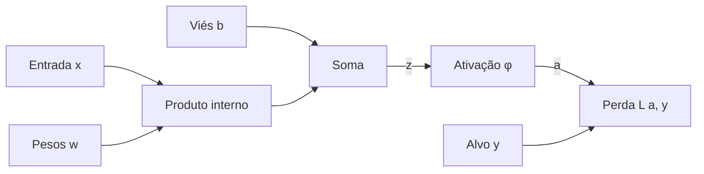
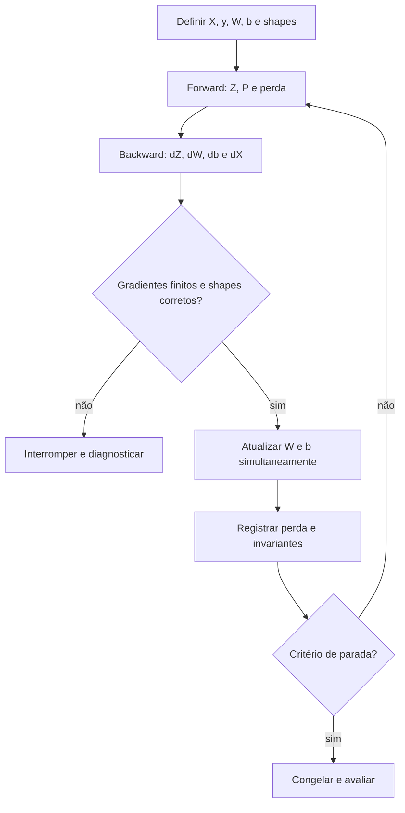

<!-- mirandastech-aula-v2 -->

# Aula 01 — Do modelo linear ao neurônio artificial

- **Trilha:** Especialista em IA
- **Módulo:** M5 · Redes Neurais do Zero
- **Pré-requisitos:** álgebra linear, derivadas, regra da cadeia, gradiente descendente e o Gate II de ML clássico
- **Objetivo central:** construir um neurônio artificial como composição de operações, executar o *forward* e derivar $\partial L/\partial W$, $\partial L/\partial b$ e $\partial L/\partial X$ sem *autograd*

## O problema que abre a trilha

No [Gate II de Machine Learning](../../../03-machine-learning/aulas/24-gate-ii-experimento-ml-classico.md), treinamos modelos por APIs de alto nível. Isso é suficiente para muitos projetos, mas deixa uma caixa-preta entre a matriz de dados e a atualização dos parâmetros. Para entender redes profundas, precisamos abrir essa caixa.

Imagine um sistema de triagem que recebe $d$ medidas de uma ocorrência e produz um *score*. Como cada entrada altera esse score? Como o erro chega aos pesos? Por que uma matriz transposta aparece no gradiente? E como distinguir uma derivada correta de código que apenas executa?

Começaremos pela menor unidade útil: uma transformação afim, uma ativação e uma perda. Ela já contém os ingredientes que reaparecem em camadas densas, projeções de atenção e blocos de redes modernas.

> **Fronteira curricular:** esta aula usa gradiente descendente para tornar o cálculo observável. A regra de aprendizagem do perceptron, seu critério de erro e seu teorema de convergência pertencem à Aula 02.

## Objetivos de aprendizagem

Ao final, você deverá conseguir:

1. separar entrada, parâmetro, pré-ativação, ativação, previsão e perda;
2. interpretar peso e viés sem analogias biológicas imprecisas;
3. executar o *forward* escalar e vetorizado;
4. derivar os gradientes locais da transformação afim;
5. aplicar a regra da cadeia até pesos, viés e entrada;
6. rastrear shapes e identificar *broadcasting* acidental;
7. implementar sigmoid e entropia cruzada binária de modo estável;
8. conferir gradientes analíticos com diferenças finitas;
9. explicar por que um neurônio separa OR, mas não XOR;
10. demonstrar por que empilhar operações afins sem ativação não aumenta expressividade.

## Vocabulário essencial

| Termo | Significado nesta aula |
|---|---|
| **parâmetro** | valor ajustado pelo treino, como $W$ e $b$ |
| **logit / pré-ativação** | valor $Z=XW+b$ antes da ativação |
| **ativação** | função $\phi$ aplicada ao logit |
| **forward** | cálculo da entrada até a perda |
| **backward** | propagação das derivadas em ordem inversa |
| **gradiente upstream** | derivada recebida de uma operação posterior |
| **derivada local** | derivada da operação atual em relação a sua entrada |
| **cache** | intermediários do *forward* guardados para o *backward* |
| **gradient checking** | comparação entre gradiente analítico e aproximação numérica |

## 1. Intuição: um neurônio é uma função parametrizada

Um neurônio artificial recebe números, combina-os com pesos, adiciona um deslocamento e aplica uma função:

$$
z=w^\top x+b, \qquad a=\phi(z).
$$

Aqui, $x\in\mathbb{R}^d$ é a entrada, $w\in\mathbb{R}^d$ contém os pesos, $b\in\mathbb{R}$ é o viés, $z$ é a pré-ativação e $a$ é a ativação. Uma perda escalar $L(a,y)$ compara a saída com o alvo $y$.

A palavra “neurônio” é histórica. A analogia com biologia deve parar cedo: o objeto estudado é uma composição de álgebra linear e funções. *Backpropagation* não exige imaginar dendritos; exige registrar dependências, derivadas locais e shapes.

Os pesos também não são “importâncias” universais. Sinal e magnitude dependem de escala, codificação, correlação e das demais operações. O viés desloca a fronteira; sem ele, o hiperplano seria forçado a passar pela origem.

O fluxo acima é um grafo computacional. O *forward* segue as setas; o *backward* percorre-as ao contrário.

## 2. A transformação afim e suas derivadas locais

Para $x,w\in\mathbb{R}^d$:

$$
z=\sum_{j=1}^{d}w_jx_j+b.
$$

As derivadas locais são:

$$
\frac{\partial z}{\partial w_j}=x_j,\qquad
\frac{\partial z}{\partial x_j}=w_j,\qquad
\frac{\partial z}{\partial b}=1.
$$

Se $a=\phi(z)$ e $L$ é escalar, a regra da cadeia introduz o sinal

$$
\delta=\frac{\partial L}{\partial z}
=\frac{\partial L}{\partial a}\frac{\partial a}{\partial z}.
$$

Multiplicar a derivada local pelo gradiente recebido produz:

$$
\frac{\partial L}{\partial w_j}=\delta x_j,\qquad
\frac{\partial L}{\partial b}=\delta,\qquad
\frac{\partial L}{\partial x_j}=\delta w_j.
$$

$\partial L/\partial x$ é importante mesmo quando não atualizamos a entrada. Em uma rede, ele é o gradiente que a operação anterior receberá.

## 3. Forma vetorizada e contrato de shapes

Adotaremos exemplos nas linhas. Para um lote com $n$ exemplos e $d$ atributos:

| Objeto | Shape | Papel |
|---|---:|---|
| $X$ | $(n,d)$ | lote de entradas |
| $W$ | $(d,1)$ | pesos de um neurônio |
| $b$ | $(1,)$ | viés compartilhado no lote |
| $Z=XW+b$ | $(n,1)$ | um logit por exemplo |
| $A=\phi(Z)$ | $(n,1)$ | uma ativação por exemplo |
| $dZ$ | $(n,1)$ | gradiente em relação aos logits |

No *backward*:

$$
dW=X^\top dZ,\qquad
db=\sum_{i=1}^{n}dZ_i,\qquad
dX=dZ W^\top.
$$

O produto $X^\top dZ$ tem shape $(d,n)(n,1)=(d,1)$, igual a $W$. A soma de $dZ$ sobre exemplos preserva uma dimensão e resulta em $(1,)$. Por fim, $(n,1)(1,d)=(n,d)$, igual a $X$.

O fator $1/n$ depende da definição da perda. Se a perda é a média do lote, ele pode estar em $dZ$. Dividir também em $dW$ e $db$ reduziria o gradiente duas vezes; esquecê-lo faria a taxa efetiva crescer com o lote.

## 4. Exemplo resolvido: ReLU e perda quadrática

Considere

$$
x=[2,-1]^\top,\quad w=[0{,}5,-2]^\top,\quad b=-0{,}5,
$$

ativação $a=\operatorname{ReLU}(z)=\max(0,z)$, alvo $y=1{,}5$ e perda $L=\tfrac12(a-y)^2$.

### Forward

$$
z=0{,}5(2)+(-2)(-1)-0{,}5=2{,}5,
$$

$$
a=2{,}5,\qquad L=\frac12(2{,}5-1{,}5)^2=0{,}5.
$$

### Backward

Como $z>0$, $\partial a/\partial z=1$. Além disso, $\partial L/\partial a=a-y=1$. Logo, $\delta=1$:

$$
\frac{\partial L}{\partial w}=[2,-1]^\top,\quad
\frac{\partial L}{\partial b}=1,\quad
\frac{\partial L}{\partial x}=[0{,}5,-2]^\top.
$$

### Uma atualização

Com $\eta=0{,}1$:

$$
w'=[0{,}3,-1{,}9]^\top,\qquad b'=-0{,}6.
$$

Então $z'=1{,}9$ e $L'=0{,}08$. A perda caiu de $0{,}5$ para $0{,}08$. A aproximação de primeira ordem previa $\Delta L\approx-0{,}6$, enquanto a mudança real foi $-0{,}42$: o gradiente descreve uma vizinhança, não toda a superfície.

Se $z<0$, a derivada da ReLU é zero nessa região. Nesse exemplo, o sinal deixa de atravessar a ativação. No ponto $z=0$, a função não é diferenciável; bibliotecas adotam uma convenção, frequentemente derivada zero.

## 5. Classificação binária sem instabilidade numérica

Para produzir probabilidade, usamos a sigmoid:

$$
p=\sigma(z)=\frac{1}{1+e^{-z}}.
$$

A entropia cruzada binária por exemplo é

$$
\ell(p,y)=-[y\log p+(1-y)\log(1-p)].
$$

Derivando:

$$
\frac{\partial \ell}{\partial p}
=-\frac{y}{p}+\frac{1-y}{1-p},
\qquad
\frac{\partial p}{\partial z}=p(1-p).
$$

Ao multiplicar e simplificar:

$$
\frac{\partial \ell}{\partial z}=p-y.
$$

Para uma média sobre $n$ exemplos, $dZ=(P-y)/n$.

### Por que calcular BCE a partir dos logits

Avaliar sigmoid ingênua pode causar *overflow* em $e^{-z}$; calcular $\log(p)$ pode atingir $\log(0)$. Em vez de esconder o problema com *clipping*, usamos a identidade estável

$$
\operatorname{BCELogits}(z,y)=
\max(z,0)-yz+\log(1+e^{-|z|}).
$$

O notebook também calcula a sigmoid por ramos. Para $[-1000,0,1000]$, retorna exatamente $[0,0{,}5,1]$ sem avisos numéricos.

## 6. Do forward à atualização

O ciclo completo é:

O *cache* mínimo guarda valores do *forward* necessários ao *backward*. Atualizações devem ser simultâneas: calcule todos os gradientes com os mesmos parâmetros e só depois altere $W$ e $b$.

## 7. Gradient checking: teste independente da derivação

Para um parâmetro $\theta_j$, diferenças centrais aproximam:

$$
g_j^{\text{num}}=
\frac{L(\theta_j+h)-L(\theta_j-h)}{2h}.
$$

Compare com $g_j^{\text{ana}}$ usando, por exemplo,

$$
e_j=\frac{|g_j^{\text{ana}}-g_j^{\text{num}}|}
{\max(1,|g_j^{\text{ana}}|,|g_j^{\text{num}}|)}.
$$

Diferenças centrais custam duas avaliações por parâmetro. São apropriadas para testes pequenos, não para treinar a rede. O passo $h$ também importa: grande demais gera erro de truncamento; pequeno demais amplifica cancelamento em ponto flutuante.

No laboratório, o maior erro relativo em $W$ e $b$ foi $3{,}668\times10^{-12}$ com $h=10^{-5}$. Uma derivada direcional independente verificou $dX$ com erro absoluto $1{,}953\times10^{-11}$.

> Um *gradient check* aprovado mostra concordância local entre código analítico e cálculo numérico. Ele não prova que a perda representa o negócio, que os dados não vazam futuro ou que o modelo generaliza.

## 8. O que o neurônio consegue representar

### OR: uma fronteira linear basta

Na porta OR, somente $(0,0)$ pertence à classe zero. Uma reta pode separar esse ponto dos outros três. Com seed fixa, taxa $0{,}8$ e 2.500 passos, o laboratório obteve:

| Resultado | Valor confirmado |
|---|---:|
| BCE final | $0{,}00458755$ |
| acurácia nos quatro casos | $1{,}0$ |
| $p(0,0)$ | $0{,}010160$ |
| $p(0,1)$ | $0{,}995939$ |
| $p(1,0)$ | $0{,}995939$ |
| $p(1,1)$ | $1{,}000000$ |

Esses quatro pontos constituem a população lógica completa. O resultado verifica implementação e capacidade representacional; não estima generalização para uma população externa.

### XOR: uma contraprova geométrica

Em XOR, os positivos são $(0,1)$ e $(1,0)$; os negativos são $(0,0)$ e $(1,1)$. Vértices opostos compartilham classe, então nenhuma reta os separa perfeitamente. Em 20 inicializações, o melhor neurônio alcançou acurácia $0{,}5$ e BCE mínima $\log 2\approx0{,}69314718$.

Não é evidência de um otimizador “fraco”. É limite da família $w^\top x+b$.

### Duas camadas afins ainda são uma

Sem ativação entre camadas:

$$
(XW_1+b_1)W_2+b_2
=X(W_1W_2)+(b_1W_2+b_2).
$$

Definindo $\widetilde W=W_1W_2$ e $\widetilde b=b_1W_2+b_2$, recuperamos uma única camada afim. O laboratório confirmou as duas expressões com erro máximo $3{,}553\times10^{-15}$. A não linearidade é o ingrediente que impede esse colapso.

## 9. Conexões com sistemas reais e IA

- **Classificação:** a última camada produz logits; a decisão por *threshold* é uma política posterior, orientada por custo e risco.
- **Redes profundas:** $dX$ transmite crédito ou responsabilidade às camadas anteriores.
- **CNNs:** a operação muda de produto matricial para convolução, mas mantém *forward*, cache, gradiente upstream e derivadas locais.
- **Transformers e LLMs:** projeções de consultas, chaves, valores e blocos *feed-forward* incluem transformações afins em lote.
- **Pesquisa:** gradient checking é evidência de correção de implementação, distinta de validade estatística e validade externa.
- **Produção:** estabilidade numérica, shapes explícitos e testes de invariantes reduzem falhas silenciosas, mas não substituem monitoramento.

## 10. Armadilhas e limites

| Armadilha | Sintoma | Correção |
|---|---|---|
| chamar $Wx+b$ de linear | confusão sobre o papel do viés | usar “transformação afim” |
| misturar $z$, $a$ e classe | derivada aplicada ao objeto errado | nomear cada etapa |
| broadcasting acidental | resultado executa com shape incorreto | fazer asserts de shapes |
| dividir pelo lote duas vezes | aprendizado muito lento | localizar o $1/n$ na derivação |
| esquecer a média | gradiente depende do tamanho do lote | alinhar redução da perda e backward |
| sigmoid ingênua | overflow para logits extremos | implementação por ramos |
| BCE após probabilidade arredondada | $\log(0)$ e gradiente perdido | BCE estável com logits |
| atualizar $W$ antes de calcular $db$ | gradientes de estados diferentes | atualizar após todo o backward |
| interpretar peso como causalidade | narrativa sem identificação causal | limitar-se à função ajustada |
| culpar o treino pelo XOR | buscas intermináveis de taxa/seed | auditar capacidade representacional |

Outros limites: um exemplo lógico não demonstra robustez; reduzir a perda de treino não garante generalização; e um gradiente correto ainda pode ser numericamente mal condicionado em redes profundas.

## 11. Laboratório reproduzível

O [notebook da Aula 01](../notebooks/01-neuronio-artificial-laboratorio.ipynb) usa apenas NumPy e Matplotlib. Ele contém 27 células, sendo 13 de código, seed fixa e dados explícitos.

Você executará:

1. o exemplo escalar com ReLU;
2. sigmoid estável e BCE com logits;
3. *forward* e *backward* vetorizados;
4. gradient checking de $W$, $b$ e $X$;
5. varredura do passo numérico $h$;
6. treinamento e fronteira da porta OR;
7. contraprova com XOR;
8. colapso de duas camadas afins;
9. sete contratos automáticos consolidados.

### Checklist antes de considerar o laboratório concluído

- [ ] Executei todas as células em ordem, sem avisos.
- [ ] Consigo explicar cada dimensão da tabela de shapes.
- [ ] Sei onde entra o fator $1/n$.
- [ ] O gradient check cobre pesos, viés e entrada.
- [ ] Não usei *autograd* nem framework de deep learning.
- [ ] Distingo classificação perfeita da OR de generalização estatística.
- [ ] Expliquei XOR por geometria, não por tentativa de hiperparâmetros.
- [ ] Consigo colapsar duas transformações afins algebricamente.

## 12. Exercícios com respostas comentadas

### 1. Derivação por diferenciais

Derive os gradientes de $z=w^\top x+b$.

**Resposta:** $dz=x^\top dw+w^\top dx+db$. Comparando coeficientes, $\partial z/\partial w=x$, $\partial z/\partial x=w$ e $\partial z/\partial b=1$. Multiplique todos por $\delta=\partial L/\partial z$.

### 2. Sigmoid com BCE

Por que $\partial\ell/\partial z=p-y$?

**Resposta:** multiplique $[-y/p+(1-y)/(1-p)]$ por $p(1-p)$. Os termos se reduzem a $p-y$. Para perda média, divida por $n$.

### 3. Shapes

Se $X$ tem shape $(32,10)$ e há um neurônio, quais são os shapes de $W$, $Z$, $dW$ e $dX$?

**Resposta:** $(10,1)$, $(32,1)$, $(10,1)$ e $(32,10)$, respectivamente.

### 4. Gradiente do viés

Por que $db$ soma sobre exemplos?

**Resposta:** o mesmo $b$ participa de todos os $z_i$. Pela regra da cadeia, as contribuições de todos os caminhos até $b$ se somam.

### 5. Passo numérico

Por que reduzir $h$ indefinidamente não melhora o gradient check?

**Resposta:** diferenças menores reduzem truncamento até certo ponto; depois, subtrair números quase iguais perde dígitos significativos e o arredondamento domina.

### 6. Atualização de primeira ordem

Para $\Delta\theta=-\eta\nabla L$, qual mudança local esperamos?

**Resposta:** $\Delta L\approx-\eta\|\nabla L\|^2\le0$. Isso vale localmente; taxa grande pode sair dessa região.

### 7. XOR

Mais épocas garantem solução perfeita de XOR com um neurônio?

**Resposta:** não. Mais épocas não mudam a família de fronteiras lineares. É preciso criar representação não linear, tema que será desenvolvido ao construir o MLP.

### 8. Duas camadas sem ativação

Mostre como colapsá-las.

**Resposta:** use associatividade: $(XW_1+b_1)W_2+b_2=X(W_1W_2)+(b_1W_2+b_2)$. Os termos entre parênteses são novos peso e viés.

### 9. ReLU negativa

O que acontece ao gradiente quando $z<0$?

**Resposta:** como a derivada local é zero, o gradiente para $w$, $b$ e $x$ vindo desse caminho também zera. Em redes, persistência desse estado pode produzir unidades “mortas”.

## Resumo

- Um neurônio compõe transformação afim, ativação e perda.
- O *backward* multiplica gradiente upstream por derivadas locais.
- $dW=X^\top dZ$, $db=\sum dZ$ e $dX=dZW^\top$ devem respeitar shapes.
- Sigmoid por ramos e BCE com logits evitam instabilidade nos extremos.
- Diferenças centrais auditam gradientes, mas não validam o problema.
- OR é linearmente separável; XOR não é.
- Camadas afins empilhadas sem não linearidade colapsam em uma só.

## Critério de domínio

Você domina a aula quando consegue desenhar o grafo computacional, executar o exemplo sem consultar o texto, derivar os três gradientes, implementar a versão vetorizada, justificar o fator da média, realizar gradient checking e explicar os limites de XOR e de camadas afins empilhadas.

## Referências técnicas

- Goodfellow, Bengio e Courville — [Deep Learning](https://www.deeplearningbook.org/), capítulo 6.
- Stanford CS231n — [Backpropagation, Intuitions](https://cs231n.github.io/optimization-2/) e [Neural Networks Part 1](https://cs231n.github.io/neural-networks-1/).
- Dive into Deep Learning — [Forward Propagation, Backward Propagation, and Computational Graphs](https://d2l.ai/chapter_multilayer-perceptrons/backprop.html).
- Prince — [Understanding Deep Learning](https://udlbook.github.io/udlbook/), capítulo 3.
- Rumelhart, Hinton e Williams (1986) — [Learning representations by back-propagating errors](https://www.nature.com/articles/323533a0).

Referências verificadas em **9 de setembro de 2026**. As três primeiras são recursos oficiais ou livros abertos; o artigo de 1986 é fonte histórica primária.

## Próxima aula

**Aula 02 — Perceptron e regra de aprendizagem:** separação linear, atualização por erro, convergência e limites.
