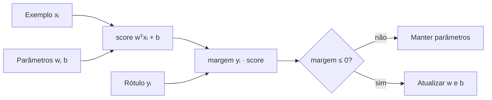
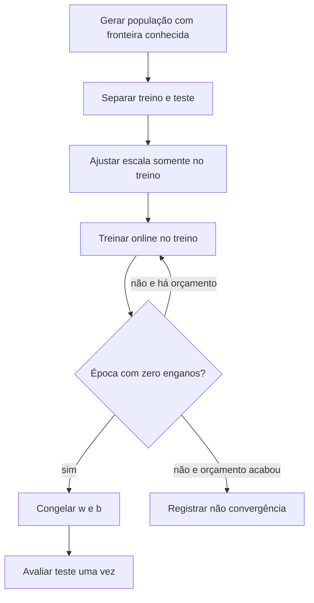

<!-- mirandastech-aula-v2 -->

# Aula 02 — Perceptron e regra de aprendizagem

- **Trilha:** Especialista em IA
- **Módulo:** M5 · Redes Neurais do Zero
- **Pré-requisito:** [Aula 01 — Do modelo linear ao neurônio artificial](./01-neuronio-artificial.md)
- **Objetivo central:** implementar o perceptron em NumPy, explicar sua atualização por erro e delimitar rigorosamente quando há garantia de convergência

[](https://colab.research.google.com/github/joaopaulomirandamatias/ai-lab/blob/main/04-deep-learning/m5-redes-neurais-do-zero/notebooks/02-perceptron-regra-aprendizagem-laboratorio.ipynb)

## O problema motivador

Na aula anterior, calculamos uma probabilidade com sigmoid e minimizamos uma perda diferenciável. Mas será que um classificador precisa de probabilidade ou gradiente suave para aprender uma fronteira?

Considere uma esteira industrial que recebe duas medidas de uma peça e deve emitir apenas `aprovar` ou `rejeitar`. Quando a regra atual erra um exemplo, queremos deslocar a fronteira na direção que favoreça sua classe. O perceptron transforma essa ideia em um algoritmo online extremamente simples.

Ele também oferece uma primeira garantia matemática de aprendizagem: se os exemplos forem linearmente separáveis com margem positiva, o número de erros durante o treino é finito. A garantia é poderosa, mas condicionada. Rótulos contraditórios, XOR, ruído e mudanças de distribuição quebram suas hipóteses.

> **Precisão histórica:** o modelo descrito por Rosenblatt em 1958 era mais amplo que o classificador linear hoje chamado de “algoritmo do perceptron”. Nesta aula estudamos essa formulação didática moderna, com função limiar e atualização online.

## Objetivos de aprendizagem

Ao final, você deverá conseguir:

1. representar classificação binária com rótulos em $\{-1,+1\}$;
2. calcular score, classe e margem funcional;
3. executar a atualização exemplo a exemplo;
4. provar que a atualização aumenta a margem do exemplo corrigido;
5. distinguir época, atualização e engano;
6. enunciar e demonstrar o limite clássico de enganos;
7. explicar a função da margem geométrica e do raio dos dados;
8. reconhecer dependência da ordem e não unicidade da solução;
9. demonstrar por que o perceptron não produz probabilidades;
10. tratar dados não separáveis com orçamento explícito e algoritmo *pocket*.

## Vocabulário

| Termo | Definição |
|---|---|
| **score** | $s(x)=w^\top x+b$, valor assinado antes da decisão |
| **função limiar** | converte o score em $-1$ ou $+1$ |
| **margem funcional** | $y_i(w^\top x_i+b)$ |
| **violação** | exemplo com margem não positiva, que provoca atualização |
| **online** | parâmetros atualizados após cada exemplo |
| **época** | uma passagem completa pelos exemplos de treino |
| **separabilidade linear** | existência de um hiperplano que acerta todos os rótulos |
| **pocket** | melhor estado observado, guardado durante treino não convergente |

## 1. Do neurônio ao classificador limiar

O score continua sendo uma transformação afim:

$$
s(x)=w^\top x+b.
$$

Adotaremos a decisão

$$
\hat y=
\begin{cases}
+1, & s(x)\ge0,\\
-1, & s(x)<0.
\end{cases}
$$

$w\in\mathbb{R}^d$ define a orientação do hiperplano; $b\in\mathbb{R}$ o desloca. O conjunto $w^\top x+b=0$ é a fronteira de decisão.

Para rótulo verdadeiro $y_i\in\{-1,+1\}$, o produto

$$
m_i=y_i(w^\top x_i+b)
$$

resume o estado do exemplo:

| Margem funcional | Situação |
|---:|---|
| $m_i>0$ | classe correta |
| $m_i=0$ | exatamente na fronteira; o treino atualiza por convenção |
| $m_i<0$ | classe incorreta |

A margem funcional muda se multiplicarmos $(w,b)$ por uma constante. A distância assinada ao hiperplano é $m_i/\lVert w\rVert$ e remove essa arbitrariedade de escala. Embora a predição atribua o empate $s=0$ a $+1$, o treino trata $m_i=0$ conservadoramente como violação, qualquer que seja o rótulo.



## 2. A regra de aprendizagem

Com taxa $\eta>0$, quando $m_i\le0$:

$$
w\leftarrow w+\eta y_i x_i,
\qquad
b\leftarrow b+\eta y_i.
$$

Se $y_i=+1$, somamos $x_i$ a $w$; se $y_i=-1$, subtraímos. Em ambos os casos, a mudança favorece o rótulo verdadeiro.

### Prova local da correção

Considere o score do mesmo exemplo antes e depois da atualização:

$$
s_i'= (w+\eta y_i x_i)^\top x_i+(b+\eta y_i).
$$

Logo,

$$
s_i'-s_i=\eta y_i(\lVert x_i\rVert^2+1).
$$

Multiplicando por $y_i$ e usando $y_i^2=1$:

$$
m_i'-m_i=\eta(\lVert x_i\rVert^2+1)>0.
$$

A margem do exemplo atualizado sempre aumenta. Isso não garante que outros exemplos melhorem: a mesma mudança pode reduzir suas margens. O treinamento é uma sequência de correções potencialmente conflitantes.

### Forma com entrada aumentada

Podemos incorporar o viés:

$$
\tilde x_i=\begin{bmatrix}x_i\\1\end{bmatrix},
\qquad
\tilde w=\begin{bmatrix}w\\b\end{bmatrix}.
$$

Assim, $w^\top x_i+b=\tilde w^\top\tilde x_i$ e a regra vira uma única operação:

$$
\tilde w\leftarrow\tilde w+\eta y_i\tilde x_i.
$$

Essa notação simplifica a prova de convergência. O valor escolhido para a coordenada constante também altera a geometria do espaço aumentado; usar 1 é uma convenção explícita.

## 3. Exemplo resolvido passo a passo

Comece com $w=[0,0]^\top$, $b=0$ e $\eta=1$. O primeiro exemplo é $x_1=[2,1]^\top$, $y_1=+1$.

$$
s_1=0,\qquad m_1=0.
$$

Como $m_1\le0$:

$$
w\leftarrow[0,0]^\top+[2,1]^\top=[2,1]^\top,
\qquad b\leftarrow1.
$$

Para $x_2=[-1,-2]^\top$, $y_2=-1$:

$$
s_2=2(-1)+1(-2)+1=-3,
\qquad m_2=(-1)(-3)=3>0.
$$

Não há atualização. Os exemplos seguintes $([1,2],+1)$ e $([-2,-1],-1)$ também têm margens positivas. Uma única correção encontrou um separador para esse conjunto.

## 4. Algoritmo online completo

```text
inicialize w = 0 e b = 0
para cada época até max_epochs:
    enganos = 0
    escolha uma ordem dos exemplos
    para cada (xᵢ, yᵢ):
        se yᵢ(wᵀxᵢ + b) ≤ 0:
            w ← w + ηyᵢxᵢ
            b ← b + ηyᵢ
            enganos ← enganos + 1
    se enganos = 0:
        declare convergência e pare
```

É importante distinguir:

- **predição:** calcular classe sem alterar estado;
- **violação:** margem não positiva que dispara uma atualização;
- **época sem enganos:** evidência de separação do treino naquela ordem;
- **orçamento esgotado:** parada operacional, não convergência.

O embaralhamento deve ser reprodutível. A ordem não é detalhe: diferentes sequências podem produzir diferentes separadores e diferentes números de atualizações.

## 5. Teorema de convergência e limite de enganos

Considere a formulação homogênea com vetores aumentados. Suponha que exista um vetor unitário $u$, $\lVert u\rVert=1$, tal que

$$
y_i u^\top\tilde x_i\ge\gamma>0
$$

para todo exemplo, e que

$$
\lVert\tilde x_i\rVert\le R.
$$

Com $\eta=1$ e $\tilde w_0=0$, o perceptron executa no máximo

$$
M\le\left(\frac{R}{\gamma}\right)^2
$$

atualizações por violações. A literatura costuma chamá-las de *mistakes*; nossa contagem inclui também empates no limiar.

### Passo 1 — progresso na direção do separador

Em cada engano:

$$
\tilde w_{t+1}^\top u
=\tilde w_t^\top u+y_i\tilde x_i^\top u
\ge\tilde w_t^\top u+\gamma.
$$

Após $M$ atualizações:

$$
\tilde w_M^\top u\ge M\gamma.
$$

### Passo 2 — crescimento limitado da norma

Como só atualizamos quando $y_i\tilde w_t^\top\tilde x_i\le0$:

$$
\begin{aligned}
\lVert\tilde w_{t+1}\rVert^2
&=\lVert\tilde w_t+y_i\tilde x_i\rVert^2\\
&=\lVert\tilde w_t\rVert^2
+2y_i\tilde w_t^\top\tilde x_i
+\lVert\tilde x_i\rVert^2\\
&\le\lVert\tilde w_t\rVert^2+R^2.
\end{aligned}
$$

Portanto, $\lVert\tilde w_M\rVert^2\le MR^2$.

### Passo 3 — combine com Cauchy–Schwarz

$$
M\gamma
\le\tilde w_M^\top u
\le\lVert\tilde w_M\rVert\lVert u\rVert
\le\sqrt{M}R.
$$

Para $M>0$, isso implica $\sqrt{M}\gamma\le R$ e, finalmente, $M\le(R/\gamma)^2$.

### O que o teorema não afirma

- não garante poucos enganos quando $\gamma$ é minúsculo;
- não garante solução única nem margem máxima;
- não vale quando não existe separador com margem positiva;
- não fornece probabilidade nem calibração;
- não garante generalização fora da amostra;
- não corrige *data leakage*, rótulos errados ou mudança de distribuição.

## 6. Evidência reproduzível

O laboratório gera 480 pontos e remove uma faixa de largura conhecida ao redor da fronteira verdadeira. Depois separa 360 exemplos para treino e 120 para teste. Média e desvio são aprendidos somente no treino.

Com seed fixa, o perceptron convergiu em 4 épocas e 19 enganos:

| Quantidade | Valor confirmado |
|---|---:|
| $R$ no espaço aumentado | $2{,}528350$ |
| margem mínima $\gamma$ | $0{,}164552$ |
| limite $(R/\gamma)^2$ | $236{,}084$ |
| enganos observados | $19$ |
| acurácia de treino | $1{,}0$ |
| acurácia no teste reservado | $1{,}0$ |

O limite é conservador, como é comum em garantias de pior caso. O resultado perfeito no teste decorre da população sintética, da fronteira linear verdadeira e da faixa removida. Não deve ser generalizado para dados reais.



## 7. Ordem, escala e solução não única

Em 30 embaralhamentos do mesmo treino, todas as execuções convergiram, mas usaram entre 7 e 19 enganos; a mediana foi 11. Os separadores normalizados não foram idênticos: o menor cosseno entre pares foi $0{,}984701$.

Isso revela três fatos:

1. há muitos hiperplanos que separam o conjunto;
2. o primeiro encontrado depende da trajetória;
3. reprodutibilidade exige registrar ordem ou seed.

Escala também importa. A regra soma diretamente os atributos aos pesos, e o limite contém $R$. Multiplicar uma feature por mil muda trajetória, geometria e condicionamento. Se houver padronização, seus parâmetros devem ser estimados somente nos dados de treino.

O perceptron clássico não busca margem máxima. Esse objetivo pertence a métodos como SVM, estudados no módulo anterior; aqui a pergunta é mais simples: encontrar algum separador.

## 8. Por que o score não é probabilidade

Se $c>0$:

$$
\operatorname{sign}(cw^\top x+cb)
=\operatorname{sign}(w^\top x+b).
$$

As classes são idênticas, mas todos os scores são multiplicados por $c$. No laboratório, escalar os parâmetros por 50 preservou 100% das classes e alterou a mediana do score absoluto de $4{,}587816$ para $229{,}390799$.

Portanto, score 20 não representa 20%, nem é necessariamente mais confiável que score 2 de outro modelo. Para probabilidade, precisamos de modelo e perda apropriados, além de avaliar calibração. Essa foi a distinção central da regressão logística no M4.

| Aspecto | Perceptron | Regressão logística |
|---|---|---|
| saída nativa | classe/score | probabilidade modelada |
| ativação | limiar | sigmoid |
| atualização | apenas em erros | todos os exemplos contribuem |
| objetivo suave | não na formulação clássica | log-loss diferenciável |
| separável sem regularização | para após achar separador | pesos podem crescer sem ótimo finito |
| calibração | não aplicável ao score cru | deve ser verificada |

## 9. Quando não há separador

XOR atribui a mesma classe a vértices opostos. Nenhuma reta separa os quatro pontos. No laboratório, com ordem fixa e 80 épocas, o perceptron fez exatamente 4 atualizações por época, totalizou 320 enganos, não convergiu e terminou com acurácia $0{,}5$.

Sem `max_epochs`, o laço poderia continuar indefinidamente. “A perda ainda não caiu” nem sequer é uma descrição adequada: a formulação clássica não acompanha uma perda probabilística suave.

### Pocket

O algoritmo *pocket* guarda os parâmetros com menor erro de treino observados durante uma execução limitada. Em XOR, conservou uma solução com 1 erro e acurácia $0{,}75$, o máximo possível para uma fronteira linear nessa configuração.

Isso é uma mitigação, não uma cura:

- o melhor estado depende de ordem, seed e orçamento;
- escolher pela mesma amostra cria risco de otimismo;
- erro menor não transforma a classe em probabilidade;
- dados contraditórios exigem investigação de rótulos e unidade de análise.

Uma alternativa histórica é o perceptron médio, que acumula os parâmetros ao longo das atualizações e usa sua média para predição. Ele pode reduzir variância, mas também não restaura a garantia quando as hipóteses falham.

## 10. Armadilhas frequentes

| Erro | Consequência | Prevenção |
|---|---|---|
| usar rótulos $0/1$ na regra $w+\eta yx$ | classe zero nunca move $w$ | converter para $-1/+1$ ou derivar outra forma |
| tratar score zero como acerto | exemplo fica sobre a fronteira | atualizar quando margem $\le0$ |
| esquecer o viés | fronteira presa à origem | atualizar $b$ ou aumentar a entrada |
| atualizar lote inteiro como no gradiente | muda o algoritmo online | processar um exemplo por vez |
| parar por acurácia alta, mas não perfeita | confundir orçamento com convergência | declarar critério de parada |
| executar infinitamente em XOR | laço sem término | usar `max_epochs` e diagnóstico |
| chamar score de probabilidade | decisão de risco mal calibrada | separar score, classe e probabilidade |
| escalar antes do split | vazamento de estatística do teste | ajustar transformação no treino |
| comparar pesos de execuções sem normalizar | confundir escala com orientação | comparar hiperplanos normalizados |
| dizer que convergência prova generalização | extrapolação indevida | avaliar conjunto externo |

## 11. Laboratório reproduzível

O [notebook da Aula 02](../notebooks/02-perceptron-regra-aprendizagem-laboratorio.ipynb) possui 25 células, 12 de código e 12 contratos consolidados. Ele usa apenas NumPy e Matplotlib.

### Checklist prático

- [ ] Sei converter $0/1$ para $-1/+1$ sem trocar a classe positiva.
- [ ] Registro score e margem antes da atualização.
- [ ] Atualizo peso e viés com o mesmo estado.
- [ ] Embaralhamento possui seed fixa.
- [ ] `max_epochs` existe mesmo quando espero separabilidade.
- [ ] Padronização usa somente o treino.
- [ ] Convergência significa uma época completa sem enganos.
- [ ] Calculo $R$ e $\gamma$ no mesmo espaço usado pelo algoritmo.
- [ ] Avalio o teste somente depois de congelar parâmetros.
- [ ] Relato quando as hipóteses do teorema não valem.

## 12. Exercícios com respostas comentadas

### 1. Converta a convenção de rótulos

Como converter $y\in\{0,1\}$ para $t\in\{-1,+1\}$?

**Resposta:** $t=2y-1$. A transformação inversa é $y=(t+1)/2$.

### 2. Faça uma atualização

Para $x=[1,-2]$, $y=-1$, $w=[2,1]$, $b=1$ e $\eta=0{,}5$, há atualização?

**Resposta:** $s=2(1)+1(-2)+1=1$ e $m=-1$. Atualize: $w'=[2,1]+0{,}5(-1)[1,-2]=[1{,}5,2]$ e $b'=0{,}5$.

### 3. Calcule o ganho local

Quanto aumenta a margem do exercício anterior?

**Resposta:** $\eta(\lVert x\rVert^2+1)=0{,}5(1+4+1)=3$. A margem passa de $-1$ para $2$.

### 4. Interprete o limite

Se $R=5$ e $\gamma=0{,}5$, qual é o limite?

**Resposta:** $(5/0{,}5)^2=100$ enganos. É teto sob as hipóteses, não quantidade esperada.

### 5. Reescale os parâmetros

Multiplicar $w$ e $b$ por 10 muda quais objetos?

**Resposta:** multiplica scores e margens funcionais por 10, mas preserva a fronteira e as classes. Por isso score cru não é probabilidade.

### 6. Ordem dos exemplos

Duas seeds convergiram com pesos diferentes. Há contradição com o teorema?

**Resposta:** não. O teorema garante finitude dos enganos, não unicidade do separador.

### 7. XOR

Por que aumentar `max_epochs` não resolve o problema estrutural?

**Resposta:** épocas adicionais não ampliam a família de hiperplanos. É necessária representação não linear, introduzida depois com múltiplas unidades e ativações.

### 8. Rótulos contraditórios

O mesmo $x$ aparece com $y=-1$ e $y=+1$. Pode existir separador perfeito?

**Resposta:** não, pois o mesmo score teria de ser simultaneamente negativo e positivo. Antes de trocar o algoritmo, investigue duplicidade, instante e qualidade do rótulo.

### 9. Viés aumentado

Quais vetores representam $x=[2,-1]$ e parâmetros $w=[3,4]$, $b=-2$?

**Resposta:** $\tilde x=[2,-1,1]$ e $\tilde w=[3,4,-2]$; o produto é $6-4-2=0$.

## Resumo

- O perceptron decide pelo sinal de $w^\top x+b$.
- A margem $y_i(w^\top x_i+b)$ determina se há atualização.
- Cada atualização aumenta a margem do exemplo corrigido.
- Separabilidade com margem $\gamma>0$ e raio $R$ implica até $(R/\gamma)^2$ enganos.
- Ordem e escala alteram trajetória e solução.
- O score não é probabilidade.
- Em dados não separáveis, orçamento e diagnóstico são obrigatórios; *pocket* apenas guarda o melhor estado observado.

## Critério de domínio

Você domina a aula quando implementa o algoritmo sem consultar material, reproduz a prova do limite, calcula shapes e margens, explica a dependência da ordem, distingue convergência de generalização e prevê corretamente o comportamento em XOR.

## Referências técnicas

- Rosenblatt, F. (1958) — [The perceptron: A probabilistic model for information storage and organization in the brain](https://doi.org/10.1037/h0042519).
- Novikoff, A. B. J. (1962) — [On convergence proofs for perceptrons](https://cs.uwaterloo.ca/~y328yu/classics/novikoff.pdf).
- Stanford CS229 — [Online Learning and the Perceptron Algorithm](https://cs229.stanford.edu/notes2021fall/cs229-notes6.pdf).
- Goodfellow, Bengio e Courville — [Deep Learning](https://www.deeplearningbook.org/), capítulos 5 e 6.
- Cornell — [Project: The Perceptron](https://www.cs.cornell.edu/courses/cs4780/2015fa/web/projects/02perceptron/02perceptron.html).

Referências primárias e institucionais verificadas em **9 de setembro de 2026**.

## Próxima aula

**Aula 03 — MLP, camadas densas e convenções de shape:** como organizar vários neurônios sem perder o contrato dimensional.
